# Amazon EC2 Linux 인스턴스 시작하기

https://docs.aws.amazon.com/ko_kr/AWSEC2/latest/UserGuide/EC2_GetStarted.html

* Amazon Elastic Compute Cloud 인스턴스를 시작, 연결 및 사용하여 Amazon EC2(Linux)를 시작합니다.
* 인스턴스는 AWS 클라우드의 가상 서버입니다.
* Amazon EC2를 사용하여 인스턴스에서 실행되는 운영 체제와 애플리케이션을 설정하고 구성할 수 있습니다.

## 개요

* 이 인스턴스는 Amazon EBS 지원 인스턴스(루트 볼륨이 EBS 볼륨임을 의미)입니다.
* 인스턴스가 실행되는 가용 영역을 지정하거나 적합한 가용 영역이 Amazon EC2에서 자동으로 선택할 수 있습니다.
* 인스턴스를 시작할 때 키 페어와 보안 그룹을 지정하여 인스턴스 보안을 설정합니다.
* 인스턴스에 연결할 때는 인스턴스 시작 시 지정한 키 페어의 프라이빗 키를 지정해야 합니다.

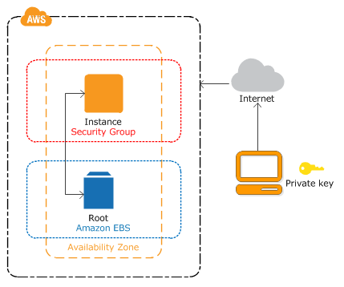

## 1단계 : 인스턴스 시작

1. https://console.aws.amazon.com/ec2/에서 Amazon EC2 콘솔을 엽니다.

2. 콘솔 대시보드에서 **인스턴스 시작**을 선택합니다.

   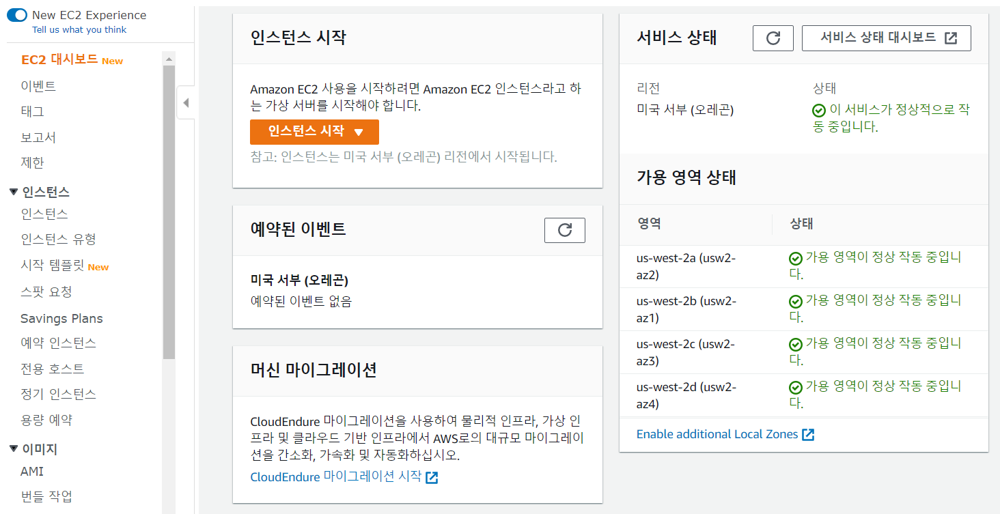

3. **Amazon Machine Image(AMI) 선택** 페이지에 인스턴스에 대한 템플릿 역할을 하는 *Amazon Machine Image(AMI)*라는 기본 구성 목록이 표시됩니다. Amazon Linux 2의 HVM 버전을 선택합니다.

   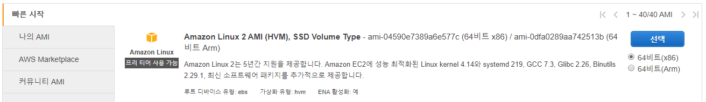

4. **인스턴스 유형 선택** 페이지에서 인스턴스의 하드웨어 구성을 선택할 수 있습니다. 기본적으로 선택된 `t2.micro` 유형을 선택합니다.

   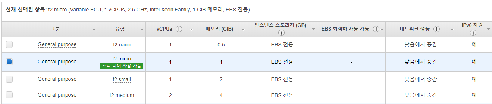

5. **인스턴스 세부 정보 구성** 페이지에서 요구 사항에 적합하게 인스턴스를 구성합니다.

   * 인스턴스 개수 : 1
   * 퍼블릭 IP 자동 할당 : 활성화
     * 퍼블릭 IP 자동 할당 옵션이 활성화 되어있지 않으면 해당 인스턴스에 연결할 수 없습니다.

   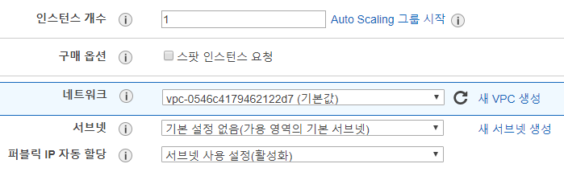

6. **스토리지 추가** 페이지에서 추가 EBS 볼륨 및 인스턴스 스토어 볼륨을 인스턴스에 연결하거나 루트 볼륨의 설정을 편집할 수 있습니다. (생략 가능)

   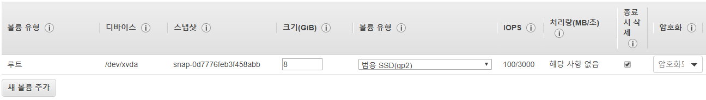

7. **태그 추가** 페이지에서 태그를 추가할 수 있습니다. (생략 가능)

   * 태그는 대소문자를 구별하는 키-값 페어로 이루어져 있습니다. 예를 들어 키가 Name이고 값이 Webserver인 태그를 정의할 수 있습니다.
   * 태그 복사본은 볼륨, 인스턴스 또는 둘 다에 적용될 수 있습니다.
   * 태그는 모든 인스턴스 및 볼륨에 적용됩니다.

8. **보안 그룹 구성** 페이지에서 특정 트래픽을 인스턴스에 도달하도록 허용할 규칙을 추가할 수 있습니다.

   * 보안 그룹은 인스턴스에 대한 트래픽을 제어하는 방화벽 규칙 세트입니다.
   * 예를 들면 웹 서버를 설정하여 인터넷 트래픽을 인스턴스에 도달하도록 허용하려는 경우 HTTP 및 HTTPS 트래픽에 대한 무제한 액세스를 허용하는 규칙을 추가합니다.
   * 새 보안 그룹을 생성하거나 아래에 나와 있는 기존 보안 그룹 중에서 선택할 수 있습니다.

   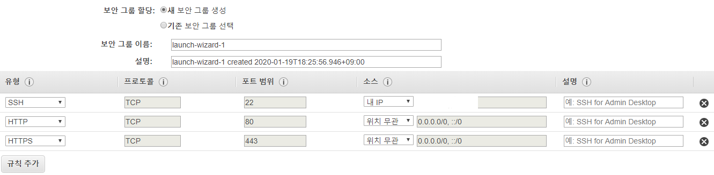

   * 새 보안 그룹 생성 선택한 뒤, 보안 그룹 이름 및 설명을 작성합니다.
   * 규칙 추가를 클릭해 HTTP, HTTPS 규칙을 추가하고, 소스는 위치 무관을 선택합니다.
   * SSH 액세스를 허용하는 보안 그룹을 사용하여 인스턴스를 시작한 경우가 아니면 인스턴스에 연결할 수 없습니다. SSH의 경우 소스를 내IP로 하는 것이 보안상 좋습니다.

9. **인스턴스 시작 검토** 페이지에서 인스턴스 시작 세부 정보를 검토할 수 있으며, 이전으로 돌아가서 각 섹션에 대한 변경 내용을 편집할 수 있습니다.

10. **시작하기** 버튼을 누르면 **기존 키 페어 선택 또는 새 키 페어 생성** 창이 뜹니다.

    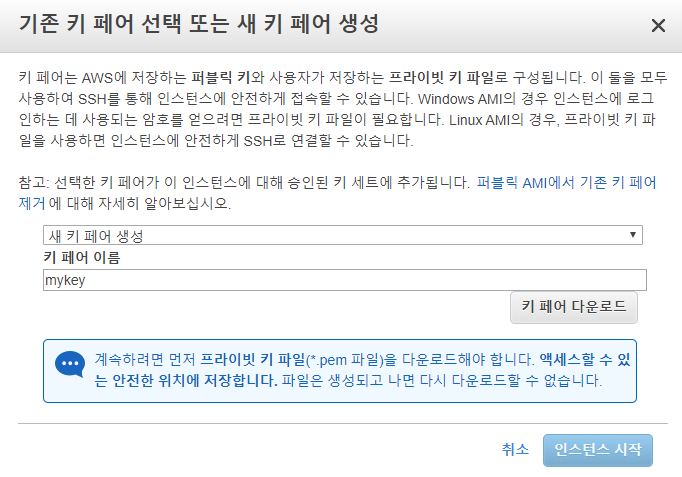

    * 새 키 페어 생성을 선택하고 키 페어 이름을 정합니다.
    * 키 페어 다운로드 버튼을 클릭하면 `mykey.pem` 파일이 다운로드 됩니다.
    * 인스턴스 시작 버튼을 클릭합니다.

11. 확인 페이지에서 인스턴스가 실행 중인지 확인할 수 있습니다. **인스턴스 보기**를 선택하여 확인 페이지를 닫고 콘솔로 돌아갑니다.

12. **인스턴스** 화면에서 시작 상태를 볼 수 있습니다. 인스턴스를 시작하는 데 약간 시간이 걸립니다. 인스턴스를 시작할 때 초기 상태는 `pending`입니다. 인스턴스가 시작된 후에는 상태가 `running`으로 바뀌고 퍼블릭 DNS 이름을 받습니다.

13. 연결할 수 있도록 인스턴스가 준비될 때까지 몇 분 정도 걸릴 수 있습니다. 인스턴스가 상태 확인을 통과했는지 확인하십시오. **상태 검사** 열에서 이 정보를 볼 수 있습니다.

## 2단계 : 인스턴스에 연결

1. **인스턴스** 화면에서 생성한 인스턴스를 클릭 후, 아래의 설명 탭을 통해 `IPv4 퍼블릭 IP`를 확인합니다.

   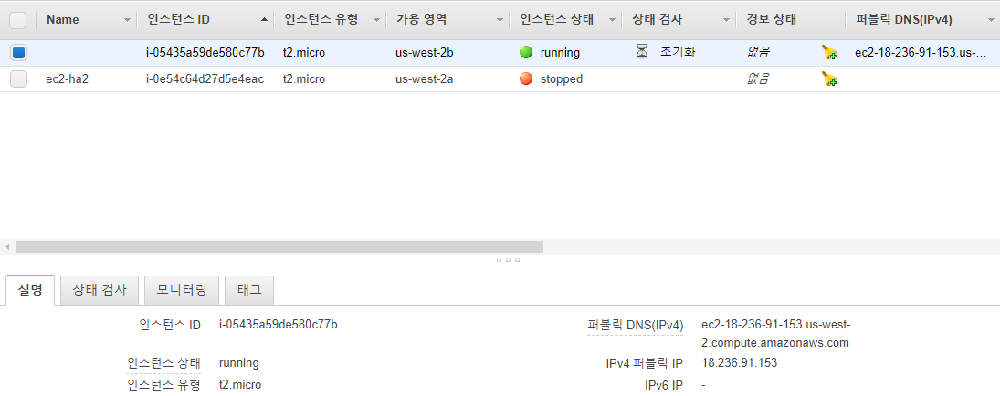

2. **Xshell 5** 를 실행한 뒤, `새로 만들기`를 클릭합니다.

3. **연결** 탭에서 이름을 정하고, 호스트에 앞에서 확인한 `IPv4 퍼블릭 IP` 를 입력합니다.

   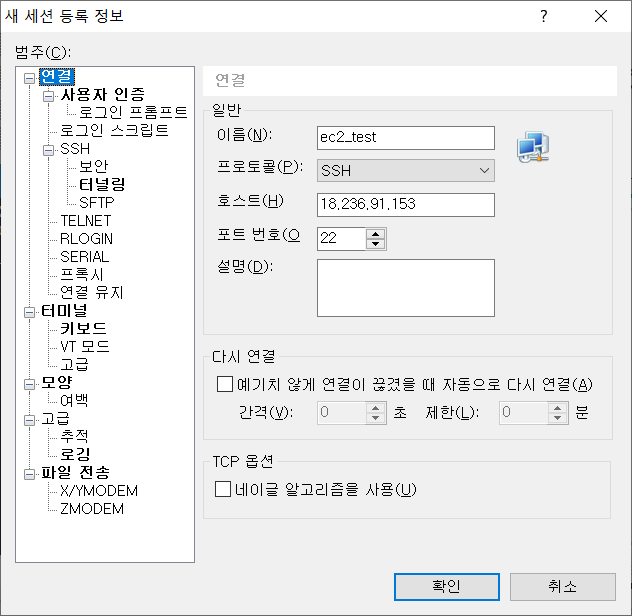

4. **사용자 인증** 탭에서 인증 방법을 Public Key로 선택하고, 사용자 이름에 `ec2-user`를 입력합니다.

5. **사용자 키, 찾아보기, 가져오기**를 차례로 선택하고, 인스턴스 생성 시 다운로드 받았던 `mykey.pem` 파일을 선택한 뒤 확인 버튼을 클릭합니다.

6. 인스턴스에 잘 연결된 것을 확인할 수 있습니다.

   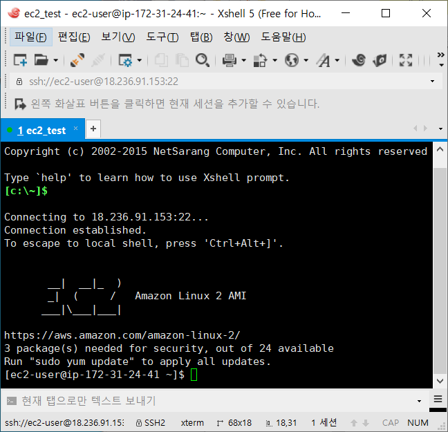

## 3단계 : 인스턴스 정리

1. 탐색 창에서 **인스턴스**를 선택합니다. 인스턴스 목록에서 인스턴스를 선택합니다.
2. **작업**, **인스턴스 상태**, **종료**를 차례로 선택합니다.
3. 확인 메시지가 나타나면 **예, 종료**를 선택합니다.
   * Amazon EC2가 인스턴스를 종료합니다. 인스턴스는 종료한 후에도 잠시 동안 콘솔에서 표시된 상태로 유지되며, 그 이후 항목이 삭제됩니다.

