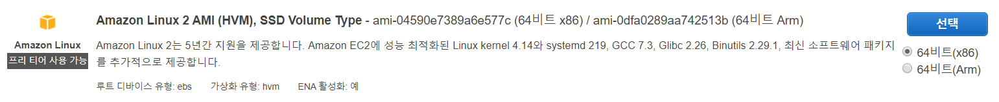

# Amazon EC2에서 애플리케이션의 가용성 향상

https://docs.aws.amazon.com/ko_kr/AWSEC2/latest/UserGuide/ec2-increase-availability.html

단일 EC2 인스턴스에서 애플리케이션 또는 웹 사이트 실행을 시작한 후 시간이 지나면서 수요를 충족하기 위해 두 개 이상의 인스턴스가 필요한 지점까지 트래픽이 증가하는 경우를 가정해 봅니다. AMI에서 여러 EC2 인스턴스를 시작한 다음 Elastic Load Balancing을 사용하여 애플리케이션에 대한 수신 트래픽을 EC2 인스턴스 간에 분산할 수 있습니다. 이렇게 하면 애플리케이션의 가용성이 향상됩니다. 인스턴스를 여러 가용 영역에 배치하면 애플리케이션의 내결함성도 향상됩니다. 가용 영역 하나가 중단되면 트래픽이 다른 가용 영역으로 라우팅됩니다.

Amazon EC2 Auto Scaling을 사용하여 애플리케이션에 대한 실행 인스턴스 수를 항상 최소한으로 유지할 수 있습니다. Amazon EC2 Auto Scaling은 인스턴스나 애플리케이션이 비정상일 때를 감지하고 자동으로 교체하여 애플리케이션의 가용성을 유지합니다. 또한 Amazon EC2 Auto Scaling을 사용하면 지정한 기준을 사용하여 필요에 따라 자동으로 Amazon EC2 용량을 확장하거나 축소할 수 있습니다.

이 자습서에서는 Amazon EC2 Auto Scaling과 Elastic Load Balancing을 사용하여 로드 밸런서 뒤에 지정된 수의 정상 EC2 인스턴스를 유지합니다. 트래픽이 로드 밸런서로 이동한 다음 인스턴스로 라우팅되므로 이러한 인스턴스에는 퍼블릭 IP 주소가 필요 없습니다. 자세한 내용은 [Amazon EC2 Auto Scaling](https://aws.amazon.com/ec2/autoscaling/) 및 [Elastic Load Balancing](https://aws.amazon.com/elasticloadbalancing/) 단원을 참조하십시오.


## 사전 조건

이 자습서에서는 다음을 이미 완료했다고 가정합니다.

#### Virtual Private Cloud(VPC) 생성

두 개 이상의 가용 영역에 있는 퍼블릭 서브넷 하나로 가상 사설 클라우드(VPC)를 생성하였습니다. 설정을 하지 않았으면 [Virtual Private Cloud(VPC) 생성](https://docs.aws.amazon.com/ko_kr/AWSEC2/latest/UserGuide/get-set-up-for-amazon-ec2.html#create-a-vpc)를 참조하십시오.

Amazon VPC에서는 *Virtual Private Cloud(VPC)*라 불리는, 사용자가 정의한 가상 네트워크로 AWS 리소스를 시작할 수 있습니다. 최신 EC2 인스턴스 유형의 경우 VPC에서 인스턴스를 시작해야 합니다. 아래 단계를 사용하여 기본 VPC가 아닌 VPC를 생성할 수 있습니다.

**기본 VPC가 아닌 VPC 생성**

 1. https://console.aws.amazon.com/vpc/에서 Amazon VPC 콘솔을 엽니다.

 2. 탐색 모음에서 VPC를 생성할 리전을 선택합니다. VPC는 리전에 고유하므로 키 페어를 생성한 리전과 동일한 리전을 선택해야 합니다.

 3. **탄력적 IP** 탭에 들어가 새 주소 할당을 클릭하여 새 탄력적 IP 주소를 할당합니다.

    

 4. VPC 대시보드에서 **VPC 마법사 시작**을 선택합니다.

    

 5. **1단계: VPC 구성 선택** 페이지에서 **퍼블릭 및 프라이빗 서브넷이 있는 VPC**가 선택되어 있는지 확인하고 **선택**을 선택합니다.

    

 6. **2단계: 퍼블릭 및 프라이빗 서브넷이 있는 VPC** 페이지의 **VPC 이름** 필드에 VPC의 이름을 입력합니다. 아래와 같이 설정한 뒤, **VPC 생성**을 선택합니다. 확인 페이지에서 **확인**을 선택합니다.

    

7. VPC 탭에 들어가 생성된 VPC를 확인합니다.

   

8. 서브넷 탭에 들어가서 서브넷 생성을 클릭한 뒤, 다음과 같이 서브넷 2개를 생성합니다.

   

   

9. 라우팅 테이블 탭에 들어가서 생성한 VPC의 라우팅 테이블(VPC ID 확인)중 인터넷 게이트웨이(igw)가 추가되어 있는 라우팅 테이블을 찾습니다.

   

10. 서브넷 연결 탭에 들어가 서브넷 연결 편집을 클릭하고, 추가로 생성한 public_c 서브넷을 연결합니다.

    

11. 라우팅 테이블 탭에 들어가서 생성한 VPC의 라우팅 테이블(VPC ID 확인)중 NAT 게이트웨이(nat)가 추가되어 있는 라우팅 테이블을 찾습니다.

    

12. 서브넷 연결 탭에 들어가 서브넷 연결 편집을 클릭하고, private_a와 private_c 서브넷을 연결합니다.

    

    

#### VPC에서 인스턴스 시작

1. https://console.aws.amazon.com/ec2/에서 Amazon EC2 콘솔을 엽니다.

2. 인스턴스 탭에 들어한 후, **인스턴스 시작**을 선택합니다.

3. **Amazon Machine Image(AMI) 선택** 페이지에서 Amazon Linux 2의 HVM 버전을 선택합니다.

   

4. **인스턴스 유형 선택** 페이지에서 인스턴스의 하드웨어 구성을 선택할 수 있습니다. 기본적으로 선택된 `t2.micro` 유형을 선택합니다.

5. 인스턴스 세부 정보 구성을 다음과 같이 설정합니다.

   

6. 보안 그룹 구성 단계에서 새 보안 그룹을 생성을 선택합니다. SSH는 소스를 내 IP로 하고, 규칙 추가를 클릭해 HTTP, HTTPS를 위치 무관으로 추가합니다.

   

7. 인스턴스 시작 검토 단계에서 시작하기를 클릭 후, 새 키페어 생성을 선택합니다. 키 페어 이름을 지정하고 키페어 다운로드를 클릭해 privage key 파일을 다운받습니다. 인스턴스 시작을 클릭합니다.

   

   

#### Amazon Linux 2에 LAMP 웹 서버 설치

1. [자습서: Amazon Linux 2에 LAMP 웹 서버 설치](https://docs.aws.amazon.com/ko_kr/AWSEC2/latest/UserGuide/ec2-lamp-amazon-linux-2.html)를 참조해 Amazon Linux 2에 LAMP 웹 서버를 설치합니다.

2. 인스턴스에서 애플리케이션을 테스트하여 인스턴스가 올바르게 구성되었는지 확인합니다.

   


#### 사용자 지정 Amazon 머신 이미지(AMI) 생성

1. 인스턴스에서 사용자 지정 Amazon 머신 이미지(AMI)를 생성합니다. (작업, 이미지, 이미지 생성을 차례대로 선택)

   

2. 이미지 이름을 입력하고 이미지 생성을 클릭합니다.

   

   

## 애플리케이션 확장 및 로드 밸런싱

다음 절차를 사용하여 로드 밸런서를 만들고, 인스턴스에 대한 시작 구성을 만든 다음. 두 개 이상의 인스턴스가 포함된 Auto Scaling 그룹을 만들고. 로드 밸런서를 Auto Scaling 그룹과 연결합니다.

1. https://console.aws.amazon.com/ec2/에서 Amazon EC2 콘솔을 엽니다.

2. 탐색 창의 **로드 밸런싱** 아래에서 **로드 밸런서**를 선택합니다.

   

3. **로드 밸런서 생성**을 선택하십시오.

4. **Application Load Balancer**에서 **생성**을 선택합니다.

   

5. **로드 밸런서 구성** 페이지에서 다음 작업을 수행하십시오.

   * **Name**에 로드 밸런서 이름을 입력합니다. 예: `my-lb`.

   * **체계**의 **internet-facing**은 기본값으로 유지합니다.

   * 포트 80에서 HTTP 트래픽을 수락하는 리스너를 뜻하는 **리스너**는 기본값으로 유지합니다.

     

   * **가용 영역**에서 인스턴스에 사용한 VPC를 선택합니다. 가용 영역을 선택한 후 해당 가용 영역의 퍼블릭 서브넷을 선택합니다. 두 번째 가용 영역에 대해 이 절차를 반복합니다.

     

   * **다음: 보안 설정 구성**을 선택합니다.

6. 이 자습서의 경우 안전한 리스너를 사용하지 않고 있습니다. **다음: 보안 그룹 구성**을 선택합니다.

7. **보안 그룹 구성** 페이지에서 다음 작업을 수행하십시오.

   * **새 보안 그룹 생성**을 선택합니다.

   * 보안 그룹의 이름과 설명을 입력하거나 기본 이름과 설명을 유지합니다. 이 새 보안 그룹에는 리스너에 구성된 포트로 보내는 트래픽을 허용하는 규칙이 포함되어 있습니다.

     

   * **다음: 라우팅 구성**을 선택합니다.

8. **라우팅 구성** 페이지에서 다음을 수행합니다.

   * **대상 그룹**에서는 기본값인 **새 대상 그룹**을 유지합니다.

   * **이름**에 대상 그룹의 이름을 입력합니다.

   * **프로토콜**을 HTTP로, **포트**를 80으로, **대상 유형**을 인스턴스로 유지합니다.

   * **상태 검사**의 기본 프로토콜과 경로를 유지합니다.

     

   * **Next: Register Targets(다음: 대상 등록)**를 선택합니다.

9. Amazon EC2 Auto Scaling을 사용하여 EC2 인스턴스를 대상 그룹에 추가해야 하므로 **대상 등록** 페이지에서 **다음: 검토**를 선택하여 다음 페이지로 계속합니다.

10. **검토** 페이지에서 **생성**을 선택합니다. 로드 밸런서가 생성된 후 **닫기**를 선택합니다.

11. 탐색 창의 **AUTO SCALING**에서 **시작 구성**을 선택합니다.

    * Amazon EC2 Auto Scaling를 처음 사용하는 경우 시작 페이지가 표시됩니다. **Auto Scaling 그룹 생성**을 선택하여 Auto Scaling 그룹 생성 마법사를 시작한 후 **시작 구성 생성**을 선택합니다.
    * 그렇지 않으면 **시작 구성 생성**을 선택합니다.

12. **AMI 선택** 페이지에서 **My AMIs(내 AMI)** 탭을 선택한 후 사전 조건에서 생성한 AMI를 선택합니다. (ami-tutorial 선택)

    

13. **인스턴스 유형 선택** 페이지에서 인스턴스 유형을 선택한 후 **다음: 세부 정보 구성**을 선택합니다. (t2.micro 선택)

14. **세부 정보 구성** 페이지에서 다음을 수행합니다.

    * **이름**에 시작 구성의 이름을 입력합니다(예 `my-launch-config`).

    * **IAM 역할**에서, 사전 조건에서 만든 IAM 역할을 선택합니다.

      

    * (선택 사항) 스타트업 스크립트를 실행해야 하는 경우 **고급 세부 정보**를 확장하고 **사용자 데이터**에 스크립트를 입력합니다.

    * **Skip to review(검토로 이동)**를 선택합니다.

15. **검토** 페이지에서 **보안 그룹 편집**을 선택합니다. 기존의 보안 그룹을 선택하거나 새로 만들 수 있습니다. 이 보안 그룹은 로드 밸런서의 HTTP 트래픽과 상태 확인을 허용해야 합니다. 인스턴스에 퍼블릭 IP 주소가 있는 경우 인스턴스에 연결해야 한다면 선택적으로 SSH 트래픽을 허용할 수 있습니다. 작업을 마쳤으면 **검토**를 선택합니다.

    * 기존에 생성했던 보안 그룹을 선택합니다.

    

16. **검토** 페이지에서 **시작 구성 생성**을 선택합니다.

17. 메시지가 나타나면 기존 키 페어를 선택하거나 새 키 페어를 만들거나 키 페어 없이 진행합니다. 승인 확인란을 선택한 다음 **시작 구성 생성**을 선택합니다.

    

18. 시작 구성이 생성된 후에는 Auto Scaling 그룹을 만들어야 합니다.

    * Amazon EC2 Auto Scaling을 처음 사용하고 Auto Scaling 그룹 생성 마법사를 사용 중인 경우 다음 단계로 자동으로 이동합니다.

    * 그렇지 않으면 **이 시작 구성을 사용하여 Auto Scaling 그룹 생성**을 선택합니다.

    * **이 시작 구성을 사용하여 Auto Scaling 그룹 생성**을 선택합니다.

      

19. **Auto Scaling 그룹 세부 정보 구성** 페이지에서 다음 작업을 수행하십시오.

    * **그룹 이름**에 Auto Scaling 그룹의 이름을 입력합니다. 예: `my-asg`.

    * **그룹 크기**에 인스턴스 수를 입력합니다(예: `2`). 각 가용 영역에서 인스턴스 수를 대략적으로 동일하게 유지하는 것이 좋습니다.

    * **네트워크**에서 VPC를 선택하고 **서브넷**에서 2개의 퍼블릭 서브넷을 선택합니다.

      

    * **고급 세부 정보** 아래에서 **하나 이상의 로드 밸런서에서 트래픽 수신**을 선택합니다. **대상 그룹**에서 대상 그룹을 선택합니다.

      

    * **Next: Configure scaling policies(다음: 조정 정책 구성)**를 선택합니다.

20. Amazon EC2 Auto Scaling을 사용하여 그룹을 지정된 크기로 유지할 것이므로 **Configure scaling policies(조정 정책 구성)** 페이지에서 **검토**를 선택합니다. 나중에 이 Auto Scaling 그룹을 수동으로 확장하거나, 일정에 따라 그룹을 확장하도록 구성하거나, 필요에 따라 그룹을 확장하도록 구성할 수 있습니다.

    

21. **검토** 페이지에서 **Auto Scaling 그룹 생성**을 선택합니다.

22. 그룹이 생성되면 **닫기**를 선택합니다.

    


## 로드 밸런서 테스트

클라이언트가 로드 밸런서에 요청을 보내면 로드 밸런서는 그 요청을 등록된 인스턴스 중 하나로 라우팅합니다.

#### **로드 밸런서 테스트**

1. 인스턴스가 준비되었는지 확인합니다. **Auto Scaling 그룹** 페이지에서 Auto Scaling 그룹을 선택한 후 **인스턴스**를 선택합니다. 처음에는 인스턴스가 `Pending` 상태로 되어 있습니다. 상태가 `InService`이면, 사용할 준비가 된 것입니다.

   

2. 인스턴스가 로드 밸런서에 등록되어 있는지 확인합니다. **대상 그룹** 페이지에서 대상 그룹을 선택한 후 **대상** 탭을 선택합니다. 인스턴스의 상태가 `initial`이면, 아직 등록 중일 수도 있습니다. 인스턴스의 상태가 `healthy`이면 사용할 준비가 된 것입니다. 인스턴스가 준비되면 다음과 같이 로드 밸런서를 테스트할 수 있습니다.

3. **로드 밸런서** 페이지에서 로드 밸런서를 선택합니다.

   

4. **설명** 탭에서 DNS 이름을 찾습니다. 이름은 다음과 같은 형식으로 되어 있습니다.

   ```URL
   my-lb-xxxxxxxxxx.us-west-2.elb.amazonaws.com
   ```

5. 웹 브라우저에서 로드 밸런서의 DNS 이름을 주소 표시줄에 붙여넣기 하고 Enter 키를 누릅니다. 웹 사이트가 표시됩니다.

   ```URL
   my-lb-1830469721.us-west-2.elb.amazonaws.com
   ```

   

   ```URL
   my-lb-1830469721.us-west-2.elb.amazonaws.com/phpMyAdmin
   ```

   

   

