# Elastic Beanstalk 사용

https://docs.aws.amazon.com/ko_kr/elasticbeanstalk/latest/dg/GettingStarted.CreateApp.html

## 1단계 : 예제 애플리케이션 생성

이 단계에서는 기존 예제 애플리케이션에서 시작하여 새 애플리케이션을 작성합니다. Elastic Beanstalk는 다양한 프로그래밍 언어, 애플리케이션 서버 및 Docker 컨테이너에 대한 플랫폼을 지원합니다. 애플리케이션을 만들 때 플랫폼을 선택합니다.

#### 애플리케이션 및 환경 생성

예제 애플리케이션을 만들려면 **웹 애플리케이션 만들기** 콘솔 마법사를 사용합니다. Elastic Beanstalk 애플리케이션을 만들고 애플리케이션 내에서 환경을 시작합니다. 환경은 애플리케이션 코드를 실행하는 데 필요한 AWS 리소스 모음입니다.

**예제 애플리케이션 생성**

1. 다음 링크를 사용하여 Elastic Beanstalk 콘솔을 엽니다: https://console.aws.amazon.com/elasticbeanstalk/home#/gettingStarted?applicationName=getting-started-app

2. **플랫폼**에 대해 플랫폼을 선택한 다음 **애플리케이션 생성**을 선택합니다. (Docker 선택)

   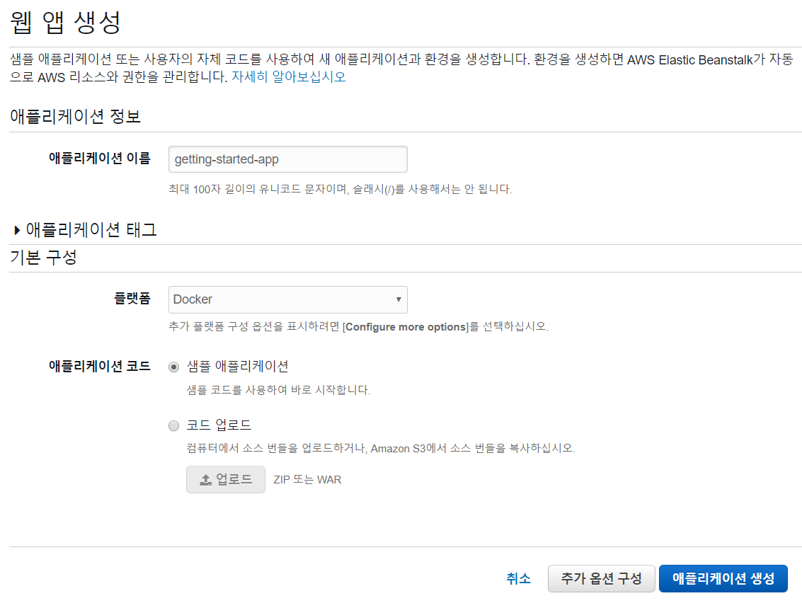

   

AWS 리소스에서 샘플 애플리케이션을 실행하기 위해 Elastic Beanstalk에서는 다음 작업을 수행합니다. 완료되는 데는 약 5분이 걸립니다.

1. 이름이 **getting-started-app**인 Elastic Beanstalk 애플리케이션을 생성합니다.
2. 다음 AWS 리소스가 있으며 이름이 **GettingStartedApp-env**인 환경을 시작합니다.
   * Amazon Elastic Compute Cloud(Amazon EC2) 인스턴스(가상 머신)
   * Amazon EC2 보안 그룹
   * Amazon Simple Storage Service(Amazon S3) 버킷
   * Amazon CloudWatch 경보
   * AWS CloudFormation 스택
   * 도메인 이름
3. **Sample Application**이라는 새 애플리케이션 버전을 작성합니다. 이것이 기본 Elastic Beanstalk 예제 애플리케이션 파일입니다.
4. **GettingStartedApp-env** 환경에 예제 애플리케이션의 코드를 배포합니다.

환경 생성 프로세스 중에 콘솔이 진행 상황을 추적하고 이벤트를 표시합니다.

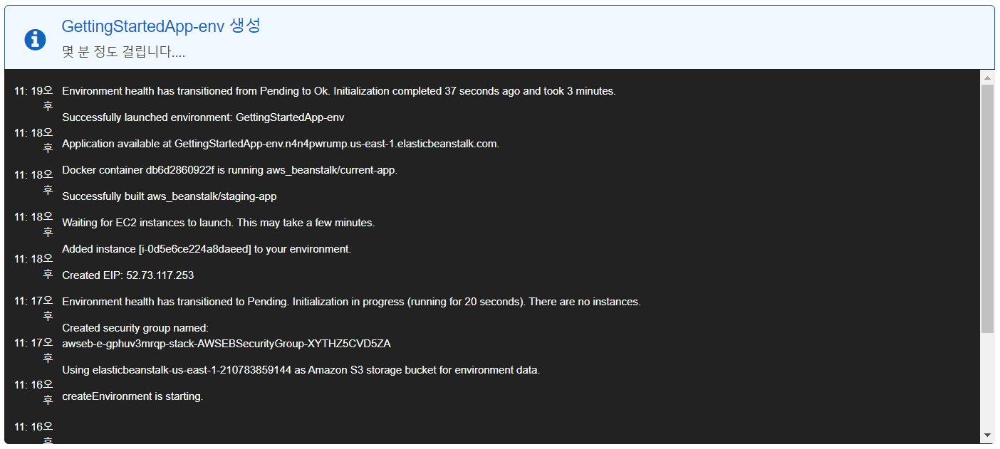

모든 리소스가 시작되고 애플리케이션을 실행하는 EC2 인스턴스가 상태 확인을 통과하면, 환경의 상태가 `Ok`로 변경됩니다. 이제 웹 애플리케이션의 웹사이트를 사용할 수 있습니다.

---

#### 예제 애플리케이션에 대해 생성된 AWS 리소스

예제 애플리케이션을 생성할 때 Elastic Beanstalk는 다음 AWS 리소스를 생성합니다.

* **EC2 인스턴스** – 선택한 플랫폼에서 웹 앱을 실행하도록 구성된 Amazon EC2 가상 머신입니다.

  특정 언어 버전, 프레임워크, 웹 컨테이너 또는 조합을 지원하도록 각 플랫폼마다 실행하는 소프트웨어, 구성 파일 및 스크립트 세트가 다릅니다. 대부분의 플랫폼에서는 웹 앱 앞의 웹 트래픽을 처리하고, 웹 앱으로 요청을 전달하고, 정적 자산을 제공하고, 액세스 및 오류 로그를 생성하는 역방향 프록시로 Apache 또는 nginx를 사용합니다.

* **인스턴스 보안 그룹** – 포트 80에서 수신 트래픽을 허용하도록 구성된 Amazon EC2 보안 그룹입니다. 이 리소스를 통해 로드 밸런서의 HTTP 트래픽이 웹 앱을 실행하는 EC2 인스턴스에 도달할 수 있습니다. 기본적으로 다른 포트에서는 트래픽이 허용되지 않습니다.

* **Amazon S3 버킷** – Elastic Beanstalk 사용 시 생성된 소스 코드, 로그 및 기타 결과물의 스토리지 위치입니다.

* **Amazon CloudWatch 경보** – 환경의 인스턴스에 대한 로드를 모니터링하는 두 개의 CloudWatch 경보로, 로드가 너무 높거나 너무 낮은 경우 트리거됩니다. 경보가 트리거되면 이에 대한 응답으로 Auto Scaling 그룹이 확장 또는 축소됩니다.

* **AWS CloudFormation 스택** – Elastic Beanstalk에서는 AWS CloudFormation을 사용하여 사용자 환경의 리소스를 시작하고 구성 변경 사항을 전파합니다. 리소스는 [AWS CloudFormation 콘솔](https://console.aws.amazon.com/cloudformation)에서 볼 수 있는 템플릿에서 정의됩니다.

* **도메인 이름** – *`subdomain`.`region`.elasticbeanstalk.com* 형식으로 웹 앱으로 라우팅되는 도메인 이름입니다.

## 2단계 : 환경 살펴보기

1. [Elastic Beanstalk 콘솔](https://console.aws.amazon.com/elasticbeanstalk)을 엽니다.

2. **GettingStartedApp-env**를 선택합니다.

   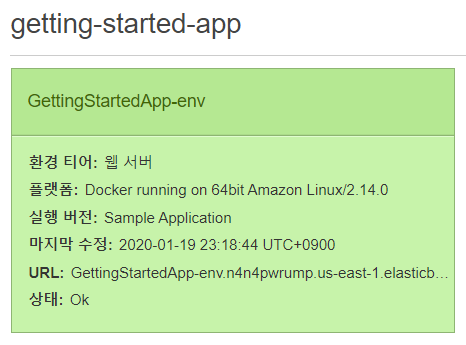

   

환경 대시보드에는 환경에 대한 최상위 정보가 표시됩니다. 여기에는 URL, 현재 상태, 현재 배포된 애플리케이션 버전의 이름, 최근 이벤트 다섯 개, 애플리케이션이 실행 중인 플랫폼 버전이 포함됩니다.

환경 계층, 플랫폼, 애플리케이션 버전 및 기타 Elastic Beanstalk 개념에 대한 자세한 내용은 [AWS Elastic Beanstalk 개념](https://docs.aws.amazon.com/ko_kr/elasticbeanstalk/latest/dg/concepts.html) 단원을 참조하십시오.

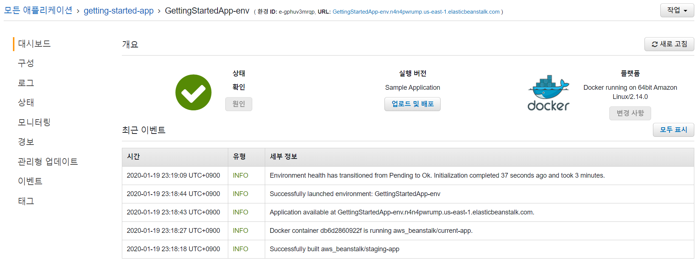

Elastic Beanstalk에서 AWS 리소스를 만들고 애플리케이션을 시작하는 동안 환경은 `Pending` 상태에 있습니다. 시작 이벤트에 대한 상태 메시지가 대시보드에 지속적으로 추가됩니다.

환경의 **URL**은 대시보드의 오른쪽 상단에 있는 **작업** 메뉴 옆에 있습니다. 이것은 환경이 실행 중인 웹 애플리케이션의 URL입니다. 이 URL을 선택해 예제 애플리케이션의 *구성* 페이지로 이동합니다.

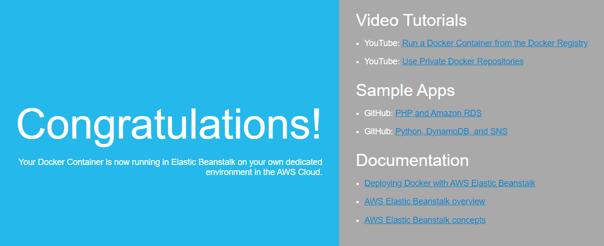

콘솔의 왼쪽에 있는 탐색 페이지는 환경에 대한 더 자세한 정보가 포함되어 있으며 추가 기능에 액세스할 수 있는 다른 페이지로 연결합니다.

* **구성** – 애플리케이션을 호스팅하는 Amazon Elastic Compute Cloud(Amazon EC2) 인스턴스 등 이 환경에 대해 프로비저닝된 리소스가 표시됩니다. 이 페이지에서 일부 프로비저닝된 리소스를 구성할 수 있습니다.
* **상태** – 애플리케이션을 실행하는 Amazon EC2 인스턴스에 대한 상태와 세부 상태 정보가 표시됩니다.
* **모니터링** – 평균 지연 시간 및 CPU 사용률 등 환경에 대한 통계가 표시됩니다. 이 페이지를 사용하여 모니터링 중인 측정치에 대한 경보를 만들 수 있습니다.
* **이벤트** – 이 환경에서 사용하는 Elastic Beanstalk 서비스 및 리소스가 있는 다른 서비스의 정보 또는 오류 메시지를 표시합니다.
* **태그** – 환경 태그를 표시하고 관리할 수 있습니다. 태그는 환경에 적용되는 키-값 쌍입니다.

## 3 단계 : 새 버전의 애플리케이션 배포

주기적으로 새 버전의 애플리케이션을 배포해야 할 수도 있습니다. 환경에서 다른 업데이트 작업이 진행 중이지 않은 한 언제든지 새 버전을 배포할 수 있습니다.

#### 애플리케이션 버전 업데이트

1. 환경 플랫폼과 일치하는 샘플 애플리케이션을 다운로드하십시오. 다음 애플리케이션 중 하나를 사용합니다.

   * **단일 컨테이너 Docker** – [docker-singlecontainer-v1.zip](https://docs.aws.amazon.com/ko_kr/elasticbeanstalk/latest/dg/samples/docker-singlecontainer-v1.zip)
   * **멀티컨테이너 Docker** – [docker-multicontainer-v2.zip](https://docs.aws.amazon.com/ko_kr/elasticbeanstalk/latest/dg/samples/docker-multicontainer-v2.zip)
   * **미리 구성된 Docker(Glassfish)** – [docker-glassfish-v1.zip](https://docs.aws.amazon.com/ko_kr/elasticbeanstalk/latest/dg/samples/docker-glassfish-v1.zip)
   * **Go** – [go-v1.zip](https://docs.aws.amazon.com/ko_kr/elasticbeanstalk/latest/dg/samples/go-v1.zip)
   * **Java SE** – [java-se-jetty-gradle-v3.zip](https://docs.aws.amazon.com/ko_kr/elasticbeanstalk/latest/dg/samples/java-se-jetty-gradle-v3.zip)
   * **Tomcat(기본값)** – [java-tomcat-v3.zip](https://docs.aws.amazon.com/ko_kr/elasticbeanstalk/latest/dg/samples/java-tomcat-v3.zip)
   * **Tomcat 7** – [java7-tomcat7.zip](https://docs.aws.amazon.com/ko_kr/elasticbeanstalk/latest/dg/samples/java7-tomcat7.zip)
   * **.NET** – [dotnet-asp-v1.zip](https://docs.aws.amazon.com/ko_kr/elasticbeanstalk/latest/dg/samples/dotnet-asp-v1.zip)
   * **Node.js** – [nodejs-v1.zip](https://docs.aws.amazon.com/ko_kr/elasticbeanstalk/latest/dg/samples/nodejs-v1.zip)
   * **PHP** – [php-v1.zip](https://docs.aws.amazon.com/ko_kr/elasticbeanstalk/latest/dg/samples/php-v1.zip)
   * **Python** – [python-v1.zip](https://docs.aws.amazon.com/ko_kr/elasticbeanstalk/latest/dg/samples/python-v1.zip)
   * **Ruby(Passenger Standalone)** – [ruby-passenger-v3.zip](https://docs.aws.amazon.com/ko_kr/elasticbeanstalk/latest/dg/samples/ruby-passenger-v3.zip)
   * **Ruby(Puma)** – [ruby-puma-v3.zip](https://docs.aws.amazon.com/ko_kr/elasticbeanstalk/latest/dg/samples/ruby-puma-v3.zip)

2. [Elastic Beanstalk 콘솔](https://console.aws.amazon.com/elasticbeanstalk)을 엽니다.

3. Elastic Beanstalk 애플리케이션 페이지에서 **getting-started-app**을 선택한 다음 **GettingStartedApp-env**를 선택합니다.

4. **개요** 섹션에서 **업로드 및 배포**를 선택합니다.

   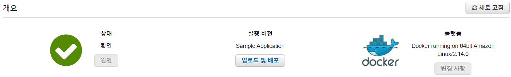

5. **파일 선택**을 선택한 다음 다운로드한 샘플 애플리케이션 소스 번들을 업로드하십시오.

   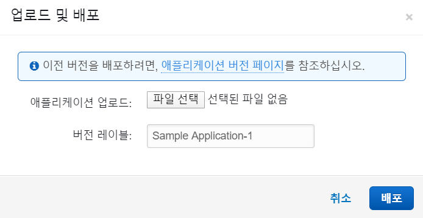

   콘솔은 자동으로 새 고유 레이블로 **버전 레이블**을 채웁니다. 고유한 버전 레이블을 입력하는 경우 고유한 레이블인지 확인하십시오.

6. **배포**를 선택합니다.

Elastic Beanstalk가 Amazon EC2 인스턴스에 파일을 배포하는 동안, 환경의 대시보드에서 배치 상태를 볼 수 있습니다. 애플리케이션 버전이 업데이트되는 동안 **Environment Health(환경 상태)**는 회색입니다. 배포가 완료되면 Elastic Beanstalk에서 애플리케이션 상태 확인을 수행합니다. 애플리케이션이 상태 확인에 응답하면 상태가 정상으로 간주되고 상태가 녹색으로 돌아갑니다. 환경 대시보드는 새로운 **실행 버전**—**버전 레이블**로 제공한 이름을 표시합니다.

Elastic Beanstalk는 또한 새 애플리케이션 버전을 업로드하고 애플리케이션 버전 테이블에 추가합니다. 테이블을 보려면, **getting-started-app**을 선택하고 **애플리케이션 버전**을 선택합니다.

## 4단계 : 환경 구성

애플리케이션에 더 적합하도록 환경을 구성할 수 있습니다. 예를 들어 컴퓨팅 집약적인 애플리케이션이 있는 경우 애플리케이션을 실행 중인 Amazon Elastic Compute Cloud(Amazon EC2) 인스턴스의 유형을 변경할 수 있습니다. 구성 변경을 적용하기 위해 Elastic Beanstalk는 환경 업데이트를 수행합니다.

일부 구성은 변경이 간단하고 빠르게 처리되지만 일부 변경의 경우 AWS 리소스를 삭제한 후 다시 만들어야 하며, 여기에는 몇 분 정도 걸릴 수 있습니다. 구성 설정을 변경하면 Elastic Beanstalk는 잠재적 인 애플리케이션 중단 시간에 대해 경고합니다.

#### 구성 변경

이 구성 변경 예에서는 환경의 용량 설정을 편집합니다. Auto Scaling 그룹에 2 ~ 4개의 Amazon EC2 인스턴스가 있고 로드 밸런싱 수행 및 자동 조정 환경을 구성한 다음 변경이 발생했는지 확인합니다. Elastic Beanstalk는 추가 Amazon EC2 인스턴스를 생성하여 처음 생성한 단일 인스턴스에 추가합니다. 그런 다음 Elastic Beanstalk는 두 인스턴스를 환경의 로드 밸런서와 연결합니다. 결과적으로 애플리케이션의 응답성이 향상되고 가용성이 향상됩니다.

**환경 용량 변경**

1. [Elastic Beanstalk 콘솔](https://console.aws.amazon.com/elasticbeanstalk)을 엽니다.

2. 해당 환경의 [관리 페이지](https://docs.aws.amazon.com/ko_kr/elasticbeanstalk/latest/dg/environments-console.html)로 이동합니다.

3. [**구성**]을 선택합니다.

4. **용량** 구성 범주에서 **수정**을 선택합니다.

   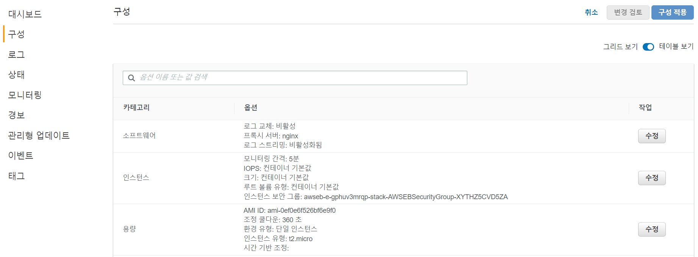

5. **Auto Scaling 그룹** 섹션에서 **환경 유형**을 **로드 밸런싱 수행**으로 변경합니다.

6. **인스턴스** 행에서 **최대**를 `4`로 변경하고 **최소**를 `2`로 변경합니다.

   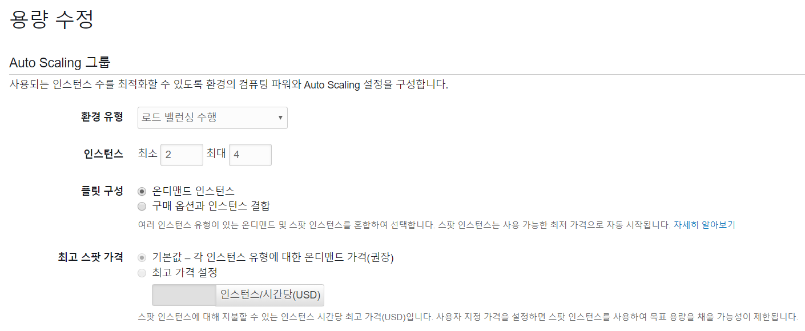

7. **용량 수정** 페이지에서 **적용**을 선택합니다.

8. 이 업데이트가 현재 인스턴스를 모두 대체한다는 경고가 표시됩니다. [**확인**]을 선택합니다.

   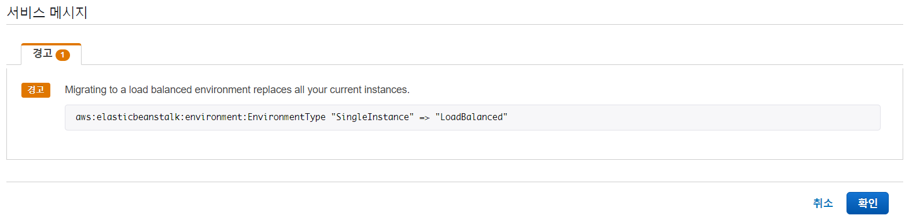

9. 탐색 창에서 **이벤트**를 선택합니다.

   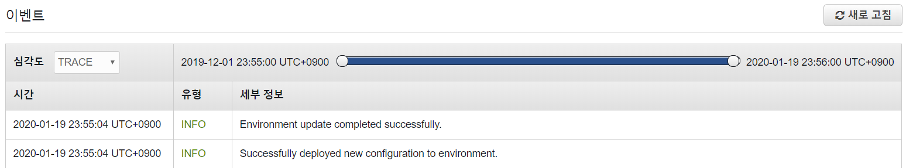

   환경이 업데이트되는 데 몇 분이 걸릴 수 있습니다. 완료되었는지 알아보려면 이벤트 목록에서 이벤트 **Successfully deployed new configuration to environment(새 구성이 환경에 성공적으로 배포되었습니다)**를 찾아봅니다. 이를 통해 Auto Scaling 최소 인스턴스 개수가 2로 설정되었음을 확인합니다. Elastic Beanstalk는 자동으로 두 번째 인스턴스를 시작합니다.

   

#### 구성 변경 확인

환경 업데이트가 완료되고 환경이 준비되면 변경 사항을 확인하십시오.

1. 탐색 창에서 [**상태**]를 선택합니다.

2. **확장된 상태 개요** 페이지를 봅니다.

   **총** 인스턴스 수가 **2**임을 알 수 있습니다. 또한 **전체** 줄 아래에 두 개의 Amazon EC2 인스턴스가 나열되어 있음을 알 수 있습니다. 환경 용량이 2개의 인스턴스로 증가했습니다.

   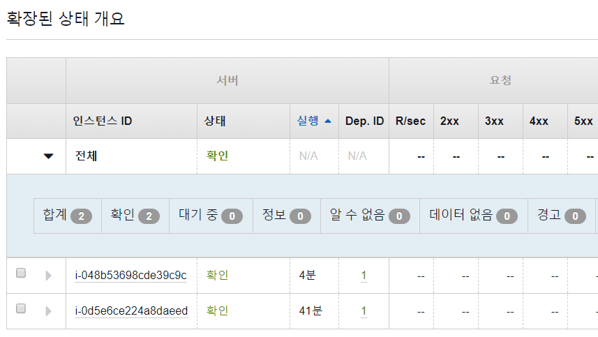

   

## 5단계 : 정리

사용하지 않는 서비스에 대해 요금이 청구되지 않도록 하려면 모든 애플리케이션 버전을 삭제하고 환경을 종료하십시오. 또한 환경에서 생성한 AWS 리소스가 삭제됩니다.

**애플리케이션 및 모든 관련 리소스 삭제**

1. 모든 애플리케이션 버전 삭제.

   * [Elastic Beanstalk 콘솔](https://console.aws.amazon.com/elasticbeanstalk)을 엽니다.

   * Elastic Beanstalk 애플리케이션 페이지에서 **getting-started-app**을 선택합니다.

     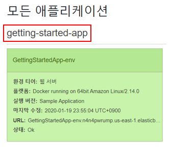

   * 탐색 창에서 **애플리케이션 버전**을 선택합니다.

     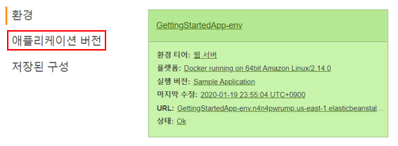

   * **애플리케이션 버전** 페이지에서 삭제할 모든 애플리케이션 버전을 선택한 후 **삭제**를 선택합니다.

     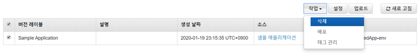

   * **삭제**를 선택하여 이 버전을 삭제하고자 함을 확인합니다.

   * **완료**를 선택합니다.

2. 환경 종료.

   * **getting-started-app**을 클릭한 다음 **GettingStartedApp-env**를 클릭하여 환경 대시보드를 엽니다.

   * **작업**을 선택한 후 **환경 종료**를 선택합니다.

     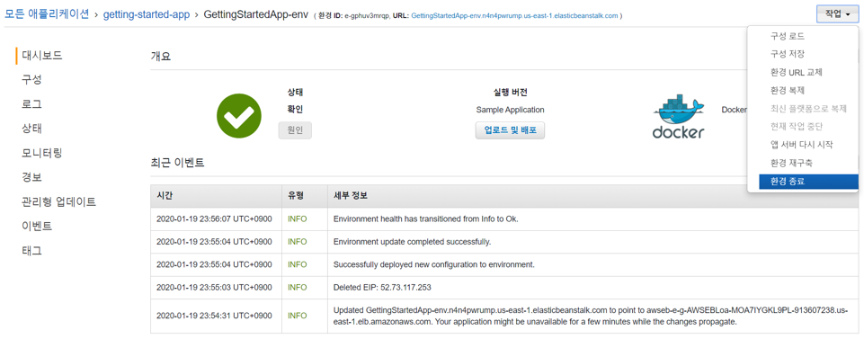

   * 환경 이름을 입력하고 **종료**를 선택하여 **GettingStartedApp-env** 종료를 확인합니다.

     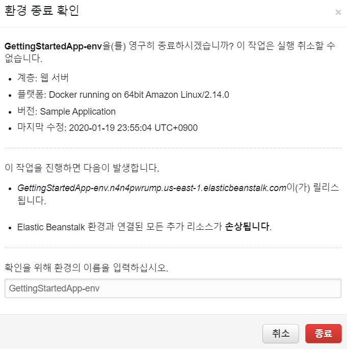

3. getting-started-app 애플리케이션을 삭제합니다.

   * 환경 대시보드의 왼쪽 상단에서 **Elastic Beanstalk**을 선택하여 기본 Elastic Beanstalk 대시보드를 엽니다.

     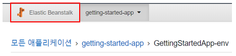

   * Elastic Beanstalk 애플리케이션 페이지에서 **getting-started-app** 애플리케이션에 대해 **작업**을 선택한 다음 **애플리케이션 삭제**를 선택합니다.

     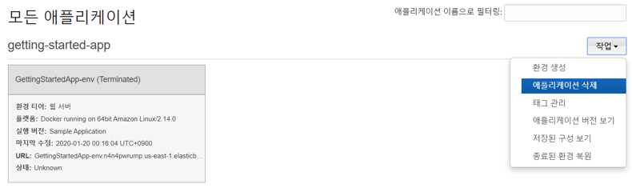

   * 애플리케이션 이름을 입력하고 **삭제**를 선택하여 **getting-started-app** 삭제를 확인하십시오.

     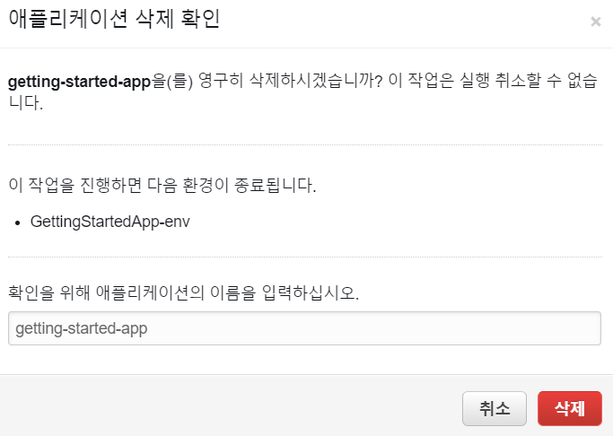

