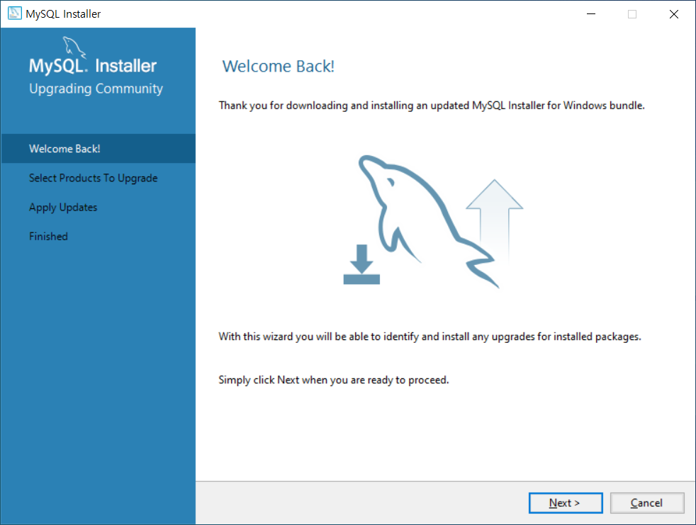
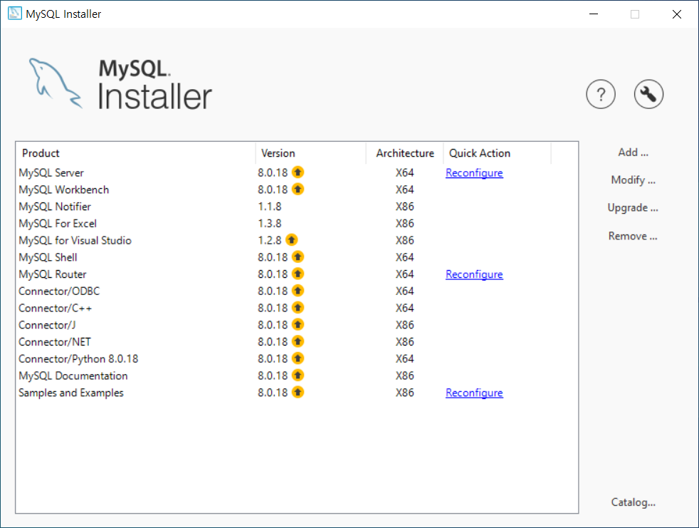
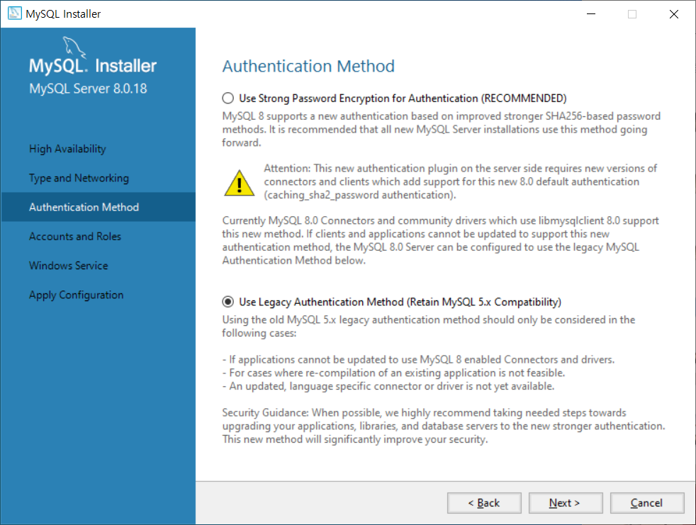
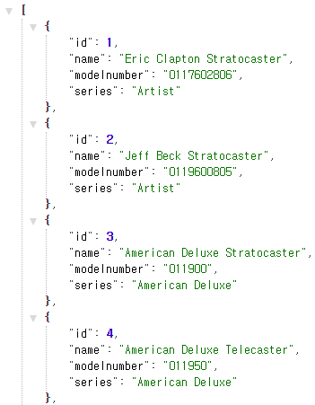
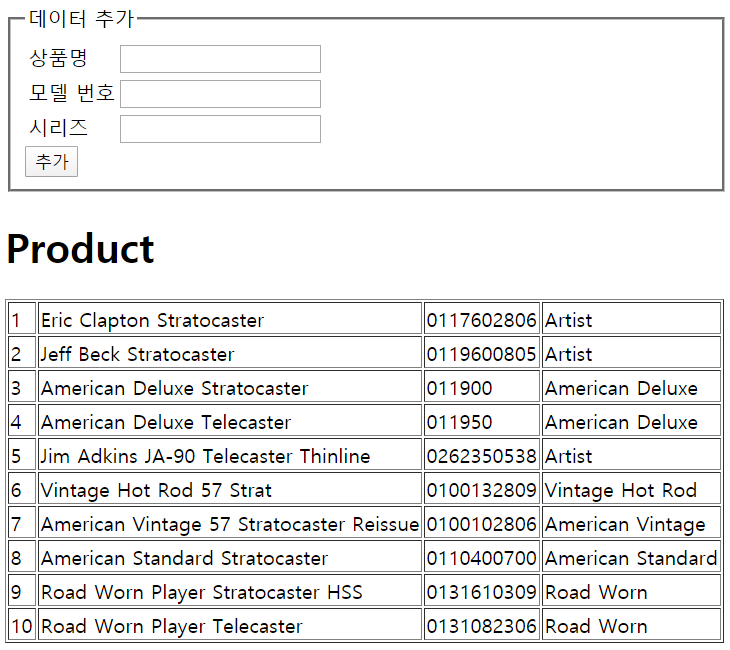
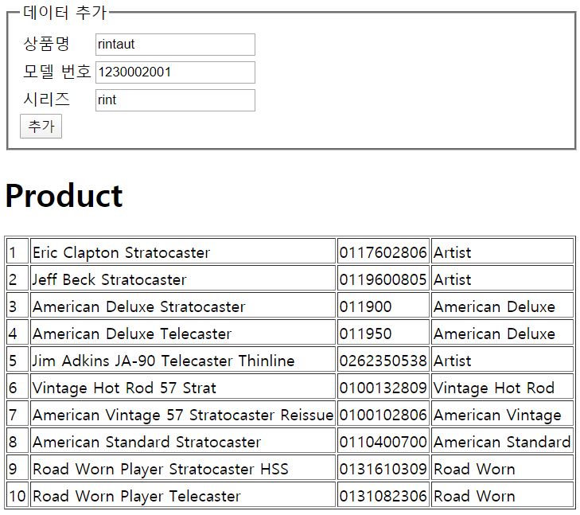
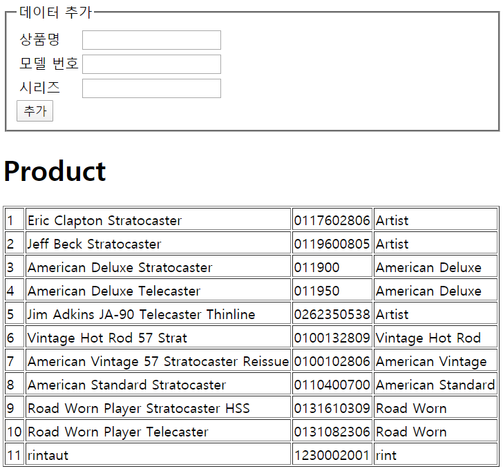

# Ajax

## MySQL 데이터베이스

데이터 변경 사항을 유지하려면 데이터를 프로그램 코드 내부가 아닌 외부에 저장해야 한다. => 데이터베이스


### 기본 쿼리 정리

| 쿼리                                                         | 설명                          |
| ------------------------------------------------------------ | ----------------------------- |
| CREATE DATABASE <데이터베이스 이름>                          | 데이터베이스를 생성한다.      |
| USE <데이터베이스 이름>                                      | 데이터베이스를 사용한다.      |
| CREATE TABLE <테이블 이름> (<테이블 형식>)                   | 테이블을 생성한다.            |
| INSERT INTO <테이블 이름> (<키>) VALUES (<값>)               | 테이블에 값을 넣는다.         |
| SELECT * FROM <테이블 이름> WHERE <조건> ORDER BY <순서> LIMIT <제한> | 테이블에서 데이터를 가져온다. |
| UPDATE <테이블 이름> SET <키=값> WHERE <조건>                | 테이블에서 데이터를 수정한다. |
| DELETE FROM <테이블 이름> WHERE <조건>                       | 테이블에서 데이터를 제거한다. |


### 설치

mysql 회원 가입 (https://www.mysql.com)

mysql server, workbench (https://dev.mysql.com/downloads/installer/)

운영체제에 맞는 설치 파일 다운로드

모든 설정은 기본 설정으로

비밀번호 설정


### 기본 명령어

MySQL Command Line Client 사용


#### 데이터베이스 생성

```mysql
mysql> CREATE DATABASE Company;
Query OK, 1 row affected (0.02 sec)
```


```mysql
mysql> show databases;
+--------------------+
| Database           |
+--------------------+
| company            |
| information_schema |
| mysql              |
| performance_schema |
| sakila             |
| sys                |
| world              |
+--------------------+
7 rows in set (0.00 sec)
```


```mysql
mysql> USE Company;
Database changed
```


#### 테이블 생성

* 테이블에 사용할 자료형
  * VARCHAR : 문자열
  * INT : 정수 숫자
  * DOUBLE : 실수 숫자


```mysql
mysql> CREATE TABLE products (
    ->  id INT NOT NULL AUTO_INCREMENT PRIMARY KEY,
    ->  name VARCHAR(50) NOT NULL,
    ->  modelnumber VARCHAR(15) NOT NULL,
    ->  series VARCHAR(30) NOT NULL
    -> );
Query OK, 0 rows affected (0.09 sec)
```


* 필드 속성
  * NOT NULL : 반드시 입력하게 만든다.
  * AUTO_INCREMENT : 자동으로 숫자가 증가하게 만든다.
  * PRIMARY KEY : 기본 키로 지정한다.


```mysql
mysql> DESCRIBE products;
+-------------+-------------+------+-----+---------+----------------+
| Field       | Type        | Null | Key | Default | Extra          |
+-------------+-------------+------+-----+---------+----------------+
| id          | int(11)     | NO   | PRI | NULL    | auto_increment |
| name        | varchar(50) | NO   |     | NULL    |                |
| modelnumber | varchar(15) | NO   |     | NULL    |                |
| series      | varchar(30) | NO   |     | NULL    |                |
+-------------+-------------+------+-----+---------+----------------+
4 rows in set (0.01 sec)
```


#### 데이터 저장

```mysql
mysql> INSERT INTO products (name, modelnumber, series) VALUES
    -> ('Eric Clapton Stratocaster', '0117602806', 'Artist');
Query OK, 1 row affected (0.02 sec)
```


```mysql
mysql> INSERT INTO products (name, modelnumber, series) VALUES
    -> ('Jeff Beck Stratocaster', '0119600805', 'Artist'),
    -> ('American Deluxe Stratocaster', '011900', 'American Deluxe'),
    -> ('American Deluxe Tele', '011950', 'American Deluxe'),
    -> ('Jim Adkins JA-90 Telecaster Thinline', '0262350538', 'Artist'),
    -> ('Vintage Hot Rod 57 Strat', '0100132809', 'Vintage Hot Rod'),
    -> ('American Vintage 57 Stratocaster Reissue', '0100102806', 'American Vintage'),
    -> ('American Standard Stratocaster', '0110400700', 'American Standard'),
    -> ('Road Worn Player Stratocaster HSS', '0131610309', 'Road Worn'),
    -> ('Road Worn Player Telecaster', '0131082306', 'Road Worn');
Query OK, 9 rows affected (0.01 sec)
Records: 9  Duplicates: 0  Warnings: 0
```


#### 데이터 조회

```mysql
mysql> SELECT * FROM products;
+----+------------------------------------------+-------------+-------------------+
| id | name                                     | modelnumber | series            |
+----+------------------------------------------+-------------+-------------------+
|  1 | Eric Clapton Stratocaster                | 0117602806  | Artist            |
|  2 | Jeff Beck Stratocaster                   | 0119600805  | Artist            |
|  3 | American Deluxe Stratocaster             | 011900      | American Deluxe   |
|  4 | American Deluxe Tele                     | 011950      | American Deluxe   |
|  5 | Jim Adkins JA-90 Telecaster Thinline     | 0262350538  | Artist            |
|  6 | Vintage Hot Rod 57 Strat                 | 0100132809  | Vintage Hot Rod   |
|  7 | American Vintage 57 Stratocaster Reissue | 0100102806  | American Vintage  |
|  8 | American Standard Stratocaster           | 0110400700  | American Standard |
|  9 | Road Worn Player Stratocaster HSS        | 0131610309  | Road Worn         |
| 10 | Road Worn Player Telecaster              | 0131082306  | Road Worn         |
+----+------------------------------------------+-------------+-------------------+
10 rows in set (0.00 sec)
```


```mysql
mysql> SELECT id, name, series FROM products;
+----+------------------------------------------+-------------------+
| id | name                                     | series            |
+----+------------------------------------------+-------------------+
|  1 | Eric Clapton Stratocaster                | Artist            |
|  2 | Jeff Beck Stratocaster                   | Artist            |
|  3 | American Deluxe Stratocaster             | American Deluxe   |
|  4 | American Deluxe Tele                     | American Deluxe   |
|  5 | Jim Adkins JA-90 Telecaster Thinline     | Artist            |
|  6 | Vintage Hot Rod 57 Strat                 | Vintage Hot Rod   |
|  7 | American Vintage 57 Stratocaster Reissue | American Vintage  |
|  8 | American Standard Stratocaster           | American Standard |
|  9 | Road Worn Player Stratocaster HSS        | Road Worn         |
| 10 | Road Worn Player Telecaster              | Road Worn         |
+----+------------------------------------------+-------------------+
10 rows in set (0.00 sec)
```


#### 조건 검사

```mysql
mysql> SELECT * FROM products
    -> WHERE series="Artist";
+----+--------------------------------------+-------------+--------+
| id | name                                 | modelnumber | series |
+----+--------------------------------------+-------------+--------+
|  1 | Eric Clapton Stratocaster            | 0117602806  | Artist |
|  2 | Jeff Beck Stratocaster               | 0119600805  | Artist |
|  5 | Jim Adkins JA-90 Telecaster Thinline | 0262350538  | Artist |
+----+--------------------------------------+-------------+--------+
3 rows in set (0.00 sec)
```


```mysql
mysql> SELECT * FROM products
    -> WHERE (series="Artist") OR (series="Road Worn");
+----+--------------------------------------+-------------+-----------+
| id | name                                 | modelnumber | series    |
+----+--------------------------------------+-------------+-----------+
|  1 | Eric Clapton Stratocaster            | 0117602806  | Artist    |
|  2 | Jeff Beck Stratocaster               | 0119600805  | Artist    |
|  5 | Jim Adkins JA-90 Telecaster Thinline | 0262350538  | Artist    |
|  9 | Road Worn Player Stratocaster HSS    | 0131610309  | Road Worn |
| 10 | Road Worn Player Telecaster          | 0131082306  | Road Worn |
+----+--------------------------------------+-------------+-----------+
5 rows in set (0.00 sec)
```


```mysql
mysql> SELECT * FROM products
    -> WHERE modelnumber LIKE '011%';
+----+--------------------------------+-------------+-------------------+
| id | name                           | modelnumber | series            |
+----+--------------------------------+-------------+-------------------+
|  1 | Eric Clapton Stratocaster      | 0117602806  | Artist            |
|  2 | Jeff Beck Stratocaster         | 0119600805  | Artist            |
|  3 | American Deluxe Stratocaster   | 011900      | American Deluxe   |
|  4 | American Deluxe Tele           | 011950      | American Deluxe   |
|  8 | American Standard Stratocaster | 0110400700  | American Standard |
+----+--------------------------------+-------------+-------------------+
5 rows in set (0.00 sec)
```


```mysql
mysql> SELECT * FROM products
    -> WHERE modelnumber LIKE '011___';
+----+------------------------------+-------------+-----------------+
| id | name                         | modelnumber | series          |
+----+------------------------------+-------------+-----------------+
|  3 | American Deluxe Stratocaster | 011900      | American Deluxe |
|  4 | American Deluxe Tele         | 011950      | American Deluxe |
+----+------------------------------+-------------+-----------------+
2 rows in set (0.00 sec)
```


#### 데이터 정렬

```mysql
mysql> SELECT id, name, series FROM products
    -> ORDER BY name;
+----+------------------------------------------+-------------------+
| id | name                                     | series            |
+----+------------------------------------------+-------------------+
|  3 | American Deluxe Stratocaster             | American Deluxe   |
|  4 | American Deluxe Tele                     | American Deluxe   |
|  8 | American Standard Stratocaster           | American Standard |
|  7 | American Vintage 57 Stratocaster Reissue | American Vintage  |
|  1 | Eric Clapton Stratocaster                | Artist            |
|  2 | Jeff Beck Stratocaster                   | Artist            |
|  5 | Jim Adkins JA-90 Telecaster Thinline     | Artist            |
|  9 | Road Worn Player Stratocaster HSS        | Road Worn         |
| 10 | Road Worn Player Telecaster              | Road Worn         |
|  6 | Vintage Hot Rod 57 Strat                 | Vintage Hot Rod   |
+----+------------------------------------------+-------------------+
10 rows in set (0.01 sec)
```


```mysql
mysql> SELECT * FROM products
    -> ORDER BY name DESC;
+----+------------------------------------------+-------------+-------------------+
| id | name                                     | modelnumber | series            |
+----+------------------------------------------+-------------+-------------------+
|  6 | Vintage Hot Rod 57 Strat                 | 0100132809  | Vintage Hot Rod   |
| 10 | Road Worn Player Telecaster              | 0131082306  | Road Worn         |
|  9 | Road Worn Player Stratocaster HSS        | 0131610309  | Road Worn         |
|  5 | Jim Adkins JA-90 Telecaster Thinline     | 0262350538  | Artist            |
|  2 | Jeff Beck Stratocaster                   | 0119600805  | Artist            |
|  1 | Eric Clapton Stratocaster                | 0117602806  | Artist            |
|  7 | American Vintage 57 Stratocaster Reissue | 0100102806  | American Vintage  |
|  8 | American Standard Stratocaster           | 0110400700  | American Standard |
|  4 | American Deluxe Tele                     | 011950      | American Deluxe   |
|  3 | American Deluxe Stratocaster             | 011900      | American Deluxe   |
+----+------------------------------------------+-------------+-------------------+
10 rows in set (0.00 sec)
```


#### 특정 위치에 있는 데이터 선택

```mysql
mysql> SELECT * FROM products LIMIT 2;
+----+---------------------------+-------------+--------+
| id | name                      | modelnumber | series |
+----+---------------------------+-------------+--------+
|  1 | Eric Clapton Stratocaster | 0117602806  | Artist |
|  2 | Jeff Beck Stratocaster    | 0119600805  | Artist |
+----+---------------------------+-------------+--------+
2 rows in set (0.00 sec)
```


```mysql
mysql> SELECT * FROM products LIMIT 2,2;
+----+------------------------------+-------------+-----------------+
| id | name                         | modelnumber | series          |
+----+------------------------------+-------------+-----------------+
|  3 | American Deluxe Stratocaster | 011900      | American Deluxe |
|  4 | American Deluxe Tele         | 011950      | American Deluxe |
+----+------------------------------+-------------+-----------------+
2 rows in set (0.00 sec)
```


```mysql
mysql> SELECT id, name, modelnumber FROM products
    -> WHERE (id < 7) AND (modelnumber LIKE '011%')
    -> ORDER BY name DESC
    -> LIMIT 3;
+----+---------------------------+-------------+
| id | name                      | modelnumber |
+----+---------------------------+-------------+
|  2 | Jeff Beck Stratocaster    | 0119600805  |
|  1 | Eric Clapton Stratocaster | 0117602806  |
|  4 | American Deluxe Tele      | 011950      |
+----+---------------------------+-------------+
3 rows in set (0.01 sec)
```


```mysql
mysql> SELECT series FROM products
    -> GROUP BY series;
+-------------------+
| series            |
+-------------------+
| Artist            |
| American Deluxe   |
| Vintage Hot Rod   |
| American Vintage  |
| American Standard |
| Road Worn         |
+-------------------+
6 rows in set (0.00 sec)
```


#### 데이터 수정

```mysql
mysql> UPDATE products
    -> SET name='American Deluxe Telecaster'
    -> WHERE id = 4;
Query OK, 1 row affected (0.01 sec)
Rows matched: 1  Changed: 1  Warnings: 0
```


#### 데이터 삭제

```mysql
mysql> DELETE FROM products
    -> WHERE id = 10;
```

데이터 삭제


```mysql
mysql> DELETE FROM products;
```

WHERE 명령어를 함께 사용하지 않으면 모든 데이터가 삭제된다.


```mysql
mysql> DROP TABLE products;
```

테이블 삭제


```mysql
mysql> DROP DATABASE company;
```

데이터베이스 삭제


### MySQL 모듈

MySQL 모듈 설치

```powershell
PS C:\node> npm install mysql
```


MySQL 모듈 추출

```js
// 모듈을 추출합니다.
const mysql = require('mysql');
```


MySQL 모듈의 메서드

| 메서드 이름               | 설명                     |
| ------------------------- | ------------------------ |
| createConnection(options) | 데이터베이스에 접속한다. |


createConnection() 메서드의 옵션

| 속성 이름 | 설명                             |
| --------- | -------------------------------- |
| host      | 연결할 호스트를 나타낸다.        |
| port      | 연결할 포트를 나타낸다.          |
| user      | 사용자 이름을 나타낸다.          |
| password  | 사용자 비밀번호를 나타낸다.      |
| database  | 연결할 데이터베이스를 나타낸다.  |
| debug     | 디버그 모드를 사용할지 나타낸다. |


mysql.basic.js

```js
// 모듈을 추출합니다.
const mysql = require('mysql');

// 데이터베이스와 연결합니다.
const client = mysql.createConnection({
    user: 'root',
    password: 'password',
    database: 'Company'
});

// 데이터베이스 쿼리를 사용합니다.
client.connect();
client.query('SELECT * FROM products', (error, result, fields) => {
    if (error) {
        console.log('쿼리 문장에 오류가 있습니다.');
        console.log(error);
    } else {
        console.log(result);
    }
});
client.end();
```

query() 메서드도 node.js의 다른 메서드와 마찬가지로 이벤트 기반 비동기 처리 방식을 사용한다.

두 번째 매개변수에 이벤트 리스너를 입력하면 쿼리 문장을 실행한 이후에 매개변수 result로 결과가 입력된다.


```powershell
PS C:\node> node .\mysql.basic.js
쿼리 문장에 오류가 있습니다.
...
{
  code: 'ER_NOT_SUPPORTED_AUTH_MODE',
  errno: 1251,
  sqlMessage: 'Client does not support authentication protocol requested by server; consider upgrading MySQL client',
  sqlState: '08004',
  fatal: true
}
```

Error 발생




Cancel => Yes 클릭




MySQL Server 오른쪽 Reconfigure 클릭




Legacy 선택


```powershell
PS C:\node> node .\mysql.basic.js
[
  RowDataPacket {
    id: 1,
    name: 'Eric Clapton Stratocaster',
    modelnumber: '0117602806',
    series: 'Artist'
  },
  RowDataPacket {
    id: 2,
    name: 'Jeff Beck Stratocaster',
    modelnumber: '0119600805',
    series: 'Artist'
  },
  RowDataPacket {
    id: 3,
    name: 'American Deluxe Stratocaster',
    modelnumber: '011900',
    series: 'American Deluxe'
  },
  RowDataPacket {
    id: 4,
    name: 'American Deluxe Telecaster',
    modelnumber: '011950',
    series: 'American Deluxe'
  },
  RowDataPacket {
    id: 5,
    name: 'Jim Adkins JA-90 Telecaster Thinline',
    modelnumber: '0262350538',
    series: 'Artist'
  },
  RowDataPacket {
    id: 6,
    name: 'Vintage Hot Rod 57 Strat',
    modelnumber: '0100132809',
    series: 'Vintage Hot Rod'
  },
  RowDataPacket {
    id: 7,
    name: 'American Vintage 57 Stratocaster Reissue',
    modelnumber: '0100102806',
    series: 'American Vintage'
  },
  RowDataPacket {
    id: 8,
    name: 'American Standard Stratocaster',
    modelnumber: '0110400700',
    series: 'American Standard'
  },
  RowDataPacket {
    id: 9,
    name: 'Road Worn Player Stratocaster HSS',
    modelnumber: '0131610309',
    series: 'Road Worn'
  },
  RowDataPacket {
    id: 10,
    name: 'Road Worn Player Telecaster',
    modelnumber: '0131082306',
    series: 'Road Worn'
  }
]
```


### 데이터베이스 웹 서비스

프로젝트 구성 : public 폴더, server.js


모듈 설치

```powershell
PS C:\node> npm install mysql 
PS C:\node> npm install express@4.14
PS C:\node> npm install body-parser
```


server.js

```js
// 모듈을 추출합니다.
const express = require('express');
const bodyParser = require('body-parser');
const mysql = require('mysql');

// 데이터베이스와 연결합니다.
const client = mysql.createConnection({
    user: 'root',
    password: 'mysql',
    database: 'Company'
});

// 웹 서버를 생성합니다.
const app = express();
app.use(express.static('public'));
app.use(bodyParser.urlencoded({ extended: false }));

// 전체 데이터 조회
app.get('/products', (request, response) => {
    // 데이터베이스 요청을 수행합니다.
    client.query('SELECT * FROM products', (error, data) => {
        response.send(data);
    });
});

// 개별 데이터 조회
app.get('/products/:id', (request, response) => {
    // 변수를 선언합니다.
    const id = Number(request.params.id);

    // 데이터베이스 요청을 수행합니다.
    client.query('SELECT * FROM products WHERE id=?', [
        id
    ], (error, data) => {
        response.send(data);
    });
});

// 데이터 추가
app.post('/products', (request, response) => {
    // 변수를 선언합니다.
    const name = request.body.name;
    const modelnumber = request.body.modelnumber;
    const series = request.body.series;

    // 데이터베이스 요청을 수행합니다.
    client.query('INSERT INTO products (name, modelnumber, series) VALUES(?,?,?)', [
        name, modelnumber, series
    ], (error, data) => {
        response.send(data);
    });
});

// 데이터 수정
app.put('/products/:id', (request, response) => {
    // 변수를 선언합니다.
    const id = Number(request.params.id);
    const name = request.body.name;
    const modelnumber = request.body.modelnumber;
    const series = request.body.series;
    let query = 'UPDATE products SET '

    // 쿼리를 생성합니다.
    if (name) query += 'name="' + name + '" ';
    if (modelnumber) query += 'modelnumber="' + modelnumber + '" ';
    if (series) query += 'series="' + series + '" ';
    query += 'WHERE id=' + id;

    // 데이터베이스 요청을 수행합니다.
    client.query(query, (error, data) => {
        response.send(data);
    });
});

// 데이터 삭제
app.delete('/products/:id', (request, response) => {
    // 변수를 선언합니다.
    const id = Number(request.params.id);

    // 데이터베이스 요청을 수행합니다.
    client.query('DELETE FROM products WHERE id=?', [
        id
    ], (error, data) => {
        response.send(data);
    });
});

// 웹 서버를 실행합니다.
app.listen(52273, () => {
    console.log('Server Running at http://127.0.0.1:52273');
});
```


http://127.0.0.1:52273/products




### Ajax를 사용한 데이터 추가와 삭제

제작한 웹 서비스에 Ajax 요청을 보내 데이터를 조작하는 방법


index.html

```html
<!DOCTYPE html>
<html>
<head>
    <title>DB Basic</title>
    <script src="https://ajax.googleapis.com/ajax/libs/jquery/3.4.1/jquery.min.js"></script>
    <script>
        $(document).ready(() => {
            // 데이터를 보여주는 함수입니다.
            function selectData() {
                // #output 내부의 내용물을 제거합니다.
                $('#output').empty();

                // Ajax를 수행합니다.
                $.getJSON('/products', (data) => {
                    $(data).each((index, item) => {
                        var output = '';
                        output += '<tr>';
                        output += ' <td>' + item.id + '</td>';
                        output += ' <td>' + item.name + '</td>';
                        output += ' <td>' + item.modelnumber + '</td>';
                        output += ' <td>' + item.series + '</td>';
                        output += '</tr>';
                        $('#output').append(output);
                    });
                });
            }

            // 데이터를 추가합니다.
            $('#insert_form').submit(function(event) {
                // Ajax를 수행합니다.
                const data = $(this).serialize();
                $.post('/products', data, selectData);
                
                // 기본 이벤트를 제거합니다.
                event.preventDefault();
            });

            // 초기 화면에 데이터를 표시합니다.
            selectData();
        });
    </script>
</head>
<body>
    <div>
        <form id="insert_form">
        <fieldset>
            <legend>데이터 추가</legend>
            <table>
                <tr>
                    <td><label>상품명</label></td>
                    <td><input type="text" name="name" /></td>
                </tr>
                <tr>
                    <td><label>모델 번호</label></td>
                    <td><input type="text" name="modelnumber" /></td>
                </tr>
                <tr>
                    <td><label>시리즈</label></td>
                    <td><input type="text" name="series" /></td>
                </tr>
            </table>
            <input type="submit" value="추가" />
        </fieldset>
        </form>
    </div>
    <h1>Product</h1>
    <table id="output" border="1">

    </table>
</body>
</html>
```


http://127.0.0.1:52273/









