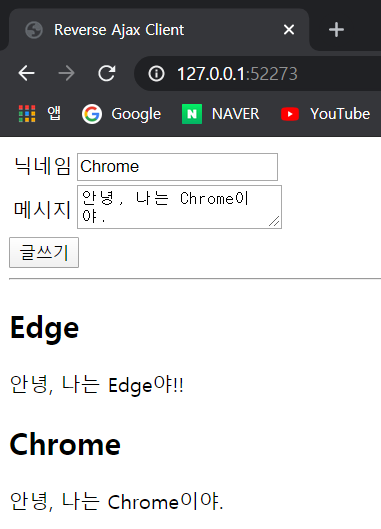

# Ajax

## Reverse Ajax

Reverse Ajax는 이름 그대로 Ajax의 반대 개념이다.

지금까지 Ajax는 클라이언트가 필요한 경우에만 서버에 데이터를 요청했다.

하지만, 이번에는 서버가 필요한 경우에 클라이언트에게 데이터를 주는 방식이다.


* Reverse Ajax는 크게 폴링(Polling), 롱폴링(Long Polling), 스트리밍(Streaming) 방법으로 나뉜다.
* 웹 소켓 : HTML5에서 추가된 기능으로, 실시간으로 웹 브라우저와 서버가 통신할 수 있는 기능이다.
* socket.io 모듈 : Node.js의 가장 대표적인 모듈로, 웹 소켓 통신(스트리밍) 또는 롱폴링을 매우 쉬운 형태로 구현하게 해주는 모듈이다.


### 개요

Reverse Ajax란 서버에서 원하는 경우에 클라이언트에게 데이터를 제공하는 방법이다.

Reverse Ajax는 대부분의 SNS에서 사용된다.


페이스북에 들어가면 페이지 전환 없이 한 페이지에서 대부분의 업무를 모두 처리할 수 있다.

페이스북을 사용하던 중 친구가 글을 올리면 웹 페이지에 친구가 글을 올렸다는 표시가 나타난다. 친구가 서버로 데이터를 보내자 서버가 나에게 데이터를 전송한 것이다.


* Polling
* Long Polling
* Streaming(Comet)


#### Streaming 기법

가장 완벽한 방식의 Reverse Ajax이다. 정말 서버가 원하는 순간에 데이터를 전송한다.

클라이언트에서는 메일 수신 동의를 하듯이 서버에게 요청을 한다. 메일 수신을 동의했으니 이후에 서버에서 일이 발생하면 그때마다 클라이언트에게 메일(데이터)을 전송해주는 방식이다.


#### Polling 기법

주기적으로 타이머로 서버에게 변경된 사항이 있는지 계속 Ajax 요청으로 물어보는 방식

메일이 왔는지 안 왔는지 불확실해도 매 시간 메일을 확인하는 것과 같다.


#### Long Polling 기법

Polling 기법을 약간 보완한 것

클라이언트가 서버에게 Ajax 요청을 하면 서버가 이를 이벤트가 발생하기 전까지 붙잡고 있는 방식


Polling 기법과 Long Polling 기법 중 어떤 것이 좋다고 단정 지을 수는 없다.

Polling 기법은 클라이언트가 계속 요청을 해야 하므로 클라이언트에게 일이 많이 부과된다.

Long Polling 기법은 서버에게 많은 일이 부과된다.


Polling 기법으로 채팅 애플리케이션 구현

node.js의 socket.io 모듈을 사용하면 Streaming과 Long Polling을 간단하게 구현할 수 있다.


### 서버 구성

public 폴더, server.js 


server.js

```js
// 모듈을 구성합니다.
const express = require('express');
const bodyParser = require('body-parser');

// 웹 서버를 생성합니다.
const app = express();
app.use(express.static('public'));
app.use(bodyParser.urlencoded({ extended: false }));

// 변수를 선언합니다.
let messages = [];

// 웹 서버를 라우트합니다.
app.get('/messages', (request, response) => {
    response.send(messages);
});

app.post('/messages', (request, response) => {
    // 변수를 선언합니다.
    const name = request.body.name;
    const content = request.body.content;
    const message = {
        name: name,
        content: content
    };

    // 데이터를 추가합니다.
    messages.push(message);

    // 응답합니다.
    response.send({
        message: '데이터를 추가했습니다.',
        data: message
    });
});

// 웹 서버를 실행합니다.
app.listen(52273, () => {
    console.log('Server Running at http://127.0.0.1:52273');
});
```


### 클라이언트 구성

public 폴더에 index.html 파일 생성


index.html

```html
<!DOCTYPE html>
<html>
<head>
    <title>Reverse Ajax Client</title>
    <script src="https://ajax.googleapis.com/ajax/libs/jquery/3.4.1/jquery.min.js"></script>
    <script>
        $(document).ready(() => {
            // 이벤트를 연결합니다.
            $('#write_form').submit(function(event) {
                // Ajax를 수행합니다.
                $.post('/messages', $(this).serialize());

                // 디폴트 이벤트를 제거합니다.
                event.preventDefault();
            });

            // 1초마다 함수를 실행합니다.
            setInterval(() => {
                $.getJSON('/messages', {
                    dummy: new Date().getTime()
                }, (data) => {
                    // #output의 내용물을 제거합니다.
                    $('#output').empty();

                    // #output에 내용물을 추가합니다.
                    $.each(data, (index, item) => {
                        let output = '';
                        output += '<h2>' + item.name + '</h2>';
                        output += '<p>' + item.content + '</p>';
                        $('<div></div>').html(output).prependTo('#output');
                    });
                });
            }, 1000);
        });
    </script>
</head>
<body>
    <form id="write_form">
        <table>
            <tr>
                <td>닉네임</td>
                <td><input type="text" name="name" /></td>
            </tr>
            <tr>
                <td>메시지</td>
                <td><textarea name="content"></textarea></td>
            </tr>
        </table>
        <input type="submit" value="글쓰기" />
    </form>
    <hr/>
    <div id="output">

    </div>
</body>
</html>
```

입력 양식에 submit 이벤트 연결, 기본 이벤트 제거

Polling 기법은 일정 시간마다 서버에서 변경 사항이 있는지 확인하는 기법

setInterval() 함수로 1초마다 변경 사항을 검사

인터넷 익스플로러는 같은 요청이 여러 번 반복하면 요청을 낭비한다고 생각한다. 여러 번 요청할 때 처음 요청해서 받은 데이터를 저장하고 요청을 반복하면 저장한 데이터를 제공한다. 따라서 요청을 여러 번 반복해도 같은 데이터만 받게 된다.

다른 요청임을 구분하려고 요청 매개변수 dummy에 지속적으로 다른 값을 넣어 요청한다.


http://127.0.0.1:52273/

서로 다른 브라우저에서 접속


Chrome




Edge


