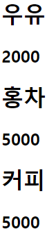
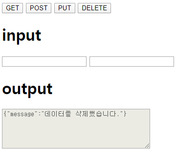

# Ajax

## XMLHttpRequest

XMLHttpRequest는 자바스크립트가 Ajax를 사용할 때 사용하는 객체이다.


### XMLHttpRequest 객체

`Ajax-node.js 기본` 에서 만든 서버로 내용을 계속 진행


```js
request.open(<전송 방식>, <경로>, <비동기 사용 여부>)
```


public 폴더의 index.html 파일

```html
<!DOCTYPE html>
<html>
<head>
    <title>XMLHttpRequest</title>
</head>
<body>
    <script>
        // XMLHttpRequest 객체를 생성합니다.
        const request = new XMLHttpRequest();
        request.open('GET', '/data.html', false);

        // Ajax를 수행합니다.
        request.send();

        // 출력합니다.
        alert(request.responseText);
    </script>
</body>
</html>
```


#### Ajax 요청을 활용한 동적 요소 생성

index.html

```html
<!DOCTYPE html>
<html>
<head>
    <title>XMLHttpRequest</title>
</head>
<body>
    <script>
        // XMLHttpRequest 객체를 생성합니다.
        const request = new XMLHttpRequest();
        request.open('GET', '/data.html', false);

        // Ajax를 수행합니다.
        request.send();

        // 출력합니다.
        document.body.innerHTML += request.responseText;
    </script>
</body>
</html>
```


### 동기 방식과 비동기 방식

* 동기 방식은 데이터를 서버와 클라이언트가 같은 속도로 연계하여 동작하는 방식
* 동기 방식 : 편지를 우체통에 넣고 답장이 올 때까지 우체통 앞에서 기다리는 것
* 비동기 방식 : 편지를 우체통에 넣고 답장이 올 때까지 다른 일을 처리하는 것


#### 동기 방식일 때 send() 메서드에서 소비되는 시간 측정

index.html

```html
<!DOCTYPE html>
<html>
<head>
    <title>XMLHttpRequest</title>
</head>
<body>
    <script>
        // XMLHttpRequest 객체를 생성합니다.
        const request = new XMLHttpRequest();
        request.open('GET', '/data.html', false);

        // send() 메서드에 소비되는 시간 측정
        const prevDate = new Date();
        request.send();
        const nowDate = new Date();

        // 출력합니다.
        alert(nowDate - prevDate);
    </script>
</body>
</html>
```


```js
request.open('GET', '/data.html', true);
```


데이터가 배달된 것을 onreadystatechange 이벤트로 알 수 있다.


#### XMLHttpRequest 객체의 onreadystatechange 이벤트

index.html

```html
<!DOCTYPE html>
<html>
<head>
    <title>XMLHttpRequest</title>
</head>
<body>
    <script>
        // XMLHttpRequest 객체를 생성합니다.
        const request = new XMLHttpRequest();
        request.onreadystatechange = (event) => {
            // 출력합니다.
            console.log(request.readyState);
        };
        request.open('GET', '/data.html', true);
        request.send();
    </script>
</body>
</html>
```


| readyState 속성 | 설명                                                         |
| --------------- | ------------------------------------------------------------ |
| 0               | request 객체를 만들었지만 open() 메서드로 초기화하지 않았음  |
| 1               | request 객체를 만들고 초기화했지만 send() 메서드가 사용되지 않음 |
| 2               | send() 메서드를 사용했지만 아직 데이터를 받지 못함           |
| 3               | 데이터의 일부만을 받음                                       |
| 4               | 모든 데이터를 받음                                           |


#### 비동기 방식을 사용한 Ajax 요청

```html
<!DOCTYPE html>
<html>
<head>
    <title>XMLHttpRequest</title>
</head>
<body>
    <script>
        // XMLHttpRequest 객체를 생성합니다.
        const request = new XMLHttpRequest();
        request.onreadystatechange = (event) => {
            if (request.readyState == 4) {
                if (request.status == 200) {
                    document.body.innerHTML += request.responseText;
                };
            }
        };
        request.open('GET', '/data.html', true);
        request.send();
    </script>
</body>
</html>
```


#### HTTP Status Code

| HTTP Status Code | 설명            | 예                        |
| ---------------- | --------------- | ------------------------- |
| 1XX              | 처리 중         | 100 Continue              |
| 2XX              | 성공            | 200 OK                    |
| 3XX              | 리다이렉트      | 300 Multiple Choices      |
| 4XX              | 클라이언트 오류 | 400 Bad Request           |
| 5XX              | 서버 오류       | 500 Internal Server Error |


### 데이터 요청과 조작

#### 1. JSON 요청과 조작

index.html

```html
<!DOCTYPE html>
<html>
<head>
    <title>XMLHttpRequest</title>
</head>
<body>
    <script>
        // XMLHttpRequest 객체를 생성합니다.
        const request = new XMLHttpRequest();
        request.onreadystatechange = (event) => {
            if (request.readyState == 4) {
                if (request.status == 200) {
                    // 데이터를 가공합니다.
                    const json = eval('(' + request.responseText + ')');
                    let output = '';
                    
                    for (let i = 0; i < json.length; i++) {
                        for (let key in json[i]) {
                            output += '<h1>' + i + ':' + json[i][key] + '</h1>';
                        }
                    }
                    
                    // 출력합니다.
                    document.body.innerHTML += output;
                };
            };
        };
        request.open('GET', '/data.json', true);
        request.send();
    </script>
</body>
</html>
```


JSON.parse() 메서드

```js
let json = JSON.parse(request.responseText);
```


#### 2. XML 요청과 조작

##### DOM 속성

| 속성      | 설명                  |
| --------- | --------------------- |
| nodeValue | 문서 객체의 내부 글자 |
| attribute | 문서 객체의 속성      |


##### DOM 메서드

| 메서드                    | 설명                                       |
| ------------------------- | ------------------------------------------ |
| getElementById(id)        | id 속성이 일치하는 문서 객체를 선택한다.   |
| getElementByTagName(name) | 태그 이름이 일치하는 문서 객체를 선택한다. |


'/data.xml'

```xml
<?xml version="1.0" encoding="UTF-8"?>
<products>
    <product>
        <name>우유</name>
        <price>2000</price>
    </product>
    <product>
        <name>홍차</name>
        <price>5000</price>
    </product>
    <product>
        <name>커피</name>
        <price>5000</price>
    </product>
</products>
```


index.html

```html
<!DOCTYPE html>
<html>
<head>
    <title>XMLHttpRequest</title>
</head>
<body>
    <script>
        // XMLHttpRequest 객체를 생성합니다.
        const request = new XMLHttpRequest();
        request.onreadystatechange = (event) => {
            if (request.readyState == 4) {
                if (request.status == 200) {
                    // 변수를 선언합니다.
                    const xml = request.responseXML;

                    // 데이터를 가공합니다.
                    const names = xml.getElementsByTagName('name');
                    const prices = xml.getElementsByTagName('price');

                    for (let i = 0; i < names.length; i++) {
                        const name = names[i].childNodes[0].nodeValue;
                        const price = prices[i].childNodes[0].nodeValue;
                        document.body.innerHTML += '<h1>' + name + '</h1>';
                        document.body.innerHTML += '<h2>' + price + '</h2>';
                    }
                };
            };
        };
        request.open('GET', '/data.xml', true);
        request.send();
    </script>
</body>
</html>
```





### 데이터 요청 방식

GET, POST, PUT, DELETE


index.html

```html
<!DOCTYPE html>
<html>
<head>
    <title>XMLHttpRequest</title>
    <script>
        window.onload = () => {
            document.getElementById('get').onclick = () => {};
            document.getElementById('post').onclick = () => {};
            document.getElementById('put').onclick = () => {};
            document.getElementById('delete').onclick = () => {};
        };
    </script>
</head>
<body>
    <button id="get">GET</button>
    <button id="post">POST</button>
    <button id="put">PUT</button>
    <button id="delete">DELETE</button>
    <h1>input</h1>
    <input id="name" />
    <input id="price" />
    <h1>output</h1>
    <textarea id="output" disabled="disabled" cols="40" rows="5"></textarea>
</body>
</html>
```


#### 1. GET 요청

```js
document.getElementById('get').onclick = () => {
    // Ajax를 수행합니다.
    const request = new XMLHttpRequest();
    request.open('GET', '/products', true);
    request.send();
    request.onreadystatechange = (event) => {
        if (request.readyState == 4) {
            if (request.status == 200) {
                // 출력합니다.
                document.getElementById('output').value = request.responseText;
            };
        };
    };
};
```


http://127.0.0.1:52273/ 접속 => GET 버튼 클릭


#### 2. POST 요청

```js
document.getElementById('post').onclick = () => {
    // 변수를 선언합니다.
    const name = document.getElementById('name').value;
    const price = document.getElementById('price').value;

    // Ajax를 수행합니다.
    const request = new XMLHttpRequest();
    request.open('POST', '/products', true);
    request.setRequestHeader('Content-type', 'application/x-www-form-urlencoded');
    request.send('name=' + name + '&price=' + price);
    request.onreadystatechange = (event) => {
        if (request.readyState == 4) {
            if (request.status == 200) {
                // 출력합니다.
                document.getElementById('output').value = request.responseText;
            };
        };
    };
};
```


http://127.0.0.1:52273/ 접속 => 글자 입력 후 POST 버튼 클릭


#### 3. PUT 요청

```js
document.getElementById('put').onclick = () => {
    // 변수를 선언합니다.
    const name = document.getElementById('name').value;
    const price = document.getElementById('price').value;

    // Ajax를 수행합니다.
    const request = new XMLHttpRequest();
    request.open('PUT', '/products/0', true);
    request.setRequestHeader('Content-type', 'application/x-www-form-urlencoded');
    request.send('name=' + name + '&price=' + price);
    request.onreadystatechange = (event) => {
        if (request.readyState == 4) {
            if (request.status == 200) {
                // 출력합니다.
                document.getElementById('output').value = request.responseText;
            };
        };
    };
};
```


#### 4. DELETE 요청

```js
document.getElementById('delete').onclick = () => {
    // Ajax를 수행합니다.
    const request = new XMLHttpRequest();
    request.open('DELETE', '/products/0', true);
    request.send();
    request.onreadystatechange = (event) => {
        if (request.readyState == 4) {
            if (request.status == 200) {
                // 출력합니다.
                document.getElementById('output').value = request.responseText;
            };
        };
    };
};
```





