# Ajax

## node.js 기본


### Ajax 개요

Ajax는 구현하는 방식을 뜻하는 말이다.

Ajax를 사용하면 페이지를 전환하지 않고 서버에서 데이터를 받아와 사용자에게 보여줄 수 있다.

ex) 페이스북이나 트위터 같은 SNS


### 데이터 전송 형식

서버와 클라이언트가 데이터를 주고 받을 때는 특정한 형식을 맞춰야 한다.

CSV, XML, JSON


#### 1. CSV 형식

* CSV(Comma Seperated Values)는 각 항목을 쉼표로 구분해 데이터를 표현하는 방법이다.
* 다른 형식에 비해 굉장히 짧다. => 많은 양의 데이터를 전송할 때 활용하면 좋다.
* 가독성이 떨어진다.
* `split()` 메서드로 분해한다.


#### 2. XML 형식

* XML 형식은 HTML 형식처럼 태그로 데이터를 표현한다.
* 각각의 데이터가 어떠한 것을 의미하는지 알 수 있다.
* 대부분의 정보 제공 사이트에서 제공하는 RSS 형식도 XML 형식을 기반으로 만든 것이다.
* HTML 처럼 각각의 태그에 사용자 정의 속성을 넣어 데이터를 표현할 수 있으므로 복잡한 데이터를 전달할 수 있다.
* 닫는 태그와 여는 태그 등이 쓸데 없이 용량을 차지하는 문제가 있다.


#### 3. JSON 형식

* CSV 형식과 XML 형식의 단점을 모두 극복한 형식이다.
* JSON(JavaScript Object Notation)은 자바스크립트에서 사용하는 객체 형태로 데이터를 표현하는 방법이다.
* Ajax를 사용할 때 거의 표준으로 사용되는 데이터 표현 방식이다.
* JSON에는 객체, 배열, 문자열, 숫자, 불, null만 들어갈 수 있다.
* 문자열은 무조건 큰따옴표를 사용해야 한다.
* CSV 형식과 달리 데이터의 가독성이 좋다.
* XML 형식보다 적은 용량으로 데이터를 전달할 수 있다.


### node.js 개요와 설치

#### node.js 개요

* 2008년에 크롬 웹 브라우저가 출시되면서 자바스크립트의 속도가 점점 빨라지자 자바스크립트를 웹 브라우저가 아닌 곳에서 쓸 수 있게 만들자는 의견이 많아졌다. => CommonJS 표준이 작성된다.
* node.js는 CommonJS 표준에 따라 라이언 달이 크롬 V8 엔진을 기반으로 개발한 플랫폼이다.
* node.js를 사용하면 웹 브라우저가 아닌 곳에서 자바스크립트로 프로그램을 개발할 수 있다.


#### node.js 설치

https://nodejs.org/ko/

짝수 버전으로 설치

`Next` 버튼을 눌러 설치


### 기본 파일 실행

C:\node 디렉터리 생성

Visual Studio Code 실행 => C:\node 폴더 열기


JavaScript.js

```js
let output = '';
for (let i = 0; i < 10; i++) {
    console.log(output += '*');
}
```


터미널 => 새 터미널

```powershell
PS C:\node> node .\JavaScript.js
*   
**  
*** 
****
*****
******
*******
********
*********
**********
```


### 내부 모듈

* Node.js는 기능을 확장하고자 모듈이라는 개념을 사용한다.
* 모듈 중에서 Node.js에 기본적으로 있는 모듈을 내부 모듈이라고 한다.
* 내부 모듈은 http://nodejs.org/dist/latest-v6.x/docs/api/ 의 문서에서 확인할 수 있다. `-v6.x` 부분을 변경하면, 다른 버전의 최신 문서를 확인할 수 있다.


os 모듈을 선택해 os 모듈 페이지로 이동한다.

http://nodejs.org/dist/latest-v6.x/docs/api/os.html

os 모듈을 어떻게 사용해야 하는지 나온다.


JavaScript.js

```js
// 모듈을 추출합니다.
const os = require('os');

// 속성을 추출합니다.
console.log(os);
```


터미널

```powershell
PS C:\node> node .\JavaScript.js
{
  arch: [Function: arch] { [Symbol(Symbol.toPrimitive)]: [Function] },
  cpus: [Function: cpus],
  endianness: [Function: endianness] { [Symbol(Symbol.toPrimitive)]: [Function] },
  freemem: [Function: getFreeMem] { [Symbol(Symbol.toPrimitive)]: [Function] },
  getPriority: [Function: getPriority],
  ...
```


#### os 모듈의 메서드

* hostname()
  * 운영체제의 호스트 이름을 리턴한다.
* type()
  * 운영체제의 이름을 리턴한다.
* platform()
  * 운영체제의 플랫폼을 리턴한다.
* arch()
  * 운영체제의 아키텍처를 리턴한다.
* release()
  * 운영체제의 버전을 리턴한다.
* uptime()
  * 운영체제가 실행된 시간을 리턴한다.
* loadavg()
  * 로드 에버리지 정보를 담은 배열을 리턴한다.
* totalmem()
  * 시스템의 총 메모리를 리턴한다.
* cpus()
  * CPU의 정보를 담은 객체를 리턴한다.
* getNetworkInterfaces()
  * 네트워크 인터페이스의 정보를 담은 배열을 리턴한다.


JavaScript.js

```js
// 모듈을 추출합니다.
const os = require('os');

// 모듈을 사용합니다.
console.log(os.hostname());
console.log(os.type());
console.log(os.platform());
console.log(os.arch());
console.log(os.release());
console.log(os.uptime());
console.log(os.loadavg());
console.log(os.totalmem());
console.log(os.freemem());
console.log(os.cpus());
console.log(os.networkInterfaces());
```


터미널

```powershell
PS C:\node> node .\JavaScript.js
DESKTOP-U4D3D30
Windows_NT
win32
x64
10.0.18362
905698
[ 0, 0, 0 ]
...
```


### 외부 모듈

* node.js가 기본적으로 갖고 있지 않고 개인 또는 단체가 만들어 배포하는 모듈

* 외부 모듈은 https://www.npmjs.com/ 에서 확인할 수 있다.

* 일반적으로 구글에서 검색할 때 `node.js <기능>`으로 입력하면 찾아진다.

* 외부 모듈을 사용하려면 별도로 설치를 해야한다.

  ```powershell
  > npm install 모듈명
  ```

  자바스크립트 파일이 있는 폴더에서 명령어를 입력


request 모듈 설치

```powershell
PS C:\node> npm install request
```

모듈과 관련된 설명은 모듈의 공식 홈페이지에서 볼 수 있다.

request 모듈의 공식 홈페이지 : https://github.com/request/request

request 모듈은 특정한 웹 페이지를 긁을 때 사용한다.


JavaScript.js

```js
// 모듈을 추출합니다.
const request = require('request');

// 웹 페이지를 긁습니다.
request('http://www.google.com', (error, response, body) => {
    console.log(body);
});
```

코드를 실행하면 구글 메인 페이지의 소스 코드를 출력한다.


```powershell
PS C:\node> node .\JavaScript.js
<!doctype html><html itemscope="" itemtype="http://schema.org/WebPage" lang="ko"><head><meta content="text/html; charset=UTF-8" http-equiv="Content-Type"><meta content="/images/branding/googleg/1x/googleg_standard_color_128dp.png" itemprop="image"><title>Google</title><script nonce="FEIPvr1RJwYlnSsFYLrAWA==">...
```


### 서버 생성 및 실행

server.js 파일 생성

웹 서버를 만들 때에는 express라는 외부 모듈을 사용한다.

express 모듈 설치

```powershell
PS C:\node> npm install express@4.14
```

버전 명령 : npm 명령어를 입력할 때 모듈 이름 뒤에 @ 기호를 붙이고 버전을 입력하면 버전을 강제로 지정할 수 있다.


server.js

```js
// 모듈을 추출합니다.
const express = require('express');

// 웹 서버를 생성합니다.
let app = express();
app.use((request, response) => {
    response.send('<h1>안녕하세요</h1>');
});

// 웹 서버를 실행합니다.
app.listen(52273, () => {
    console.log('Server Running at http://127.0.0.1:52273');
});
```

포트 : 컴퓨터와 컴퓨터를 연결하는 정보의 출입구 역할을 하는 곳이다. 컴퓨터에는 0번부터 65535번까지 포트가 존재한다.

웹 서버에 기능을 부여할 때는 `app.use()` 메서드를 사용한다.


```powershell
PS C:\node> node .\server.js
Server Running at http://127.0.0.1:52273
```


http://127.0.0.1:52273

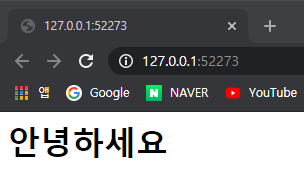

서버를 종료할 때는 `Ctrl` + `c` 를 누른다.

파일을 수정하면 반드시 서버를 종료하고 다시 실행해야 한다.


### 미들웨어

앞에서 사용한 `app.use()` 메서드에 입력하는 콜백 함수는 request 이벤트 리스너이다.

request 이벤트 리스너는 다음과 같은 형태로 사용자가 서버에 접속하면 자동으로 실행된다.

```js
app.use((request, response, next) => {
    
});
```

`app.use()` 메서드는 여러 번 사용할 수 있다.

매개변수 next는 다음 콜백 함수를 의미한다.


#### 미들웨어 구성

server.js

```js
// 모듈을 추출합니다.
const express = require('express');

// 웹 서버를 생성합니다.
let app = express();
app.use((request, response, next) => {
    console.log('first');
    next();
});

app.use((request, response, next) => {
    console.log('second');
    next();
});

app.use((request, response, next) => {
    response.send('<h1>Hello Middleware .. !</h1>');
});

// 웹 서버를 실행합니다.
app.listen(52273, () => {
    console.log('Server Running at http://127.0.0.1:52273');
});
```


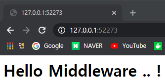


터미널

```powershell
PS C:\node> node .\server.js
Server Running at http://127.0.0.1:52273
first
second
first
second
```


각각의 콜백 함수를 통과하여 `console.log()` 메서드를 실행한 것이다. 이렇게 사용자의 요청을 처리하면서 지나가는 `app.use()` 메서드의 콜백 함수를 미들웨어라고 부른다.

웹 브라우저가 웹 사이트의 파비콘을 얻고자 자동으로 요청하기 때문에 웹 브라우저에 한 번 접속했는데 두 번 접속한 것으로 뜬다.

파비콘 : 웹 브라우저 상단에 표시되는 아이콘


미들웨어를 사용하면 request 객체와 response 객체에 기능을 추가할 수 있다.


#### 미들웨어 데이터 전달

server.js

```js
// 모듈을 추출합니다.
const express = require('express');

// 웹 서버를 생성합니다.
let app = express();
app.use((request, response, next) => {
    request.test = 'request.test';
    response.test = 'response.test';
    next();
});

app.use((request, response, next) => {
    response.send('<h1>' + request.test + '::' + response.test + '</h1>');
});

// 웹 서버를 실행합니다.
app.listen(52273, () => {
    console.log('Server Running at http://127.0.0.1:52273');
});
```


첫 번째 미들웨어에서 request 객체와 response 객체에 test 속성을 추가하고, 두 번째 미들웨어에서 이를 출력한다.

미들웨어는 위에서 아래로 실행된다.


#### 미들웨어 활용

이미 다른 개발자가 만들어둔 logger, body parser, cookie parser, session, static, router 미들웨어 등이 있다.


```js
// 웹 서버를 생성합니다.
let app = express();
app.use(express.logger());
app.use(express.bodyParser());
app.use(express.cookieParser());
app.use(express.session());
app.use(express.static('public'));
```


### 정적 파일 제공

* static 미들웨어 : 정적 파일을 제공할 때 사용하는 미들웨어이다.
* 정적 파일 : 변화되지 않는 일반 파일. 기본적인 스타일시트 파일이나 자바스크립트 파일은 아무리 요청해도 바뀌지 않는다.
* 동적 파일 : 요청할 때마다 바뀌는 파일


현재 프로젝트 폴더에 public 폴더 생성

public 폴더에 index.html 파일 생성


index.html

```html
<!DOCTYPE html>
<html>
<head>
    <title>node.js express</title>
</head>
<body>
    <h1>index.html</h1>
    <p>Lorem ipsum dolor sit amet. <!-- 글자 많이 입력 --></p>
    <p>Ut ac libero vel enim tincidunt pretium. <!-- 글자 많이 입력 --></p>
</body>
</html>
```


server.js

```js
// 모듈을 추출합니다.
const express = require('express');

// 웹 서버를 생성합니다.
let app = express();
app.use(express.static('public'));
app.use((request, response) => {
    response.send('<h1>Hello Middleware .. !</h1>');
});

// 웹 서버를 실행합니다.
app.listen(52273, () => {
    console.log('Server Running at http://127.0.0.1:52273');
});
```


```powershell
PS C:\node> node .\server.js
```


http://127.0.0.1:52273/index.html

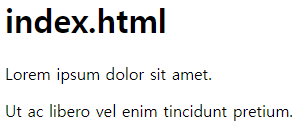


http://127.0.0.1:52273/nothing


public 폴더에 존재하지 않는 파일 경로로 들어간 경우


미들웨어 순서

server.js

```js
// 모듈을 추출합니다.
const express = require('express');

// 웹 서버를 생성합니다.
let app = express();
app.use((request, response) => {
    response.send('<h1>Hello Middleware .. !</h1>');
});
app.use(express.static('public'));

// 웹 서버를 실행합니다.
app.listen(52273, () => {
    console.log('Server Running at http://127.0.0.1:52273');
});
```

어떠한 경로로 들어가도 'Hello Middleware .. !' 를 출력한다. 첫 번째 미들웨어에서 다음 미들웨어를 호출하지 않아서 발생하는 문제.

미들웨어는 위에서부터 아래로 실행된다.


### 라우터

사용자의 요청에 따라 사용자가 필요한 정보를 제공하는 것을 "라우트(route)한다"라고 표현한다. 그리고 이러한 기능을 수행하는 미들웨어를 라우터(router)라고 부른다.


#### router 미들웨어 사용

router 미들웨어는 거의 반드시 사용할 것이라고 판단하기 때문에 따로 설정하지 않아도 자동적으로 사용됨


#### app 객체의 메서드

* app.get()
  * 클라이언트의 GET 요청을 처리한다.
* app.post()
  * 클라이언트의 POST 요청을 처리한다.
* app.put()
  * 클라이언트의 PUT 요청을 처리한다.
* app.delete()
  * 클라이언트의 DELETE 요청을 처리한다.
* app.all()
  * 클라이언트의 모든 요청을 처리한다.


#### 라우트와 응답

server.js

```js
// 모듈을 추출합니다.
const express = require('express');

// 웹 서버를 생성합니다.
const app = express();
app.use(express.static('public'));

// 라우트합니다.
app.all('/a', (request, response) => {
    response.send('<h1>Page A</h1>');
});

app.all('/b', (request, response) => {
    response.send('<h1>Page B</h1>');
});

app.all('/c', (request, response) => {
    response.send('<h1>Page C</h1>');
});

// 웹 서버를 실행합니다.
app.listen(52273, () => {
    console.log('Server Running at http://127.0.0.1:52273');
});
```

각각의 경로로 들어갈 때 각각의 콜백함수가 실행된다.


http://127.0.0.1:52273/a

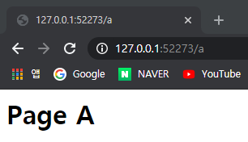

http://127.0.0.1:52273/b

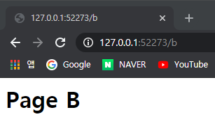


### 응답과 응답 형식

정적 파일 제공과 라우터를 활용하는 방법

서버에 HTML 형식이 아닌 다른 형식으로 데이터를 제공

* /data.html
  * 데이터를 HTML 형식으로 제공
* /data.json
  * 데이터를 JSON 형식으로 제공

* /data.xml
  * 데이터를 XML 형식으로 제공


#### 기본 서버 구성

server.js

```js
// 모듈을 추출합니다.
const express = require('express');

// 변수를 선언합니다.
let items = [{
    name: '우유',
    price: '2000'
}, {
    name: '홍차',
    price: '5000'
}, {
    name: '커피',
    price: '5000'
}];

// 웹 서버를 생성합니다.
const app = express();
app.use(express.static('public'));

// 라우트합니다.
app.all('/data.html', (request, response) => { });
app.all('/data.json', (request, response) => { });
app.all('/data.xml', (request, response) => { });

// 웹 서버를 실행합니다.
app.listen(52273, () => {
    console.log('Server Running at http://127.0.0.1:52273');
});
```


#### 1. HTML 응답

`send()` 메서드의 매개변수에 문자열을 넣어주면 된다.

server.js

```js
app.all('/data.html', (request, response) => {
    let output = '';
    output += '<!DOCTYPE html>';
    output += '<html>';
    output += '<head>';
    output += ' <title>Data HTML</title>';
    output += '</head>';
    output += '<body>';
    items.forEach((item) => {
        output += '<div>';
        output += ' <h1>' + item.name + '</h1>';
        output += ' <h2>' + item.price + '</h2>';
        output += '</div>';
    });
    output += '</body>';
    output += '</html>';
    response.send(output);
});
```

HTML 문자열을 직접 조합했지만, 실제로는 템플릿 엔진을 활용해 HTML 문자열을 생성한다.


http://127.0.0.1:52273/data.html

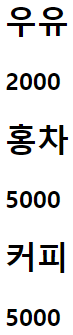


#### 2. JSON 응답

##### send() 메서드의 매개변수에 따른 응답 형식

| 자료형 | 응답 형식 |
| ------ | --------- |
| 문자열 | HTML      |
| 배열   | JSON      |
| 객체   | JSON      |

JSON 형식으로 응답할 때에는 자바스크립트 객체를 `send()` 메서드의 매개변수로 넣으면 된다.


server.js

```js
app.all('/data.json', (request, response) => {
    response.send(items);
});
```


Chrome 웹 스토어 => JSON Formatter 크롬 확장 프로그램 설치

JSON 문자열이 예쁘게 정리된다.

http://127.0.0.1:52273/data.json


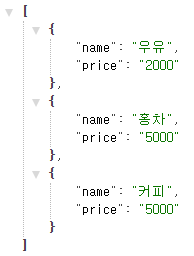


#### 3. XML 응답

`send()` 메서드는 HTML 형식과 JSON 형식으로 데이터를 제공하는 기능만 있다.

다른 형식으로 데이터를 제공하고 싶을 때는 `response.type()` 메서드로 데이터 응답 형식을 지정해줘야 한다.

server.js

```js
app.all('/data.xml', (request, response) => {
    let output = '';
    output += '<?xml version="1.0" encoding="UTF-8" ?>';
    output += '<products>';
    items.forEach((item) => {
        output += '<product>';
        output += ' <name>' + item.name + '</name>';
        output += ' <price>' + item.price + '</price>';
        output += '</product>';
    });
    output += '</products>';
    response.type('text/xml');
    response.send(output);
});
```


http://127.0.0.1:52273/data.xml

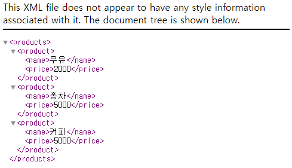


#### MIME 형식

`type()` 메서드의 매개변수로 넣는 문자열은 MIME 형식에서 정의한 문자열이다.

##### MIME 형식의 예

| Content Type | 설명               |
| ------------ | ------------------ |
| text/plain   | 기본적인 텍스트    |
| text/html    | HTML 문서          |
| text/css     | CSS 문서           |
| text/xml     | XML 문서           |
| image/jpeg   | JPG/JPEG 그림 파일 |
| image/png    | PNG 그림 파일      |
| video/mpeg   | MPEG 비디오 파일   |
| audio/mp3    | MP3 음악 파일      |

인터넷에서 'MIME TYPE 목록' 검색


### Postman 크롬 확장 프로그램

Postman 크롬 확장 프로그램은 HTTP 요청을 수행하는 프로그램이다.

Postman을 사용하면 손쉽게 HTTP 요청을 수행할 수 있다.

크롬 웹 스토어에서 Postman 검색, 설치


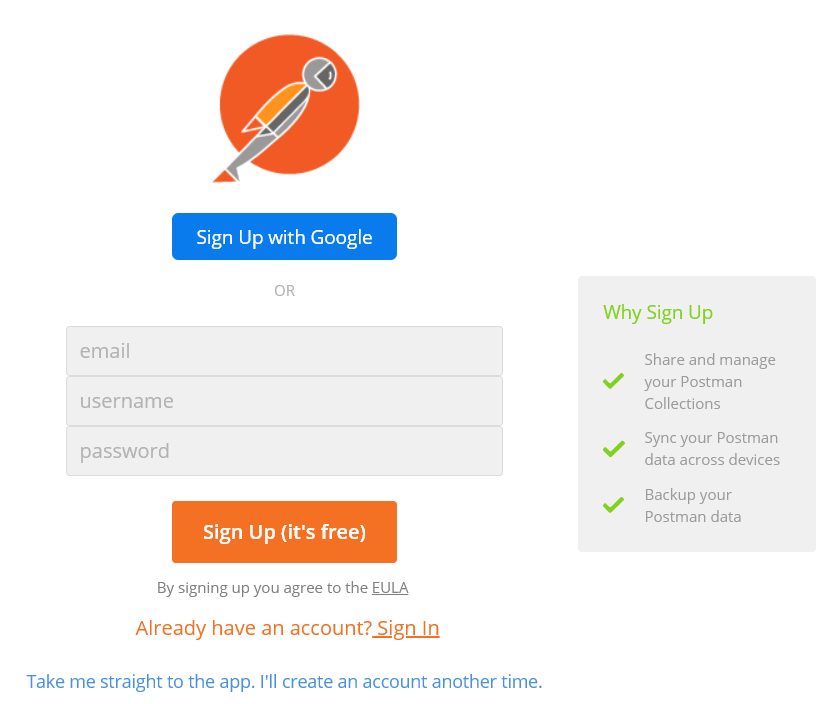


가장 아래에 있는 `Take me straight to...` 클릭


http://127.0.0.1:52273/data.html 입력 => Send 버튼 클릭

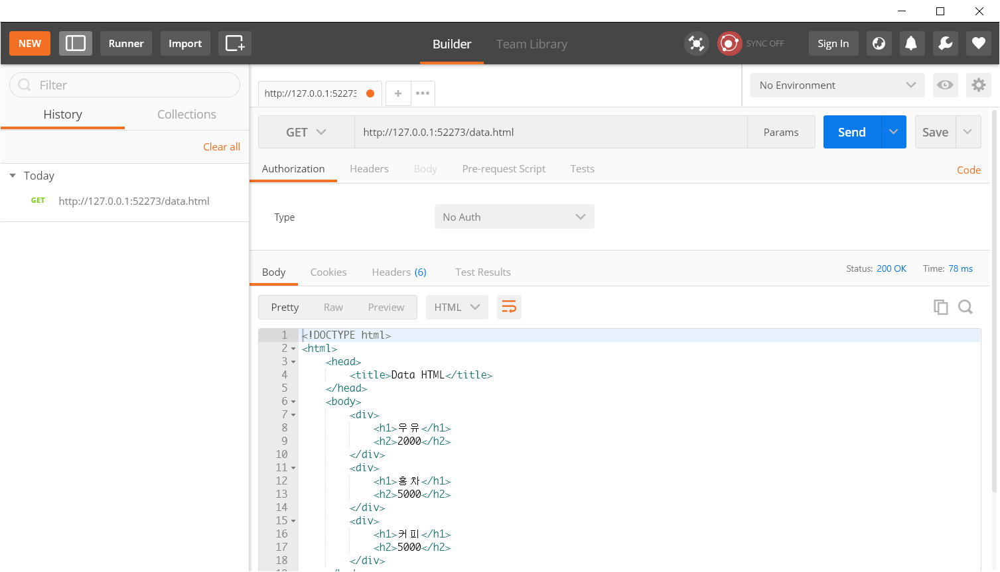


### 요청과 요청 매개변수

클라이언트가 서버로 정보 전달

```URL
https://search.daum.net/search?w=tot&DA=YZR&t__nil_searchbox=btn&sug=&sugo=&q=html5
http://주소/경로?키A=값A&키B=값B
```


#### 일반 요청 매개변수

일반 요청 매개변수는 키=값 블록으로 데이터를 전달하는 방법이다.

server.js

```js
app.all('/parameter', (request, response) => {
    const name = request.param('name');
    const region = request.param('region');

    // 응답합니다.
    response.send('<h1>' + name + ':' + region + '</h1>');
});
```


postman 에 http://127.0.0.1:52273/parameter 입력

[Params] 버튼 클릭 => name, region 입력 => [Send] 버튼 클릭

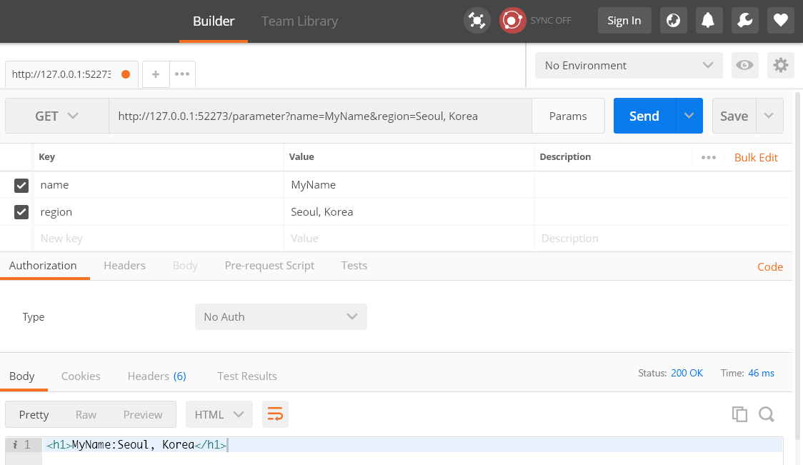


#### 동적 라우트 요청 매개변수

위키피디아의 검색은 키=값 형태의 요청 매개변수를 사용하는 것이 아니라 경로에 직접 입력한다.

* HTML 검색
  * https://en.wikipedia.org/wiki/HTML
* Cloud 검색
  * https://en.wikipedia.org/wiki/Cloud


이런 웹 사이트를 만들려면 모든 경로를 라우트해야 한다.

경로에서 변할 수 있는 부분을 지정하고 라우트한다.

이렇게 동적으로 변할 수 있는 부분을 처리하는 라우트를 '동적 라우트' 라고 부른다.

```js
app.all('/wiki/:keyword', (request, response) => { });
```


##### 동적 라우트

server.js

```js
app.all('/parameter/:id', (request, response) => {
    // 변수를 선언합니다.
    const id = request.params.id;

    // 응답합니다.
    response.send('<h1>' + id + '</h1>');
});
```


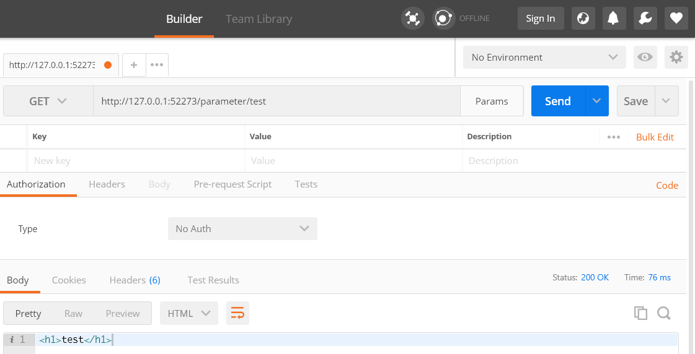


### 요청 방식

동작을 나타내는 것은 '요청 방식(method)' 으로 처리한다.

| 메서드  | 의미                       |
| ------- | -------------------------- |
| GET     | 자원 조회                  |
| POST    | 자원 추가                  |
| PUT     | 자원 수정                  |
| DELETE  | 자원 삭제                  |
| HEAD    | 자원의 메타 데이터 조회    |
| OPTIONS | 사용 가능한 요청 방식 조회 |
| TRACE   | 테스트 목적의 데이터 조회  |
| CONNECT | 연결 요청                  |


예를 들어 상품 정보라면 다음 형태의 URL로 관리한다.

* GET 요청 : 127.0.0.1:52273/products
  * 제품 전체를 조회한다.
* GET 요청 : 127.0.0.1:52273/products/273
  * 273번 제품을 조회한다.
* POST 요청 : 127.0.0.1:52273/products
  * 제품을 추가한다.
* PUT 요청 : 127.0.0.1:52273/products/273
  * 273번 제품을 수정한다.
* DELETE 요청 : 127.0.0.1:52273/products/273
  * 273번 제품을 제거한다.


이렇게 구성되는 웹 서비스를 RESTful 웹 서비스라고 한다.


#### 요청 방식 처리 메서드

| 메서드 이름  | 설명                                   |
| ------------ | -------------------------------------- |
| app.get()    | 클라이언트의 GET 요청을 처리합니다.    |
| app.pose()   | 클라이언트의 POST 요청을 처리합니다.   |
| app.put()    | 클라이언트의 PUT 요청을 처리합니다.    |
| app.delete() | 클라이언트의 DELETE 요청을 처리합니다. |


GET 요청 이외의 요청에서 매개변수를 추출하려면 body parser 미들웨어가 필요하다.

body parser 미들웨어는 따로 설치해서 사용해야 한다.

```powershell
PS C:\node> npm install body-parser
```


urlencoded() 메서드를 사용하면 일반적인 URL 인코딩 요청으로 오는 데이터를 자동으로 분해해주는 함수를 리턴한다. 이를 app.use() 메서드의 매개변수에 넣어 미들웨어로 사용한다.


server.js

```js
// 모듈을 추출합니다.
const express = require('express');
const bodyParser = require('body-parser');

// 변수를 선언합니다.
let items = [{
    name: '우유',
    price: '2000'
}, {
    name: '홍차',
    price: '5000'
}, {
    name: '커피',
    price: '5000'
}];

// 웹 서버를 생성합니다.
const app = express();
app.use(express.static('public'));
app.use(bodyParser.urlencoded({ extended: false }));

app.get('/products', (request, response) => {});
app.get('/products/:id', (request, response) => {});
app.post('/products', (request, response) => {});
app.put('/products/:id', (request, response) => {});
app.delete('/products/:id', (request, response) => {});

// 웹 서버를 실행합니다.
app.listen(52273, () => {
    console.log('Server Running at http://127.0.0.1:52273');
});
```


#### 1. 데이터 조회

```js
app.get('/products', (request, response) => {
    response.send(items);
});
```


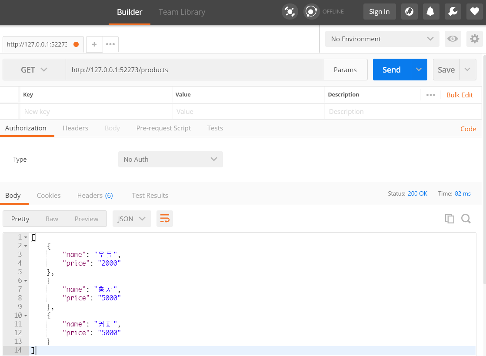


데이터를 하나만 제공하는 GET 요청의 /products/:id 작성

```js
app.get('/products/:id', (request, response) => {
    // 변수를 선언합니다.
    const id = Number(request.params.id);

    if (isNaN(id)) {
        // 오류: 잘못된 경로
        response.send({
            error: '숫자를 입력하세요!'
        });
    } else if (items[id]) {
        // 정상
        response.send(items[id]);
    } else {
        // 오류: 요소가 없을 경우
        response.send({
            error: '존재하지 않는 데이터입니다!'
        });
    }
});
```


http://127.0.0.1:52273/products/0 에 GET 요청 보내기

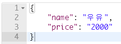


http://127.0.0.1:52273/products/test 에 GET 요청 보내기

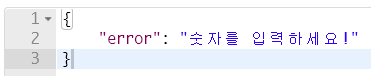


http://127.0.0.1:52273/products/100 에 GET 요청 보내기

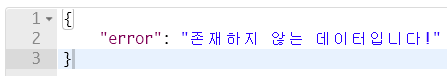


#### 2. 데이터 추가

```js
app.post('/products', (request, response) => {
    // 변수를 선언합니다.
    const name = request.body.name;
    const price = request.body.price;
    const item = {
        name: name,
        price: price
    };

    // 데이터를 추가합니다.
    items.push(item);

    // 응답합니다.
    response.send({
        message: '데이터를 추가했습니다.',
        data: item
    });
});
```


http://127.0.0.1:52273/products 에 POST 요청 보내기


http://127.0.0.1:52273/products 에 GET 요청 보내서 확인

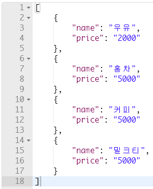


#### 3. 데이터 수정

```js
app.put('/products/:id', (request, response) => {
    // 변수를 선언합니다.
    const id = Number(request.params.id);
    const name = request.body.name;
    const price = request.body.price;

    if (items[id]) {
        // 데이터를 수정합니다.
        if (name) { items[id].name = name; }
        if (price) { items[id].price = price; }

        // 응답합니다.
        response.send({
            message: '데이터를 수정했습니다.',
            data: items[id]
        });
    } else {
        // 오류: 요소가 없을 경우
        response.send({
            error: '존재하지 않는 데이터입니다!'
        });
    }
});
```


http://127.0.0.1:52273/products/0 에 PUT 요청을 보내 데이터 수정

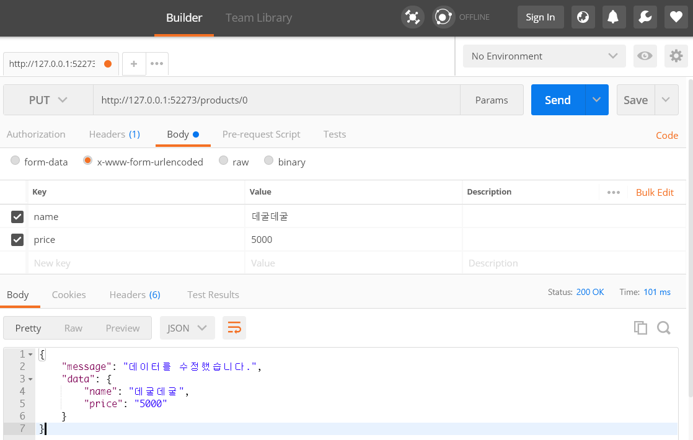


http://127.0.0.1:52273/products/0 에 GET 요청을 보내서 확인

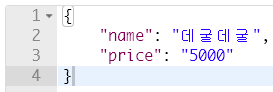


#### 4. 데이터 삭제

```js
app.delete('/products/:id', (request, response) => {
    // 변수를 선언합니다.
    const id = Number(request.params.id);

    if (isNaN(id)) {
        // 오류: 잘못된 경로
        response.send({
            error: '숫자를 입력하세요!'
        });
    } else if (items[id]) {
        // 정상: 데이터 삭제
        items.splice(id, 1);
        response.send({
            message: '데이터를 삭제했습니다.'
        });
    } else {
        // 오류: 요소가 없을 경우
        response.send({
            error: '존재하지 않는 데이터입니다!'
        });
    }
});
```


http://127.0.0.1:52273/products/0 에 DELETE 요청 보내기

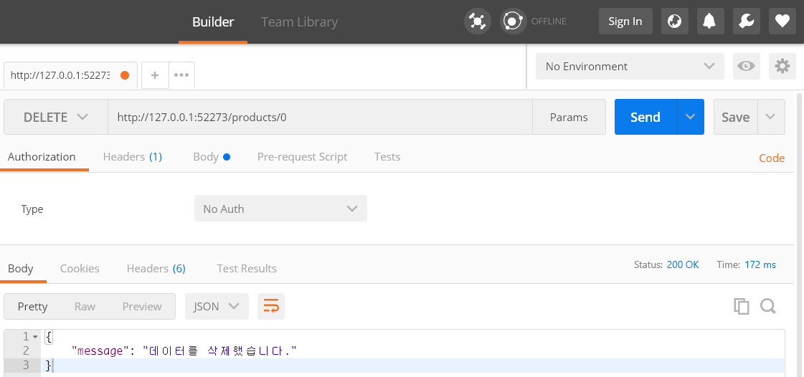


http://127.0.0.1:52273/products 에 GET 요청

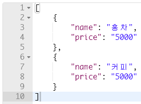


#### 5. 클라이언트 페이지

public 폴더의 index.html 파일

index.html

```js
<!DOCTYPE html>
<html>
<head>
    <title>Data Process</title>
</head>
<body>
    <form action="/products" method="get">
        <fieldset>
            <legend>GET</legend>
            <input type="submit" />
        </fieldset>
    </form>
    <form action="/products" method="post">
        <fieldset>
            <legend>POST</legend>
            <input name="name" />
            <input name="price" />
            <input type="submit" />
        </fieldset>
    </form>
</body>
</html>
```


http://127.0.0.1:52273/

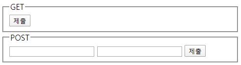


GET 요청의 `제출` 버튼 클릭

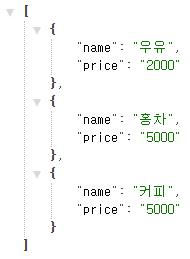


POST 요청의 입력 양식을 채우고 `제출` 버튼 클릭

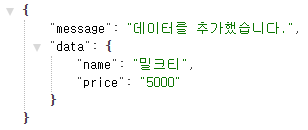


