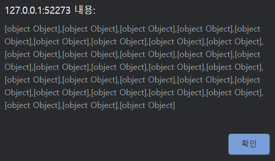

# Ajax

## 크로스 도메인

* 크로스 도메인 : 도메인이 다른 곳에 요청하는 것을 의미한다.
* CORS(Cross-Origin Resource Sharing) : 서로 다른 도메인끼리 통신하는 것을 의미한다. 웹 브라우저는 보안상의 위협으로부터 사용자를 보호하기 위해 이러한 통신을 막는다.
* JSONP(JSON with Padding) : 서로 다른 도메인끼리 어떻게 해서라도 통신을 하기 위해 만들어진 방법.
* request 모듈 : Node.js로 웹 요청을 할 때 사용하는 모듈


### 개요

다른 도메인에 존재하는 데이터를 가져와 사용하는 방법

Ajax에서 이용하는 XMLHttpRequest 객체는 보안상의 제한으로 인해 자바스크립트 파일을 가져왔던 서버하고만 통신을 할 수 있다. 자바스크립트가 있는 서버가 아닌 다른 서버와 통신한다면 웹 브라우저에서 입력한 정보를 사용자가 모르는 사이에 다른 서버로 전송할 수 있기 때문이다.


* 크로스 도메인 통신 : 불특정 다수의 도메인 서버에 접근하는 것


### JSONP 개요

JSONP는 크로스 도메인에서 벗어나서 좀 더 유연하게 동적으로 데이터를 서버에 전달하고 응답받아 처리하려고 고안한 방법이다.

다른 도메인의 데이터를 자바스크립트로 받아올 수 없다고 했지만, 앞에서 이미 다음과 같은 다른 도메인의 데이터를 사용했었다.

```html
<script src="https://ajax.googleapis.com/ajax/libs/jquery/3.4.1/jquery.min.js"></script>
```

이를 통해 다른 도메인의 데이터를 가져오는 방법이 JSONP이다.


GitHub에서 제공하는 API로 jQuery 재단의 리포지토리 일부를 가져오는 경로

https://api.github.com/users/jquery/repos


https://developer.github.com/v3/#json-p-callbacks

GET 요청을 할 때 ?callback 매개변수를 보내면 JSON 함수로 감싸진 형태의 결과를 받을 수 있다.

index.html

```html
<!DOCTYPE html>
<html>
<head>
    <script>
        function test(input) {
            alert(input.data);
        }
    </script>
    <script src="https://api.github.com/users/jquery/repos?callback=test"></script>
</head>
<body>

</body>
</html>
```





index.html

```html
<!DOCTYPE html>
<html>
<head>
    <script src="https://ajax.googleapis.com/ajax/libs/jquery/3.4.1/jquery.min.js"></script>
    <script>
        $(document).ready(() => {
            $.ajax('https://api.github.com/users/jquery/repos', {
                dataType: 'jsonp',
                success: (input) => {
                    $.each(input.data, (index, item) => {
                        // 문서 객체를 생성합니다.
                        const a = $('<h2></h2>').html(item.name);
                        const b = $('<a></a>')
                            .attr('href', item.html_url)
                            .html(item.html_url);
                        const c = $('<hr />');

                        // body 태그에 내용을 추가합니다.
                        $('<div></div>').append(a, b, c).appendTo('body');
                    });
                }
            });
        });
    </script>
</head>
<body>

</body>
</html>
```


http://127.0.0.1:52273/


크로스 도메인 통신으로 데이터를 가져와 화면에 출력


getJSON() 메서드를 사용하는 방법. 자동으로 jQuery가 다른 도메인의 데이터라는 것을 확인하고, 알아서 모든 것을 처리한다.

```js
$.getJSON('https://api.github.com/users/jquery/repos', (data) => {
    alert(data);
});
```


### JSONP 웹 서비스

server.js

```js
// 모듈을 추출합니다.
const express = require('express');

// 웹 서버를 생성합니다.
const app = express();
app.use(express.static('public'));

// 웹 서버를 라우트합니다.
app.get('/data.jsonp', (request, response) => {
    // 요청 변수를 추출합니다.
    const callback = request.query.callback;

    // 응답합니다.
    response.send(callback + '(' + JSON.stringify({
        제품명: '7D 건조 망고',
        유형: '당절임',
        성분: '망고, 설탕, 메타중아황산나트륨, 치자황색소',
        원산지: '필리핀'
    }) + ')');
});

// 웹 서버를 실행합니다.
app.listen(52273, () => {
    console.log('Server Running at http://127.0.0.1:52273');
});
```


http://127.0.0.1:52273/data.jsonp?callback=test


index.html

```html
<!DOCTYPE html>
<html>
<head>
    <title>redirect Client</title>
    <script src="https://ajax.googleapis.com/ajax/libs/jquery/3.4.1/jquery.min.js"></script>
    <script>
        $.ajax({
            url: '/data.jsonp',
            dataType: 'jsonp',
            success: (data) => {
                alert(JSON.stringify(data));
            }
        })
    </script>
</head>
<body>

</body>
</html>
```


http://127.0.0.1:52273/


### 간접 접근 웹 서비스

RSS 문서는 뉴스 등 웹 콘텐츠를 쉽게 배급, 배포할 수 있게 만든 규격화된 형태의 XML 문서이다.

기상청 RSS : http://www.weather.go.kr/weather/lifenindustry/sevice_rss.jsp

전국 날씨 : http://www.weather.go.kr/weather/forecast/mid-term-rss3.jsp?stnId=108


server.js

```js
// 모듈을 추출합니다.
const http = require('http');
const express = require('express');

// 웹 서버를 생성합니다.
const app = express();
app.use(express.static('public'));

// 웹 서버를 라우트합니다.
app.get('/data.redirect', (request, response) => {
    // 기상청 RSS 페이지에 데이터 요청
    http.get('http://www.weather.go.kr/weather/forecast/mid-term-rss3.jsp?stnId=108',
        (web) => {
            // 데이터를 읽을 때마다
            web.on('data', (buffer) => {
                response.write(buffer);
            });
            // 데이터를 모두 읽으면
            web.on('end', () => {
                response.end();
            });
        }
    );
});

// 웹 서버를 실행합니다.
app.listen(52273, () => {
    console.log('Server Running at http://127.0.0.1:52273');
});
```


http://127.0.0.1:52273/data.redirect


index.html

```html
<!DOCTYPE html>
<html>
<head>
    <title>redirect Client</title>
    <script src="https://ajax.googleapis.com/ajax/libs/jquery/3.4.1/jquery.min.js"></script>
    <script>
        $(document).ready(() => {
            $.ajax({
                url: '/data.redirect',
                success: (data) => {
                    $('body').text(data);
                }
            });
        });
    </script>
</head>
<body>

</body>
</html>
```


http://127.0.0.1:52273/


