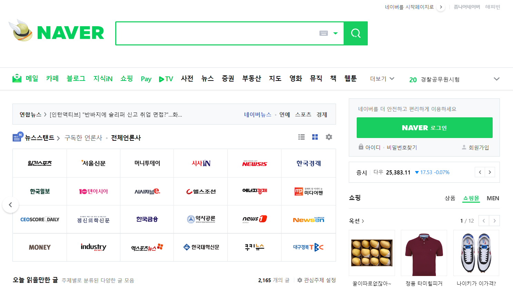
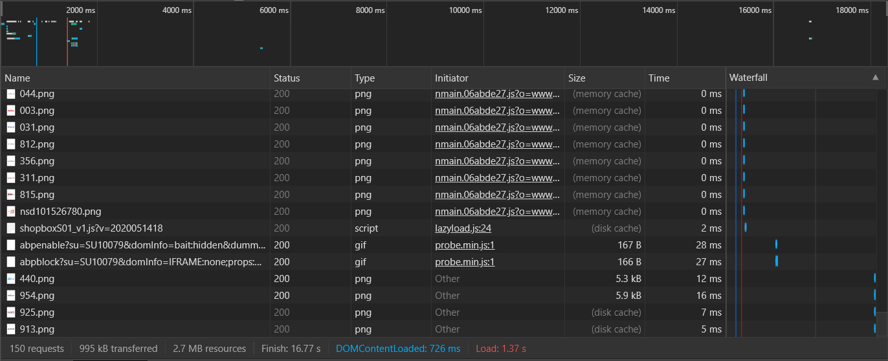
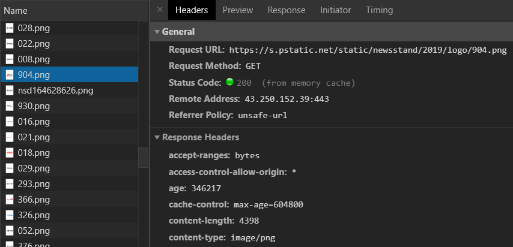
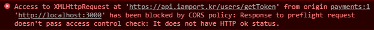

# CORS

* **교차 출처 자원 공유**(Cross-origin resource sharing, CORS)
* **도메인** 또는 **포트**가 다른 서버의 자원을 요청하는 매커니즘을 말한다.
* 요청을 할 때는 cross-origin HTTP 에 의해 요청된다.
* 특정한 도메인 간(cross-domain) 요청, 특히 Ajax 요청은 동일-출처 보안 정책에 의해 기본적으로 금지된다.

* 동일 출처 정책(same-origin policy) 때문에 CORS 같은 상황이 발생 하면 외부서버에 요청한 데이터를 브라우저에서 보안목적으로 차단한다. 그로 인해 정상적으로 데이터를 받을 수 없다.


```
동일 출처 정책(same-origin policy)
불러 온 문서나 스크립트가 다른 출처에서 가져온 리소스와 상호작용하는 것을 제한하는 중요한 보안 방식이다. 이것은 잠재적 악성 문서를 격리하여, 공격 경로를 줄이는데 도움이 된다.
```


* 서로 다른 Origin 간에 리소스를 주고 받는 일은 굉장히 흔한 일이다.





* 개발자도구를 켠 다음에 `Network` 탭으로 이동하면 다음과 같은 화면을 볼 수 있다.





* 이 모든 리소스를 [https://naver.com](https://naver.com/) 서버에서 관리할 수도 있지만 조금 더 보편적인 구조는 이미지를 저장하는 서버 (아마존의 S3와 같은 서비스) 와 사용자들이 접속하는 서버가 서로 다른 경우이다.





* `General` 부분을 보면 [https://s.pstatic.net](https://s.pstatic.net/) 이 실제로 리소스를 가지고 있는 곳임을 알 수 있다.
* `Response Headers` 의 두 번째 줄을 보면 `Access-Control-Allow-Origin` 헤더가 *로 설정되어 있는 것을 알 수 있다.
* *은 일반적으로 Wildcard 선택자라고 부르며, 모든 곳에 매치가 된다는 뜻이다.
* `Access-Control-Allow-Origin` 헤더가 *으로 설정되어 있다는 말은 어떤 Origin에서 해당 리소스를 요청하더라도 접근이 가능하다는 말이다.


## CORS를 가능하게 하는 방법

### 1) 서버에 CORS 설정 허용하기

* 응답에 `Access-Control-Allow-Origin` 헤더를 포함시키는 방법은 서버에서 특정 Origin 을 허용하도록 설정을 바꾸거나 모든 Origin에 대해 허용하도록 하면 된다.


* localhost:3000에서 React를 실행하였고, 서버는 localhost:8080번에서 실행한다.

java/wing/api/web/ArtistController.java

```java
@Api(tags = {"Artist Controller"})
@RestController
@AllArgsConstructor
@CrossOrigin
public class ArtistController {

    private final ArtistService artistService;

    @ApiOperation(value = "아티스트 조회", notes = "기본 키 (artist_id)로 조회")
    @GetMapping("/api/artist/{id}")
    private ArtistResponseDto findById(@PathVariable("id") Long id) {
        return artistService.findById(id);
    }
    		:
```

@CrossOrigin 어노테이션을 붙여서 서로 다른 도메인에서 리소스를 공유할 수 있도록 허용


### 2) 프록시 서버 사용하기

* 만약 요청하는 리소스가 구글의 리소스라면?
  * 구글에 전화를 해서 내 Origin을 허용하게끔 설정을 바꾼다. => 불가능
* 허용되는 Origin에서 요청을 하는 것처럼 내 요청을 해당 서버에 전달해줄 조력자(프록시 서버)가 필요하다.


#### 프록시 서버

* 프록시 서버란 요청을 받아서 다른 곳으로 요청을 돌려주는 옛날의 전화 교환원과 같은 일을 하는 서버이다.
* 프록시 서버는 응답을 돌려주는 일 외에도 헤더를 추가하거나 요청을 허용/거부 (방화벽) 하는 등의 일이 가능하다.


#### 아임포트 REST API 이용 과정 중 발생한 문제

* 아임포트 REST API는 인증이 필요한 API이다.

* /users/getToken 에서 API 키 & API secret을 사용해 access_token을 발급받고, API 호출 시 access_token을 같이 전달한다.
* `Authorization: access_token` 또는 `X-ImpTokenHeader: access_token` 으로 HTTP header를 통해 전달한다.


```js
const [accessToken, setAccessToken] = useState(null);

const authConfig = {
    headers: {'Accept': 'application/json', 'Content-Type': 'application/json'},
}

const authData = {
    imp_key: 'imp_key' , imp_secret: 'imp_secret'
}

// 인증 토큰 요청
axios.post('https://api.iamport.kr/users/getToken', authData, authConfig)
    .then(res => setAccessToken(res.data.response.access_token));
```


REST API사용을 위한 인증(access_token취득)을 하는 authenticate 기능 사용 중 CROS 문제 발생





#### CORS Anywhere

* `CORS Anywhere`는 Node.js로 작성된 프록시 서버로 `Access-Control-Allow-Origin` 헤더를 추가해서 돌려준다.


```js
// 인증 토큰 요청
axios.post('https://cors-anywhere.herokuapp.com/https://api.iamport.kr/users/getToken', authData, authConfig)
    .then(res => setAccessToken(res.data.response.access_token));
```

Request URL 앞에 `https://cors-anywhere.herokuapp.com/`를 추가


## 정리

* `CORS`는 서로 다른 Origin 간에 리소스를 전달하는 방식을 제어하는 메커니즘이다.
* `CORS` 요청이 가능하려면 서버에서 특정한 헤더 (`Access-Control-Allow-Origin`) 과 함께 응답할 필요가 있다.
* `CORS`를 가능하게 하기 위한 방법으로는 1) 프록시 서버 사용 2) 서버에 CORS 설정 허용하기 (해당 Origin 추가) 가 있다.


## 참고 사이트

https://velog.io/@leejh3224/CORS-Real-examples-8yjnloovl5

https://velog.io/@wlsdud2194/cors


