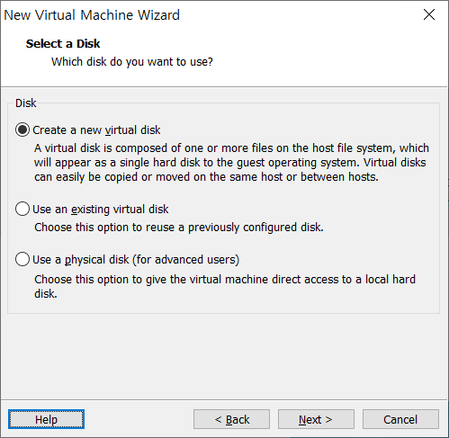

# CentOS 7 Linux_1

## 1. 실습 환경 구축

### 1.1 가상머신 소개와 설치

#### 가상머신과 가상머신 소프트웨어의 개념

* 가상머신
  * 진짜 컴퓨터가 아닌 가상으로 존재하는 컴퓨터
* 가상머신 소프트웨어
  * 가상머신을 생성하는 소프트웨어
  * 컴퓨터에 설치된 운영체제(호스트 OS) 안에 가상의 컴퓨터를 만들고, 그 가상의 컴퓨터 안에 또 다른 운영체제(게스트 OS)를 설치/운영 할 수 있도록 제작된 소프트웨어
  * 기존 PC에 설치되어 있는 운영체제를 호스트 운영체제라 부르며, 그 외 가상머신에 설치한 운영체제를 게스트 운영체제라고 부른다.

#### VMware Workstation 설치

* VMware Workstation 12를 설치한다.

* 업데이트를 자동으로 알려주는 기능과 문제 발생 시 문제 내용을 VMware 사에 자동으로 보내주는 기능을 해제한다. (켜 놓아도 상관 없다.)

* VMware Workstation 12의 첫 실행 화면

  

### 1.2 가상머신 생성

#### 가상머신 만들기

* VMware 프로그램으로 가상머신 생성
* 생성한 가상머신은 `*.vmdk`라는 확장명을 포함한 몇 개의 관련 파일로 존재한다.
* 가상머신을 생성할 때마다 각각의 가상머신은 지정한 폴더에 생성된다.
* 가상머신은 폴더에 저장되므로, 디스크 공간의 여유가 있는 드라이브(30GB 이상의 여유 공간이 있는 드라이버 권장)에 폴더 생성

1. 가상머신을 설치할 C:\Linux\CentOS7 폴더 생성

2. VMware 메뉴에서 File -> New Virtual Machine 선택

3. 구성 타입을 Custom으로 선택

   

4. 운영체제를 설치하는 방법을 선택하는 창이다. 가상머신만 만들고 설치는 나중에 할 것이므로, 세 번째의 I will install the operating system later를 선택

   

5. Select a Guest Operation System 창에서 Guest operating system은 Linux를, Version은 CentOS 64-bit를 선택한다.

   

6. 가상머신 이름을 CentOS7로 정하고 경로는 C:\Linux\CentOS7 로 지정한다.

   

7. Number of cores per processor를 2로 정한다.

   

8. Memory for the Virtual Machine을 4GB로 정한다.

   

9. Network Type은 NAT 방식을 선택한다.

   

10. Create a new virtual disk 선택

    

11. Maximum disk size를 50GB로 정하고, Store virtual disk as a single file을 선택한다.

    

12. disk file을 저장할 위치로 C:\Linux\CentOS7 폴더를 지정한다.

    

13. 완성된 가상머신

    

    

* 가상머신 부팅 후 `F2`키를 누르면 가상머신 BIOS 설정 화면이 나온다.
* `Ctrl` + `Alt` : 마우스를 게스트 OS에서 호스트 OS로 가져온다.

### 1.3 VMware의 특징

* 1대의 컴퓨터만으로 실무 환경과 거의 비슷한 네트워크 컴퓨터 환경의 구성이 가능하다.
* 운영체제의 특정 시점을 저장하는 스냅샷 기능을 사용할 수 있다.
* 하드디스크 등의 하드웨어를 내 맘대로 여러 개 장착해서 테스트할 수 있다.
* 현재 PC 상태를 그대로 저장해 놓고, 다음 사용할 때 현재 상태를 이어서 구동할 수 있다.

