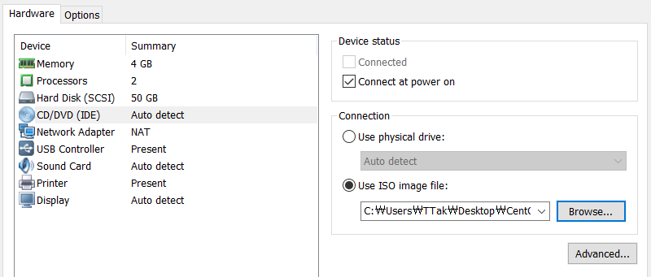

# CentOS 7 Linux_3

## 3. CentOS 리눅스 설치

### 3.1 CentOS 설치

1. https://buildlogs.centos.org/rolling/7/isos/x86_64/ 사이트에서 `CentOS-7-x86_64-DVD-1611.iso` 파일을 다운로드한다.

2. VMware Workstation을 실행한다. CentOS7를 선택하고, Edit virtual machine settings를 클릭한다.

   

3. CD/DVD (IDE)를 클릭한다. Use ISO image file 선택하고, Browse를 눌러 다운로드한 iso 파일을 선택한다.

   

4. Power on this virtual machine을 클릭한다.

5. OK를 선택한다.

   

6. 처음 나온 화면에서 첫 번째 매뉴를 선택한다.

   

7. 언어는 한국어를 선택한다.

   

8. 언어를 한국어로 선택했기 때문에 현지화는 자동으로 설정된다. 영어를 선택한 경우 설정을 변경해줘야 한다.

9. 소프트웨어 선택을 클릭한다. 서버 목적이라면 버그나 해킹 위험이 있기 때문에 OS 최소 설치를 한 뒤 필요한 것들을 설치하는 것이 좋다. 엔드유저의 경우 Gnome 데스크탑을 선택한다. 엔드유저로 사용할 것이기 때문에 Gnome 데스크탑 선택

   


10. `시스템` -> `설치 대상`을 클릭한다. 기타 저장소 옵션에서 파티션 설정 옵션을 `파티션을 설정합니다.`를 선택하고 완료를 누른다.

    

11. LVM을 기본으로 선택한다. `여기를 클릭하여 자동으로 생성합니다.`를 클릭한다.

    

12. 완료, 변경 사항 적용을 차례로 클릭한다.

    

13. VMware 좌측 상단 Edit 메뉴 -> Virtual Network Editor 클릭

14. Change Settings -> VMnet8(NAT) 클릭 후 Subnet IP를 172.20.0.0으로 변경한다.

    

    서브넷 마스크는 255.255.255.0 이다. 네트워크 주소와 호스트 주소가 있는데, 네트워크 주소로 쓰는 비트는 1로, 호스트 주소로 쓰는 비트는 0으로 설정한다. 나머지 한 바이트를 가지고 호스트 주소로 쓰겠다는 것이다.

15. 네트워크 및 호스트명 메뉴를 클릭한다.

16. 이더넷 (ens33) 오른쪽 버튼을 클릭해 `컴`으로 바꾼다. IP 를 자동으로 할당받는다.

    

    NAT가 주소를 바꿔서 보낸다. 사용자들의 IP 주소가 동일해도 상관없다. local에서만 쓰는 주소이기 때문에 내부에서만 충돌 안 나면 통신은 된다.

    인터넷 바깥으로 나가기 위해서는 공인 IP가 필요하다. -> 외부 Gateway

    Bridged mode일 경우 문제 발생

17. 설치 시작을 클릭한다.

18. ROOT 암호를 클릭하고, 암호를 설정한다.

    

19. 사용자 생성을 클릭해 사용자 계정을 생성한다.

    

20. 설치가 완료되면 재부팅을 한다.

21. 초기 설정에서 License Information을 클릭해서 `약관에 동의합니다.`를 체크한 뒤, 완료를 클릭한다.

22. 설정 완료를 클릭한다.

23. CentOS 7 설치 시 생성한 계정으로 로그인한다.

24. 다음 -> 다음 -> 건너뛰기를 차례로 선택한 뒤, `CentOS Linux 사용 시작하기`를 클릭한다.

25. 바탕화면 우클릭 -> 터미널 열기

26. OS를 처음 설치하고 나서는 전체적인 업데이트가 필요하다. root 권한으로 작업을 시도한다.

    ```bash
    [student@localhost ~]$ sudo -i
    
    We trust you have received the usual lecture from the local System
    Administrator. It usually boils down to these three things:
    
        #1) Respect the privacy of others.
        #2) Think before you type.
        #3) With great power comes great responsibility.
    
    [sudo] password for student: 
    [root@localhost ~]# 
    ```

27. `yum update -y` 명령을 입력한다.

    ```bash
    [root@localhost ~]# yum update -y
    ```

    만약 데몬이 동작하고 있어서 update가 안 된다면 `pkill -9 yum`명령으로 이미 동작중인 프로세스를 강제 종료한다.

    그래도 update 작업이 수행되지 않는다면 `rm /var/run/yum.pid`명령을 수행해 해당 파일을 제거한 뒤 다시 update 작업을 수행한다.

28. 편집 -> 기본 설정을 클릭한다. 프로파일 이름이 `이름 없음`으로 되어있다. 다양한 터미널 유형을 선택해서 사용 가능하다.

29. 프로파일 탭 옆의 `+`를 클릭한다. 원하는 형태로 설정 후 닫기를 클릭한다.

    

30. 파일 -> 새 창 -> 생성한 프로파일 선택. 새로 생성한 프로파일 유형이 적용된 터미널 창이 열리는 것을 확인할 수 있다.

    

31. CentOS 화면 우측 하단에 `1/4` 표시를 확인할 수 있다. 작업 공간을 4개까지 지원한다.

    

    단축키는 `Ctrl` + `Alt` + `방향키 위, 아래`

32. VMware 상단 메뉴에 있는 `Enter full screen mode` 버튼을 통해 전체 화면 모드로 변경할 수 있다.

    

33. IP 정보 확인

    ```bash
    [student@localhost ~]$ ip a
    1: lo: <LOOPBACK,UP,LOWER_UP> mtu 65536 qdisc noqueue state UNKNOWN group default qlen 1000
        link/loopback 00:00:00:00:00:00 brd 00:00:00:00:00:00
        inet 127.0.0.1/8 scope host lo
           valid_lft forever preferred_lft forever
        inet6 ::1/128 scope host 
           valid_lft forever preferred_lft forever
    2: ens33: <BROADCAST,MULTICAST,UP,LOWER_UP> mtu 1500 qdisc pfifo_fast state UP group default qlen 1000
        link/ether 00:0c:29:76:e0:b6 brd ff:ff:ff:ff:ff:ff
        inet 172.20.0.128/24 brd 172.20.0.255 scope global noprefixroute dynamic ens33
           valid_lft 1661sec preferred_lft 1661sec
        inet6 fe80::8315:e5a:8e9d:c50c/64 scope link noprefixroute 
           valid_lft forever preferred_lft forever
    3: virbr0: <NO-CARRIER,BROADCAST,MULTICAST,UP> mtu 1500 qdisc noqueue state DOWN group default qlen 1000
        link/ether 52:54:00:f5:1d:66 brd ff:ff:ff:ff:ff:ff
        inet 192.168.122.1/24 brd 192.168.122.255 scope global virbr0
           valid_lft forever preferred_lft forever
    4: virbr0-nic: <BROADCAST,MULTICAST> mtu 1500 qdisc pfifo_fast master virbr0 state DOWN group default qlen 1000
        link/ether 52:54:00:f5:1d:66 brd ff:ff:ff:ff:ff:ff
    ```

    ens33에 적혀있는 IP를 이용해 Xshell로 접근해 작업할 수 있다.

34. Xshell 5 실행 -> 파일 -> 새로 만들기

35. 연결 및 사용자 인증 설정

    

    

36. 관리 작업을 하기 위해서는 root 권한이 필요하다. 같은 방식으로 root 계정도 등록한다. 파일 -> 열기 -> CentOS7 마우스 오른쪽 버튼 클릭 -> 복사 -> 붙여넣기 -> CentOS7-root로 이름 변경 -> CentOS7-root 마우스 오른쪽 버튼 클릭 -> 등록 정보 -> 사용자 인증 -> root 계정으로 변경


* 물리적인 시스템은 하나이지만 여러 개의 가상머신들을 만들어 쉽게 사용할 수 있도록 하는 것이 가상화 솔루션이다.

* 물리적인 시스템은 호스트, 가상머신은 게스트이다.

* 가상 라우터가 가상 머신의 IP를 자동으로 할당한다. 172.20.0.128을 할당 받았다.

* 내부적으로는 unique하게 주소가 할당되어야 한다.

* 가상머신 전원을 끄고 메모리를 4GB로 증설할 수 있다. -> Scale up 방식으로 확장

* Windows에서 가상 스위치가 어떤 이름으로 존재하는지 확인할 수 있다.

  * 윈도우 커맨드 창을 열어서 `ipconfig` 명령 입력

    ```bash
    C:\Users\TTak>ipconfig
    ...
    이더넷 어댑터 VMware Network Adapter VMnet8:
    
       연결별 DNS 접미사. . . . :
       링크-로컬 IPv6 주소 . . . . : fe80::6835:a3fa:71ae:99ae%17
       IPv4 주소 . . . . . . . . . : 172.20.0.1
       서브넷 마스크 . . . . . . . : 255.255.255.0
       기본 게이트웨이 . . . . . . :
    ...
    ```

  * VMnet8이 NAT 모드로 동작하는 스위치이다.

  * 스위치에도 IP가 설정된다. 같은 네트워크 망

  * 가상머신은 같은 네트워크의 128번으로 할당되어있다.

* 커널 버전 확인

  ```bash
  [student@localhost ~]$ uname -a
  Linux localhost.localdomain 3.10.0-1062.9.1.el7.x86_64 #1 SMP Fri Dec 6 15:49:49 UTC 2019 x86_64 x86_64 x86_64 GNU/Linux
  ```

* 배포판 버전 확인

  ```bash
  [student@localhost ~]$ cat /etc/*release
  CentOS Linux release 7.7.1908 (Core)
  NAME="CentOS Linux"
  VERSION="7 (Core)"
  ID="centos"
  ID_LIKE="rhel fedora"
  VERSION_ID="7"
  PRETTY_NAME="CentOS Linux 7 (Core)"
  ANSI_COLOR="0;31"
  CPE_NAME="cpe:/o:centos:centos:7"
  HOME_URL="https://www.centos.org/"
  BUG_REPORT_URL="https://bugs.centos.org/"
  
  CENTOS_MANTISBT_PROJECT="CentOS-7"
  CENTOS_MANTISBT_PROJECT_VERSION="7"
  REDHAT_SUPPORT_PRODUCT="centos"
  REDHAT_SUPPORT_PRODUCT_VERSION="7"
  
  CentOS Linux release 7.7.1908 (Core)
  CentOS Linux release 7.7.1908 (Core)
  ```

  

* 서버로 설치했을 경우 네트워크를 static하게 설정해야 한다.

  ```bash
  [student@localhost ~]$ cd /etc/sysconfig/network-scripts/
  [student@localhost network-scripts]$ pwd
  /etc/sysconfig/network-scripts
  [student@localhost network-scripts]$ ls
  ifcfg-ens33      ifdown-isdn    ifup-bnep   ifup-routes
  ifcfg-lo         ifdown-post    ifup-eth    ifup-sit
  ifdown           ifdown-ppp     ifup-ib     ifup-tunnel
  ifdown-Team      ifdown-routes  ifup-ippp   ifup-wireless
  ifdown-TeamPort  ifdown-sit     ifup-ipv6   init.ipv6-global
  ifdown-bnep      ifdown-tunnel  ifup-isdn   network-functions
  ifdown-eth       ifup           ifup-plip   network-functions-ipv6
  ifdown-ib        ifup-Team      ifup-plusb
  ifdown-ippp      ifup-TeamPort  ifup-post
  ifdown-ipv6      ifup-aliases   ifup-ppp
  ```

  ```bash
  [student@localhost network-scripts]$ cat ifcfg-ens33 
  TYPE="Ethernet"
  BOOTPROTO="dhcp"
  DEFROUTE="yes"
  PEERDNS="yes"
  PEERROUTES="yes"
  IPV4_FAILURE_FATAL="no"
  IPV6INIT="yes"
  IPV6_AUTOCONF="yes"
  IPV6_DEFROUTE="yes"
  IPV6_PEERDNS="yes"
  IPV6_PEERROUTES="yes"
  IPV6_FAILURE_FATAL="no"
  IPV6_ADDR_GEN_MODE="stable-privacy"
  NAME="ens33"
  UUID="30dadf4e-2f6b-4cf3-b599-15a0f3978b66"
  DEVICE="ens33"
  ONBOOT="yes"
  ```

  엔드유저 입장에서는 DHCP가 편한데, 서버라면 static으로 설정해야 한다.

  설정을 변경하고 싶다면 파일 내용을 바꾸면 된다.

