# CentOS 7 Linux_4_1

## 4. 서버를 구축할 때 알아야 할 필수 개념과 명령어

### 4.1 리눅스를 운영하는 데 먼저 알아야 할 개념

* Windows cmd 창에서  CentOS7 접속

  * cmd 창에서 `ssh 사용자계정@IP주소`

    ```bash
    C:\Users\TTak>ssh student@172.20.0.128
    The authenticity of host '172.20.0.128 (172.20.0.128)' can't be established.
    ECDSA key fingerprint is SHA256:j2nMIxsgIJOi2we6cVh/SyRFRBfsvBCpHh/6mWDcumE.
    Are you sure you want to continue connecting (yes/no)? yes
    Warning: Permanently added '172.20.0.128' (ECDSA) to the list of known hosts.
    student@172.20.0.128's password:
    Last login: Mon Jan 27 13:18:20 2020 from 172.20.0.1
    Last login: Mon Jan 27 13:18:20 2020 from 172.20.0.1
    [student@localhost ~]$
    ```
    

접속이 안 될 경우 DHCP로 인해 IP가 변경된 경우일 수 있으니 CentOS7에서 `ip a`로 확인


#### 시작과 종료

* 바탕 화면에서 시스템 종료 실행

  * 바탕 화면의 오른쪽 상단에서 `전원 버튼` -> `전원 버튼` -> `컴퓨터 끄기`

* 터미널/콘솔에서 시스템 종료 명령 실행

  * `poweroff`, `shutdown -P now`, `halt -p` 와 `init 0` 가 있다.

  * -P와 -p 옵션은 시스템 종료를 의미한다.

  * shutdown 명령어의 옵션 중 now 부분에 시간을 지정하면 지정한 시간에 시스템을 종료한다.

    ```bash
    $ shutdown -P +10		# 10분 후에 종료
    $ shutdown -r 22:00		# 오후 10시에 재부팅
    $ shutdown -c			# 예약된 shutdown을 취소
    $ shutdown -k +15		# 현재 접속한 사용자에게 15분 후에 종료된다는 메시지를 보내지만 실제로 종료는 안 됨
    ```

* Signal 15 : 안정적으로 프로세스를 종료시키는 시그널 (`shutdown`, `init`)

* Signal 9 : 강제적으로 프로세스를 종료시키는 시그널 (`poweroff`, `halt`)

* `shutdown`이나 `init`을 사용하는 것을 권장한다.


#### 시스템 재부팅

* 바탕 화면의 오른쪽 상단에서 `전원 버튼` -> `전원 버튼` -> `다시 시작`
* `shutdown -r now`, `reboot`, `init 6`


#### 로그아웃

* 현재 사용자의 시스템 접속을 끝낸다는 뜻이다.
* 리눅스는 여러 명의 사용자가 동시에 접속해서 사용하는 다중 사용자 시스템이므로 자신만 접속을 끝내는 로그아웃이 필요하다.
* 바탕 화면의 오른쪽 상단에서 `전원 버튼` -> `사용자 계정` -> `로그아웃` -> `로그아웃`
* `logout`, `exit`


#### 가상 콘솔

* 가상의 모니터 (작업 공간과는 다르다.)

* CentOS는 총 6개의 가상 콘솔을 제공한다.

* 컴퓨터 한 대에 모니터 여섯 개가 연결된 효과를 낼 수 있다.

* X 윈도가 가동된 화면은 6개의 가상 콘솔 중 1번째

* 나머지 2~6번의 가상 콘솔은 텍스트 모드로 제공된다.

* 가상 콘솔 이동 단축키 : `Ctrl` + `Alt` + `F1`~ `F6`

* 명령으로도 제어 가능. `chvt 가상콘솔번호`

* 2번 가상 콘솔로 이동 후 `tty` 명령 실행

  * 가상이더라도 운영체제 입장에서는 하드웨어이다.

  * 리눅스에서는 하드웨어도 파일로 mapping 해서 관리한다. (장치 파일)

    ```bash
    [root@localhost ~]# tty
    /dev/tty2
    ```

    

#### 런레벨

* `init` 명령어 뒤에 붇는 숫자를 런레벨 이라고 한다.

* 리눅스는 시스템이 가동되는 방법을 7가지 런레벨로 나눌 수 있다.

  | 런레벨 | 영문 모드            | 설명                           | 비고             |
  | ------ | -------------------- | ------------------------------ | ---------------- |
  | 0      | Power Off /.halt     | 종료 모드                      |                  |
  | 1      | Rescue / single.user | 시스템 복구 모드               | 단일 사용자 모드 |
  | 2      | Multi-User           |                                | 사용하지 않음    |
  | 3      | Multi-User (Server)  | 텍스트 모드의 다중 사용자 모드 |                  |
  | 4      | Multi-User           |                                | 사용하지 않음    |
  | 5      | Graphical            | 그래픽 모드의 다중 사용자 모드 |                  |
  | 6      | Reboot               |                                |                  |

* /lib/systemd/system 디렉터리의 runlevel?.target 파일 확인

  ```bash
  [student@localhost ~]$ cd /lib/systemd/system
  [student@localhost system]$ ls -l runlevel?.target
  lrwxrwxrwx. 1 root root 15  1월 27 12:27 runlevel0.target -> poweroff.target
  lrwxrwxrwx. 1 root root 13  1월 27 12:27 runlevel1.target -> rescue.target
  lrwxrwxrwx. 1 root root 17  1월 27 12:27 runlevel2.target -> multi-user.target
  lrwxrwxrwx. 1 root root 17  1월 27 12:27 runlevel3.target -> multi-user.target
  lrwxrwxrwx. 1 root root 17  1월 27 12:27 runlevel4.target -> multi-user.target
  lrwxrwxrwx. 1 root root 16  1월 27 12:27 runlevel5.target -> graphical.target
  lrwxrwxrwx. 1 root root 13  1월 27 12:27 runlevel6.target -> reboot.target
  ```

  각 링크 파일은 실제 파일과 연결되어 있다.

* `who -r` 명령어를 통해 level 확인 가능

  ```bash
  [student@localhost system]$ who -r
           run-level 5  2020-01-27 12:58
  ```

  

##### 런레벨 변경해보기

```bash
[student@localhost system]$ init 3
```

비밀번호 입력

root 계정으로 로그인

```bash
[root@localhost ~]$ who -r
         run-level 3  2020-01-27 16:39                   last=5
```

실행 수준이 3인 것을 확인할 수 있다.

```bash
[root@localhost ~]$ init 1
```

root 계정 비밀번호 입력

```bash
[root@localhost ~]$ who -r
         run-level 1  2020-01-27 16:41                   last=3
```

실행 수준이 1인 것을 확인할 수 있다. 부팅 시 문제가 생기면 실행 수준 1로 부팅된다.

```bash
[root@localhost ~]$ init 0
```

가상머신이 꺼진다.

5 -> 3 -> 1 -> 0


기본 실행수준(default 런레벨)은 5로 설정되어 있다.

가상머신을 Power on 한다.

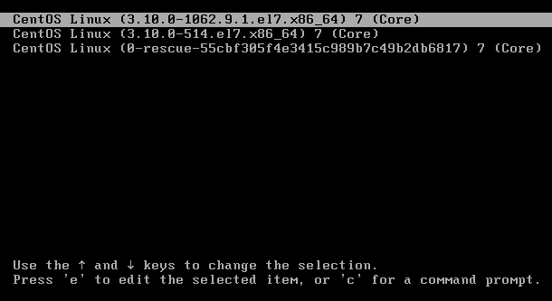

부팅 시 해당 화면에서 `e`를 눌러 수정모드에 들어간다.

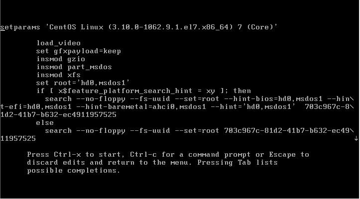

커서를 화살표 아래를 눌러 밑으로 내린다.

default가 level 5인데 level1을 올릴 것이다.

위쪽 방향키를 2번 누르고 `END` 키를 누른 뒤, 한 칸 띄고 `-s`를 입력한다. `-s`는 single mode를 의미한다. `-s`를 통해서 기본 실행 수준을 지정해서 올릴 수 있다.

* 5 (Desktop)
  * 엔드유저 레벨에서는 데스크탑
  * 그래픽 기반의 파일들이 굉장히 많이 설치된다. 싱글 레벨 모드의 3배 정도
* 3
  * 서버모드. 메인 서비스만 설치해서 올려서 서비스하는 수준
  * 너무 불필요한 파일들을 설치하면 복잡성이 늘어나고 보안상의 취약점이 발생할 수 있다. 불필요하다면 그래픽을 설치할 필요 없다.
* 1 (Single user mode)
  * 복구 모드. 싱글 유저 모드. root로 로그인 해 사용할 수 있는 레벨
* 0

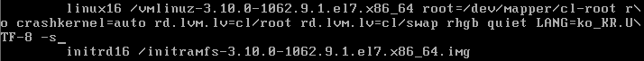

Ctrl + x 를 눌러 start 한다.

```bash
[root@localhost ~]$ who -r
         run-level 1  2020-01-27 16:50
```

런레벨이 1인 것을 확인할 수 있다.

```bash
[root@localhost ~]$ ps -ef | wc -l
95
```

`-e` : 활성 프로세스를 출력에 포함한다.

`-f` : 전체 리스트를 표시한다. full option

`wc -l` : 라인을 카운팅 해준다.

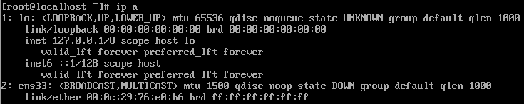

`ip a`를 통해 ip를 확인한다. ip가 아직 설정되지 않은 단계이다.

```bash
[root@localhost ~]$ init 3
```

```bash
[root@localhost ~]$ who -r
         run-level 3  2020-01-27 17:07                   last=1
```

```bash
[root@localhost ~]$ ps -ef | wc -l
130
```
Single user mode 보다 많은 프로세스가 동작한다.

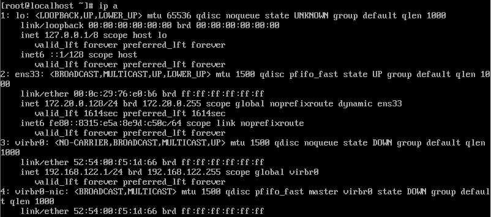

`ip a` 명령을 통해 ip가 설정되어 있는 것을 확인할 수 있다. 통신이 된다.

Single user mode 에서는 ip 설정이 안 되어있었다. 통신이 불가능하다.

```bash
[root@localhost ~]$ init 5
```

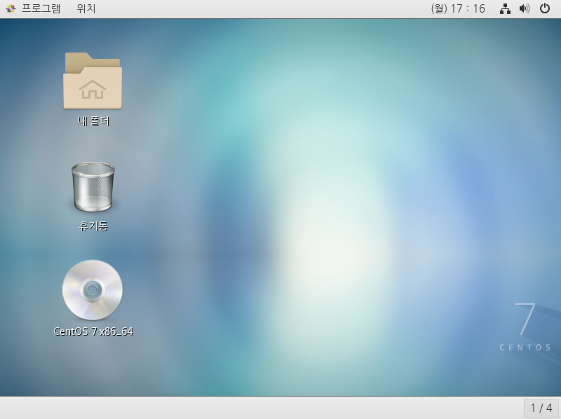

데스크탑으로 올라온다.

```bash
[student@localhost ~]$ who -r
         run-level 5  2020-01-27 17:15                   last=3
[student@localhost ~]$ ps -ef | wc -l
207
[student@localhost ~]$ ip a
1: lo: <LOOPBACK,UP,LOWER_UP> mtu 65536 qdisc noqueue state UNKNOWN group default qlen 1000
    link/loopback 00:00:00:00:00:00 brd 00:00:00:00:00:00
    inet 127.0.0.1/8 scope host lo
       valid_lft forever preferred_lft forever
    inet6 ::1/128 scope host 
       valid_lft forever preferred_lft forever
2: ens33: <BROADCAST,MULTICAST,UP,LOWER_UP> mtu 1500 qdisc pfifo_fast state UP group default qlen 1000
    link/ether 00:0c:29:76:e0:b6 brd ff:ff:ff:ff:ff:ff
    inet 172.20.0.128/24 brd 172.20.0.255 scope global noprefixroute dynamic ens33
       valid_lft 1067sec preferred_lft 1067sec
    inet6 fe80::8315:e5a:8e9d:c50c/64 scope link noprefixroute 
       valid_lft forever preferred_lft forever
3: virbr0: <NO-CARRIER,BROADCAST,MULTICAST,UP> mtu 1500 qdisc noqueue state DOWN group default qlen 1000
    link/ether 52:54:00:f5:1d:66 brd ff:ff:ff:ff:ff:ff
    inet 192.168.122.1/24 brd 192.168.122.255 scope global virbr0
       valid_lft forever preferred_lft forever
4: virbr0-nic: <BROADCAST,MULTICAST> mtu 1500 qdisc pfifo_fast master virbr0 state DOWN group default qlen 1000
    link/ether 52:54:00:f5:1d:66 brd ff:ff:ff:ff:ff:ff
```


* 시스템을 켰는데 문제가 있으면 1번으로만 올라온다. 관리자가 그 문제를 해결해야 한다.

* 서버인 경우 3번으로, 데스크탑의 경우 5번으로 올라온다.

  ```bash
  $ init + 실행수준숫자		# 현재 상태에서 실행 수준을 바꿀 수 있다. 시스템 자체의 상태를 바꿀 수 있다.
  $ who -r				# level 확인
  ```

* level에 따라서 서비스 수준이 달라진다.

* 프로세스 : 프로그램이 돌고 있는 상태

* 몇 개의 프로세스가 돌고 있는지에 따라 시스템의 수준을 가늠할 수 있다.

  ```bash
  $ ps -ef			# 돌고 있는 전체 프로세스 확인
  $ ps -ef | wc -l	# 라인 개수 확인
  $ ip a				# ip 확인
  ```

  

* init으로 실행 수준을 변경하는 것이 쉽지만 예전 방식이다. 7버전으로 오면서 조금 달라졌다.
* CentOS 같은 경우 6버전과 7버전이 조금 많이 바꼈다.
* 하위호환성. 예전에 사용했던 것을 그대로 쓸 수 있다.
* 기존에는 init이 시스템 데몬이었는데 7에서는 systemd라는 데몬으로 바꼈다.

```bash
[student@localhost ~]$ systemctl get-default
graphical.target
```

default level이 graphical.target이다.

```bash
[student@localhost ~]$ cd /lib/systemd/system
[student@localhost system]$ ls -l runlevel?.target
lrwxrwxrwx. 1 root root 15  1월 27 12:27 runlevel0.target -> poweroff.target
lrwxrwxrwx. 1 root root 13  1월 27 12:27 runlevel1.target -> rescue.target
lrwxrwxrwx. 1 root root 17  1월 27 12:27 runlevel2.target -> multi-user.target
lrwxrwxrwx. 1 root root 17  1월 27 12:27 runlevel3.target -> multi-user.target
lrwxrwxrwx. 1 root root 17  1월 27 12:27 runlevel4.target -> multi-user.target
lrwxrwxrwx. 1 root root 16  1월 27 12:27 runlevel5.target -> graphical.target
lrwxrwxrwx. 1 root root 13  1월 27 12:27 runlevel6.target -> reboot.target
```

graphical.target가 runlevel5.target인 것을 확인할 수 있다.

```bash
[student@localhost ~]$ systemctl get-default 
graphical.target
[student@localhost ~]$ systemctl set-default multi-user.target
Removed symlink /etc/systemd/system/default.target.
Created symlink from /etc/systemd/system/default.target to /usr/lib/systemd/system/multi-user.target.
[student@localhost ~]$ systemctl get-default 
multi-user.target
```

default level을 multi-user.target으로 변경한다.

```bash
[student@localhost ~]$ sudo reboot
```

재부팅을 한다.

```bash
[root@localhost ~]$ who -r
         run-level 3  2020-01-27 17:32
```

런레벨 3으로 올라온 것을 확인할 수 있다.

```bash
[root@localhost ~]$ startx
```

런레벨은 그대로 있지만 데스크탑 프로세스가 올라온다.

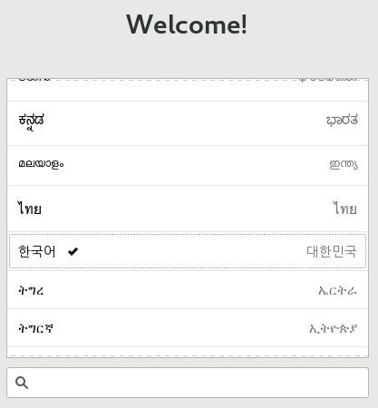

한국어 선택, 위치 정보 서비스 끔, 건너뛰기, CentOS Linux 시작

```bash
[root@localhost ~]# who -r
         run-level 3  2020-01-27 17:32
[root@localhost ~]# ps -ef|wc -l
210
```

런레벨이 3인 것을 확인할 수 있다.

```bash
[root@localhost ~]# systemctl get-default 
multi-user.target
[root@localhost ~]# systemctl set-default graphical.target
Removed symlink /etc/systemd/system/default.target.
Created symlink from /etc/systemd/system/default.target to /usr/lib/systemd/system/graphical.target.
[root@localhost ~]# systemctl get-default 
graphical.target
```

default level을 graphical.target으로 다시 바꾼다.

`systemctl set-default ~` : system start 수준을 변경하는 명령어


#### 자동 완성과 히스토리

* 자동 완성 : 파일 이름의 일부만 입력하고 `Tab`을 눌러, 나머지 파일 이름이나 폴더 이름을 자동으로 완성하는 기능. 작업 속도가 빨라진다.

* `Tab`키를 자주 사용하는 것이 좋다. 검증의 의미도 있다. 해당 위치가 맞는지, 오타가 났는지 검증되면서 작업이 된다.

* 도스 키(Dos Key) : 이전에 입력한 명령어를 `방향키 위/아래`를 눌러 다시 나타나게 하는 것

* 사용했던 명령을 모두 보려면 `history` 명령어를 입력한다.

  ```bash
  [student@localhost ~]$ history
  ```

* 기억되었던 명령을 모두 삭제하려면 `history -c`를 입력

  ```bash
  [student@localhost ~]$ history -c
  ```

  

```bash
[student@localhost ~]$ ps
   PID TTY          TIME CMD
  3111 pts/0    00:00:00 bash
  3322 pts/0    00:00:00 ps
```

어떤 shell을 사용하는지 확인하는 명령어이다. bash라는 프로세스가 동작한다.

shell은 명령 해석기이다.

```bash
[student@localhost ~]$ ls
공개  다운로드  문서  바탕화면  비디오  사진  서식  음악
```

현재 위치에 있는 파일 리스트를 보여주는 명령어. 실행하라는 의미가 `Enter`이다.

shell이라는 명령 해석기가 명령어를 읽어서 프로그램을 실행

Command Line Interface(CLI) : bash라는 프로그램 사용

OS에서 제공하는 여러 가지 명령들을 사용하는 것

여러 옵션이 있는데 옵션에 따라 어떻게 바뀌는지, 프로그램에 따라 기능들이 달라질 수 있다.

bash라는 프로그램에서 tab을 눌렀을 때 자동 완성되는 것은 이미 구현되어 있기 때문에 가능하다.

shell에 따라 키들이 달라질 수 있다.


#### 에디터 사용

문서편집하기.pdf 참고

* 데스크탑 환경에서는 gedit를 사용할 수 있다. 그래픽을 사용할 수 있는 터미널이어야 한다. 그래피컬 모니터에서 작업

  ```bash
  $ gedit filename
  ```

  메모장처럼 제공되는 gedit 에디터로 해당 파일을 편집할 수 있다.

* vi 에디터로 해당 파일 편집

  ```bash
  $ vi filename
  ```

  텍스트 모드인 경우 gedit을 사용할 수 없으므로 vi 에디터를 사용

* vi 에디터 사용법 개요도

  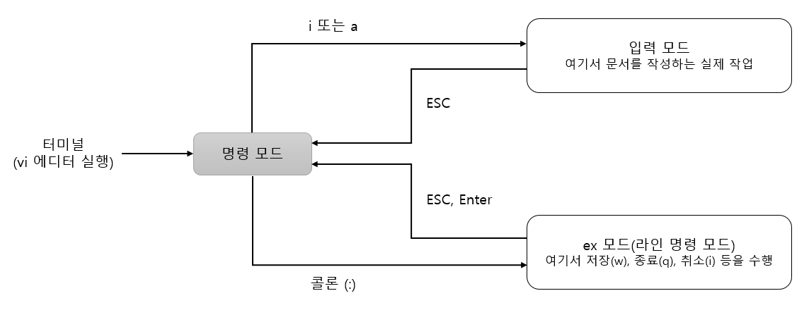

* 파일 저장하고 종료하기

  |      모드      | 명령 키           | 기능                                                         |
  | :------------: | ----------------- | ------------------------------------------------------------ |
  | 마지막 행 모드 | :q                | vi에서 작업한 것이 없을 때 그냥 종료한다.                    |
  |       ''       | :q!               | 작업한 내용을 저장하지 않고 종료한다.                        |
  |       ''       | :w [파일명]       | 작업한 내용을 저장만 한다. 파일명을 지정하면 새 파일로 저장한다. |
  |       ''       | :wq, :wq!         | 작업한 내용을 저장하고 vi를 종료한다.                        |
  |   명령 모드    | ZZ (`shift` + zz) | 작업한 내용을 저장하고 vi를 종료한다.                        |

  

* 명령 모드에서  입력 모드로 전환하는 키

  | 키   | 설명                                   | 키   | 설명                              |
  | ---- | -------------------------------------- | ---- | --------------------------------- |
  | i    | 현재 커서의 위치부터 입력              | I    | 현재 커서 줄의 맨 앞에서부터 입력 |
  | a    | 현재 커서의 위치 다음 칸부터 입력      | A    | 현재 커서 줄의 맨 마지막부터 입력 |
  | o    | 현재 커서의 다음 줄에 입력             | O    | 현재 커서의 이전 줄에 입력        |
  | s    | 현재 커서 위치의 한 글자를 지우고 입력 | S    | 현재 커서의 한 줄을 지우고 입력   |

  

* 명령 모드에서 커서를 이동할 때 사용하는 키

  | 키           | 설명                          | 키           | 설명                           |
  | ------------ | ----------------------------- | ------------ | ------------------------------ |
  | h            | 커서를 왼쪽으로 한 칸 이동    | j            | 커서를 아래로 한 칸 이동       |
  | k            | 커서를 위로 한 칸 이동        | l            | 커서를 오른쪽으로 한 칸 이동   |
  | `Ctrl` + `F` | 다음 화면으로 이동(Page Down) | `Ctrl` + `B` | 이전 화면으로 이동(Page Up)    |
  | ^            | 현재 행의 처음으로 이동(Home) | $            | 현재 행의 마지막으로 이동(End) |
  | gg           | 제일 첫 행으로 이동           | G            | 제일 끝 행으로 이동            |
  | 숫자G        | 해당 숫자의 행으로 이동       | :숫자`Enter` | 해당 숫자의 행으로 이동        |

  

* 명령 모드에서 삭제, 복사, 붙여넣기 관련 키

  | 키   | 설명                                   | 키     | 설명                                  |
  | ---- | -------------------------------------- | ------ | ------------------------------------- |
  | x    | 현재 커서가 위치한 글자 삭제           | X      | 현재 커서가 위치한 앞 글자 삭제       |
  | dd   | 현재 커서의 행 삭제                    | 숫자dd | 현재 커서부터 숫자만큼의 행 삭제      |
  | yy   | 현재 커서가 있는 행을 복사             | 숫자yy | 현재 커서부터 숫자만큼의 행을 복사    |
  | p    | 복사한 내용을 현재 행 이후에 붙여 넣기 | P      | 복사한 내용을 현재 행 이전에 붙여넣기 |

  

* 명령 모드에서 문자열 찾기

  | 키             | 설명                                 | 키   | 설명                                 |
  | -------------- | ------------------------------------ | ---- | ------------------------------------ |
  | /문자열`Enter` | 해당 문자열을 찾음(현재 커서 이후로) | n    | 찾은 문자 중에서 다음 문자로 이동(N) |

  

* vi 에디터가 비정상적으로 종료된 경우

  * vi 에디터로 test.txt 파일 생성 후 내용 작성 후 저장

    ```bash
    [student@localhost ~]$ vi test.txt
    one
    two
    three
    ```

  * vi 에디터로 test.txt 파일을 열고 내용 추가 후 저장하지 않고 터미널 창 닫기

    ```bash
    [student@localhost ~]$ vi test.txt
    one
    two
    three
    four
    ```

  * vi 에디터로 test.txt 파일 열기

    ```bash
    [student@localhost ~]$ vi test.txt
    E325: 주목
    Found a swap file by the name ".test.txt.swp"
              소유자: student   날짜: Mon Jan 27 21:03:33 2020
             파일 이름: ~student/test.txt
              수정: 예
             사용자 이름: student  호스트 이름: localhost.localdomain
            프로세스 ID: 5283
    While opening file "test.txt"
                 날짜: Mon Jan 27 21:02:19 2020
    
    (1) Another program may be editing the same file.  If this is the case,
        be careful not to end up with two different instances of the same
        file when making changes.  Quit, or continue with caution.
    (2) An edit session for this file crashed.
        만약 그렇다면 ":recover" 혹은 "vim -r test.txt"
        을 사용하여 복구하십시오 (":help recovery" 참고).
        이미 복구하셨었다면 스왑파일 ".test.txt.swp"
        을(를) 지우셔야 이 메시지가 사라집니다.
    
    스왑 파일 ".test.txt.swp"이 이미 존재합니다!
    읽기 전용으로 열기([O]), 무조건 편집((E)), 복구((R)), 삭제((D)), 끝내기((Q)), 버리기((A))
    :
    ```

  * `Q`로 나와서 `ls -a` 명령어로 `.test.txt.swp` 파일 확인

    ```bash
    [student@localhost ~]$ ls -a
    .              .bash_logout   .config    .mozilla       공개      비디오
    ..             .bash_profile  .dbus      .test.txt.swp  다운로드  사진
    .ICEauthority  .bashrc        .esd_auth  .viminfo       문서      서식
    .bash_history  .cache         .local     test.txt       바탕화면  음악
    ```

  * 복구하려는 경우

    ```bash
    [student@localhost ~]$ vi -r test.txt
    ```

  * .test.txt.swp 파일 삭제

    ```bash
    [student@localhost ~]$ rm .test.txt.swp
    ```

    

#### 도움말 사용법

* 리눅스에는 많은 명령어가 있으며, 각 명령어의 옵션까지 합하면 수천 개가 넘는다.

* 그래서 필요한 것이 `man`명령어이다.

* `man`은 manual의 약어로, 리눅스에 포함된 체계화된 도움말이다.

* 사용법 : `man <명령어>`

  ```bash
  [student@localhost ~]$ man ls
  ```

* `방향키 위/아래` 또는 `k`/`j` : 위쪽 행과 아래쪽 행으로 이동

* `Page Up`/`Page Down` 또는 `Space`/`b` : 페이지 단위로 이동

* `/단어` : 특정 단어 검색(n을 누르면 다음 단어로 계속 넘어간다.)

* `q` : 종료

* `-k` 옵션 뒤에 찾고자 하는 키워드를 입력하면 키워드로서 man 페이지 리스트를 찾아볼 수 있다.

  ```bash
  [student@localhost ~]$ man -k passwd
  passwd (5)           - 패스워드 파일
  chgpasswd (8)        - update group passwords in batch mode
  chpasswd (8)         - update passwords in batch mode
  fgetpwent_r (3)      - get passwd file entry reentrantly
  getpwent_r (3)       - get passwd file entry reentrantly
  gpasswd (1)          - administer /etc/group and /etc/gshadow
  grub2-mkpasswd-pbkdf2 (1) - Generate a PBKDF2 password hash.
  kpasswd (1)          - change a user's Kerberos password
  lpasswd (1)          - Change group or user password
  lppasswd (1)         - add, change, or delete digest passwords.
  pam_localuser (8)    - require users to be listed in /etc/passwd
  passwd (1)           - update user's authentication tokens
  sslpasswd (1ssl)     - compute password hashes
  passwd2des (3)       - RFS password encryption
  pwhistory_helper (8) - Helper binary that transfers password hashes from passwd or s...
  saslpasswd2 (8)      - set a user's sasl password
  smbpasswd (5)        - The Samba encrypted password file
  vncpasswd (1)        - change the VNC password
  ```

  번호는 매뉴얼의 섹션이다. 매뉴얼을 그룹으로 나눠서 명령들을 모아 관리한다.

  ```bash
  [student@localhost ~]$ man 5 passwd
  ```

  

#### 마운트와 CD/DVD/USB의 활용

* Windows 에서는 하드디스크를 자동으로 할당한다. (역슬래시 이용)

  * C:\Windows\

* 리눅스에서는 하드디스크의 파티션, CD/DVD, USB 메모리 등을 사용하려면 지정한 위치에 연결해줘야 한다.

* 마운트 : 물리적인 장치를 특정한 위치(대개는 폴더)에 연결시켜 주는 과정

* 현재 마운트된 장치들을 확인

  ```bash
  tudent@localhost ~]$ mount
  ```

* 어떤 디렉터리로 마운트 되었는지 확인

  ```bash
  [student@localhost ~]$ df -h
  Filesystem           Size  Used Avail Use% Mounted on
  devtmpfs             1.9G     0  1.9G   0% /dev
  tmpfs                1.9G     0  1.9G   0% /dev/shm
  tmpfs                1.9G   13M  1.9G   1% /run
  tmpfs                1.9G     0  1.9G   0% /sys/fs/cgroup
  /dev/mapper/cl-root   46G  4.8G   41G  11% /
  /dev/sda1           1014M  231M  784M  23% /boot
  tmpfs                378M   24K  378M   1% /run/user/1000
  /dev/sr0             4.1G  4.1G     0 100% /run/media/student/CentOS 7 x86_64
  tmpfs                378M     0  378M   0% /run/user/0
  ```

* 마운트가 안 됐을 경우 수동으로 해야한다.

  ```bash
  $ mount /dev/sr0 /mnt
  ```

* 마운트 해제

  ```bash
  $ umount /dev/sr0
  ```

* 디렉터리를 생성해서 장치 파일과 디렉터리를 연결해 사용. top level 디렉터리를 마음대로 바꿀 수 있다.

* `cp -r` : 디렉토리를 복사할 경우 하위 디렉토리 및 파일 모두 복사

* 환경 파일들은 숨겨진 파일로 되어있다. 숨겨진 파일은 . 으로 시작한다.

* `ls -a` : 숨긴 파일까지 표시

  

##### CD/DVD 마운트

* 기존에 CD/DVD가 마운트되어 있을 수 있으니 마운트를 해제한다.

  ```bash
  [student@localhost ~]$ umount /dev/cdrom 
  ```

* VMware에 CD나 DVD 넣기. VMware 아래쪽 CD 모양 아이콘 클릭 -> Settings 선택

  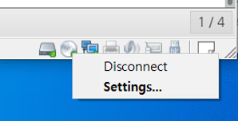

* Connected의 체크가 켜 있다면 체크를 끄고 OK를 클릭한다. CD/DVD 장치의 연결을 컴퓨터와 끊는 효과이다.

  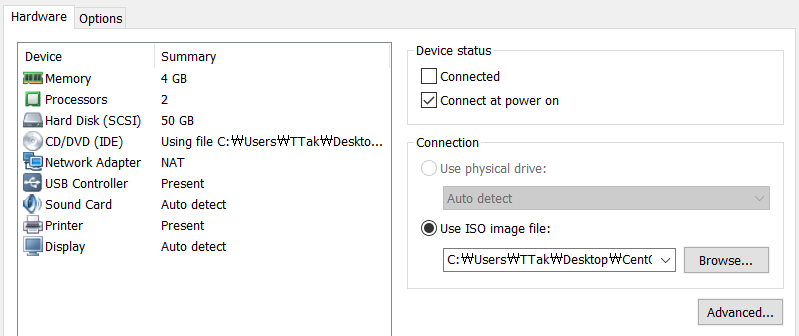

* 다시 CD 모양 아이콘을 클릭하고 Settings 선택한다. Connected의 체크를 켜고, Use ISO image file: 을 선택한 다음 Browse를 클릭해 CentOS 7 DVD ISO 파일을 선택한다.

  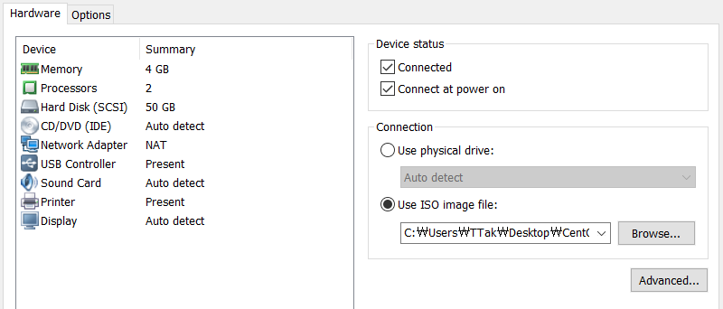

* 터미널에서 `mount` 명령어 입력

  ```bash
  [student@localhost ~]$ mount
  ...
  /dev/sr0 on /run/media/student/CentOS 7 x86_64 type iso9660 (ro,nosuid,nodev,relatime,uid=1000,gid=1000,iocharset=utf8,mode=0400,dmode=0500,uhelper=udisks2)
  ```

  /dev/sr0가 /run/media/student/CentOS 7 x86_64 디렉터리에 자동으로 마운트된 것을 확인할 수 있다.

* DVD 패키지가 들어있는 디렉터리로 이동

  ```bash
  [student@localhost ~]$ cd /run/media/student/CentOS\ 7\ x86_64/
  [student@localhost CentOS 7 x86_64]$ pwd
  /run/media/student/CentOS 7 x86_64
  [student@localhost CentOS 7 x86_64]$ ls
  CentOS_BuildTag  EULA  LiveOS    RPM-GPG-KEY-CentOS-7          TRANS.TBL  isolinux
  EFI              GPL   Packages  RPM-GPG-KEY-CentOS-Testing-7  images     repodata
  ```

* DVD 안 파일 확인

  ```bash
  [student@localhost CentOS 7 x86_64]$ cd Packages/
  [student@localhost Packages]$ ls
  389-ds-base-1.3.5.10-11.el7.x86_64.rpm
  389-ds-base-libs-1.3.5.10-11.el7.x86_64.rpm
  ElectricFence-2.2.2-39.el7.x86_64.rpm
  GConf2-3.2.6-8.el7.x86_64.rpm
  ...
  ```

  rpm 파일들이 알파벳 순으로 정리되어 있다.

* DVD를 더 이상 사용하지 않는다면 마운트 해제

  ```bash
  [student@localhost Packages]$ cd /run/media/
  [student@localhost media]$ umount /dev/cdrom 
  ```

* CD 모양 아이콘을 클릭. Settings 선택. Connected 체크 해제


