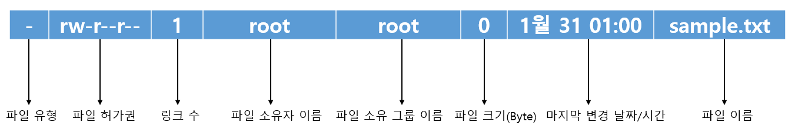
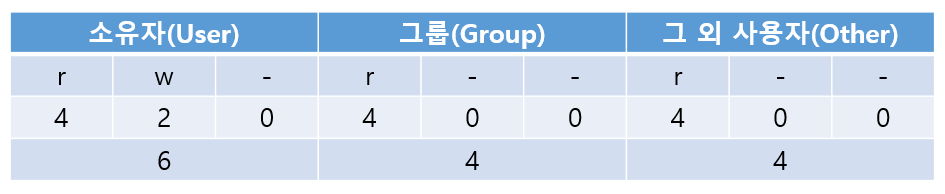
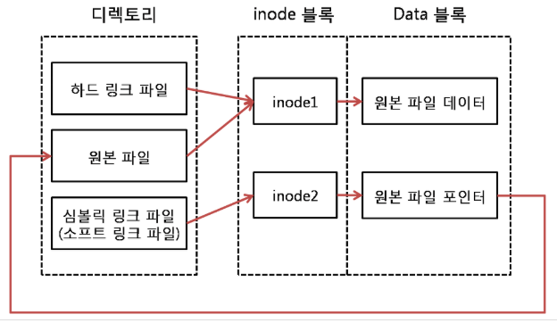

# CentOS 7 Linux_4_3

## 4. 서버를 구축할 때 알아야 할 필수 개념과 명령어

### 4.3 사용자 관리와 파일 속성

#### 사용자와 그룹

* 리눅스는 1대의 리눅스에 사용자 여러 명이 동시에 접속해서 사용할 수 있는 다중 사용자 시스템
* 기본적으로 root라는 이름을 가진 슈퍼 유저가 있다.
* root 사용자에게는 모든 작업을 실행할 수 있는 권한이 있다. 시스템에 접속할 수 있는 사용자를 생성할 수 있는 권한도 있다.
* 모든 사용자는 하나 이상의 그룹에 소속되어 있어야 한다.

* /etc/passwd 파일

  ```bash
  [student@localhost ~]$ vi /etc/passwd
  
  root:x:0:0:root:/root:/bin/bash
  bin:x:1:1:bin:/bin:/sbin/nologin
  daemon:x:2:2:daemon:/sbin:/sbin/nologin
  ...
  student:x:1000:1000:student:/home/student:/bin/bash
  ...
  ```

  * 여러 명의 사용자가 보인다.
  * root 사용자부터 tcpdump 사용자까지는 리눅스에서 기본적으로 존재하는 표준 사용자이다.
  * 사용자 이름 : 암호 : 사용자 ID : 사용자가 소속된 그룹 ID : 전체 이름 : 홈 디렉터리 : 기본 셸

* /etc/group 파일

  ```bash
  [student@localhost ~]$ vi /etc/group
  
  root:x:0:
  bin:x:1:
  daemon:x:2:
  ...
  ```

  * 그룹 이름 : 비밀번호 : 그룹 id : 그룹에 속한 사용자 이름


#### 사용자 및 그룹 관련 명령어

* useradd (또는 adduser)

  * 새로운 사용자를 추가한다. 이 명령어를 실행하면 /etc/passwd, /etc/shadow, /etc/group 파일에 새로운 행이 추가된다.

    ```bash
    $ useradd newuser	# newuser라는 이름의 사용자 생성
    ```

    * `-u` : 사용자 ID 지정
    * `-g` : group에 사용자를 포함시킴
    * `-d` : 홈 디렉터리 지정
    * `-s` : 기본 셸 지정

* passwd

  * 사용자의 비밀번호를 지정하거나 변경

    ```bash
    $ passwd newuser	# newuser 사용자의 비밀번호 지정(또는 변경)
    ```

* usermod

  * 사용자의 속성을 변경한다. 옵션은 useradd와 동일하다.

    ```bash
    $ usermod -g root newuser	# newuser 사용자의 그룹을 root 그룹으로 변경
    ```

* userdel

  * 사용자를 삭제한다.

    ```bash
    $ userdel newuser		# newuser 사용자를 삭제
    $ userdel -r newuser	# newuser 사용자를 삭제하면서 홈 디렉터리까지 삭제
    ```

* chage

  * 사용자의 암호를 주기적으로 변경하도록 설정한다.

    ```bash
    $ chage -l newuser		# newuser 사용자에 설정된 사항을 확인
    $ chage -m 2 newuser	# newuser 사용자에 설정한 암호를 사용해야 하는 최소 일자
    $ chage -M 30 newuser	# newuser 사용자에 설정한 암호를 사용할 수 있는 최대 일자
    $ chage -E 2019/12/12 newuser	# newuser 사용자에 설정한 암호가 만료되는 날짜
    $ chage -W 10 newuser	# newuser 사용자에 설정한 암호가 만료되기 전에 경고하는 기간. 지정하지 않았을 경우 기본 값은 7일
    ```

* groups

  * 사용자가 소속된 그룹을 보여준다.

    ```bash
    $ groups			# 현재 사용자가 소속된 그룹을 보여줌
    $ groups newuser	# newuser가 소속된 그룹을 보여줌
    ```

* groupadd

  * 새로운 그룹을 생성한다.

    ```bash
    $ groupadd newgroup			# newgroup이라는 그룹을 생성
    $ groupadd -g 2222 newgroup	# newgroup 그룹을 생성하면서 그룹 ID를 2222로 지정
    ```

* groupmod

  * 그룹의 속성을 변경한다.

    ```bash
    $ groupmod -n newgroup mygroup	# newgroup 그룹의 이름을 mygroup으로 변경
    ```

* groupdel

  * 그룹을 삭제한다.

    ```bash
    $ groupdel newgroup	# newgroup 그룹을 삭제
    ```

* gpasswd

  * 그룹의 암호를 설정하거나 그룹 관리를 수행한다.

    ```bash
    $ gpasswd newgroup				# newgroup 그룹의 암호 지정
    $ gpasswd -A newuser newgroup	# newuser 사용자를 newgroup 그룹의 관리자로 지정
    $ gpasswd -a user1 newgroup		# user1을 newgroup 그룹의 사용자로 추가
    $ gpasswd -d newuser newgroup	# user1을 newgroup 그룹의 사용자에서 제거
    ```

    

#### 파일과 디렉터리의 소유와 허가권

* 리눅스는 각각의 파일과 디렉터리마다 소유권과 허가권이라는 속성이 있다.

* root 사용자가 자신의 홈 디렉터리에서 파일 생성 후 파일 정보 확인

  ```bash
  [root@localhost ~]# touch sample.txt
  [root@localhost ~]# ls -l
  합계 8
  ...
  -rw-------. 1 root root 2057  1월 27 11:54 anaconda-ks.cfg
  -rw-r--r--. 1 root root 2105  1월 27 12:10 initial-setup-ks.cfg
  -rw-r--r--. 1 root root    0  1월 31 01:00 sample.txt
  ```

  




##### 파일 유형

* 파일이 어떤 종류인지를 나타낸다.
  * `d` : 디렉터리
  * `-` : 일반적인 파일
  * `b` : 블록 디바이스
  * `c` : 문자 디바이스
  * `l` : 링크


##### 파일 허가권

* 'rw-', 'r--', 'r--' 3개씩 끊어서 인식
* `r` : read
* `w` : write
* `x` : execute

* 1번째는 소유자의 파일 접근권한, 2번째는 그룹의 파일 접근 권한, 3번째는 그 외 사용자의 파일 접근 권한을 의미한다.

* 파일의 허가권을 숫자로 표현 가능

  

* 허가권이 754 => 'rwxr-xr--'

* 디렉터리는 일반적으로 소유자/그룹/기타 사용자 모두에게 실행(`x`) 권한이 설정되어 있다.

* 디렉터리는 해당 디렉터리로 이동하려면 실행(`x`) 권한이 반드시 있어야 한다.

* `chmod`

  * 파일의 허가권을 변경하는 명령어

  * root 사용자 또는 해당 파일의 소유자만 실행 가능

    ```bash
    $ chmod 777 sample.txt
    $ chmod u+x sample.txt
    ```

    

##### 파일 소유권

* 파일을 소유한 사용자와 그룹을 의미

* `chown` : 파일의 소유권을 바꾸는 명령어

  ```bash
  $ chown 새로운사용자이름(.새로운그룹이름) 파일이름
  $ chown centos sample.txt
  ```

* `chgrp` : 파일의 소유 그룹만 바꾸는 명령어


##### 링크

* 파일의 링크는 하드 링크와 심볼릭 링크 2가지가 있다.

  

* 원본 파일이 inode1을 사용할 때, 하드 링크를 생성하면 하드 링크 파일만 하나 생성되며, 같은 inode1을 사용한다.

* 하드 링크 생성

  ```bash
  $ ln 링크파일대상이름 링크파일이름
  ```

* 원본에 심볼릭 링크를 생성하면 새로운 inode2를 만들고, 데이터는 원본 파일과 연결되는 효과를 갖는다.

* 일반적으로 사용자들은 주로 심볼릭 링크를 사용

* 심볼릭 링크 생성

  ```bash
  $ ln -s 링크대상파일이름 링크파일이름
  ```

  

