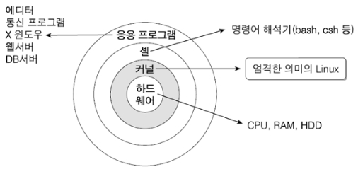

# 2. CentOS 리눅스 소개

## 리눅스의 개요

리눅스 = 무료 유닉스

### 리눅스의 탄생

1991년 리누스 토르발스가 리눅스 커널 0.01 버전을 최초로 작성

1992년 0.02 버전 작성. 인터넷에 소스 코드를 공개하면서 시작됨

리누스 토르발스는 커널(Kernel)만 개발함



[그림 2-1] 일반적인 리눅스 배포판의 구성

---

Unix 커널은 C언어로 작성되어있다.

BSD Unix : 학문적인 연구를 목적으로 함

리눅스는 유닉스를 본떠서 만든 것이다.

커널은 핵심적인 프로그램

### 배포판

패키지를 배포하는 도구(package manager)는 배포판마다 다르다.

- RedHat 계열 : rpm, yum

- Debian 계열 : dpkg, apt-*

  ex) Ubuntu

- Slackware 계열 : yast, zypper로 패키지 관리

  ex) SUSE(유료), openSUSE(무료)

- Mandrake 계열 : rpm~

### GNU 프로젝트

1984년에 리처드 스톨먼에 의해서 GNU 프로젝트 시작

목표는 '모두가 공유할 수 있는 소프트웨어'를 만드는 것

리처드 스톨먼은 1985년에 자유 소프트웨어 재단(FSF)을 설립

FSF의 목표는 GNU 프로젝트에서 제작한 소프트웨어를 지원함으로써 컴퓨터 프로그램의 복제, 변경, 소스 코드의 사용에 걸린 제한을 철폐하는 것

GPL(General Public License)을 따름. 이 라이선스는 자유 소프트웨어(Free Software)의 수정과 공유의 자유를 보장함

자유 소프트웨어는 프리웨어(Freeware, 무료 소프트웨어)라는 개념을 뛰어 넘어서 진정한 자유(Freedom)의 개념이 내포돼 있다.

자유 소프트웨어는 심지어 무료로 얻은 소프트웨어를 유상으로 판매할 자유도 보장

진정한 Freeware License는 apache

### 커널

리눅스 배포판은 커널을 포함한다.

커널의 버전과 배포판의 버전은 별개이다.

---

```shell
[student@localhost ~]$ uname -a
Linux localhost.localdomain 3.10.0-1160.81.1.el7.x86_64 #1 SMP Fri Dec 16 17:29:43 UTC 2022 x86_64 x86_64 x86_64 GNU/Linux
```

커널 버전이 나온다.

2.4와 2.6이 유명

3.10 유명

지금은 4.x 대 버전을 쓰고 있다.

---

3.17.4

3은 주 버전

17은 부 버전

4는 패치 버전

## CentOS 리눅스 배포판

### 레드햇 리눅스와 CentOS 리눅스

전 세계적으로 가장 유명한 배포판 중 하나가 레드햇(Red Hat)사에서 제작한 '레드햇 리눅스(Red Hat Linux)'

상용으로 판매되는 레드햇 엔터프라이즈 리눅스(Red Hat Enterprise Linux)

공개된 레드햇 엔터프라이즈 리눅스의 소스코드를 그대로 가져와서, 로고만 변경한 후에 다시 컴파일(또는 빌드)해서 만든 것이 CentOS

기업에서는 별도의 비용이 있다면 레드햇 엔터프라이즈 리눅스를 구매해서 사용하면 되며, 비용을 절감하고 싶다면 동일한 리눅스인 CentOS를 사용하면 됨

RHEL의 Open Source가 CentOS

RHEL은 유료

Fedora

Oracle Linux

---

인터넷 상 공개 사이트

https://centos.org/

최근 것은 불안정하다. 그 전 버전을 사용하는 것이 안정적이다.

8버전은 아직 쓰는 곳이 별로 없다.

### CentOS 7을 설치하기 위한 하드웨어 요구 사항

- CPU : 1GHz보다 빠른 프로세서
- 하드디스크 여유 공간 : 10GB 이상의 여유 공간 권장(추가 설치 부분에 따라서 달라질 수 있음)
- 메모리 : 최소 1GB(512MB도 설치 가능)
- 그래픽 카드 : 최신 그래픽 카드 대부분을 지원

---

RedHat은 보수적이지만 안정성이 있다.

Debian 계열의 특징은 개발자가 주로 쓰기 때문에 자동화 프로그램이 자주 돈다.

SUSE는 그래픽 도구를 잘 만드는 계열

---

```shell
[student@localhost ~]$ cat /etc/*release
CentOS Linux release 7.9.2009 (Core)
NAME="CentOS Linux"
VERSION="7 (Core)"
ID="centos"
ID_LIKE="rhel fedora"
VERSION_ID="7"
PRETTY_NAME="CentOS Linux 7 (Core)"
ANSI_COLOR="0;31"
CPE_NAME="cpe:/o:centos:centos:7"
HOME_URL="https://www.centos.org/"
BUG_REPORT_URL="https://bugs.centos.org/"

CENTOS_MANTISBT_PROJECT="CentOS-7"
CENTOS_MANTISBT_PROJECT_VERSION="7"
REDHAT_SUPPORT_PRODUCT="centos"
REDHAT_SUPPORT_PRODUCT_VERSION="7"

CentOS Linux release 7.9.2009 (Core)
CentOS Linux release 7.9.2009 (Core)
```

배포판 확인

cat은 파일의 내용을 확인하는 명령어

배포판 버전과 커널 버전을 확인하는 방법이 다르다.

