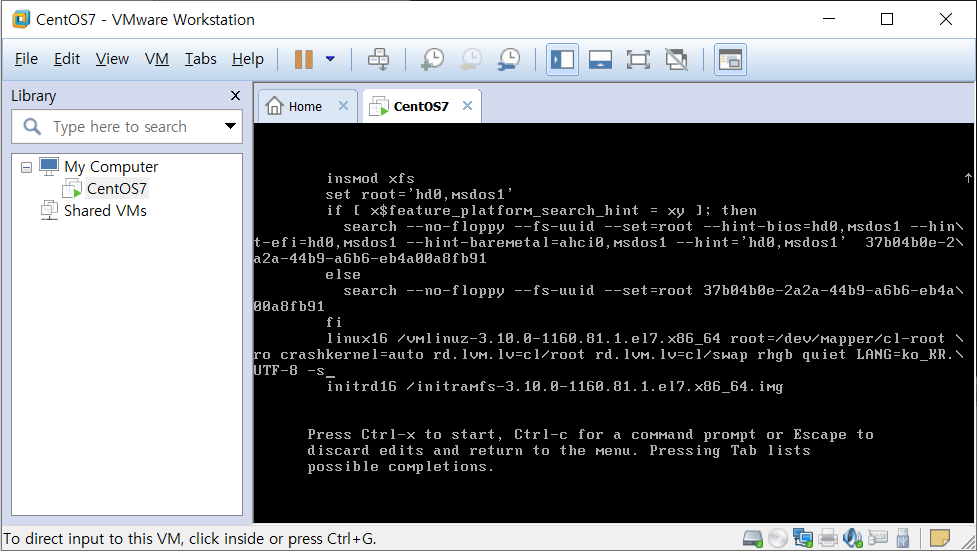

# 4. 서버를 구축할 때 알아야 할 필수 개념과 명령어(1)

cmd 창에서 `ssh` 명령어를 이용해 가상머신에 접속할 수 있다.

로그인 할 사용자, IP 주소

```shell
C:\Users\User>ssh student@172.20.0.128
```

비밀번호 입력

---

DHCP로 인해 IP가 변경될 수 있으니 CentOS7에서 `ip a` 명령어로 IP 확인

---

SSH 접속 시 `REMOTE HOST IDENTIFICATION HAS CHANGED!` 에러 발생

기존에 사용하던 호스트 주소에 새로 OS를 설치하거나 했을 경우 이런 문제 발생

해당 호스트 정보 지우기

`ssh-keygen.exe -R 172.20.0.128`

키가 삭제되고 원본 파일이 백업된다.

## 리눅스를 운영하는 데 먼저 알아야 할 개념

### 시작과 종료

#### 종료 방법

- 바탕화면의 `사용자 이름` → `컴퓨터 끄기` → `컴퓨터 끄기`
- 터미널/콘솔에서 시스템 종료 명령 입력
  - `poweroff`
  - `shutdown -P now`
  - `halt -p`
  - `init 0`

### 시스템 재부팅

- 바탕화면의 `사용자 이름` → `컴퓨터 끄기` → `다시 시작`
- 터미널/콘솔에서 시스템 재부팅 명령 입력
  - `shutdown -r now`
  - `reboot`
  - `init 6`

옵션에 대한 차이가 있다.

### 로그아웃

- 바탕화면의 `사용자 이름` → `로그아웃`
- 터미널/콘솔에서 로그아웃 명령 입력
  - `logout`
  - `exit`

### 가상 콘솔

쉽게 '가상의 모니터'라 생각하면 된다.

CentOS는 총 6개의 가상 콘솔을 제공한다.

각각의 가상 콘솔로 이동하는 단축키는 `Ctrl` + `Alt` + `F2 ~ F6`이다. (`Ctrl` + `Alt` + `F1`은 X윈도우 모드)

작업 공간과는 다르다.

---

`Ctrl` + `Alt` + `F2`

로그인 할 사용자 입력 → root 계정으로 로그인

비밀번호 입력

---

`F1` ~ `F6`까지 전환

가상이더라도 운영체제 입장에서는 하드웨어이다.

리눅스에서는 하드웨어도 파일로 mapping 해서 관리한다.

장치 파일

/dev/tty

```shell
[root@localhost ~]# tty
/dev/tty2
```

### 런레벨

`init` 명령어 뒤에 붙은 숫자를 런레벨(RunLevel)이라고 부른다.

이것이 리눅스다 p151

| 런레벨 | 영문 모드            | 설명                           | 비고             |
| ------ | -------------------- | ------------------------------ | ---------------- |
| 0      | Power Off / .halt    | 종료 모드                      |                  |
| 1      | Rescue / single.user | 시스템 복구 모드               | 단일 사용자 모드 |
| 2      | Multi-User           |                                | 사용하지 않음    |
| 3      | Multi-User 서버      | 텍스트 모드의 다중 사용자 모드 |                  |
| 4      | Multi-User           |                                | 사용하지 않음    |
| 5      | Graphical            | 그래픽 모드의 다중 사용자 모드 |                  |
| 6      | Reboot               |                                |                  |

실행 수준을 변경할 때 사용하는 명령어

숫자를 가지고 전환

```shell
[student@localhost ~]$ who -r
         run-level 5  2022-12-30 00:03
```

level 확인 가능

---

`init 3`입력 → 비밀번호 입력

student 계정으로 로그인

```shell
[student@localhost ~]$ who -r
         run-level 3  2022-12-30 00:41         last=5
```

---

`init 1` 입력 → 비밀번호 입력

부팅 시 문제가 생기면 런레벨 1로 실행된다.

---

`init 0` 입력 시 종료된다.

---

5 → 3 → 1 → 0

---

부팅 시 2~3줄짜리 커널 라인 리스트 → `e`를 입력해 수정모드로 진입한다.


기본 실행수준은 default 런레벨인 5로 설정되어있다.

키보드 화살표 아래를 눌러 커서를 밑으로 내린다.

내가 원하는 것은 default가 level 5인데 level 1을 올리고 싶다.

키보드 화살표 위 2번 → `End` → 한 칸 띄고 `-s` 입력



`-s`는 싱글 모드를 의미한다.

`Ctrl` + `x`

`-s`를 하면 기본 실행 수준을 지정해서 올릴 수 있다.

---

5(Desktop)

3

1(Single User Mode)

0

---

`who -r`로 레벨 확인

```shell
[root@localhost ~]# who -r
         run-level 1  2022-12-30 01:00
```

---

`ps -ef`

현재 레벨에서 동작하고 있는 프로세스 확인

e : 전체

f : full option

---

`ps -ef|wc -l`

라인을 카운팅 해준다.

```shell
[root@localhost ~]# ps -ef|wc -l
91
```

---

`ip a`

IP 등 네트워크 장치 및 주소에 대한 정보를 확인

IP가 아직 설정되지 않은 단계

---

level 0에서 level 1로 올린 것

---

`init 3`

root 계정으로 로그인

```bash
# who -r
# ps -ef
# ps -ef|wc -l
# ip a
```

RunLevel 3

Single User Mode보다 많은 프로세스가 동작한다.

IP가 설정되어있다. → 통신이 된다.

Single User Mode에서는 IP 설정이 안 되어있다. → 통신 불가

---

`init 5`

그래픽 모드로 올라온다.

---

시스템의 상태를 숫자로 define해서 사용하는 것이 RunLevel

---

시스템을 켰는데 문제가 있으면 level 1로만 올라간다. 관리자가 그 문제를 해결해야 한다.

서버인 경우 level 3으로, 데스크탑의 경우 level 5로 올라간다.

---

현재 상태에서 실행 수준을 바꿀 수 있다.

`init + 실행 수준 숫자`

시스템 자체 상태를 바꿀 수 있다.

---

`who -r`

현재 level 확인

---

레벨에 따라 서비스 수준이 달라진다.

---

프로세스 : 프로그램이 실행되고 있는 상태

몇 개의 프로세스가 실행되고 있는지에 따라 시스템의 수준을 가늠할 수 있다.

`ps -ef`

실행되고 있는 전체 프로세스 확인

`ps -ef|wc -l`

라인 개수 확인

---

`ip a`

IP 확인

---

init으로 실행 수준을 변경하는 것이 쉽지만 예전 방식이다.

7버전으로 오면서 조금 달라졌다.

CentOS같은 경우 6버전과 7버전이 조금 많이 바뀜

하위 호환성

예전에 사용했던 것을 그대로 쓸 수 있다.

기존에는 init이 시스템 데몬이었는데 7에서는 systemd라는 데몬으로 바뀌었다.

각종 데몬들을 자동으로 띄우는 역할

systemctl

---

```shell
[student@localhost ~]$ systemctl get-default
graphical.target
[student@localhost ~]$ who -r
         run-level 5  2022-12-30 10:55                   last=3
```

---

이것이 리눅스다 p151

```shell
[student@localhost ~]$ cd /lib/systemd/system
[student@localhost system]$ ls -ld run*
-rw-r--r--. 1 root root 469  1월  8  2022 run-vmblock\x2dfuse.mount
lrwxrwxrwx. 1 root root  15 12월 29 12:02 runlevel0.target -> poweroff.target
lrwxrwxrwx. 1 root root  13 12월 29 12:02 runlevel1.target -> rescue.target
drwxr-xr-x. 2 root root  50 12월 29 12:02 runlevel1.target.wants
lrwxrwxrwx. 1 root root  17 12월 29 12:02 runlevel2.target -> multi-user.target
drwxr-xr-x. 2 root root  50 12월 29 12:02 runlevel2.target.wants
lrwxrwxrwx. 1 root root  17 12월 29 12:02 runlevel3.target -> multi-user.target
drwxr-xr-x. 2 root root  50 12월 29 12:02 runlevel3.target.wants
lrwxrwxrwx. 1 root root  17 12월 29 12:02 runlevel4.target -> multi-user.target
drwxr-xr-x. 2 root root  50 12월 29 12:02 runlevel4.target.wants
lrwxrwxrwx. 1 root root  16 12월 29 12:02 runlevel5.target -> graphical.target
drwxr-xr-x. 2 root root  50 12월 29 12:02 runlevel5.target.wants
lrwxrwxrwx. 1 root root  13 12월 29 12:02 runlevel6.target -> reboot.target
```

링크 파일

---

```shell
[student@localhost system]$ systemctl get-default
graphical.target
[student@localhost system]$ systemctl set-default multi-user.target 
Removed symlink /etc/systemd/system/default.target.
Created symlink from /etc/systemd/system/default.target to /usr/lib/systemd/system/multi-user.target.
[student@localhost system]$ reboot
```

기본으로 설정된 런레벨 확인 및 변경

---

root 계정으로 로그인

`startx` 명령어를 입력해 X 윈도우 실행

이 명령어에 의해서 레벨은 그대로 있지만 데스크탑 프로세스가 올라온다.

```shell
[root@localhost ~]# who -r
         run-level 3  2022-12-30 11:08
[root@localhost ~]# ps -ef|wc -l
216
```

---

```shell
[root@localhost ~]# systemctl get-default 
multi-user.target
[root@localhost ~]# systemctl set-default graphical.target 
Removed symlink /etc/systemd/system/default.target.
Created symlink from /etc/systemd/system/default.target to /usr/lib/systemd/system/graphical.target.
[root@localhost ~]# systemctl get-default 
graphical.target
```

system start 수준을 변경하는 명령어가 `systemctl set-default ~`

### 자동 완성과 히스토리

```shell
[student@localhost ~]$ ps
   PID TTY          TIME CMD
  2754 pts/0    00:00:00 bash
  2798 pts/0    00:00:00 ps
```

`ps` : 어떤 shell을 사용하는지 확인하는 명령어

bash라는 프로세스가 동작한다.

shell은 명령어 해석기이다.

---

`ls` : 현재 위치에 있는 파일 리스트를 보여주는 명령어

`Enter`는 실행하라는 의미이다.

shell이 명령어를 해석해서 프로그램을 실행

Command Line Interface(CLI) → bash라는 프로그램 사용

OS에서 제공하는 여러가지 명령들을 사용하는 것

여러 옵션들이 있는데 옵션에 따라 바뀐다.

프로그램에 따라 기능들이 달라질 수 있다.

bash라는 프로그램에서 tab을 입력했을 때 자동완성 기능으로 이미 구현되어 있기 때문에 사용 가능

shell에 따라 키들이 달라질 수 있다.

---

자동 완성이란 파일명의 일부만 입력한 후에 tab 키를 눌러 나머지 파일명을 자동으로 완성하는 기능을 말한다.

작업 속도가 빨라진다.

tab 키를 자주 사용하자. 검증의 의미도 있다. 해당 위치가 맞는지, 오타가 났는지 검증하면서 작업이 된다.

---

`history` : 사용했던 명령어 모두 보기

`history -c` : 기억되었던 명령을 모두 삭제

---

도스 키란 이전에 입력한 명령어를 위 아래 키를 눌러 다시 나타나게 하는 것이다.

### 에디터 사용

데스크탑 환경에서는 gedit 사용

그래픽을 사용할 수 있는 터미널이어야 한다. → 그래피컬 모니터에서 작업을 해야한다.

---

`gedit 파일명`

메모장처럼 제공되는 gedit 에디터로 해당 파일 편집

---

`vi 파일명`

vi 에디터로 해당 파일 편집

`i`, `a` : 입력모드

`i` : 커서 앞으로 insert

`a` : 커서 뒤로 insert

`i`를 주로 사용한다.

입력모드에서 `ESC`를 누르면 다시 명령 모드가 된다.

`:` 입력 시 Last Line Mode로 바뀌며 `w(저장)`, `q(종료)`, `i(취소)` 등을 수행할 수 있다.

`q!`는 수정된 것을 저장하지 않고 강제로 종료한다.

---

```shell
E325: 주목
Found a swap file by the name ".file1.swp"
          소유자: student   날짜: Fri Dec 30 11:29:02 2022
         파일 이름: ~student/file1
          수정: 아니오
         사용자 이름: student  호스트 이름: localhost.localdomain
        프로세스 ID: 3026 (아직 실행중)
While opening file "file1"
             날짜: Fri Dec 30 11:28:56 2022

(1) Another program may be editing the same file.  If this is the case,
    be careful not to end up with two different instances of the same
    file when making changes.  Quit, or continue with caution.
(2) An edit session for this file crashed.
    만약 그렇다면 ":recover" 혹은 "vim -r file1"
    을 사용하여 복구하십시오 (":help recovery" 참고).
    이미 복구하셨었다면 스왑파일 ".file1.swp"
    을(를) 지우셔야 이 메시지가 사라집니다.

스왑 파일 ".file1.swp"이 이미 존재합니다!
읽기 전용으로 열기([O]), 그냥 고치기((E)), 복구((R)), 끝내기((Q)), 버리기((A)):
```

하나의 터미널에서 vi로 편집하고 있는 파일을 다른 터미널에서 접근하는 경우 위와 같은 메시지가 출력되며, 만약 현재 vi 편집을 통해 작업중인 파일을 복구하려면 `vi -r 파일명`을 입력해야 한다.

---

vi 편집기로 파일을 수정하다가 비정상적으로 종료된 경우

`ls -a`

`.file1.swp` 파일 확인

임시 파일을 생성해서 작업한다.

원래 오리지널 파일로 overwrite 한다.

---

복구 안 하고 삭제 후 오리지널 파일 열기

`rm .file1.swp`

---

복구하려면 r 옵션으로 열면 된다.

---

이것이 리눅스다 p165, 166

| 키   | 설명                                        | 키   | 설명                                             |
| ---- | ------------------------------------------- | ---- | ------------------------------------------------ |
| i    | 현재 커서의 위치부터 입력(`i`)              | I    | 현재 커서 줄의 맨 앞에서부터 입력(`Shift` + `i`) |
| a    | 현재 커서의 위치 다음 칸부터 입력(`a`)      | A    | 현재 커서 줄의 맨 마지막부터 입력(`Shift` + `a`) |
| o    | 현재 커서의 다음 줄에 입력(`o`)             | O    | 현재 커서의 이전 줄에 입력(`Shift` + `o`)        |
| s    | 현재 커서 위치의 한 글자를 지우고 입력(`s`) | S    | 현재 커서의 한 줄을 지우고 입력(`Shift` + `s`)   |

[명령 모드에서 입력 모드로 전환하는 키]

---

`u` : 실행 취소 명령

---

| 키           | 설명                                        | 키            | 설명                                          |
| ------------ | ------------------------------------------- | ------------- | --------------------------------------------- |
| h            | 커서를 왼쪽으로 한 칸 이동(`←`와 같은 의미) | j             | 커서를 아래로 한 칸 이동(`↓`와 같은 의미)     |
| k            | 커서를 위로 한 칸 이동(`↑`와 같은 의미)     | l             | 커서를 오른쪽으로 한 칸 이동(`→`와 같은 의미) |
| `Ctrl` + `f` | 다음 화면으로 이동(`Page Down`과 같은 의미) | `Ctrl` + `b`  | 이전 화면으로 이동(`Page Up`과 같은 의미)     |
| ^            | 현재 행의 처음으로 이동(`Home`과 같은 의미) | $             | 현재 행의 마지막으로 이동(`End`와 같은 의미)  |
| gg           | 제일 첫 행으로 이동                         | G             | 제일 끝 행으로 이동                           |
| 숫자 G       | 해당 숫자의 행으로 이동                     | :숫자 `Enter` | 해당 숫자의 행으로 이동                       |

[명령 모드에서 커서를 이동할 때 사용하는 키]

---

| 키   | 설명                                            | 키      | 설명                                                     |
| ---- | ----------------------------------------------- | ------- | -------------------------------------------------------- |
| x    | 현재 커서가 위치한 글자 삭제(`Del`과 같은 의미) | X       | 현재 커서가 위치한 앞 글자 삭제(`BackSpace`와 같은 의미) |
| dd   | 현재 커서의 행 삭제                             | 숫자 dd | 현재 커서부터 숫자만큼의 행 삭제                         |
| yy   | 현재 커서가 있는 행을 복사                      | 숫자 yy | 현재 커서부터 숫자만큼의 행을 복사                       |
| p    | 복사한 내용을 현재 행 이후에 붙여넣기           | P       | 복사한 내용을 현재 행 이전에 붙여넣기                    |

[명령 모드에서 삭제, 복사, 붙여넣기 관련 키]

---

| 키              | 설명                               | 키   | 설명                              |
| --------------- | ---------------------------------- | ---- | --------------------------------- |
| /문자열 `Enter` | 해당 문자열 찾음(현재 커서 이후로) | n    | 찾은 문자 중에서 다음 문자로 이동 |

[명령 모드에서 문자열 찾기]

---

`:r 파일명` : 파일 내용을 읽어오는 명령

그 파일 자체를 수정하는 것이 아니라 그 내용을 file1으로 복사해 온 것이다.

`:set nu` : 환경 설정(라인 넘버 설정)

### 도움말 사용법

`man 명령어`

```shell
[student@localhost ~]$ man ls
```

---

`/문자열` + `Enter` : 해당 문자열을 찾음

`N`과 `n`으로 위 아래 패턴으로 이동

`Ctrl` + `f` / `Ctrl` + `b` : 페이지 이동

`gg` : 제일 첫 행으로 이동

`q` : 도움말 종료

---

`passwd` : 사용자의 비밀번호를 변경할 때 사용하는 명령어

```shell
[student@localhost ~]$ man -k passwd
passwd (5)           - 패스워드 파일
chgpasswd (8)        - update group passwords in batch mode
chpasswd (8)         - update passwords in batch mode
fgetpwent_r (3)      - get passwd file entry reentrantly
getpwent_r (3)       - get passwd file entry reentrantly
gpasswd (1)          - administer /etc/group and /etc/gshadow
grub2-mkpasswd-pbkdf2 (1) - Generate a PBKDF2 password hash.
kpasswd (1)          - change a user's Kerberos password
lpasswd (1)          - Change group or user password
lppasswd (1)         - add, change, or delete digest passwords.
pam_localuser (8)    - require users to be listed in /etc/passwd
passwd (1)           - update user's authentication tokens
sslpasswd (1ssl)     - compute password hashes
passwd2des (3)       - RFS password encryption
pwhistory_helper (8) - Helper binary that transfers password hashes from pass...
saslpasswd2 (8)      - set a user's sasl password
smbpasswd (5)        - The Samba encrypted password file
vncpasswd (1)        - change the VNC password
```

괄호 안의 번호는 메뉴얼의 섹션을 의미한다. 메뉴얼을 그룹으로 나눠서 명령들을 모아서 관리한다.

`man` 명령어는 섹션을 1~9까지 9개 페이지로 나눈다.

`man 섹션번호 명령어`

섹션번호를 지정하지 않으면 1번 섹션부터 9번 섹션까지 차례로 검색해 가장 먼저 만나는 도움말 출력

```shell
[student@localhost ~]$ man 5 passwd
```

5번은 /etc/passwd 라는 file의 명령어이다.

```shell
PASSWD(5)                        File formats                        PASSWD(5)

이름
       passwd - 패스워드 파일

설명
       Passwd  는  텍스트 파일로서, 시스템 계정의 목록을 포함하고 있고, 사용자
       ID, 그룹 ID, 홈 디렉토리, 쉘 등의 각 계정에  대한  매우  유용한  정보를
       제공한다.  종종, 각 계정에 대한 암호화된 패스워드를 포함한다.  Passwd는
       일반적인  읽기  권한을  가져야  하지만,  수퍼  유저에게만  쓰기  접근이
       가능하다.

       예전에는  일반적인  읽기  권한으로인한  문제들이  없었다. 모든 사람들이
       암호화된  패스워드를  읽을   수   있었지만,   패스워드를   크랙하기에는
       하드웨어가  너무나  느렸고,  더우기, 기본적인 가정은 그들은 아주 친숙한
       사용자 공동체의 패스워드들이었다.

       오늘날 많은 사람들이 쉐도우 패스워드의 일부 버전을 실행한다.
        .I /etc/passwd는 암호화된  패스워드 대신  *로  된  패스워드를  지니고,
       암호화된 패스워드들은 수퍼유저만이 읽을 수 있는 /etc/shadow에 저장된다.
```

