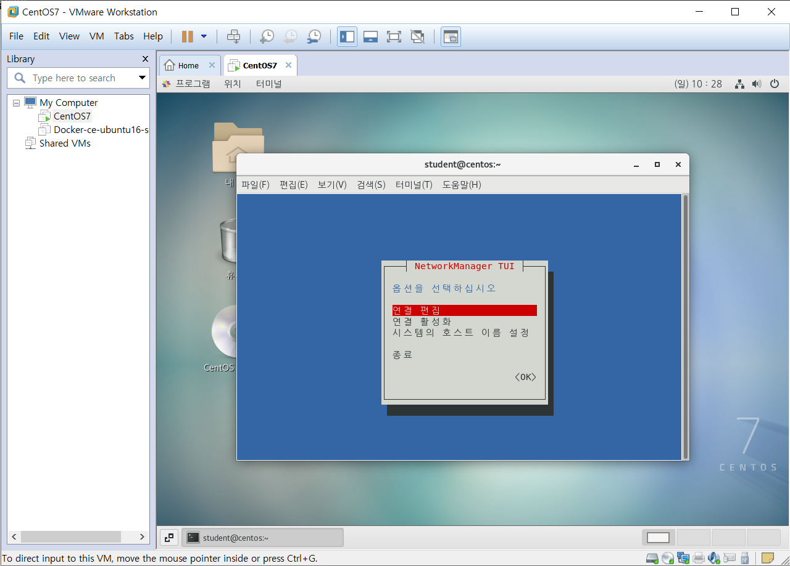
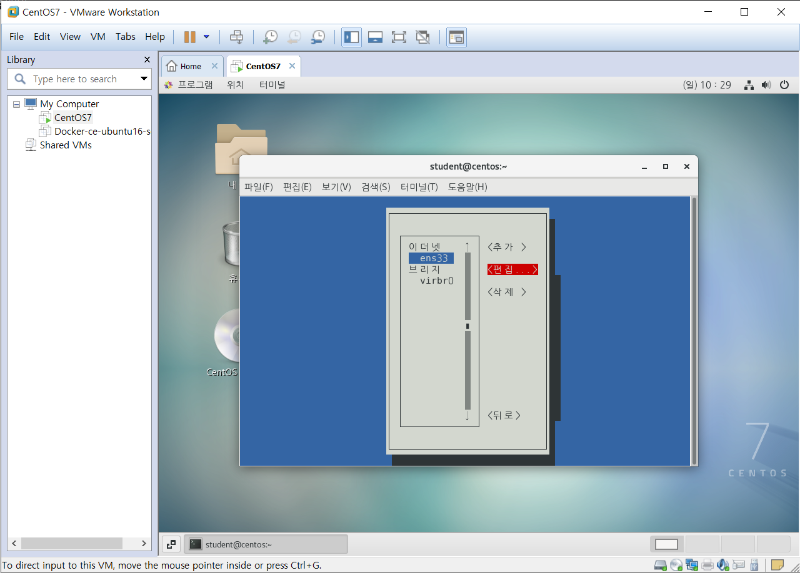

# 4. 서버를 구축할 때 알아야 할 필수 개념과 명령어(4)

### 시스템 설정

파라미터를 모를 경우 도구를 활용하면 알아서 파라미터 이름이 들어가서 네트워크 설정이 더 쉽다.

---

명령어가 작동하지 않으면 `yum` 명령어부터 실행해 해당 명령어 패키지를 설치해야 한다.

`yum search system-config`

`yum -y install 패키지이름`

---

그래픽 도구를 실행하려면 데스크탑에서 실행해야 한다.

---

```shell
[student@centos ~]$ yum search network
...
nm-connection-editor.x86_64 : A network connection configuration editor for
                            : NetworkManager
...
```

그래픽 도구

---

`nmtui`

이 도구를 가지고 네트워크 설정 가능



`연결 편집` → `OK`

`Tab` 키를 이용해 이동 가능



### CRON과 AT

#### cron

주기적으로 반복되는 일을 자동으로 실행할 수 있도록 시스템 작업을 예약해 놓는 것

`cron`과 관련된 데몬은 `crond`이고, 관련 파일은 `/etc/crontab`이다.

---

`crontab -e`

vi 편집기로 작성

정해진 필드로 스케줄링을 걸어줘야 한다.

---

`/etc/crontab`의 형식 : `분 시 일 월 요일 사용자 실행명령`

`Space`가 구분자가 된다.

5개의 필드를 이용해 스케줄링

일반 사용자도 사용 가능

가장 앞에 있는 것은 분. 한 시간 기준으로 0~59까지 쓸 수 있다.

두 번째는 시. 하루 24 기준 0~23

세 번째는 일. 1~31

네 번째는 월. 1~12

다섯 번째는 요일. 0~6. 0부터 일요일로 시작한다.

오른쪽으로 갈 수록 큰 단위

---

`>>` : Double Redirect. 기존 내용에 계속 추가

```shell
* * * * * date >> /home/student/date.log
```

위의 내용을 작성한다.

---

```shell
[student@centos ~]$ crontab -e
no crontab for student - using an empty one
crontab: installing new crontab
[student@centos ~]$ ls ~student/date*
/home/student/date.log
[student@centos ~]$ tail -f ~student/date.log 
2023. 01. 01. (일) 10:40:02 KST
^C
[student@centos ~]$ crontab -l
* * * * * date >> /home/student/date.log
[student@centos ~]$ tail -f ~student/date.log 
2023. 01. 01. (일) 10:40:02 KST
2023. 01. 01. (일) 10:41:01 KST
2023. 01. 01. (일) 10:42:01 KST
2023. 01. 01. (일) 10:43:01 KST
```

---

cron을 더 이상 사용하지 않으려면 주석처리 하면 된다.

#### at

일회성 작업을 예약하는 것

- 예약 : `at 시간`
  - `at 3:00am tomorrow`
  - `at 11:00pm January 30`
  - `at now+1 hours`
- `at>` 프롬프트에 예약 명령어 입력 후 `Enter`
- 완료되면 `Ctrl` + `d`
- 확인 : `at -l`
- 취소 : `atrm 작업번호`

---

```shell
[student@centos ~]$ at 5:45pm
at> shutdown -h now
at> <EOT>
job 5 at Sun Jan  1 17:45:00 2023
[student@centos ~]$ atq
5	Sun Jan  1 17:45:00 2023 a student
[student@centos ~]$ at -c1
at: invalid option -- '1'
Usage: at [-V] [-q x] [-f file] [-mMlbv] timespec ...
       at [-V] [-q x] [-f file] [-mMlbv] -t time
       at -c job ...
       atq [-V] [-q x]
       at [ -rd ] job ...
       atrm [-V] job ...
       batch
[student@centos ~]$ atrm 5
[student@centos ~]$ atq
```

---

```shell
[student@centos ~]$ systemctl status crond.service
● crond.service - Command Scheduler
   Loaded: loaded (/usr/lib/systemd/system/crond.service; enabled; vendor preset: enabled)
   Active: active (running) since 일 2023-01-01 10:19:55 KST; 33min ago
 Main PID: 1174 (crond)
    Tasks: 1
   CGroup: /system.slice/crond.service
           └─1174 /usr/sbin/crond -n

 1월 01 10:19:55 centos systemd[1]: Started Command Scheduler.
 1월 01 10:19:55 centos crond[1174]: (CRON) INFO (RANDOM_DELAY will be sca....)
 1월 01 10:19:56 centos crond[1174]: (CRON) INFO (running with inotify support)
 1월 01 10:45:01 centos crond[1174]: (student) RELOAD (/var/spool/cron/student)
Hint: Some lines were ellipsized, use -l to show in full.
```

## 네트워크 관련 설정과 명령어

host 같은 경우도 기본적인 gateway 설정이 되어 있어야 인터넷 사용이 가능하다.

