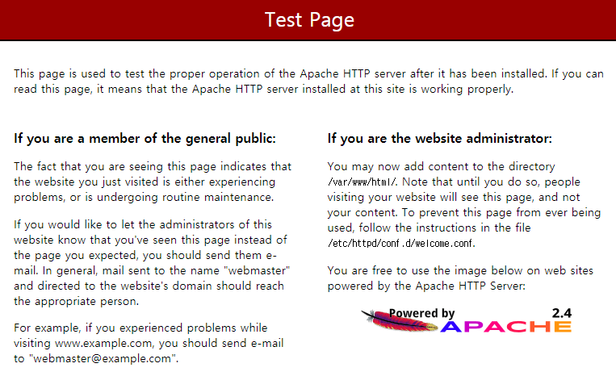
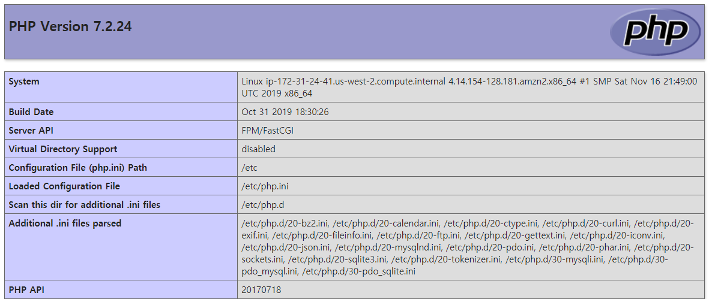
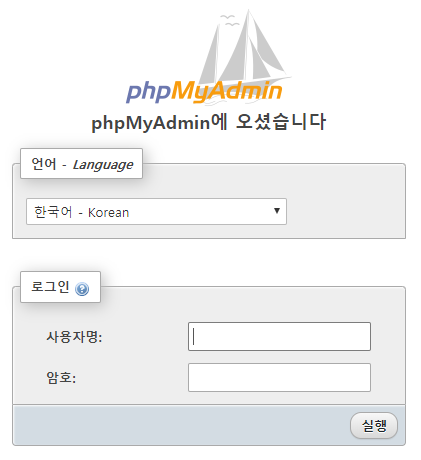
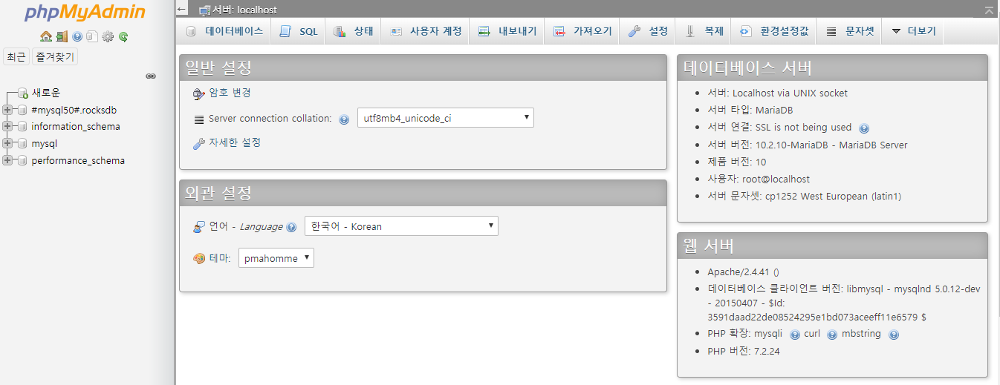

# Amazon Linux 2에 LAMP 웹 서버 설치

https://docs.aws.amazon.com/ko_kr/AWSEC2/latest/UserGuide/ec2-lamp-amazon-linux-2.html

* Amazon Linux 2 인스턴스에서 PHP 및 [MariaDB](https://mariadb.org/about/)(커뮤니티에서 개발한 MySQL 포크) 지원을 포함하는 Apache 웹 서버를 설치할 수 있습니다.
* 이 웹 서버를 LAMP 웹 서버 또는 LAMP 스택이라고도 합니다.
* 이 서버를 사용해서 고정 웹사이트를 호스팅하거나 데이터베이스에서 정보를 읽고 쓰는 동적 PHP 애플리케이션을 배포할 수 있습니다.


## 사전 조건

*  Amazon Linux 2를 사용하여 사용자가 인터넷에서 접근할 수 있는 퍼블릭 DNS 이름을 가진 새 인스턴스를 실행합니다. ([Amazon EC2 Linux 인스턴스 시작하기](https://docs.aws.amazon.com/ko_kr/AWSEC2/latest/UserGuide/EC2_GetStarted.html#ec2-launch-instance) 참조)
* SSH(포트 22), HTTP(포트 80), HTTPS(포트 443) 연결을 허용할 수 있도록 보안 그룹을 구성해야 합니다. ([Linux 인스턴스의 인바운드 트래픽 권한 부여](https://docs.aws.amazon.com/ko_kr/AWSEC2/latest/UserGuide/authorizing-access-to-an-instance.html) 참조)


## 1단계 : LAMP 서버 준비

#### LAMP 서버 준비

1. 인스턴스에 연결합니다.

2. 모든 소프트웨어 패키지가 최신 상태로 업데이트되어 있는지 확인합니다.

   ```bash
   [ec2-user ~]$ sudo yum update -y
   ```

3. `lamp-mariadb10.2-php7.2` 및 `php7.2` Amazon Linux Extras 리포지토리를 설치하여 Amazon Linux 2용 LAMP MariaDB 및 PHP 패키지의 최신 버전을 가져옵니다.

   ```bash
   [ec2-user ~]$ sudo amazon-linux-extras install -y lamp-mariadb10.2-php7.2 php7.2
   ```

4. Apache 웹 서버, MariaDB, PHP 소프트웨어 패키지를 설치합니다.

   ```bash
   [ec2-user ~]$ sudo yum install -y httpd mariadb-server
   ```

   다음 명령을 사용하여 해당 패키지의 현재 버전을 볼 수 있습니다.

   ```bash
   yum info package_name
   ```

5. Apache 웹 서버를 시작합니다.

   ```bash
   [ec2-user ~]$ sudo systemctl start httpd
   ```

6. **systemctl** 명령을 사용하여 Apache 웹 서버가 매번 시스템이 부팅할 때마다 시작되도록 합니다.

   ```bash
   [ec2-user ~]$ sudo systemctl enable httpd
   ```

   다음 명령을 실행하여 **httpd**가 실행되고 있는지 확인할 수 있습니다.

   ```bash
   [ec2-user ~]$ sudo systemctl is-enabled httpd
   ```

7. 인스턴스에 대해 인바운드 HTTP(포트 80) 연결을 허용하는 보안 규칙이 없는 경우 추가합니다.

   * [보안 그룹에 규칙 추가](https://docs.aws.amazon.com/ko_kr/AWSEC2/latest/UserGuide/ec2-security-groups.html#adding-security-group-rule)의 절차를 사용하여 다음 값으로 새로운 인바운드 보안 규칙을 추가합니다.
     - **유형**: HTTP
     - **프로토콜**: TCP
     - **포트 범위**: 80
     - **소스**: 사용자 지정

8. 웹 서버를 테스트합니다. 웹 브라우저에서 인스턴스의 공용 DNS 주소(또는 공용 IP 주소)를 입력합니다. `/var/www/html`에 콘텐츠가 없으면 Apache 테스트 페이지가 표시됩니다. (Amazon EC2 콘솔을 사용하여 인스턴스의 퍼블릭 DNS를 확인할 수 있습니다.)

   

   Apache **httpd**는 Apache document root라는 디렉터리에 보관된 파일을 처리합니다. Amazon Linux Apache 문서 루트는 `/var/www/html`이며, 기본적으로 루트에서 소유합니다.


#### 파일 권한 설정

`ec2-user` 계정에서 이 디렉터리의 파일을 조작할 수 있게 하려면 디렉터리의 소유권과 권한을 변경해야 합니다. 이 작업을 수행하는 방법에는 여러 가지가 있습니다. 본 자습서에서는 `ec2-user`를 `apache` 그룹에 추가하여 `apache` 그룹에 `/var/www` 디렉터리의 소유권을 부여하고 쓰기 권한을 할당합니다.

1. 사용자(이 경우는 `ec2-user`)를 `apache` 그룹에 추가합니다.

   ```bash
   [ec2-user ~]$ sudo usermod -a -G apache ec2-user
   ```

2. 로그아웃하고 다시 로그인한 다음, 새 그룹을 선택하고 멤버십을 확인합니다.

   * 로그아웃합니다(**exit** 명령을 사용하거나 터미널 창 닫기).

     ```bash
     [ec2-user ~]$ exit
     ```

   * `apache` 그룹의 멤버십을 확인하려면 인스턴스에 다시 연결한 후 다음 명령을 실행합니다.

     ```bash
     [ec2-user ~]$ groups
     ec2-user adm wheel apache systemd-journal
     ```

3. `/var/www` 및 그 콘텐츠의 그룹 소유권을 `apache` 그룹으로 변경합니다.

   ```bash
   [ec2-user ~]$ sudo chown -R ec2-user:apache /var/www
   ```

4. 그룹 쓰기 권한을 추가하여 나중에 하위 디렉터리에 대한 그룹 ID를 설정하려면 `/var/www`와 그 하위 디렉터리의 디렉터리 권한을 변경합니다.

   ```bash
   [ec2-user ~]$ sudo chmod 2775 /var/www && find /var/www -type d -exec sudo chmod 2775 {} \;
   ```

5. 그룹 쓰기 권한을 추가하려면 `/var/www` 및 그 하위 디렉터리의 파일 권한을 반복하여 변경합니다.

   ```bash
   [ec2-user ~]$ find /var/www -type f -exec sudo chmod 0664 {} \;
   ```

이제 `ec2-user`와 `apache` 그룹의 향후 멤버는 Apache document root에서 파일 추가, 삭제, 편집을 할 수 있고, 이를 통해 사용자는 정적 웹 사이트 또는 PHP 애플리케이션과 같은 콘텐츠를 추가할 수 있습니다.


## 2단계 : LAMP 서버 테스트

서버가 설치되어 실행 중이고 파일 권한이 올바르게 설정되었다면 사용자의 `ec2-user` 계정을 통해 인터넷에서 사용 가능한 `/var/www/html` 디렉터리에서 PHP 파일을 생성할 수 있어야 합니다.


#### LAMP 서버 테스트

1. Apache 문서 루트에서 PHP 파일을 생성합니다.

   ```bash
   [ec2-user ~]$ echo "<?php phpinfo(); ?>" > /var/www/html/phpinfo.php
   ```

2. 웹 브라우저에서는 방금 생성한 파일의 URL을 입력합니다. 이 URL은 인스턴스의 퍼블릭 DNS 주소에 슬래시(/)와 파일 이름이 추가된 형태입니다.

   ```URL
   http://my.public.dns.amazonaws.com/phpinfo.php
   ```

   PHP 정보 페이지가 표시되어야 합니다.

   

3. `phpinfo.php` 파일을 삭제합니다. 이 파일은 유용한 정보를 포함하고 있지만 보안상 이유로 인터넷에 공개되어서는 안 됩니다.

   ```bash
   [ec2-user ~]$ rm /var/www/html/phpinfo.php
   ```

이제 LAMP 웹 서버가 완전히 동작하는 상태가 됩니다. `/var/www/html`의 Apache document root에 콘텐츠를 추가하면 인스턴스에 대한 퍼블릭 DNS 주소에서 그 콘텐츠를 볼 수 있습니다.


## 3단계 : 데이터베이스 서버 보안 설정

MariaDB 서버의 기본 설치는 테스트 및 개발 기능에 유용한 여러 기능을 포함하고 있지만, 이 기능들은 프로덕션 서버에서는 비활성화되거나 제거되어야 합니다. **mysql_secure_installation** 명령을 통해 루트 암호를 설정하고 설치 패키지에서 보안성이 낮은 기능을 제거하는 과정을 수행할 수 있습니다. MariaDB 서버를 사용할 계획이 없더라도 이 절차를 수행하는 것이 좋습니다.


#### MariaDB 서버 보안 유지

1. MariaDB 서버를 시작합니다.

   ```bash
   [ec2-user ~]$ sudo systemctl start mariadb
   ```

2. 실행 **mysql_secure_installation**.

   ```bash
   [ec2-user ~]$ sudo mysql_secure_installation
   ```

   * 암호를 입력하라는 메시지가 표시되면 루트 계정의 암호를 입력합니다.
     * 현재 루트 암호를 입력합니다. 기본적으로 root 계정에는 암호가 없습니다. Enter를 누릅니다.
     * 암호를 설정하려면 `Y`를 누른 후 안전한 암호를 두 번 입력합니다.
   * `Y`를 눌러서 익명 사용자 계정을 제거합니다.
   * `Y`를 입력하여 원격 루트 로그인을 비활성화합니다.
   * `Y`를 눌러서 테스트 데이터베이스를 제거합니다.
   * `Y`를 눌러서 권한 테이블을 다시 로드하고 변경사항을 저장합니다.

3. 부팅 시 MariaDB 서버가 시작되도록 하려면 다음 명령을 입력합니다.

   ```bash
   [ec2-user ~]$ sudo systemctl enable mariadb
   ```

   

## 4단계 : phpMyAdmin 설치 (선택 사항)

[phpMyAdmin](https://www.phpmyadmin.net/)은 EC2 인스턴스의 MySQL 데이터베이스를 보고 편집하는 데 사용할 수 있는 웹 기반 데이터베이스 관리 도구입니다.


#### phpMyAdmin 설치

1. 필요한 종속 항목을 설치합니다.

   ```bash
   [ec2-user ~]$ sudo yum install php-mbstring -y
   ```

2. Apache를 다시 시작합니다.

   ```bash
   [ec2-user ~]$ sudo systemctl restart httpd
   ```

3. `php-fpm`을 다시 시작합니다.

   ```bash
   [ec2-user ~]$ sudo systemctl restart php-fpm
   ```

4. Apache 문서 루트(`/var/www/html`)로 이동합니다.

   ```bash
   [ec2-user ~]$ cd /var/www/html
   ```

5. https://www.phpmyadmin.net/downloads에서 phpMyAdmin 최신 릴리스의 소스 패키지를 선택합니다. 인스턴스로 파일을 직접 다운로드하려면 다음 예제와 같이 링크를 복사한 후 **wget** 명령에 붙여 넣습니다.

   ```bash
   [ec2-user html]$ wget https://www.phpmyadmin.net/downloads/phpMyAdmin-latest-all-languages.tar.gz
   ```

6. `phpMyAdmin` 폴더를 생성하고 다음 명령을 사용하여 해당 폴더로 패키지의 압축을 풉니다.

   ```bash
   [ec2-user html]$ mkdir phpMyAdmin && tar -xvzf phpMyAdmin-latest-all-languages.tar.gz -C phpMyAdmin --strip-components 1
   ```

7. `phpMyAdmin-latest-all-languages.tar.gz` tarball을 삭제합니다.

   ```bash
   [ec2-user html]$ rm phpMyAdmin-latest-all-languages.tar.gz
   ```

8. MySQL 서버가 실행 중이지 않으면 지금 시작합니다.

   ```bash
   [ec2-user ~]$ sudo systemctl start mariadb
   ```

9. 웹 브라우저에서 phpMyAdmin 설치의 URL을 입력합니다. 아래의 예와 같이 이 URL은 인스턴스의 퍼블릭 DNS 주소(또는 퍼블릭 IP 주소)에 슬래시(/)와 설치 디렉터리의 이름이 추가된 형태입니다.

   ```URL
   http://my.public.dns.amazonaws.com/phpMyAdmin
   ```

   사용자는 phpMyAdmin 로그인 페이지를 볼 수 있어야 합니다.

   

10. 앞서 만든 `root` 사용자 이름 및 MySQL 루트 암호로 phpMyAdmin 설치에 로그인합니다.

    

    phpMyAdmin에 대한 자세한 내용은 [phpMyAdmin 사용 설명서](http://docs.phpmyadmin.net/en/latest/user.html)를 참조

