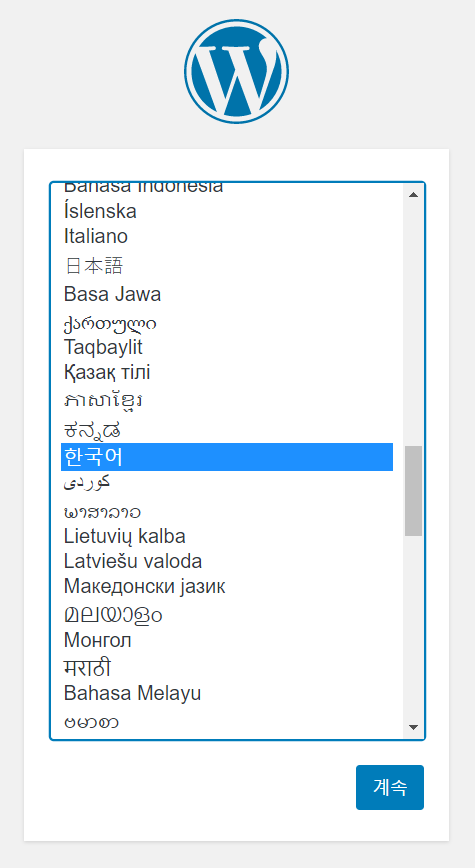
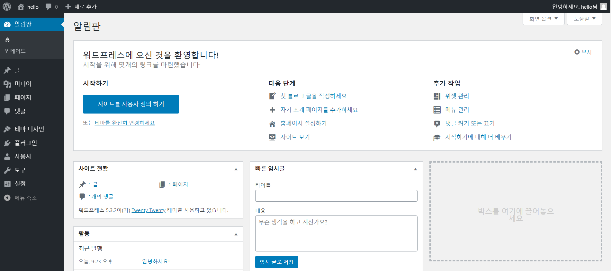

# Amazon Linux를 통한 WordPress 블로그 호스팅

https://docs.aws.amazon.com/ko_kr/AWSEC2/latest/UserGuide/hosting-wordpress.html

* Amazon Linux 인스턴스에 대한 WordPress 블로그의 설치, 구성, 보안 설정


## 사전 조건

* Amazon Linux 2용 [Amazon Linux 2에 LAMP 웹 서버 설치](https://docs.aws.amazon.com/ko_kr/AWSEC2/latest/UserGuide/ec2-lamp-amazon-linux-2.html)의 모든 단계를 수행하여 PHP 및 데이터베이스(MySQL 또는 MariaDB) 지원을 통해 작동하는 웹 서버로 Amazon Linux 인스턴스를 시작
* 보안 그룹이 `HTTP` 및 `HTTPS` 트래픽을 허용하도록 구성하는 단계와 파일 권한이 웹 서버에 맞게 적절하게 설정되어 있는지 확인 ([보안 그룹에 규칙 추가](https://docs.aws.amazon.com/ko_kr/AWSEC2/latest/UserGuide/ec2-security-groups.html#adding-security-group-rule) 참조)


## WordPress 설치

인스턴스에 연결한 후 WordPress 설치 패키지를 다운로드합니다.


#### WordPress 설치 패키지 다운로드 및 압축해제

1. **wget** 명령을 사용하여 최신 WordPress 설치 패키지를 다운로드 합니다.

   ```bash
   [ec2-user ~]$ wget https://wordpress.org/latest.tar.gz
   ```

2. 설치 패키지의 압축 및 아카이빙을 해제합니다. 설치 폴더는 `wordpress`라는 폴더로 압축 해제됩니다.

   ```bash
   [ec2-user ~]$ tar -xzf latest.tar.gz
   ```


#### WordPress 설치에 대한 데이터베이스 사용자 및 데이터베이스 생성

WordPress 설치 시 블로그 게시물, 사용자 의견 등의 정보를 데이터베이스에 저장해야 합니다. 다음 절차를 통해 블로그의 데이터베이스와 이 데이터베이스에 대해 정보 읽기 및 저장 권한이 있는 사용자를 생성할 수 있습니다.

1. 데이터베이스 서버를 시작합니다.

   ```bash
   [ec2-user ~]$ sudo systemctl start mariadb
   ```

2. 데이터베이스 서버에 `root` 사용자로 로그인합니다. 메시지가 표시되면 데이터베이스 `root` 암호를 입력합니다.

   ```bash
   [ec2-user ~]$ mysql -u root -p
   ```

3. MySQL 데이터베이스에 대한 사용자 및 암호를 생성합니다. WordPress 설치는 MySQL 데이터베이스를 통신하기 위해 상기 값을 사용합니다. 고유한 사용자 이름과 암호로 해당 부분을 대체하여 다음 명령을 입력합니다.

   ```mysql
   CREATE USER 'wordpress-user'@'localhost' IDENTIFIED BY 'your_strong_password';
   ```

4. 데이터베이스를 생성합니다. 데이터베이스에 이를 설명할 수 있는 유의미한 이름을 붙입니다(예: `wordpress-db`.).

   ```mysql
   CREATE DATABASE `wordpress-db`;
   ```

5. 데이터베이스에 대한 전체 권한을 이전에 생성한 WordPress 사용자에게 부여합니다.

   ```mysql
   GRANT ALL PRIVILEGES ON `wordpress-db`.* TO "wordpress-user"@"localhost";
   ```

6. 데이터베이스 권한을 새로고침(flush)해서 모든 변경사항이 적용되도록 합니다.

   ```mysql
   FLUSH PRIVILEGES;
   ```

7. `mysql` 클라이언트를 종료합니다.

   ```mysql
   exit
   ```


#### wp-config.php 파일 생성 및 편집

WordPress 설치 폴더는 `wp-config-sample.php`라는 샘플 구성 파일을 포함하고 있습니다. 본 절차에서는 이 파일을 복사하고 특정 구성에 맞도록 편집합니다.

1. `wp-config-sample.php` 파일을 `wp-config.php`라는 파일에 복사합니다. 이를 통해 새 구성 파일을 생성하고 원본 샘플 파일을 이전 상태 그대로 백업으로 보존할 수 있습니다.

   ```bash
   [ec2-user ~]$ cp wordpress/wp-config-sample.php wordpress/wp-config.php
   ```

2. `wp-config.php` 파일을 원하는 텍스트 편집기(**nano**, **vim** 등)로 편집하고 설치에 대한 값을 입력합니다.

   ```bash
   [ec2-user ~]$ nano wordpress/wp-config.php
   ```

   * `DB_NAME`을(를) 정의하는 줄을 찾고 `database_name_here`를 생성한 데이터베이스 이름으로 변경합니다.

     ```php
     define('DB_NAME', 'wordpress-db');
     ```

   * `DB_USER`을(를) 정의하는 줄을 찾고 `username_here`를 생성한 데이터베이스 사용자로 변경합니다.

     ```php
     define('DB_USER', 'wordpress-user');
     ```

   * `DB_PASSWORD`을(를) 정의하는 줄을 찾고 `password_here`를 생성한 암호로 변경합니다.

     ```php
     define('DB_PASSWORD', 'your_strong_password');
     ```

   * `Authentication Unique Keys and Salts`라는 섹션을 검색합니다. 이 `KEY` 및 `SALT` 값은 WordPress 사용자가 로컬 컴퓨터에 저장하는 브라우저 쿠키에 암호 계층을 제공합니다. 기본적으로 긴 무작위 값을 추가해서 사이트의 보안성을 강화할 수 있습니다. https://api.wordpress.org/secret-key/1.1/salt/을 방문해서 키 값의 세트를 무작위로 생성하고 이를 `wp-config.php` 파일로 복사해서 붙여 넣을 수 있습니다.

   * 파일을 저장하고 텍스트 편집기를 종료합니다.


#### WordPress 파일을 Apache 문서 루트 아래에 설치

1. 설치 폴더 압축을 해제하고 MySQL 데이터베이스 및 맞춤형 WordPress 구성 파일을 사용자 설정했으므로, 이제 설치 파일을 웹 서버 문서 루트에 복사하여 설치를 완료하는 설치 스크립트를 실행할 수 있습니다.

2. WordPress를 문서 루트에서 실행하려면 WordPress 설치 디렉터리의 파일(디렉터리 자체는 제외)을 다음과 같이 복사합니다.

   ```bash
   [ec2-user ~]$ cp -r wordpress/* /var/www/html/
   ```

3. WordPress를 문서 루트의 대체 디렉터리에서 실행하려면 먼저 해당 디렉터리를 생성한 후 파일을 그 디렉터리로 복사합니다.

   ```bash
   [ec2-user ~]$ mkdir /var/www/html/blog
   [ec2-user ~]$ cp -r wordpress/* /var/www/html/blog/
   ```

   

#### WordPress에서 퍼머링크(permalinks) 사용

WordPress가 올바로 작동하려면 Apache `.htaccess` 파일을 사용해야 하지만 Amazon Linux에서는 기본적으로 이 파일을 사용할 수 없습니다. 따라서 아래 방법에 따라 Apache 문서 루트에서 모든 재정의를 허용해야 합니다.

1. 자주 사용하는 텍스트 편집기(**nano** 또는 **vim**)로 `httpd.conf` 파일을 엽니다.

   ```bash
   [ec2-user ~]$ sudo vim /etc/httpd/conf/httpd.conf
   ```

2. 다음과 같이 시작하는 영역을 찾습니다. `<Directory "/var/www/html">`

   ```bash
   <Directory "/var/www/html">
       #
       # Possible values for the Options directive are "None", "All",
       # or any combination of:
       #   Indexes Includes FollowSymLinks SymLinksifOwnerMatch ExecCGI MultiViews
       #
       # Note that "MultiViews" must be named *explicitly* --- "Options All"
       # doesn't give it to you.
       #
       # The Options directive is both complicated and important.  Please see
       # http://httpd.apache.org/docs/2.4/mod/core.html#options
       # for more information.
       #
       Options Indexes FollowSymLinks
   
       #
       # AllowOverride controls what directives may be placed in .htaccess files.
       # It can be "All", "None", or any combination of the keywords:
       #   Options FileInfo AuthConfig Limit
       #
       AllowOverride None
   
       #
       # Controls who can get stuff from this server.
       #
       Require all granted
   </Directory>
   ```

3. 위 영역에서 `AllowOverride None` 라인을 `AllowOverride All`로 변경합니다.

4. 파일을 저장하고 텍스트 편집기를 종료합니다.


#### Apache 웹 서버에 대한 파일 권한 수정

WordPress의 제공 기능 중 일부는 Apache 문서 루트에 대한 쓰기 권한을 필요로 합니다.

1. `/var/www`의 파일 소유권 및 그 콘텐츠를 `apache` 사용자에게 허용합니다.

   ```bash
   [ec2-user ~]$ sudo chown -R apache /var/www
   ```

2. `/var/www` 및 그 콘텐츠의 그룹 소유권을 `apache` 그룹에 허용합니다.

   ```bash
   [ec2-user ~]$ sudo chgrp -R apache /var/www
   ```

3. `/var/www` 및 그 하위 디렉터리의 디렉터리 권한을 변경해서 그룹 쓰기 권한을 추가하고 미래 하위 디렉터리에서 그룹 ID를 설정합니다.

   ```bash
   [ec2-user ~]$ sudo chmod 2775 /var/www
   [ec2-user ~]$ find /var/www -type d -exec sudo chmod 2775 {} \;
   ```

4. `/var/www` 및 그 하위 디렉터리의 파일 권한을 계속 변경해서 그룹 쓰기 권한을 추가합니다.

   ```bash
   [ec2-user ~]$ find /var/www -type f -exec sudo chmod 0664 {} \;
   ```

5. Apache 웹 서버를 재시작해서 새 그룹 및 권한을 가져옵니다.

   ```bash
   [ec2-user ~]$ sudo systemctl restart httpd
   ```

   

#### Amazon Linux 2로 WordPress 설치 스크립트 실행

1. **systemctl** 명령을 사용하여 시스템이 부팅될 때마다 `httpd` 및 데이터베이스 서비스가 시작되도록 합니다.

   ```bash
   [ec2-user ~]$ sudo systemctl enable httpd && sudo systemctl enable mariadb
   ```

2. 데이터베이스 서버가 실행되는지 확인합니다.

   ```bash
   [ec2-user ~]$ sudo systemctl status mariadb
   ```

   데이터베이스 서비스가 실행 중이지 않은 경우, 이를 시작합니다.

   ```bash
   [ec2-user ~]$ sudo systemctl start mariadb
   ```

3. Apache 웹 서버(`httpd`)가 실행 중인지 확인합니다.

   ```bash
   [ec2-user ~]$ sudo systemctl status httpd
   ```

   `httpd` 서비스가 실행 중이지 않은 경우, 이를 시작합니다.

   ```bash
   [ec2-user ~]$ sudo systemctl start httpd
   ```

4. 웹 브라우저에서 WordPress 블로그의 URL을 입력합니다(인스턴스에 대한 퍼블릭 DLS 주소 또는 `blog` 폴더 다음의 주소). 이제 WordPress 설치 스크립트가 나타납니다. WordPress 설치에 필요한 정보를 제공합니다. **Install WordPress(WordPress 설치)**를 선택해서 설치를 완료합니다.

   

   


