# NoSQL 테이블 생성 및 쿼리
Amazon DynamoDB 사용

https://aws.amazon.com/ko/getting-started/tutorials/create-nosql-table/

*  [DynamoDB 콘솔](https://console.aws.amazon.com/console/home?region=us-east-1)을 사용하여 간단한 테이블을 만들고, 데이터를 추가하며, 데이터를 스캔 및 쿼리하고, 데이터와 테이블을 삭제
* DynamoDB는 완전 관리형 클라우드 데이터베이스로서 문서 모델과 키-값 스토어 모델을 모두 지원합니다.
* 유연한 데이터 모델, 안정적인 성능, 처리 용량 자동 조정 기능은 모바일, 웹, 게임, 광고 기술, IoT, 그 외 많은 애플리케이션에 매우 적합합니다.

[AWS Management Console](https://console.aws.amazon.com/console/home) 검색 창에 *DynamoDB*를 입력하고 DynamoDB 콘솔을 엽니다.

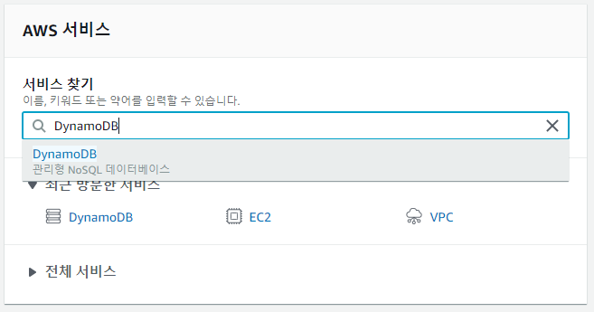

## 1단계 : 원본 NoSQL 만들기

이 단계에서는 DynamoDB 콘솔을 사용하여 테이블을 만듭니다.

1. DynamoDB 콘솔에서 **테이블 만들기**를 선택합니다.

   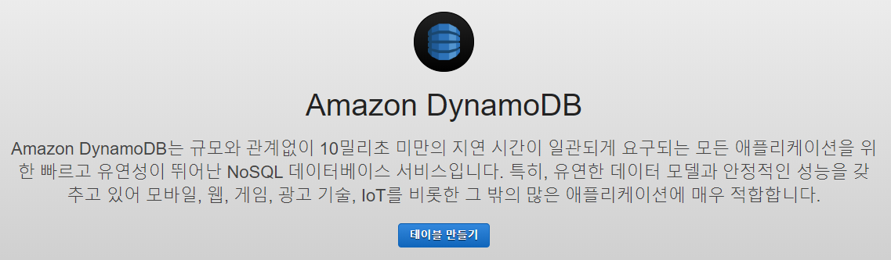

2. **테이블 이름** 상자에 *Music*을 입력합니다.

3. 파티션 키는 확장성을 위해 파티션에 데이터를 분산하는 데 사용됩니다. 균등하게 분산된 액세스 패턴을 가질 가능성이 크고 다양한 값을 가진 속성을 선택하는 것이 중요합니다. ***파티션 키*** 상자에 *Artist*를 입력합니다.

   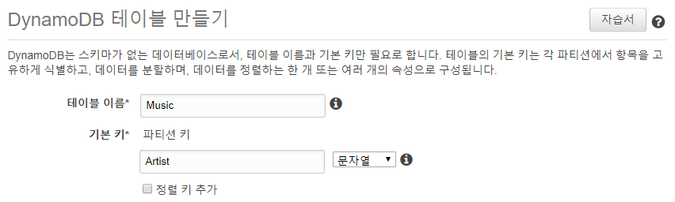

4. 각 아티스트가 여러 곡을 쓸 수 있으므로 정렬 키를 사용하면 쉽게 정렬할 수 있습니다. **정렬 키 추가** 확인란을 선택합니다. **정렬 키 추가** 상자에 so*ngTitle*을 입력합니다.

   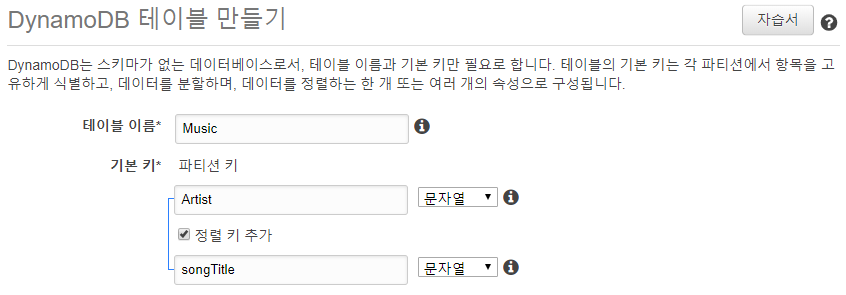

5. 다음으로 테이블에 대해 DynamoDB auto scaling을 활성화합니다.

   * DynamoDB auto scaling은 요청 볼륨에 따라 테이블의 읽기 및 쓰기 용량을 변경합니다. 
   * DynamoDB는 *DynamoDBAutoscaleRole*이라는 AWS IAM(AWS Identity and Access Management) 역할을 사용하여 사용자를 대신해 auto scaling 프로세스를 관리합니다. 
   * DynamoDB는 사용자가 계정에서 auto scaling을 처음 활성화할 때 이 역할을 생성합니다.
   * **기본 설정 사용** 확인란 선택을 취소하여 DynamoDB에게 역할 생성을 지시합니다.

   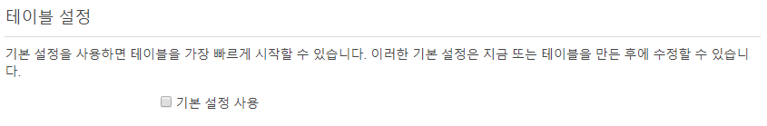

6. 화면에서 아래로 스크롤하여 **보조 인덱스**, **프로비저닝된 용량**, **Auto Scaling**을 지나 **생성** 버튼으로 갑니다.

   * **Auto Scaling** 섹션에서 DynamoDB가 사용자를 위해 *DynamoDBAutoscaleRole* 역할을 생성하는 것을 볼 수 있습니다.
   * **생성**을 선택합니다.
   * **Music** 테이블을 사용할 준비가 되면 확인란 과 함께 테이블 목록에 표시됩니다.

   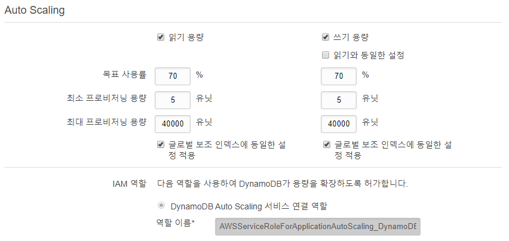

   

## 2단계 : 데이터를 NoSQL 테이블에 추가하기

이 단계에서는 데이터를 새로운 DynamoDB 테이블에 추가합니다.

1. **항목** 탭을 선택합니다. **항목** 탭에서 **항목 만들기** 를 선택합니다.

   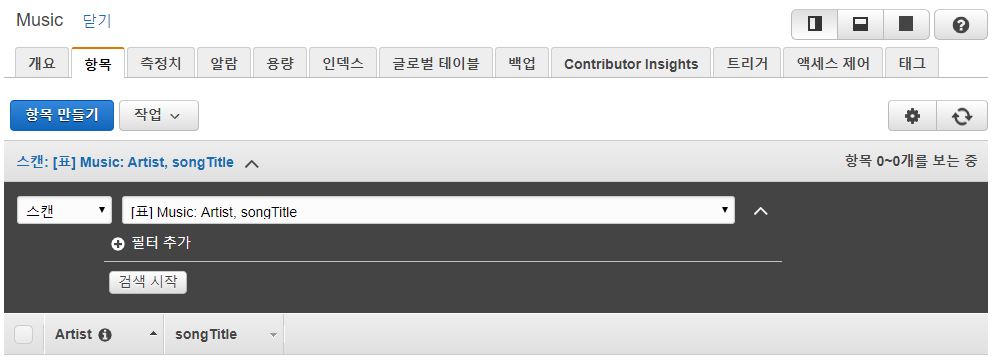

2. **Artist** 속성에는 *No One You Know*를 입력하고, **songTitle** 속성에는 *Call Me Today*를 입력한 후, **저장**을 선택하여 항목을 저장합니다.

   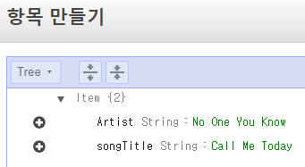

3. 이 과정을 반복하여 *Music* 테이블에 몇 개의 항목을 추가합니다.

   * **Artist**: *No One You Know*, **songTitle**: *My Dog Spot*
   * **Artist**: *No One You Know*, **songTitle**: *Somewhere Down The Road*
   * **Artist**: *The Acme Band*, **songTitle**: *Still in Love*
   * **Artist**: *The Acme Band*, **songTitle**: *Look Out, World*

   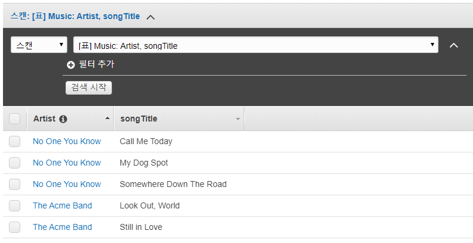

   

## 3단계 : NoSQL 테이블 쿼리하기

이 단계에서는 쿼리 작업을 사용하여 테이블에서 데이터를 검색합니다. DynamoDB에서는 쿼리 작업이 효율적이며 키를 사용하여 데이터를 찾습니다. 스캔 작업은 전체 테이블을 통과합니다.

1. 항목 위 진한 회색 배너의 드롭다운 목록에서 **스캔**을 **쿼리**로 변경합니다.

   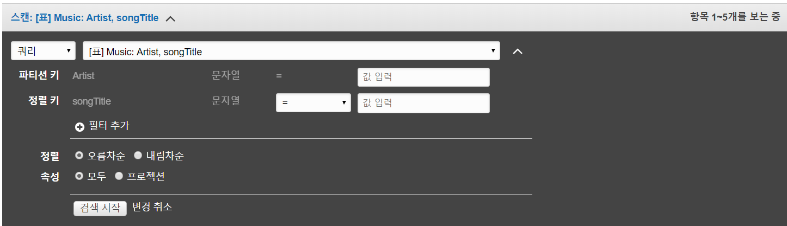

2. 콘솔을 사용하여 다양한 방법으로 *Music*을 쿼리할 수 있습니다. 첫 번째 쿼리를 위해 다음을 수행합니다.

   * **Artist** 상자에 *No One You Know*를 입력하고 **Start search(검색 시작)**를 선택합니다. *No One You Know*가 부른 모든 노래가 표시됩니다.
   * **Artist** 상자에 *The Acme Band*를 입력하고 **Start search(검색 시작)**를 선택합니다. *The Acme Band*가 부른 모든 노래가 표시됩니다.

   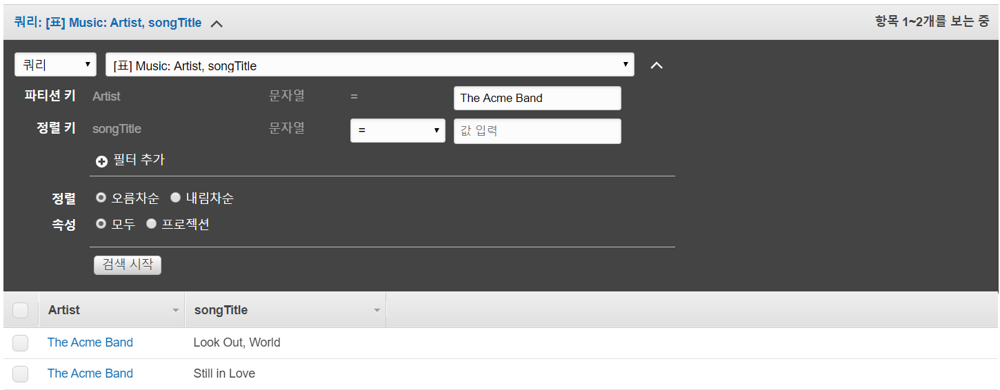

3. 다른 쿼리를 실행하되 이번에는 검색 결과를 좁힙니다 .

   * **Artist** 상자에 *The Acme Band*를 입력합니다.
   * **songTitle** 상자의 드롭다운 목록에서 **Begins with**를 선택하고 *S*를 입력합니다.
   * **Start search(검색 시작)**를 선택합니다. *The Acme Band*가 부른 "Still in Love"만 표시됩니다.

   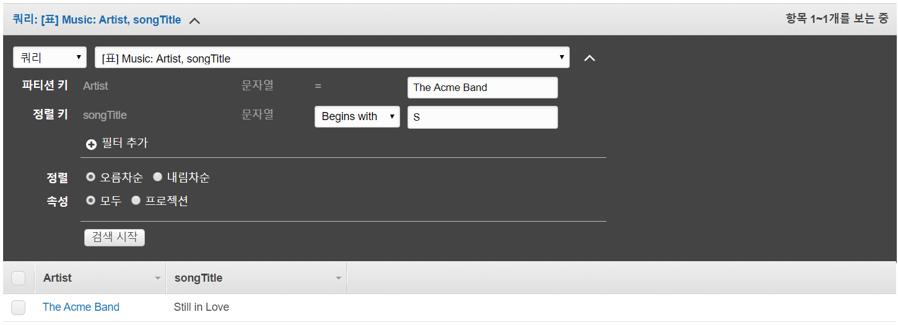

   

## 4단계 : 기존 항목 삭제하기

이 단계에서는 DynamoDB 테이블에서 항목을 삭제합니다.

1. **쿼리** 드롭다운 목록을 다시 **스캔**으로 변경합니다.  

2. *The Acme Band* 옆의 확인란 을 선택합니다. **작업** 드롭다운 목록에서 **삭제**를 선택합니다. 항목을 삭제할지 묻는 메시지가 표시됩니다. **삭제**를 선택하면 항목이 삭제됩니다.

   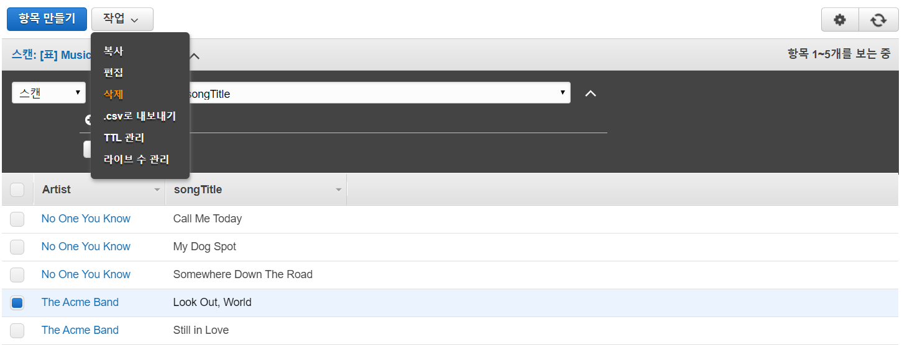

   

## 5단계 : NoSQL 테이블 삭제하기

이 단계에서는 DynamoDB 테이블을 삭제합니다.

DynamoDB 콘솔에서 쉽게 테이블을 삭제할 수 있습니다. 더 이상 사용하지 않는 테이블은 삭제하여 비용이 계속 청구되지 않도록 하는 것이 모범 사례입니다.

1. DynamoDB 콘솔에서 **Music** 테이블 옆의 옵션을 선택한 다음 **테이블 삭제**를 선택합니다.

2. 확인 대화 상자에서 **삭제**를 선택합니다.

   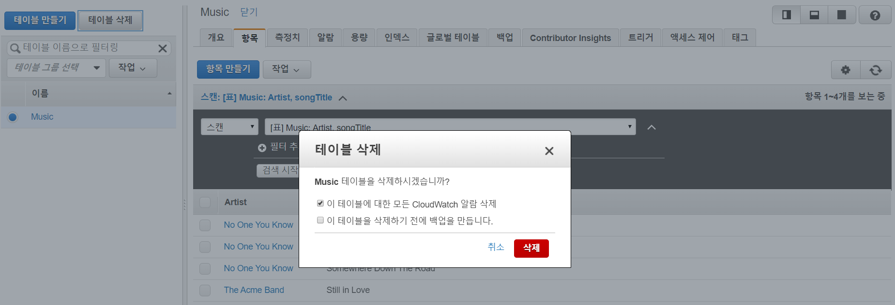

   

