# Database_2

필수 설치 프로그램

- Git (https://git-scm.com/)
- Visual Studio Code (https://code.visualstudio.com/)
- Notepad++ (https://notepad-plus-plus.org/downloads/v7.8.2/)
- Postman (https://www.getpostman.com/downloads/) ← 회원가입 필요
- Node.js (https://nodejs.org/ko/)
- Xshell

Cloud Computing

- AWS
- heroku (https://www.heroku.com/)

DB (정형, 비정형 데이터)

- MySQL 회원 가입 (https://www.mysql.com)
- MySQL Server, Workbench (https://dev.mysql.com/downloads/installer/)

Linux

- putty, puttygen (https://www.putty.org/) ← 설치하지 않고 바로 실행
- Virtual Box version 6.0 이하 (https://www.virtualbox.org/)
- VMware Workstation Player (https://my.vmware.com/en/web/vmware/free#desktop_end_user_computing/vmware_workstation_player/15_0)
- Vagrant (https://www.vagrantup.com/)

Docker

- Docker CE for Windows (https://hub.docker.com/) ← 회원가입 필요
  - $ docker version

---

repository

---

원격 저장소 복제

```
git clone [원격 저장소 URL]
```

---

원격 저장소의 데이터를 로컬 저장소에 가져와 병합

```
git pull [원격 저장소 이름] [branch 이름]
```

---

VS Code Extension 설치

- Vagrant
- Docker

## 데이터베이스

Database(DB) : 통합하여 관리되는 데이터의 집합체

DBMS : 데이터베이스를 관리해주는 시스템. SW. 오라클, MySQL

RDB, RDS : 관계형 데이터베이스, 관계형 데이터베이스 서비스

RDBMS : 관계형 데이터베이스 관리 시스템. MySQL

---

MariaDB는 MySQL과 동일

---

상용 면에서는 EC2가 좋지만, 비용이 훨씬 더 비싸다. 이중화 작업도 직접 구현해야 한다.

RDS는 서비스 지원이 가능하기 때문에 편하다.

---

NoSQL → SQL을 못 쓴다. 다른 개념을 가지고 조작

SQL : 데이터베이스를 사용하기 위한 언어

---

관계형 데이터베이스

데이터를 중복되지 않게 저장하는 것이 목적. 한 곳의 데이터가 바뀌면 다른 곳에서도 똑같이 바뀌어야 한다.

---

애플, 아마존

인터넷 기업 페이스북

SNS에 글을 올리거나 카카오톡에 글을 쓴다.

정형화되어있지 않은 데이터는 관계형 데이터베이스에 넣을 수 없다.

카카오톡 문자, 사진, 파일 등 보낸다. → 정형 데이터가 아니다.

---

NoSQL은 데이터 종류가 몇백 가지나 된다.

---

관계형 데이터베이스는 구조화에 최적화됨. 검색

NoSQL은 데이터를 쌓기 쉽다. 검색에는 어려움이 있다.

---

하드웨어가 싸졌다. 많은 데이터를 쉽게 저장할 수 있게 되었다.

비정형 데이터와 관계형 데이터 혼합해서 사용

---

데이터를 쌓기 위해서는 관계형 데이터베이스는 비싸다. NoSQL 사용

## 데이터베이스란?

조직에 필요한 정보를 얻기 위해 논리적으로 연관된 데이터를 모아 구조적으로 통합해 놓은 것

---

영수증, 승차권도 데이터의 하나

---

데이터들이 쌓여서 어떻게 쓰일 것인지

---

데이터베이스 시스템은 데이터의 검색과 변경 작업을 주로 수행함

변경이란 시간에 따라 변하는 데이터 값을 데이터베이스에 반영하기 위해 수행하는 삽입, 삭제, 수정 등의 작업을 말함

---

구축이 어려움 → 데이터의 구조를 잡는 것이 어렵다는 것

## 데이터베이스의 특징

- 실시간 접근성
  - 데이터베이스는 실시간으로 서비스된다.
  - 사용자가 데이터를 요청하면 몇 시간이나 며칠 뒤에 결과를 전송하는 것이 아니라 수 초 내에 결과를 서비스한다.
  - 실시간이란 사용자가 요청하는 순간에 실제 데이터를 서비스하는 것을 말한다.
- 계속적인 변화
  - 데이터베이스에 저장된 내용은 어느 한순간의 상태를 나타내지만, 데이터 값은 시간에 따라 항상 바뀐다.
  - 데이터베이스는 삽입, 삭제, 수정 등의 작업으로 바뀐 데이터 값을 저장한다.
- 동시 공유
  - 데이터베이스는 서로 다른 업무 또는 여러 사용자에게 동시에 공유된다.
  - 동시는 병행이라고도 하며, 데이터베이스에 접근하는 사용자 데이터 요청 프로그램이 동시에 여러 개 있다는 의미다.
- 내용에 따른 참조
  - 데이터베이스에 저장된 데이터는 데이터의 물리적인 위치가 아닌 데이터 값에 따라 참조된다.
  - 사용자가 원하는 데이터를 얻기 위해 데이터 값을 사용하여 조건을 제시하면 데이터베이스는 이에 해당하는 데이터를 검색해준다.

---

데이터를 어떻게 쓸 것인가 모델링을 한다. 데이터를 어떻게 전산화 할 것인가.

SW를 이용해 실제 데이터를 저장 → DBMS

관계형 데이터베이스를 일반적으로 데이터베이스라고 한다.

실제 데이터베이스는 파일 형태로 저장된다.

## SQL 

관계형 데이터베이스 관리 시스템의 데이터를 관리하기 위해 설계된 특수 목적의 프로그래밍 언어

---

SQL의 종류

- 데이터 정의어 (DDL, Data Definition Language)
  - 데이터베이스, 테이블의 스키마를 정의, 수정, 삭제하는 명령어
  - CREATE, ALTER, DROP
- 데이터 조작어 (DML, Data Manipulation Language)
  - 테이블의 데이터를 조작하는 명령어
  - SELECT, INSERT, UPDATE, DELETE
- 데이터 제어어 (DCL, Data Control Language)
  - 데이터베이스, 테이블의 접근권한이나 CRUD 권한을 정의하는 명령어
  - GRANT, REVOKE

---

ANSI-SQL

표준화된 SQL 문장

---

SELECT, FROM, WHERE

## 데이터베이스 사용자

- 일반 사용자
- 응용 프로그래머
- SQL 사용자
- 데이터베이스 관리자 (DBA, Database Administrator)

---

데이터를 어떤 방식으로 저장할 것인지

## MySQL 설치

MySQL Server 8

MySQL Workbench 8

MySQL Shell 8

Connector/J → 프로그래밍 언어와 연동할 때 필요하다. 버전이 달라지면 코딩도 달라진다.

---

가용성 넘어가기

---

Default로 3306 포트 사용

---

User Name, Password 설정

Host가 `<All Hosts (%)>`라면 외부 PC에서 접속할 수 있다.

MySQL80 이라는 이름으로 윈도우에 등록된다.

---

MySQL 8.0 Command Line Client

MySQL Workbench 8.0 CE

---

MySQL 8.0 Command Line Client 실행 → 비밀번호 입력

MySQL 콘솔로 접속하면 `use`라는 명령어로 사용할 DB를 지정해줘야 한다.

root로 접속한 상태. 지정하지 않은 상태에서 나중에 접속함

```mysql
mysql> show databases;
mysql> use mysql;
mysql> show tables;
mysql> desc user;
mysql> select host,user from user;
+-----------+------------------+
| host      | user             |
+-----------+------------------+
| %         | user1            |
| localhost | mysql.infoschema |
| localhost | mysql.session    |
| localhost | mysql.sys        |
| localhost | root             |
+-----------+------------------+
5 rows in set (0.00 sec)
```

모든 명령은 세미콜론으로 끝나야 한다. 안 그러면 계속 대기

---

root 계정은 로컬 호스트에서만 접속할 수 있다.

user1은 %로 되어있다. 외부에 있는 호스트에서 접속할 수 있다.

---

터미널 사용 방법

윈도우 → 서비스 검색

윈도우가 가지고 있는 서비스 목록이 있다.

MySQL80 우클릭 → 속성

윈도우가 시작하면서 같이 시작한다.

여기서 재시작 가능. 중지 → 시작

아니면 우클릭 후 다시 시작

오류가 발생하면 설정 파일이 틀렸기 때문이다. 오타 또는 잘못된 옵션

---

실행 파일 경로

```
"C:\Program Files\MySQL\MySQL Server 8.0\bin\mysqld.exe" --defaults-file="C:\ProgramData\MySQL\MySQL Server 8.0\my.ini" MySQL80
```

mysqld : 데몬

---

윈도우 → 시스템 환경 변수 편집 검색

`C:\Program Files\MySQL\MySQL Server 8.0\bin`

환경 변수 클릭

Path 안에 설정되어있는 명령어들은 어디서든 실행할 수 있도록 한다.

Path 더블클릭

새로 만들기 → MySQL 경로 입력

cmd창 닫았다가 열기

```
> mysql -uroot -p
```

MySQL의 root 유저에 password로 접속

---

`code` : Visual Studio Code를 실행하는 명령어

```
> code "c:\ProgramData\MySQL\MySQL Server 8.0\my.ini"
```

`my.ini`는 windows에서의 MySQL 설정 파일

---

시작 → workbench 검색 → MySQL Workbench 8.0 CE 실행

MySQL Connections 옆 `+` 버튼 클릭

---

Hostname : 상대방의 workbench에 접속하고 싶으면 상대방 IP 주소 입력

Username : 접속하고자 하는 유저 이름

Store in Vault ... → 비밀번호 저장. 안 하면 접속 시에 계속 물어본다.

Schema = 데이터베이스

---

다음과 같이 설정

Connection Name : MyLocal

Connection Method : Standard (TCP/IP)

Hostname : 127.0.0.1

Port : 3306

Username : root

---

MyLocal 클릭 → 비밀번호 입력

Workbench와 같은 클라이언트 툴을 이용하면 오타 수정이 용이하다.

## 실습

https://bjpublic.tistory.com/216

소스코드 다운로드

---

Workbench → File → Open SQL Script... → db_t2\SampleCode\toku2-1.sql

---

```mysql
-- 특집2-1: SQL식 조건 분기

-- ***********************************
--
-- ○1-1.워밍업: 조건에 따라 사용 열을 전환한다
--
-- ***********************************

CREATE TABLE CahngeCols
(year  INTEGER NOT NULL PRIMARY KEY,
 col_1 INTEGER NOT NULL,
 col_2 INTEGER NOT NULL);

INSERT INTO CahngeCols VALUES(2011,	10,	7);
INSERT INTO CahngeCols VALUES(2012,	20,	6);
INSERT INTO CahngeCols VALUES(2013,	30,	5);
INSERT INTO CahngeCols VALUES(2014,	40,	4);
INSERT INTO CahngeCols VALUES(2015,	50,	3);

-- 리스트1 열의 전환(SELECT문에서)
SELECT year,
       CASE WHEN year <= 2013 THEN col_1
            WHEN year >= 2014 THEN col_2
            ELSE NULL END AS col_3
  FROM CahngeCols;

-- 리스트2 WHERE절에서의 사용
SELECT year
  FROM CahngeCols
 WHERE 4 <= CASE WHEN year <= 2013 THEN col_1
                 WHEN year >= 2014 THEN col_2
                 ELSE NULL END;


-- ***********************************
--
-- ○1-2.열의 전환: 순열과 조합
--
-- ***********************************

CREATE TABLE Perm2
(cust_id  CHAR(3) PRIMARY KEY,
 item_1   VARCHAR(32)  NOT NULL,
 item_2   VARCHAR(32) NOT NULL);

INSERT INTO Perm2 VALUES('001', '시계', '정수기');
INSERT INTO Perm2 VALUES('002', '휴대전화', '휴대전화');
INSERT INTO Perm2 VALUES('003', '정수기', '시계');
INSERT INTO Perm2 VALUES('004', '휴대전화', '휴대전화');
INSERT INTO Perm2 VALUES('005', '잉크', '안경');

-- 리스트3 조합→순열(중복 행 제거 전)
SELECT CASE WHEN item_1 < item_2 THEN item_1
            ELSE item_2 END AS c1,
       CASE WHEN item_1 < item_2 THEN item_2
            ELSE item_1 END AS c2
  FROM Perm2;

-- 리스트4 조합→순열(중복 행 제거 후)
SELECT DISTINCT
       CASE WHEN item_1 < item_2 THEN item_1
            ELSE item_2 END AS c1,
       CASE WHEN item_1 < item_2 THEN item_2
            ELSE item_1 END AS c2
  FROM Perm2;


CREATE TABLE Perm3
(cust_id  CHAR(3) PRIMARY KEY,
 item_1   VARCHAR(32)  NOT NULL,
 item_2   VARCHAR(32) NOT NULL,
 item_3   VARCHAR(32) NOT NULL);

INSERT INTO Perm3 VALUES('001', '시계', '정수기', '티슈');
INSERT INTO Perm3 VALUES('002', '티슈', '정수기', '시계');
INSERT INTO Perm3 VALUES('003', '달력', '노트', '시계');
INSERT INTO Perm3 VALUES('004', '달력', '노트', '잉크');
INSERT INTO Perm3 VALUES('005', '문고판 책', '게임 소프트', '안경');
INSERT INTO Perm3 VALUES('006', '문고판 책', '안경', '게임 소프트');

-- 리스트5 열 형식→행 형식
CREATE VIEW CustItems (cust_id, item) AS
SELECT cust_id, item_1
  FROM Perm3
UNION ALL
SELECT cust_id, item_2
  FROM Perm3
UNION ALL
SELECT cust_id, item_3
  FROM Perm3;

-- 리스트6 조합→순열(3열 확장판)
SELECT DISTINCT MAX(CI1.item) AS c1, 
       MAX(CI2.item) AS c2,
       MAX(CI3.item) AS c3
  FROM CustItems CI1
           INNER JOIN CustItems CI2
                   ON CI1.cust_id = CI2.cust_id
                  AND CI1.item < CI2.item
                 INNER JOIN CustItems CI3
                         ON CI2.cust_id = CI3.cust_id
                        AND CI2.item < CI3.item
 GROUP BY CI1.cust_id;


-- ***********************************
--
-- ○1-3.표두의 복잡한 집계
--
-- ***********************************

CREATE TABLE Employees
(emp_id  CHAR(3) NOT NULL PRIMARY KEY,
 dept    VARCHAR(8) NOT NULL,
 sex     CHAR(2) NOT NULL,
 age     INTEGER NOT NULL,
 salary  INTEGER NOT NULL);

INSERT INTO Employees VALUES('001',	'제조',	'남',	32,	30);
INSERT INTO Employees VALUES('002',	'제조',	'남',	30,	29);
INSERT INTO Employees VALUES('003',	'제조',	'여',	23,	19);
INSERT INTO Employees VALUES('004',	'회계',	'남',	45,	35);
INSERT INTO Employees VALUES('005',	'회계',	'남',	50,	45);
INSERT INTO Employees VALUES('006',	'영업',	'여',	40,	50);
INSERT INTO Employees VALUES('007',	'영업',	'여',	42,	40);
INSERT INTO Employees VALUES('008',	'영업',	'남',	52,	38);
INSERT INTO Employees VALUES('009',	'영업',	'남',	34,	28);
INSERT INTO Employees VALUES('010',	'영업',	'여',	41,	25);
INSERT INTO Employees VALUES('011',	'인사',	'남',	29,	25);
INSERT INTO Employees VALUES('012',	'인사',	'여',	36,	29);

-- 리스트7 표두: 부서·성별 / 표측: 연령계급
SELECT dept,
       SUM(CASE WHEN age <= 30 AND sex = '남' THEN 1 ELSE 0 END) AS "신입(남)",
       SUM(CASE WHEN age <= 30 AND sex = '여' THEN 1 ELSE 0 END) AS "신입(여)",
       SUM(CASE WHEN age >= 31 AND sex = '남' THEN 1 ELSE 0 END) AS "전문가(남)",
       SUM(CASE WHEN age >= 31 AND sex = '여' THEN 1 ELSE 0 END) AS "전문가(여)"
  FROM Employees
 GROUP BY dept;

-- 리스트8 표두: 연령계급·성별 / 표측: 부서(소계·합계 존재)
SELECT dept,
       COUNT(*),
       SUM(CASE WHEN age <= 30 THEN 1 ELSE 0 END) AS "신입(합계)",
       SUM(CASE WHEN age <= 30 AND sex = '남' THEN 1 ELSE 0 END) AS "신입(남)",
       SUM(CASE WHEN age <= 30 AND sex = '여' THEN 1 ELSE 0 END) AS "신입(여)",
       SUM(CASE WHEN age >= 31 THEN 1 ELSE 0 END) AS "전문가(합계)",
       SUM(CASE WHEN age >= 31 AND sex = '남' THEN 1 ELSE 0 END) AS "전문가(남)",
       SUM(CASE WHEN age >= 31 AND sex = '여' THEN 1 ELSE 0 END) AS "전문가(여)"
  FROM Employees
 GROUP BY dept;

-- 리스트9 모든 열을 COUNT 함수로 채운다.
SELECT dept,
       COUNT(*),
       COUNT(CASE WHEN age <= 30 THEN 1 ELSE NULL END) AS "신입(합계)",
       COUNT(CASE WHEN age <= 30 AND sex = '남' THEN 1 ELSE NULL END) AS "신입(남)",
       COUNT(CASE WHEN age <= 30 AND sex = '여' THEN 1 ELSE NULL END) AS "신입(여)",
       COUNT(CASE WHEN age >= 31 THEN 1 ELSE NULL END) AS "전문가(합계)",
       COUNT(CASE WHEN age >= 31 AND sex = '남' THEN 1 ELSE NULL END) AS "전문가(남)",
       COUNT(CASE WHEN age >= 31 AND sex = '여' THEN 1 ELSE NULL END) AS "전문가(여)"
  FROM Employees
 GROUP BY dept;


-- ***********************************
--
-- ○1-4.집약 함수 밖에서 CASE식을 사용
--
-- ***********************************

-- 리스트10 부서마다 사람 수를 선택한다.
SELECT dept,
       COUNT(*) AS cnt
  FROM Employees
 GROUP BY dept;

-- 리스트11 집약 결과에 대한 조건 설정: 집약 함수를 인수로 한다.
SELECT dept,
       CASE WHEN COUNT(*) <= 2 THEN '2명 이하'
            ELSE '3명 이상' END AS cnt
  FROM Employees
 GROUP BY dept;
```

---

`SQL+` 버튼 클릭 (Create a new SQL tab for executing queries)

```mysql
CREATE DATABASE sampledb;
```

상단의 번개 모양 버튼 클릭 (Execute)

하단에 성공했다는 내용이 뜬다.

```mysql
USE sampledb;
```

실행

화면 왼쪽 SCHEMAS 옆 새로고침을 누르면 sampledb가 생성된 것을 확인할 수 있다.

---

toku2-1 의 주석과 글자 사이에 공백 넣기 → 번개 모양 버튼 클릭

## 릴레이션

### 릴레이션

릴레이션 : 행과 열로 구성된 테이블

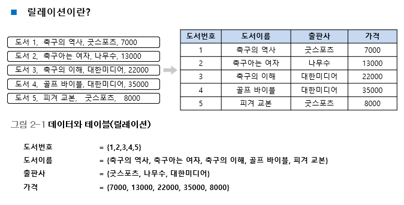

첫 번째 행(1, 축구의 역사, 굿스포츠, 7000)의 경우 네 개의 집합에서 각각 원소 한 개씩 선택하여 만들어진 것으로 이 원소들이 관계를 맺고 있다.

### 관계(relationship)

- 릴레이션 내에서 생성되는 관계 : 릴레이션 내 데이터들의 관계
- 릴레이션 간에 생성되는 관계 : 릴레이션 간의 관계

## 릴레이션 스키마와 인스턴스

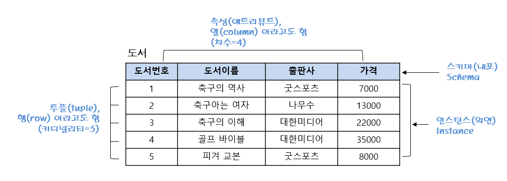

### 스키마의 요소

- 속성(attribute) : 릴레이션 스키마의 열
- 도메인(domain) : 각각의 속성들이 가질 수 있는 값들의 집합
  - 속성이 길이면 속성값으로 사용자가 지정한 cm, m 등만 들어올 수 있다.
  - 속성이 성별이면 속성값으로 남, 여만 올 수 있다.
- 차수(degree) : 속성의 개수

### 스키마의 표현

- 릴레이션 이름(속성1: 도메인1, 속성2: 도메인2, 속성3: 도메인3, ... )
  - ex) 도서(도서 번호, 도서 이름, 출판사, 가격)

### 인스턴스 요소

- 튜플(tuple) : 릴레이션의 행 → 튜플이 가지는 속성의 개수는 릴레이션 스키마의 차수와 동일하고, 릴레이션 내의 모든 튜플들은 서로 중복되지 않아야 한다.
- 카디널리티(cardinality) : 튜플의 수

### 릴레이션 구조와 관련된 용어

| 릴레이션 용어 | 같은 의미로 통용되는 용어 | 파일 시스템 용어 |
| ------------- | ------------------------- | ---------------- |
| 릴레이션      | 테이블                    | 파일             |
| 스키마        | 내포(intension)           | 헤더             |
| 인스턴스      | 외연(extension)           | 데이터           |
| 튜플          | 행                        | 레코드           |
| 속성          | 열                        | 필드             |

## 릴레이션의 특징

- 속성은 단일 값을 가진다.
  - 각 속성의 값은 도메인에 정의된 값만을 가지며 그 값은 모두 단일 값이어야 한다.
- 속성은 서로 다른 이름을 가진다.
  - 속성은 한 릴레이션에서 서로 다른 이름을 가져야만 한다.
- 한 속성의 값은 모두 같은 도메인 값을 가진다.
  - 한 속성에 속한 열은 모두 그 속성에서 정의한 도메인 값만 가질 수 있다.
- 속성의 순서는 상관없다.
  - 속성의 순서가 달라도 릴레이션 스키마는 같다.
  - 예를 들어 릴레이션 스키마에서 (이름, 주소) 순으로 속성을 표시하거나 (주소, 이름) 순으로 표시해도 상관없다.
- 릴레이션 내의 중복된 튜플은 허용되지 않는다.
  - 하나의 릴레이션 인스턴스 내에서는 서로 중복된 값을 가질 수 없다.
  - 즉, 모든 튜플은 서로 값이 달라야 한다.
- 튜플의 순서는 상관없다.
  - 튜플의 순서가 달라도 같은 릴레이션이다.
  - 관계 데이터 모델의 튜플은 실제적인 값을 가지고 있으며 이 값은 시간이 지남에 따라 데이터의 삭제, 수정, 삽입에 따라 순서가 달라질 수 있다.

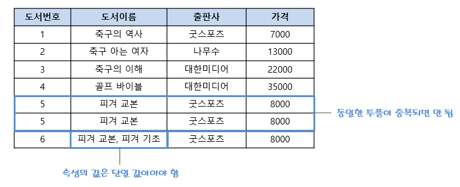

## 키

- 특정 튜플을 식별할 때 사용하는 속성 혹은 속성의 집합
- 릴레이션은 중복된 튜플을 허용하지 않기 때문에 각각의 튜플에 포함된 속성들 중 어느 하나(혹은 하나 이상)는 값이 달라져야 한다.
- 즉, 키가 되는 속성(혹은 속성의 집합)은 반드시 값이 달라서 튜플들을 서로 구별할 수 있어야 한다.
- 키는 릴레이션 간의 관계를 맺는 데에도 사용된다.

### 슈퍼키

- 튜플을 유일하게 식별할 수 있는 하나의 속성 혹은 속성의 집합
- 튜플을 유일하게 식별할 수 있는 값이면 모두 슈퍼키가 될 수 있다.

#### 고객 릴레이션의 예

- **고객 번호** : 고객별로 유일한 값이 부여되어 있기 때문에 튜플을 식별할 수 있음
- 이름 : 동명이인이 있을 경우 튜플을 유일하게 식별할 수 없음
- **주민등록번호** : 개인별로 유일한 값이 부여되어 있기 때문에 튜플을 식별할 수 있음
- 주소 : 가족끼리는 같은 정보를 사용하므로 튜플을 식별할 수 없음
- 핸드폰 : 한 사람이 여러 개의 핸드폰을 사용할 수 있고 반대로 핸드폰을 사용하지 않는 사람이 있을 수 있기 때문에 튜플을 식별할 수 없음

따라서 고객 릴레이션은 고객 번호와 주민등록번호를 포함한 모든 속성의 집합이 슈퍼키가 될 수 있다.

ex) (주민등록번호), (주민등록번호, 이름), (주민등록번호, 이름, 주소), (주민등록번호, 이름, 핸드폰), (고객 번호), (고객 번호, 이름, 주소), (고객 번호, 이름, 주민등록번호, 주소, 핸드폰) 등

### 후보키

- 튜플을 유일하게 식별할 수 있는 속성의 최소 집합
- 따라서 위의 고객 릴레이션을 계속해서 예를 들면 후보키로는 고객 번호 또는 주민등록번호가 될 수 있다.
- 또한 만약 후보키가 2개 이상의 속성으로 이루어진 키를 복합키라고 한다.

### 기본키

- 여러 후보키 중 하나를 선정하여 대표로 삼는 키
- 후보키가 하나뿐이라면 그 후보키를 기본키로 사용하면 되고 여러 개라면 릴레이션의 특성을 반영하여 하나를 선택하면 된다.

#### 기본키 선정 시 고려사항

- 릴레이션 내 튜플을 식별할 수 있는 고유한 값을 가져야 한다.
- NULL 값은 허용하지 않는다.
- 키 값의 변동이 일어나지 않아야 한다.
- 최대한 적은 수의 속성을 가진 것이어야 한다.
- 향후 키를 사용하는 데 있어서 문제 발생 소지가 없어야 한다.

#### 릴레이션 스키마를 표현할 때 기본키는 밑줄을 그어 표시

- 고객(<u>고객 번호</u>, 이름, 주민등록번호, 주소, 핸드폰)
- 도서(<u>도서 번호</u>, 도서 이름, 출판사, 가격)

### 대리키

- 기본키가 보안을 요하거나, 여러 개의 속성으로 구성되어 복잡하거나, 마땅한 기본키가 없을 때는 일련번호 같은 가상의 속성을 만들어 기본키로 삼는 경우가 있다.
- 이러한 키를 대리키 혹은 인조키라고 한다.
- 대리키는 DBMS나 관련 소프트웨어에서 임의로 생성하는 값으로 사용자가 직관적으로 그 값의 의미를 알 수 없다.

### 대체키

- 대체키는 기본키로 선정되지 않은 후보키를 말한다.
- 고객 릴레이션의 경우 고객 번호와 주민등록번호 중 고객 번호를 기본키로 정하면 주민등록번호가 대체키가 된다.

### 외래키

- 다른 릴레이션의 기본키를 참조하는 속성을 말한다.
- 다른 릴레이션의 기본키를 참조하여 관계 데이터 모델의 특징인 릴레이션 간의 관계를 표현할 수 있다.

#### 외래키의 특징

- 관계 데이터 모델의 릴레이션 간의 관계를 표현한다.
- 다른 릴레이션의 기본키를 참조하는 속성이다.
- 참조하고(외래키) 참조되는(기본키) 양쪽 릴레이션의 도메인은 서로 같아야 한다.
- 참조되는(기본키) 값이 변경되면 참조하는(외래키) 값도 변경된다.
- NULL 값과 중복 값 등이 허용된다.
- **자기 자신의 기본키를 참조하는 외래키도 가능하다.**
- 외래키가 기본키의 일부가 될 수 있다.

#### 자기 자신의 기본키를 참조하는 외래키도 가능

- 외래키 사용 시 참조하는 릴레이션과 참조되는 릴레이션이 꼭 다른 릴레이션일 필요는 없다.
- 즉, 자기 자신의 기본키를 참조할 수도 있다.

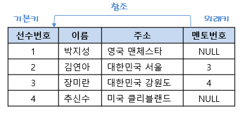

### 키 요약

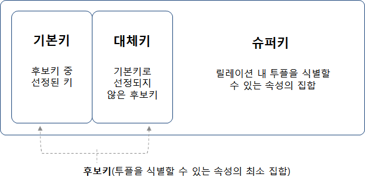

## 무결성 제약조건

데이터의 무결성(integrity)은 데이터베이스에 저장된 데이터의 일관성과 정확성을 지키는 것을 말한다.

### 도메인 무결성 제약조건

- 도메인 제약이라고도 하며, 릴레이션 내의 튜플들이 각 속성의 도메인에 지정된 값만을 가져야 한다는 조건이다.
- SQL문에서 데이터 형식(type), 널(null/not null), 기본값(default), 체크(check) 등을 사용하여 지정할 수 있다.

### 개체 무결성 제약조건

- 기본키 제약이라고도 한다.
- 릴레이션은 기본키를 지정하고 그에 따른 무결성 원칙, 즉 기본키는 NULL 값을 가져서는 안 되며 릴레이션 내에 오직 하나의 값만 존재해야 한다는 조건이다.

### 참조 무결성 제약조건

- 외래키 제약이라고도 한며, 릴레이션 간의 참조 관계를 선언하는 제약조건이다.
- 자식 릴레이션의 외래키는 부모 릴레이션의 기본키와 도메인이 동일해야 하며, 자식 릴레이션의 값이 변경될 때 부모 릴레이션의 제약을 받는다.

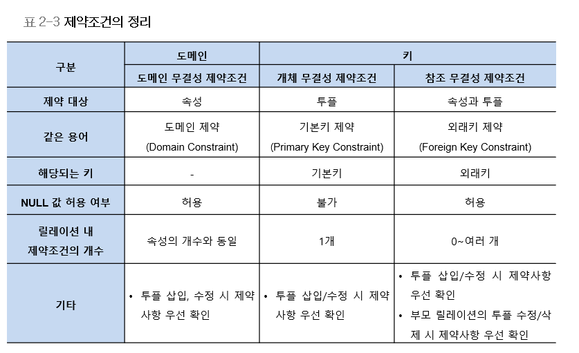

## 무결성 제약조건의 수행

### 개체 무결성 제약조건

- 삽입 : 기본키 값이 같으면 삽입이 금지된다.
- 수정 : 기본키 값이 같거나 NULL로도 수정이 금지된다.
- 삭제 : 특별한 확인이 필요하지 않으며 즉시 수행한다.

### 참조 무결성 제약조건

#### 삽입

- 학과(부모 릴레이션) : 튜플 삽입 후 수행하면 정상적으로 진행된다.
- 학생(자식 릴레이션) : 참조 받는 테이블에 외래키 값이 없으면 삽입이 금지된다.

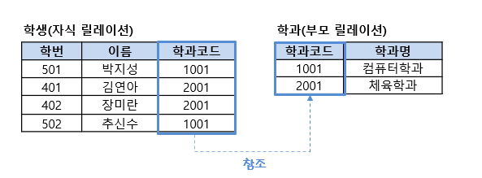

좀 더 자세히 설명하자면 학생 릴레이션에 새로운 튜플을 삽입하려고 했을 때 DBMS는 먼저 도메인 무결성 제약조건을 확인한 후 개체 무결성 제약조건에 위배되는 값이 없는지 확인한다. 그러고 나서 학과코드 값이 학과 릴레이션의 기본키에 존재하는지 확인한다. 학생 릴레이션에 튜플 (601, 박세리, 3001)을 삽입하려고 했을 때 학번 601은 들어갈 수 있지만 학과코드 3001은 들어갈 수 없으므로 수행이 거부된다. 만약 참조하는 학과코드가 NULL 값을 허용했다면 (601, 박세리, NULL) 값을 넣어 수행할 수는 있다.

#### 삭제

- 학과(부모 릴레이션) : 참조하는 테이블을 같이 삭제할 수 있어서 금지하거나 다른 추가 작업이 필요하다.
- 학생(자식 릴레이션) : 바로 삭제 가능하다.

부모 릴레이션에서 튜플을 삭제할 경우 참조 무결성 조건을 수행하기 위한 고려사항

1. 즉시 작업 중지
2. 자식 릴레이션의 관련 튜플 삭제
3. 초기에 설정된 다른 어떤 값으로 변경
4. NULL 값으로 설정

#### 수정

- 삭제와 삽입 명령이 연속해서 수행됨
- 부모 릴레이션의 수정이 일어날 경우 삭제 옵션에 따라 처리된 후 문제가 없으면 다시 삽입 제약조건에 따라 처리된다.

---

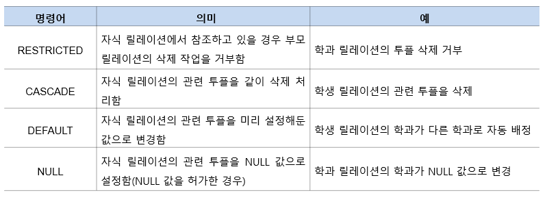

참조 무결성 제약조건의 옵션(부모 릴레이션에서 튜플을 삭제할 경우)

---

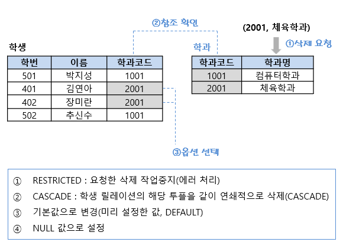

참조 무결성 제약조건에서 부모 릴레이션의 튜플을 삭제할 경우

## ACID

- Atomicity (원자성)
  - 트랜잭션과 관련된 작업들이 부분적으로 실행되다가 중단되지 않는 것을 보장하는 능력
- Consistency (일관성)
  - 트랜잭션이 실행을 성공적으로 완료하면 언제나 일관성 있는 데이터베이스 상태로 유지하는 것
- Isolation (고립성)
  - 트랜잭션 수행 시 다른 트랜잭션의 연산 작업이 끼어들지 못하도록 보장하는 것
- Durability (영구성)
  - 성공적으로 수행된 트랜잭션은 영원히 반영되어야 함

## 실습

`demo_bookstore_init.sql` 예제 파일

```mysql
USE bookstore;

DROP TABLE IF EXISTS Orders;
DROP TABLE IF EXISTS Book;
DROP TABLE IF EXISTS Customer;
DROP TABLE IF EXISTS Imported_Book;

CREATE TABLE Book (
  bookid      INTEGER PRIMARY KEY,
  bookname    VARCHAR(40),
  publisher   VARCHAR(40),
  price       INTEGER 
);

CREATE TABLE  Customer (
  custid      INTEGER PRIMARY KEY,
  name        VARCHAR(40),
  address     VARCHAR(50),
  phone       VARCHAR(20)
);

CREATE TABLE Orders (
  orderid INTEGER PRIMARY KEY,
  custid  INTEGER,
  bookid  INTEGER,
  saleprice INTEGER,
  orderdate DATE,
  FOREIGN KEY (custid) REFERENCES Customer(custid),
  FOREIGN KEY (bookid) REFERENCES Book(bookid)
);

INSERT INTO Book VALUES(1, '축구의 역사', '굿스포츠', 7000);
INSERT INTO Book VALUES(2, '축구아는 여자', '나무수', 13000);
INSERT INTO Book VALUES(3, '축구의 이해', '대한미디어', 22000);
INSERT INTO Book VALUES(4, '골프 바이블', '대한미디어', 35000);
INSERT INTO Book VALUES(5, '피겨 교본', '굿스포츠', 8000);
INSERT INTO Book VALUES(6, '역도 단계별기술', '굿스포츠', 6000);
INSERT INTO Book VALUES(7, '야구의 추억', '이상미디어', 20000);
INSERT INTO Book VALUES(8, '야구를 부탁해', '이상미디어', 13000);
INSERT INTO Book VALUES(9, '올림픽 이야기', '삼성당', 7500);
INSERT INTO Book VALUES(10, 'Olympic Champions', 'Pearson', 13000);

INSERT INTO Customer VALUES (1, '박지성', '영국 맨체스타', '000-5000-0001');
INSERT INTO Customer VALUES (2, '김연아', '대한민국 서울', '000-6000-0001');
INSERT INTO Customer VALUES (3, '장미란', '대한민국 강원도', '000-7000-0001');
INSERT INTO Customer VALUES (4, '추신수', '미국 클리블랜드', '000-8000-0001');
INSERT INTO Customer VALUES (5, '박세리', '대한민국 대전',  NULL);

INSERT INTO Orders VALUES (1, 1, 1, 6000, STR_TO_DATE('2014-07-01','%Y-%m-%d'));
INSERT INTO Orders VALUES (2, 1, 3, 21000, STR_TO_DATE('2014-07-03','%Y-%m-%d'));
INSERT INTO Orders VALUES (3, 2, 5, 8000, STR_TO_DATE('2014-07-03','%Y-%m-%d'));
INSERT INTO Orders VALUES (4, 3, 6, 6000, STR_TO_DATE('2014-07-04','%Y-%m-%d'));
INSERT INTO Orders VALUES (5, 4, 7, 20000, STR_TO_DATE('2014-07-05','%Y-%m-%d'));
INSERT INTO Orders VALUES (6, 1, 2, 12000, STR_TO_DATE('2014-07-07','%Y-%m-%d'));
INSERT INTO Orders VALUES (7, 4, 8, 13000, STR_TO_DATE( '2014-07-07','%Y-%m-%d'));
INSERT INTO Orders VALUES (8, 3, 10, 12000, STR_TO_DATE('2014-07-08','%Y-%m-%d'));
INSERT INTO Orders VALUES (9, 2, 10, 7000, STR_TO_DATE('2014-07-09','%Y-%m-%d'));
INSERT INTO Orders VALUES (10, 3, 8, 13000, STR_TO_DATE('2014-07-10','%Y-%m-%d'));

CREATE TABLE Imported_Book (
  bookid      INTEGER,
  bookname    VARCHAR(40),
  publisher   VARCHAR(40),
  price       INTEGER
);
INSERT INTO Imported_Book VALUES(21, 'Zen Golf', 'Pearson', 12000);
INSERT INTO Imported_Book VALUES(22, 'Soccer Skills', 'Human Kinetics', 15000);
```

책과 고객 사이에 올 수 있는 데이터는 주문이라는 데이터

---

ERD

---

중복된 이름의 테이블은 만들 수 없다.

```mysql
DROP TABLE IF EXISTS Orders;
```

테이블을 삭제하는 명령어. 존재하면 지운다.

존재하지 않으면 CREATE 하면 되는데 존재하면 삭제하고 만들기

테이블 생성 및 데이터 삽입

---

```mysql
SELECT * FROM Book;
```

Book 테이블의 모든 데이터 조회

## SQL 개요

CRUD

생성, 조회, 갱신, 삭제

### SQL 기능에 따른 분류

#### 데이터 정의어 (DDL)

- 테이블이나 관계의 구조를 생성하는 데 사용하며 CREATE, ALTER, DROP 문 등이 있음

#### 데이터 조작어 (DML)

- 테이블에 데이터를 검색, 삽입, 수정, 삭제하는 데 사용하며 SELECT, INSERT, DELETE, UPDATE 문 등이 있음
- 여기서 SELECT 문은 특별히 질의어(query)라고 함

#### 데이터 제어어 (DCL)

- 데이터의 사용 권한을 관리하는 데 사용하며 GRANT, REVOKE 문 등이 있음

## 실습

customer 우클릭 → Select Row - Limit 1000

---

`Ctrl` + `Enter` : 실행

---

```mysql
SELECT name FROM customer;
DESC customer;
SELECT custid, name, address, phone FROM customer;
SELECT name, phone FROM customer;
SELECT name, phone FROM customer WHERE phone='000-7000-0001';
SELECT name, phone FROM customer WHERE phone='000-7000-000';
SELECT custid, name, phone, address FROM customer WHERE name='김연아';
```

where 구문에는 필터링할 column 이름과 가져오고 싶은 값을 준다.

그 사람 데이터만 가져온다.

존재하지 않는 값을 찾으면 없다고 뜬다.

```mysql
SELECT custid, name, phone, address FROM customer WHERE address='대한민국';
```

대한민국으로 끝나는 사람 없다. → 범위 검색을 해야한다.

address에 대한민국이라는 글자가 들어있는 사람 검색

`%대한민국%` → 대한민국 앞 뒤에 어떤 글자가 와도 상관없다.

```mysql
SELECT custid, name, phone, address FROM customer WHERE address LIKE '%대한민국%';
SELECT custid, name, phone, address FROM customer WHERE address LIKE '%대한민국%' and phone IS NOT NULL;
```

전화번호가 있는 사람만 가져오겠다.

```mysql
SELECT custid, name, phone, address FROM customer WHERE address LIKE '%대한민국%' and phone IS NULL;
```

---

```mysql
SELECT * FROM book WHERE price >= 10000;
SELECT * FROM book WHERE price >= 10000 AND price <= 20000;
SELECT * FROM book WHERE price BETWEEN 10000 AND 20000;
```

## 데이터 조작어 - 검색

### SELECT 문

#### SELECT 문의 구성 요소

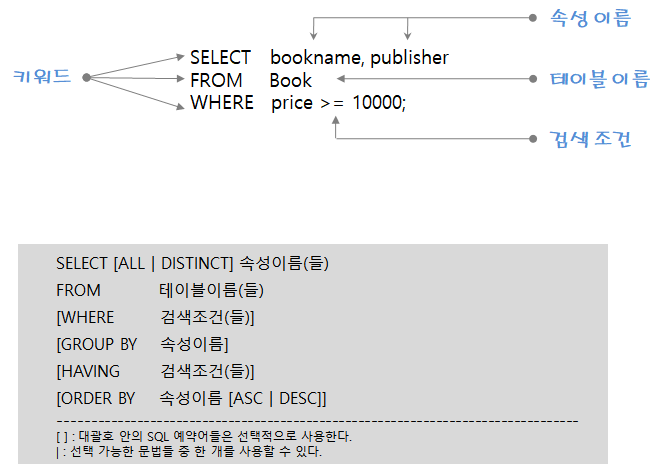

#### SELECT/FROM

```mysql
SELECT publisher
FROM Book;
```

도서 테이블에 있는 모든 출판사 검색

```mysql
SELECT DISTINCT publisher
FROM Book;
```

중복 제거 시 DISTINCT 키워드 사용

#### WHERE 조건

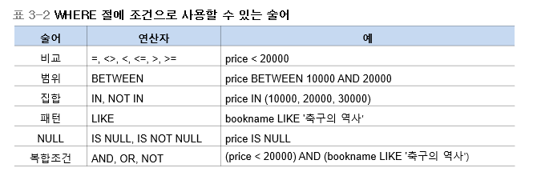

##### 비교

```mysql
SELECT *
FROM Book
WHERE price < 20000;
```

가격이 20,000원 미만인 도서 검색

##### 범위

```mysql
SELECT *
FROM Book
WHERE price BETWEEN 10000 AND 20000;
```

가격이 10,000원 이상 20,000원 이하인 도서 검색

```mysql
SELECT *
FROM Book
WHERE price >= 10000 AND price <= 20000;
```

BETWEEN은 논리 연산자인 AND를 사용할 수 있다.

##### 집합

```mysql
SELECT *
FROM Book
WHERE publisher IN ('굿스포츠','대한미디어');
```

출판사가 '굿스포츠' 혹은 '대한미디어'인 도서 검색

```mysql
SELECT *
FROM Book
WHERE publisher NOT IN ('굿스포츠','대한미디어');
```

출판사가 '굿스포츠' 혹은 '대한미디어'가 아닌 도서 검색

##### 패턴

```mysql
SELECT bookname, publisher
FROM Book
WHERE bookname LIKE '축구의 역사';
```

'축구의 역사'를 출간한 출판사 검색

```mysql
SELECT bookname, publisher
FROM Book
WHERE bookname LIKE '%축구%';
```

도서이름에 '축구'가 포함된 출판사 검색

```mysql
SELECT *
FROM Book
WHERE bookname LIKE '_구%';
```

도서이름의 왼쪽 두 번째 위치에 '구'라는 문자열을 갖는 도서 검색

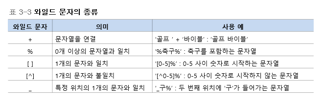

##### 복합조건

```mysql
SELECT *
FROM Book
WHERE bookname LIKE '%축구%' AND price >= 20000;
```

축구에 관한 도서 중 가격이 20,000원 이상인 도서 검색

```mysql
SELECT *
FROM Book
WHERE publisher='굿스포츠' OR publisher='대한미디어';
```

출판사가 '굿스포츠' 혹은 '대한미디어'인 도서 검색

#### ORDER BY

```mysql
SELECT * FROM Book ORDER BY bookname;
```

도서를 이름순으로 검색

```mysql
SELECT *
FROM Book
ORDER BY price, bookname;
```

도서를 가격순으로 검색하고, 가격이 같으면 이름순으로 검색

```mysql
SELECT *
FROM Book
ORDER BY price DESC, publisher ASC;
```

도서를 가격의 내림차순으로 검색. 만약 가격이 같다면 출판사의 오름차순으로 검색

### 집계 함수와 GROUP BY

#### 집계함수

```mysql
SELECT SUM(saleprice)
FROM Orders;
```

고객이 주문한 도서의 총 판매액

```mysql
SELECT SUM(saleprice) AS 총매출
FROM Orders;
```

의미 있는 열 이름을 출력하고 싶으면 속성이름의 별칭을 지칭하는 AS 키워드를 사용하여 열 이름을 부여

```mysql
SELECT SUM(saleprice) AS 총매출
FROM Orders
WHERE custid=2;
```

2번 고객이 주문한 도서의 총 판매액

```mysql
SELECT SUM(saleprice) AS Total,
       AVG(saleprice) AS Average,
       MIN(saleprice) AS Minimum,
       MAX(saleprice) AS Maximum
FROM Orders;
```

고객이 주문한 도서의 총 판매액, 평균값, 최저가, 최고가

```mysql
SELECT COUNT(*)
FROM Orders;
```

도서 판매 건수

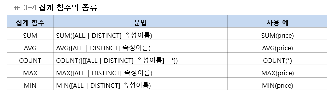

#### GROUP BY

```mysql
SELECT custid, COUNT(*) AS 도서수량, SUM(saleprice) AS 총액
FROM Orders
GROUP BY custid;
```

고객별 주문 도서의 총 수량과 총 판매액

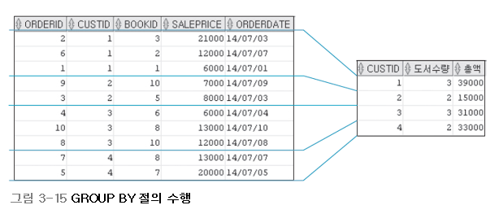

```mysql
SELECT custid, COUNT(*) AS 도서수량
FROM Orders
WHERE saleprice >= 8000
GROUP BY custid
HAVING COUNT(*) >= 2;
```

가격이 8,000원 이상인 도서를 구매한 고객에 대하여 고객별 주문 도서의 총 수량 구하기 (단, 두 권 이상 구매한 고객만)

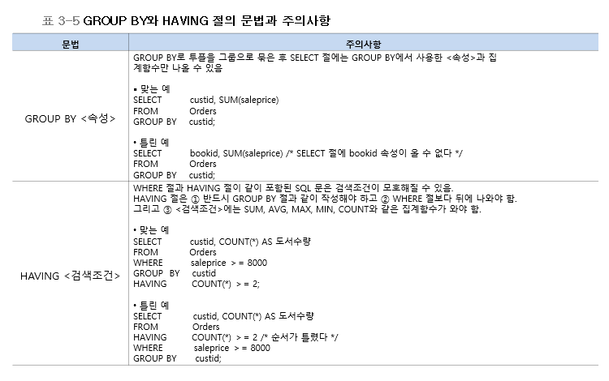

## 실습

```mysql
SELECT publisher FROM book;
SELECT DISTINCT publisher FROM book;
```

DISTINCT : 중복된 값 제거

---

```mysql
SELECT publisher, COUNT(publisher) AS '합계'
FROM book
GROUP BY publisher;
```

COUNT 함수는 숫자를 세주는 것이다.

중복 데이터를 제거하고 그룹화되어있는 정보만 표시되는데 몇 개가 있는지 알기 위해 COUNT 사용

표시 방식을 별칭으로 바꾸기 위해 AS 키워드 사용

---

```mysql
SELECT *
FROM book
ORDER BY bookname ASC;
```

ASC는 오름차순

a가 먼저 나오고 z가 나중에 나온다.

---

```mysql
SELECT * FROM book ORDER BY publisher DESC;
SELECT * FROM book ORDER BY publisher;
```

default는 오름차순(ASC)이다.

---

```mysql
SELECT * FROM book ORDER BY publisher ASC, price DESC;
```

---

```mysql
SELECT SUM(saleprice) AS '주문합계' FROM orders;
```

SUM은 전체 합계를 구하는 함수

---

```mysql
SELECT custid, COUNT(saleprice), SUM(saleprice)
FROM orders
GROUP BY custid;
```

사용자별로 집계를 낼 수 있다.

---

```mysql
SELECT bookid, COUNT(saleprice), SUM(saleprice)
FROM orders
GROUP BY bookid;
```

bookid 별 총 수량과 총 금액

---

orders 우클릭 → Send to SQL Editor → Create Statement

```mysql
CREATE TABLE `orders` (
  `orderid` int(11) NOT NULL,
  `custid` int(11) DEFAULT NULL,
  `bookid` int(11) DEFAULT NULL,
  `saleprice` int(11) DEFAULT NULL,
  `orderdate` date DEFAULT NULL,
  PRIMARY KEY (`orderid`),
  KEY `custid` (`custid`),
  KEY `bookid` (`bookid`),
  CONSTRAINT `orders_ibfk_1` FOREIGN KEY (`custid`) REFERENCES `customer` (`custid`),
  CONSTRAINT `orders_ibfk_2` FOREIGN KEY (`bookid`) REFERENCES `book` (`bookid`)
) ENGINE=InnoDB DEFAULT CHARSET=utf8mb4 COLLATE=utf8mb4_0900_ai_ci;
```

어떻게 데이터베이스 테이블이 만들어졌는지 확인할 수 있다.

---

```mysql
SELECT custid, COUNT(*) AS 도서수량
FROM orders
WHERE saleprice >= 8000
GROUP BY custid
HAVING COUNT(*) >= 2;
```

HAVING은 GROUP BY에 대한 조건이다.

---

```mysql
CREATE DATABASE hr;
```

`demo_hr.sql` 파일 Open & Execute

```mysql
SELECT concat(first_name, ' ', last_name) AS 'Name'
FROM employees;
```

### [1]

사원정보(EMPLOYEE) 테이블에서 사원번호, 이름, 급여, 업무, 입사일, 상사의 사원번호를 출력하시오. 이때 이름은 성과 이름을 연결하여 Name이라는 별칭으로 출력하시오.

```mysql
SELECT employee_id,
       concat(first_name, ' ', last_name) AS 'Name',
       salary,
       job_id,
       hire_date,
       manager_id
FROM employees;
```

### [2]

HR 부서에서 예산 편성 문제로 급여 정보 보고서를 작성하려고 한다. 사원정보(EMPLOYEES) 테이블에서 급여가 $7,000~$10,000 범위 이외인 사람의 성과 이름(Name으로 별칭) 및 급여를 급여가 작은 순서로 출력하시오.

```mysql
SELECT concat(first_name, ' ', last_name) AS 'Name',
       salary
FROM employees
WHERE salary NOT BETWEEN 7000 AND 10000
ORDER BY salary ASC;
```

### [3]

사원의 이름(last_name) 중에 'e' 및 'o' 글자가 포함된 사원을 출력하시오. 이때 머리글은 'e and o Name'라고 출력하시오.

```mysql
SELECT last_name AS 'e and o Name'
FROM employees
WHERE last_name LIKE '%e%'
AND last_name LIKE '%o%';
```

### [4]

HR 부서에서는 급여(salary)와 수당율(commission_pct)에 대한 지출 보고서를 작성하려고 한다. 이에 수당을 받는 모든 사원의 성과 이름(Name으로 별칭), 급여, 업무, 수당율을 출력하시오. 이때 급여가 큰 순서대로 정렬하되, 급여가 같으면 수당율이 큰 순서대로 정렬하시오.

```mysql
SELECT concat(first_name, ' ', last_name) AS 'Name',
       salary,
       job_id,
       commission_pct
FROM employees
WHERE salary IS NOT NULL
ORDER BY salary DESC, commission_pct DESC;
```

### [5]

사원들의 업무별 전체 급여 평균이 $10,000보다 큰 경우를 조회하여 업무, 급여 평균을 출력하시오. 단 업무에 사원(CLERK)이 포함된 경우는 제외하고 전체 급여 평균이 높은 순서대로 출력하시오.

```mysql
SELECT job_id,
       AVG(salary) AS 'Avg Salary'
FROM employees
WHERE job_id NOT LIKE '%CLERK%'
GROUP BY job_id HAVING AVG(salary) >= 10000
ORDER BY AVG(salary) DESC;
```

