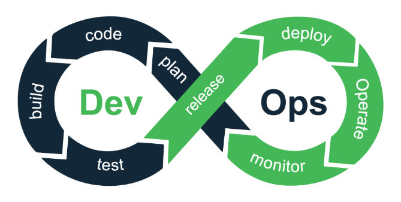

# Database_3

Git : 형상 관리 툴

DevOps 도구

## DevOps



plan → code → build → test → release → deploy → operate → monitor → plan 무한 사이클

---

- 무결성 데이터 3가지
  - 도메인
  - 개체
  - 참조

### PLAN

- 도메인 : 범위
- 도메인 무결성 : 범위가 확실해야 한다. 그 범위 내에 있는 것만 선택 (성별 선택 시 남자와 여자만. 나머지 데이터는 필요 없다.)

### CODE

- IDE : 통합 개발 환경
  - 코드도 입력할 수 있고 컴파일, 테스트, 디버깅 가능
- 각 파트별로 나눠서 개발하고 각자 맡은 것을 통합해야 한다.
- 개발할 때 서로 협업을 하기 위해서 필요한 도구
  - 형상 관리 : CVS, SVN, Perforce, Git
  - Bitbucket, GitHub, GitLab, ...
  - JIRA, Confluence, ...

### BUILD

- sbt, Maven, ...

### TEST

- 가장 중요한 작업임에도 불구하고 기업들이 투자를 많이 못 한다.
- JUnit

### RELEASE

- Jenkins, CodeShip, ...

### DEPLOY

- Docker, AWS, DC/OS, ...

### OPERATE

- 운영
- 마이크로 단위로 서비스를 쪼갠다.
- Chef, Ansible, Kubernetes→ 프로비저닝 도구

### MONITOR

- Nagios, Splunk, Datadog, ...

## GitHub

Repository → New → Owner 선택, Repository name 입력, private/public 선택

---

Code 버튼을 누르면 URL을 확인할 수 있다. 동기화 할 때 사용하는 주소. 다른 사람에게 그 주소를 주면 다른 사람도 볼 수 있다. (private가 아니면)

---

GitHub에 만든 저장소를 로컬에 최초로 가져올 때 clone을 해주게 된다.

add로 올리고자 하는 파일 추가. 마킹하는 작업

commit을 이용해 로컬 저장소에 등록

---

```bash
git clone <url>
git add .
git remote -v
git config --global user.name "John Doe"
git config --global user.email "johndoe@example.com"
git commit -m "commit message"
git push
```

