# Database_4

### 두 개 이상 테이블에서 SQL 질의

#### 조인

2개의 테이블 합체

---

Customer 테이블을 Orders 테이블과 조건 없이 연결해보자.

```mysql
SELECT *
FROM Customer, Orders;
```

Customer와 Orders 테이블의 합체 결과 튜플의 개수는 고객이 다섯 명이고 주문이 열 개이므로 5 × 10 해서 50이 된다.

---

```mysql
SELECT *
FROM Customer, Orders
WHERE Customer.custid = Orders.custid;
```

고객과 고객의 주문에 관한 데이터

---

```mysql
SELECT *
FROM Customer, Orders
WHERE Customer.custid = Orders.custid
ORDER BY Customer.custid;
```

고객과 고객의 주문에 관한 데이터를 고객번호 순으로 정렬

---

```mysql
SELECT name, saleprice
FROM Customer, Orders
WHERE Customer.custid = Orders.custid;
```

고객의 이름과 고객이 주문한 도서의 판매가격 검색

---

```mysql
SELECT name, SUM(saleprice)
FROM Customer, Orders
WHERE Customer.custid = Orders.custid
GROUP BY Customer.name
ORDER BY Customer.name;
```

고객별로 주문한 모든 도서의 총 판매액을 구하고, 고객별로 정렬

---

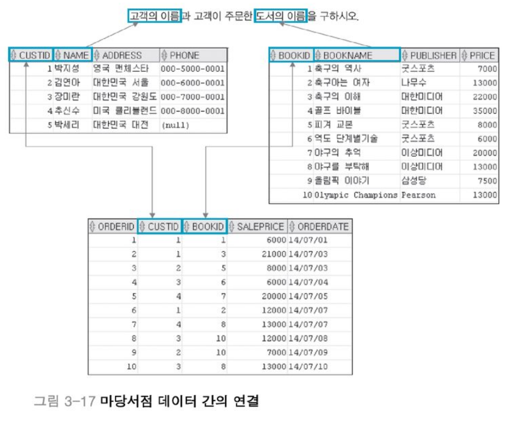

---

```mysql
SELECT Customer.name, Book.bookname
FROM Customer, Orders, Book
WHERE Customer.custid = Orders.custid
      AND Orders.bookid = Book.bookid;
```

고객의 이름과 고객이 주문한 도서의 이름

---

```mysql
SELECT Customer.name, Book.bookname
FROM Customer, Orders, Book
WHERE Customer.custid = Orders.custid AND Orders.bookid = Book.bookid
      AND Book.price = 20000;
```

가격이 20,000원인 도서를 주문한 고객의 이름과 도서의 이름

##### 외부조인

```mysql
SELECT Customer.name, saleprice
FROM Customer LEFT OUTER JOIN
     Orders ON Customer.custid = Orders.custid;
```

도서를 구매하지 않은 고객을 포함하여 고객의 이름과 고객이 주문한 도서의 판매가격 구하기

---

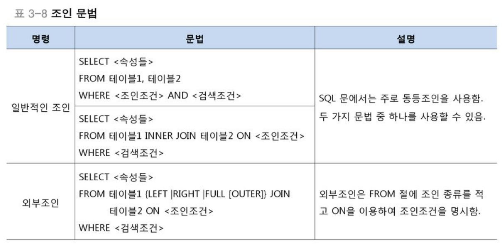

#### 부속질의

SQL 문 내에 또 다른 SQL 문 작성

---

```mysql
SELECT bookname
FROM Book
WHERE price = (SELECT MAX(price)
               FROM Book);
```

가장 비싼 도서의 이름

---

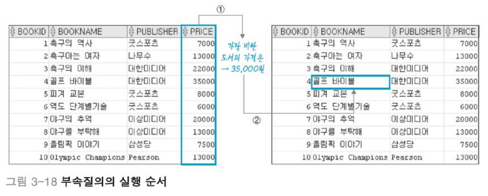

---

```mysql
SELECT name
FROM Customer
WHERE custid IN (SELECT custid
                 FROM Orders);
```

도서를 구매한 적이 있는 고객의 이름 검색

---

```mysql
SELECT name
FROM Customer
WHERE custid IN (SELECT custid
                 FROM Orders
                 WHERE bookid IN (SELECT bookid
                                  FROM Book
                                  WHERE publisher='대한미디어'));
```

대한미디어에서 출판한 도서를 구매한 고객의 이름

---

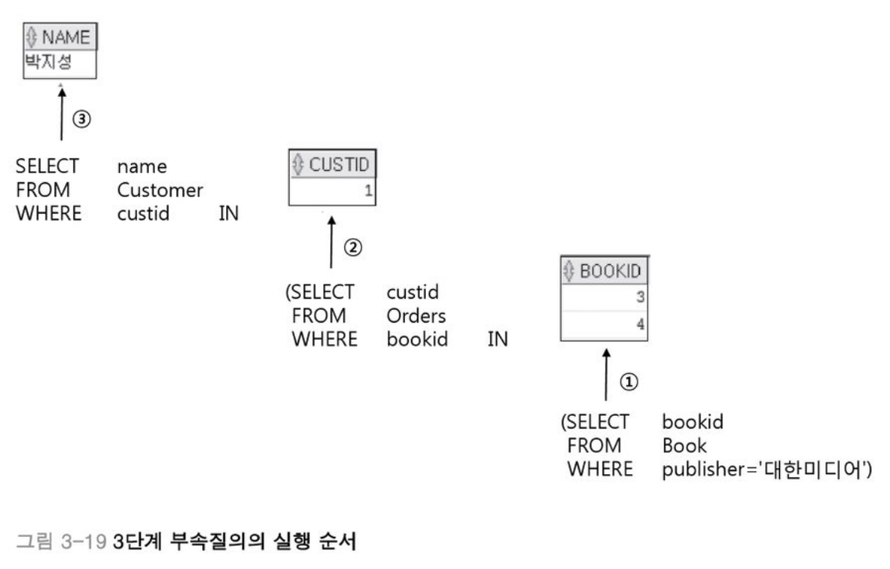

---

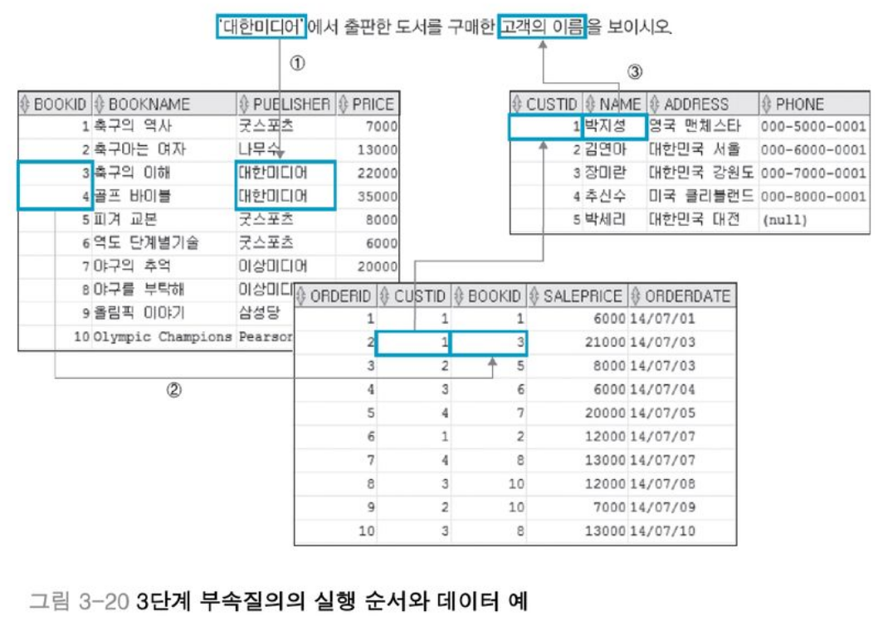

---

##### 상관 부속질의

상관 부속질의(correlated subquery)는 상위 부속질의의 튜플을 이용하여 하위 부속질의를 계산함.

즉, 상위 부속질의와 하위 부속질의가 독립적이지 않고 서로 관련을 맺고 있음

```mysql
SELECT b1.bookname
FROM Book b1
WHERE b1.price > (SELECT AVG(b2.price)
                  FROM Book b2
                  WHERE b2.publisher=b1.publisher);
```

출판사별로 출판사의 평균 도서 가격보다 비싼 도서 구하기

---

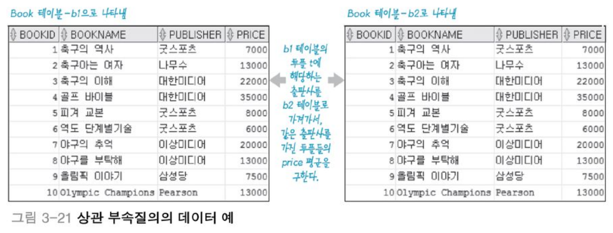

#### 집합연산

##### 합집합 UNION, 차집합 MINUS, 교집합 INTERSECT

{도서를 주문하지 않은 고객} = {모든 고객} - {도서를 주문한 고객}

---

```sql
SELECT name
FROM Customer
MINUS
SELECT name
FROM Customer
WHERE custid IN (SELECT custid
                 FROM Orders);
```

도서를 주문하지 않은 고객의 이름

---

Oracle은 차집합을 MINUS로 하지만 SQL 표준에서는 EXCEPT를 사용한다.

---

MySQL에서는 MINUS와 INTERSECT를 지원하지 않는다.

---

차집합

```mysql
SELECT name
FROM Customer LEFT JOIN Orders
ON Customer.custid=Orders.custid
WHERE Orders.custid IS NULL;
```

#### EXISTS

EXISTS는 원래 단어에서 의미하는 것과 같이 조건에 맞는 튜플이 존재하면 결과에 포함시킴

즉, 부속질의문의 어떤 행이 조건에 만족하면 참임

반면 NOT EXISTS는 부속질의문의 모든 행이 조건에 만족하지 않을 때만 참임

---

```mysql
SELECT name, address
FROM Customer cs
WHERE EXISTS (SELECT * 
              FROM Orders od
              WHERE cs.custid=od.custid);
```

주문이 있는 고객의 이름과 주소

---

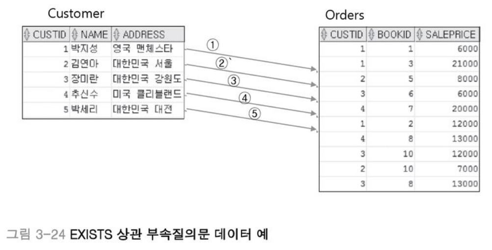

## 데이터 정의어

### CREATE 문

- 테이블을 구성하고, 속성과 속성에 관한 제약을 정의하며, 기본키 및 외래키를 정의하는 명령
- PRIMARY KEY는 기본키를 정할 때 사용하고 FOREIGN KEY는 외래키를 지정할 때 사용하며, ON UPDATE와 ON DELETE는 외래키 속성의 수정과 튜플 삭제 시 동작을 나타냄

#### CREATE 문의 기본 문법

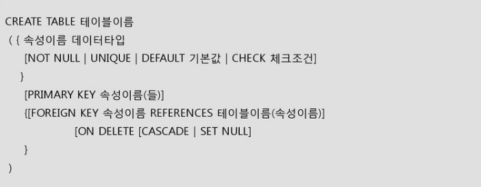

---

다음과 같은 속성을 가진 NewBook 테이블을 생성하시오. 정수형은 NUMBER를, 문자형은 가변형 문자타입인 VARCHAR2를 사용한다.

- bookid(도서번호) - NUMBER
- bookname(도서이름) - VARCHAR2(20)
- publisher(출판사) - VARCHAR2(20)
- price(가격) - NUMBER

```sql
CREATE TABLE NewBook (
    bookid NUMBER,
    bookname VARCHAR2(20),
    publisher VARCHAR2(20),
    price NUMBER);
```

기본키를 지정하고 싶다면 다음과 같이 생성한다.

```sql
CREATE TABLE NewBook (
    bookid NUMBER,
    bookname VARCHAR2(20),
    publisher VARCHAR2(20),
    price NUMBER,
    PRIMARY KEY (bookid));
```

=

```sql
CREATE TABLE NewBook (
    bookid NUMBER PRIMARY KEY,
    bookname VARCHAR2(20),
    publisher VARCHAR2(20),
    price NUMBER);
```

---

bookid 속성이 없어서 두 개의 속성 bookname, publisher가 기본키가 된다면 괄호를 사용하여 복합키를 지정한다.

```sql
CREATE TABLE NewBook (
    bookname VARCHAR2(20),
    publisher VARCHAR2(20),
    price NUMBER,
    PRIMARY KEY (bookname, publisher));
```

---

bookname은 NULL 값을 가질 수 없고, publisher는 같은 값이 있으면 안 된다.

price에 값이 입력되지 않을 경우 기본 값 10000을 저장한다. 또 가격은 최소 1,000원 이상으로 한다.

---

NewBook 테이블의 CREATE 문에 좀 더 복잡한 제약사항을 추가한다.

```sql
CREATE TABLE NewBook (
    bookname VARCHAR2(20) NOT NULL,
    publisher VARCHAR2(20) UNIQUE,
    price NUMBER DEFAULT 10000 CHECK(price > 1000),
    PRIMARY KEY (bookname, publisher));
```

---

다음과 같은 속성을 가진 NewCustomer 테이블을 생성하시오.

- custid(고객번호) - NUMBER, 기본키
- name(이름) - VARCHAR2(40)
- address(주소) - VARCHAR2(40)
- phone(전화번호) - VARCHAR2(30)

```sql
CREATE TABLE NewCustomer (
    custid NUMBER PRIMARY KEY,
    name VARCHAR2(40),
    address VARCHAR2(40),
    phone VARCHAR2(30));
```

---

다음과 같은 속성을 가진 NewOrders 테이블을 생성하시오.

- orderid(주문번호) - NUMBER, 기본키
- custid(고객번호) - NUMBER, NOT NULL 제약조건, 외래키(NewCustomer.custid, 연쇄삭제)
- bookid(도서번호) - NUMBER, NOT NULL 제약조건
- saleprice(판매가격) - NUMBER
- orderdate(판매일자) - DATE

```sql
CREATE TABLE NewOrders (
    orderid NUMBER,
    custid NUMBER NOT NULL,
    bookid NUMBER NOT NULL,
    saleprice NUMBER,
    orderdate DATE,
    PRIMARY KEY (orderid),
    FOREIGN KEY (custid) REFERENCES NewCustomer(custid) ON DELETE CASCADE);
```

---

외래키 제약조건을 명시할 때는 반드시 참조되는 테이블(부모 릴레이션)이 존재해야 하며 참조되는 테이블의 기본키여야 함.

외래키 지정 시 ON DELETE 또는 ON UPDATE 옵션은 참조되는 테이블의 튜플의 삭제되거나 수정될 때 취할 수 있는 동작을 지정함.

NO ACTION은 어떠한 동작도 취하지 않음.

---

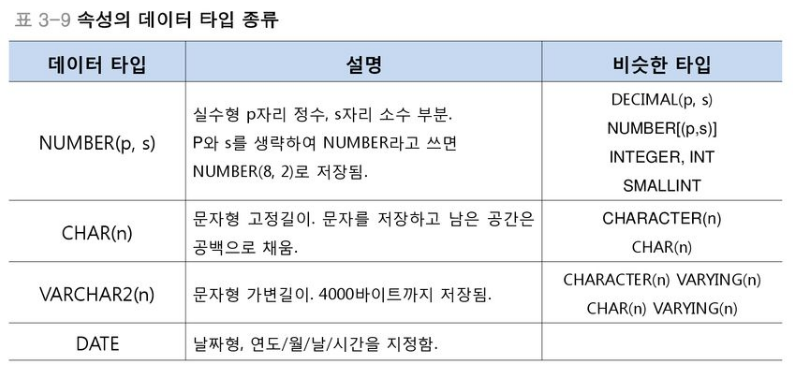

### ALTER 문

- ALTER 문은 생성된 테이블의 속성과 속성에 관한 제약을 변경하며, 기본키 및 외래키를 변경함
- ADD, DROP은 속성을 추가하거나 제거할 때 사용함
- MODIFY는 속성의 기본값을 설정하거나 삭제할 때 사용함
- 그리고 AND <제약이름>, DROP <제약이름>은 제약사항을 추가하거나 삭제할 때 사용함

#### ALTER 문의 기본 문법

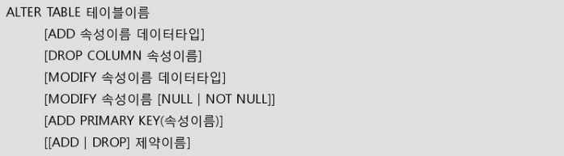

---

```sql
ALTER TABLE NewBook ADD isbn VARCHAR2(13);
```

NewBook 테이블에 VARCHAR2(13)의 자료형을 가진 isbn 속성 추가

---

```sql
ALTER TABLE NewBook MODIFY isbn NUMBER;
```

NewBook 테이블의 isbn 속성의 데이터 타입을 NUMBER 형으로 변경

---

```sql
ALTER TABLE NewBook DROP COLUMN isbn;
```

NewBook 테이블의 isbn 속성 삭제

---

```sql
ALTER TABLE NewBook MODIFY bookid NUMBER NOT NULL;
```

NewBook 테이블의 bookid 속성에 NOT NULL 제약조건 적용

---

```sql
ALTER TABLE NewBook ADD PRIMARY KEY(bookid);
```

NewBook 테이블의 bookid 속성을 기본키로 변경

### DROP 문

- DROP 문은 테이블을 삭제하는 명령
- DROP 문은 테이블의 구조와 데이터를 모두 삭제하므로 사용에 주의해야 함(데이터만 삭제하려면 DELETE 문을 사용함)

#### DROP 문의 기본 문법

```sql
DROP TABLE 테이블이름
```

---

```sql
DROP TABLE NewBook;
```

NewBook 테이블 삭제

---

```sql
DROP TABLE NewCustomer;
```

NewCustomer 테이블 삭제. 만약 삭제가 거절된다면 원인을 파악하고 관련된 테이블을 같이 삭제(NewOrders 테이블이 NewCustomer를 참조하고 있음)

## 데이터 조작어 - 삽입, 수정, 삭제

### INSERT 문

- INSERT 문은 테이블에 새로운 튜플을 삽입하는 명령

#### INSERT 문의 기본 문법

```sql
INSERT INTO 테이블이름[(속성리스트)]
       VALUES (값리스트);
```

---

```sql
INSERT INTO Book(bookid, bookname, publisher, price)
VALUES (11, '스포츠 의학', '한솔의학서적', 90000);
```

Book 테이블에 새로운 도서 '스포츠 의학' 삽입. 스포츠 의학은 한솔의학서적에서 출간. 가격은 90,000원

---

```sql
INSERT INTO Book(bookid, bookname, publisher)
VALUES (14, '스포츠 의학', '한솔의학서적');
```

Book 테이블에 새로운 도서 '스포츠 의학'을 삽입. 스포츠 의학은 한솔의학서적에서 출간. 가격은 미정

#### 대량 삽입

- 대량 삽입(bulk insert)이란 한꺼번에 여러 개의 튜플을 삽입하는 방법

```sql
INSERT INTO Book(bookid, bookname, price, publisher)
SELECT bookid, bookname, price, publisher
FROM Imported_book;
```

수입도서 목록(Imported_book)을 Book 테이블에 모두 삽입(Imported_book 테이블은 스크립트 Book 테이블과 같이 이미 만들어져 있음)

### UPDATE 문

- UPDATE 문은 특정 속성 값을 수정하는 명령

#### UPDATE 문의 기본 문법


---

```sql
UPDATE Customer
SET address='대한민국 부산'
WHERE custid=5;
```

Customer 테이블에서 고객번호가 5인 고객의 주소를 '대한민국 부산'으로 변경

---

```sql
UPDATE Customer
SET address = (SELECT address
               FROM Customer
               WHERE name='김연아')
WHERE name LIKE '박세리';
```

Customer 테이블에서 박세리 고객의 주소를 김연아 고객의 주소로 변경

### DELETE 문

- DELETE 문은 테이블에 있는 기존 튜플을 삭제하는 명령

#### DELETE 문의 기본 문법

```sql
DELETE FROM 테이블이름
[WHERE 검색조건];
```

---

```sql
DELETE FROM Customer
WHERE custid=5;
```

Customer 테이블에서 고객번호가 5인 고객 삭제

---

```sql
DELETE FROM Customer;
```

모든 고객 삭제

## 실습

### 두 개 이상의 테이블에서 SQL 질의

#### 조인

```mysql
SELECT * FROM customer;
SELECT * FROM orders;
SELECT * FROM customer, orders;
```

5 × 10 → 50개의 데이터가 나온다.

자기 것만 가져와야 한다. → where 조건절에 명시해주기

```mysql
SELECT * FROM customer, orders WHERE customer.custid=orders.custid;
```

50권의 데이터가 나오는 것이 아니라 10권의 데이터만 나온다.

customer 데이터도 가져오고 orders 데이터도 가져온다.

```sql
SELECT custid, name, orderid, bookid
FROM customer, orders
WHERE customer.custid=orders.custid;
```

custid가 애매하다. 가지고 오고자 하는 위치를 적어줘야 한다.

```mysql
SELECT customer.custid, name, orderid, bookid
FROM customer, orders
WHERE customer.custid=orders.custid;
```

혼합해서 가져올 때는(join을 사용할 경우) 조건을 사용해야 한다.

where에 필요한 조건을 명시한다.

두 번째 방법은 join을 쓴다. → on 이라는 키워드에 조건을 써준다.

```mysql
SELECT customer.custid, name, orderid, bookid
FROM customer JOIN orders
ON customer.custid=orders.custid;
```

---

```mysql
SELECT customer.custid, name, orderid, bookid
FROM customer JOIN orders
ON customer.custid=orders.custid
WHERE saleprice > 10000;
```

saleprice가 10000 이상인 것만 가져온다.

```mysql
SELECT customer.custid, name, orderid, bookname
FROM customer JOIN orders
ON customer.custid=orders.custid
JOIN book ON orders.bookid=book.bookid
WHERE saleprice > 10000;
```

book에 있는 정보도 같이 가져왔다.

---

- 무결성 데이터
  - 도메인 무결성 : 값을 입력할 때 정해진 범위 내에서 입력
  - 개체 무결성
  - 참조 무결성

---

```mysql
SELECT c.custid, name, orderid, bookname
FROM customer AS c JOIN orders AS o
ON c.custid=o.custid
JOIN book AS b ON o.bookid=b.bookid
WHERE saleprice > 10000;
```

---

```mysql
SELECT c.custid, name, orderid, bookname
FROM customer AS c JOIN orders AS o
ON c.custid=o.custid
JOIN book AS b ON o.bookid=b.bookid
WHERE b.price = 20000;
```

---

같은 것만 가져올 때 inner join

left outer join, right outer join

---

```mysql
SELECT customer.name, saleprice
FROM customer LEFT OUTER JOIN orders
ON customer.custid=orders.custid;
```

책과 주문 테이블을 outer join으로 연결

주문되지 않은 책 정보도 표시

---

```mysql
SELECT customer.name, SUM(orders.saleprice)
FROM customer LEFT OUTER JOIN orders
ON customer.custid=orders.custid
GROUP BY customer.name;
```

---

```mysql
SELECT b.bookname, SUM(o.saleprice), COUNT(o.saleprice)
FROM book AS b LEFT OUTER JOIN orders AS o
ON b.bookid=o.bookid
GROUP BY b.bookname;
```

#### 부속질의

부속질의 : SQL 문 내에 또 다른 SQL 문이 있는 것

---

```mysql
SELECT COUNT(DISTINCT custid)
FROM orders;
```

총 사용자의 수 출력

---

포함된 것은 in, 아니면 not in 사용

많이 쓰면 성능에 좋지 않다.

---

#### 집합연산

합집합 UNION, 차집합 MINUS, 교집합 INTERSECT

---

```mysql
SELECT name
FROM customer
WHERE address like '대한민국%'
UNION
SELECT name
FROM customer
WHERE custid in (SELECT custid
                 FROM orders);
```

union을 사용하지 않으면 섞여서 나올 수 있다.

union을 사용하면 대한민국을 먼저 출력한다.

순서와 데이터 타입이 일치해야 사용 가능하다.

여러 개의 테이블을 복합적으로 표시할 수 있지만 조건을 만족해야 한다.

### CREATE 문

- 테이블 구성, 속성과 속성에 관한 제약 정의, 기본키 및 외래키를 정의하는 명령
- PRIMARY KEY : 기본키를 지정할 때 사용
- FOREIGN KEY : 외래키를 지정할 때 사용
- ON UPDATE와 ON DELETE : 외래키 속성의 튜플 삭제 시 동작을 나타냄

---

속성명과 데이터 타입 나열하기

#### CREATE 문의 기본 문법

```sql
CREATE TABLE 테이블이름
({속성이름 데이터타입
  [NOT NULL|UNIQUE|DEFAULT 기본값|CHECK 체크조건]
 }
  [PRIMARY KEY 속성이름(들)]
 {[FOREIGN KEY 속성이름 REFERENCES 테이블이름(속성이름)]
  [ON DELETE [CASCADE|SET NULL]]
 }
)
```

---

가변 데이터 : 데이터를 5개만 쓰면 5만큼만 차지

- CHAR(n)
  - 고정 길이 문자형 데이터 타입(최대 255byte)
  - 지정된 길이보다 짧은 데이터 입력 시 나머지 공간은 공백으로 채워진다.
- VARCHAR(n)
  - 가변 길이 문자형 데이터 타입(최대 65535byte)
  - 지정된 길이보다 짧은 데이터 입력 시 나머지 공간은 채우지 않는다.

---

```mysql
CREATE TABLE NewBook (
    bookid INT,
    bookname VARCHAR(20),
    publisher VARCHAR(20),
    price INT,
    PRIMARY KEY (bookid));
```

=

```mysql
CREATE TABLE NewBook (
    bookid INT PRIMARY KEY,
    bookname VARCHAR(20),
    publisher VARCHAR(20),
    price INT);
```

기본키 지정 방법

---

어떤 테이블이든 기본키가 있다.

일반키를 나열하고 마지막에 기본키를 지정하거나 중간에 지정하는 방법이 있다.

값은 중복해서 오면 안 된다. 유니크해야 한다. 도서 번호 유일하게 구별

---

필수로 초기값을 넣어주고자 할 때 default 키워드 사용

---

NULL 값이 오면 안 되는 경우 NOT NULL 설정

---

```mysql
CREATE TABLE NewCustomer (
    custid INT PRIMARY KEY,
    name VARCHAR(30),
    address VARCHAR(50),
    phone VARCHAR(15));
```

---

```mysql
CREATE TABLE NewOrders (
    orderid INT,
    custid INT NOT NULL,
    bookid INT NOT NULL,
    saleprice INT,
    orderdate DATETIME,
    PRIMARY KEY (orderid),
    FOREIGN KEY (custid) REFERENCES NewCustomer(custid) ON DELETE CASCADE);
```

### ALTER문

- 생성된 테이블의 속성과 속성에 관한 제약 변경
- 기본키 및 외래키 변경

### DROP 문

- 테이블을 삭제하는 명령
- 테이블 자체를 아예 지운다.

---

TRUNCATE 명령어는 테이블의 데이터를 전부 삭제하는 명령어이다. 테이블은 남겨둔다.

---

```mysql
INSERT INTO NewCustomer(custid, name, address, phone)
VALUES (1, 'user', 'seoul', '01012345678');
SELECT * FROM NewCustomer;
```

---

```mysql
TRUNCATE TABLE NewOrders;
SELECT * FROM NewOrders;
```

---

```mysql
DROP TABLE NewOrders;
SELECT * FROM NewOrders;
```

### [6]

각 이름이 's'로 끝나는 사원들의 이름과 업무를 아래의 예와 같이 출력하고자 한다. 출력 시 성과 이름은 첫 글자가 대문자, 업무는 모두 대문자(UPPER함수 사용)로 출력하고 머리글은 Employee JOBs로 표시하시오.

예) Sigal Tobias is a PU_CLERK

---

#### SUBSTR

```mysql
SUBSTR(문자열, 시작지점, 길이)
```

문자열을 시작지점부터 길이만큼 추출

길이 미입력 시 끝까지 추출

맨 마지막 문자를 -1로 기준을 잡고 거꾸로 문자의 위치를 셀 수 있다.

-1은 뒤에서 첫 번째, -2는 뒤에서 두 번째, ...

#### UPPER

모든 글자를 대문자로

#### LOWER

모든 글자를 소문자로

---

SUBSTR과 UPPER를 이용하면 첫 글자만 대문자로 변환할 수 있다.

---

```mysql
SELECT CONCAT(first_name, ' ', last_name, ' is a ', UPPER(job_id)) AS "Employee JOBs"
FROM employees
-- WHERE last_name LIKE '%s';
WHERE SUBSTR(last_name, -1, 1) = 's';
```

### [7]

모든 사원의 연봉을 표시하는 보고서를 작성하려고 한다. 보고서에 사원의 성과 이름(Name으로 별칭), 급여, 수당여부에 따른 연봉을 포함하여 출력하시오. 수당여부는 수당이 있으면 "Salary + Commission", 수당이 없으면 "Salary only"라고 표시하고, 별칭은 적절히 붙인다. 또한 출력 시 연봉이 높은 순으로 정렬한다.

- IF, IFNULL

#### IF, IFNULL

```mysql
SELECT name, IF(phone IS NOT NULL, '***', '-')
FROM customer;
```

---

```mysql
SELECT name, IFNULL(phone, '-')
FROM customer;
```

---

```mysql
SELECT name, IF(phone IS NOT NULL, phone, '-')
FROM customer;
```

---

```mysql
SELECT CONCAT(first_name, ' ', last_name) AS 'Name',
       salary,
       (salary * 12 * (1 + IFNULL(commission_pct, 0))) AS 'Annual Salary',
       IF(commission_pct IS NULL, 'Salary only', 'Salary + Commission') AS 'Salary Type'
FROM employees
ORDER BY 3 DESC;
```

### [8]

모든 사원들 성과 이름(Name으로 별칭), 입사일 그리고 입사일이 어떤 요일이였는지 출력하시오. 이때 주(week)의 시작인 일요일부터 출력되도록 정렬하시오.

- DATE_FORMAT()

#### NOW & DATE_FORMAT

NOW : 현재 시간 출력

DUAL : 양식을 맞추기 위한 더미 테이블

```mysql
SELECT NOW(), DATE_FORMAT(NOW(), '%Y') FROM DUAL;
SELECT NOW(), DATE_FORMAT(NOW(), '%w') FROM DUAL;
SELECT NOW(), DATE_FORMAT(NOW(), '%W') FROM DUAL;
```

- NOW() : 2023-01-24 15:56:52
- DATE_FORMAT(NOW(), '%Y') : 2023
- DATE_FORMAT(NOW(), '%w') : 2
- DATE_FORMAT(NOW(), '%W') : Tuesday

---

[MySQL DATE_FORMAT Function](https://www.mysqltutorial.org/mysql-date_format/)

---

```mysql
SELECT CONCAT(first_name, ' ', last_name) AS 'Name',
       hire_date,
       DATE_FORMAT(hire_date, '%W') AS 'Day of the week'
FROM employees
ORDER BY DATE_FORMAT(hire_date, '%w');
```

### [9]

모든 사원은 직속 상사 및 직속 직원을 갖는다. 단, 최상위 또는 최하위 직원은 직속상사 및 직원이 없다. 소속된 사원들 중 어떤 사원의 상사로 근무 중인 사원의 총 수를 출력하시오.

```mysql
SELECT COUNT(DISTINCT manager_id) AS 'Count Managers'
FROM employees;
```

### [10]

각 사원이 소속된 부서별로 급여 합계, 급여 평균, 급여 최대값, 급여 최소값을 집계하고자 한다. 계산된 출력값은 6자리와 세 자리 구분기호, $ 표시와 함께 출력하고 부서번호의 오름차순 정렬하시오. 단, 부서에 소속되지 않은 사원에 대한 정보는 제외하고 출력시 머리글은 별칭(alias) 처리하시오.

- GROUP BY, SUM(), AVG(), MAX(), MIN()
- FORMAT(값, 소수점 표현자리수)

---

```mysql
SELECT FORMAT(10000, 3) FROM DUAL;
```

10,000.000

---

```mysql
SELECT *
FROM employees
WHERE department_id IS NOT NULL;
```

---

```mysql
SELECT department_id,
       CONCAT('$', FORMAT(SUM(salary), 0)) AS 'Sum Salary',
       CONCAT('$', FORMAT(AVG(salary), 1)) AS 'Avg Salary',
       CONCAT('$', FORMAT(MAX(salary), 0)) AS 'Max Salary',
       CONCAT('$', FORMAT(MIN(salary), 0)) AS 'Min Salary'
FROM employees
WHERE department_id IS NOT NULL
GROUP BY department_id;
```

## 내장 함수

- SQL에서는 함수의 개념을 사용하는데 수학의 함수와 마찬가지로 특정 값이나 열의 값을 입력받아 그 값을 계산하여 결과 값을 돌려줌
- SQL의 함수는 DBMS가 제공하는 내장 함수(built-in function)와 사용자가 필요에 따라 직접 만드는 사용자 정의 함수(user-defined function)로 나뉨

### SQL 내장 함수

- SQL 내장 함수는 상수나 속성 이름을 입력 값으로 받아 단일 값을 결과로 반환함
- 모든 내장 함수는 최초에 선언될 때 유효한 입력 값을 받아야 함

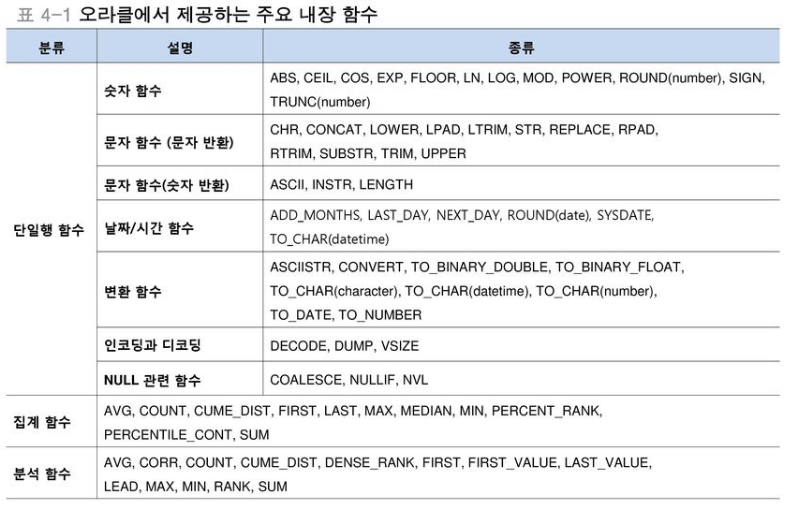

#### 숫자 함수

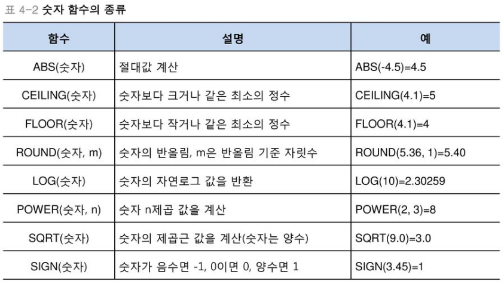

##### ABS 함수

절대값을 구하는 함수

```sql
SELECT ABS(-78), ABS(+78)
FROM DUAL;
```

-78과 +78의 절대값

##### ROUND 함수

반올림한 값을 구하는 함수

```sql
SELECT ROUND(4.875, 1)
FROM DUAL;
```

4.875를 소수 첫째 자리까지 반올림한 값

##### 숫자 함수의 연산

```sql
SELECT custid "고객번호", ROUND(SUM(saleprice)/COUNT(*), -2) "평균금액"
FROM Orders
GROUP BY custid;
```

고객별 평균 주문 금액을 백 원 단위로 반올림한 값

#### 문자 함수

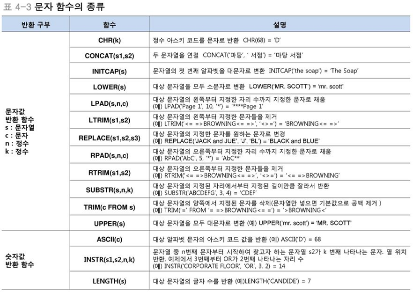

##### REPLACE

문자열을 치환하는 함수

```sql
SELECT bookid, REPLACE(bookname, '야구', '농구') bookname, publisher, price
FROM Book;
```

도서제목에 야구가 포함된 도서를 농구로 변경한 도서 목록 

##### LENGTH

글자의 수를 세어주는 함수 (단위가 바이트(byte)가 아닌 문자 단위)

```sql
SELECT bookname "제목", LENGTH(bookname) "글자수", LENGTHB(bookname) "바이트수"
FROM Book
WHERE publisher="굿스포츠";
```

굿스포츠에서 출판한 도서의 제목과 제목의 글자 수

##### SUBSTR

지정한 길이만큼의 문자열을 반환하는 함수

```sql
SELECT SUBSTR(name, 1, 1) "성", COUNT(*) "인원"
FROM Customer
GROUP BY SUBSTR(name, 1, 1);
```

고객 중에서 같은 성(姓)을 가진 사람이 몇 명이나 되는지 성별 인원수 구하기

#### 날짜 · 시간 함수

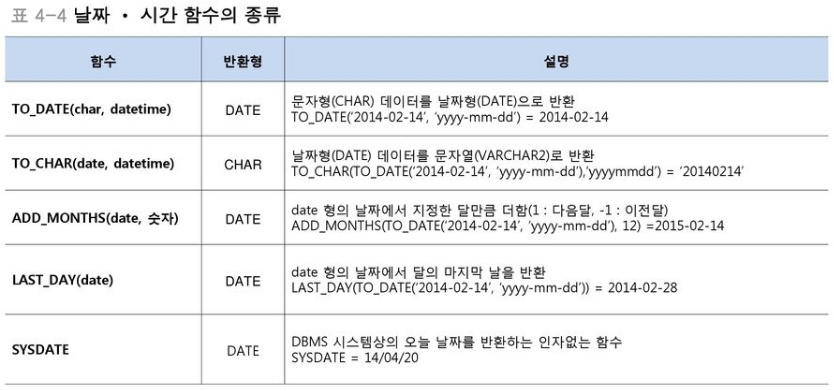

---

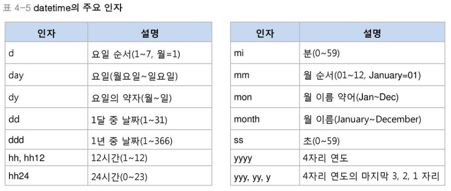

---

```sql
SELECT orderid "주문번호", orderdate "주문일", orderdate+10 "확정"
FROM Orders;
```

주문일로부터 10일 후 매출 확정. 각 주문의 확정일자 구하기

##### TO_DATE

문자형으로 저장된 날짜를 날짜형으로 변환하는 함수

##### TO_CHAR

날짜형을 문자형으로 변환하는 함수

```sql
SELECT orderid "주문번호", TO_CHAR(orderdate, 'yyyy-mm-dd dy') "주문일",
       custid "고객번호", bookid "도서번호"
FROM Orders
WHERE orderdate=TO_DATE('20140707', 'yyyymmdd');
```

##### SYSDATETIME

오라클의 현재 날짜와 시간을 반환하는 함수

##### SYSTIMESTAMP

현재 날짜, 시간과 함께 초 이하의 시간과 서버의 TIMEZONE까지 출력함

```sql
SELECT SYSDATE, TO_CHAR(SYSDATE, 'yyyy/mm/dd dy hh24:mi:ss') "SYSDATE_1"
FROM DUAL;
```

DBMS 서버에 설정된 현재 시간과 오늘 날짜 확인

### NULL 값 처리

#### NULL 값이란?

- 아직 지정되지 않은 값
- NULL 값은 '0', '(빈 문자)', '(공백)' 등과 다른 특별한 값
- NULL 값은 비교 연산자로 비교가 불가능함
- NULL 값의 연산을 수행하면 결과 역시 NULL 값으로 반환됨

#### 집계 함수를 사용할 때 주의할 점

- 'NULL + 숫자' 연산의 결과는 NULL
- 집계 함수 계산 시 NULL이 포함된 행은 집계에서 빠짐
- 해당되는 행이 하나도 없을 경우 SUM, AVG 함수의 결과는 NULL이 되며, COUNT 함수의 결과는 0

#### NULL 값에 대한 연산과 집계 함수

Mybook

| bookid | price |
| ------ | ----- |
| 1      | 10000 |
| 2      | 20000 |
| 3      | NULL  |

---

```sql
SELECT price+100
FROM Mybook
WHERE bookid=3;
```

| PRICE+100 |
| --------- |
| (null)    |

---

```sql
SELECT SUM(price), AVG(price), COUNT(*), COUNT(price)
FROM Mybook;
```

| SUM(PRICE) | AVG(PRICE) | COUNT(*) | COUNT(PRICE) |
| ---------- | ---------- | -------- | ------------ |
| 30000      | 15000      | 3        | 2            |

---

```sql
SELECT SUM(price), AVG(price), COUNT(*)
FROM Mybook
WHERE bookid >= 4;
```

| SUM(PRICE) | AVG(PRICE) | COUNT(*) |
| ---------- | ---------- | -------- |
| (null)     | (null)     | 0        |

#### NULL 값을 확인하는 방법 - IS NULL, IS NOT NULL

- NULL 값을 찾을 때는 '=' 연산자가 아닌 'IS NULL'을 사용
- NULL이 아닌 값을 찾을 때는 '<>' 연산자가 아닌 'IS NOT NULL'을 사용함

---

```sql
SELECT *
FROM Mybook
WHERE price IS NULL;
```

| BOOKID | PRICE  |
| ------ | ------ |
| 3      | (null) |

---

```sql
SELECT *
FROM Mybook
WHERE price = '';
```

| BOOKID | PRICE |
| ------ | ----- |
|        |       |

#### NVL

- NULL 값을 다른 값으로 대치하여 연산하거나 다른 값으로 출력

```
NVL(속성, 값)  /* 속성 값이 NULL이면 '값'으로 대치한다 */
```

---

```sql
SELECT name "이름", NVL(phone, '연락처없음') "전화번호"
FROM Customer;
```

이름, 전화번호가 포함된 고객목록 (단, 전화번호가 없는 고객은 '연락처없음'으로 표시)

### ROWNUM

- 내장 함수는 아니지만 자주 사용되는 문법
- 오라클에서 내부적으로 생성되는 가상 컬럼으로 SQL 조회 결과의 순번을 나타냄
- 자료를 일부분만 확인하여 처리할 때 유용

---

```sql
SELECT ROWNUM "순번", custid, name, phone
FROM Customer
WHERE ROWNUM <= 2;
```

고객 목록에서 고객번호, 이름, 전화번호를 앞의 두 명만 보이기

## 부속질의

### 부속질의(subquery)란?

- 하나의 SQL문 안에 다른 SQL문이 중첩된 nested 질의를 말함
- 다른 테이블에서 가져온 데이터로 현재 테이블에 있는 정보를 찾거나 가공할 때 사용함
- 보통 데이터가 대량일 때 데이터를 모두 합쳐서 연산하는 조인보다 필요한 데이터만 찾아서 공급해주는 부속질의가 성능이 더 좋음
- 주질의(main query, 외부질의)와 부속질의(sub query, 내부질의)로 구성됨

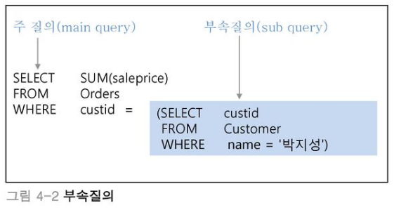

---

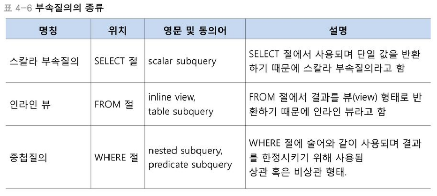

### 스칼라 부속질의 - SELECT 부속질의

#### 스칼라 부속질의(scalar subquery)란?

- SELECT 절에서 사용되는 부속질의로, 부속질의의 결과값을 단일 행, 단일 열의 스칼라 값으로 반환함
- 스칼라 부속질의는 원칙적으로 스칼라 값이 들어갈 수 있는 모든 곳에 사용 가능하며, 일반적으로 SELECT 문과 UPDATE SET 절에 사용됨
- 주질의와 부속질의와의 관계는 상관/비상관 모두 가능함

---

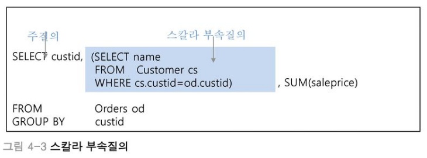

---

```sql
SELECT (SELECT name
        FROM Customer cs
        WHERE cs.custid=od.custid) "name", SUM(saleprice) "total"
FROM Orders od
GROUP BY od.custid;
```

서점의 고객별 판매액(결과는 고객이름과 고객별 판매액을 출력)

---

```sql
UPDATE Orders
SET bookname = (SELECT bookname
                FROM Book
                WHERE Book.bookid=Orders.bookid);
```

Orders 테이블에 각 주문에 맞는 도서 이름 입력

### 인라인 뷰 - FROM 부속질의

#### 인라인 뷰(inline view)

- FROM 절에서 사용되는 부속질의
- 테이블 이름 대신 인라인 뷰 부속질의를 사용하면 보통의 테이블과 같은 형태로 사용 가능
- 부속질의 결과 반환되는 데이터는 다중 행, 다중 열이어도 상관없음
- 다만 가상의 테이블인 뷰 형태로 제공되어 상관 부속질의로 사용될 수는 없음

---

```sql
SELECT cs.name, SUM(od.saleprice) "total"
FROM (SELECT custid, name
      FROM Customer
      WHERE custid <= 2) cs,
      Orders od
WHERE cs.custid=od.custid
GROUP BY cs.name;
```

고객번호가 2 이하인 고객의 판매액(결과는 고객이름과 고객별 판매액 출력)

---

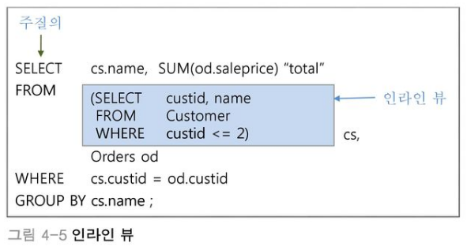

### 중첩질의 - WHERE 부속질의

- 중첩질의(nested subquery)는 WHERE 절에서 사용되는 부속질의
- WHERE 절은 보통 데이터를 선택하는 조건 혹은 술어(predicate)와 같이 사용됨
- 그래서 중첩질의를 술어 부속질의(predicate subquery)라고도 함

---

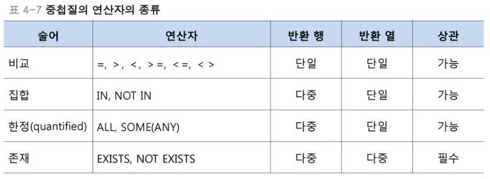

#### 비교 연산자

- 부속질의가 반드시 단일 행, 단일 열을 반환해야 하며, 아닐 경우 질의를 처리할 수 없음

---

```sql
SELECT orderid, saleprice
FROM Orders
WHERE saleprice <= (SELECT AVG(saleprice)
                    FROM Orders);
```

평균 주문금액 이하의 주문에 대해서 주문번호와 금액 보이기

---

```sql
SELECT orderid, custid, saleprice
FROM Orders od
WHERE saleprice > (SELECT AVG(saleprice)
                   FROM Orders so
                   WHERE od.custid=so.custid);
```

각 고객의 평균 주문금액보다 큰 금액의 주문 내역에 대해서 주문번호, 고객번호, 금액 보이기

#### IN, NOT IN

- IN 연산자는 주질의 속성 값이 부속질의에서 제공한 결과 집합에 있는지 확인(check)하는 역할을 함.
- IN 연산자는 부속질의의 결과 다중 행을 가질 수 있음.
- 주질의는 WHERE 절에 사용되는 속성 값을 부속질의의 결과 집합과 비교해 하나라도 있으면 참이 됨.
- NOT IN은 이와 반대로 값이 존재하지 않으면 참이 됨

---

```sql
SELECT SUM(saleprice) "total"
FROM Orders
WHERE custid IN (SELECT custid
                 FROM Customer
                 WHERE address LIKE '%대한민국%');
```

대한민국에 거주하는 고객에게 판매한 도서의 총 판매액

#### ALL, SOME(ANY)

- ALL은 모두, SOME(ANY)은 어떠한(최소한 하나라도)이라는 의미를 가짐
- 구문 구조
  - scalar_expression {비교연산자(= | <> | != | > | >= | !> | < | <= | !<)} {ALL | SOME | ANY} (부속질의)

---

```sql
SELECT orderid, saleprice
FROM Orders
WHERE saleprice > ALL (SELECT saleprice
                       FROM Orders
                       WHERE custid='3');
```

3번 고객이 주문한 도서의 최고 금액보다 더 비싼 도서를 구입한 주문의 주문번호와 금액

#### EXISTS, NOT EXISTS

- 데이터의 존재 유무를 확인하는 연산자
- 주질의에서 부속질의로 제공된 속성의 값을 가지고 부속질의에 조건을 만족하여 값이 존재하면 참이 되고, 주질의는 해당 행의 데이터를 출력함
- NOT EXISTS의 경우 이와 반대로 동작함
- 구문 구조
  - WHERE [NOT] EXISTS (부속질의)

---

```sql
SELECT SUM(saleprice) "total"
FROM Orders od
WHERE EXISTS (SELECT *
              FROM Customer cs
              WHERE address LIKE '%대한민국%' AND cs.custid=od.custid);
```

대한민국에 거주하는 고객에게 판매한 도서의 총 판매액 (EXISTS 연산자 사용)

## 뷰

- 뷰(view)는 하나 이상의 테이블을 합하여 만든 가상의 테이블
- 장점
  - 편리성 : 미리 정의된 뷰를 일반 테이블처럼 사용할 수 있기 때문에 편리함. 또 사용자가 필요한 정보만 요구에 맞게 가공하여 뷰로 만들어 쓸 수 있음
  - 재사용성 : 자주 사용되는 질의를 뷰로 미리 정의해 놓을 수 있음
  - 보안성 : 각 사용자별로 필요한 데이터만 선별하여 보여줄 수 있음. 중요한 질의의 경우 질의 내용을 암호화할 수 있음

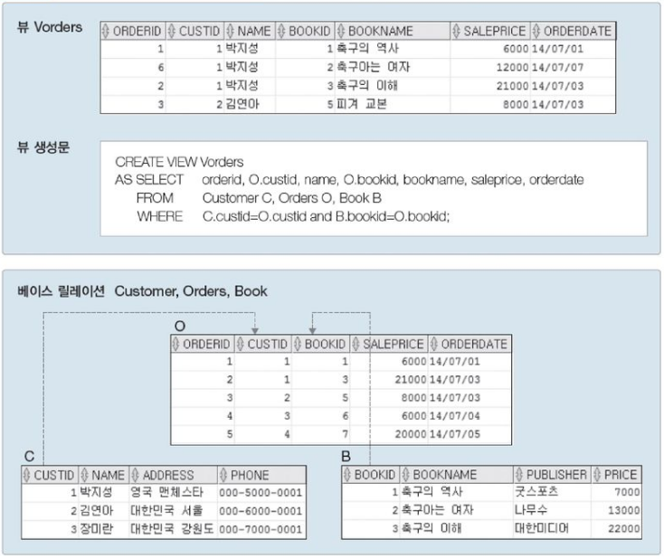

### 뷰의 생성

#### 기본 문법

```sql
CREATE VIEW 뷰이름 [(열이름 [ ,...n ])]
AS SELECT 문
```

---

```sql
SELECT *
FROM Book
WHERE bookname LIKE '%축구%';
```

Book 테이블에서 '축구'라는 문구가 포함된 자료만 보여주는 뷰

---

```sql
CREATE VIEW vw_Book
AS SELECT *
FROM Book
WHERE bookname LIKE '%축구%';
```

위 SELECT 문을 이용해 작성한 뷰 정의문

---

```sql
CREATE VIEW vw_Customer
AS SELECT *
FROM Customer
WHERE address LIKE '%대한민국%';
```

주소에 '대한민국'을 포함하는 고객들로 구성된 뷰 생성 및 조회. (단, 뷰의 이름은 vw_Customer로 한다.)

```sql
SELECT *
FROM vw_Customer;
```

결과 확인

---

```sql
CREATE VIEW vw_Orders (orderid, custid, name, bookid, bookname, saleprice, orderdate)
AS SELECT od.orderid, od.custid, cs.name,
          od.bookid, bk.bookname, od.saleprice, od.orderdate
FROM Orders od, Customer cs, Book bk
WHERE od.custid=cs.custid AND od.bookid=bk.bookid;
```

Orders 테이블에 고객이름과 도서이름을 바로 확인할 수 있는 뷰를 생성한 후, '김연아' 고객이 구입한 도서의 주문번호, 도서이름, 주문액 보이기

```sql
SELECT orderid, bookname, saleprice
FROM vw_Orders
WHERE name='김연아';
```

결과 확인

### 뷰의 수정

#### 기본 문법

```sqlite
CREATE OR REPLACE VIEW 뷰이름 [(열이름 [ ,...n ])]
AS SELECT 문
```

---

```sql
CREATE OR REPLACE VIEW vw_Customer (custid, name, address)
AS SELECT custid, name, address
FROM Customer
WHERE address LIKE '%영국%';
```

앞에서 생성한 뷰 vw_Customer는 주소가 대한민국인 고객을 보여준다.

영국을 주소로 가진 고객으로 변경, phone 속성 제외

```sql
SELECT *
FROM vw_Customer;
```

### 뷰의 삭제

#### 기본 문법

```sql
DROP VIEW 뷰이름 [ ,...n ];
```

---

```sql
DROP VIEW vw_Customer;
```

vw_Customer 삭제

```sql
SELECT *
FROM vw_Customer;
```

## 인덱스

### 데이터베이스의 물리적 저장

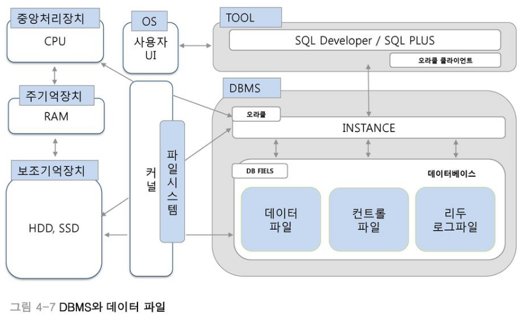

#### 실제 데이터가 저장되는 곳은 보조기억장치

- 하드디스크, SSD, USB 메모리 등

#### 가장 많이 사용되는 장치는 하드디스크

- 하드디스크는 원형의 플레이트(plate)로 구성되어 있고, 이 플레이트는 논리적으로 트랙으로 나뉘며 트랙은 다시 몇 개의 섹터로 나뉨
- 원형의 플레이트는 초당 빠른 속도로 회전하고, 회전하는 플레이트를 하드디스크의 액세스 암(arm)과 헤더(header)가 접근하여 원하는 섹터에서 데이터를 가져옴
- 하드디스크에 저장된 데이터를 읽어 오는 데 걸리는 시간은 모터(motor)에 의해서 분당 회전하는 속도(RPM, Revolutions Per Minute), 데이터를 읽을 때 액세스 암이 이동하는 시간(latency time), 주기억장치로 읽어오는 시간(transfer time)에 영향을 받음

#### 액세스 시간(access time)

- 액세스 시간 = 탐색시간(seek time, 액세스 헤드를 트랙에 이동시키는 시간) + 회전지연시간(rotational latency time, 섹터가 액세스 헤드에 접근하는 시간) + 데이터 전송시간(data transfer time, 데이터를 주기억장치로 읽어오는 시간)

---

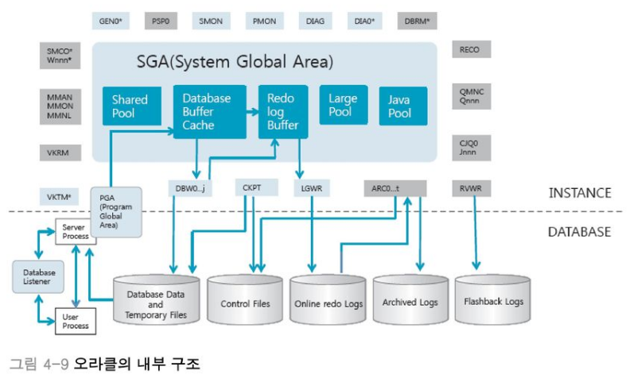

---

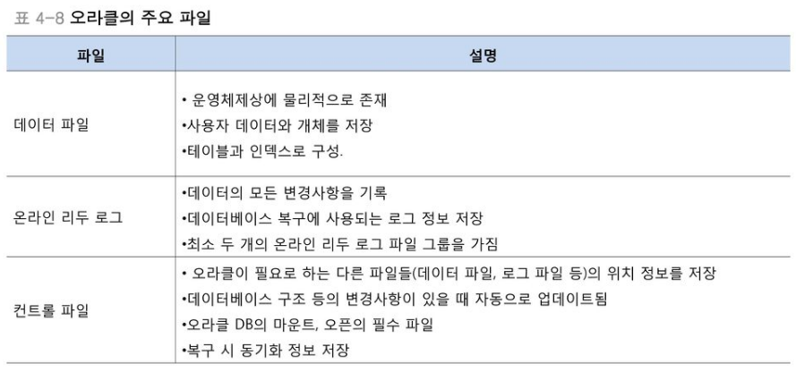

### 인덱스와 B-tree

#### 인덱스(index, 색인)

- 도서의 색인이나 사전과 같이 데이터를 쉽고 빠르게 찾을 수 있도록 만든 데이터 구조

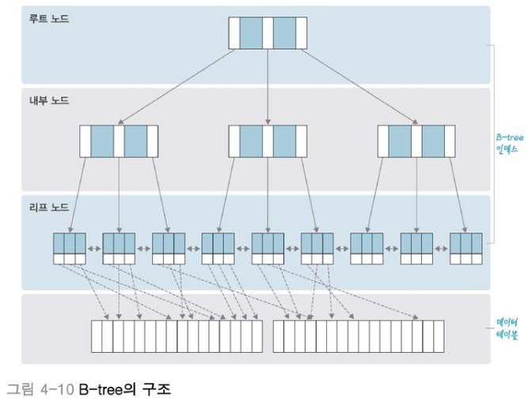

---

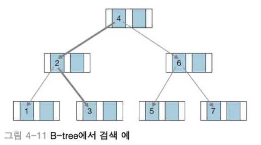

#### 인덱스의 특징

- 인덱스는 테이블에서 한 개 이상의 속성을 이용하여 생성함
- 빠른 검색과 함께 효율적인 레코드 접근이 가능함
- 순서대로 정렬된 속성과 데이터의 위치만 보유하므로 테이블보다 작은 공간을 차지함
- 저장된 값들은 테이블의 부분집합이 됨
- 일반적으로 B-tree 형태의 구조를 가짐
- 데이터의 수정, 삭제 등의 변경이 발생하면 인덱스의 재구성이 필요함

### 오라클 인덱스

#### 오라클 B-tree 인덱스

- 오라클 인덱스는 B-tree를 변형하여 사용하며 명칭은 B-tree로 동일한 이름으로 부름

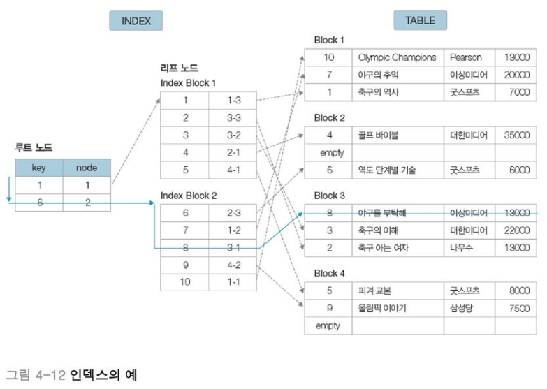

#### 오라클 인덱스의 종류

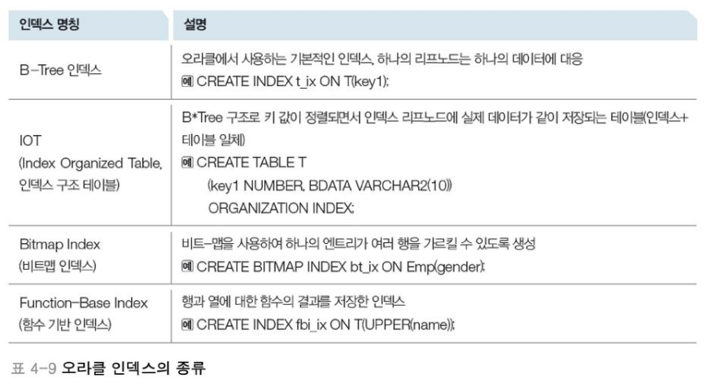

### 인덱스의 생성

#### 인덱스 생성 시 고려사항

- 인덱스는 WHERE 절에 자주 사용되는 속성이어야 함
- 인덱스는 조인에 자주 사용되는 속성이어야 함
- 단일 테이블에 인덱스가 많으면 속도가 느려질 수 있음(테이블 당 4~5개 정도 권장)
- 속성이 가공되는 경우 사용하지 않음
- 속성의 선택도가 낮을 때 유리함(속성의 모든 값이 다른 경우)

#### 인덱스의 생성 문법

```sql
CREATE [REVERSE] | [UNIQUE] INDEX 인덱스이름
ON 테이블이름 (컬럼 [ASC | DESC] [{, 컬럼 [ASC | DESC]} ...]);
```

---

```sql
CREATE INDEX ix_Book ON Book (bookname);
```

Book 테이블의 bookname 열을 대상으로 비 클러스터 인덱스 ix_Book 생성

---

```sql
CREATE INDEX cix_Customer ON Book (publisher, price);
```

Customer 테이블의 name 열을 대상으로 클러스터 인덱스 cix_Customer 생성

### 인덱스의 재구성과 삭제

인덱스의 재구성은 ALTER INDEX 명령을 사용함

#### 재구성 문법

```sql
ALTER [REVERSE] [UNIQUE] INDEX 인덱스이름
[ON {ONLY} 테이블이름 {컬럼이름 [{, 컬럼이름 } ...]}] REBUILD;
```

---

```sql
ALTER INDEX ix_Book REBUILD;
```

인덱스 ix_Book 재생성

#### 삭제 문법

```sql
DROP INDEX 인덱스이름
```

---

```sql
DROP INDEX ix_Book;
```

인덱스 ix_Book 삭제

