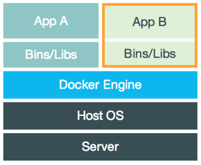
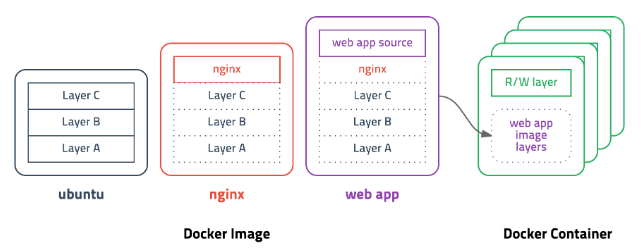
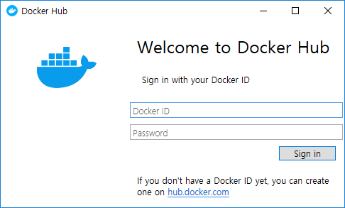
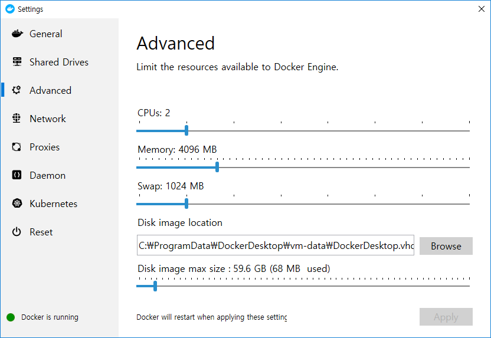
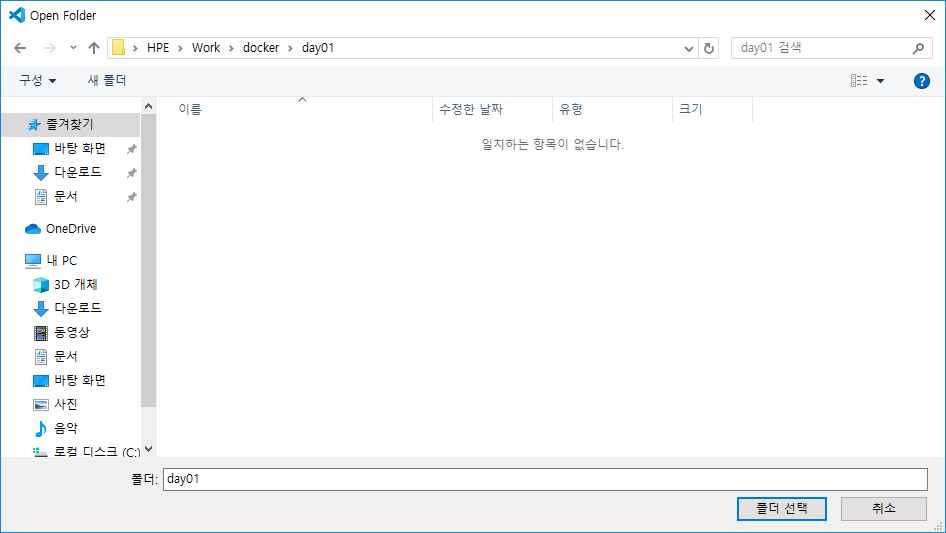
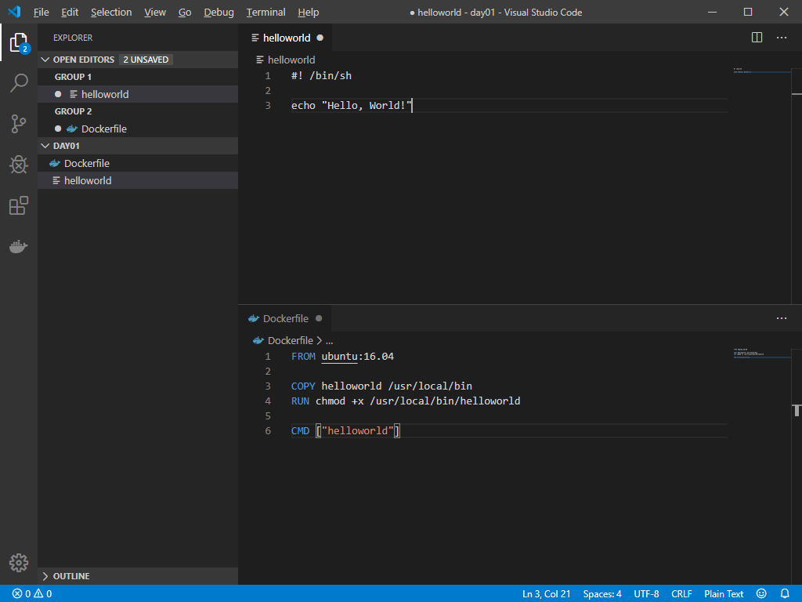
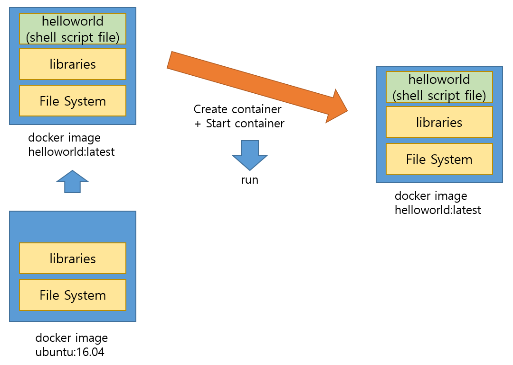
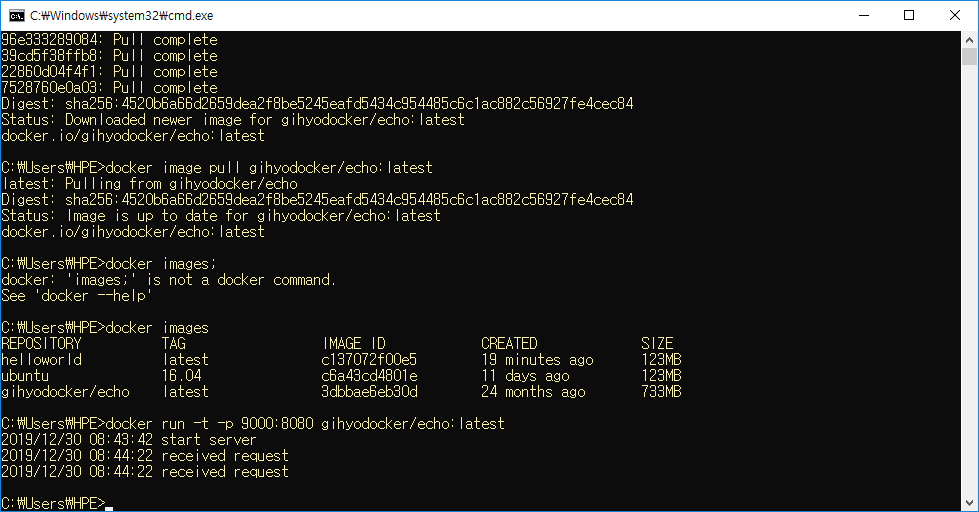
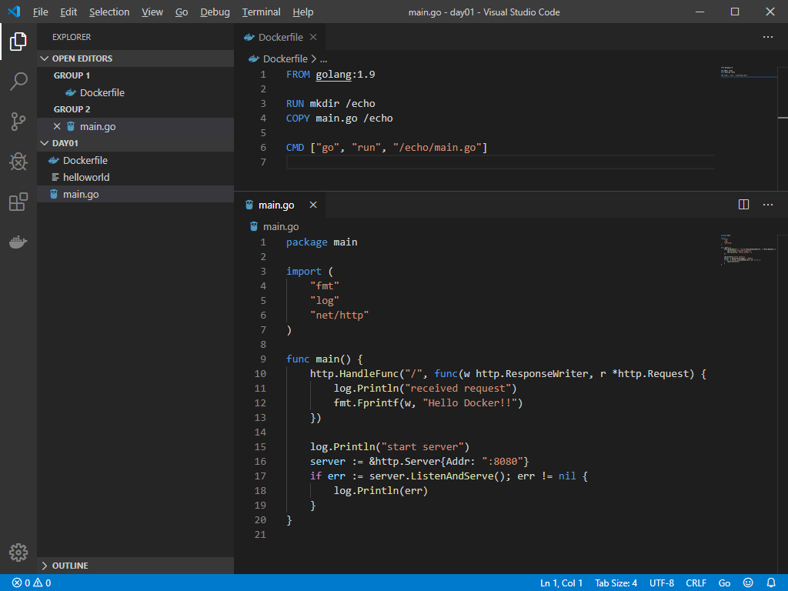
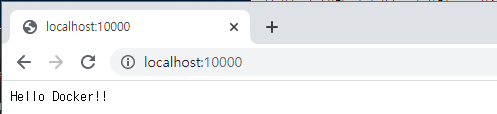

# Docker


## 가상화 사용 확인

Vagrant처럼 필요한 이미지, 운영체제등 제공하는 사이트 -> 도커허브


`작업관리자` -> `가상화` 부분 확인


비활성화일 경우 BIOS 환경에서 설정해야 하는 경우도 있다.


## Docker

* 2014년 6월 Docker 1.0 발표
* 컨테이너 기반의 오픈소스 가상화 플랫폼
* 백엔드 프로그램, 데이터베이스, 메시지 큐 -> 컨테이너로 추상화 가능
* 일반PC, AWS, Azure, Google cloud 등에서 실행 가능

* VM
  

* Docker
  

* 기존 가상화 방식 -> OS를 가상화
  * VMWare, VirtualBox (Host OS 위에 Guest OS 전체를 가상화)
  * **무겁고 느림**
* CPU의 가상화 기술 이용 방식 -> **Kernel-based Virtual Machine**
  * 전체 OS를 가상화 하지 않음. 호스트 형식에 비해 속도 향상
  * OpenStack, AWS 등의 클라우드 서비스
  * **추가적인 OS**는 여전히 필요. 성능 문제
* 프로세스 격리 -> 리눅스 컨테이너
  * CPU나 메모리는 프로세스에 필요한 만큼만 추가로 사용
  * 성능 손실 거의 없음
  * 컨테이너들 사이는 서로 영향을 주지 않음
  * 컨테이너 생성 속도 빠름 (1-2초 내)


* Docker Hub에 등록 or Docker Registry 저장소를 직접 만들어 관리

  * 공개된 도커 이미지는 50만개 이상, 다운로드 수는 80억회 이상

* Layer 저장방식

  * 유니온 파일 시스템을 이용 -> 여러 개의 Layer를 하나의 파일시스템으로 사용 가능

  

* Docker Image

  * 컨테이너 실행에 필요한 파일과 설정 값 등을 포함 -> 상태값 X, Immutable
  * 실체화 -> Container


---

## 도커 스타일 체험하기(CentOS)

```bash
$ vagrant up node01
```

```bash
[vagrant@node01 ~]$ echo "Hello, World"
Hello, World
[vagrant@node01 ~]$ echo hi there
hi there
```

```bash
[vagrant@node01 ~]$ touch helloworld
[vagrant@node01 ~]$ vi helloworld
```

```bash
#!/bin/sh

echo "Hello, World!"
```

```bash
[vagrant@node01 ~]$ chmod +x helloworld 
[vagrant@node01 ~]$ ./helloworld 
Hello, World!
[vagrant@node01 ~]$ touch Dockerfile
[vagrant@node01 ~]$ vi Dockerfile
```

```bash
FROM ubuntu:16.04

COPY helloworld /usr/local/bin
RUN cmode +x /usr/local/bin/helloword

CMD ["helloworld']
```

* FROM절 : 컨테이너의 원형(틀) 역할을 할 도커 이미지(운영 체제)를 정의한다. 
* COPY절 : 조금 전 작성한 셸 스크립트 파일(helloworld)을 도커 컨테이너 안의 /usr/local/bin에 복사하라고 정의한 것이다.
* RUN절 : 도커 컨테이너 안에서 어떤 명령을 수행하기 위한 것이다. 여기서는 helloworld 스크립트에 실행 권한을 부여하기 위해 사용했다. 여기까지가 도커 빌드 과정에서 실행되며 그 결과 새로운 이미지가 만들어진다.
* CMD절 : 완성된 이미지를 도커 컨테이너로 실행하기 전에 먼저 실행할 명령을 정의한다.

---


## Docker 설치

https://www.docker.com/

https://hub.docker.com/

https://hub.docker.com/editions/community/docker-ce-desktop-windows


sign in



Setting


Advanced

도커가 사용할 수 있는 리소스. 할당된 리소스



Memory 4096MB로 설정


cmd창 열기

```bash
$ docker version
Client: Docker Engine - Community
 Version:           19.03.5
 API version:       1.40
 Go version:        go1.12.12
 Git commit:        633a0ea
 Built:             Wed Nov 13 07:22:37 2019
 OS/Arch:           windows/amd64
 Experimental:      false

Server: Docker Engine - Community
 Engine:
  Version:          19.03.5
  API version:      1.40 (minimum version 1.12)
  Go version:       go1.12.12
  Git commit:       633a0ea
  Built:            Wed Nov 13 07:29:19 2019
  OS/Arch:          linux/amd64
  Experimental:     false
 containerd:
  Version:          v1.2.10
  GitCommit:        b34a5c8af56e510852c35414db4c1f4fa6172339
 runc:
  Version:          1.0.0-rc8+dev
  GitCommit:        3e425f80a8c931f88e6d94a8c831b9d5aa481657
 docker-init:
  Version:          0.18.0
  GitCommit:        fec3683
```

도커 버전을 확인한다.

Docker는 GoLang 으로 만들어져 있다.


## 도커 체험하기 1


```bash
C:\Users\HPE>cd work

C:\Users\HPE\Work>dir
 C 드라이브의 볼륨에는 이름이 없습니다.
 볼륨 일련 번호: A0B4-FAD1

 C:\Users\HPE\Work 디렉터리

2019-12-26  오후 03:22    <DIR>          .
2019-12-26  오후 03:22    <DIR>          ..
2019-12-24  오전 10:17    <DIR>          git
2019-12-26  오후 03:26    <DIR>          mongodb-4.2.2
2019-12-26  오후 03:13       454,525,740 mongodb-4.2.2.zip
2019-12-26  오후 03:15    <DIR>          mysql
2019-12-23  오후 04:27    <DIR>          vagrant
               1개 파일         454,525,740 바이트
               6개 디렉터리  894,891,741,184 바이트 남음

C:\Users\HPE\Work>mkdir docker
C:\Users\HPE\Work>mkdir docker\day01
C:\Users\HPE\Work>cd docker\day01
```


Open Folder






New File

```bash
#! /bin/sh

echo "Hello, World!"
```

```bash
FROM ubuntu:16.04

COPY helloworld /usr/local/bin
RUN chmod +x /usr/local/bin/helloworld

CMD ["helloworld"]
```


둘 다 lf로만 선택 -> 저장


```bash
C:\Users\HPE\Work\docker\day01>dir
 C 드라이브의 볼륨에는 이름이 없습니다.
 볼륨 일련 번호: A0B4-FAD1

 C:\Users\HPE\Work\docker\day01 디렉터리

2019-12-30  오후 04:13    <DIR>          .
2019-12-30  오후 04:13    <DIR>          ..
2019-12-30  오후 04:15               113 Dockerfile
2019-12-30  오후 04:15                34 helloworld
               2개 파일                 147 바이트
               2개 디렉터리  894,935,347,200 바이트 남음

```

```bash
C:\Users\HPE>docker images
REPOSITORY          TAG                 IMAGE ID            CREATED             SIZE
```

```bash
C:\Users\HPE>cd Work\docker\day01

C:\Users\HPE\Work\docker\day01>docker image build -t helloworld:latest .
Sending build context to Docker daemon  3.072kB
Step 1/4 : FROM ubuntu:16.04
16.04: Pulling from library/ubuntu
3386e6af03b0: Pull complete
49ac0bbe6c8e: Pull complete
d1983a67e104: Pull complete
1a0f3a523f04: Pull complete
Digest: sha256:181800dada370557133a502977d0e3f7abda0c25b9bbb035f199f5eb6082a114
Status: Downloaded newer image for ubuntu:16.04
 ---> c6a43cd4801e
Step 2/4 : COPY helloworld /usr/local/bin
 ---> db51eace0237
Step 3/4 : RUN chmod +x /usr/local/bin/helloworld
 ---> Running in 85c7f6bcd7b0
Removing intermediate container 85c7f6bcd7b0
 ---> 7869d7eef6a3
Step 4/4 : CMD ["helloworld"]
 ---> Running in 0e32f0df7166
Removing intermediate container 0e32f0df7166
 ---> c137072f00e5
Successfully built c137072f00e5
Successfully tagged helloworld:latest
SECURITY WARNING: You are building a Docker image from Windows against a non-Windows Docker host. All files and directories added to build context will have '-rwxr-xr-x' permissions. It is recommended to double check and reset permissions for sensitive files and directories.
```

```bash
C:\Users\HPE\Work\docker\day01>docker container run helloworld:latest
Hello, World!
```

```bash
C:\Users\HPE\Work\docker\day01>docker ps
CONTAINER ID        IMAGE               COMMAND             CREATED             STATUS              PORTS               NAMES

C:\Users\HPE\Work\docker\day01>docker ps -a
CONTAINER ID        IMAGE               COMMAND             CREATED             STATUS                     PORTS               NAMES
dfd2dc12b2a9        helloworld:latest   "helloworld"        7 minutes ago       Exited (0) 7 minutes ago                       unruffled_jones
```

```bash
C:\Users\HPE\Work\docker\day01>docker run helloworld:latest
Hello, World!
```


* docker 실행 과정




---

## 도커 체험하기 2

```bash
docker image pull gihyodocker/echo:latest
C:\Users\HPE>docker image pull gihyodocker/echo:latest
latest: Pulling from gihyodocker/echo
723254a2c089: Pull complete
abe15a44e12f: Pull complete
409a28e3cc3d: Pull complete
503166935590: Pull complete
abe52c89597f: Pull complete
ce145c5cf4da: Pull complete
96e333289084: Pull complete
39cd5f38ffb8: Pull complete
22860d04f4f1: Pull complete
7528760e0a03: Pull complete
Digest: sha256:4520b6a66d2659dea2f8be5245eafd5434c954485c6c1ac882c56927fe4cec84
Status: Downloaded newer image for gihyodocker/echo:latest
docker.io/gihyodocker/echo:latest
```

앞에 있는 계정 사이트에서 echo라는 이름의 이미지를 가져오겠다.

중복되어 있다면 재사용

```bash
C:\Users\HPE>docker images
REPOSITORY          TAG                 IMAGE ID            CREATED             SIZE
helloworld          latest              c137072f00e5        19 minutes ago      123MB
ubuntu              16.04               c6a43cd4801e        11 days ago         123MB
gihyodocker/echo    latest              3dbbae6eb30d        24 months ago       733MB
```

```bash
C:\Users\HPE>docker run -t -p 9000:8080 gihyodocker/echo:latest
2019/12/30 08:43:42 start server
```

create, start 해준다.

-t 옵션은 TTY. 터미널 화면을 띄워주는 역할

-p는 외부에서 사용할 때에는 9000번으로 사용하겠다는 것이다. 포트포워딩


크롬을 이용해 localhost:9000 에 접속한다.


새로운 터미널 열어서 프로세스가 살아있는지 확인

```bash
C:\Users\HPE>docker ps
CONTAINER ID        IMAGE                     COMMAND                  CREATED              STATUS              PORTS                    NAMES
204fb5083961        gihyodocker/echo:latest   "go run /echo/main.go"   About a minute ago   Up About a minute   0.0.0.0:9000->8080/tcp   interesting_mirzakhani
```

실행시킨 컨테이너가 작동중인 것을 확인 가능하다


```bash
C:\Users\HPE>docker stop 204fb5083961
204fb5083961
```

위 명령을 실행하면 서버가 중지되는 것을 확인할 수 있다.




```bash
C:\Users\HPE>docker ps
CONTAINER ID        IMAGE               COMMAND             CREATED             STATUS              PORTS               NAMES

C:\Users\HPE>docker ps -a
CONTAINER ID        IMAGE                     COMMAND                  CREATED             STATUS                      PORTS               NAMES
204fb5083961        gihyodocker/echo:latest   "go run /echo/main.go"   2 minutes ago       Exited (2) 50 seconds ago                       interesting_mirzakhani
f42154d2f770        helloworld:latest         "helloworld"             14 minutes ago      Exited (0) 14 minutes ago                       vigilant_leavitt
dfd2dc12b2a9        helloworld:latest         "helloworld"             22 minutes ago      Exited (0) 22 minutes ago                       unruffled_jones
```

---

## 도커 체험하기 3



```bash
C:\Users\HPE>cd Work\docker\day01

C:\Users\HPE\Work\docker\day01>cd go

C:\Users\HPE\Work\docker\day01\go>docker image build -t example/echo:latest .
```

````bash
C:\Users\HPE\Work\docker\day01\go>docker images
REPOSITORY          TAG                 IMAGE ID            CREATED             SIZE
example/echo        latest              e0acd596dbeb        35 seconds ago      750MB
helloworld          latest              c137072f00e5        35 minutes ago      123MB
ubuntu              16.04               c6a43cd4801e        11 days ago         123MB
golang              1.9                 ef89ef5c42a9        17 months ago       750MB
gihyodocker/echo    latest              3dbbae6eb30d        24 months ago       733MB
````

도커 이미지 확인

```bash
C:\Users\HPE\Work\docker\day01\go>docker run -t -p 10000:8080 example/echo:latest
2019/12/30 08:58:56 start server
```




크롬에서 확인


다른 cmd창 열기

```bash
C:\Users\HPE>docker ps
CONTAINER ID        IMAGE                     COMMAND                  CREATED             STATUS              PORTS                     NAMES
8e50483ef64c        example/echo:latest       "go run /echo/main.go"   32 seconds ago      Up 29 seconds       0.0.0.0:10000->8080/tcp   modest_bhaskara
159fe53d2774        gihyodocker/echo:latest   "go run /echo/main.go"   11 minutes ago      Up 11 minutes       0.0.0.0:9000->8080/tcp    boring_mclean
```

docker ps -> ID 복사


```bash
C:\Users\HPE>docker exec -it 8e50483ef64c bash
root@8e50483ef64c:/go#
```

```bash
root@8e50483ef64c:/go# ls /echo/main.go
/echo/main.go
```

```bash
C:\Users\HPE>docker ps
CONTAINER ID        IMAGE                     COMMAND                  CREATED             STATUS              PORTS                     NAMES
8e50483ef64c        example/echo:latest       "go run /echo/main.go"   4 minutes ago       Up 4 minutes        0.0.0.0:10000->8080/tcp   modest_bhaskara
159fe53d2774        gihyodocker/echo:latest   "go run /echo/main.go"   15 minutes ago      Up 15 minutes       0.0.0.0:9000->8080/tcp    boring_mclean
```

```bash
C:\Users\HPE>docker stop 8e50483ef64c 159fe53d2774
8e50483ef64c
159fe53d2774
```

```bash
C:\Users\HPE>docker rm 8e50483ef64c 159fe53d2774
8e50483ef64c
159fe53d2774
```

```bash
C:\Users\HPE>docker ps
CONTAINER ID        IMAGE               COMMAND             CREATED             STATUS              PORTS               NAMES
```

