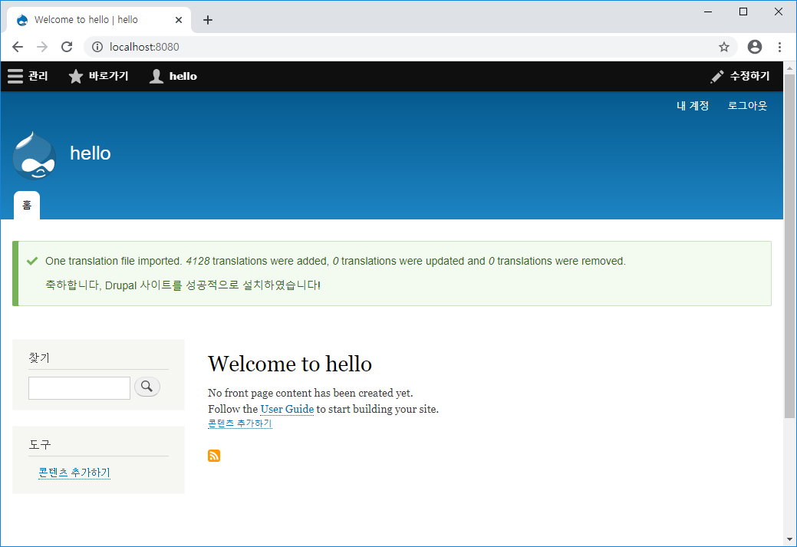

# Docker Compose - LAB1


`docker-compose.yml` file

```yaml
version: '3'
services:
  drupal:
    image: drupal
    ports:
      - "8080:80"
    volumes:
      - drupal-modules:/var/www/html/modules
      - drupal-profiles:/var/www/html/profiles
      - drupal-sites:/var/www/html/sites
      - drupal-themes:/var/www/html/themes
  mysql:
    image: mysql:5.7
    environment:
      - MYSQL_DATABASE=drupal
      - MYSQL_USER=user
      - MYSQL_PASSWORD=password
      - MYSQL_ROOT_PASSWORD=password
volumes:
  drupal-modules:
  drupal-profiles:
  drupal-sites:
  drupal-themes:
```


```bash
$ docker-compose up
```


```bash
$ docker ps
CONTAINER ID        IMAGE                    COMMAND                  CREATED             STATUS              PORTS                  NAMES
605faabfe1d7        drupal                   "docker-php-entrypoi…"   21 minutes ago      Up 21 minutes       0.0.0.0:8080->80/tcp   compose-assignment-1_drupal_1
6c6a03646401        mysql:5.7                "docker-entrypoint.s…"   21 minutes ago      Up 21 minutes       3306/tcp, 33060/tcp    compose-assignment-1_mysql_1
```


```bash
$ docker exec -it compose-assignment-1_mysql_1 bash
root@6c6a03646401:/# mysql -uroot -ppassword
```


```mysql
mysql> show databases;
+--------------------+
| Database           |
+--------------------+
| information_schema |
| drupal             |
| mysql              |
| performance_schema |
| sys                |
+--------------------+
5 rows in set (0.00 sec)

mysql> exit
Bye
```


```bash
root@6c6a03646401:/# hostname -i
172.26.0.3
```


