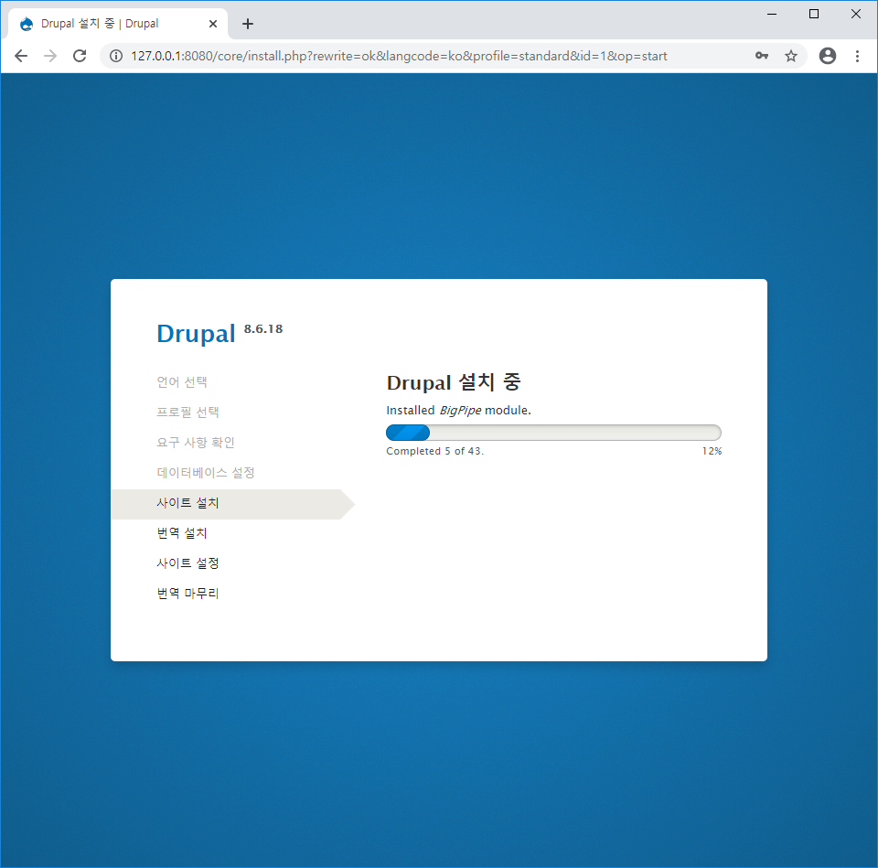

# Docker Compose - LAB2


`Dockerfile` 생성

```dockerfile
FROM drupal:8.6

RUN apt-get update && apt-get install -y git && rm -rf /var/lib/apt/lists/*

WORKDIR /var/www/html/themes

RUN git clone --branch 8.x-3.x --single-branch --depth 1 https://git.drupal.org/project/bootstrap.git && chown -R www-data:www-data bootstrap

WORKDIR /var/www/html
```


`docker-compose.yml` 파일 생성

```yaml
version: '3'
services:
  drupal:
    image: custom-drupal
    ports:
      - "8080:80"
    volumes:
      - drupal-modules:/var/www/html/modules
      - drupal-profiles:/var/www/html/profiles
      - drupal-sites:/var/www/html/sites
      - drupal-themes:/var/www/html/themes
      - drupal-data:/var/lib/postgresql/data
  postgres:
    image: postgres:9.6
    environment:
      - POSTGRES_DB=drupal
      - POSTGRES_USER=user
      - POSTGRES_PASSWORD=pass
volumes:
  drupal-modules:
  drupal-profiles:
  drupal-sites:
  drupal-themes:
  drupal-data:
```


```bash
$ docker build  -t custom-drupal:latest .
```


```bash
$ docker images
REPOSITORY                           TAG                 IMAGE ID            CREATED             SIZE
custom-drupal                        latest              d058be1e5de2        7 minutes ago       480MB
```


```bash
$ docker-compose up
```


```bash
$ docker ps
CONTAINER ID        IMAGE                    COMMAND                  CREATED             STATUS              PORTS                  NAMES
f4e2555947b6        custom-drupal            "docker-php-entrypoi…"   58 seconds ago      Up 53 seconds       0.0.0.0:8080->80/tcp   compose-assignment-2_drupal_1
ed2d9fa94171        postgres:9.6             "docker-entrypoint.s…"   58 seconds ago      Up 53 seconds       5432/tcp               compose-assignment-2_postgres_1
```


```bash
$ docker exec -it compose-assignment-2_postgres_1 bash
root@ed2d9fa94171:/# hostname -i
172.28.0.3
```


```bash
root@ed2d9fa94171:~# psql -U user drupal
psql (9.6.16)
Type "help" for help.

drupal=#
```


```postgres
drupal=# \l
                             List of databases
   Name    | Owner | Encoding |  Collate   |   Ctype    | Access privileges
-----------+-------+----------+------------+------------+-------------------
 drupal    | user  | UTF8     | en_US.utf8 | en_US.utf8 |
 postgres  | user  | UTF8     | en_US.utf8 | en_US.utf8 |
 template0 | user  | UTF8     | en_US.utf8 | en_US.utf8 | =c/user          +
           |       |          |            |            | user=CTc/user
 template1 | user  | UTF8     | en_US.utf8 | en_US.utf8 | =c/user          +
           |       |          |            |            | user=CTc/user
(4 rows)
```


```bash
drupal=# \q
root@ed2d9fa94171:~#
```





