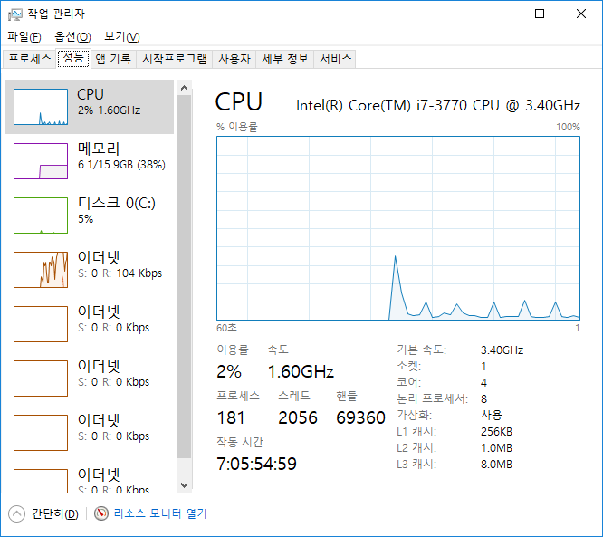
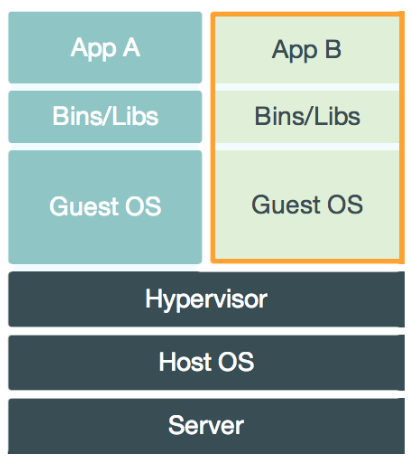
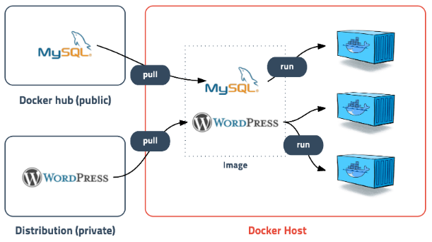
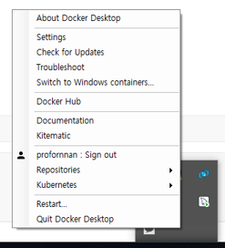
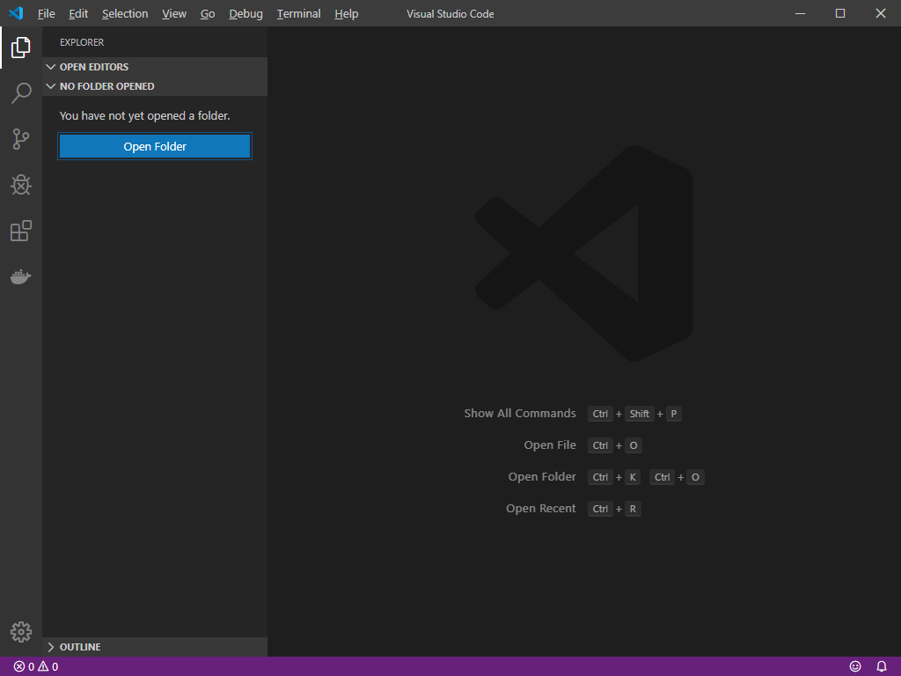
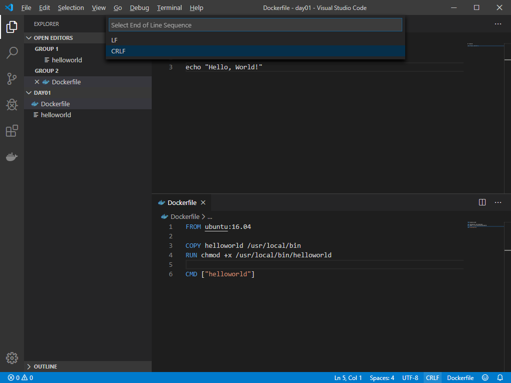

# Docker

## Docker 설치


vi 에디터 사용법 익히기

설정 파일 위치 파악하기

복사, 파일 목록 보기 등 리눅스 관련 명령어 숙지

Vagrant처럼 필요한 이미지, 운영체제등 제공하는 사이트 -> 도커허브

다른 사람과 공유하는 목적은 다른 쪽에 있는 환경에 배포하기 위해 클라우드에 드라이브 같은 걸로 활용한다.


`작업관리자` -> `가상화` 부분 확인



비활성화일 경우 BIOS 환경에서 설정해야 하는 경우도 있다.


웹 서버의 종류 중 ngin X라는 엔진이 있다. ngin X를 설치하려 하면 OS가 있어야하고 그 위에 설치된다. 


책 p5

호스트 운영체제형 가상화 : VirtualBox, VMware

Guest OS가 독립적으로 있다.


컨테이너형 가상화


윈도우의 가상화는 Hyper-V라는 기술을 이용한다.


## Docker

* 2014년 6월 Docker 1.0 발표
* 컨테이너 기반의 오픈소스 가상화 플랫폼
* 백엔드 프로그램, 데이터베이스, 메시지 큐 -> 컨테이너로 추상화 가능
* 일반PC, AWS, Azure, Google cloud 등에서 실행 가능

* VM
  

* Docker
  

* 기존 가상화 방식 -> OS를 가상화
  * VMWare, VirtualBox (Host OS 위에 Guest OS 전체를 가상화)
  * **무겁고 느림**
* CPU의 가상화 기술 이용 방식 -> **Kernel-based Virtual Machine**
  * 전체 OS를 가상화 하지 않음. 호스트 형식에 비해 속도 향상
  * OpenStack, AWS 등의 클라우드 서비스
  * **추가적인 OS**는 여전히 필요. 성능 문제
* 프로세스 격리 -> 리눅스 컨테이너
  * CPU나 메모리는 프로세스에 필요한 만큼만 추가로 사용
  * 성능 손실 거의 없음
  * 컨테이너들 사이는 서로 영향을 주지 않음
  * 컨테이너 생성 속도 빠름 (1-2초 내)


* Docker Hub에 등록 or Docker Registry 저장소를 직접 만들어 관리

  * 공개된 도커 이미지는 50만개 이상, 다운로드 수는 80억회 이상

* Layer 저장방식

  * 유니온 파일 시스템을 이용 -> 여러 개의 Layer를 하나의 파일시스템으로 사용 가능

  

* Docker Image

  * 컨테이너 실행에 필요한 파일과 설정 값 등을 포함 -> 상태값 X, Immutable
  * 실체화 -> Container




---

## 도커 스타일 체험하기(CentOS)

```bash
$ vagrant up node01
```

```bash
[vagrant@node01 ~]$ echo "Hello, World"
Hello, World
[vagrant@node01 ~]$ echo hi there
hi there
```

```bash
[vagrant@node01 ~]$ touch helloworld
[vagrant@node01 ~]$ vi helloworld 
```

```bash
#!/bin/sh

echo "Hello, World!"
```

```bash
[vagrant@node01 ~]$ chmod +x helloworld 
[vagrant@node01 ~]$ ./helloworld 
Hello, World!
[vagrant@node01 ~]$ touch Dockerfile
[vagrant@node01 ~]$ vi Dockerfile
```

```bash
FROM ubuntu:16.04

COPY helloworld /usr/local/bin
RUN cmode +x /usr/local/bin/helloword

CMD ["helloworld']
```

* FROM절 : 컨테이너의 원형(틀) 역할을 할 도커 이미지(운영 체제)를 정의한다. 
* COPY절 : 조금 전 작성한 셸 스크립트 파일(helloworld)을 도커 컨테이너 안의 /usr/local/bin에 복사하라고 정의한 것이다.
* RUN절 : 도커 컨테이너 안에서 어떤 명령을 수행하기 위한 것이다. 여기서는 helloworld 스크립트에 실행 권한을 부여하기 위해 사용했다. 여기까지가 도커 빌드 과정에서 실행되며 그 결과 새로운 이미지가 만들어진다.
* CMD절 : 완성된 이미지를 도커 컨테이너로 실행하기 전에 먼저 실행할 명령을 정의한다.

```bash
[vagrant@node01 ~]$ docker
-bash: docker: command not found
[vagrant@node01 ~]$ cat Dockerfile 
FROM ubuntu:16.04

COPY helloworld /usr/local/bin
RUN cmode +x /usr/local/bin/helloword

CMD ["helloworld']
[vagrant@node01 ~]$ sudo cp helloworld /usr/local/bin
[vagrant@node01 ~]$ sudo chmod +x /usr/local/bin/helloworld 
[vagrant@node01 ~]$ helloworld 
Hello, World!
```


---


## Docker 설치

https://www.docker.com/

https://hub.docker.com/

https://hub.docker.com/editions/community/docker-ce-desktop-windows





sign in


Setting


Advanced

도커가 사용할 수 있는 리소스. 할당된 리소스


Memory 4096MB로 설정


cmd창 열기

```bash
$ docker version
Client: Docker Engine - Community
 Version:           19.03.5
 API version:       1.40
 Go version:        go1.12.12
 Git commit:        633a0ea
 Built:             Wed Nov 13 07:22:37 2019
 OS/Arch:           windows/amd64
 Experimental:      false

Server: Docker Engine - Community
 Engine:
  Version:          19.03.5
  API version:      1.40 (minimum version 1.12)
  Go version:       go1.12.12
  Git commit:       633a0ea
  Built:            Wed Nov 13 07:29:19 2019
  OS/Arch:          linux/amd64
  Experimental:     false
 containerd:
  Version:          v1.2.10
  GitCommit:        b34a5c8af56e510852c35414db4c1f4fa6172339
 runc:
  Version:          1.0.0-rc8+dev
  GitCommit:        3e425f80a8c931f88e6d94a8c831b9d5aa481657
 docker-init:
  Version:          0.18.0
  GitCommit:        fec3683
```

도커 버전을 확인한다.

Docker는 GoLang 으로 만들어져 있다.


```bash
C:\Users\HPE>cd work

C:\Users\HPE\Work>dir
 C 드라이브의 볼륨에는 이름이 없습니다.
 볼륨 일련 번호: A0B4-FAD1

 C:\Users\HPE\Work 디렉터리

2019-12-26  오후 03:22    <DIR>          .
2019-12-26  오후 03:22    <DIR>          ..
2019-12-24  오전 10:17    <DIR>          git
2019-12-26  오후 03:26    <DIR>          mongodb-4.2.2
2019-12-26  오후 03:13       454,525,740 mongodb-4.2.2.zip
2019-12-26  오후 03:15    <DIR>          mysql
2019-12-23  오후 04:27    <DIR>          vagrant
               1개 파일         454,525,740 바이트
               6개 디렉터리  894,891,741,184 바이트 남음

C:\Users\HPE\Work>mkdir docker
C:\Users\HPE\Work>mkdir docker\day01
C:\Users\HPE\Work>cd docker\day01
```



Open Folder


New File

```bash
#! /bin/sh

echo "Hello, World!"
```


```bash
FROM ubuntu:16.04

COPY helloworld /usr/local/bin
RUN chmod +x /usr/local/bin/helloworld

CMD ["helloworld"]
```


만약 highlight가 되지 않는다면 Extensions -> docker검색


```bash
C:\Users\HPE\Work\docker\day01>dir
 C 드라이브의 볼륨에는 이름이 없습니다.
 볼륨 일련 번호: A0B4-FAD1

 C:\Users\HPE\Work\docker\day01 디렉터리

2019-12-30  오후 04:13    <DIR>          .
2019-12-30  오후 04:13    <DIR>          ..
2019-12-30  오후 04:15               113 Dockerfile
2019-12-30  오후 04:15                34 helloworld
               2개 파일                 147 바이트
               2개 디렉터리  894,935,347,200 바이트 남음

```


보통 태그 이름에 버전을 많이 쓴다.

현재 디렉토리에 있는 docker파일


ubuntu 16.04를 다운받는 것을 확인할 수 있다.

```bash
C:\Users\HPE\Work\docker\day01>docker image build -t helloworld:latest .
Sending build context to Docker daemon  3.072kB
Step 1/4 : FROM ubuntu:16.04
16.04: Pulling from library/ubuntu
3386e6af03b0: Pull complete
49ac0bbe6c8e: Pull complete
d1983a67e104: Pull complete
1a0f3a523f04: Pull complete
Digest: sha256:181800dada370557133a502977d0e3f7abda0c25b9bbb035f199f5eb6082a114
Status: Downloaded newer image for ubuntu:16.04
 ---> c6a43cd4801e
Step 2/4 : COPY helloworld /usr/local/bin
 ---> 27f808d588d5
Step 3/4 : RUN chmod +x /usr/local/bin/helloworld
 ---> Running in 9ab224640da4
Removing intermediate container 9ab224640da4
 ---> 3bfff0fc3f8b
Step 4/4 : CMD ["helloworld"]
 ---> Running in 0b79b251e298
Removing intermediate container 0b79b251e298
 ---> 76f368ba1a89
Successfully built 76f368ba1a89
Successfully tagged helloworld:latest
SECURITY WARNING: You are building a Docker image from Windows against a non-Windows Docker host. All files and directories added to build context will have '-rwxr-xr-x' permissions. It is recommended to double check and reset permissions for sensitive files and directories.
```

```bash
C:\Users\HPE\Work\docker\day01>docker image ls
REPOSITORY          TAG                 IMAGE ID            CREATED             SIZE
helloworld          latest              76f368ba1a89        41 seconds ago      123MB
ubuntu              16.04               c6a43cd4801e        11 days ago         123MB
```

ubuntu 16.04와 helloworld라는 이미지가 생성되었다.

IMAGE ID값은 유니크한 값


Docker Hub 사이트에서 ubuntu  검색


docker에서 공식적으로 제공하고 있는 이미지 파일


```bash
C:\Users\HPE\Work\docker\day01>docker container run helloworld:latest

```

run은 create와 start가 혼합되어있는 명령어이다.

없으면 생성, 있으면 시작


```bash
C:\Users\HPE\Work\docker\day01>docker image ls
REPOSITORY          TAG                 IMAGE ID            CREATED             SIZE
helloworld          latest              76f368ba1a89        24 minutes ago      123MB
ubuntu              16.04               c6a43cd4801e        11 days ago         123MB

C:\Users\HPE\Work\docker\day01>docker rmi 76f368ba1a89
Error response from daemon: conflict: unable to delete 76f368ba1a89 (must be forced) - image is being used by stopped container 2b75ab24f1ab


```


```bash
C:\Users\HPE\Work\docker\day01>docker container run hello-world
Unable to find image 'hello-world:latest' locally
latest: Pulling from library/hello-world
1b930d010525: Pull complete
Digest: sha256:4fe721ccc2e8dc7362278a29dc660d833570ec2682f4e4194f4ee23e415e1064
Status: Downloaded newer image for hello-world:latest

Hello from Docker!
This message shows that your installation appears to be working correctly.

To generate this message, Docker took the following steps:
 1. The Docker client contacted the Docker daemon.
 2. The Docker daemon pulled the "hello-world" image from the Docker Hub.
    (amd64)
 3. The Docker daemon created a new container from that image which runs the
    executable that produces the output you are currently reading.
 4. The Docker daemon streamed that output to the Docker client, which sent it
    to your terminal.

To try something more ambitious, you can run an Ubuntu container with:
 $ docker run -it ubuntu bash

Share images, automate workflows, and more with a free Docker ID:
 https://hub.docker.com/

For more examples and ideas, visit:
 https://docs.docker.com/get-started/
```


```bash
C:\Users\HPE\Work\docker\day01>docker image ls
C:\Users\HPE\Work\docker\day01>docker images
REPOSITORY          TAG                 IMAGE ID            CREATED             SIZE
helloworld          latest              76f368ba1a89        31 minutes ago      123MB
ubuntu              16.04               c6a43cd4801e        11 days ago         123MB
hello-world         latest              fce289e99eb9        12 months ago       1.84kB
```


```bash
C:\Users\HPE\Work\docker\day01>docker container ls
CONTAINER ID        IMAGE               COMMAND             CREATED             STATUS              PORTS               NAMES

C:\Users\HPE\Work\docker\day01>docker ps
CONTAINER ID        IMAGE               COMMAND             CREATED             STATUS              PORTS               NAMES
```


```bash
C:\Users\HPE\Work\docker\day01>docker run hello-world

Hello from Docker!
This message shows that your installation appears to be working correctly.

To generate this message, Docker took the following steps:
 1. The Docker client contacted the Docker daemon.
 2. The Docker daemon pulled the "hello-world" image from the Docker Hub.
    (amd64)
 3. The Docker daemon created a new container from that image which runs the
    executable that produces the output you are currently reading.
 4. The Docker daemon streamed that output to the Docker client, which sent it
    to your terminal.

To try something more ambitious, you can run an Ubuntu container with:
 $ docker run -it ubuntu bash

Share images, automate workflows, and more with a free Docker ID:
 https://hub.docker.com/

For more examples and ideas, visit:
 https://docs.docker.com/get-started/
```


컨테이너 이미지를 만들어 실행할 수 있다.


```bash
C:\Users\HPE\Work\docker\day01>docker run ubuntu:16.04
```


```bash
C:\Users\HPE\Work\docker\day01>docker run -it ubuntu:16.04 /bin/bash
root@85d3ac04c68a:/# ls -al
total 72
drwxr-xr-x   1 root root 4096 Dec 30 07:54 .
drwxr-xr-x   1 root root 4096 Dec 30 07:54 ..
-rwxr-xr-x   1 root root    0 Dec 30 07:54 .dockerenv
drwxr-xr-x   2 root root 4096 Dec 12 01:51 bin
drwxr-xr-x   2 root root 4096 Apr 12  2016 boot
drwxr-xr-x   5 root root  360 Dec 30 07:54 dev
drwxr-xr-x   1 root root 4096 Dec 30 07:54 etc
drwxr-xr-x   2 root root 4096 Apr 12  2016 home
drwxr-xr-x   8 root root 4096 Sep 13  2015 lib
drwxr-xr-x   2 root root 4096 Dec 12 01:51 lib64
drwxr-xr-x   2 root root 4096 Dec 12 01:51 media
drwxr-xr-x   2 root root 4096 Dec 12 01:51 mnt
drwxr-xr-x   2 root root 4096 Dec 12 01:51 opt
dr-xr-xr-x 142 root root    0 Dec 30 07:54 proc
drwx------   2 root root 4096 Dec 12 01:51 root
drwxr-xr-x   1 root root 4096 Dec 12 01:51 run
drwxr-xr-x   1 root root 4096 Dec 19 04:24 sbin
drwxr-xr-x   2 root root 4096 Dec 12 01:51 srv
dr-xr-xr-x  13 root root    0 Dec 30 07:54 sys
drwxrwxrwt   2 root root 4096 Dec 12 01:51 tmp
drwxr-xr-x   1 root root 4096 Dec 12 01:51 usr
drwxr-xr-x   1 root root 4096 Dec 12 01:51 var
```


```bash
root@85d3ac04c68a:/# hostname
85d3ac04c68a
```


리눅스 컨테이너로 이동. 커맨드 입력 가능하게 되었다.


다른 cmd 열기

```bash
C:\Users\HPE>docker ps
CONTAINER ID        IMAGE               COMMAND             CREATED              STATUS              PORTS               NAMES
85d3ac04c68a        ubuntu:16.04        "/bin/bash"         About a minute ago   Up About a minute                       magical_joliot
```


다른 cmd 열기

```bash
C:\Users\HPE>docker run -it ubuntu:16.04 /bin/bash
root@36cf763f2ef1:/#
```


두 가지 ubuntu가 생겼다. 서로 독립적으로 움직인다.


```bash
C:\Users\HPE>docker ps
CONTAINER ID        IMAGE               COMMAND             CREATED             STATUS              PORTS               NAMES
36cf763f2ef1        ubuntu:16.04        "/bin/bash"         29 seconds ago      Up 27 seconds                           goofy_bhaskara
85d3ac04c68a        ubuntu:16.04        "/bin/bash"         3 minutes ago       Up 3 minutes                            magical_joliot
```

2개의 이미지가 동작하는 것을 확인할 수 있다.


하나의 ubuntu에 testfile을 만들고 확인해보면 다른 ubuntu에는 보이지 않는 것을 확인할 수 있다. 서로 독립적인 ubuntu이다.


docker image 삭제하기

```bash
C:\Users\HPE\Work\docker\day01>docker image ls
REPOSITORY          TAG                 IMAGE ID            CREATED             SIZE
helloworld          latest              76f368ba1a89        45 minutes ago      123MB
ubuntu              16.04               c6a43cd4801e        11 days ago         123MB
hello-world         latest              fce289e99eb9        12 months ago       1.84kB

C:\Users\HPE\Work\docker\day01>docker rmi 76f368ba1a89 2b75ab24f1ab
Error response from daemon: conflict: unable to delete 76f368ba1a89 (must be forced) - image is being used by stopped container ad8afe776611
Error: No such image: 2b75ab24f1ab

C:\Users\HPE\Work\docker\day01>docker rmi -f 76f368ba1a89 2b75ab24f1ab
Untagged: helloworld:latest
Deleted: sha256:76f368ba1a89519614514acd291d1014b51a045d674757282c8f6009ee152175
Deleted: sha256:3bfff0fc3f8b1249a1c78b867493303c0962c32dd2077c3453658441848b3b05
Deleted: sha256:27f808d588d59b72a35cdb7dbb0e7332e2b9a6a40d6501e319be6b6e0df1635a
Error: No such image: 2b75ab24f1ab
```

-f 옵션은 강제 삭제


도커

이미지와 컨테이너가 존재

컨테이너는 이미지가 있어야 만들어지는 실체화된 내용이다.


```bash
C:\Users\HPE>docker ps -a
CONTAINER ID        IMAGE               COMMAND             CREATED             STATUS                      PORTS               NAMES
6aeb4e1be9d3        ubuntu:16.04        "/bin/bash"         2 minutes ago       Up 2 minutes                                    pedantic_cannon
36cf763f2ef1        ubuntu:16.04        "/bin/bash"         11 minutes ago      Up 11 minutes                                   goofy_bhaskara
85d3ac04c68a        ubuntu:16.04        "/bin/bash"         14 minutes ago      Exited (0) 5 minutes ago                        magical_joliot
025cf1aecdb7        ubuntu:16.04        "/bin/bash"         16 minutes ago      Exited (0) 16 minutes ago                       objective_kowalevski
30ac6edf0baf        hello-world         "/hello"            18 minutes ago      Exited (0) 18 minutes ago                       angry_mendeleev
f11a2ba9e299        hello-world         "/hello"            21 minutes ago      Exited (0) 21 minutes ago                       pedantic_zhukovsky
ad8afe776611        76f368ba1a89        "helloworld"        36 minutes ago      Exited (1) 36 minutes ago                       optimistic_jones
2b75ab24f1ab        76f368ba1a89        "helloworld"        38 minutes ago      Exited (1) 38 minutes ago                       friendly_elion
```

지금까지 실행되었던 인스턴스들을 확인할 수 있다.


컨테이너 삭제 -> rm

이미지 삭제 -> rmi

```bash
$ docker stop

$ docker rm

$ docker rmi
```


```bash
C:\Users\HPE>docker ps
CONTAINER ID        IMAGE               COMMAND             CREATED             STATUS              PORTS               NAMES
6aeb4e1be9d3        ubuntu:16.04        "/bin/bash"         3 minutes ago       Up 3 minutes                            pedantic_cannon
36cf763f2ef1        ubuntu:16.04        "/bin/bash"         13 minutes ago      Up 12 minutes                           goofy_bhaskara
```

작동중인 컨테이너 확인


```bash
C:\Users\HPE>docker stop 6e
Error response from daemon: No such container: 6e

C:\Users\HPE>docker rm 6e
Error: No such container: 6e

C:\Users\HPE>docker rm 6e
Error: No such container: 6e

C:\Users\HPE>docker ps -a
CONTAINER ID        IMAGE               COMMAND             CREATED             STATUS                      PORTS               NAMES
6aeb4e1be9d3        ubuntu:16.04        "/bin/bash"         5 minutes ago       Up 5 minutes                                    pedantic_cannon
36cf763f2ef1        ubuntu:16.04        "/bin/bash"         14 minutes ago      Up 14 minutes                                   goofy_bhaskara
85d3ac04c68a        ubuntu:16.04        "/bin/bash"         17 minutes ago      Exited (0) 8 minutes ago                        magical_joliot
025cf1aecdb7        ubuntu:16.04        "/bin/bash"         19 minutes ago      Exited (0) 19 minutes ago                       objective_kowalevski
30ac6edf0baf        hello-world         "/hello"            21 minutes ago      Exited (0) 21 minutes ago                       angry_mendeleev
f11a2ba9e299        hello-world         "/hello"            24 minutes ago      Exited (0) 24 minutes ago                       pedantic_zhukovsky
ad8afe776611        76f368ba1a89        "helloworld"        39 minutes ago      Exited (1) 39 minutes ago                       optimistic_jones
2b75ab24f1ab        76f368ba1a89        "helloworld"        41 minutes ago      Exited (1) 41 minutes ago                       friendly_elion

C:\Users\HPE>docker rm 2b ad f1 30 02 85 36 6e
2b
ad
f1
30
02
85
Error response from daemon: You cannot remove a running container 36cf763f2ef1933d0b7a70a9f6730c805c9ea89354c8a81ae7143744971c4ad9. Stop the container before attempting removal or force remove
Error: No such container: 6e
```


```bash
C:\Users\HPE>docker ps -a
CONTAINER ID        IMAGE               COMMAND             CREATED             STATUS              PORTS               NAMES
6aeb4e1be9d3        ubuntu:16.04        "/bin/bash"         7 minutes ago       Up 7 minutes                            pedantic_cannon
36cf763f2ef1        ubuntu:16.04        "/bin/bash"         16 minutes ago      Up 16 minutes                           goofy_bhaskara

C:\Users\HPE>docker stop 6aeb4e1be9d3 36cf763f2ef1
6aeb4e1be9d3
36cf763f2ef1

C:\Users\HPE>docker rm 6aeb4e1be9d3 36cf763f2ef1
6aeb4e1be9d3
36cf763f2ef1

C:\Users\HPE>docker ps -a
CONTAINER ID        IMAGE               COMMAND             CREATED             STATUS              PORTS               NAMES
```




둘 다 lf로만 선택 -> 저장


```bash
C:\Users\HPE>docker images
REPOSITORY          TAG                 IMAGE ID            CREATED             SIZE
ubuntu              16.04               c6a43cd4801e        11 days ago         123MB
hello-world         latest              fce289e99eb9        12 months ago       1.84kB

C:\Users\HPE>docker rmi c6 fc
Untagged: ubuntu:16.04
Untagged: ubuntu@sha256:181800dada370557133a502977d0e3f7abda0c25b9bbb035f199f5eb6082a114
Deleted: sha256:c6a43cd4801e1cf8832aa1dcda0df1f3730eea7e805be27b24cff32b007a919e
Deleted: sha256:7cdf8968022e5ad1324543c5d43db8442cb4b6371393d1749875a680ff61c0f3
Deleted: sha256:a2427c33a3d31bc0eb341b83f535db40e0a87692cdc16a94e3f538f21b90f345
Deleted: sha256:631b71568d5b1b433e4395f6f748d9095794975743ab17d1fb927e8a21914302
Deleted: sha256:91d23cf5425acce8ca4402d83139cec63a5547d1a704af63478df008f9b2e4e0
Untagged: hello-world:latest
Untagged: hello-world@sha256:4fe721ccc2e8dc7362278a29dc660d833570ec2682f4e4194f4ee23e415e1064
Deleted: sha256:fce289e99eb9bca977dae136fbe2a82b6b7d4c372474c9235adc1741675f587e
Deleted: sha256:af0b15c8625bb1938f1d7b17081031f649fd14e6b233688eea3c5483994a66a3

C:\Users\HPE>docker images
REPOSITORY          TAG                 IMAGE ID            CREATED             SIZE
```


docker image build -t helloworld:latest .

```bash
C:\Users\HPE>cd Work\docker\day01

C:\Users\HPE\Work\docker\day01>docker image build -t helloworld:latest .
Sending build context to Docker daemon  3.072kB
Step 1/4 : FROM ubuntu:16.04
16.04: Pulling from library/ubuntu
3386e6af03b0: Pull complete
49ac0bbe6c8e: Pull complete
d1983a67e104: Pull complete
1a0f3a523f04: Pull complete
Digest: sha256:181800dada370557133a502977d0e3f7abda0c25b9bbb035f199f5eb6082a114
Status: Downloaded newer image for ubuntu:16.04
 ---> c6a43cd4801e
Step 2/4 : COPY helloworld /usr/local/bin
 ---> db51eace0237
Step 3/4 : RUN chmod +x /usr/local/bin/helloworld
 ---> Running in 85c7f6bcd7b0
Removing intermediate container 85c7f6bcd7b0
 ---> 7869d7eef6a3
Step 4/4 : CMD ["helloworld"]
 ---> Running in 0e32f0df7166
Removing intermediate container 0e32f0df7166
 ---> c137072f00e5
Successfully built c137072f00e5
Successfully tagged helloworld:latest
SECURITY WARNING: You are building a Docker image from Windows against a non-Windows Docker host. All files and directories added to build context will have '-rwxr-xr-x' permissions. It is recommended to double check and reset permissions for sensitive files and directories.
```


docker container run helloworld:latest

```bash
C:\Users\HPE\Work\docker\day01>docker container run helloworld:latest
Hello, World!
```


docker ps

docker ps -a


```bash
C:\Users\HPE\Work\docker\day01>docker ps
CONTAINER ID        IMAGE               COMMAND             CREATED             STATUS              PORTS               NAMES

C:\Users\HPE\Work\docker\day01>docker ps -a
CONTAINER ID        IMAGE               COMMAND             CREATED             STATUS                     PORTS               NAMES
dfd2dc12b2a9        helloworld:latest   "helloworld"        7 minutes ago       Exited (0) 7 minutes ago                       unruffled_jones
```


docker run helloworld:latest

```bash
C:\Users\HPE\Work\docker\day01>docker run helloworld:latest
Hello, World!
```


책 p35


---

```bash
docker image pull gihyodocker/echo:latest
C:\Users\HPE>docker image pull gihyodocker/echo:latest
latest: Pulling from gihyodocker/echo
723254a2c089: Pull complete
abe15a44e12f: Pull complete
409a28e3cc3d: Pull complete
503166935590: Pull complete
abe52c89597f: Pull complete
ce145c5cf4da: Pull complete
96e333289084: Pull complete
39cd5f38ffb8: Pull complete
22860d04f4f1: Pull complete
7528760e0a03: Pull complete
Digest: sha256:4520b6a66d2659dea2f8be5245eafd5434c954485c6c1ac882c56927fe4cec84
Status: Downloaded newer image for gihyodocker/echo:latest
docker.io/gihyodocker/echo:latest
```

앞에 있는 계정 사이트에서 echo라는 이름의 이미지를 가져오겠다.

중복되어 있다면 재사용


docker images

```bash
C:\Users\HPE>docker images
REPOSITORY          TAG                 IMAGE ID            CREATED             SIZE
helloworld          latest              c137072f00e5        19 minutes ago      123MB
ubuntu              16.04               c6a43cd4801e        11 days ago         123MB
gihyodocker/echo    latest              3dbbae6eb30d        24 months ago       733MB
```


docker run -t -p 9000:8080 gihyodocker/echo:latest

```bash
C:\Users\HPE>docker run -t -p 9000:8080 gihyodocker/echo:latest
2019/12/30 08:43:42 start server
```


create, start 해준다.

-t 옵션은 TTY. 터미널 화면을 띄워주는 역할

-p는 외부에서 사용할 때에는 9000번으로 사용하겠다는 것이다. 포트포워딩


크롬을 이용해 localhost:9000 에 접속한다.


새로운 터미널 열어서 프로세스가 살아있는지 확인

docker ps

```bash
C:\Users\HPE>docker ps
CONTAINER ID        IMAGE                     COMMAND                  CREATED              STATUS              PORTS                    NAMES
204fb5083961        gihyodocker/echo:latest   "go run /echo/main.go"   About a minute ago   Up About a minute   0.0.0.0:9000->8080/tcp   interesting_mirzakhani
```

실행시켰던 컨테이너가 작동중인 것을 확인 가능하다


docker stop `container id`

```bash
C:\Users\HPE>docker stop 204fb5083961
204fb5083961
```

위 명령을 실행하면 서버가 중지되는 것을 확인할 수 있다.


docker ps

docker ps -a

```bash
C:\Users\HPE>docker ps
CONTAINER ID        IMAGE               COMMAND             CREATED             STATUS              PORTS               NAMES

C:\Users\HPE>docker ps -a
CONTAINER ID        IMAGE                     COMMAND                  CREATED             STATUS                      PORTS               NAMES
204fb5083961        gihyodocker/echo:latest   "go run /echo/main.go"   2 minutes ago       Exited (2) 50 seconds ago                       interesting_mirzakhani
f42154d2f770        helloworld:latest         "helloworld"             14 minutes ago      Exited (0) 14 minutes ago                       vigilant_leavitt
dfd2dc12b2a9        helloworld:latest         "helloworld"             22 minutes ago      Exited (0) 22 minutes ago                       unruffled_jones
```


docker rm `container id`

전부 삭제

```bash
C:\Users\HPE>docker rm 204fb5083961 f42154d2f770 dfd2dc12b2a9
204fb5083961
f42154d2f770
dfd2dc12b2a9
```


image는 그냥 둔 상태에서

docker run -t -p 9000:8080 gihyodocker/echo:latest

```bash
C:\Users\HPE>docker run -t -p 9000:8080 gihyodocker/echo:latest
2019/12/30 08:47:38 start server
```


---


Day01 밑에 옮겨두기


다운로드 받은 이미지에 echo라는 폴더 만든다

이미지를 가져오기

디렉토리 카피

실행


go lang이 설치되어 있다면

go run main.go


docker image build -t example/echo:latest .

```bash
C:\Users\HPE>cd Work\docker\day01

C:\Users\HPE\Work\docker\day01>cd go

C:\Users\HPE\Work\docker\day01\go>docker image build -t example/echo:latest .
```


p42 명령어

도커 이미지 확인


docker images

````bash
C:\Users\HPE\Work\docker\day01\go>docker images
REPOSITORY          TAG                 IMAGE ID            CREATED             SIZE
example/echo        latest              e0acd596dbeb        35 seconds ago      750MB
helloworld          latest              c137072f00e5        35 minutes ago      123MB
ubuntu              16.04               c6a43cd4801e        11 days ago         123MB
golang              1.9                 ef89ef5c42a9        17 months ago       750MB
gihyodocker/echo    latest              3dbbae6eb30d        24 months ago       733MB
````


docker run -t -p 10000:8080 example/echo:latest

```bash
C:\Users\HPE\Work\docker\day01\go>docker run -t -p 10000:8080 example/echo:latest
2019/12/30 08:58:56 start server
```


다른 cmd창

```bash
C:\Users\HPE>docker ps
CONTAINER ID        IMAGE                     COMMAND                  CREATED             STATUS              PORTS                     NAMES
8e50483ef64c        example/echo:latest       "go run /echo/main.go"   32 seconds ago      Up 29 seconds       0.0.0.0:10000->8080/tcp   modest_bhaskara
159fe53d2774        gihyodocker/echo:latest   "go run /echo/main.go"   11 minutes ago      Up 11 minutes       0.0.0.0:9000->8080/tcp    boring_mclean
```


크롬에서 확인


docker ps -> ID 복사


docker exec -it 8e50483ef64c bash

```bash
C:\Users\HPE>docker exec -it 8e50483ef64c bash
root@8e50483ef64c:/go#
```


```bash
root@8e50483ef64c:/go# ls /echo/main.go
/echo/main.go
```

go run main.go 라는 명령으로 실행했다.


```bash
C:\Users\HPE>docker ps
CONTAINER ID        IMAGE                     COMMAND                  CREATED             STATUS              PORTS                     NAMES
8e50483ef64c        example/echo:latest       "go run /echo/main.go"   4 minutes ago       Up 4 minutes        0.0.0.0:10000->8080/tcp   modest_bhaskara
159fe53d2774        gihyodocker/echo:latest   "go run /echo/main.go"   15 minutes ago      Up 15 minutes       0.0.0.0:9000->8080/tcp    boring_mclean
```


```bash
C:\Users\HPE>docker stop 8e50483ef64c 159fe53d2774
8e50483ef64c
159fe53d2774
```


```bash
C:\Users\HPE>docker rm 8e50483ef64c 159fe53d2774
8e50483ef64c
159fe53d2774
```


```bash
C:\Users\HPE>docker ps
CONTAINER ID        IMAGE               COMMAND             CREATED             STATUS              PORTS               NAMES
```

