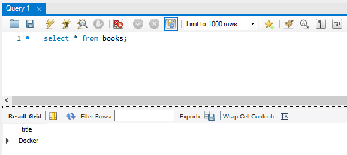

# Docker


## Docker Lifecycle

3가지 라이프사이클

이미지 상태 . 사용할 수 없다.

사용할 수 있는 인스턴스 상태로 만든 것이 컨테이너. 이미지를 컨테이너화 시키기 위해서 create와 start가 필요하다. run은 두 가지 포함.

컨테이너가 되어있으면 사용할 수 있다.

start -> stop -> remove

컨테이터를 remove하게 되면 images 상태로 간다. image도 삭제 가능

이미지 삭제 -> rmi

컨테이너 삭제 -> rm


프로세스  확인(정지된 것 포함)

docker ps -a


전체 이미지 목록 확인

docker images


```bash
C:\Users\HPE>docker images
REPOSITORY          TAG                 IMAGE ID            CREATED             SIZE
example/echo        latest              e0acd596dbeb        15 hours ago        750MB
helloworld          latest              c137072f00e5        16 hours ago        123MB
ubuntu              16.04               c6a43cd4801e        11 days ago         123MB
golang              1.9                 ef89ef5c42a9        17 months ago       750MB
gihyodocker/echo    latest              3dbbae6eb30d        24 months ago       733MB
```


```bash
C:\Users\HPE>docker rmi c137072f00e5
Untagged: helloworld:latest
Deleted: sha256:c137072f00e5e640736f84c7cb3bb1b81535c0a625de551685cb0fe13b54ea64
Deleted: sha256:7869d7eef6a36aec6946035dc4fdbb4e40a76f75aa77677bf67b91bc88511b95
Deleted: sha256:08a57e114809d35183d246ad540d8c113ff8bfaba40442022139c48e332bcbed
Deleted: sha256:db51eace02376fbe792e4168c728ae83b685f0da454c2a1d2736a3c53ee4e14e
Deleted: sha256:1d61a862103ea6fdd646804cf7664726323cec0da4d422c06153a6cc20497364
```


```bash
C:\Users\HPE>docker images
REPOSITORY          TAG                 IMAGE ID            CREATED             SIZE
example/echo        latest              e0acd596dbeb        15 hours ago        750MB
ubuntu              16.04               c6a43cd4801e        11 days ago         123MB
golang              1.9                 ef89ef5c42a9        17 months ago       750MB
gihyodocker/echo    latest              3dbbae6eb30d        24 months ago       733MB
```


이미지 빌드

docker build -t example/echo:latest .

레파지토리 이름과 테그 이름 설정 가능

버전을 테깅 가능하다


현재 디렉토리에 있는 Dockerfile을 이용하기 위해서 . 을 붙인다.

```bash
C:\Users\HPE>cd Work\docker\day01

C:\Users\HPE\Work\docker\day01>cd go

C:\Users\HPE\Work\docker\day01\go>docker build -t example/echo:latest .
Sending build context to Docker daemon  3.072kB
Step 1/4 : FROM golang:1.9
 ---> ef89ef5c42a9
Step 2/4 : RUN mkdir /echo
 ---> Running in d070b10c8fdc
Removing intermediate container d070b10c8fdc
 ---> 7ba5240650d8
Step 3/4 : COPY main.go /echo
 ---> 1e37cc713d1a
Step 4/4 : CMD ["go", "run", "/echo/main.go"]
 ---> Running in 3c143ac84ce5
Removing intermediate container 3c143ac84ce5
 ---> 449ef93a8a43
Successfully built 449ef93a8a43
Successfully tagged example/echo:latest
SECURITY WARNING: You are building a Docker image from Windows against a non-Windows Docker host. All files and directories added to build context will have '-rwxr-xr-x' permissions. It is recommended to double check and reset permissions for sensitive files and directories.
```


Dockerfile

```bash
FROM golang:1.9

RUN mkdir /echo
COPY main.go /echo

CMD ["go", "run", "/echo/main.go"]
```


FROM: 이미지 base를 다운로드 받아 오는 것이다.

어플리케이션을 실행하기 위해 운영체제가 필요하다. OS의 기능이 다 필요하지 않다. 최소한 필요한 정보가 있기는 하지만 다 필요하지는 않다.

golang을 커널 정보, 파일 시스템 정보 등이 필요하지만 OS의 기능 다 필요하지 않다.

우리가 쓰고 있는 Host OS의 정말 필요한 부분만 사용하겠다고 하고, 그것이 이미지이다.

golang이라는 이름의 1.9 테그를 가지는 이미지를 가져오겠다는 것이다.

도커 프로세스를 실행하려면 이미지가 있어야 한다.

기본 베이스되는 이미지가 있다.

파일 시스템, 커널 정보 등을 핵심적인 정보를 가지고 있는 실행 파일을 이미지라고 한다.

이미지 파일은 그 자체로 사용하는 것이 아니라 컨테이너로 인스턴스화 시킨 다음에 사용한다.


RUN: 커맨드를 실행한다. 이미지 최상단에 /echo라는 디렉토리를 만들어라

main.go라는 파일을 COPY하겠다. Dockerfile에 같이 있다. 

내리고싶은 명령어가 있으면 CMD에 적는다. 명령어를 순서대로 실행

main.go라는 파일 실행


base가 있어야 다운로드 받는다.


```bash
FROM golang:1.10

RUN mkdir /echo
COPY main.go /echo

CMD ["go", "run", "/echo/main.go"]
```


```bash
C:\Users\HPE\Work\docker\day01\go>docker images
REPOSITORY          TAG                 IMAGE ID            CREATED             SIZE
example/echo        latest              7e9ccc46dc9b        6 seconds ago       750MB
ubuntu              16.04               c6a43cd4801e        11 days ago         123MB
golang              1.9                 ef89ef5c42a9        17 months ago       750MB
gihyodocker/echo    latest              3dbbae6eb30d        24 months ago       733MB

C:\Users\HPE\Work\docker\day01\go>docker build -t example/echo:0.10 .
Sending build context to Docker daemon  3.072kB
Step 1/4 : FROM golang:1.10
1.10: Pulling from library/golang
741437d97401: Pull complete
34d8874714d7: Pull complete
0a108aa26679: Pull complete
7f0334c36886: Pull complete
d35724ed4672: Pull complete
c0eaf021aeaf: Pull complete
d3d9c96611f1: Pull complete
Digest: sha256:6d5e79878a3e4f1b30b7aa4d24fb6ee6184e905a9b172fc72593935633be4c46
Status: Downloaded newer image for golang:1.10
 ---> 6fd1f7edb6ab
Step 2/4 : RUN mkdir /echo
 ---> Running in 2cd0b2651932
Removing intermediate container 2cd0b2651932
 ---> bab0afab14c8
Step 3/4 : COPY main.go /echo
 ---> f0958d92c49e
Step 4/4 : CMD ["go", "run", "/echo/main.go"]
 ---> Running in 3ef177faaf21
Removing intermediate container 3ef177faaf21
 ---> e4cb4054a6dc
Successfully built e4cb4054a6dc
Successfully tagged example/echo:0.10
SECURITY WARNING: You are building a Docker image from Windows against a non-Windows Docker host. All files and directories added to build context will have '-rwxr-xr-x' permissions. It is recommended to double check and reset permissions for sensitive files and directories.

C:\Users\HPE\Work\docker\day01\go>docker images
REPOSITORY          TAG                 IMAGE ID            CREATED              SIZE
example/echo        0.10                e4cb4054a6dc        8 seconds ago        760MB
example/echo        latest              7e9ccc46dc9b        About a minute ago   750MB
ubuntu              16.04               c6a43cd4801e        11 days ago          123MB
golang              1.10                6fd1f7edb6ab        10 months ago        760MB
golang              1.9                 ef89ef5c42a9        17 months ago        750MB
gihyodocker/echo    latest              3dbbae6eb30d        24 months ago        733MB
```


서버 기동

```bash
C:\Users\HPE\Work\docker\day01\go>docker run example/echo:latest
2019/12/31 00:46:43 start server
```


새로운 콘솔 열기

```bash
C:\Users\HPE>docker ps
CONTAINER ID        IMAGE                 COMMAND                  CREATED             STATUS              PORTS               NAMES
0b0e74035e8e        example/echo:latest   "go run /echo/main.go"   26 seconds ago      Up 23 seconds                           admiring_khayyam
```


main.go 파일

```bash
package main

import (
	"fmt"
	"log"
	"net/http"
)

func main() {
	http.HandleFunc("/", func(w http.ResponseWriter, r *http.Request) {
		log.Println("received request")
		fmt.Fprintf(w, "Hello Docker!!")
	})

	log.Println("start server")
	server := &http.Server{Addr: ":8080"}
	if err := server.ListenAndServe(); err != nil {
		log.Println(err)
	}
}

```

:8080번 포트 번호를 가지고 웹 서버가 실행된다.


8080 포트는 도커에 있기 때문에 에러가 뜬다.

Ctrl+C를 누르면 프로세스가 죽지 않는 경우가 있다. 정확하게 삭제를 하려면 docker ps로 컨테이너의 ID를 확인하고 docker stop 컨테이너ID를 이용한다.


```bash
C:\Users\HPE>docker ps
CONTAINER ID        IMAGE                 COMMAND                  CREATED             STATUS              PORTS               NAMES
0b0e74035e8e        example/echo:latest   "go run /echo/main.go"   4 minutes ago       Up 4 minutes                            admiring_khayyam

C:\Users\HPE>docker stop 0b0e74035e8e
0b0e74035e8e
```

port가 비어있다.


중지된 프로세스 확인 가능

```bash
C:\Users\HPE>docker ps -a
CONTAINER ID        IMAGE                 COMMAND                  CREATED             STATUS                      PORTS               NAMES
0b0e74035e8e        example/echo:latest   "go run /echo/main.go"   5 minutes ago       Exited (2) 47 seconds ago                       admiring_khayyam
```


```bash
C:\Users\HPE\Work\docker\day01\go>docker run -p 8080 example/echo:latest
2019/12/31 00:52:26 start server
```


다른 콘솔에서 확인

```bash
C:\Users\HPE>docker ps
CONTAINER ID        IMAGE                 COMMAND                  CREATED             STATUS              PORTS                     NAMES
f3854064e730        example/echo:latest   "go run /echo/main.go"   16 seconds ago      Up 13 seconds       0.0.0.0:32768->8080/tcp   busy_hugle
```

포트포워딩이 되어있다. 외부에서 해당 포트로 접속하면 8080으로 연결해준다.


32768에 접속한다.


```bash
C:\Users\HPE\Work\docker\day01\go>docker run -p 9000:8080 example/echo:latest
2019/12/31 00:54:50 start server
```

포트포워딩을 지정해줄 수 있다.


다른 콘솔에서 확인

```bash
C:\Users\HPE>docker ps
CONTAINER ID        IMAGE                 COMMAND                  CREATED             STATUS              PORTS                    NAMES
9d74a54a229f        example/echo:latest   "go run /echo/main.go"   33 seconds ago      Up 31 seconds       0.0.0.0:9000->8080/tcp   vigorous_euler
```


```bash
C:\Users\HPE>docker stop 9d74a54a229f
9d74a54a229f

C:\Users\HPE>docker ps -a
CONTAINER ID        IMAGE                 COMMAND                  CREATED             STATUS                      PORTS               NAMES
9d74a54a229f        example/echo:latest   "go run /echo/main.go"   13 minutes ago      Exited (2) 12 minutes ago                       vigorous_euler
f3854064e730        example/echo:latest   "go run /echo/main.go"   15 minutes ago      Exited (2) 13 minutes ago                       busy_hugle
0b0e74035e8e        example/echo:latest   "go run /echo/main.go"   21 minutes ago      Exited (2) 17 minutes ago                       admiring_khayyam

C:\Users\HPE>docker container start 9d74a54a229f
9d74a54a229f

C:\Users\HPE>docker ps
CONTAINER ID        IMAGE                 COMMAND                  CREATED             STATUS              PORTS                    NAMES
9d74a54a229f        example/echo:latest   "go run /echo/main.go"   13 minutes ago      Up 4 seconds        0.0.0.0:9000->8080/tcp   vigorous_euler
```


가지고 있는 golang:1.9 이미지를 실행시킨다.

```bash
C:\Users\HPE>docker run golang:1.9

C:\Users\HPE>docker ps
CONTAINER ID        IMAGE                 COMMAND                  CREATED             STATUS              PORTS                    NAMES
9d74a54a229f        example/echo:latest   "go run /echo/main.go"   15 minutes ago      Up About a minute   0.0.0.0:9000->8080/tcp   vigorous_euler

C:\Users\HPE>docker ps -a
CONTAINER ID        IMAGE                 COMMAND                  CREATED             STATUS                      PORTS                    NAMES
9751f5d1a6c2        golang:1.9            "bash"                   27 seconds ago      Exited (0) 25 seconds ago                            infallible_wescoff
9d74a54a229f        example/echo:latest   "go run /echo/main.go"   15 minutes ago      Up About a minute           0.0.0.0:9000->8080/tcp   vigorous_euler
f3854064e730        example/echo:latest   "go run /echo/main.go"   17 minutes ago      Exited (2) 15 minutes ago                            busy_hugle
0b0e74035e8e        example/echo:latest   "go run /echo/main.go"   23 minutes ago      Exited (2) 19 minutes ago                            admiring_khayyam
```

실행시켰던 이미지 정상작동 후 중지됨

command 하나 실행하고 바로 중지된다.

해당하는 프로세스를 계속 실행시키기 위해 input command 옵션을 준다.

input command를 보내 프로세스가 중지되지 않도록 한다. t는 tty를 뜻하며 터미널을 실행시켜준다.

```bash
C:\Users\HPE>docker run -it golang:1.9 bash
root@564ae3df5cd6:/go# go version
go version go1.9.7 linux/amd64
```

프롬프트가 바꼈다.

root@564ae3df5cd6

user id @ hostname

go version


다른 터미널 가지고 docker ps

프로세스가 둘 다 살아있는 것을 확인할 수 있다.

```bash
C:\Users\HPE\Work\docker\day01\go>docker ps
CONTAINER ID        IMAGE                 COMMAND                  CREATED             STATUS              PORTS                    NAMES
564ae3df5cd6        golang:1.9            "bash"                   32 seconds ago      Up 30 seconds                                affectionate_mcnulty
9d74a54a229f        example/echo:latest   "go run /echo/main.go"   17 minutes ago      Up 3 minutes        0.0.0.0:9000->8080/tcp   vigorous_euler
```


실행하고자 하는 이미지 뒤에 필요한 커맨드를 쭉 나열해서 전달할 수 있다.

```bash
C:\Users\HPE>docker run -it golang:1.9 go version
go version go1.9.7 linux/amd64
```


```bash
C:\Users\HPE>docker ps -a
CONTAINER ID        IMAGE                 COMMAND                  CREATED             STATUS                      PORTS                    NAMES
f3cb755b87fb        golang:1.9            "go version"             48 seconds ago      Exited (0) 46 seconds ago                            sleepy_nash
564ae3df5cd6        golang:1.9            "bash"                   3 minutes ago       Exited (0) 56 seconds ago                            affectionate_mcnulty
9751f5d1a6c2        golang:1.9            "bash"                   5 minutes ago       Exited (0) 5 minutes ago                             infallible_wescoff
9d74a54a229f        example/echo:latest   "go run /echo/main.go"   20 minutes ago      Up 6 minutes                0.0.0.0:9000->8080/tcp   vigorous_euler
f3854064e730        example/echo:latest   "go run /echo/main.go"   22 minutes ago      Exited (2) 20 minutes ago                            busy_hugle
0b0e74035e8e        example/echo:latest   "go run /echo/main.go"   28 minutes ago      Exited (2) 24 minutes ago                            admiring_khayyam
```

"go version"이라는 명령어를 가지고 실행된 것을 확인할 수 있다.


```bash
C:\Users\HPE>docker run -it golang:1.9 bash
root@9eb0fa331241:/go# ls -al
total 16
drwxrwxrwx 4 root root 4096 Jul 17  2018 .
drwxr-xr-x 1 root root 4096 Dec 31 01:15 ..
drwxrwxrwx 2 root root 4096 Jul 17  2018 bin
drwxrwxrwx 2 root root 4096 Jul 17  2018 src
root@9eb0fa331241:/go# exit
exit
```

```bash
C:\Users\HPE>docker run -it golang:1.9 ls
bin  src
```

뒤에 전달되는 것은 command이다.


Dockerfile 새로 만들기


```bash
FROM golang:1.10

ENTRYPOINT [ "go" ]
CMD [ "" ]
```

ENTRYPOINT: go라는 문장을 가지고 실행을 한다.


Dockerfile을 수정했으므로 빌드를 다시 한다. Dockerfile이 있는 디렉토리에서 실행.

Step 3개

```bash
C:\Users\HPE\Work\docker\day01\go>docker build -t mygolang:1.10 .
Sending build context to Docker daemon  3.072kB
Step 1/3 : FROM golang:1.10
1.10: Pulling from library/golang
741437d97401: Pull complete
34d8874714d7: Pull complete
0a108aa26679: Pull complete
7f0334c36886: Pull complete
d35724ed4672: Pull complete
c0eaf021aeaf: Pull complete
d3d9c96611f1: Pull complete
Digest: sha256:6d5e79878a3e4f1b30b7aa4d24fb6ee6184e905a9b172fc72593935633be4c46
Status: Downloaded newer image for golang:1.10
 ---> 6fd1f7edb6ab
Step 2/3 : ENTRYPOINT [ "go" ]
 ---> Running in 2159c7df69cc
Removing intermediate container 2159c7df69cc
 ---> 6ae12cfb9a9f
Step 3/3 : CMD [ "" ]
 ---> Running in 781579b2a09e
Removing intermediate container 781579b2a09e
 ---> a77536e2e5c5
Successfully built a77536e2e5c5
Successfully tagged mygolang:1.10
SECURITY WARNING: You are building a Docker image from Windows against a non-Windows Docker host. All files and directories added to build context will have '-rwxr-xr-x' permissions. It is recommended to double check and reset permissions for sensitive files and directories.
```


```bash
C:\Users\HPE\Work\docker\day01\go>docker images
REPOSITORY          TAG                 IMAGE ID            CREATED             SIZE
mygolang            1.10                a77536e2e5c5        36 seconds ago      760MB
example/echo        latest              7e9ccc46dc9b        41 minutes ago      750MB
ubuntu              16.04               c6a43cd4801e        11 days ago         123MB
golang              1.10                6fd1f7edb6ab        10 months ago       760MB
golang              1.9                 ef89ef5c42a9        17 months ago       750MB
gihyodocker/echo    latest              3dbbae6eb30d        24 months ago       733MB
```


```bash
C:\Users\HPE\Work\docker\day01\go>docker run mygolang:1.10 version
go version go1.10.8 linux/amd64
```


## 도커 컨테이너 실행하기


```bash
C:\Users\HPE\Work\docker\day01\go>docker run -d -p 9000:8080 example/echo:latest
60bf2f41c7cce0923e5bba23ea7b6f2f0f8545485f8da5123535983b8328a3c1

C:\Users\HPE\Work\docker\day01\go>docker ps
CONTAINER ID        IMAGE                 COMMAND                  CREATED             STATUS              PORTS                    NAMES
60bf2f41c7cc        example/echo:latest   "go run /echo/main.go"   7 seconds ago       Up 5 seconds        0.0.0.0:9000->8080/tcp   musing_rubin
```

`-d` : 데몬을 실행하기 위한 옵션

실행중인 것을 확인 가능


```bash
C:\Users\HPE\Work\docker\day01\go>docker logs 60bf2f41c7cc
2019/12/31 01:29:38 start server
```

log 확인 가능


```bash
C:\Users\HPE\Work\docker\day01\go>docker container ls --filter "ancestor=example/echo"
CONTAINER ID        IMAGE                 COMMAND                  CREATED             STATUS              PORTS                    NAMES
60bf2f41c7cc        example/echo:latest   "go run /echo/main.go"   4 minutes ago       Up 4 minutes        0.0.0.0:9000->8080/tcp   musing_rubin

C:\Users\HPE\Work\docker\day01\go>docker container ls --filter "ancestor=example/echo" -q
60bf2f41c7cc
```


docker stop $(docker container ls --filter "ancestor=example/echo" -q)


실행 -> powershell

기존에 사용하던 명령프롬프트보다 기능이 조금 더 추가된 윈도우가 제공하는 프롬프트

```bash
C:\Users\HPE\Work\docker\day01\go>docker run -d -p 9000:8080 example/echo:latest
bb86aed7a62afd4830e2709a7203a3eaa471ce0745713ef82f9e11306e9a4e81

C:\Users\HPE\Work\docker\day01\go>docker ps
CONTAINER ID        IMAGE                 COMMAND                  CREATED             STATUS              PORTS                    NAMES
bb86aed7a62a        example/echo:latest   "go run /echo/main.go"   4 seconds ago       Up 2 seconds        0.0.0.0:9000->8080/tcp   nifty_black
```

git bash 사용

```bash
HPE@DESKTOP-DFE1UPJ MINGW64 ~
$ docker stop $(docker container ls --filter "ancestor=example/echo" -q)
bb86aed7a62a
```


FROM RUN COPY ENTRYPOINT CMD


docker image build

Dockerfile을 가지고 이미지를 만드는 옵션


```bash
HPE@DESKTOP-DFE1UPJ MINGW64 ~
$ cd Work/docker/day01/go/

HPE@DESKTOP-DFE1UPJ MINGW64 ~/Work/docker/day01/go
$ ls
Dockerfile  main.go

HPE@DESKTOP-DFE1UPJ MINGW64 ~/Work/docker/day01/go
$ docker build -t myimage:latest .

```


```bash
HPE@DESKTOP-DFE1UPJ MINGW64 ~/Work/docker/day01/go
$ docker images
REPOSITORY          TAG                 IMAGE ID            CREATED             SIZE
mygolang            1.10                a77536e2e5c5        21 minutes ago      760MB
example/echo        latest              7e9ccc46dc9b        About an hour ago   750MB
ubuntu              16.04               c6a43cd4801e        11 days ago         123MB
golang              1.10                6fd1f7edb6ab        10 months ago       760MB
golang              1.9                 ef89ef5c42a9        17 months ago       750MB
gihyodocker/echo    latest              3dbbae6eb30d        24 months ago       733MB

HPE@DESKTOP-DFE1UPJ MINGW64 ~/Work/docker/day01/go
$ docker rmi 3dbbae6eb30d
Untagged: gihyodocker/echo:latest
Untagged: gihyodocker/echo@sha256:4520b6a66d2659dea2f8be5245eafd5434c954485c6c1ac882c56927fe4cec84
Deleted: sha256:3dbbae6eb30d76658e7363c361b899b215438e1f42e5fb26e87f9e1d794933e9
Deleted: sha256:55cb31e6fe46aaa8ea17c0ae555dab2df4b74a9f3e60b1067b8b1c4cb89e3836
Deleted: sha256:09bd4267a30df2163cf197f8c4f0e5a5b1cf189d91bb0ccbf6871780b7a0d382
Deleted: sha256:8fbba19729bc8282ef1626c8354fa3256341099b63137fc43582ef4ec53a7536
Deleted: sha256:4c2305e6880cc85563de2c6e5f5def6dd0869fc760e4342390f5cf3cac9c2e6d
Deleted: sha256:855b195755d0176263791bf22d8e13d58aca0b590c76a9292310ae18161bf1f6
Deleted: sha256:4f837f70bd14dd6d9eef8eaab971fd54baa95de6a6d19799fa2ebdb55829ce6a
Deleted: sha256:35b743766cf969889cbb3467c7cfa36bdfc604e4e945f446cc96c8cf589a5ce1
Deleted: sha256:1e427582a181f94999e09606d2b6dac986b3f2c20be1ebc351f22afe20d01df6
Deleted: sha256:a6d2a4d6116a954ef3a8b0db04d785571b7b2c2e3f8e7990e862b11a0deebb1b
Deleted: sha256:e27a10675c5656bafb7bfa9e4631e871499af0a5ddfda3cebc0ac401dfe19382
```


```bash
FROM gihyodocker/basetest:latest

RUN cat /tmp/version
```


```bash
HPE@DESKTOP-DFE1UPJ MINGW64 ~/Work/docker/day01
$ docker build -t gihyodocker/concretetest:latest .
Sending build context to Docker daemon  5.632kB
Step 1/2 : FROM gihyodocker/basetest:latest
latest: Pulling from gihyodocker/basetest
8e3ba11ec2a2: Pulling fs layer
bb6b6468995c: Pulling fs layer
bb6b6468995c: Verifying Checksum
bb6b6468995c: Download complete
8e3ba11ec2a2: Verifying Checksum
8e3ba11ec2a2: Download complete
8e3ba11ec2a2: Pull complete
bb6b6468995c: Pull complete
Digest: sha256:5a302e847e0168b21f947718e186b81b56c03e2ebf60d1ccb920b21b869b7647
Status: Downloaded newer image for gihyodocker/basetest:latest
 ---> ceb8689c406b
Step 2/2 : RUN cat /tmp/version
 ---> Running in 4306c55da84f
version = 2
Removing intermediate container 4306c55da84f
 ---> ed1103c47b53
Successfully built ed1103c47b53
Successfully tagged gihyodocker/concretetest:latest
SECURITY WARNING: You are building a Docker image from Windows against a non-Windows Docker host. All files and directories added to build context will have '-rwxr-xr-x' permissions. It is recommended to double check and reset permissions for sensitive files and directories.
```

2개의 Step

version = 2 확인 가능


빌드되어있는 내용을 이미지로 확인

```bash
HPE@DESKTOP-DFE1UPJ MINGW64 ~/Work/docker/day01
$ docker images
REPOSITORY                 TAG                 IMAGE ID            CREATED              SIZE
gihyodocker/concretetest   latest              ed1103c47b53        About a minute ago   4.41MB
mygolang                   1.10                a77536e2e5c5        27 minutes ago       760MB
example/echo               latest              7e9ccc46dc9b        About an hour ago    750MB
ubuntu                     16.04               c6a43cd4801e        11 days ago          123MB
golang                     1.10                6fd1f7edb6ab        10 months ago        760MB
golang                     1.9                 ef89ef5c42a9        17 months ago        750MB
gihyodocker/basetest       latest              ceb8689c406b        17 months ago        4.41MB
```


빌드를 다시 한다. 기존에 가지고있는 것을 사용한다. 다운로드 받는 과정 생략.

두 번째 라인. version = 2라는 표시가 안되어있다. 현재 시스템 안에 필요한 도커 이미지가 있다면 그것을 사용한다. 만약 도커허브에 새로운 버전이 있다고 해도 시스템 안에 있는 것 사용


```bash
HPE@DESKTOP-DFE1UPJ MINGW64 ~/Work/docker/day01
$ docker build -t gihyodocker/concretetest:latest .
Sending build context to Docker daemon  5.632kB
Step 1/2 : FROM gihyodocker/basetest:latest
 ---> ceb8689c406b
Step 2/2 : RUN cat /tmp/version
 ---> Using cache
 ---> ed1103c47b53
Successfully built ed1103c47b53
Successfully tagged gihyodocker/concretetest:latest
SECURITY WARNING: You are building a Docker image from Windows against a non-Windows Docker host. All files and directories added to build context will have '-rwxr-xr-x' permissions. It is recommended to double check and reset permissions for sensitive files and directories.
```

Using cache

cache 정보를 이용한다.


한번 실행한 뒤 다시 한번 실행하면 시스템에 있는 것 사용

cache를 사용하고 있는지 아닌지 잘 확인해야 한다. 매번 새롭게 다운 받기 위해서 사용하는 옵션이 --pull=true 이다.

```bash
$ docker build --pull=true --no-cache -t gihyodocker/concretetest:latest .
```

cache를 사용하지 않고 새로 받는다.


```bash
HPE@DESKTOP-DFE1UPJ MINGW64 ~/Work/docker/day01
$ docker build --pull=true --no-cache -t gihyodocker/concretetest:latest .
Sending build context to Docker daemon  5.632kB
Step 1/2 : FROM gihyodocker/basetest:latest
latest: Pulling from gihyodocker/basetest
Digest: sha256:5a302e847e0168b21f947718e186b81b56c03e2ebf60d1ccb920b21b869b7647
Status: Image is up to date for gihyodocker/basetest:latest
 ---> ceb8689c406b
Step 2/2 : RUN cat /tmp/version
 ---> Running in 1e523f9bd9a5
version = 2
Removing intermediate container 1e523f9bd9a5
 ---> 818ca58d0d19
Successfully built 818ca58d0d19
Successfully tagged gihyodocker/concretetest:latest
SECURITY WARNING: You are building a Docker image from Windows against a non-Windows Docker host. All files and directories added to build context will have '-rwxr-xr-x' permissions. It is recommended to double check and reset permissions for sensitive files and directories.
```


mysql을 도커에 설치

```bash
$ docker search mysql
```

```bash
HPE@DESKTOP-DFE1UPJ MINGW64 ~/Work/docker/day01
$ docker search --limit 5 mysql
NAME                  DESCRIPTION                                     STARS               OFFICIAL            AUTOMATED
mysql                 MySQL is a widely used, open-source relation…   8982                [OK]
mysql/mysql-server    Optimized MySQL Server Docker images. Create…   667                                     [OK]
mysql/mysql-cluster   Experimental MySQL Cluster Docker images. Cr…   59        
bitnami/mysql         Bitnami MySQL Docker Image                      35                                      [OK]
circleci/mysql        MySQL is a widely used, open-source relation…   16  
```

허브 사이트에서 검색한다. Tag는 확인 불가


허브 사이트에 직접 검색


```bash
HPE@DESKTOP-DFE1UPJ MINGW64 ~/Work/docker/day01
$ docker images
REPOSITORY                 TAG                 IMAGE ID            CREATED             SIZE
gihyodocker/concretetest   latest              818ca58d0d19        3 minutes ago       4.41MB
<none>                     <none>              ed1103c47b53        9 minutes ago       4.41MB
mygolang                   1.10                a77536e2e5c5        36 minutes ago      760MB
example/echo               latest              7e9ccc46dc9b        About an hour ago   750MB
ubuntu                     16.04               c6a43cd4801e        11 days ago         123MB
golang                     1.10                6fd1f7edb6ab        10 months ago       760MB
golang                     1.9                 ef89ef5c42a9        17 months ago       750MB
gihyodocker/basetest       latest              ceb8689c406b        17 months ago       4.41MB

```

중간중간 <none> 으로 되어 있는 것은 base image가 변경되어 연결이 끊긴 것이다. 하나하나 찾아서 삭제해야함


docker image pull jenkins:latest

```bash
HPE@DESKTOP-DFE1UPJ MINGW64 ~/Work/docker/day01
$ docker image pull jenkins:latest
latest: Pulling from library/jenkins
55cbf04beb70: Already exists
1607093a898c: Already exists
9a8ea045c926: Already exists
d4eee24d4dac: Already exists
c58988e753d7: Pulling fs layer
794a04897db9: Pulling fs layer
70fcfa476f73: Pulling fs layer
```

jenkins라는 이미지 파일을 최신 버전으로 받아온다.

Already exists: 이미 있는 경우 다운받지 않는다.


도커 이미지 버전을 나타내기 위해 테그를 이용한다.


```bash
HPE@DESKTOP-DFE1UPJ MINGW64 ~
$ docker images
REPOSITORY                 TAG                 IMAGE ID            CREATED             SIZE
gihyodocker/concretetest   latest              818ca58d0d19        23 minutes ago      4.41MB
<none>                     <none>              ed1103c47b53        29 minutes ago      4.41MB
mygolang                   1.10                a77536e2e5c5        55 minutes ago      760MB
example/echo               latest              7e9ccc46dc9b        2 hours ago         750MB
ubuntu                     16.04               c6a43cd4801e        11 days ago         123MB
golang                     1.10                6fd1f7edb6ab        10 months ago       760MB
golang                     1.9                 ef89ef5c42a9        17 months ago       750MB
gihyodocker/basetest       latest              ceb8689c406b        17 months ago       4.41MB

```

example/echo               latest

```bash
HPE@DESKTOP-DFE1UPJ MINGW64 ~
$ docker image tag example/echo:latest example/echo:0.1.0

HPE@DESKTOP-DFE1UPJ MINGW64 ~
$ docker images
REPOSITORY                 TAG                 IMAGE ID            CREATED             SIZE
gihyodocker/concretetest   latest              818ca58d0d19        24 minutes ago      4.41MB
<none>                     <none>              ed1103c47b53        30 minutes ago      4.41MB
mygolang                   1.10                a77536e2e5c5        56 minutes ago      760MB
example/echo               0.1.0               7e9ccc46dc9b        2 hours ago         750MB
example/echo               latest              7e9ccc46dc9b        2 hours ago         750MB
ubuntu                     16.04               c6a43cd4801e        11 days ago         123MB
golang                     1.10                6fd1f7edb6ab        10 months ago       760MB
jenkins                    latest              cd14cecfdb3a        17 months ago       696MB
golang                     1.9                 ef89ef5c42a9        17 months ago       750MB
gihyodocker/basetest       latest              ceb8689c406b        17 months ago       4.41MB
```


docker run example/echo:0.1.0

같은 IMAGE ID라고 하더라도 태그를 이용해 구분할 수 있다.


## 이미지를 외부에 공개하기


여기에 이미지 등록해보자


```bash
HPE@DESKTOP-DFE1UPJ MINGW64 ~
$ docker login
Authenticating with existing credentials...
Login Succeeded

HPE@DESKTOP-DFE1UPJ MINGW64 ~
$ docker image tag example/echo:0.1.0 profornnan/echo:0.1.0

HPE@DESKTOP-DFE1UPJ MINGW64 ~
$ docker image push profornnan/echo:0.1.0
The push refers to repository [docker.io/profornnan/echo]
9dbe9466387e: Preparing
eedbcaee4d22: Preparing
186d94bd2c62: Preparing
...
```

docker image tag 명령을 사용해서 이미지의 네임스페이스를 먼저 바꿔야 한다.

만약 로그인이 안되어있다면 화면 오른쪽 단축 아이콘 중 도커 아이콘을 클릭 후 로그인한다.


Webhooks는 이벤트 관리이다.


화면 오른쪽 단축 아이콘 중 도커 아이콘을 클릭 -> Repositories -> echo


docker image pull profornnan/echo:0.1.0

```bash
HPE@DESKTOP-DFE1UPJ MINGW64 ~
$ docker image pull profornnan/echo:0.1.0
0.1.0: Pulling from profornnan/echo
55cbf04beb70: Already exists
1607093a898c: Already exists
9a8ea045c926: Already exists
d4eee24d4dac: Already exists
9c35c9787a2f: Already exists
8b376bbb244f: Already exists
0d4eafcc732a: Already exists
186b06a99029: Already exists
c374eea5bb4f: Already exists
766adad8cf6f: Already exists
Digest: sha256:a30cab31e9fffe323b64ef6bd9ee935da4c5c18bf887cc73880b48925628a5b8
Status: Downloaded newer image for profornnan/echo:0.1.0
docker.io/profornnan/echo:0.1.0
```


docker images

```bash
HPE@DESKTOP-DFE1UPJ MINGW64 ~
$ docker images
REPOSITORY          TAG                 IMAGE ID            CREATED             SIZE
profornnan/echo     0.1.0               7e9ccc46dc9b        3 hours ago         750MB
ubuntu              16.04               c6a43cd4801e        11 days ago         123MB
jenkins             latest              cd14cecfdb3a        17 months ago       696MB
```


docker run --name my-goserver profornnan/echo:0.1.0

`--name` : 도커 서버를 띄울 때 이름을 부여한다. 해당 이름은 컨테이너 내에서만 사용하는 이름이다.

```bash
HPE@DESKTOP-DFE1UPJ MINGW64 ~
$ docker run --name my-goserver profornnan/echo:0.1.0
2019/12/31 03:59:53 start server
```


다른 콘솔에서 실행

```bash
HPE@DESKTOP-DFE1UPJ MINGW64 ~/Work/docker/day01
$ docker ps
CONTAINER ID        IMAGE                   COMMAND                  CREATED             STATUS              PORTS               NAMES
520cbe93c28d        profornnan/echo:0.1.0   "go run /echo/main.go"   42 seconds ago      Up 40 seconds                           my-goserver
```

NAMES가 my-goserver인 것을 확인할 수 있다.


```bash
HPE@DESKTOP-DFE1UPJ MINGW64 ~
$ docker run -p 9000:8080 --name my-goserver profornnan/echo:0.1.0
2019/12/31 04:06:24 start server
2019/12/31 04:06:41 received request
2019/12/31 04:06:41 received request
```


다른 콘솔에서 확인

```bash
HPE@DESKTOP-DFE1UPJ MINGW64 ~/Work/docker/day01
$ docker ps
CONTAINER ID        IMAGE                   COMMAND                  CREATED             STATUS              PORTS                    NAMES
af4ad453e6af        profornnan/echo:0.1.0   "go run /echo/main.go"   2 minutes ago       Up 2 minutes        0.0.0.0:9000->8080/tcp   my-goserver
```


docker stop my-goserver

```bash
HPE@DESKTOP-DFE1UPJ MINGW64 ~/Work/docker/day01
$ docker stop my-goserver
my-goserver
```

지정한 NAMES로 컨테이너를 종료할 수 있다.


docker ps

```bash
HPE@DESKTOP-DFE1UPJ MINGW64 ~/Work/docker/day01
$ docker ps
CONTAINER ID        IMAGE               COMMAND             CREATED             STATUS              PORTS               NAMES
```

docker container ls


-i : input 옵션이다.

-t : tty. 간단하게 터미널 같은 역할을 한다.

--rm : 컨테이너가 종료되면 자동적으로 지워주는 옵션이다.

-d : 백그라운드로 실행. 데몬

-v : 호스트와 컨테이너 간에 디렉터리나 파일을 공유하기 위해 사용하는 옵션


```bash
$ docker run -d --rm --name myserver profornnan/echo:0.1.0
```

```bash
HPE@DESKTOP-DFE1UPJ MINGW64 ~/Work/docker/day01
$ docker ps
CONTAINER ID        IMAGE                   COMMAND                  CREATED             STATUS              PORTS               NAMES
6110c396e117        profornnan/echo:0.1.0   "go run /echo/main.go"   6 seconds ago       Up 4 seconds                            myserver
```

```bash
HPE@DESKTOP-DFE1UPJ MINGW64 ~/Work/docker/day01
$ docker stop 6110c396e117
6110c396e117
```

```bash
HPE@DESKTOP-DFE1UPJ MINGW64 ~/Work/docker/day01
$ docker ps -a
CONTAINER ID        IMAGE               COMMAND             CREATED             STATUS              PORTS               NAMES
```

--rm 옵션을 부여했을 때 해당 컨테이너가 stop될 때 자동으로 삭제된다.


```bash
HPE@DESKTOP-DFE1UPJ MINGW64 ~/Work/docker/day01
$ docker run -d --rm --name myserver profornnan/echo:0.1.0
eba6aa0c527f351d611b00cd169b4c0b4f52d2518549c8e994eb705df791d045

HPE@DESKTOP-DFE1UPJ MINGW64 ~/Work/docker/day01
$ docker stop eb
eb

HPE@DESKTOP-DFE1UPJ MINGW64 ~/Work/docker/day01
$ docker run -d --rm --name myserver profornnan/echo:0.1.0
885a5bc69c270948a2f557c9de183f652514dfdb8ad2adc2eeeae26fbe6014f5
```

위에 있는 서버와 아래에 있는 서버는 전혀 상관 없다.

기존에 사용되었던 모든 데이터가 삭제되니까 주의해야한다.


```bash
HPE@DESKTOP-DFE1UPJ MINGW64 ~/Work/docker/day01
$ docker container ls -q
885a5bc69c27

HPE@DESKTOP-DFE1UPJ MINGW64 ~/Work/docker/day01
$ docker ps -q
885a5bc69c27
```

컨테이너 ID만 추출하기


```bash
HPE@DESKTOP-DFE1UPJ MINGW64 ~/Work/docker/day01
$ docker container ls --filter "name=myserver"
CONTAINER ID        IMAGE                   COMMAND                  CREATED             STATUS              PORTS               NAMES
885a5bc69c27        profornnan/echo:0.1.0   "go run /echo/main.go"   3 minutes ago       Up 3 minutes                            myserver
```


```bash
HPE@DESKTOP-DFE1UPJ MINGW64 ~/Work/docker/day01
$ docker container ls --filter "ancestor=profornnan/echo:0.1.0"
CONTAINER ID        IMAGE                   COMMAND                  CREATED             STATUS              PORTS               NAMES
885a5bc69c27        profornnan/echo:0.1.0   "go run /echo/main.go"   4 minutes ago       Up 4 minutes                            myserver
```

컨테이너 목록 필터링하기


```bash
HPE@DESKTOP-DFE1UPJ MINGW64 ~/Work/docker/day01
$ docker logs myserver
2019/12/31 04:26:21 start server
```


```bash
HPE@DESKTOP-DFE1UPJ MINGW64 ~/Work/docker/day01
$ docker run -d -p 9000:8080 profornnan/echo:0.1.0
6b81d78f538ea839b9f6f4a2d35f161047dec5841fbf4a8dfeb9de29508e897c

HPE@DESKTOP-DFE1UPJ MINGW64 ~/Work/docker/day01
$ docker logs 6b
2019/12/31 04:35:51 start server
2019/12/31 04:35:58 received request
2019/12/31 04:35:58 received request
```


```bash
$ docker pull ubuntu:16.04
```

```bash
$ docker images
REPOSITORY          TAG                 IMAGE ID            CREATED             SIZE
profornnan/echo     0.1.0               7e9ccc46dc9b        4 hours ago         750MB
ubuntu              16.04               c6a43cd4801e        12 days ago         123MB
jenkins             latest              cd14cecfdb3a        17 months ago       696MB
```


```bash
$ docker run -it ubuntu:16.04 bash
root@2c0ab61b1229:/# ls
bin  boot  dev  etc  home  lib  lib64  media  mnt  opt  proc  root  run  sbin  srv  sys  tmp  usr  var
root@2c0ab61b1229:/# hostname
2c0ab61b1229
```


```bash
HPE@DESKTOP-DFE1UPJ MINGW64 ~
$ docker run -t -d --name echo --rm profornnan/echo:0.1.0
24767ee870060cdc9a22283c5c5ff08ba424d92ac904b896e29c495651109723

HPE@DESKTOP-DFE1UPJ MINGW64 ~
$ docker container exec echo pwd
/go
```

실행 중인 컨테이너에서 명령 실행하기. 이 컨테이너의 작업 디렉터리는 /go 디렉터리이므로 /go가 출력된다.


```bash
$ docker container prune
WARNING! This will remove all stopped containers.
Are you sure you want to continue? [y/N] y
Deleted Containers:
2c0ab61b12291a6b2d2b98a954780da6c3178f1b6cdbf2f1049d0047369e41c2
684f6f09a0060bc50641e71df861e43edb47245be0034a11042a8e945e2520e7
de6f82d4450440234e1d8b3f13f72b9731d69dcfda0df2c20811f15763f68084
6b81d78f538ea839b9f6f4a2d35f161047dec5841fbf4a8dfeb9de29508e897c
a07d1efcbe09af63b8b110524068265a05f9c4dd9a9b4faef2c990baaa2ca323

Total reclaimed space: 8.402MB
```

현재 작동되는 것 빼고 중지된 것, 필요 없는 것 삭제


```bash
$ docker system prune
WARNING! This will remove:
  - all stopped containers
  - all networks not used by at least one container
  - all dangling images
  - all dangling build cache

Are you sure you want to continue? [y/N] y
Total reclaimed space: 0B
```

작동되지 않거나 필요 없는 컨테이너와 이미지를 삭제


```bash
$ docker container stats
```


---


YAML

문서 포맷이다. 정해진 구조가 없다. 임의의 형태의 데이터 값을 사용할 수 있다. 리스트, 해시 지원 가능. 다양한 형태의 포맷을 만들 수 있다.


```bash
$ docker-compose version
docker-compose version 1.24.1, build 4667896b
docker-py version: 3.7.3
CPython version: 3.6.8
OpenSSL version: OpenSSL 1.0.2q  20 Nov 2018
```


#### docker run option

-d : detached mode 흔히 말하는 백그라운드 모드

-p : 호스트와 컨테이너 포트의 연결:포워딩

-v : 호스트와 컨테이너의 디렉토리 연결 (마운트)

-e : 컨테이너 내에서 사용할 환경변수 설정

--name : 컨테이너 이름 설정

--rm : 프로세스 종료시 컨테이너 자동 삭제

-it : -i와 -t를 동시에 사용한 것. -interactive -tty. i와 t는 터미널 입력을 위한 옵션으로 일반적으로 -it 또는 -i -t

--link : 컨테이너 열결 [컨테이너명:별칭]


### Docker에서 MySQL 설치 및 실행

````bash
$ docker search --limit 5 mysql
NAME                  DESCRIPTION                                     STARS               OFFICIAL            AUTOMATED
mysql                 MySQL is a widely used, open-source relation…   8982                [OK]             
mysql/mysql-server    Optimized MySQL Server Docker images. Create…   667                                     [OK]
mysql/mysql-cluster   Experimental MySQL Cluster Docker images. Cr…   59                                   
bitnami/mysql         Bitnami MySQL Docker Image                      35                                      [OK]
circleci/mysql        MySQL is a widely used, open-source relation…   16   
````

도커 허브에서 mysql 검색


```bash
$ docker pull mysql:5.7
```

mysql을 설치하기 위해서 필요한 이미지 파일을 외부에서 가져온다.


```bash
$ docker images
REPOSITORY          TAG                 IMAGE ID            CREATED             SIZE
profornnan/echo     0.1.0               7e9ccc46dc9b        5 hours ago         750MB
mysql               5.7                 db39680b63ac        2 days ago          437MB
ubuntu              16.04               c6a43cd4801e        12 days ago         123MB
jenkins             latest              cd14cecfdb3a        17 months ago       696MB
```


docker run -d -p 13306:3306 -e MYSQL_ALLOW_EMPTY_PASSWORD=true --name mysql mysql:5.7

-e : 환경변수 옵션

백그라운드에서 실행

포트포워딩. 윈도우에서 13306으로 접속하면 도커의 3306이 응답

환경변수 설정. 비밀번호 사용 안함

mysql이라는 이름으로 설정

다운받은 이미지 값


```bash
$ docker run -d -p 13306:3306 -e MYSQL_ALLOW_EMPTY_PASSWORD=true --name mysql mysql:5.7
b7932690b6cbac4511e54a6e3ab785a2b0500d8db28eac0ee656611de7036049
```

```bash
$ docker ps
CONTAINER ID        IMAGE               COMMAND                  CREATED             STATUS              PORTS                                NAMES
b7932690b6cb        mysql:5.7           "docker-entrypoint.s…"   28 seconds ago      Up 26 seconds       33060/tcp, 0.0.0.0:13306->3306/tcp   mysql
```


작동중인 컨테이너에서 새로운 명령어 수행 -> exec

커맨드창에서 이용

```bash
$ docker exec -it mysql bash
root@b7932690b6cb:/#
```

호스트 이름이 mysql의 컨테이너 ID와 같다.


```bash
root@b7932690b6cb:/# ls
bin   docker-entrypoint-initdb.d  home   media  proc  sbin  tmp
boot  entrypoint.sh               lib    mnt    root  srv   usr
dev   etc                         lib64  opt    run   sys   var
root@b7932690b6cb:/# mysql -h127.0.0.1 -uroot
Welcome to the MySQL monitor.  Commands end with ; or \g.
Your MySQL connection id is 6
Server version: 5.7.28 MySQL Community Server (GPL)

Copyright (c) 2000, 2019, Oracle and/or its affiliates. All rights reserved.

Oracle is a registered trademark of Oracle Corporation and/or its
affiliates. Other names may be trademarks of their respective
owners.

Type 'help;' or '\h' for help. Type '\c' to clear the current input statement.

mysql>
```

mysql에 접속


````bash
mysql> show databases;
+--------------------+
| Database           |
+--------------------+
| information_schema |
| mysql              |
| performance_schema |
| sys                |
+--------------------+
4 rows in set (0.00 sec)

mysql> create database bookstore;
Query OK, 1 row affected (0.00 sec)

mysql> use bookstore;
Database changed
mysql> create table books(title varchar(50));
Query OK, 0 rows affected (0.34 sec)

mysql> select * from books;
Empty set (0.00 sec)

mysql> insert into books values('Docker');
Query OK, 1 row affected (0.05 sec)

mysql> select * from books;
+--------+
| title  |
+--------+
| Docker |
+--------+
1 row in set (0.00 sec)
````


윈도우에서 MySQL Workbench 실행

`+` 버튼을 눌러 새로운 Connection 생성


포트포워딩을 했기 때문에 `Port`는 13306으로 설정한다.





Docker에서 추가했던 내용을 확인할 수 있다.


### Docker에서 Tensorflow 설치

```bash
$ docker run -d -p 8888:8888 teamlab/pydata-tensorflow:0.1
Unable to find image 'teamlab/pydata-tensorflow:0.1' locally
0.1: Pulling from teamlab/pydata-tensorflow
f069f1d21059: Pulling fs layer
ecbeec5633cf: Pulling fs layer
...
```

tensorflow : 구글에서 제공하는 머신러닝 프레임워크

현재 가지고 있는 이미지가 없기 때문에 다운받는다.

```bash
$ docker ps
CONTAINER ID        IMAGE                           COMMAND             CREATED             STATUS              PORTS                                      NAMES
db04dc3745ba        teamlab/pydata-tensorflow:0.1   "/opt/start"        59 minutes ago      Up 59 minutes       22/tcp, 6006/tcp, 0.0.0.0:8888->8888/tcp   heuristic_rosalind
```

웹 브라우저를 이용해 localhost:8888 에 접속한다.


New -> Python 3


```python
import tensorflow as tf
hello = tf.constant("Hello, Tensorflos")
sess = tf.Session()
sess.run(hello)
```

Cell -> Run Cells


컨테이너가 삭제되더라도 가지고 있던 이미지를 run 해서 사용할 수 있다.

rmi로 이미지까지 삭제하면 이미지도 다시 다운받는다.


ps, stop, rm, images, rmi, pull, logs, exec, system prune


---

### Docker 이미지 생성

* 컨테이너의 상태를 그대로 이미지로 저장
* Application file + Dockerfile
* Dockerfile
  * 이미지 빌드용 DSL
* Dockerfile 작성


busybox : 도커 이미지를 만들 때 테스트 용도로 많이 사용.

alpine : 초소형 이미지로 되어있다. 용량이 적은 리눅스 이미지 파일


```bash
FROM alpine:3.7
```


```bash
HPE@DESKTOP-DFE1UPJ MINGW64 ~
$ cd Work/

HPE@DESKTOP-DFE1UPJ MINGW64 ~/Work
$ cd docker/day02/

HPE@DESKTOP-DFE1UPJ MINGW64 ~/Work/docker/day02
$ ls
Dockerfile

HPE@DESKTOP-DFE1UPJ MINGW64 ~/Work/docker/day02
$ docker build -t fromtest:0.1 .
Sending build context to Docker daemon  2.048kB
Step 1/1 : FROM alpine:3.7
3.7: Pulling from library/alpine
5d20c808ce19: Pulling fs layer
5d20c808ce19: Waiting
...
```


docker images

```bash
$ docker images
REPOSITORY          TAG                 IMAGE ID            CREATED             SIZE
profornnan/echo     0.1.0               7e9ccc46dc9b        5 hours ago         750MB
mysql               5.7                 db39680b63ac        2 days ago          437MB
ubuntu              16.04               c6a43cd4801e        12 days ago         123MB
alpine              3.7                 6d1ef012b567        9 months ago        4.21MB
fromtest            0.1                 6d1ef012b567        9 months ago        4.21MB
jenkins             latest              cd14cecfdb3a        17 months ago       696MB
```

alpine이 base가 되어있다. 최소한의 용량만 들어가있다.


```bash
FROM alpine:3.7

RUN mkdir /mydata
RUN echo "Hello, Docker!"
```

```bash
$ docker build -t fromtest:0.1 .
Sending build context to Docker daemon  2.048kB
Step 1/3 : FROM alpine:3.7
 ---> 6d1ef012b567
Step 2/3 : RUN mkdir /mydata
 ---> Running in b97e14e87353
Removing intermediate container b97e14e87353
 ---> 2f9a3f881b4c
Step 3/3 : RUN echo "Hello, Docker!"
 ---> Running in 2068adc51108
Hello, Docker!
Removing intermediate container 2068adc51108
 ---> 20501e4b0b46
Successfully built 20501e4b0b46
Successfully tagged fromtest:0.1
SECURITY WARNING: You are building a Docker image from Windows against a non-Windows Docker host. All files and directories added to build context will have '-rwxr-xr-x' permissions. It is recommended to double check and reset permissions for sensitive files and directories.
```

도커 파일 새롭게 빌드. 총 3가지 command -> 3 Step

화면에서 echo 실행 결과를 확인할 수 있다.

dokcer images를 통해 새롭게 만들어진 이미지 확인


/mydata를 생성했으니 생성되었는지 확인해보기

작동중인 컨테이너에 접속 -> exec -it 이용


```bash
$ docker build -t runtest:0.1 .
Sending build context to Docker daemon  2.048kB
Step 1/3 : FROM alpine:3.7
 ---> 6d1ef012b567
Step 2/3 : RUN mkdir /mydata
 ---> Using cache
 ---> 2f9a3f881b4c
Step 3/3 : RUN echo "Hello, Docker!"
 ---> Using cache
 ---> 20501e4b0b46
Successfully built 20501e4b0b46
Successfully tagged runtest:0.1
SECURITY WARNING: You are building a Docker image from Windows against a non-Windows Docker host. All files and directories added to build context will have '-rwxr-xr-x' permissions. It is recommended to double check and reset permissions for sensitive files and directories.
```


```bash
$ winpty docker run -it --name runtest runtest:0.1
/ # ls -al
total 64
drwxr-xr-x    1 root     root          4096 Dec 31 06:14 .
drwxr-xr-x    1 root     root          4096 Dec 31 06:14 ..
-rwxr-xr-x    1 root     root             0 Dec 31 06:14 .dockerenv
drwxr-xr-x    2 root     root          4096 Mar  6  2019 bin
drwxr-xr-x    5 root     root           360 Dec 31 06:14 dev
drwxr-xr-x    1 root     root          4096 Dec 31 06:14 etc
drwxr-xr-x    2 root     root          4096 Mar  6  2019 home
drwxr-xr-x    5 root     root          4096 Mar  6  2019 lib
drwxr-xr-x    5 root     root          4096 Mar  6  2019 media
drwxr-xr-x    2 root     root          4096 Mar  6  2019 mnt
drwxr-xr-x    2 root     root          4096 Dec 31 05:58 mydata
dr-xr-xr-x  148 root     root             0 Dec 31 06:14 proc
drwx------    1 root     root          4096 Dec 31 06:14 root
drwxr-xr-x    2 root     root          4096 Mar  6  2019 run
drwxr-xr-x    2 root     root          4096 Mar  6  2019 sbin
drwxr-xr-x    2 root     root          4096 Mar  6  2019 srv
dr-xr-xr-x   13 root     root             0 Dec 31 06:14 sys
drwxrwxrwt    2 root     root          4096 Mar  6  2019 tmp
drwxr-xr-x    7 root     root          4096 Mar  6  2019 usr
drwxr-xr-x   11 root     root          4096 Mar  6  2019 var
```

mydata는 RUN 명령어에 의해서 만들어졌다.


---

```bash
FROM alpine:3.7

RUN mkdir /mydata
RUN echo "Hello, Docker!"
ADD test.sh /mydata/
```


```bash
$ docker build -t addtest:0.1 .
Sending build context to Docker daemon  3.072kB
Step 1/4 : FROM alpine:3.7
 ---> 6d1ef012b567
Step 2/4 : RUN mkdir /mydata
 ---> Using cache
 ---> 2f9a3f881b4c
Step 3/4 : RUN echo "Hello, Docker!"
 ---> Using cache
 ---> 20501e4b0b46
Step 4/4 : ADD test.sh /mydata/
 ---> 9881e146d8b5
Successfully built 9881e146d8b5
Successfully tagged addtest:0.1
SECURITY WARNING: You are building a Docker image from Windows against a non-Windows Docker host. All files and directories added to build context will have '-rwxr-xr-x' permissions. It is recommended to double check and reset permissions for sensitive files and directories.
```

총 4가지 command가 있다.


test.sh 파일이 정상적으로 들어갔는지 확인

```bash
$ winpty docker run -it --name addtest addtest:0.1
/ # ls
bin     etc     lib     mnt     proc    run     srv     tmp     var
dev     home    media   mydata  root    sbin    sys     usr
/ # cd mydata/
/mydata # ls
test.sh
/mydata # cat test.sh
echo "Hello, Docker & Kubenates"
```


---

Dockerfile

```bash
FROM alpine:3.7

RUN mkdir /mydata
RUN echo "Hello, Docker!"
ADD test.sh /mydata/

RUN chmod +x /mydata/test.sh
ENTRYPOINT /mydata/test.sh
```

```bash
$ docker build -t entrytest:0.1 .
```

```bash
$ winpty docker run -it --name entrytest entrytest:0.1
Hello, Docker & Kubenates
```


---


Q1. 새로운 이미지 생성

- 이미지 이름, pingtest
- 실행 -> ping www.google.com 실행되도록


Dockerfile

```bash
FROM alpine:3.7

CMD [ "ping", "www.google.com" ]
```

```bash
$ docker build -t pingtest:0.1 .
Sending build context to Docker daemon  3.072kB
Step 1/2 : FROM alpine:3.7
 ---> 6d1ef012b567
Step 2/2 : CMD [ "ping", "www.google.com" ]
 ---> Running in 4dd6bfe8c4a7
Removing intermediate container 4dd6bfe8c4a7
 ---> 6dbbe54caf30
Successfully built 6dbbe54caf30
Successfully tagged pingtest:0.1
SECURITY WARNING: You are building a Docker image from Windows against a non-Windows Docker host. All files and directories added to build context will have '-rwxr-xr-x' permissions. It is recommended to double check and reset permissions for sensitive files and directories.

HPE@DESKTOP-DFE1UPJ MINGW64 ~/Work/docker/day02
$ docker run --name pingtest pingtest:0.1
PING www.google.com (172.217.24.132): 56 data bytes
64 bytes from 172.217.24.132: seq=0 ttl=37 time=31.781 ms
64 bytes from 172.217.24.132: seq=1 ttl=37 time=32.440 ms
64 bytes from 172.217.24.132: seq=2 ttl=37 time=32.199 ms
64 bytes from 172.217.24.132: seq=3 ttl=37 time=32.412 ms
64 bytes from 172.217.24.132: seq=4 ttl=37 time=32.377 ms
```


---


도커 허브에서 java 검색 -> OpenJDK

```bash
FROM openjdk:7
COPY . /usr/src/myapp
WORKDIR /usr/src/myapp
RUN javac Main.java
CMD ["java", "Main"]
```

WORKDIR : path 설정을 해 놓는 것이다. 폴더 위치에 있는 것 어느 위치에서든 실행할 수 있도록 설정.


* 컨테이너 업데이트
  * 새 버전의 이미지 다운 -> pull
  * 기존 컨테이너 삭제 -> stop, rm
  * 새 이미지를 이용하여 새 컨테이너 실행 -> run
* 컨테이너 유지 정보
  * AWS S3
  * 데이터 볼륨


---

### Docker 데이터 볼륨 실습


volume 폴더 생성

Dockerfile 생성

```bash
FROM busybox

VOLUME /var/lib/mysql

CMD [ "bin/true" ]
```


```bash
$ docker build -t example/mysql-data:latest .
```


```bash
$ docker images
```


```bash
$ docker run -d example/mysql-data:latest
6b608ffae3786756ba7816013851277930dac737d03ef269a289ae4f583da3fb
```


```bash
$ docker run -d --name mysql \
-e "MYSQL_ALLOW_EMPTY_PASSWORD=yes" \
-e "MYSQL_DATABASE=volume_test" \
-e "MYSQL_USER=example" \
-e "MYSQL_PASSWORD=example" \
--volumes-from mysql-data \
mysql:5.7
```


```bash
$ winpty docker exec -it mysql bash
root@e2e1a1f1a1d7:/# mysql -uroot
Welcome to the MySQL monitor.  Commands end with ; or \g.
Your MySQL connection id is 2
Server version: 5.7.28 MySQL Community Server (GPL)

Copyright (c) 2000, 2019, Oracle and/or its affiliates. All rights reserved.

Oracle is a registered trademark of Oracle Corporation and/or its
affiliates. Other names may be trademarks of their respective
owners.

Type 'help;' or '\h' for help. Type '\c' to clear the current input statement.

mysql> show databases
    -> ;
+--------------------+
| Database           |
+--------------------+
| information_schema |
| mysql              |
| performance_schema |
| sys                |
| volume_test        |
+--------------------+
5 rows in set (0.00 sec)

mysql> exit
Bye
```


```bash
$ winpty docker exec -it mysql mysql -uroot volume_test
Welcome to the MySQL monitor.  Commands end with ; or \g.
Your MySQL connection id is 3
Server version: 5.7.28 MySQL Community Server (GPL)

Copyright (c) 2000, 2019, Oracle and/or its affiliates. All rights reserved.

Oracle is a registered trademark of Oracle Corporation and/or its
affiliates. Other names may be trademarks of their respective
owners.

Type 'help;' or '\h' for help. Type '\c' to clear the current input statement.

mysql>
```


```mysql
create table user(id int primary key auto_increment, name varchar(20));
insert into user(name) values('test1');
insert into user(name) values('test2');
insert into user(name) values('test3');
```


```bash
HPE@DESKTOP-DFE1UPJ MINGW64 ~/Work/docker/day02
$ docker ps
CONTAINER ID        IMAGE               COMMAND                  CREATED             STATUS              PORTS                 NAMES
e2e1a1f1a1d7        mysql:5.7           "docker-entrypoint.s…"   22 minutes ago      Up 22 minutes       3306/tcp, 33060/tcp   mysql

HPE@DESKTOP-DFE1UPJ MINGW64 ~/Work/docker/day02
$ docker stop mysql && docker rm mysql
mysql
mysql
```


```bash
$ docker run -d --name mysql \
-e "MYSQL_ALLOW_EMPTY_PASSWORD=yes" \
-e "MYSQL_DATABASE=volume_test" \
-e "MYSQL_USER=example" \
-e "MYSQL_PASSWORD=example" \
--volumes-from mysql-data \
mysql:5.7
```


```bash
$ winpty docker exec -it mysql mysql -uroot volume_test
```


```mysql
mysql> show tables;
+-----------------------+
| Tables_in_volume_test |
+-----------------------+
| user                  |
+-----------------------+
1 row in set (0.00 sec)

mysql> select * from user;
+----+-------+
| id | name  |
+----+-------+
|  1 | test1 |
|  2 | test2 |
|  3 | test3 |
+----+-------+
3 rows in set (0.00 sec)
```

컨테이너를 중지시켰다가 들어와도 user라는 테이블이 있다.


---


1. mysql container 삭제

   ```bash
   docker stop mysql && docker rm mysql
   ```

2. 실행

   ```bash
   docker run -d --name mysql \
   -e "MYSQL_ALLOW_EMPTY_PASSWORD=yes" \
   -e "MYSQL_DATABASE=volume_test" \
   -e "MYSQL_USER=example" \
   -e "MYSQL_PASSWORD=example" \
   mysql:5.7
   ```
   
   ```bash
   winpty docker exec -it mysql mysql -uroot volume_test
   ```

3. create table, insert table ...

   ```mysql
   create table user(id int primary key auto_increment, name varchar(20));
   insert into user(name) values('test1');
   insert into user(name) values('test2');
   insert into user(name) values('test3');
   ```

   ```mysql
   mysql> show tables;
   +-----------------------+
   | Tables_in_volume_test |
   +-----------------------+
   | user                  |
   +-----------------------+
   1 row in set (0.00 sec)
   
   mysql> select * from user;
   +----+-------+
   | id | name  |
   +----+-------+
   |  1 | test1 |
   |  2 | test2 |
   |  3 | test3 |
   +----+-------+
   3 rows in set (0.00 sec)
   ```

4. mysql container 다시 삭제

   ```bash
   docker stop mysql && docker rm mysql
   ```

5. 실행

   ```bash
   docker run -d --name mysql \
   -e "MYSQL_ALLOW_EMPTY_PASSWORD=yes" \
   -e "MYSQL_DATABASE=volume_test" \
   -e "MYSQL_USER=example" \
   -e "MYSQL_PASSWORD=example" \
   mysql:5.7
   ```
   
   ```bash
   winpty docker exec -it mysql mysql -uroot volume_test
   ```

6. table 확인

   ```mysql
   mysql> show tables;
   Empty set (0.00 sec)
   ```


