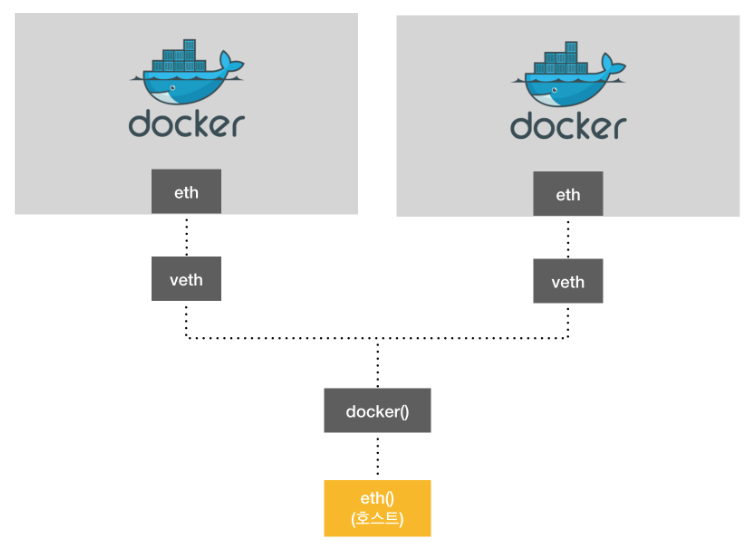
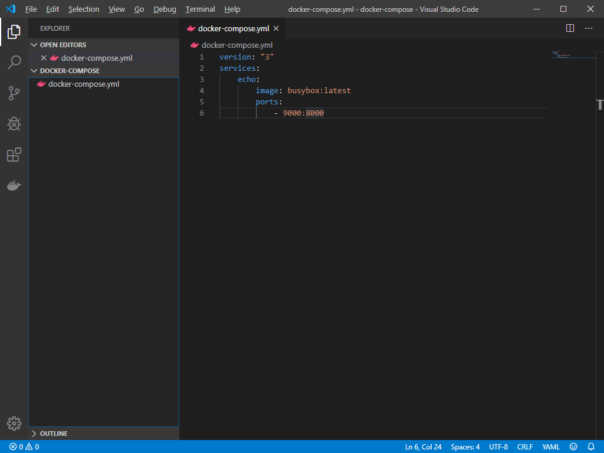
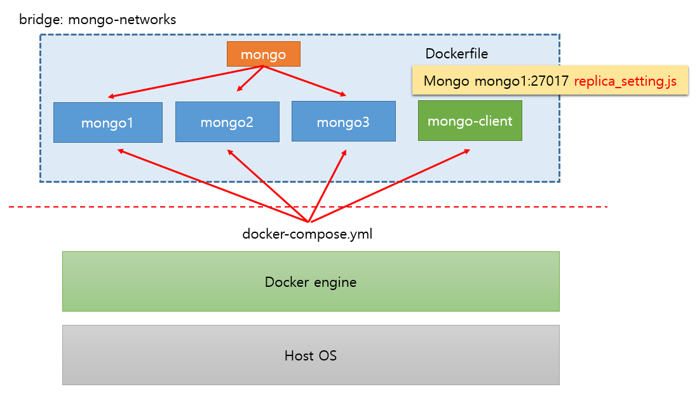
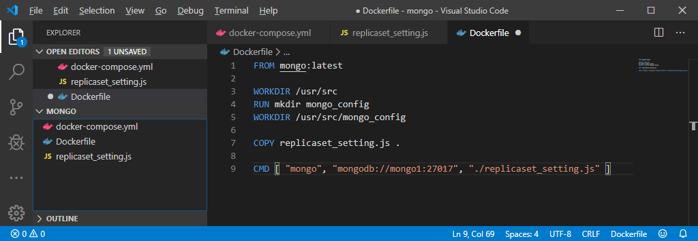
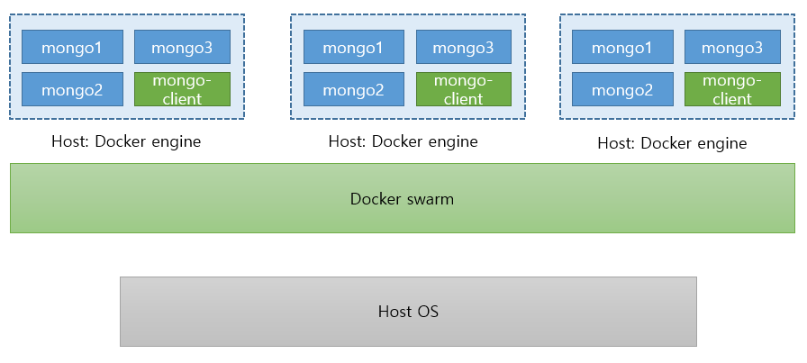
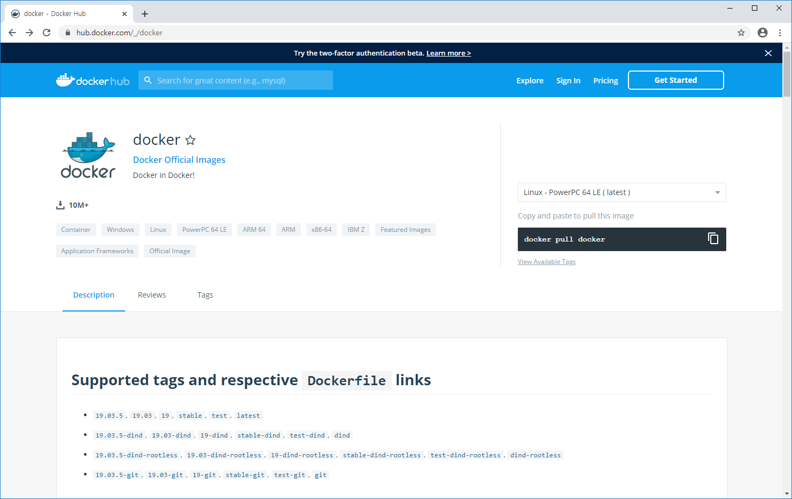
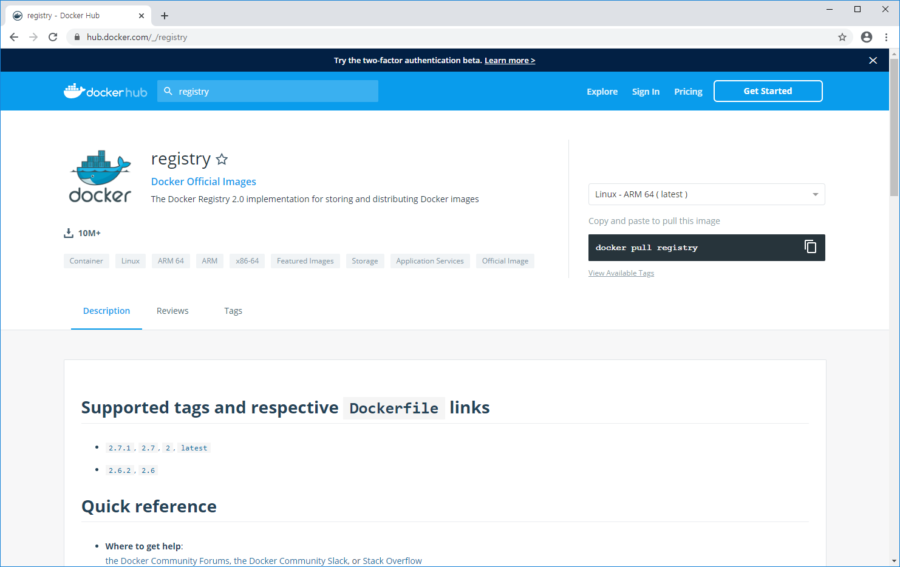
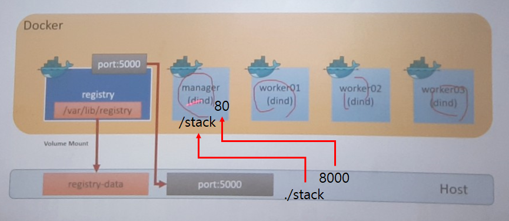
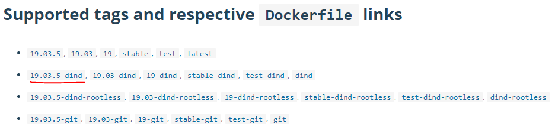
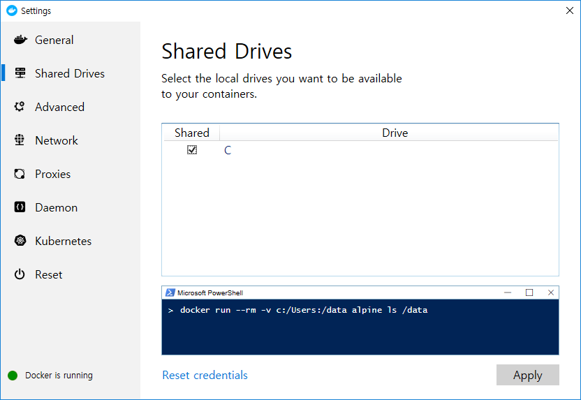

# Docker

### Docker 공유 폴더

외부의 저장소에 보관되어있는 데이터가 있으면 기존의 old 컨테이너에서도 외부의 저장소에 저장을 하고, new 컨테이너에서 같은 volume을 mount하게 되면 같은 데이터를 사용할 수 있다.


* `--name` : 컨테이너 이름을 부여할 수 있는 옵션. 랜덤하게 생성되는 이름 대신 관리하기 위한 이름이 필요하면 지정한 이름 가지고 중복이 안 되는 범위에서 설정 가능하다.
* `-v` : mount volume에 대한 옵션이다. :를 기준으로 왼쪽에는 Host PC의 경로, 오른쪽에는 Docker 컨테이너의 경로이다. ex) -v /my/datadir:/var/lib/mysql
* run은 create + start. 컨테이너를 만들때 create, 만들어진 컨테이너를 시작할 때 start. run은 기존에 create 되어있다면 start만 한다.
* `-p`는 포트포워딩 옵션이다. ex) -p 3306:3306
* `-d`는 컨테이너를 백그라운드에서 실행시키겠다는 옵션이다.


### Lab-MongoDB 설치

* 이미지 받아오기

  ```bash
  $ docker pull mongo (or $ docker pull mongo:4.1)
  ```

* 기동

  ```bash
  $ docker run --name mongodb_server -v /home/test/mongodb/db:/data/db \
  -d -p 16010:27017 mongo --auth
  ```
  ```bash
  $ docker run -d --name mongodb-test -p 17017:27017 \
  -v /home/sa/data/mongod.conf:/etc/mongod.conf \
  -v /home/sa/data/db:/data/db mongo --config /etc/mongo.conf
  ```
  `--config` : 뒤의 경로 파일로 MongoDB를 기동하라는 옵션
  
* Bash 접근, Mongo 접속

  ```bash
  $ docker exec -it mongodb_server bash
  root@XXXXXXXXX $ mongo
  ```
  
  `-i` : input
  
  `-t` : tty
  
  `bash` : 리눅스가 사용하는 bash shell을 이용해 커맨드를 실행하겠다는 것이다. bash 대신 `mongo`라고 써도 된다. 자동으로 접속 가능
  
* 관리자 계정 생성

  ```bash
  mongo> use admin
  ```

* 관리자 로그인, 일반 계정 로그인

  ```bash
  mongo> db.createUser({
  user:"admin",pwd:"admin",roles:[{roles:"userAdminAnyDatabase",db:"admin"}]
  })
  ```

* ReplicaSet 설정

  ```bash
  $ mongo -u "admin" -p "admin" -authenticationDatabase "admin"
  monbo> use testdb db.createUser({user:"tester",pwd:"1234",roles:["dbAdmin","readWrite"]})
  ```
  
  * MongoDB 추가 x 2개 (mongodb_server_2, mongodb_server_3 ...) -> docker container 생성
  * mongodb_server_1에서
    * rs.initiate()
    * rs.add("mongodb_server_2:27017"), rs.add("mongodb_server_3:27017") ... (with IP address)
    * db.isMaster()
    * 데이터베이스 생성, 데이터 추가 -> 확인
  
* ReplicaSet 재설정

  * mongo> cfg = rs.conf()
  * mongo> cfg.members[0].host = "172.17.0.3:27017"
  * mongo> rs.reconfig(cfg)
  
  

---

### Docker - MongoDB ReplicaSet 실습

```bash
docker run --name mongodb_server -d -p 16010:27017 mongo
```

```bash
docker exec -it mongodb_server bash
mongo
show dbs;
```

mongodb 접속

```bash
docker stop mongodb_server
docker rm mongodb_server
```


```bash
HPE@DESKTOP-DFE1UPJ MINGW64 ~
$ docker run --name mongodb_server_1 -d -p 16010:27017 mongo --replSet myapp
441f94aa5e078ff01f56ba5071f17bbc3bd0a8931301e25414f522355312f46e

HPE@DESKTOP-DFE1UPJ MINGW64 ~
$ docker run --name mongodb_server_2 -d -p 26010:27017 mongo --replSet myapp
54bb6932ee2909ef282a614c1a7b31742a791d9cb911ac2e976e82c10eec9d76

HPE@DESKTOP-DFE1UPJ MINGW64 ~
$ docker run --name mongodb_server_3 -d -p 36010:27017 mongo --replSet myapp
349e1792cb0c733ccbc003e9123cfa4db441df5736c49377cf170ef9cf86f8ae

HPE@DESKTOP-DFE1UPJ MINGW64 ~
$ docker ps
CONTAINER ID        IMAGE               COMMAND                  CREATED             STATUS              PORTS                      NAMES
349e1792cb0c        mongo               "docker-entrypoint.s…"   4 seconds ago       Up 2 seconds        0.0.0.0:36010->27017/tcp   mongodb_server_3
54bb6932ee29        mongo               "docker-entrypoint.s…"   11 seconds ago      Up 9 seconds        0.0.0.0:26010->27017/tcp   mongodb_server_2
441f94aa5e07        mongo               "docker-entrypoint.s…"   19 seconds ago      Up 17 seconds       0.0.0.0:16010->27017/tcp   mongodb_server_1
680e223a90ad        mysql:5.7           "docker-entrypoint.s…"   41 hours ago        Up 41 hours         3306/tcp, 33060/tcp        mysql
```

서버 3개를 다 기동시킨다. docker ps 명령어로 서버가 동작하는지 확인한다.


```bash
$ winpty docker exec -it mongodb_server_1 bash
```

```bash
$ winpty docker exec -it mongodb_server_2 bash
```

```bash
$ winpty docker exec -it mongodb_server_3 bash
```

git bash 3개를 열어서 서버에 접속. mongodb_server_2, mongodb_server_3도 같은 방법으로 접속한다.


```bash
$ ifconfig
$ ip addr show
```

접속한 뒤 IP확인. 둘 다 안될경우

```bash
$ docker inspect CONTAINER_ID
...
                    "Gateway": "172.17.0.1",
                    "IPAddress": "172.17.0.5",
                    "IPPrefixLen": 16,
                    "IPv6Gateway": "",
                    "GlobalIPv6Address": "",
                    "GlobalIPv6PrefixLen": 0,
                    "MacAddress": "02:42:ac:11:00:05",
                    "DriverOpts": null
...
```

컨테이너와 이미지의 세부 정보를 출력하는 명령어이다. 컨테이너에는 가상 IP가 할당된다. 이 명령어를 통해 가상 IP를 확인 가능하다.

docker ps 명령을 통해 CONTAINER_ID를 확인 후 각 컨테이너의 IP를 확인한다.


mongodb_server_1 : 172.17.0.3

mongodb_server_2 : 172.17.0.4

mongodb_server_3 : 172.17.0.5


mongodb_server_1에 접속 후

```bash
mongo
rs.initiate();
rs.add("172.17.0.4:27017");
rs.add("172.17.0.5:27017");
```

mongodb_server2와 mongodb_server_3의 IP를 이용해 ReplicaSet에 추가한다.

```bash
myapp:PRIMARY> rs.isMaster();
{
        "hosts" : [
                "02bd6a1fa1e9:27017",
                "172.17.0.4:27017",
                "172.17.0.5:27017"
        ],
        "setName" : "myapp",
        "setVersion" : 3,
        "ismaster" : true,
        "secondary" : false,
        "primary" : "02bd6a1fa1e9:27017",
        "me" : "02bd6a1fa1e9:27017",
        "electionId" : ObjectId("7fffffff0000000000000001"),
...
```

rs.isMaster() 명령어로 추가가 잘 되었는지 확인한다.


```bash
myapp:PRIMARY> show dbs;
admin   0.000GB
config  0.000GB
local   0.000GB
myapp:PRIMARY> use bookstore;
switched to db bookstore
myapp:PRIMARY> db.books.save({title:"Docker1"});
WriteResult({ "nInserted" : 1 })
myapp:PRIMARY> db.books.save({title:"Java2"});
WriteResult({ "nInserted" : 1 })
myapp:PRIMARY> db.books.find();
{ "_id" : ObjectId("5e0d55abea204a537a5ba16d"), "title" : "Docker1" }
{ "_id" : ObjectId("5e0d55b8ea204a537a5ba16e"), "title" : "Java2" }
```

primary에서 실행. 데이터를 추가한다.


server_2와 server_3에 그냥 접속해서 확인해보면 primary에서 추가한 데이터가 보이지 않는다.

```bash
$ docker logs 86fd5322acd5
...
2020-01-02T02:34:03.346+0000 I  CONNPOOL [Replication] Connecting to 02bd6a1fa1e9:27017
2020-01-02T02:34:05.026+0000 I  CONNPOOL [Replication] Connecting to 02bd6a1fa1e9:27017
```

컨테이너의 로그를 출력하는 명령어이다. docker ps로 컨테이너 ID 알아내기 -> docker logs

CONTAINER_ID로 접속 시도를 하는것을 볼 수 있다.


```bash
myapp:PRIMARY> cfg = rs.conf();
{
        "_id" : "myapp",
        "version" : 3,
        "protocolVersion" : NumberLong(1),
        "writeConcernMajorityJournalDefault" : true,
        "members" : [
                {
                        "_id" : 0,
                        "host" : "02bd6a1fa1e9:27017",
                        "arbiterOnly" : false,
                        "buildIndexes" : true,
                        "hidden" : false,
                        "priority" : 1,
                        "tags" : {

                        },
                        "slaveDelay" : NumberLong(0),
                        "votes" : 1
                },
                {
                        "_id" : 1,
                        "host" : "172.17.0.4:27017",
                        "arbiterOnly" : false,
                        "buildIndexes" : true,
                        "hidden" : false,
                        "priority" : 1,
                        "tags" : {

                        },
                        "slaveDelay" : NumberLong(0),
                        "votes" : 1
                },
                {
                        "_id" : 2,
                        "host" : "172.17.0.5:27017",
                        "arbiterOnly" : false,
                        "buildIndexes" : true,
                        "hidden" : false,
                        "priority" : 1,
                        "tags" : {

                        },
                        "slaveDelay" : NumberLong(0),
                        "votes" : 1
                }
        ],
        "settings" : {
                "chainingAllowed" : true,
                "heartbeatIntervalMillis" : 2000,
                "heartbeatTimeoutSecs" : 10,
                "electionTimeoutMillis" : 10000,
                "catchUpTimeoutMillis" : -1,
                "catchUpTakeoverDelayMillis" : 30000,
                "getLastErrorModes" : {

                },
                "getLastErrorDefaults" : {
                        "w" : 1,
                        "wtimeout" : 0
                },
                "replicaSetId" : ObjectId("5e0d5079d82906417bea2475")
        }
}
```

primary에서 실행. cfg가 가지고 있는 members 안에 있는 요소 중 첫 번째 index에 있는 host를 변경할 것이다. 컨테이너 ID가 아니라 컨테이너 IP로 변경. 포트 번호는 동일

cfg.settings.chainingAllowed = true 와 같은 식으로 접근한다.


```bash
myapp:PRIMARY> cfg.members[0].host = "172.17.0.3:27017"
172.17.0.3:27017
myapp:PRIMARY> rs.reconfig(cfg);
{
        "ok" : 1,
        "$clusterTime" : {
                "clusterTime" : Timestamp(1577932810, 1),
                "signature" : {
                        "hash" : BinData(0,"AAAAAAAAAAAAAAAAAAAAAAAAAAA="),
                        "keyId" : NumberLong(0)
                }
        },
        "operationTime" : Timestamp(1577932810, 1)
}
```

```bash
myapp:PRIMARY> db.isMaster();
{
        "hosts" : [
                "172.17.0.3:27017",
                "172.17.0.4:27017",
                "172.17.0.5:27017"
        ],
        "setName" : "myapp",
        "setVersion" : 4,
        "ismaster" : true,
        "secondary" : false,
        "primary" : "172.17.0.3:27017",
        "me" : "172.17.0.3:27017",
...
```

db.isMaster()로 확인해보면 전부 IP 주소로 변경된 것을 확인할 수 있다.


```bash
root@86fd5322acd5:/# mongo
MongoDB shell version v4.2.2
...

myapp:SECONDARY> show dbs;
2020-01-02T02:42:32.134+0000 E  QUERY    [js] uncaught exception: Error: listDat
abases failed:{
        "operationTime" : Timestamp(1577932945, 1),
        "ok" : 0,
        "errmsg" : "not master and slaveOk=false",
        "code" : 13435,
        "codeName" : "NotMasterNoSlaveOk",
...

myapp:SECONDARY> rs.slaveOk();
myapp:SECONDARY> show dbs;
admin      0.000GB
bookstore  0.000GB
config     0.000GB
local      0.000GB
myapp:SECONDARY> use bookstore;
switched to db bookstore
myapp:SECONDARY> db.books.find();
{ "_id" : ObjectId("5e0d55abea204a537a5ba16d"), "title" : "Docker1" }
{ "_id" : ObjectId("5e0d55b8ea204a537a5ba16e"), "title" : "Java2" }
```

primary와 secondary가 같은 데이터를 가진다.


```bash
$ docker stop mongodb_server_1
```

primary를 stop한다.


```bash
myapp:SECONDARY> db.isMaster();
{
        "hosts" : [
                "172.17.0.3:27017",
                "172.17.0.4:27017",
                "172.17.0.5:27017"
        ],
        "setName" : "myapp",
        "setVersion" : 4,
        "ismaster" : true,
        "secondary" : false,
        "primary" : "172.17.0.4:27017",
        "me" : "172.17.0.4:27017",
```

누가 서버가 되었는지 확인해보자. mongodb_server_2에서 확인한다. "172.17.0.4:27017"가 primary인 것을 확인할 수 있다.


```bash
$ docker stop mongodb_server_1 mongodb_server_2 mongodb_server_3
$ docker rm mongodb_server_1 mongodb_server_2 mongodb_server_3
```


---

## Docker 네트워크

Docker engien -> Server

eth : 이더넷 카드의 별칭



도커 내에 존재하는 eth 카드는 물리적으로 존재하는 eth가 아니라 호스트가 가지고 있는 eth 카드의 일부를 할당받아서 사용하는 개념이다.


도커 네트워크의 목록 확인

```bash
$ docker network ls
NETWORK ID          NAME                DRIVER              SCOPE
0930d6f52b7b        bridge              bridge              local
1181252b4ee5        host                host                local
aa8c0a3169a5        none                null                local
```


* Bridge network
  * docker network create --driver bridge [브릿지 이름]
  * docker run 또는 docker create에서 --net 옵션으로 커스텀 브릿지 사용
* Host network
  * 네트워크를 호스트로 설정하면 호스트의 네트워크 환경을 그대로 사용
  * 포트 포워딩 없이 내부 어플리케이션 사용
  * docker run -it --name network_host --net host ubuntu:16.04
* None network
  * 네트워크를 사용하지 않음
  * lo 네트워크만 사용, 외부와 단절
* Container network
  * 다른 컨테이너의 네트워크 환경 공유
  * --net container:[다른 컨테이너의 ID or Name]
  * 두 컨테이너 사이의 네트워크 정보가 동일
* Overlay network
  * 다른 호스트들 간에 네트워크 공유


```bash
$ docker ps
$ docker inspect CONTAINER_ID
...
                  "Gateway": "172.17.0.1",
                    "IPAddress": "172.17.0.2",
                    "IPPrefixLen": 16,
                    "IPv6Gateway": "",
                    "GlobalIPv6Address": "",
                    "GlobalIPv6PrefixLen": 0,
                    "MacAddress": "02:42:ac:11:00:02",
                    "DriverOpts": null
...
```

외부망으로 나갈 때 Gateway를 통과해야 한다. 도커 엔진에 할당되어있다. 


### Docker-compose

* 도커 애플리케이션을 정의하고 실행하는 도구(Tool for defining and running **multi-container Docker applications**)

* Docker 커맨드 or 복잡한 설정을 쉽게 관리하기 위한 도구

  * YAML format에 Docker 생성, 설정 관련된 작업을 작성해 놓은 Script 파일

* Docker compose 실행

  ```bash
  $ docker-compose up
  ```

  


```bash
$ docker-compose version
docker-compose version 1.24.1, build 4667896b
docker-py version: 3.7.3
CPython version: 3.6.8
OpenSSL version: OpenSSL 1.0.2q  20 Nov 2018
```




```yml
version: "3"
services: 
    echo:
        image: busybox:latest
        ports:
            - 9000:8000
```

day3 -> docker-compose 폴더 생성

docker-compose.yml 파일 생성 후 내용 작성

```bash
PS C:\Users\HPE\Work\docker\day03\docker-compose> docker-compose up
Creating network "docker-compose_default" with the default driver
Creating docker-compose_echo_1 ... done
Attaching to docker-compose_echo_1
docker-compose_echo_1 exited with code 0
```

```bash
PS C:\Users\HPE\Work\docker\day03> docker ps -a
CONTAINER ID        IMAGE               COMMAND                  CREATED              STATUS                          PORTS                      NAMES
ac3342c655f4        busybox:latest      "sh"                     About a minute ago   Exited (0) About a minute ago                              day03_echo_1
0f85a9855013        mongo               "docker-entrypoint.s…"   2 hours ago          Up 2 hours                      0.0.0.0:36010->27017/tcp   mongodb_server_3
86fd5322acd5        mongo               "docker-entrypoint.s…"   2 hours ago          Up 2 hours                      0.0.0.0:26010->27017/tcp   mongodb_server_2
02bd6a1fa1e9        mongo               "docker-entrypoint.s…"   3 hours ago          Exited (0) 2 hours ago                                     mongodb_server_1
ba6888b9cbf0        mongo               "docker-entrypoint.s…"   3 hours ago          Created                                                    mondodb_server
680e223a90ad        mysql:5.7           "docker-entrypoint.s…"   44 hours ago         Up 44 hours                     3306/tcp, 33060/tcp        mysql
```


---

### Docker compose로 MongoDB 서버 3개 한번에 실행하기

day03 -> mongo 폴더 만들기

docker images로 mongo라는 이미지가 있는지 확인. 이미지가 있어야 가능

```yml
version: "3"
services: 
    mongo1:
        image: "mongo"
        ports:
            - "16010:27017"
        volumes:
            - $HOME/mongoRepl/mongo1:/data/db
        networks:
            - mongo-networks
        command: mongod --replSet myapp

networks:
    mongo-networks:
        driver: bridge
```

docker-compose.yml  파일 생성 후 내용 입력

```bash
PS C:\Users\HPE\Work\docker\day03\mongo> docker-compose up
```


```yml
version: "3"
services: 
    mongo1:
        image: "mongo"
        ports:
            - "16010:27017"
        volumes:
            - $HOME/mongoRepl/mongo1:/data/db
        networks:
            - mongo-networks
        command: mongod --replSet myapp

    mongo2:
        image: "mongo"
        ports:
            - "26010:27017"
        volumes:
            - $HOME/mongoRepl/mongo2:/data/db
        networks:
            - mongo-networks
        command: mongod --replSet myapp
        depends_on: 
            - mongo1

    mongo3:
        image: "mongo"
        ports:
            - "36010:27017"
        volumes:
            - $HOME/mongoRepl/mongo3:/data/db
        networks:
            - mongo-networks
        command: mongod --replSet myapp
        depends_on: 
            - mongo2

networks:
    mongo-networks:
        driver: bridge
```

docker-compose.yml  내용 수정.  `depends_on`을 이용해 mongo1이 실행된 다음 mongo2를 실행되도록 설정한다. 들여쓰기가 맞지 않으면 오류가 난다.


```bash
PS C:\Users\HPE\Work\docker\day03\mongo> docker-compose up
```


```bash
$ docker exec -it mongo_mongo1_1 bash
$ docker exec -it mongo_mongo2_1 bash
$ docker exec -it mongo_mongo3_1 bash
```

다른 powershell에서 mongodb 서버 접속.

`exec` : 작동중인 컨테이너에 command를 전달한다. 

`bash` 대신 `mongo`를 입력해도 된다.

```bash
PS C:\Users\HPE> docker exec -it mongo_mongo1_1 ls
bin   dev                         home        lib64  opt   run   sys  var
boot  docker-entrypoint-initdb.d  js-yaml.js  media  proc  sbin  tmp
data  etc                         lib         mnt    root  srv   usr
```

예시로 ls를 전달한 경우


```bash
mongo> rs.initiate()
mongo> rs.add("ip_address:port") -> mongo1 ~ mongo3

ex)
mongo> rs.add("172.17.0.3:27017")
mongo> rs.add("172.17.0.4:27017")
mongo> rs.add("172.17.0.5:27017")
```


```javascript
rs.initiate()
rs.add("172.17.0.3:27017")
rs.add("172.17.0.4:27017")
rs.add("172.17.0.5:27017")
```

MongoDB에서 실행할 명령어를 JavaScript 형식으로 만들고, "replicaset_setting.js"로 저장한다.


```bash
PS C:\Users\HPE> docker exec -it mongo_mongo1_1 bash
root@57480a91b5b0:/# mongo 172.17.0.3:27017 replicaset_setting.js
```

서버에 접속해서 실행해야하는데, 가지고 있는 네트워크의 설정 사항을 먼저 확인해야한다.(이 명령어는 실행하지 말자.)


```
PS C:\Users\HPE> docker network ls
NETWORK ID          NAME                     DRIVER              SCOPE
0930d6f52b7b        bridge                   bridge              local
d2c45dece9e8        day03_default            bridge              local
9890ac89e8fc        docker-compose_default   bridge              local
1181252b4ee5        host                     host                local
fbe3a1f8c7d7        mongo_mongo-networks     bridge              local
aa8c0a3169a5        none                     null                local
```

```bash
PS C:\Users\HPE> docker inspect fbe3a1f8c7d7
[
    {
        "Name": "mongo_mongo-networks",
        "Id": "fbe3a1f8c7d7e74fc72456a3d6bdc70299200f163bf2e455fe4776f794f0420e",
        "Created": "2020-01-02T04:46:14.1098943Z",
        "Scope": "local",
        "Driver": "bridge",
        "EnableIPv6": false,
        "IPAM": {
            "Driver": "default",
            "Options": null,
            "Config": [
                {
                    "Subnet": "172.20.0.0/16",
                    "Gateway": "172.20.0.1"
                }
            ]
        },
        "Internal": false,
        "Attachable": true,
        "Ingress": false,
        "ConfigFrom": {
            "Network": ""
        },
        "ConfigOnly": false,
        "Containers": {
            "20e000549f79f359f8cb7f6245cbbafda64a1fed4209ca0497ae0fc813dc1881": {
                "Name": "mongo_mongo3_1",
                "EndpointID": "4cb9eda796b5447f99726598485786438d36e8dc0cc494ac3323c594bf17a708",
                "MacAddress": "02:42:ac:14:00:04",
                "IPv4Address": "172.20.0.4/16",
                "IPv6Address": ""
            },
            "57480a91b5b08e26a679d4972c83a0b4097ef8f64799eeed8e92c4e58f55ac2b": {
                "Name": "mongo_mongo1_1",
                "EndpointID": "5b22f13e3a61195584240f7725d085f7bebf9f10c5464d42ecbdf57360a3579d",
                "MacAddress": "02:42:ac:14:00:02",
                "IPv4Address": "172.20.0.2/16",
                "IPv6Address": ""
            },
            "6e8a719895c64298784ea571d34b9a391604ab739682eddc5ea95c7962805eb4": {
                "Name": "mongo_mongo2_1",
                "EndpointID": "551c8a6392c56c110e4115f26350d6e8710692a4c3d1bc92cfb7afebf59e6be7",
                "MacAddress": "02:42:ac:14:00:03",
                "IPv4Address": "172.20.0.3/16",
                "IPv6Address": ""
            }
        },
        "Options": {},
        "Labels": {
            "com.docker.compose.network": "mongo-networks",
            "com.docker.compose.project": "mongo",
            "com.docker.compose.version": "1.24.1"
        }
    }
]
```

mongo_mongo-networks에 참여하고 있는 컨테이너가 어떤 것이 있는지 확인한다.


```javascript
//----------------- replication setting #1
rs.initiate()
rs.add("mongo1:27017")
rs.add("mongo2:27017")
rs.add("mongo3:27017")
```

첫 번째 방법. 같은 네트워크에 묶여있을 경우에만 한정적으로 


```javascript
//----------------- replication setting #2
config = {
    _id: "myapp",
    members: [
        {_id:0, host: "mongo1:27017"},
        {_id:1, host: "mongo2:27017"},
        {_id:2, host: "mongo3:27017"}
    ]
};
rs.initiate(config);
rs.config();
```

두 번째 방법







```bash
FROM mongo:latest

WORKDIR /usr/src
RUN mkdir mongo_config
WORKDIR /usr/src/mongo_config

COPY replicaset_setting.js .

CMD [ "mongo", "mongodb://mongo1:27017", "./replicaset_setting.js" ]
```

Dockerfile 생성 및 내용 작성

같은 네트워크에 묶일 것이기 때문에 mongo1라고 작업해도 IP를 알 수 있다.


1. Dockerfile 생성
2. image 빌드
3. image 테스트 (컨테이너 생성)
4. docker-compose.yml 파일에 새로운 service (container) 추가
   - mongo_repl_setting
5. docker-compose up


1. Dockerfile 생성

```bash
PS C:\Users\HPE\Work\docker\day03\mongo> docker build -t mongodb_setting:latest .
```

```bash
PS C:\Users\HPE\Work\docker\day03\mongo> docker images
REPOSITORY                  TAG                 IMAGE ID            CREATED             SIZE
mongodb_setting             latest              6024ddf69d5e        29 seconds ago      364MB
exeample/mysql-data         latest              4f3ce77c9cba        47 hours ago        1.22MB
exemple/mysql-data          latest              4f3ce77c9cba        47 hours ago        1.22MB
example/mysql-data          latest              4f3ce77c9cba        47 hours ago        1.22MB
```

mongodb_setting 이미지가 생성된 것을 확인할 수 있다.


```bash
PS C:\Users\HPE\Work\docker\day03\mongo> docker run mongodb_setting:latest
MongoDB shell version v4.2.2
connecting to: mongodb://mongo1:27017/test?compressors=disabled&gssapiServiceName=mongodb
2020-01-02T06:31:56.658+0000 E  QUERY    [js] Error: couldn't connect to server mongo1:27017, connection attempt failed: HostNotFound: Could not find address for mongo1:27017: SocketException: Host not found (authoritative) :
connect@src/mongo/shell/mongo.js:341:17
@(connect):2:6
2020-01-02T06:31:56.662+0000 F  -        [main] exception: connect failed
2020-01-02T06:31:56.663+0000 E  -        [main] exiting with code 1
```

중간에 exception 발생. Host not found. mongo1이라는 host를 찾을 수 없다고 나온다.

같은 네트워크 상에 있지 않기 때문이다.


```bash
PS C:\Users\HPE\Work\docker\day03\mongo> docker system prune
```

정지된 컨테이너 삭제


```yml
version: "3"
services: 
    mongo1:
        image: "mongo"
        ports:
            - "16010:27017"
        volumes:
            - $HOME/mongoRepl/mongo1:/data/db
        networks:
            - mongo-networks
        command: mongod --replSet myapp

    mongo2:
        image: "mongo"
        ports:
            - "26010:27017"
        volumes:
            - $HOME/mongoRepl/mongo2:/data/db
        networks:
            - mongo-networks
        command: mongod --replSet myapp
        depends_on: 
            - mongo1

    mongo3:
        image: "mongo"
        ports:
            - "36010:27017"
        volumes:
            - $HOME/mongoRepl/mongo3:/data/db
        networks:
            - mongo-networks
        command: mongod --replSet myapp
        depends_on: 
            - mongo2

    mongodbsetup:
        image: "mongodb_setting"
        depends_on: 
            - mongo3
        networks:
            - mongo-networks

networks:
    mongo-networks:
        driver: bridge
```

파일 수정


```bash
$ docker-compose down
$ docker system prune
```

기존의 docker container 정지 및 삭제


```bash
$ docker-compose up
```


```bash
$ docker exec -it mongo_mongo1_1 mongo
$ docker exec -it mongo_mongo2_1 mongo
$ docker exec -it mongo_mongo3_1 mongo
```


```bash
myapp:PRIMARY> db.isMaster();
myapp:PRIMARY> show dbs;
myapp:PRIMARY> use bookstore;
myapp:PRIMARY> db.books.save({title:"Docker1"});
myapp:PRIMARY> db.books.find();
```

mongo1(Primary)에서 실행


```bash
myapp:SECONDARY> rs.slaveOk();
myapp:SECONDARY> show dbs;
admin      0.000GB
bookstore  0.000GB
config     0.000GB
local      0.000GB
myapp:SECONDARY> use bookstore;
switched to db bookstore
myapp:SECONDARY> db.books.find();
{ "_id" : ObjectId("5e0d98c0ca946ea9b939fe4b"), "title" : "Docker1" }
```

mongo2(Secondary)에서 실행


Primary 중지해보기


```bash
$ docker-compose down
$ docker-compose up
```

```bash
$ docker exec -it mongo_mongo1_1 mongo
```

volume 설정 했기 때문에 데이터는 지속적으로 활용할 수 있다.


---


Quest) Mysql 설치 -> docker-compose.yml 파일 작성

- mysql:5.7	->	test_mysql 이미지 빌드
  - Dockerfile 생성
  - root 패스워드 사용하지 않도록 설정 (-e 옵션 또는, environment 옵션)
- test_mysql 이미지를 docker-compose에서 실행


* Dockerfile

  ```bash
  docker build -t test_mysql:latest .
  ```

* docker-compose.yml

  ```yml
  version: ...
  services:
  	my_mysql:
  		image: test_mysql
  ```

  

github.com

​	본인 계정에 강사와 공유하는 repository에 commit

​	Dockerfile, docker-compose.yml

​	by 이번주


---

### Docker Swarm

* Docker Swarm -> 오케스트레이션

  * 여러 docker host를 클러스터로 묶어주는 컨테이너 오케스트레이션

  

| 이름    | 역할                                                         | 대응하는 명령어 |
| ------- | ------------------------------------------------------------ | --------------- |
| Compose | 여러 컨테이너로 구성된 도커 애플리케이션을 관리(주로 단일 호스트) | docker-compose  |
| Swarm   | 클러스터 구축 및 관리(주로 멀티 호스트)                      | docker swarm    |
| Service | 스웜에서 클러스터 안의 서비스(컨테이너 하나 이상의 집합)을 관리 | docker service  |
| Stack   | 스웜에서 여러 개의 서비스를 합한 전체 애플리케이션을 관리    | docker stack    |

p129


클러스터 : 물리적으로 나눠져있는 PC를 하나로 합쳐주는 것





도커 허브 사이트에서 `docker`검색

docker 안에 docker를 설치




* Docker in Docker, dind
  * 도커 컨테이너 안에서 도커 호스트를 실행


도커 허브 사이트에서 `registry` 검색

registry라는 이미지를 이용하면 사용하고자 하는 도커 호스트에 레파지토리 저장소를 만들 수 있다.






아마존 S3를 이용하면 registry와 똑같은 작업 할 수 있다.

manager : worker들이 가지고 있는 내용을 관리, 제어하는 역할


* Manager에 Swarm 설정
  
  * Manager container에 dockcer swarm init 설정 -> Swarm 모드 활성화
  * Worker 컨테이너를 등록 with join token
  
  ```bash
  $ docker exec -it manager docker swarm init
  ```
  
  ```bash
  $ docker exec -it work01 docker swarm join\
  --token [JOIN TOKEN ex) SWMTKN-1-4u47j~bo0] manager:2377
  ```
  
  -> worker02, worker03 도 등록
  
* Swarm에서 사용할 포트

  * TCP port 2377 : cluster management 통신에 사용
  * TCP/UDP port 7946 : node간의 통신에 사용
  * TCP/UDP port 4789 : overlay network 트래픽에 사용


p108, 109

* https://hub.docker.com/

* http://localhost:5000 -> registry:5000
  * http인 경우 다운받을 수 없다.
    * https 등록
    * --insecure-registry registry:5000


p110

image: registry:2.6

도커 허브에 있는 이미지를 다운로드 받아서 사용

포트포워딩 5000:5000

volume mount가 걸려있다.

manager ~ worker03 : 도커 안에 도커. 이미지가 docker:19.03.0-ce-dind


```bash
$ docker version
...
Version:           19.03.5
...
```


https://hub.docker.com/_/docker



클릭하면 어떻게 이미지가 만들어져있는지 확인 가능하다.


day03 -> swarm 폴더 생성

```yml
version: "3"
services: 
  registry:
    container_name: registry
    image: registry:latest
    ports: 
      - 5000:5000
    volumes: 
      - "./registry-data:/var/lib/registry"

  manager:
    container_name: manager
    image: docker:19.03.5-dind
    privileged: true
    tty: true
    ports:
      - 8000:80
      - 9000:9000
    depends_on: 
      - registry
    expose: 
      - 3375
    command: "--insecure-registry registry:5000"
    volumes: 
      - "./stack:/stack"

  worker01:
    container_name: worker01
    image: docker:19.03.5-dind
    privileged: true
    tty: true
    depends_on: 
      - manager
      - registry
    expose: 
      - 7946
      - 7946/udp
      - 4789/udp
    command: "--insecure-registry registry:5000"

  worker02:
    container_name: worker02
    image: docker:19.03.5-dind
    privileged: true
    tty: true
    depends_on: 
      - manager
      - registry
    expose: 
      - 7946
      - 7946/udp
      - 4789/udp
    command: "--insecure-registry registry:5000"

  worker03:
    container_name: worker03
    image: docker:19.03.5-dind
    privileged: true
    tty: true
    depends_on: 
      - manager
      - registry
    expose: 
      - 7946
      - 7946/udp
      - 4789/udp
    command: "--insecure-registry registry:5000"
```

docker-compose.yml


```bash
$ docker-compose up
```

```bash
$ docker ps
```

5개가 정상 작동되는 것을 확인해야한다.


사용하는 PC에 암호가 안 걸려있으면 추가해줘야한다.

설정 -> 계정 -> 로그인 옵션 -> 암호


윈도우 화면 오른쪽 도커 아이콘 -> Settings




```bash
$ docker exec -it manager docker swarm init
PS C:\Users\HPE> docker exec -it manager docker swarm init
Swarm initialized: current node (qbsr32jbsry7pe49shieai3x5) is now a manager.

To add a worker to this swarm, run the following command:

    docker swarm join --token SWMTKN-1-2cda7uecfjk0lvw8o3ybo8r6nrbithpbvok7hfx7axqz4pnut4-8ucffor55zu6mxe98ypp0j8gs 172.28.0.3:2377

To add a manager to this swarm, run 'docker swarm join-token manager' and follow the instructions.
```

docker ~ 2377 복사 


docker exec -it worker01 + 붙여넣기

```bash
PS C:\Users\HPE> docker exec -it worker01 docker swarm join --token SWMTKN-1-2cda7uecfjk0lvw8o3ybo8r6nrbithpbvok7hfx7axqz4pnut4-8ucffor55zu6mxe98ypp0j8gs 172.28.0.3:2377
This node joined a swarm as a worker.
```

```bash
PS C:\Users\HPE> docker exec -it worker02 docker swarm join --token SWMTKN-1-2cda7uecfjk0lvw8o3ybo8r6nrbithpbvok7hfx7axqz4pnut4-8ucffor55zu6mxe98ypp0j8gs 172.28.0.3:2377
This node joined a swarm as a worker.
```

```bash
PS C:\Users\HPE> docker exec -it worker03 docker swarm join --token SWMTKN-1-2cda7uecfjk0lvw8o3ybo8r6nrbithpbvok7hfx7axqz4pnut4-8ucffor55zu6mxe98ypp0j8gs 172.28.0.3:2377
This node joined a swarm as a worker.
```


worker02, worker03도 등록

정상적으로 등록되었는지 manager가서 확인한다.

```bash
PS C:\Users\HPE> docker exec -it manager docker node ls
ID                            HOSTNAME            STATUS              AVAILABILITY        MANAGER STATUS      ENGINE VERSION
ihwio0yva24sikfukfifaankn     47a0b76b098c        Ready               Active                                  19.03.5
6606nemm7rcbdcsxpmnmqx5dp     912c473cbad1        Ready               Active                                  19.03.5
lwr2mnpb60sjghq7x5we27yxu     8266d03bdb76        Ready               Active                                  19.03.5
qbsr32jbsry7pe49shieai3x5 *   0228166266b1        Ready               Active              Leader              19.03.5
```


정상적이라고 하면 4명의 swarm을 확인할 수 있다.

swarm을 통해 묶어두었기 때문에 같은 네트워크로 묶여있다.


