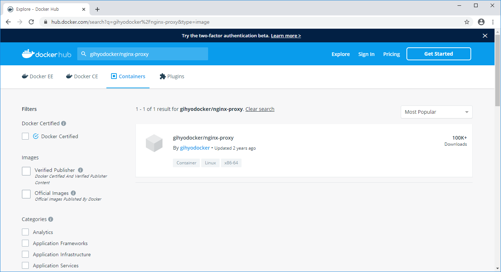

# Docker

### Docker Swarm


https://labs.play-with-docker.com/

도커 실습 사이트


* node1

```bash
$ docker swarm init --advertise-addr eth0
Swarm initialized: current node (rjmmkx6j4bcr89hb64vqy4xz7) is now a manager.

To add a worker to this swarm, run the following command:

    docker swarm join --token SWMTKN-1-5c4feypin4ruewjxia6q71bwxbue1xvjyd3msx4of5kqu5sy53-8tb55c0qclkupjehgh714cv15 192.168.0.13:2377

To add a manager to this swarm, run 'docker swarm join-token manager' and follow the instructions.
```

```bash
$ docker info
Client:
 Debug Mode: false
 Plugins:
  app: Docker Application (Docker Inc., v0.8.0)

Server:
 Containers: 0
  Running: 0
  Paused: 0
  Stopped: 0
...
```

```bash
$ docker node ls
ID                            HOSTNAME            STATUS              AVAILABILITY        MANAGER STATUS      ENGINE VERSION
rjmmkx6j4bcr89hb64vqy4xz7 *   node1               Ready               Active              Leader              19.03.4
```


* node2

```bash
$ docker swarm join --token SWMTKN-1-5c4feypin4ruewjxia6q71bwxbue1xvjyd3msx4of5kqu5sy53-8tb55c0qclkupjehgh714cv15 192.168.0.13:2377This node joined a swarm as a worker.
```


* node1

```bash
$ docker node ls
ID                            HOSTNAME            STATUS              AVAILABILITY        MANAGER STATUS      ENGINE VERSION
rjmmkx6j4bcr89hb64vqy4xz7 *   node1               Ready               Active              Leader              19.03.4
qpy1zcpkbqo2x9lohux0vrfre     node2               Ready               Active                                  19.03.4
```


---

### Docker Swarm 실습(이어서)


```bash
PS C:\Users\HPE\Work\docker\day03\mysql> docker exec -it manager sh
$ docker node ls
ID                            HOSTNAME            STATUS              AVAILABILITY        MANAGER STATUS      ENGINE VERSION
ihwio0yva24sikfukfifaankn     47a0b76b098c        Ready               Active                                  19.03.5
6606nemm7rcbdcsxpmnmqx5dp     912c473cbad1        Ready               Active                                  19.03.5
lwr2mnpb60sjghq7x5we27yxu     8266d03bdb76        Ready               Active                                  19.03.5
qbsr32jbsry7pe49shieai3x5 *   0228166266b1        Ready               Active              Leader              19.03.5
```


p110, 111

```bash
PS C:\Users\HPE\Work\docker\day03\mysql> docker ps
CONTAINER ID        IMAGE                 COMMAND                  CREATED             STATUS              PORTS                                                                   NAMES
47a0b76b098c        docker:19.03.5-dind   "dockerd-entrypoint.…"   16 hours ago        Up 16 hours         2375-2376/tcp, 4789/udp, 7946/tcp, 7946/udp                             worker01
912c473cbad1        docker:19.03.5-dind   "dockerd-entrypoint.…"   16 hours ago        Up 16 hours         2375-2376/tcp, 4789/udp, 7946/tcp, 7946/udp                             worker03
8266d03bdb76        docker:19.03.5-dind   "dockerd-entrypoint.…"   16 hours ago        Up 16 hours         2375-2376/tcp, 4789/udp, 7946/tcp, 7946/udp                             worker02
0228166266b1        docker:19.03.5-dind   "dockerd-entrypoint.…"   16 hours ago        Up 16 hours         2375-2376/tcp, 3375/tcp, 0.0.0.0:9000->9000/tcp, 0.0.0.0:8000->80/tcp   manager
3c135b5a104e        registry:latest       "/entrypoint.sh /etc…"   16 hours ago        Up 16 hours         0.0.0.0:5000->5000/tcp                                                  registry
680e223a90ad        mysql:5.7             "docker-entrypoint.s…"   2 days ago          Up 2 days           3306/tcp, 33060/tcp                                                     mysql
```

서버가 5000 포트로 열려있다.


```bash
$ ping registry
```

registry가 어떤 IP인지 mapping 정보가 필요하다. 등록해두지 않았다.


```bash
$ docker image push [push_대상_레지스트리_호스트/]리포지토리명[:태그명]
```

push하는 대상 이미지를 허브 사이트에 등록하는 것이 아니라 local 레지스트리에 등록한다.


day01 -> go

```dockerfile
FROM golang:1.10

RUN mkdir /echo
COPY main.go /echo

CMD ["go", "run", "/echo/main.go"]
```

Dockerfile


```bash
$ type .\Dockerfile
$ docker build -t example/echo:latest .
$ docker run -p 8080:8080 example/echo:latest
2020/01/03 00:50:33 start server
```


웹 브라우저에서 확인

localhost:8080


```bash
PS C:\Users\HPE\Work\docker\day01\go> docker ps -a
CONTAINER ID        IMAGE                 COMMAND                  CREATED             STATUS              PORTS                                                                   NAMES
47a0b76b098c        docker:19.03.5-dind   "dockerd-entrypoint.…"   16 hours ago        Up 16 hours         2375-2376/tcp, 4789/udp, 7946/tcp, 7946/udp                             worker01
912c473cbad1        docker:19.03.5-dind   "dockerd-entrypoint.…"   16 hours ago        Up 16 hours         2375-2376/tcp, 4789/udp, 7946/tcp, 7946/udp                             worker03
8266d03bdb76        docker:19.03.5-dind   "dockerd-entrypoint.…"   16 hours ago        Up 16 hours         2375-2376/tcp, 4789/udp, 7946/tcp, 7946/udp                             worker02
0228166266b1        docker:19.03.5-dind   "dockerd-entrypoint.…"   16 hours ago        Up 16 hours         2375-2376/tcp, 3375/tcp, 0.0.0.0:9000->9000/tcp, 0.0.0.0:8000->80/tcp   manager
3c135b5a104e        registry:latest       "/entrypoint.sh /etc…"   16 hours ago        Up 16 hours         0.0.0.0:5000->5000/tcp                                                  registry
```

이 상태에서 작업


```bash
PS C:\Users\HPE\Work\docker\day01\go> docker images
REPOSITORY                  TAG                 IMAGE ID            CREATED             SIZE
example/echo                latest              7c2d03bbe555        7 minutes ago       760MB
test_mysql                  latest              2c0ad8535f51        37 minutes ago      437MB
mongodb_setting             latest              a6fafc1b91ad        18 hours ago        364MB
```


```bash
PS C:\Users\HPE\Work\docker\day01\go> docker tag example/echo:latest localhost:5000/example/echo:latest
PS C:\Users\HPE\Work\docker\day01\go> docker images
REPOSITORY                    TAG                 IMAGE ID            CREATED             SIZE
example/echo                  latest              7c2d03bbe555        10 minutes ago      760MB
localhost:5000/example/echo   latest              7c2d03bbe555        10 minutes ago      760MB
test_mysql                    latest              2c0ad8535f51        40 minutes ago      437MB
```

가지고 있는 이미지를 복사해 새로운 이미지를 만든다. 새로운 이름 붙인다.


* 도커 레지스트리용 이미지 생성

  ```bash
  $ docker tag example/echo:latest localhost:5000/example/echo:latest
  ```
  
  * [registry_host/]repository_name[:tag]
  
* 도커 레지스트리에 이미지 등록

  ```bash
  $ docker push localhost:5000/example/echo:latest
  ```

* Worker 컨테이너에 이미지 설치

  ```bash
  $ docker exec -it worker01 docker pull registry:5000/example/echo:latest
  $ docker exec -it worker01 docker image ls
  ```

  


```bash
PS C:\Users\HPE\Work\docker\day01\go> docker push localhost:5000/example/echo:latest
The push refers to repository [localhost:5000/example/echo]
8746b207f38f: Pushed
848990ffbb85: Pushed
```


pull, run을 이용해 도커 허브 사이트에서 이미지를 다운받을 수 있다.


```bash
$ docker pull registry:5000/example/echo
```

registry라는 이름으로 사용 불가능


http://localhost:5000/v2/_catalog

웹 브라우저에서 확인. 현재 레지스트리에 포함되어있는 이미지를 확인할 수 있다.


```bash
PS C:\Users\HPE\Work\docker\day01\go> docker exec -it worker01 sh
/ # docker pull registry:5000/example/echo:latest
```

worker01에 접속해 registry에 있는 이미지를 다운받아오겠다. (도커 허브 사이트가 아니라)

같은 네트워크에 묶여있으므로 registry 이름으로 이용 가능하다.


```bash
/ # docker images
REPOSITORY                   TAG                 IMAGE ID            CREATED             SIZE
registry:5000/example/echo   latest              7c2d03bbe555        20 minutes ago      760MB
```


worker02

```bash
PS C:\Users\HPE\Work\docker\day01\go> docker exec -it worker02 docker pull registry:5000/example/echo:latest
```

worker02에 접속해서 이미지 다운을 한 번에 할 수 있다.


```bash
PS C:\Users\HPE\Work\docker\day01\go> docker exec -it worker03 docker pull registry:5000/example/echo:latest
```

worker03에도 마찬가지 방법으로 다운받을 수 있다.


---


```bash
PS C:\Users\HPE\Work\docker\day01\go> docker exec -it manager sh
/ # hostname
0228166266b1
```

```bash
PS C:\Users\HPE> docker ps
CONTAINER ID        IMAGE                 COMMAND                  CREATED             STATUS              PORTS                                                                   NAMES
47a0b76b098c        docker:19.03.5-dind   "dockerd-entrypoint.…"   16 hours ago        Up 16 hours         2375-2376/tcp, 4789/udp, 7946/tcp, 7946/udp                             worker01
912c473cbad1        docker:19.03.5-dind   "dockerd-entrypoint.…"   16 hours ago        Up 16 hours         2375-2376/tcp, 4789/udp, 7946/tcp, 7946/udp                             worker03
8266d03bdb76        docker:19.03.5-dind   "dockerd-entrypoint.…"   16 hours ago        Up 16 hours         2375-2376/tcp, 4789/udp, 7946/tcp, 7946/udp                             worker02
0228166266b1        docker:19.03.5-dind   "dockerd-entrypoint.…"   16 hours ago        Up 16 hours         2375-2376/tcp, 3375/tcp, 0.0.0.0:9000->9000/tcp, 0.0.0.0:8000->80/tcp   manager
3c135b5a104e        registry:latest       "/entrypoint.sh /etc…"   16 hours ago        Up 16 hours         0.0.0.0:5000->5000/tcp                                                  registry
```

도커의 컨테이너 이름을  hostname으로 사용한다.


```bash
PS C:\Users\HPE\Work\docker\day01\go> docker exec -it manager sh
```

```bash
/ # docker swarm init
Error response from daemon: This node is already part of a swarm. Use "docker swarm leave" to leave this swarm and join another one.
/ # docker swarm leave --force
Node left the swarm.
/ # docker node ls
Error response from daemon: This node is not a swarm manager. Use "docker swarm init" or "docker swarm join" to connect this node to swarm and try again.
/ # docker swarm init
Swarm initialized: current node (72pkogkjs82yyx3z21s3b9cis) is now a manager.

To add a worker to this swarm, run the following command:

    docker swarm join --token SWMTKN-1-0cw3dus07cs6cq9q8a41x2n4ktp69phfsi3ry6y3d1v59i7tpa-1zglyksjc582x6xk1mqjekzfb 172.28.0.3:2377

To add a manager to this swarm, run 'docker swarm join-token manager' and follow the instructions.
```


worker01에 접속

```bash
PS C:\Users\HPE> docker exec -it worker01 sh
```

manager에서 발급한 토큰 값 복사해 붙여넣기. 참여를 다시 한다.

```bash
PS C:\Users\HPE> docker exec -it worker01 sh
/ # docker swarm join --token SWMTKN-1-0cw3dus07cs6cq9q8a41x2n4ktp69phfsi3ry6y3d1v59i7tpa-1zglyksjc582x6xk1mqjekzfb 172.28.0.3:2377
Error response from daemon: This node is already part of a swarm. Use "docker swarm leave" to leave this swarm and join another one.
/ # docker swarm leave
Node left the swarm.
/ # docker swarm join --token SWMTKN-1-0cw3dus07cs6cq9q8a41x2n4ktp69phfsi3ry6y3d1v59i7tpa-1zglyksjc582x6xk1mqjekzfb 172.28.0.3:2377
This node joined a swarm as a worker.
```


manager에서

```bash
/ # docker node ls
ID                            HOSTNAME            STATUS              AVAILABILITY        MANAGER STATUS      ENGINE VERSION
qqcq5qcv49tilh0rr02j5fhtf     47a0b76b098c        Ready               Active                                  19.03.5
72pkogkjs82yyx3z21s3b9cis *   0228166266b1        Ready               Active              Leader              19.03.5
```

docker에서 말하는 hostname은 container id이다.

hostname은 같은 네트워크에서 같을 수 없다.


worker02

```bash
PS C:\Users\HPE> docker exec -it worker02 sh
$ docker swarm leave
Node left the swarm.

$ docker swarm join --token SWMTKN-1-0cw3dus07cs6cq9q8a41x2n4ktp69phfsi3ry6y3d1v59i7tpa-1zglyksjc582x6xk1mqjekzfb 172.
28.0.3:2377
This node joined a swarm as a worker.
```


worker03도 마찬가지로 추가


```bash
$ docker exec -it worker03 docker swarm join --token SWMTKN-1-0cw3dus07cs6cq9q8a41x2n4ktp69phfsi3ry6y3d1v59i7tpa-1zglyksjc582x6xk1mqjekzfb 172.
28.0.3:2377
```

이런 방식으로도 추가 가능


```bash
$ docker exec -it manager docker node ls
ID                            HOSTNAME            STATUS              AVAILABILITY        MANAGER STATUS      ENGINE VERSION
qqcq5qcv49tilh0rr02j5fhtf     47a0b76b098c        Ready               Active                                  19.03.5
qnuhwlzu6r7t8niqfwno3gp9q     912c473cbad1        Ready               Active                                  19.03.5
wdkyudj1nyc9i9ahlrqvkxltk     8266d03bdb76        Ready               Active                                  19.03.5
72pkogkjs82yyx3z21s3b9cis *   0228166266b1        Ready               Active              Leader              19.03.5
```


---

### Docker Service

* Service
  * 애플리케이션을 구성하는 일부 컨테이너(단일 또는 복수)를 제어하기 위한 단위

```bash
$ docker exec -it manager\
docker service create --replicas 1 --publish 8000:8080 --name echo\
registry:5000/example/echo:latest
```

```bash
$ docker exec -it manager docker service ls
$ docker exec -it manager docker service scale echo=6
$ docker exec -it manager docker service ps echo
$ docker exec -it manater docker service rm echo
```

현재 가지고 있는 서비스 목록 확인

echo라는 서비스에 대해 replica set을 6개로 늘리겠다. 같은 서비스가 6개 생긴다. 퍼포먼스 올라간다.

ps는 프로세스 확인. echo라는 프로세스가 어떤 것인지 확인

서비스 종료


p115

컨테이너의 묶음을 서비스라고 한다.


```bash
$ docker exec -it manager sh
```

manager에 접속한다.


```bash
$ docker service ls
ID                  NAME                MODE                REPLICAS            IMAGE               PORTS
```

등록되어 있는 서비스가 없다.


```sh
$ docker service create --replicas 1 --publish 8000:8080 --name echo registry:5000/example/echo:latest
```

서비스 하나 만든다. 서비스 이름이 echo이다. 


```bash
$ docker service ls
ID                  NAME                MODE                REPLICAS            IMAGE                               PORTS
iu5dhwku31v8        echo                replicated          1/1                 registry:5000/example/echo:latest   *:8000->8080/tcp
```

replica set 개수가 1개이다.


```bash
$ docker service scale echo=6
echo scaled to 6
overall progress: 6 out of 6 tasks
1/6: running   [==================================================>]
2/6: running   [==================================================>]
3/6: running   [==================================================>]
4/6: running   [==================================================>]
5/6: running   [==================================================>]
6/6: running   [==================================================>]
verify: Service converged
```

복제 개수를 늘릴 수 있다.


```bash
$ docker service ls
ID                  NAME                MODE                REPLICAS            IMAGE                               PORTS
yzlokxcftiph        echo                replicated          6/6                 registry:5000/example/echo:latest   *:8000->8080/tcp
```

replica set 개수가 6개. 인스턴스가 6개 생겼다는 얘기이다.


```bash
$ docker ps
CONTAINER ID        IMAGE                               COMMAND                  CREATED             STATUS              PORTS               NAMES
65056f8379d9        registry:5000/example/echo:latest   "go run /echo/main.go"   33 seconds ago      Up 27 seconds                           echo.4.fqirgsdog32rfksn7pnbm8q8y
```


```bash
$ docker service ps echo
ID                  NAME                IMAGE                               NODE                DESIRED STATE       CURRENT STATE                ERROR               PORTS
526ii02y46l1        echo.1              registry:5000/example/echo:latest   47a0b76b098c        Running             Running 2 minutes ago
0nun4cvsmzep        echo.2              registry:5000/example/echo:latest   912c473cbad1        Running             Running about a minute ago
8d9z2foo1s5w        echo.3              registry:5000/example/echo:latest   47a0b76b098c        Running             Running about a minute ago
fqirgsdog32r        echo.4              registry:5000/example/echo:latest   0228166266b1        Running             Running about a minute ago
7m5f7iio11qf        echo.5              registry:5000/example/echo:latest   8266d03bdb76        Running             Running about a minute ago
z2uhanytagcd        echo.6              registry:5000/example/echo:latest   912c473cbad1        Running             Running about a minute ago
```


```bash
$ docker service rm echo
```


---

### Docker Stack

* Stack
  * 하나 이상의 서비스를 그룹으로 묶은 단위, 애플리케이션 전체 구성 정의
    * 서비스는 애플리케이션 이미지를 하나 밖에 다루지 못함
  * 여러 서비스를 함께 다룰 수 있음
  * 스택을 사용해 배포된 서비스 그룹은 overlay 네트워크에 속함


* Overlay 네트워크 생성

  ```bash
  $ docker exec -it manager docker network create --driver=overlay --attachable ch03
  ```

  


manager에서 작업

```bash
PS C:\Users\HPE\Work\docker\day01\go> docker exec -it manager sh
$ docker network create --driver=overlay --attachable ch03
s3e7q9agfn4e214r7i6830332
$ docker network ls
NETWORK ID          NAME                DRIVER              SCOPE
10cb8311bc00        bridge              bridge              local
s3e7q9agfn4e        ch03                overlay             swarm
0f7ce0474a8f        docker_gwbridge     bridge              local
75cc07dcfd2b        host                host                local
igj62znibw3j        ingress             overlay             swarm
e9a8f6a27503        none                null                local
```


day03 -> swarm -> stack


```yml
version: "3"
services:
    nginx:
        image: gihyodocker/nginx-proxy
        deploy:
            replicas: 3
            placement:
                constraints: [node.role != manager]
        environment:
            BACKEND_HOST: echo_api:8080
        depends_on:
            - api
        networks:
            - ch03
    api:
        image: registry:5000/example/echo:latest
        deploy:
            replicas: 3
            placement:
                constraints: [node.role != manager]
        networks:
            - ch03
networks:
    ch03:
        external: true
```

ch03-webapi.yml


가지고 있는 역할 중에서 manager가 아닌 곳에 설치하겠다고 제약조건을 준다.

echo_nginx.1 와 같은 방법으로 이름을 붙인다.




gihyodocker/nginx-proxy


p110

 ```yml
volumes:
	- "./stack:/stack"
 ```


```bash
$ ls -al /stack
total 8
drwxrwxrwx    2 root     root             0 Jan  3 02:22 .
drwxr-xr-x    1 root     root          4096 Jan  2 08:59 ..
-rwxr-xr-x    1 root     root           602 Jan  3 02:37 ch03-webapi.yml
```

manager에 접속해서 stack 디렉토리를 확인하면 ch03-webapi.yml 파일이 보여야한다.


p119, 120

```bash
$ docker stack deploy -c /stack/ch03-webapi.yml echo
Creating service echo_nginx
Creating service echo_api
```

-c: 파일 지정

이름은 echo라고 지정

서비스 이름과 스택의 이름을 포함시킨다.


```bash
$ docker stack ls
NAME                SERVICES            ORCHESTRATOR
echo                2                   Swarm
```


```bash
$ docker stack services echo
ID                  NAME                MODE                REPLICAS            IMAGE                               PORTS
6epb1plafx4s        echo_api            replicated          3/3                 registry:5000/example/echo:latest
fjxv59wapv6q        echo_nginx          replicated          3/3                 gihyodocker/nginx-proxy:latest
```

replicas가 3/3으로 나온 것을 확인한다.


```bash
$ docker stack ps echo
ID                  NAME                IMAGE                               NODE                DESIRED STATE       CURRENT STATE         ERROR               PORTS
7iys5hcqej5s        echo_api.1          registry:5000/example/echo:latest   47a0b76b098c        Running             Running 2 hours ago
u7s36rv4qac7        echo_nginx.1        gihyodocker/nginx-proxy:latest      8266d03bdb76        Running             Running 2 hours ago
l37z0i7jl50c        echo_api.2          registry:5000/example/echo:latest   8266d03bdb76        Running             Running 2 hours ago
dnr9188t51ug        echo_nginx.2        gihyodocker/nginx-proxy:latest      912c473cbad1        Running             Running 2 hours ago
hm9kyn08e1rw        echo_api.3          registry:5000/example/echo:latest   912c473cbad1        Running             Running 2 hours ago
xmwgpqkesgss        echo_nginx.3        gihyodocker/nginx-proxy:latest      47a0b76b098c        Running             Running 2 hours ago
```


---

#### visualizer를 사용해 컨테이너 배치 시각화하기


dockersamples/visualizer


* Visualizer를 사용해 컨테이너 배치 시각화

  * dockersamples/visualizer 이미지로 배포 됨

* Visualizer stack 배포

  ```bash
  $ docker exec -it manager docker stack deploy -c /stack/visualizer.yml visualizer
  ```

  

day03 -> swarm -> stack

```yml
version: "3"
services:
    app:
        image: dockersamples/visualizer
        ports:
            - "9000:8080"
        volumes:
            - /var/run/docker.sock:/var/run/docker.sock
        deploy:
            mode: global
            placement:
                constraints: [node.role == manager]
```

visualizer.yml


master에 접속해서 작업

```bash
PS C:\Users\HPE\Work\docker\day03\swarm\stack> docker exec -it manager sh
$ ls -a /stack
.                ..               ch03-webapi.yml  visualizer.yml
$ docker stack deploy -c /stack/visualizer.yml visualizer
Creating network visualizer_default
Creating service visualizer_app
```

```bash
$ docker service ls
ID                  NAME                MODE                REPLICAS            IMAGE                               PORTS
6epb1plafx4s        echo_api            replicated          3/3                 registry:5000/example/echo:latest
fjxv59wapv6q        echo_nginx          replicated          3/3                 gihyodocker/nginx-proxy:latest
tvqgil34wwjz        visualizer_app      global              1/1                 dockersamples/visualizer:latest     *:9000->8080/tcp
```


웹 브라우저

http://localhost:9000/


스웜 클러스터에 컨테이너 그룹이 어떤 노드에 어떻게 배치됐는지 시각화 된 것을 확인할 수 있다.


```bash
$ docker stack services echo
ID                  NAME                MODE                REPLICAS            IMAGE                               PORTS
6epb1plafx4s        echo_api            replicated          3/3                 registry:5000/example/echo:latest
fjxv59wapv6q        echo_nginx          replicated          3/3                 gihyodocker/nginx-proxy:latest
```

배포된 스택을 확인하는 명렁어이다.


```bash
$ docker service logs visualizer_app
visualizer_app.0.jwdpm5rcjvtp@0228166266b1    |
visualizer_app.0.jwdpm5rcjvtp@0228166266b1    | > swarmVisualizer@0.0.1 start /app
visualizer_app.0.jwdpm5rcjvtp@0228166266b1    | > node server.js
visualizer_app.0.jwdpm5rcjvtp@0228166266b1    |
```

해당 서비스의 로그를 출력하는 명령어이다.


```bash
PS C:\Users\HPE> docker exec -it manager docker stack ls
NAME                SERVICES            ORCHESTRATOR
echo                2                   Swarm
visualizer          1                   Swarm
PS C:\Users\HPE> docker exec -it manager docker service ls
ID                  NAME                MODE                REPLICAS            IMAGE                               PORTS
6epb1plafx4s        echo_api            replicated          3/3                 registry:5000/example/echo:latest
fjxv59wapv6q        echo_nginx          replicated          3/3                 gihyodocker/nginx-proxy:latest
tvqgil34wwjz        visualizer_app      global              1/1                 dockersamples/visualizer:latest     *:9000->8080/tcp
```


* Stack 삭제

  ```bash
  $ docker exec -it manager docker stack rm echo
  ```

  (아직 삭제하지 말자)
  
  

---

### Docker HAProxy

* Visualizer는 외부 호스트에서 접속 가능

  * Host -> Manager 사이는 port forwarding 설정

* HAProxy

  * 외부 호스트에서 요청되는 트래픽을 목적 서비스로 보내주는 프록시 서버 설정

  * dockercloud/haproxy 이미지로 배포 -> 이미지를 가지고 Dockerfile을 만든다고 생각

    * 컨테이너 외부에서 서비스에 접근할 수 있도록 해 주는 다리 역할 (ingress)
    * 서비스가 배치된 노드에 로드 밸런싱 기능 제공

    

로드 밸런싱 : 하나의 서비스가 다 못하는 것을 분산


day03 -> swarm -> stack

```yml
version: "3"

services:
    haproxy:
        image: dockercloud/haproxy
        networks:
            - ch03
        volumes:
            - /var/run/docker.sock:/var/run/docker.sock
        deploy:
            mode: global
            placement:
                constraints: [node.role == manager]
        ports:
            - 80:80
            - 1936:1936 # for stats page (basic auth. stats:stats)
networks:
    ch03:
        external: true
```

ch03-ingress.yml 생성


```yml
...
        environment:
            SERVICE_PORTS: 80
            BACKEND_HOST: echo_api:8080
...      
```

ch03-webapi.yml 수정


manager에서 작업

```bash
PS C:\Users\HPE\Work\docker\day03\swarm\stack> docker exec -it manager sh
```


```bash
$ docker stack deploy -c /stack/ch03-webapi.yml echo
Updating service echo_nginx (id: fjxv59wapv6qgq5ersqd6nrqm)
Updating service echo_api (id: 6epb1plafx4s1eq2hjpsnj4mj)
```


```bash
$ docker stack deploy -c /stack/ch03-ingress.yml ingress
Creating service ingress_haproxy
```


```bash
$ docker service ls
ID                  NAME                MODE                REPLICAS            IMAGE                               PORTS
6epb1plafx4s        echo_api            replicated          3/3                 registry:5000/example/echo:latest
fjxv59wapv6q        echo_nginx          replicated          3/3                 gihyodocker/nginx-proxy:latest
q015aveh44j2        ingress_haproxy     global              1/1                 dockercloud/haproxy:latest          *:80->80/tcp, *:1936->1936/tcp
tvqgil34wwjz        visualizer_app      global              1/1                 dockersamples/visualizer:latest     *:9000->8080/tcp
```


```bash
$ docker service ps ingress_haproxy
ID                  NAME                                        IMAGE                        NODE                DESIRED STATE       CURRENT STATE            ERROR               PORTS
4vixl6z9bvwp        ingress_haproxy.72pkogkjs82yyx3z21s3b9cis   dockercloud/haproxy:latest   0228166266b1        Running             Running 57 seconds ago
```


localhost:8000


---

## Swarm을 이용한 실전 애플리케이션 개발

p128, 180


* 배치전략
  * 데이터 스토어 역할을 할 MySQL 서비스를 Master-Slave 구조로 구축
  * MySQL과 데이터를 주고 받을 API 구현
  * Nginx를 웹 애플리케이션과 API 사이에서 리버스 프록시 역할을 하도록 설정
  * API를 사용해 서버 사이드 랜더링을 수행할 웹 애플리케이션 구현
  * 프론트앤드 쪽에 리버스 프록시(Nginx) 배치


* Master/Slave 이미지 생성
* 컨테이너의 설정 파일 및 스크립트 다루는 방법
* 데이터베이스 초기화
* Master - Slave 간의 Replication 설정


### MySQL 서비스 구축


1. Master/Slave 구조 구축

   * Docker hub의 mysql:5.7 이미지로 생성
   * Master/Slave 컨테이너는 두 역할을 모두 수행할 수 있는 하나의 이미지로 생성 (Unique한 ID를 가져야 한다.)
   * MYSQL_MASTER 환경 변수의 유무에 따라 Master, Slave

   * replicas 값을 설정하여 Slave 개수 조정


```bash
PS C:\Users\HPE\Work\docker\day01\go> docker exec -it manager sh
/ # docker node ls
ID                            HOSTNAME            STATUS              AVAILABILITY        MANAGER STATUS      ENGINE VERSION
qqcq5qcv49tilh0rr02j5fhtf     47a0b76b098c        Ready               Active                                  19.03.5
qnuhwlzu6r7t8niqfwno3gp9q     912c473cbad1        Ready               Active                                  19.03.5
wdkyudj1nyc9i9ahlrqvkxltk     8266d03bdb76        Ready               Active                                  19.03.5
72pkogkjs82yyx3z21s3b9cis *   0228166266b1        Ready               Active              Leader              19.03.5
```


manager에 접속해서 작업

```bash
/ # docker network create --driver=overlay --attachable todoapp
ke27a18159z25hk704hkbmgly
/ # docker network ls
NETWORK ID          NAME                 DRIVER              SCOPE
10cb8311bc00        bridge               bridge              local
s3e7q9agfn4e        ch03                 overlay             swarm
0f7ce0474a8f        docker_gwbridge      bridge              local
75cc07dcfd2b        host                 host                local
igj62znibw3j        ingress              overlay             swarm
e9a8f6a27503        none                 null                local
ke27a18159z2        todoapp              overlay             swarm
tnund1udzdj8        visualizer_default   overlay             swarm
```

overlay 네트워크 생성


* 인증정보

p134, 135


cloud-computing\04.Docker\swarm\todo

todo-mysql.yml 복사 -> docker\day03\swarm\stack 붙여넣기


cloud-computing\04.Docker\swarm

todo 폴더 복사 -> docker\day03\swarm


```cnf
[mysqld]
character-set-server = utf8mb4
collation-server = utf8mb4_general_ci
pid-file	= /var/run/mysqld/mysqld.pid
socket		= /var/run/mysqld/mysqld.sock
datadir		= /var/lib/mysql
#log-error	= /var/log/mysql/error.log
# By default we only accept connections from localhost
#bind-address	= 127.0.0.1
# Disabling symbolic-links is recommended to prevent assorted security risks
symbolic-links=0
relay-log=mysqld-relay-bin 
relay-log-index=mysqld-relay-bin 

log-bin=/var/log/mysql/mysql-bin.log
```


add-server-id.sh : 유니크한 서버 ID를 부여하는 역할

```bash
/ # hostname -i
172.28.0.3
/ # hostname
0228166266b1
```


p142~


* Build 및 Swarm cluster에서 사용하기

  * Dockerfile 빌드 -> ch04/tododb:latest 이미지 생성
  * 생성 된 이미지를 Swarm cluster의 Worker node에서 사용할 수 있도록 localhost:5000/ch04/tododb:latest 태드를 붙여 레지스트리에 등록

  ```bash
  $ docker build -t ch04/tododb:latest .
  $ docker tag ch04/tododb:latest localhost:5000/ch04/tododb:latest
  $ docker push localhost:5000/ch04/tododb:latest
  ```

  

파일들을 CRLF말고 LF로 설정해서 저장


```bash
PS C:\Users\HPE\Work\docker\day03\swarm\todo\tododb> dir


    디렉터리: C:\Users\HPE\Work\docker\day03\swarm\todo\tododb


Mode                LastWriteTime         Length Name
----                -------------         ------ ----
d-----     2020-01-03   오후 4:19                etc
d-----     2020-01-03   오후 4:19                sql
-a----     2020-01-03   오후 4:17           6148 .DS_Store
-a----     2020-01-03   오후 4:17            190 add-server-id.sh
-a----     2020-01-03   오후 4:17            849 Dockerfile
-a----     2020-01-03   오후 4:17            136 init-data.sh
-a----     2020-01-03   오후 4:17           1805 prepare.sh
```


```bash
PS C:\Users\HPE\Work\docker\day03\swarm\todo\tododb> docker build -t ch04/tododb:latest .
...
Successfully built e759167a3145
Successfully tagged ch04/tododb:latest
...
```


```bash
PS C:\Users\HPE\Work\docker\day03\swarm\todo\tododb> docker images
REPOSITORY                    TAG                 IMAGE ID            CREATED              SIZE
ch04/tododb                   latest              e759167a3145        About a minute ago   479MB
```


```bash
PS C:\Users\HPE\Work\docker\day03\swarm\todo\tododb> docker tag ch04/tododb:latest localhost:5000/ch04/tododb:latest
```


```bash
PS C:\Users\HPE\Work\docker\day03\swarm\todo\tododb> docker push localhost:5000/ch04/tododb:latest
```


---

worker01

```bash
docker pull registry:5000/ch04/tododb:latest
docker image ls
docker run -d -p registry:5000/ch04/tododb:latest
docker container ls
```

---

원래는 이 작업을 각 worker마다 일일이 해야 하지만 stack으로 한 번에 묶어서 서비스 한다.


http://localhost:5000/v2/_catalog


manager에 들어가서

```bash
docker network ls
```


```bash
docker stack ls
```


```bash
docker stack rm echo
```


```bash
docker stack deploy -c /stack/todo-mysql.yml todo_mysql
```


```bash
docker stack ls
docker stack services todo_mysql
```


```bash
$ docker service ls
ID                  NAME                MODE                REPLICAS            IMAGE                              PORTS
tgi7w2dna4hs        todo_mysql_master   replicated          1/1                 registry:5000/ch04/tododb:latest
8trla7ctennv        todo_mysql_slave    replicated          2/2                 registry:5000/ch04/tododb:latest
8lc1rc0cg5qf        visualizer_app      global              1/1                 dockersamples/visualizer:latest    *:9000->8080/tcp
```


