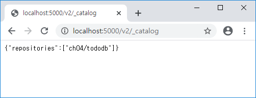
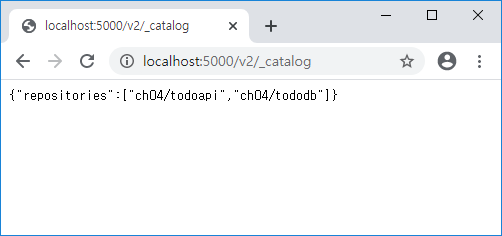
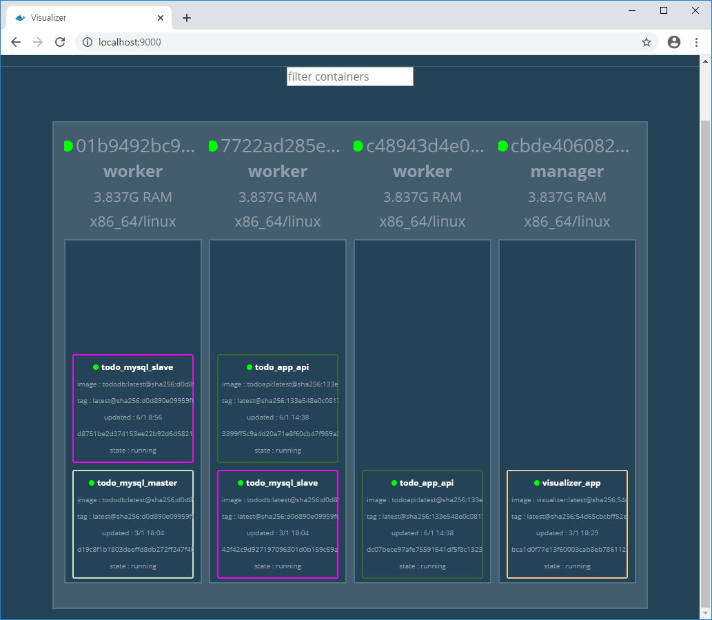
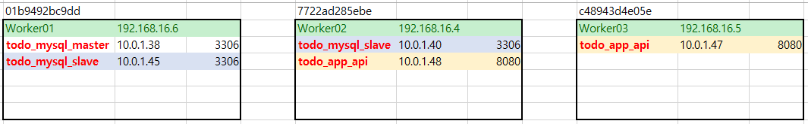
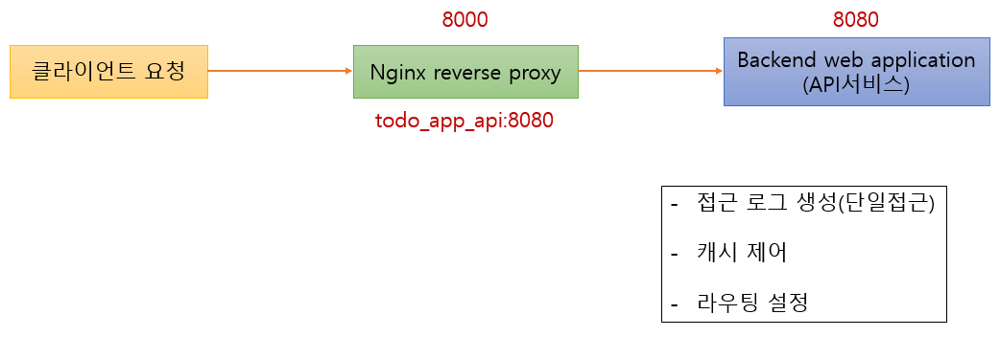
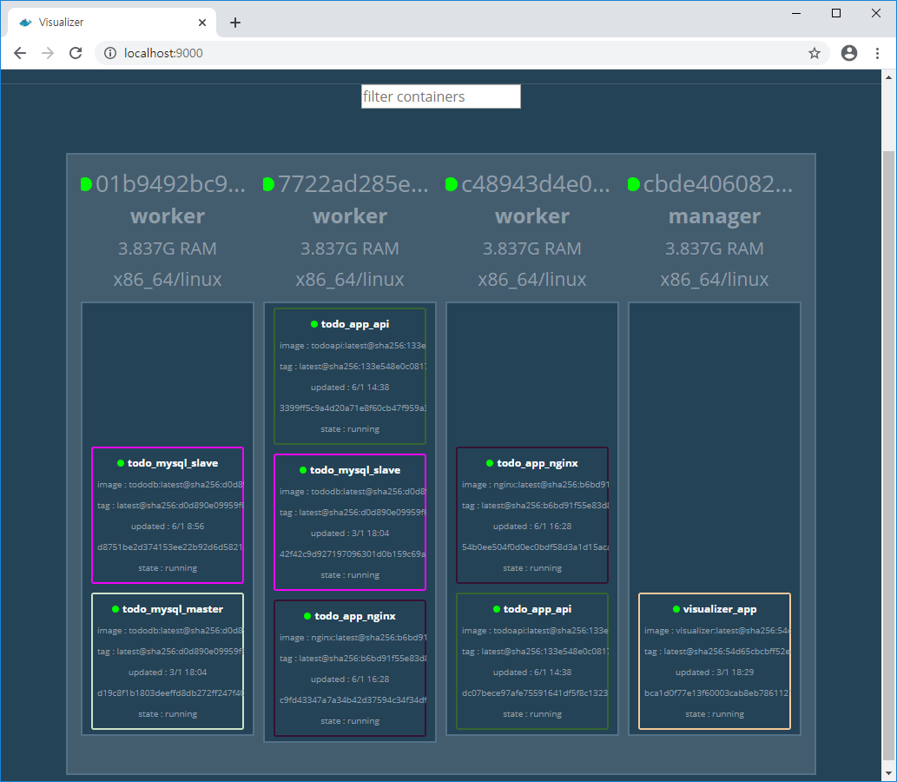
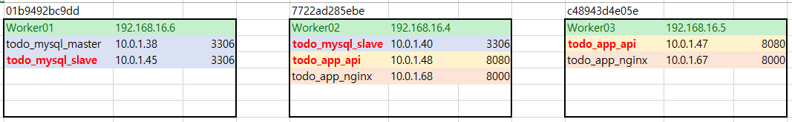
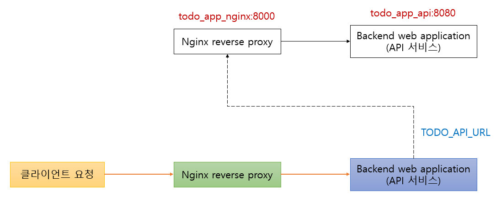

# Docker

### MySQL 컨테이너 확인 및 초기 데이터 투입


```bash
PS C:\Users\HPE\Work\docker\day03\swarm\todo> docker exec -it manager sh
/ # docker stack services todo_mysql
ID                  NAME                MODE                REPLICAS            IMAGE                              PORTS
8trla7ctennv        todo_mysql_slave    replicated          2/2                 registry:5000/ch04/tododb:latest
tgi7w2dna4hs        todo_mysql_master   replicated          1/1                 registry:5000/ch04/tododb:latest
/ # docker stack ls
NAME                SERVICES            ORCHESTRATOR
todo_mysql          2                   Swarm
visualizer          1                   Swarm
/ # docker service ls
ID                  NAME                MODE                REPLICAS            IMAGE                              PORTS
tgi7w2dna4hs        todo_mysql_master   replicated          1/1                 registry:5000/ch04/tododb:latest
8trla7ctennv        todo_mysql_slave    replicated          2/2                 registry:5000/ch04/tododb:latest
8lc1rc0cg5qf        visualizer_app      global              1/1                 dockersamples/visualizer:latest    *:9000->8080/tcp
/ # docker service ps 8trla7ctennv
ID                  NAME                     IMAGE                              NODE                DESIRED STATE       CURRENT STATE             ERROR               PORTS
65mry2szt4gb        todo_mysql_slave.1       registry:5000/ch04/tododb:latest   7722ad285ebe        Running             Running 2 days ago                          
tfanol8vb69k        todo_mysql_slave.2       registry:5000/ch04/tododb:latest   01b9492bc9dd        Running             Running 22 minutes ago                      
nsgr7yal7br2         \_ todo_mysql_slave.2   registry:5000/ch04/tododb:latest   c48943d4e05e        Shutdown            Shutdown 22 minutes ago
```

docer service ps `service_id` : 서비스 상세정보 확인


manager에서 실행

```bash
/ # docker service ls
ID                  NAME                MODE                REPLICAS            IMAGE                              PORTS
tgi7w2dna4hs        todo_mysql_master   replicated          1/1                 registry:5000/ch04/tododb:latest
8trla7ctennv        todo_mysql_slave    replicated          2/2                 registry:5000/ch04/tododb:latest
8lc1rc0cg5qf        visualizer_app      global              1/1                 dockersamples/visualizer:latest    *:9000->8080/tcp

/ # docker service ps tgi7w2dna4hs
ID                  NAME                  IMAGE                              NODE                DESIRED STATE       CURRENT STATE        ERROR               PORTS
r2arb317pssq        todo_mysql_master.1   registry:5000/ch04/tododb:latest   01b9492bc9dd        Running             Running 2 days ago


```

master의 ID를 가지고 service ps 명령어 실행. master가 어떤 Node에서 실행되는지 확인 가능하다.

01b9492bc9dd 노드에 master가 있는 것을 visualizer에서도 확인 가능하다.

```bash
/ # docker service ps todo_mysql_master --no-trunc --filter "desired-state=running" --format "docker exec -it {{.Node}} docker exec -it {{.Name}}.{{.ID}} bash"
docker exec -it 01b9492bc9dd docker exec -it todo_mysql_master.1.r2arb317pssqto063uyuk1ak7 bash
```

`--no-trunc` : 모든 정보를 다 보겠다는 옵션이다.


* master 접속 명령어

```bash
$ docker exec -it 01b9492bc9dd docker exec -it todo_mysql_master.1.r2arb317pssqto063uyuk1ak7 bash
```


windows에서 위의 command 실행

```bash
PS C:\Users\HPE> docker exec -it 01b9492bc9dd docker exec -it todo_mysql_master.1.r2arb317pssqto063uyuk1ak7 bash
root@d19c8f1b1803:/#
```


---

worker(01b949~)에 접속 후 mysql 접속하는 방법

```bash
PS C:\Users\HPE\Work\docker\day03\swarm\todo> docker exec -it 01b9492bc9dd sh
/ # docker ps
CONTAINER ID        IMAGE                              COMMAND                  CREATED             STATUS              PORTS                 NAMES
d8751be2d374        registry:5000/ch04/tododb:latest   "prehook add-server-…"   2 days ago          Up 32 minutes       3306/tcp, 33060/tcp   todo_mysql_slave.2.tfanol8vb69ky7hcrkj2brvc3
d19c8f1b1803        registry:5000/ch04/tododb:latest   "prehook add-server-…"   2 days ago          Up 2 days           3306/tcp, 33060/tcp   todo_mysql_master.1.r2arb317pssqto063uyuk1ak7
/ # docker exec -it d19c8f1b1803 bash
root@d19c8f1b1803:/# mysql -ugihyo -p tododb
```


---


manager에서 실행

```bash
PS C:\Users\HPE> docker exec -it manager sh
/ # docker service ps todo_mysql_slave --no-trunc --filter "desired-state=running" --format "docker exec -it {{.Node}} docker exec -it {{.Name}}.{{.ID}} bash"
docker exec -it 7722ad285ebe docker exec -it todo_mysql_slave.1.65mry2szt4gb0ntpi5w6d3uw2 bash
docker exec -it 01b9492bc9dd docker exec -it todo_mysql_slave.2.tfanol8vb69ky7hcrkj2brvc3 bash
```


* slave 접속 명령어

```bash
$ docker exec -it 7722ad285ebe docker exec -it todo_mysql_slave.1.65mry2szt4gb0ntpi5w6d3uw2 bash
$ docker exec -it 01b9492bc9dd docker exec -it todo_mysql_slave.2.tfanol8vb69ky7hcrkj2brvc3 bash
```


---


master 접속

```bash
PS C:\Users\HPE\Work\docker\day03\swarm\todo> docker exec -it 01b9492bc9dd docker exec -it todo_mysql_master.1.r2arb317pssqto063uyuk1ak7 bash
root@d19c8f1b1803:/# ls -al /usr/local/bin
total 11648
drwxrwsr-x 1 root staff    4096 Jan  3 09:01 .
drwxrwsr-x 1 root staff    4096 Dec 24 00:00 ..
-rwxr-xr-x 1 root root      185 Jan  3 08:53 add-server-id.sh
lrwxrwxrwx 1 root staff       8 Jan  3 09:01 codep -> entrykit
-rwxrwxr-x 1 root root    12715 Dec 28 23:00 docker-entrypoint.sh
-rwxr-xr-x 1 root root  9191600 Jan 21  2016 entrykit
-rwxr-xr-x 1 root staff 2698808 May 21  2017 gosu
-rwxr-xr-x 1 root root      130 Jan  3 08:53 init-data.sh
lrwxrwxrwx 1 root staff       8 Jan  3 09:01 prehook -> entrykit
lrwxrwxrwx 1 root staff       8 Jan  3 09:01 render -> entrykit
lrwxrwxrwx 1 root staff       8 Jan  3 09:01 switch -> entrykit
root@d19c8f1b1803:/# init-data.sh
root@d19c8f1b1803:/# mysql -ugihyo -p tododb
Enter password:
Reading table information for completion of table and column names
You can turn off this feature to get a quicker startup with -A

Welcome to the MySQL monitor.  Commands end with ; or \g.
Your MySQL connection id is 23
Server version: 5.7.28-log MySQL Community Server (GPL)

Copyright (c) 2000, 2019, Oracle and/or its affiliates. All rights reserved.

Oracle is a registered trademark of Oracle Corporation and/or its
affiliates. Other names may be trademarks of their respective
owners.

Type 'help;' or '\h' for help. Type '\c' to clear the current input statement.

mysql>
```

password는 gihyo이다. todo-mysql.yml 파일에서 확인할 수 있다.


```mysql
mysql> show databases;
+--------------------+
| Database           |
+--------------------+
| information_schema |
| tododb             |
+--------------------+
2 rows in set (0.00 sec)

mysql> use tododb;
Database changed
mysql> show tables;
+------------------+
| Tables_in_tododb |
+------------------+
| todo             |
+------------------+
1 row in set (0.00 sec)

mysql> select * from todo;
+----+----------------------------------+-------------------------------------------------------------------------------------------------------+----------+---------------------+---------------------+
| id | title                            | content                                                                                               | status   | created             | updated             |
+----+----------------------------------+-------------------------------------------------------------------------------------------------------+----------+---------------------+---------------------+
|  1 | MySQL 도커 이미지 만들기         | MySQL 마스터와 슬레이브를 환경 변수로 설정할 수 있는 MySQL 이미지 생성                                | DONE     | 2020-01-06 00:51:03 | 2020-01-06 00:51:03 |
|  2 | MySQL 스택 만들기                | MySQL 마스터 및 슬레이브 서비스로 구성된 스택을 스웜 클러스터에 구축한다                              | DONE     | 2020-01-06 00:51:03 | 2020-01-06 00:51:03 |
|  3 | API구현하기                      | Go 언어로 TODO를 확인, 수정할 수 있는 API 구현                                                        | PROGRESS | 2020-01-06 00:51:03 | 2020-01-06 00:51:03 |
|  4 | Nginx 도커 이미지 만들기         | HTTP 요청을 백엔드로 전달하는 Nginx 이미지 만들기                                                     | PROGRESS | 2020-01-06 00:51:03 | 2020-01-06 00:51:03 |
|  5 | API 스택 구축하기                | 스웜에 Nginx와 API로 구성된 스택을 구축                                                               | PROGRESS | 2020-01-06 00:51:03 | 2020-01-06 00:51:03 |
|  6 | 웹 앱 구현하기                   | Nuxt.js를 통해 API와 연동되는 웹 애플리케이션 구현                                                    | PROGRESS | 2020-01-06 00:51:03 | 2020-01-06 00:51:03 |
|  7 | 웹 앱 스택 구축                  | 스웜에 Nginx와 웹 앱으로 구성되는 스택을 구축                                                         | PROGRESS | 2020-01-06 00:51:03 | 2020-01-06 00:51:03 |
|  8 | 인그레스 구축하기                | 외부에서 스웜 클러스터에 접근하게 해주는 인그레스 구축                                                | TODO     | 2020-01-06 00:51:03 | 2020-01-06 00:51:03 |
+----+----------------------------------+-------------------------------------------------------------------------------------------------------+----------+---------------------+---------------------+
8 rows in set (0.00 sec)

```

master에 있는 내용


slave에 접속해서 동일하게 나오는지 확인

```bash
$ docker exec -it 7722ad285ebe docker exec -it todo_mysql_slave.1.65mry2szt4gb0ntpi5w6d3uw2 bash
mysql> show databases;
mysql> use tododb;
mysql> show tables;
mysql> select * from todo;
```


---

* IP 확인 방법

```bash
$ ifconfig
$ ip addr show
$ hostname -i
```


---


* Manager : 192.168.16.3
  * (manager) cbde4060829a
* Worker01
  * (worker) 01b9492bc9dd
* Worker02
  * (worker) 7722ad285ebe
* Worker03
  * (worker) c48943d4e05e


1. docker-compose up (R, M, W1, W2, W3)

2. (M) docker swarm init

3. (W1, W2, W3) docker swarm join

4. (M) docker node ls

5. (M) visualizer 설치

6. Mysql 이미지 생성 -> push(registry)

7. (M) docker network 생성(overlay) -> todoapp

8. (M) todo-mysql stack 추가 (todo_mysql)

9. (M) -> MySQL Master 접속

   ```bash
   $ init-data.sh
   $ mysql -ugihyo -p tododb
   ```

   


* Docer Swarm : 애플리케이션을 구성하는 일부 컨테이너(단일 또는 복수)를 제어하기 위한 단위. 여러가지 도커 호스트를 묶어서 사용하기 위한 개념.

* Docker Stack
  * 하나 이상의 서비스를 그룹으로 묶은 단위, 애플리케이션 전체 구성 정의
    * 서비스는 애플리케이션 이미지를 하나 밖에 다루지 못함
  * 여러 서비스를 함께 다룰 수 있음
  * 스텍을 사용해 배포된 서비스 그룹은 overlay 네트워크에 속함. overlay 네트워크를 이용하면 물리적으로 떨어져 있는 host를 같은 네트워크에서 사용 가능하다. 


service의 의미

1) compose -> container

2) swarm -> containers. 컨테이너의 목록

3) Kubernetes


```bash
$ docker service ps [service_id]
```

swarm이 있는 서비스의 상세정보 확인


visualizer는 기본적으로 8080 포트를 사용한다.


docker stack deploy -c /stack/visualizer.yml visualizer

서비스의 이름은 `stackname_servicename` 으로 지어진다.


```bash
$ docker stack ls
$ docker service ls
$ docker stack services visualizer
$ docker service ps visualizer_app  # 서비스의 상세 정보 확인
```


```bash
/ # hostname -i
192.168.16.3
/ # docker service ls
ID                  NAME                MODE                REPLICAS            IMAGE                              PORTS
tgi7w2dna4hs        todo_mysql_master   replicated          1/1                 registry:5000/ch04/tododb:latest
8trla7ctennv        todo_mysql_slave    replicated          2/2                 registry:5000/ch04/tododb:latest
8lc1rc0cg5qf        visualizer_app      global              1/1                 dockersamples/visualizer:latest    *:9000->8080/tcp
/ # docker service ps visualizer_app
ID                  NAME                                       IMAGE                             NODE                DESIRED STATE       CURRENT STATE        ERROR               PORTS
pxcflh1mfwem        visualizer_app.dimq8uhgcfheah7jd72gyk356   dockersamples/visualizer:latest   cbde4060829a        Running             Running 2 days ago
/ # docker ps
CONTAINER ID        IMAGE                             COMMAND             CREATED             STATUS                PORTS               NAMES
bca1d0f77e13        dockersamples/visualizer:latest   "npm start"         2 days ago          Up 2 days (healthy)   8080/tcp            visualizer_app.dimq8uhgcfheah7jd72gyk356.pxcflh1mfwem34c9t2h2s6kho
/ # docker exec -it bca1d0f77e13 sh
/app # hostname -i
10.0.3.3
/app # netstat -ntpl
Active Internet connections (only servers)
Proto Recv-Q Send-Q Local Address           Foreign Address         State       PID/Program name
tcp        0      0 127.0.0.11:33555        0.0.0.0:*               LISTEN      -
tcp        0      0 :::8080                 :::*                    LISTEN      21/node
```


p129

* Client가 nginx를 통해 웹 서버에 접속한다.
* web과 api만 이용해 구축할 수도 있지만 nginx도 추가로 사용
* nginx는 사용자의 진입점을 단일화 시킬 수 있다. 다양한 로그 파일을 하나를 통해 배포가 가능하다. 프록시, 로그 파일에 대한 단일점


* add-server-id.sh

현재 컨테이너의 IP 주소를 이용해 중복되지 않는 서버 ID를 채워넣어주는 역할을 한다.


* Dockerfile

entrykit : mysql 기동 전 수행할 작업을 적는다.


```bash
$ docker build -t localhost:5000/ch04/tododb:latest .
$ docker push localhost:5000/ch04/tododb:latest
```





http://localhost:5000/v2/_catalog

등록이 잘 되었는지 확인


/stack 폴더에 todo-mysql.yml 붙여넣기


manager에 접속

```bash
$ docker network ls
$ docker network create --driver=overlay --attachable todoapp
```


```bash
$ ls -al /stack
total 21
drwxrwxrwx    2 root     root          4096 Jan  3 08:54 .
drwxr-xr-x    1 root     root          4096 Jan  3 08:12 ..
-rwxr-xr-x    1 root     root           460 Jan  3 05:53 ch03-ingress.yml
-rwxr-xr-x    1 root     root           633 Jan  3 05:36 ch03-webapi.yml
-rwxr-xr-x    1 root     root          1347 Jan  2 08:38 docker-compose.yml
-rwxr-xr-x    1 root     root           872 Jan  3 08:58 todo-mysql.yml
-rwxr-xr-x    1 root     root           314 Jan  3 04:36 visualizer.yml
```


```bash
$ docker stack deploy -c /stack/todo-mysql.yml todo_mysql
```


```bash
$ docker service ls
ID                  NAME                MODE                REPLICAS            IMAGE                              PORTS
tgi7w2dna4hs        todo_mysql_master   replicated          1/1                 registry:5000/ch04/tododb:latest
8trla7ctennv        todo_mysql_slave    replicated          2/2                 registry:5000/ch04/tododb:latest
8lc1rc0cg5qf        visualizer_app      global              1/1                 dockersamples/visualizer:latest    *:9000->8080/tcp
```


slave에 접속

```bash
PS C:\Users\HPE\Work\docker\day03\swarm\todo\tododb> docker exec -it 7722ad285ebe docker exec -it todo_mysql_slave.1.65mry2szt4gb0ntpi5w6d3uw2 bash
$ hostname -i
10.0.1.40
$ netstat -ntpl
bash: netstat: command not found
$ apt-get install -y net-tools
$ netstat -ntpl  # 어떤 port가 열려있는지 확인할 수 있다.
Active Internet connections (only servers)
Proto Recv-Q Send-Q Local Address           Foreign Address         State       PID/Program name
tcp        0      0 127.0.0.11:41735        0.0.0.0:*               LISTEN      -
tcp6       0      0 :::3306                 :::*                    LISTEN      -
```

apt-get install -y net-tools


```bash
PS C:\Users\HPE\Work\docker\day03\swarm\todo\tododb> docker exec -it manager sh
$ docker stack services todo_mysql
ID                  NAME                MODE                REPLICAS            IMAGE                              PORTS
8trla7ctennv        todo_mysql_slave    replicated          2/2                 registry:5000/ch04/tododb:latest
tgi7w2dna4hs        todo_mysql_master   replicated          1/1                 registry:5000/ch04/tododb:latest
$ docker service ps todo_mysql_master
ID                  NAME                  IMAGE                              NODE                DESIRED STATE       CURRENT STATE        ERROR               PORTS
r2arb317pssq        todo_mysql_master.1   registry:5000/ch04/tododb:latest   01b9492bc9dd        Running             Running 2 days ago     
```


---

### API 서비스 구축

p148


* TODO 앱의 도메인 담당
* Go 언어로 구현
  * cmd/main.go 실행
    * MySQL 접속에 필요한 환경 변수 값 얻어오기
    * HTTP 요청 핸들러 생성 및 앤드포인트 등록, 서버 실행
  * env.go
    * 환경 변수 값을 받아 오는 코드
  * db.go
    * MySQL 접속 및 테이블 매핑
  * handler.go
    * 핸들러
    * TODO API의 요청 처리 -> TodoHandler
      * serveGET -> curl -s -XGET 
      * servePOST
      * servePUT


stack 아래 todo-api.yml

todo -> todoapi -> cmd -> main.go

todo -> todoapi -> ~

env.go : 환경 설정에 대한 파일

db.go : db에 접속할 수 있는 정보

handler.go : 사용자가 요청할 수 있는 함수들이 정의되어있는 파일


p154

curl : 리눅스에서 외부에 있는 리소스에 접근할 때 사용


RESTful API


todo -> todoapi -> Dockerfile

```bash
PS C:\Users\HPE\Work\docker\day03\swarm\todo\todoapi> dir


    디렉터리: C:\Users\HPE\Work\docker\day03\swarm\todo\todoapi


Mode                LastWriteTime         Length Name
----                -------------         ------ ----
d-----     2020-01-06   오후 1:57                cmd
-a----     2020-01-06   오후 2:03            918 db.go
-a----     2020-01-06   오후 2:03            342 Dockerfile
-a----     2020-01-06   오후 2:03            723 env.go
-a----     2020-01-06   오후 2:03           4714 handler.go
```


```bash
PS C:\Users\HPE\Work\docker\day03\swarm\todo\todoapi> docker build -t localhost:5000/ch04/todoapi:latest .
```


```bash
PS C:\Users\HPE\Work\docker\day03\swarm\todo\todoapi> docker images
REPOSITORY                    TAG                 IMAGE ID            CREATED             SIZE
localhost:5000/ch04/todoapi   latest              9c0c68433e20        23 seconds ago      781MB
test_mysql                    latest              46ad2d151ebf        2 days ago          437MB
```


```bash
PS C:\Users\HPE\Work\docker\day03\swarm\todo\todoapi> docker push localhost:5000/ch04/todoapi:latest
```


5000포트 접속

http://localhost:5000/v2/_catalog




```bash
PS C:\Users\HPE\Work\docker\day03\swarm\todo\todoapi> curl http://localhost:5000/v2/_catalog


StatusCode        : 200
StatusDescription : OK
Content           : {"repositories":["ch04/todoapi","ch04/tododb"]}

RawContent        : HTTP/1.1 200 OK
                    Docker-Distribution-Api-Version: registry/2.0
                    X-Content-Type-Options: nosniff
                    Content-Length: 48
                    Content-Type: application/json; charset=utf-8
                    Date: Mon, 06 Jan 2020 05:26:55 GMT...
Forms             : {}
Headers           : {[Docker-Distribution-Api-Version, registry/2.0], [X-Content-Type-Options, nosniff], [Content-Length, 48], [Content-Type, applicat
                    ion/json; charset=utf-8]...}
Images            : {}
InputFields       : {}
Links             : {}
ParsedHtml        : mshtml.HTMLDocumentClass
RawContentLength  : 48
```

curl 명령어를 사용해 확인 가능


* stack -> todo-app.yml

3~23까지 주석 -> Ctrl + /

단계적으로 할 것이기 때문에 nginx는 나중에 추가한다.

environment는 환경 변수 추가


서비스의 이름 가지고도 IP처럼 사용할 수 있다. 

10.0.1.38:3306

todo_mysql_master:3306


slave db는 2개이다.


```bash
$ docker stack ls
NAME                SERVICES            ORCHESTRATOR
todo_mysql          2                   Swarm
visualizer          1                   Swarm
$ docker stack services todo_mysql
ID                  NAME                MODE                REPLICAS            IMAGE                              PORTS
8trla7ctennv        todo_mysql_slave    replicated          2/2                 registry:5000/ch04/tododb:latest
tgi7w2dna4hs        todo_mysql_master   replicated          1/1                 registry:5000/ch04/tododb:latest
$ docker service ls
ID                  NAME                MODE                REPLICAS            IMAGE                              PORTS
tgi7w2dna4hs        todo_mysql_master   replicated          1/1                 registry:5000/ch04/tododb:latest
8trla7ctennv        todo_mysql_slave    replicated          2/2                 registry:5000/ch04/tododb:latest
8lc1rc0cg5qf        visualizer_app      global              1/1                 dockersamples/visualizer:latest    *:9000->8080/tcp
```


```bash
$ docker stack deploy -c /stack/todo-app.yml todo_app
Creating service todo_app_api
```


```bash
$ docker service ls
ID                  NAME                MODE                REPLICAS            IMAGE                               PORTS
nzrlxzbvgrpt        todo_app_api        replicated          2/2                 registry:5000/ch04/todoapi:latest
tgi7w2dna4hs        todo_mysql_master   replicated          1/1                 registry:5000/ch04/tododb:latest
8trla7ctennv        todo_mysql_slave    replicated          2/2                 registry:5000/ch04/tododb:latest
8lc1rc0cg5qf        visualizer_app      global              1/1                 dockersamples/visualizer:latest     *:9000->8080/tcp
```


```bash
$ docker service logs -f todo_app_api
todo_app_api.2.peftnit5asew@7722ad285ebe    | 2020/01/06 05:38:23 Listen HTTP Server
todo_app_api.1.j9m3x8izdrho@c48943d4e05e    | 2020/01/06 05:38:23 Listen HTTP Server
```

서비스가 정상적으로 작동하는지 서비스의 로그 확인


```bash
/ # docker service ps todo_app_api
ID                  NAME                IMAGE                               NODE                DESIRED STATE       CURRENT STATE           ERROR               PORTS
j9m3x8izdrho        todo_app_api.1      registry:5000/ch04/todoapi:latest   c48943d4e05e        Running             Running 5 minutes ago
peftnit5asew        todo_app_api.2      registry:5000/ch04/todoapi:latest   7722ad285ebe        Running             Running 5 minutes ago
```

두 가지 서비스가 어떤 노드에 들어가있는지 확인


visualizer로 확인




manager에 접속 후 실행

```bash
/ # docker service ps todo_app_api --no-trunc --filter "desired-state=running" --format "docker exec -it {{.Node}} docker exec -it {{.Name}}.{{.ID}} bash"
docker exec -it c48943d4e05e docker exec -it todo_app_api.1.j9m3x8izdrhoyhtm42o9mmvyh bash
docker exec -it 7722ad285ebe docker exec -it todo_app_api.2.peftnit5asewy2o7xjuepit4k bash
```


```bash
$ docker exec -it c48943d4e05e docker exec -it todo_app_api.1.j9m3x8izdrhoyhtm42o9mmvyh bash
root@dc07bece97af:/# hostname -i
10.0.1.47
root@dc07bece97af:/# apt-get update
root@dc07bece97af:/# apt-get install -y net-tools
root@dc07bece97af:/# netstat -ntpl
Active Internet connections (only servers)
Proto Recv-Q Send-Q Local Address           Foreign Address         State       PID/Program name
tcp        0      0 127.0.0.11:43291        0.0.0.0:*               LISTEN      -
tcp6       0      0 :::8080                 :::*                    LISTEN      1/todoapi
```


```bash
$ docker exec -it 7722ad285ebe docker exec -it todo_app_api.2.peftnit5asewy2o7xjuepit4k bash
root@3399ff5c9a4d:/# hostname -i
10.0.1.48
root@3399ff5c9a4d:/# apt-get update
root@3399ff5c9a4d:/# apt-get install -y net-tools
root@3399ff5c9a4d:/# netstat -ntpl
Active Internet connections (only servers)
Proto Recv-Q Send-Q Local Address           Foreign Address         State       PID/Program name
tcp        0      0 127.0.0.11:45569        0.0.0.0:*               LISTEN      -
tcp6       0      0 :::8080                 :::*                    LISTEN      1/todoapi
```


---





worker02에 접속

```bash
$ docker exec -it worker02 sh
```


todo_app_api에 접속

```bash
/ # docker ps
CONTAINER ID        IMAGE                               COMMAND                  CREATED             STATUS              PORTS                 NAMES
3399ff5c9a4d        registry:5000/ch04/todoapi:latest   "todoapi"                32 minutes ago      Up 32 minutes                             todo_app_api.2.peftnit5asewy2o7xjuepit4k
42f42c9d9271        registry:5000/ch04/tododb:latest    "prehook add-server-…"   2 days ago          Up 2 days           3306/tcp, 33060/tcp   todo_mysql_slave.1.65mry2szt4gb0ntpi5w6d3uw2

/ # docker exec -it 3399ff5c9a4d bash
root@3399ff5c9a4d:/#
```


apt-get install -y curl

```bash
root@3399ff5c9a4d:/# apt-get install -y curl
```


curl -XGET http://todo_app_api:8080/todo?status=DONE

```bash
root@3399ff5c9a4d:/# curl -XGET http://todo_app_api:8080/todo?status=DONE
[{"id":1,"title":"MySQL 도커 이미지 만들기","content":"MySQL 마스터와 슬레이브를 환경 변수로 설정할 수 있는 MySQL 이미지 생성","status":"DONE","created":"2020-01-06T00:51:03Z","updated":"2020-01-06T00:51:03Z"},{"id":2,"title":"MySQL 스택 만들기","content":"MySQL 마스터 및 슬레이브 서비스로 구성된 스택을 스웜 클러스터에 구축한다","status":"DONE","created":"2020-01-06T00:51:03Z","updated":"2020-01-06T00:51:03Z"}]
```


todo_mysql_master, todo_mysql_slave, todo_app_api

5곳 중 어디에 접속해도 확인 가능해야 한다.


todo_app_api는 8080으로 open 되어있다.

서비스 요청 가능

---


```bash
PS C:\Users\HPE> docker exec -it worker03 sh
/ # docker ps
CONTAINER ID        IMAGE                               COMMAND             CREATED             STATUS              PORTS               NAMES
dc07bece97af        registry:5000/ch04/todoapi:latest   "todoapi"           55 minutes ago      Up 54 minutes                           todo_app_api.1.j9m3x8izdrhoyhtm42o9mmvyh
/ # docker exec -it dc07bece97af bash
root@dc07bece97af:/# curl -XGET http://todo_app_api:8080/todo?status=PROGRESS
[{"id":3,"title":"API구현하기","content":"Go 언어로 TODO를 확인, 수정할 수 있는 API 구현","status":"PROGRESS","created":"2020-01-06T00:51:03Z","updated":"2020-01-06T00:51:03Z"},{"id":4,"title":"Nginx 도커 이미지 만들기","content":"HTTP 요청을 백엔드로 전달하는 Nginx 이미지 만들기","status":"PROGRESS","created":"2020-01-06T00:51:03Z","updated":"2020-01-06T00:51:03Z"},{"id":5,"title":"API 스택  구축하기","content":"스웜에 Nginx와 API로 구성된 스택을 구축","status":"PROGRESS","created":"2020-01-06T00:51:03Z","updated":"2020-01-06T00:51:03Z"},{"id":6,"title":"웹 앱 구현하기","content":"Nuxt.js를 통해 API와 연동되는 웹 애플리케이션 구현","status":"PROGRESS","created":"2020-01-06T00:51:03Z","updated":"2020-01-06T00:51:03Z"},{"id":7,"title":"웹 앱 스택 구축","content":"스웜에 Nginx와 웹  앱으로 구성되는 스택을 구축","status":"PROGRESS","created":"2020-01-06T00:51:03Z","updated":"2020-01-06T00:51:03Z"}]
```

PROGRESS, TODO, DONE


---


masterDB 접속

```bash
docker exec -it 01b9492bc9dd docker exec -it todo_mysql_master.1.r2arb317pssqto063uyuk1ak7 bash
root@d19c8f1b1803:/# mysql -ugihyo -p tododb
Enter password:
```


```mysql
mysql> select id, status from todo;
+----+----------+
| id | status   |
+----+----------+
|  1 | DONE     |
|  2 | DONE     |
|  3 | PROGRESS |
|  4 | PROGRESS |
|  5 | PROGRESS |
|  6 | PROGRESS |
|  7 | PROGRESS |
|  8 | TODO     |
+----+----------+
8 rows in set (0.00 sec)
```


```bash
PS C:\Users\HPE\Work\docker\day03\swarm\todo\todoapi> docker exec -it worker02 sh
/ # docker ps
CONTAINER ID        IMAGE                               COMMAND                  CREATED             STATUS              PORTS                 NAMES
3399ff5c9a4d        registry:5000/ch04/todoapi:latest   "todoapi"                About an hour ago   Up About an hour                          todo_app_api.2.peftnit5asewy2o7xjuepit4k
42f42c9d9271        registry:5000/ch04/tododb:latest    "prehook add-server-…"   2 days ago          Up 2 days           3306/tcp, 33060/tcp   todo_mysql_slave.1.65mry2szt4gb0ntpi5w6d3uw2

/ # docker exec -it 3399ff5c9a4d bash
root@3399ff5c9a4d:/#
```

worker02 접속 -> todo_app_api 접속


```bash
root@3399ff5c9a4d:/# curl -XGET http://todo_app_api:8080/todo?status=TODO
[{"id":8,"title":"인그레스 구축하기","content":"외부에서 스웜 클러스터에 접근하게 해주는 인그레스 구축","status":"TODO","created":"2020-01-06T00:51:03Z","updated":"2020-01-06T00:51:03Z"}]root@3399ff5c9a4d:/#
root@3399ff5c9a4d:/# curl -XPOST -d '{"title":"Test9","content":"Content9"}' http://todo_app_api:8080/todo
root@3399ff5c9a4d:/#
```

POST로 데이터 추가


```bash
mysql> select title from todo;
+----------------------------------+
| title                            |
+----------------------------------+
| MySQL 도커 이미지 만들기         |
| MySQL 스택 만들기                |
| API구현하기                      |
| Nginx 도커 이미지 만들기         |
| API 스택 구축하기                |
| 웹 앱 구현하기                   |
| 웹 앱 스택 구축                  |
| 인그레스 구축하기                |
| Test9                            |
+----------------------------------+
9 rows in set (0.00 sec)
```


```bash
root@3399ff5c9a4d:/# curl -XGET http://todo_app_api:8080/todo?status=TODO
[{"id":9,"title":"Test9","content":"Content9","status":"TODO","created":"2020-01-06T06:38:41Z","updated":"2020-01-06T06:38:41Z"},{"id":8,"title":"인그레스 구축하기","content":"외부에서 스웜 클러스터에 접근하게 해주는 인그레스 구축","status":"TODO","created":"2020-01-06T00:51:03Z","updated":"2020-01-06T00:51:03Z"}]
```


---


```bash
PS C:\Users\HPE\Work\docker\day03\swarm\todo\todoapi> docker exec -it 01b9492bc9dd docker exec -it todo_mysql_master.1.r2arb317pssqto063uyuk1ak7 bash
root@d19c8f1b1803:/# curl -XGET http://todo_app_api:8080/todo?status=DONE
[{"id":1,"title":"MySQL 도커 이미지 만들기","content":"MySQL 마스터와 슬레이브를 환경 변수로 설정할 수 있는 MySQL 이미지 생성","status":"DONE","created":"2020-01-06T00:51:03Z","updated":"2020-01-06T00:51:03Z"},{"id":2,"title":"MySQL 스택 만들기","content":"MySQL 마스터 및 슬레이브 서비스로 구성된 스택을 스웜 클러스터에 구축한다","status":"DONE","created":"2020-01-06T00:51:03Z","updated":"2020-01-06T00:51:03Z"}]
```


```bash
root@d19c8f1b1803:/# curl -XPUT -d '{"id":9,"title":"Modified title","content":"Modified Content","status":"DONE"}' http://todo_app_api:8080/todo
```


```bash
root@d19c8f1b1803:/# curl -XGET http://todo_app_api:8080/todo?status=DONE
[{"id":9,"title":"Modified title","content":"Modified Content","status":"DONE","created":"2020-01-06T06:38:41Z","updated":"2020-01-06T06:56:53Z"},{"id":1,"title":"MySQL 도커 이미지 만들기","content":"MySQL 마스터와 슬레이브를 환경 변수로 설정할 수 있는 MySQL 이미지 생성","status":"DONE","created":"2020-01-06T00:51:03Z","updated":"2020-01-06T00:51:03Z"},{"id":2,"title":"MySQL 스택 만들기","content":"MySQL 마스터 및 슬레이브 서비스로 구성된 스택을 스웜 클러스터에 구축한다","status":"DONE","created":"2020-01-06T00:51:03Z","updated":"2020-01-06T00:51:03Z"}]
```


---

### Nginx 구축

p158





todo-app.yml

주석 해제 (Ctrl + /)


nginx 이미지 만들기


p165 도커파일 확인

p166


* entrykit 템플릿을 이용하여 환경 변수 제어
  * {{var "환경 변수 명"}}
  * {{var "환경 변수 명" | default "기본값"}}


* API를 위한 Dockerfile build

* Nginx를 거쳐 API 서비스에 접근하기

  * 조금 전에 작성한 todo_app_api 서비스 앞에 Nginx를 배치

    ```bash
    $ docker exec -it manager docker stack deploy -c /stack/todo-app.yml todo_app
    ```

    

curl -XGET http://todo_app_nginx:8000/todo?status=DONE


C:\Users\HPE\Work\docker\day03\swarm\todo\todonginx 로 이동

```bash
$ docker build -t ch04/nginx:latest .
$ docker tag ch04/nginx:latest localhost:5000/ch04/nginx:latest
$ docker push localhost:5000/ch04/nginx:latest
```


manager에 접속

```bash
$ ls -al /stack
total 30
...
-rwxr-xr-x    1 root     root           954 Jan  6 07:16 todo-app.yml
-rwxr-xr-x    1 root     root           960 Jan  6 05:01 todo-frontend.yml
-rwxr-xr-x    1 root     root           390 Jan  6 05:01 todo-ingress.yml
-rwxr-xr-x    1 root     root           872 Jan  3 08:58 todo-mysql.yml
-rwxr-xr-x    1 root     root           302 Jan  6 05:00 visualizer.yml
```

todo-app.yml 파일이 있는지 확인


```bash
$ docker stack deploy -c /stack/todo-app.yml todo_app
Updating service todo_app_api (id: nzrlxzbvgrpt4b987qoy5er6d)
Creating service todo_app_nginx
```


```bash
$ docker service ls
ID                  NAME                MODE                REPLICAS            IMAGE                               PORTS
nzrlxzbvgrpt        todo_app_api        replicated          2/2                 registry:5000/ch04/todoapi:latest
i45rknjk7q4b        todo_app_nginx      replicated          2/2                 registry:5000/ch04/nginx:latest
tgi7w2dna4hs        todo_mysql_master   replicated          1/1                 registry:5000/ch04/tododb:latest
8trla7ctennv        todo_mysql_slave    replicated          2/2                 registry:5000/ch04/tododb:latest
8lc1rc0cg5qf        visualizer_app      global              1/1                 dockersamples/visualizer:latest     *:9000->8080/tcp
```





---

#### todo_app_nginx IP, Port 번호 확인





worker02 접속

```bash
$ docker exec -it worker02 sh
```


todo_app_nginx 접속

```bash
$ docker ps
CONTAINER ID        IMAGE                               COMMAND                  CREATED             STATUS              PORTS                 NAMES
c9fd43347a7a        registry:5000/ch04/nginx:latest     "render /etc/nginx/n…"   9 minutes ago       Up 9 minutes        80/tcp                todo_app_nginx.2.27ukif6o87ovqyz8a1epcnpbk
3399ff5c9a4d        registry:5000/ch04/todoapi:latest   "todoapi"                2 hours ago         Up 2 hours                                todo_app_api.2.peftnit5asewy2o7xjuepit4k
42f42c9d9271        registry:5000/ch04/tododb:latest    "prehook add-server-…"   2 days ago          Up 2 days           3306/tcp, 33060/tcp   todo_mysql_slave.1.65mry2szt4gb0ntpi5w6d3uw2
$ docker exec -it c9fd43347a7a bash
```


IP, Port 번호 확인

```bash
$ hostname -i
10.0.1.68
$ apt-get install -y net-tools
$ netstat -nptl
Active Internet connections (only servers)
Proto Recv-Q Send-Q Local Address           Foreign Address         State       PID/Program name
tcp        0      0 127.0.0.11:34569        0.0.0.0:*               LISTEN      -
tcp        0      0 0.0.0.0:8000            0.0.0.0:*               LISTEN      1/nginx: master pro
```


worker03 접속

```bash
$ docker exec -it worker03 sh
```


todo_app_nginx 접속

```bash
$ docker ps
CONTAINER ID        IMAGE                               COMMAND                  CREATED             STATUS              PORTS               NAMES
54b0ee504f0d        registry:5000/ch04/nginx:latest     "render /etc/nginx/n…"   20 minutes ago      Up 20 minutes       80/tcp              todo_app_nginx.1.s54ym304gy35roa7hwq1f4fr1
dc07bece97af        registry:5000/ch04/todoapi:latest   "todoapi"                2 hours ago         Up 2 hours                              todo_app_api.1.j9m3x8izdrhoyhtm42o9mmvyh
$ docker exec -it todo_app_nginx.1.s54ym304gy35roa7hwq1f4fr1 bash
```


IP, Port 번호 확인

```bash
$ hostname -i
10.0.1.67
$ apt-get install -y net-tools
$ netstat -ntpl
Active Internet connections (only servers)
Proto Recv-Q Send-Q Local Address           Foreign Address         State       PID/Program name
tcp        0      0 127.0.0.11:43921        0.0.0.0:*               LISTEN      -
tcp        0      0 0.0.0.0:8000            0.0.0.0:*               LISTEN      1/nginx: master pro
```


---


worker01에 가서 nginx를 통해 원하는 데이터 가져오기

```bash
$ docker exec -it worker01 sh
```


```bash
$ docker ps
CONTAINER ID        IMAGE                              COMMAND                  CREATED             STATUS              PORTS                 NAMES
d8751be2d374        registry:5000/ch04/tododb:latest   "prehook add-server-…"   2 days ago          Up 8 hours          3306/tcp, 33060/tcp   todo_mysql_slave.2.tfanol8vb69ky7hcrkj2brvc3
d19c8f1b1803        registry:5000/ch04/tododb:latest   "prehook add-server-…"   2 days ago          Up 2 days           3306/tcp, 33060/tcp   todo_mysql_master.1.r2arb317pssqto063uyuk1ak7
$ docker exec -it d19c8f1b1803 bash
```


```bash
root@d19c8f1b1803:/# curl http://todo_app_nginx:8000/todo?status=DONE
{"status":500,"message":"Execute Query is failed"}root@d19c8f1b1803:/# curl http://todo_app_nginx:8000/todo?status=DONE
[{"id":9,"title":"Modified title","content":"Modified Content","status":"DONE","created":"2020-01-06T06:38:41Z","updated":"2020-01-06T06:56:53Z"},{"id":1,"title":"MySQL 도커 이미지 만들기","content":"MySQL 마스터와 슬레 이브를 환경 변수로 설정할 수 있는 MySQL 이미지 생성","status":"DONE","created":"2020-01-06T00:51:03Z","updated":"2020-01-06T00:51:03Z"},{"id":2,"title":"MySQL 스택 만들기","content":"MySQL 마스터 및 슬레이브 서비스로 구 성된 스택을 스웜 클러스터에 구축한다","status":"DONE","created":"2020-01-06T00:51:03Z","updated":"2020-01-06T00:51:03Z"}]
```


---


manager에서 확인

```bash
$ docker service ls
ID                  NAME                MODE                REPLICAS            IMAGE                               PORTS
nzrlxzbvgrpt        todo_app_api        replicated          2/2                 registry:5000/ch04/todoapi:latest
i45rknjk7q4b        todo_app_nginx      replicated          2/2                 registry:5000/ch04/nginx:latest
tgi7w2dna4hs        todo_mysql_master   replicated          1/1                 registry:5000/ch04/tododb:latest
8trla7ctennv        todo_mysql_slave    replicated          2/2                 registry:5000/ch04/tododb:latest
8lc1rc0cg5qf        visualizer_app      global              1/1                 dockersamples/visualizer:latest     *:9000->8080/tcp
```


---

### 웹 서비스 구축

p168





* TODO의 진행 상황을 보여주는 웹 어플리케이션
  * node.js
    * Vue.js 기반 프레임워크는 nuxt.js 사용


* TODO API 호출 및 페이지 HTML 렌더링 (todoweb/pages/index.vue)

*  Web Service의 Dockerfile

  ```bash
  (todoweb) $ npm istall  # 의존 모듈 다운로드
  (todoweb) $ npm run build  # 릴리스용 빌드
  (todoweb) $ npm run start  # 애플리케이션 서버 시작
  ```

  -> Docker 이미지 생성 전 테스트

  ```bash
  $ docker build -t ch04/todoweb:latest .
  $ docker tag ch04/todoweb:latest localhost:5000/ch04/todoweb:latest .
  $ docker push localhost:5000/ch04/todoweb:latest
  ```

  

* static file을 위한 Nginx proxy 설정
  * 정적 파일은 웹 애플리케이션을 거치가 있고 Nginx에서 바로 응답


인스래스로 서비스 노출하기 (p178)


