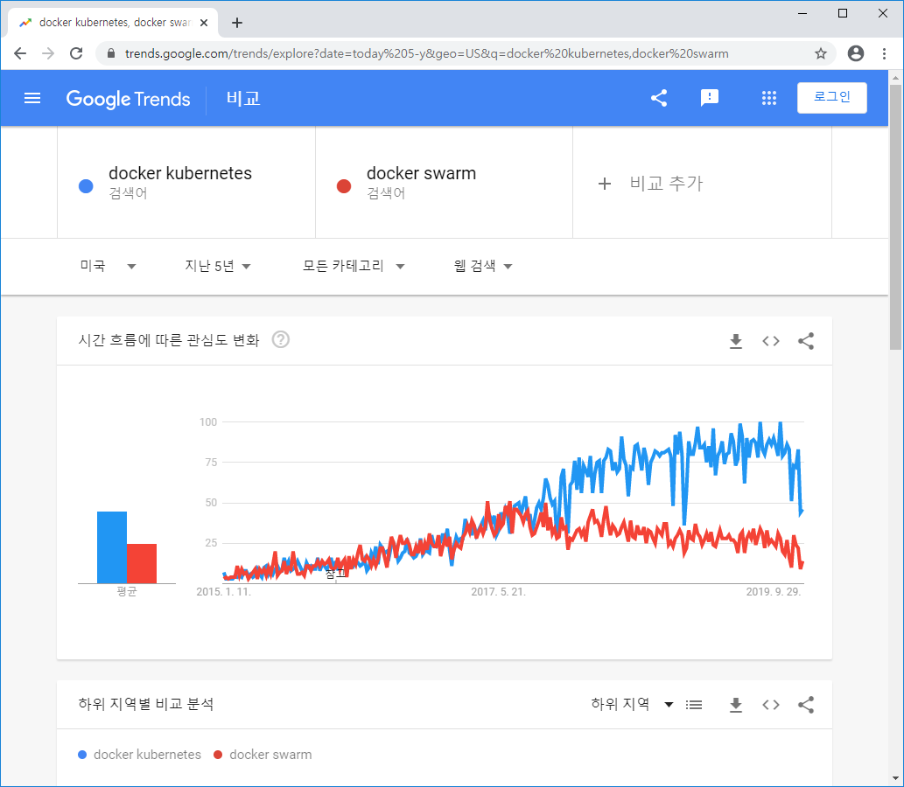
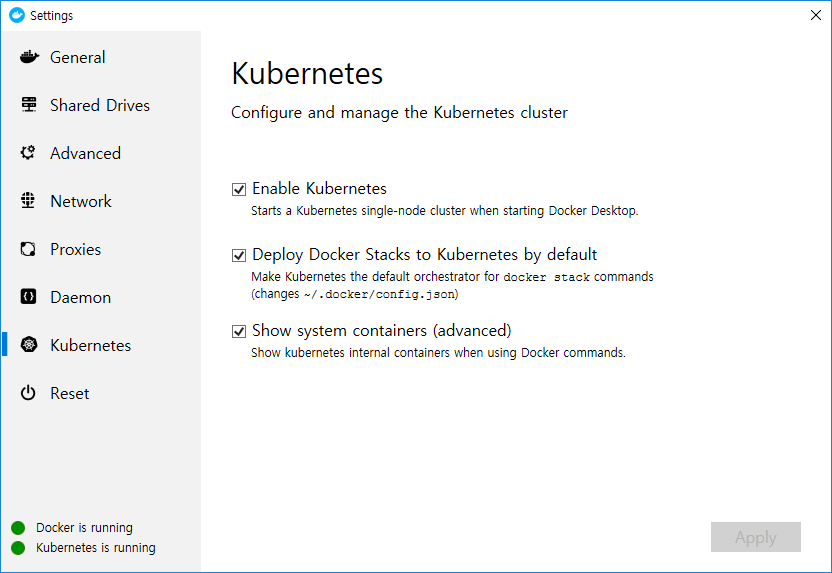
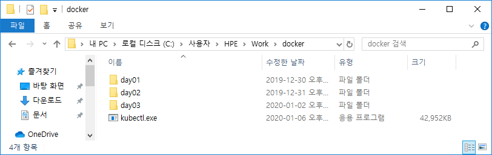
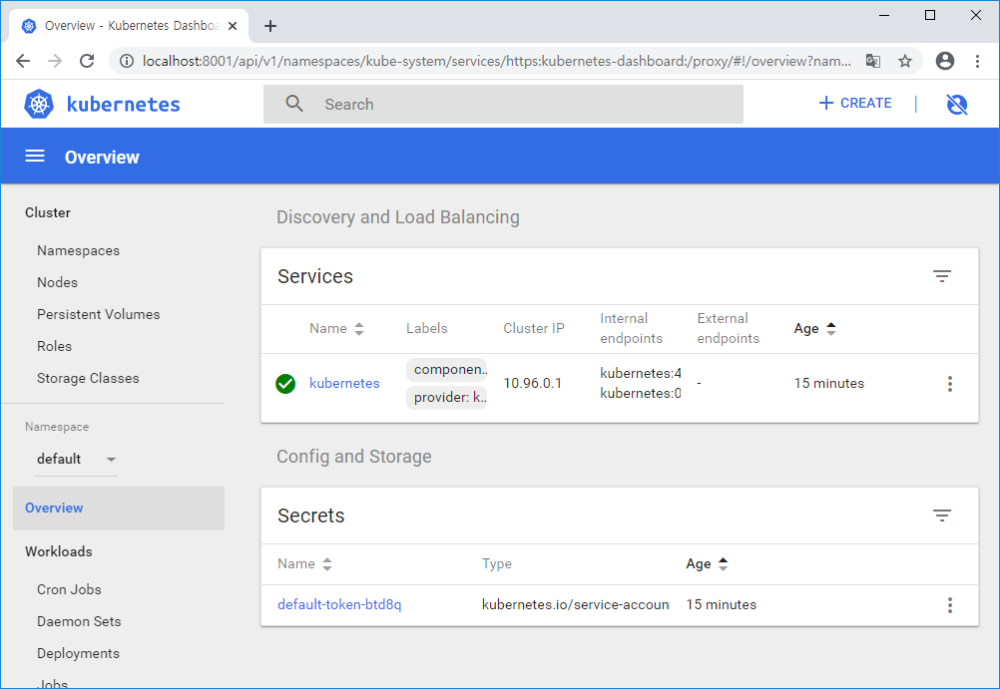

# Kubernetes


* Docker Container 운영을 자동화하기 위한 컨테이너 오케스트레이션 툴
  * 컨테이너 배포 및 배치 전략
  * Scale in/Scale out
  * Service discovery
  * 기타 운용
* 구글의 Borg 프로젝트에서 시작
* 2017년 Docker에 정식으로 통합된 사실상 표준
  * DockerCon EU 2017


사용하기 복잡하지만 기능이 엄청 많다.


* Kubernetes : Swarm보다 충실한 기능을 갖춘 컨테이너 오케스트레이션 시스템
* Swarm : 여러 대의 호스트를 묶어 기초적인 컨테이너 오케스트레이션 기능 제공, 간단한 멀티 컨테이너 구축


Kubernetes(cli)





* Kubernetes 설치
  * Minikube
    * 이전에는 로컬 환경에서 Kubernetes를 구축하기 위해 사용
  * 2018년부터 안정버전에서도 설치 가능
  * 윈도우 설치)
    * 바탕화면 트레이 > 도커 아이콘 (오른쪽 클릭) > Setting 메뉴 > Kubernetes 





* kubectl 설치

  * Kubernetes를 다루기 위한 Command Line Interface

  * 윈도우 설치)

    * https://storage.googleapis.com/kubernetes-release/release/v1.17.0/bin/windows/amd64/kubectl.exe
    * 다운로드, PATH 추가

    ```bash
    $ kubectl version
    ```

    

C:\Users\HPE\Work\docker 에 파일 옮기기




```bash
C:\Users\HPE\Work\docker>kubectl version
Client Version: version.Info{Major:"1", Minor:"17", GitVersion:"v1.17.0", GitCommit:"70132b0f130acc0bed193d9ba59dd186f0e634cf", GitTreeState:"clean", BuildDate:"2019-12-07T21:20:10Z", GoVersion:"go1.13.4", Compiler:"gc", Platform:"windows/amd64"}
Server Version: version.Info{Major:"1", Minor:"14", GitVersion:"v1.14.8", GitCommit:"211047e9a1922595eaa3a1127ed365e9299a6c23", GitTreeState:"clean", BuildDate:"2019-10-15T12:02:12Z", GoVersion:"go1.12.10", Compiler:"gc", Platform:"linux/amd64"}
```

버전 확인


* 대시보드 설치(p190)

  * kubectl 이용해 설치

  ```bash
  $ kubectl apply -f https://raw.githubusercontent.com/kubernetes/dashboard/v1.8.3/src/deploy/recommended/kubernetes-dashboard.yaml
  secret/kubernetes-dashboard-certs created
  serviceaccount/kubernetes-dashboard created
  role.rbac.authorization.k8s.io/kubernetes-dashboard-minimal created
  rolebinding.rbac.authorization.k8s.io/kubernetes-dashboard-minimal created
  deployment.apps/kubernetes-dashboard created
  service/kubernetes-dashboard created
  ```

  

  ```bash
  $ kubectl get pod --namespace=kube-system -l k8s-app=kubernetes-dashboard
  NAME                                    READY   STATUS    RESTARTS   AGE
  kubernetes-dashboard-6fd7f9c494-hk7f2   1/1     Running   0          59s
  ```

  

  ```bash
  $ kubectl proxy
  Starting to serve on 127.0.0.1:8001
  ```

  

  http://localhost:8001/api/v1/namespaces/kube-system/services/https:kubernetes-dashboard:/proxy/

  

  


토큰 정보 -> SKIP

대시보드는 비밀번호 노출 위험이 있기 때문에 개발환경에서 사용하는것이 좋다.