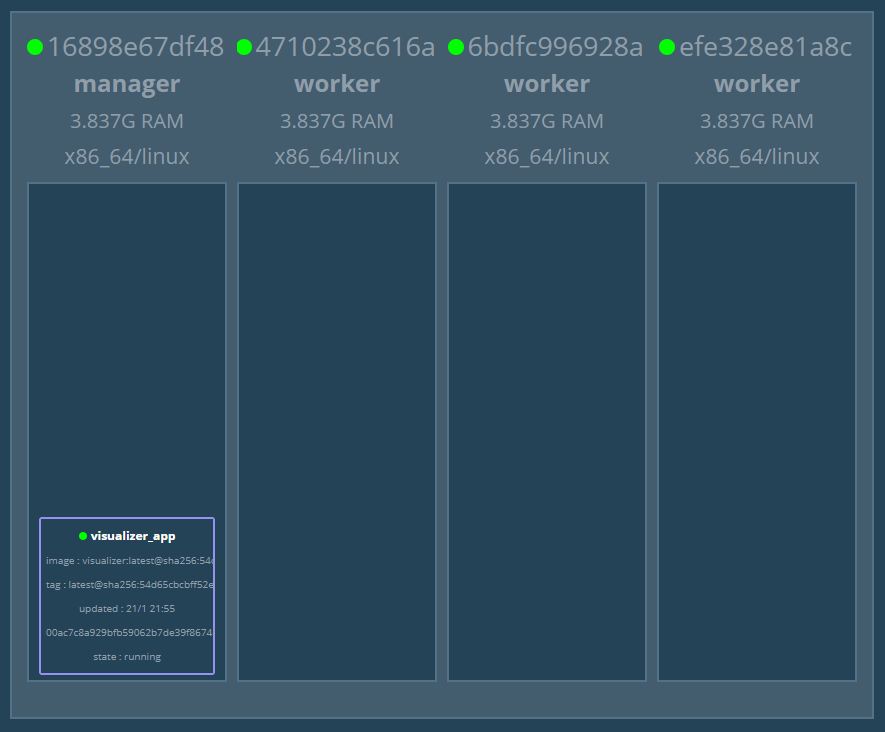
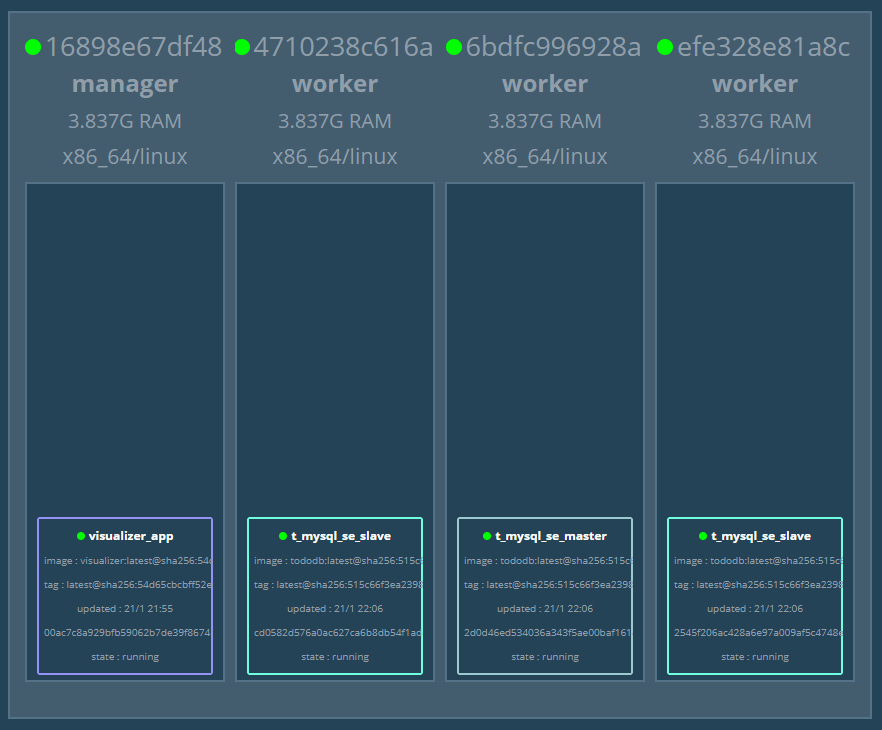
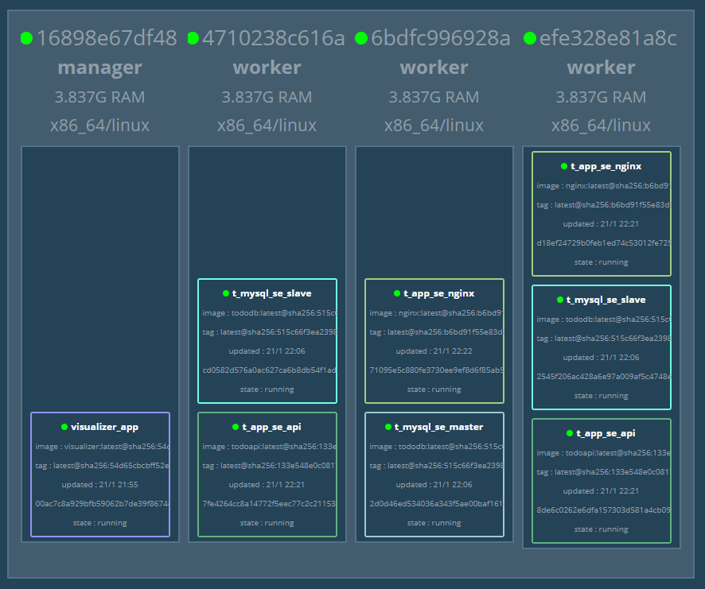
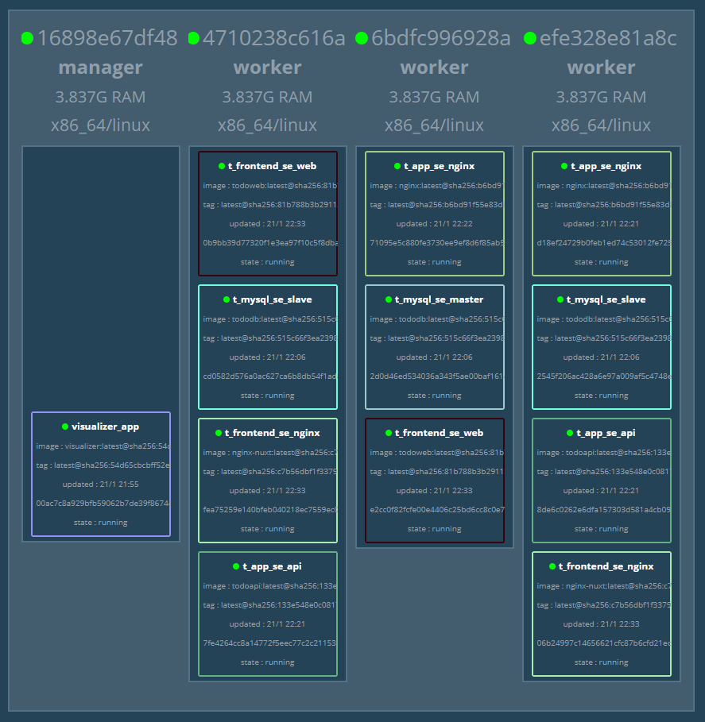
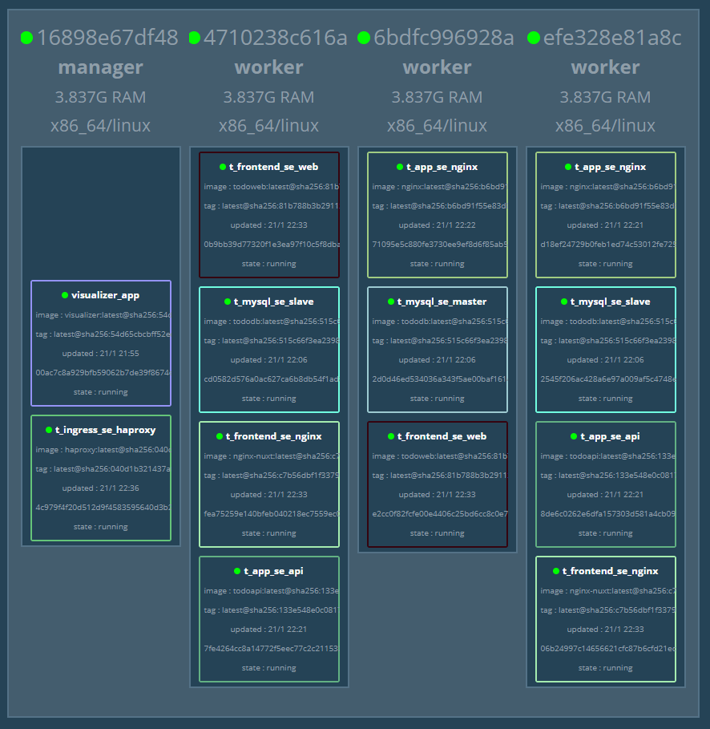

# Docker exam


### Docker Compose & Swarm

```bash
PS C:\Users\HPE\Work\docker\exam> docker-compose up
```


```bash
PS C:\Users\HPE\Work\docker\exam> docker ps
CONTAINER ID        IMAGE                 COMMAND                  CREATED             STATUS              PORTS                                                                   NAMES
efe328e81a8c        docker:19.03.5-dind   "dockerd-entrypoint.…"   23 seconds ago      Up 17 seconds       2375-2376/tcp, 4789/udp, 7946/tcp, 7946/udp                             work02
6bdfc996928a        docker:19.03.5-dind   "dockerd-entrypoint.…"   23 seconds ago      Up 18 seconds       2375-2376/tcp, 4789/udp, 7946/tcp, 7946/udp                             work03
4710238c616a        docker:19.03.5-dind   "dockerd-entrypoint.…"   23 seconds ago      Up 17 seconds       2375-2376/tcp, 4789/udp, 7946/tcp, 7946/udp                             work01
16898e67df48        docker:19.03.5-dind   "dockerd-entrypoint.…"   30 seconds ago      Up 27 seconds       2375-2376/tcp, 3375/tcp, 0.0.0.0:9000->9000/tcp, 0.0.0.0:8000->80/tcp   manager
b0536714b392        registry:latest       "/entrypoint.sh /etc…"   32 seconds ago      Up 29 seconds       0.0.0.0:5000->5000/tcp                                                  registry
```


```bash
PS C:\Users\HPE\Work\docker\exam> docker exec -it manager docker swarm init
Swarm initialized: current node (0ulywxdzlxtxsooonyouyn6js) is now a manager.

To add a worker to this swarm, run the following command:

    docker swarm join --token SWMTKN-1-3uwiaihuxgrcwsef7dv1unb0mcojn4ultyv45y21fyip8loc22-4dv7nci8i17cq9azpt0xsr8y3 172.21.0.3:2377

To add a manager to this swarm, run 'docker swarm join-token manager' and follow the instructions.
```


```bash
PS C:\Users\HPE\Work\docker\exam> docker exec -it work01 docker swarm join --token SWMTKN-1-3uwiaihuxgrcwsef7dv1unb0mcojn4ultyv45y21fyip8loc22-4dv7nci8i17cq9azpt0xsr8y3 172.21.0.3:2377
This node joined a swarm as a worker.
PS C:\Users\HPE\Work\docker\exam> docker exec -it work02 docker swarm join --token SWMTKN-1-3uwiaihuxgrcwsef7dv1unb0mcojn4ultyv45y21fyip8loc22-4dv7nci8i17cq9azpt0xsr8y3 172.21.0.3:2377
This node joined a swarm as a worker.
PS C:\Users\HPE\Work\docker\exam> docker exec -it work03 docker swarm join --token SWMTKN-1-3uwiaihuxgrcwsef7dv1unb0mcojn4ultyv45y21fyip8loc22-4dv7nci8i17cq9azpt0xsr8y3 172.21.0.3:2377
This node joined a swarm as a worker.
```


```bash
PS C:\Users\HPE\Work\docker\exam> docker exec -it manager docker node ls
ID                            HOSTNAME            STATUS              AVAILABILITY        MANAGER STATUS      ENGINE VERSION
qy0pfnnf6mylpa5y758imextg     6bdfc996928a        Ready               Active                                  19.03.5
0ulywxdzlxtxsooonyouyn6js *   16898e67df48        Ready               Active              Leader              19.03.5
iorm7a39nvr1ydasbgdhc5e9v     4710238c616a        Ready               Active                                  19.03.5
25z9i72fitxk30m45r9to74cq     efe328e81a8c        Ready               Active                                  19.03.5
```


### visualizer


```bash
PS C:\Users\HPE\Work\docker\exam> docker exec -it manager ls stack
todo-app.yml       todo-ingress.yml   visualizer.yml
todo-frontend.yml  todo-mysql.yml
```


```bash
PS C:\Users\HPE\Work\docker\exam> docker exec -it manager docker stack deploy -c /stack/visualizer.yml visualizer
Creating network visualizer_default
Creating service visualizer_app
```


```URL
http://localhost:9000/
```





### MySQL 서비스 구축


```bash
PS C:\Users\HPE\Work\docker\exam> docker exec -it manager docker network create --driver=overlay --attachable st_net
crip6r6dm6r26aw6jm5mqo85g
```


```bash
PS C:\Users\HPE\Work\docker\exam> docker exec -it manager docker network ls
NETWORK ID          NAME                 DRIVER              SCOPE
ffda70631448        bridge               bridge              local
571504b92d69        docker_gwbridge      bridge              local
0c503760dfde        host                 host                local
ku020apsget9        ingress              overlay             swarm
aba86c1c36b0        none                 null                local
crip6r6dm6r2        st_net               overlay             swarm
uxxc7nwjodod        visualizer_default   overlay             swarm
```


```bash
PS C:\Users\HPE\Work\docker\exam\todo\tododb> docker image build -t ch04/tododb:latest .
```


```bash
PS C:\Users\HPE\Work\docker\exam\todo\tododb> docker image tag ch04/tododb:latest localhost:5000/ch04/tododb:latest
```


```bash
PS C:\Users\HPE\Work\docker\exam\todo\tododb> docker image push localhost:5000/ch04/tododb:latest
```


```bash
PS C:\Users\HPE\Work\docker\exam\todo\tododb> docker exec -it manager docker stack deploy -c /stack/todo-mysql.yml t_mysql
Creating service t_mysql_se_master
Creating service t_mysql_se_slave
```


```bash
PS C:\Users\HPE\Work\docker\exam\todo\tododb> docker exec -it manager docker service ls
ID                  NAME                MODE                REPLICAS            IMAGE                              PORTS
lnqr4ul2ar12        t_mysql_se_master   replicated          1/1                 registry:5000/ch04/tododb:latest
vgte33xo975r        t_mysql_se_slave    replicated          2/2                 registry:5000/ch04/tododb:latest
4dg8zwjdy51j        visualizer_app      global              1/1                 dockersamples/visualizer:latest    *:9000->8080/tcp
```


```URL
http://localhost:9000/
```





```bash
PS C:\Users\HPE\Work\docker\exam\todo\tododb> docker exec -it manager docker service ps t_mysql_se_master --no-trunc --filter "desired-state=running" --format "docker exec -it {{.Node}} docker exec -it {{.Name}}.{{.ID}} bash"
docker exec -it 6bdfc996928a docker exec -it t_mysql_se_master.1.ly9bbkdid98kmm8gun97s8ggc bash
```


```bash
PS C:\Users\HPE\Work\docker\exam\todo\tododb> docker exec -it 6bdfc996928a docker exec -it t_mysql_se_master.1.ly9bbkdid98kmm8gun97s8ggc bash
root@2d0d46ed5340:/# init-data.sh
root@2d0d46ed5340:/# mysql -u gihyo -pgihyo tododb
...
mysql>
```


```mysql
mysql> SELECT * FROM todo LIMIT 1\G
*************************** 1. row ***************************
     id: 1
  title: MySQL 도커 이미지 만들기
content: MySQL 마스터와 슬레이브를 환경 변수로 설정할 수 있는 MySQL 이미지 생성
 status: DONE
created: 2020-01-21 13:10:39
updated: 2020-01-21 13:10:39
1 row in set (0.00 sec)
```


```bash
PS C:\Users\HPE\Work\docker\exam\todo\tododb> docker exec -it manager docker service ps t_mysql_se_slave --no-trunc --filter "desired-state=running" --format "docker exec -it {{.Node}} docker exec -it {{.Name}}.{{.ID}} bash"
docker exec -it efe328e81a8c docker exec -it t_mysql_se_slave.1.vrtx7tcp8p2ueh2r0b3iwg570 bash
docker exec -it 4710238c616a docker exec -it t_mysql_se_slave.2.whn5ll2rzaio7o8a2t9umlwad bash
```


```bash
PS C:\Users\HPE\Work\docker\exam\todo\tododb> docker exec -it efe328e81a8c docker exec -it t_mysql_se_slave.1.vrtx7tcp8p2ueh2r0b3iwg570 bash
root@2545f206ac42:/# mysql -u gihyo -pgihyo tododb
...
mysql>
```


```mysql
mysql> SELECT * FROM todo LIMIT 1\G
*************************** 1. row ***************************
     id: 1
  title: MySQL 도커 이미지 만들기
content: MySQL 마스터와 슬레이브를 환경 변수로 설정할 수 있는 MySQL 이미지 생성
 status: DONE
created: 2020-01-21 06:32:10
updated: 2020-01-21 06:32:10
1 row in set (0.00 sec)
```


### API 서비스 구축


```bash
PS C:\Users\HPE\Work\docker\exam\todo\todoapi> docker image build -t ch04/todoapi:latest .
```


```bash
PS C:\Users\HPE\Work\docker\exam\todo\todoapi> docker image tag ch04/todoapi:latest localhost:5000/ch04/todoapi:latest
```


```bash
PS C:\Users\HPE\Work\docker\exam\todo\todoapi> docker image push localhost:5000/ch04/todoapi:latest
```


### Nginx 구축


```bash
PS C:\Users\HPE\Work\docker\exam\todo\todonginx> docker image build -t ch04/nginx:latest .
```


```bash
PS C:\Users\HPE\Work\docker\exam\todo\todonginx> docker image tag ch04/nginx:latest localhost:5000/ch04/nginx:latest
```


```bash
PS C:\Users\HPE\Work\docker\exam\todo\todonginx> docker image push localhost:5000/ch04/nginx:latest
```


```bash
PS C:\Users\HPE\Work\docker\exam\todo\todonginx> docker exec -it manager docker stack deploy -c /stack/todo-app.yml t_app
Creating service t_app_se_api
Creating service t_app_se_nginx
```


```bash
PS C:\Users\HPE\Work\docker\exam\todo\todonginx> docker exec -it manager docker service ls
ID                  NAME                MODE                REPLICAS            IMAGE                               PORTS
wwhugt7h9scg        t_app_se_api        replicated          2/2                 registry:5000/ch04/todoapi:latest
oqt6tiead928        t_app_se_nginx      replicated          2/2                 registry:5000/ch04/nginx:latest
lnqr4ul2ar12        t_mysql_se_master   replicated          1/1                 registry:5000/ch04/tododb:latest
vgte33xo975r        t_mysql_se_slave    replicated          2/2                 registry:5000/ch04/tododb:latest
4dg8zwjdy51j        visualizer_app      global              1/1                 dockersamples/visualizer:latest     *:9000->8080/tcp
```


```URL
http://localhost:9000/
```





### 웹 서비스 구축


```bash
PS C:\Users\HPE\Work\docker\exam\todo\todoweb> docker image build -t ch04/todoweb:latest .
```


```bash
PS C:\Users\HPE\Work\docker\exam\todo\todoweb> docker image tag ch04/todoweb:latest localhost:5000/ch04/todoweb:latest
```


```bash
PS C:\Users\HPE\Work\docker\exam\todo\todoweb> docker image push localhost:5000/ch04/todoweb:latest
```


```bash
PS C:\Users\HPE\Work\docker\exam\todo\todonginx> docker image build -f Dockerfile-nuxt -t ch04/nginx-nuxt:latest .
```


```bash
PS C:\Users\HPE\Work\docker\exam\todo\todonginx> docker image tag ch04/nginx-nuxt:latest localhost:5000/ch04/nginx-nuxt:latest
```


```bash
PS C:\Users\HPE\Work\docker\exam\todo\todonginx> docker image push localhost:5000/ch04/nginx-nuxt:latest
```


```bash
PS C:\Users\HPE\Work\docker\exam\todo\todonginx> docker exec -it manager docker stack deploy -c /stack/todo-frontend.yml t_frontend
Creating service t_frontend_se_web
Creating service t_frontend_se_nginx
```


```bash
PS C:\Users\HPE\Work\docker\exam\todo\todonginx> docker exec -it manager docker service ls
ID                  NAME                  MODE                REPLICAS            IMAGE                                  PORTS
wwhugt7h9scg        t_app_se_api          replicated          2/2                 registry:5000/ch04/todoapi:latest
oqt6tiead928        t_app_se_nginx        replicated          2/2                 registry:5000/ch04/nginx:latest
imuvacheeth4        t_frontend_se_nginx   replicated          2/2                 registry:5000/ch04/nginx-nuxt:latest
bemv1syjddr2        t_frontend_se_web     replicated          2/2                 registry:5000/ch04/todoweb:latest
lnqr4ul2ar12        t_mysql_se_master     replicated          1/1                 registry:5000/ch04/tododb:latest
vgte33xo975r        t_mysql_se_slave      replicated          2/2                 registry:5000/ch04/tododb:latest
4dg8zwjdy51j        visualizer_app        global              1/1                 dockersamples/visualizer:latest        *:9000->8080/tcp
```


```URL
http://localhost:9000/
```





```bash
PS C:\Users\HPE\Work\docker\exam\todo\todonginx> docker exec -it manager docker stack deploy -c /stack/todo-ingress.yml t_ingress
Creating service t_ingress_se_haproxy
```


```bash
PS C:\Users\HPE\Work\docker\exam\todo\todonginx> docker exec -it manager docker service ls
ID                  NAME                   MODE                REPLICAS            IMAGE                                  PORTS
wwhugt7h9scg        t_app_se_api           replicated          2/2                 registry:5000/ch04/todoapi:latest
oqt6tiead928        t_app_se_nginx         replicated          2/2                 registry:5000/ch04/nginx:latest
imuvacheeth4        t_frontend_se_nginx    replicated          2/2                 registry:5000/ch04/nginx-nuxt:latest
bemv1syjddr2        t_frontend_se_web      replicated          2/2                 registry:5000/ch04/todoweb:latest
lbzj32vqs8nc        t_ingress_se_haproxy   global              1/1                 dockercloud/haproxy:latest             *:80->80/tcp, *:1936->1936/tcp
lnqr4ul2ar12        t_mysql_se_master      replicated          1/1                 registry:5000/ch04/tododb:latest
vgte33xo975r        t_mysql_se_slave       replicated          2/2                 registry:5000/ch04/tododb:latest
4dg8zwjdy51j        visualizer_app         global              1/1                 dockersamples/visualizer:latest        *:9000->8080/tcp
```





```URL
http://localhost:8000/
```


