# Java


## 접근 제한자(access modifier)

* 클래스와 인터페이스 및 이들이 가진 멤버(필드, 메소드)의 접근을 제한
  * public : 외부 클래스가 자유롭게 사용할 수 있도록 허용
  * protected : 같은 패키지 또는 자식 클래스에서 사용할 수 있도록 허용
  * default : 같은 패키지에 소속된 클래스에서만 사용할 수 있도록 허용
  * private : 외부에서 사용할 수 없도록 제한


### 클래스 접근 제한

같은 패키지 내에서만 사용할 수 있도록 허용할 것인지, 다른 패키지에서도 사용할 수 있도록 허용할 것인지를 결정


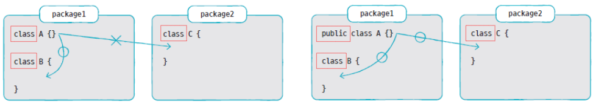


### 생성자 접근 제한

생성자 호출 가능 여부를 결정


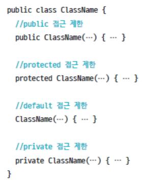


modifier package 생성


A.java

```java
package modifier;

public class A {
	// 필드
	A a1 = new A(true);
	A a2 = new A(1);
	A a3 = new A("문자열");
	
	// 생성자를 오버로딩하고 있음
	//	public => 클래스 외부에서 호출 가능
	public A(boolean b) {}
	//	default => 동일 패키지 또는 자식 클래스에서만 호출 가능
	A(int i) {}
	//	private => 클래스 외부에서 호출 불가능
	private A(String s) {}
}
```


B.java

```java
package modifier;

public class B {
	// 	필드
	A a1 = new A(true);		// public 접근 제한자
	A a2 = new A(1);		// default
	/* The constructor A(String) is not visible 컴파일 오류 발생
	A a3 = new A("문자열");	// private
	*/
}
```


* field
  * private
* method
  * public
  * private


* 오류
  * 컴파일 <= 명시
    * 문법
  * 런타임 <= 암시
    * 실행 시점. Null Pointer Exception
    * 컴파일을 통해서는 알 수 없다. 개발자가 코딩을 하면서 Null인 경우와 Null이 아닌 경우를 꼼꼼하게 확인해야 한다.


에디팅 => 컴파일 => 링크 => 실행


예전에는 에디팅 할 때에는 코드에 문제가 있는지 없는지 몰랐다. 컴파일 할 때 문법적인 결함이 있는지 발견할 수 있다.


지금은 에디팅과 컴파일은 현 단계에서는 묶여있다. 한글자 한글자 칠 때마다 eclipse가 문법적인 결함을 확인해준다.

현재는 런타임 에러에 집중해야 한다.

정적 분석 도구를 통해 런타임 에러에 대해서 보완할 수 있다.


CI/CD

지속적인 통합 배포 도구

jenkins <= 허드슨


### 필드와 메소드 접근 제한

* 필드 선언

  ```java
  [ public | protected | private ] [ static ] 데이터타입 필드명;
  ```

* 메소드 선언

  ```java
  [ public | protected | private ] [ static ] 리턴타입 메소드명 ( 매개변수 ) { 메소드본문 };
  ```

  

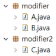

A.java

```java
package modifier;

public class A {
	// 필드
	public int field1;		// 클래스 외부에서 직접 접근이 가능
	int field2;				// 동일 패키지 또는 자식 클래스에서 직접 접근이 가능
	private int field3;		// 클래스 외부에서 접근이 불가능
	
	// 생성자
	public A() {
		field1 = 1;
		field2 = 2;
		field3 = 3;
		
		method1();
		method2();
		method3();
	}
	
	// 메소드
	public void method1() { 
		System.out.println(field1);
	}
	void method2() { 
		System.out.println(field2);
	}
	private void method3() { 
		System.out.println(field3);
	}
}
```


B.java

```java
package modifier;

public class B {
	public B() {
		A a = new A();
		a.field1 = 10;
		a.field2 = 20;
		/* private => 직접 접근이 불가능
		a.field3 = 30;
		*/
	}
}
```


C.java

```java
package modifier2;

import modifier.A;

public class C {
	public C() {
		A a = new A();
		a.field1 = 100;
		/*
		a.field2 = 200;	// default => 패키지가 상이하므로 접근할 수 없음
		a.field3 = 300;	// private => 클래스 외부에서 접근할 수 없음
		*/
		
		a.method1();
		/*
		a.method2();
		a.method3();
		*/
	}
}
```


### getter/setter 메소드

* 객체의 무결성을 보장하기 위한 방법
* 필드를 private 제한하고, 해당 필드에 접근할 수 있는 public 메소드를 제공하는 방식으로 객체의 무결성을 보장 ⇒ 캡슐화
* 필드의 값을 외부로 반환하는 메소드 ⇒ getter
* 필드의 값을 외부에서 전달한 값으로 설정하는 메소드 ⇒ setter


Car.java

```java
public class Car {
	//	필드
	private int speed;
	

	private boolean stop;
	
	
}
```


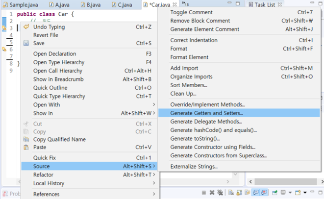

마우스 오른쪽 버튼 클릭 => Source => Generate Getters and Setters...


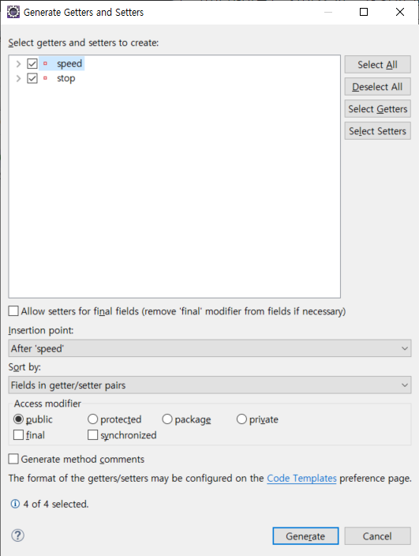


speed, stop 체크 => Generate


Car.java

```java
public class Car {
	//	필드
	private int speed;
	
	public int getSpeed() {
		return speed;
	}

	public void setSpeed(int speed) {
		this.speed = speed;
	}

	private boolean stop;

	public boolean isStop() {
		return stop;
	}


	public void setStop(boolean stop) {
		this.stop = stop;
	}
}
```

getter와 setter가 자동으로 생성된다.

통상적으로 getter는 앞에 get이 붙고, boolean인 경우 is 가 앞에 붙는다.

setter 앞에는 set 이 붙는다.


Car.java

```java
public class Car {
	//	필드
	private int speed;
	
	public int getSpeed() {
		return speed;
	}

	public void setSpeed(int speed) {
		//	속도를 제한
		if (speed < 0 || speed > 100) 
			this.speed = 0;
		else 
			this.speed = speed;
	}

	private boolean stop;

	public boolean isStop() {
		return stop;
	}

	public void setStop(boolean stop) {
		this.stop = stop;
		if (stop == true) {
			this.speed = 0;
		}
	}
}
```


## 상속

기존에 만들어져 있는 클래스를 재활용


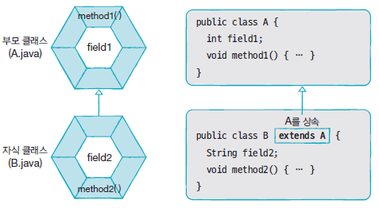


### 클래스 상속

* 자식 클래스 선언 시 부모 클래스를 선택
* extends 키워드 뒤에 부모 클래스를 기술
* ~~여러 개의 부모 클래스를 상속할 수 있음~~
* 부모 클래스의 private 접근 제한을 갖는 필드와 메소드는 상속 대상에서 제외
* 부모와 자식 클래스가 다른 패키지에 존재할 경우, default 접근 제한된 필드와 메소드 역시 제외


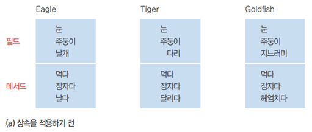


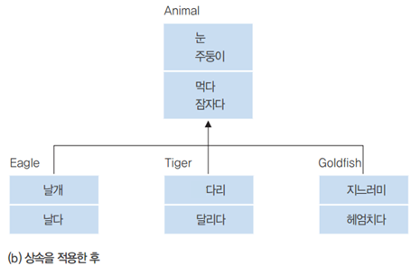


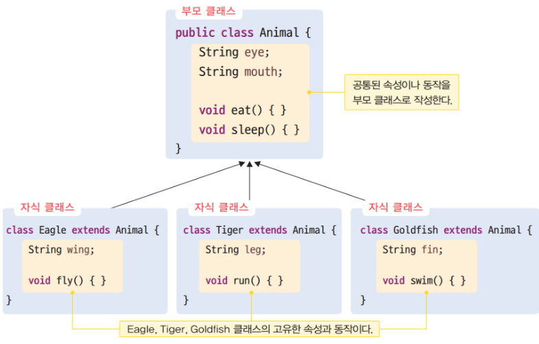


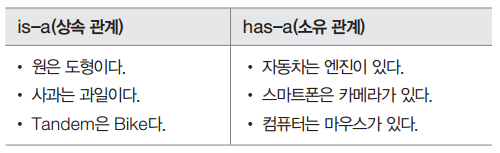


People.java

```java
public class People {
	private String name;
	private String ssn;
	
	public String getName() {
		return name;
	}

	public void setName(String name) {
		this.name = name;
	}

	public String getSsn() {
		return ssn;
	}

	public void setSsn(String ssn) {
		this.ssn = ssn;
	}

	public People(String name, String ssn) {
		this.name = name;
		this.ssn = ssn;
	}
}
```


Student.java

```java
public class Student extends People {
	public int studentNo;
	
	public Student(String name, String ssn, int studentNo) {
		super(name, ssn);
		this.studentNo = studentNo;
	}
}
```


StudentExample.java

```java
public class StudentExample {
	public static void main(String[] args) {
		Student s = new Student("홍길동", "123456-1234567", 7777);
		
		System.out.println("이름: " + s.getName());
		System.out.println("주민번호: " + s.getSsn());
		System.out.println("학번: " + s.studentNo);
	}
}
```


```
이름: 홍길동
주민번호: 123456-1234567
학번: 7777
```


---


```
CellPhone 		<-----------    DmbCellPhone
 - model						 - channel
 - color						 - turnOnDmb()
 - powerOn()					 - changeChannelDmb()
 - powerOff()					 - turnOffDmb()
 - bell()
 - sendVoice()
 - receiveVoice()
 - hangUp()
```


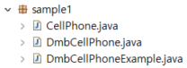


CellPhone.java

```java
package sample1;

public class CellPhone {
	//	필드
	String model;
	String color;
	
	//	생성자
	
	//	메소드
	void powerOn() {
		System.out.println("전원을 켭니다.");
	}
	void powerOff() {
		System.out.println("전원을 끕니다.");
	}
	void bell() {
		System.out.println("벨이 울린다.");
	}
	void sendVoice(String message) {
		System.out.println(">>> " + message);
	}
	void receiveVoice(String message) {
		System.out.println("<<< " + message);
	}
	void hangUp() {
		System.out.println("전화를 끊습니다.");
	}
}
```


DmbCellPhone.java

```java
package sample1;

public class DmbCellPhone extends CellPhone {
	// 	필드
	int channel;
	
	// 	생성자
	DmbCellPhone(String model, String color, int channel) {
		// super(model, color);
		this.model = model;
		this.color = color;
		this.channel = channel;
	}
	
	// 	메소드
	void turnOnDmb() {
		System.out.printf("채널 %d번 DMB 방송 수신을 시작합니다.\n", channel);
	}
	void turnOffDmb() {
		System.out.println("DMB 방송 수신을 종료합니다.");
	}
	void changeChannelDmb(int channel) {	
		this.channel = channel;
		System.out.printf("채널 %d번으로 변경합니다.\n", channel);
	}
}
```


DmbCellPhoneExample.java

```java
package sample1;

public class DmbCellPhoneExample {
	public static void main(String[] args) {
		// DmbCellPhone 객체 생성
		DmbCellPhone dmbCellPhone = new DmbCellPhone("자바폰", "검정", 10);

		// CellPhone으로부터 상속 받은 필드
		System.out.println("모델: " + dmbCellPhone.model);
		System.out.println("색상: " + dmbCellPhone.color);

		// DmbCellPhone의 필드
		System.out.println("채널: " + dmbCellPhone.channel);

		// CellPhone으로부터 상속 받은 메소드 호출
		dmbCellPhone.powerOn();
		dmbCellPhone.bell();
		dmbCellPhone.sendVoice("여보세요");
		dmbCellPhone.receiveVoice("안녕하세요! 저는 홍길동인데요");
		dmbCellPhone.sendVoice("아~ 예 반갑습니다.");
		dmbCellPhone.hangUp();

		// DmbCellPhone의 메소드 호출
		dmbCellPhone.turnOnDmb();
		dmbCellPhone.changeChannelDmb(12);
		dmbCellPhone.turnOffDmb();
	}
}
```


```
모델: 자바폰
색상: 검정
채널: 10
전원을 켭니다.
벨이 울린다.
>>> 여보세요
<<< 안녕하세요! 저는 홍길동인데요
>>> 아~ 예 반갑습니다.
전화를 끊습니다.
채널 10번 DMB 방송 수신을 시작합니다.
채널 12번으로 변경합니다.
DMB 방송 수신을 종료합니다.
```


super : 부모 클래스의 생성자를 호출

this : 자기 자신의 생성자를 호출


로그 표시

`>>>` 왼쪽에서 오른쪽으로 => 나간 데이터

`<<<` 오른쪽에서 왼쪽으로 => 들어온 데이터


### 메소드 재정의(오버라이딩, overriding)

부모 클래스의 메소드가 자식 클래스에서 사용하기에 부적합할 경우, 자식 클래스에서 수정해서 사용

⇒ 메소드가 재정의되면 부모 객체에 정의된 메소드는 숨겨지고, 자식 객체에서 메소드를 호출하면 재정의된 자식 메소드가 호출됨


#### 메소드 재정의 방법

* 부모 메소드와 동일한 시그니처를 가져야 함
* 접근 제한을 더 강하게 재정의 할 수 없음
* 새로운 예외를 throws 할 수 없음


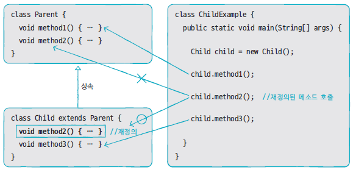


#### 부모 클래스의 메소드를 호출

자식 클래스 내부에서 재정의한 부모 클래스의 메소드를 호출해야 하는 경우, super 키워드를 붙여서 명시적으로 호출해야 함


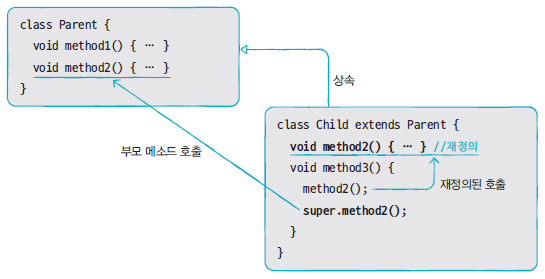


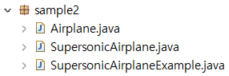


Airplane.java

```java
package sample2;

public class Airplane {
	public void land() {
		System.out.println("착륙");
	}
	public void fly() {
		System.out.println("비행");
	}
	public void takeOff() {
		System.out.println("이륙");
	}
}
```


SupersonicAirplane.java

```java
package sample2;

public class SupersonicAirplane extends Airplane {
	public static final int NORMAL = 1;
	public static final int SUPERSONIC = 2;
	
	// 비행모드 = 1 : 일반비행, 2 : 초음속비행
	public int flyMode = NORMAL;
	
	// 메소드 오버로딩
	public void fly() {
		if (flyMode == SUPERSONIC) {
			System.out.println("초음속비행");
		} else {
			// 부모 클래스의 메소드를 호출
			super.fly();
		}
	}
}
```


SupersonicAirplaneExample.java

```java
package sample2;

public class SupersonicAirplaneExample {
	public static void main(String[] args) {
		SupersonicAirplane sa = new SupersonicAirplane();
		
		sa.takeOff();
		sa.fly();
		sa.flyMode = SupersonicAirplane.SUPERSONIC;
		sa.fly();
		sa.flyMode = SupersonicAirplane.NORMAL;
		sa.fly();
		sa.land();
		
	}
}
```


```
이륙
비행
초음속비행
비행
착륙
```


### final

* 해당 선언이 최종 상태이며, 수정될 수 없음을 의미
* 클래스 및 메소드 선언 시 final 키워드를 사용하면 상속 및 재정의를 할 수 없음


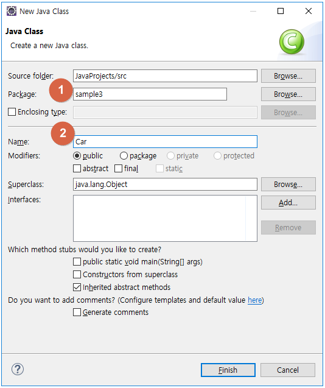


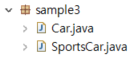


Car.java

```java
package sample3;

public class Car {
	public int speed;
	
	public void speedUp() {
		speed += 1;
	}
	
	// final 구문을 이용해서 재정의되는 것을 방지
	public final void stop() {
		speed = 0;
		System.out.println("차를 멈춤");
	}
}
```


SportsCar.java

```java
package sample3;

public class SportsCar extends Car {
	public void speedUp() {
		speed += 10;
	}
	
	/*
	// final로 정의된 메소드는 재정의할 수 없음
	// Cannot override the final method from Car
	public void stop() {
		speed = 0;
		System.out.println("차를 멈춤");
	}
	*/
}
```


## 다형성

사용 방법은 동일하지만 다양한 객체를 활용해 여러 실행 결과가 나오도록 하는 성질

다형성 ⇒ 메소드 재정의(overriding)와 타입 변환(promotion, casting)으로 구현


### 자동 타입 변환(promotion)


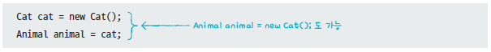


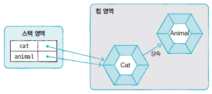


바로 위 부모가 아니라도 상속 계층에서 상위 타입인 경우 자동으로 타입 변환이 가능


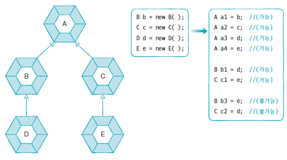


부모 타입으로 자동 타입 변환 이후에는 **부모 클래스에 선언된 필드와 메소드만 접근**이 가능

예외적으로 메소드가 자식 클래스에서 **재정의된 경우, 자식 클래스의 메소드가 대신 호출**


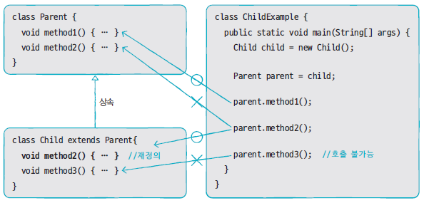


### 필드의 다형성

필드의 데이터 타입을 부모 클래스 타입으로 선언


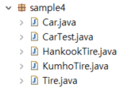


Tire.java

```java
package sample4;

public class Tire {
	public int maxRotation; 		// 최대 회전수 = 최대 수명
	public int accumulatedRotation; // 누적 회전수
	public String location; 		// 타이어의 위치
	
	public Tire(String location, int maxRotation) {
		this.location = location;
		this.maxRotation = maxRotation;				
	}
	
	//	타이어 수명을 체크해서 수명이 남은 경우 true를, 다한 경우 false를 반환 
	public boolean roll() {
		accumulatedRotation++;
		if (accumulatedRotation < maxRotation) {
			System.out.printf("%s 위치의 타이어의 수명이 %d회 남았습니다.\n", 
					location, (maxRotation - accumulatedRotation));
			return true;
		} else {
			System.out.printf("*** %s 위치의 타이어가 펑크 ***\n", location);
			return false;
		}
	}
}
```


HankookTire.java

```java
package sample4;

public class HankookTire extends Tire {
	public HankookTire(String location, int maxRotation) {
		super(location, maxRotation);
	}
	
	// 	메소드 재정의 
	public boolean roll() {
		accumulatedRotation++;
		if (accumulatedRotation < maxRotation) {
			System.out.printf("%s 위치의 한국 타이어의 수명이 %i회 남았습니다.\n", 
					location, (maxRotation - accumulatedRotation));
			return true;
		} else {
			System.out.printf("*** %s 위치의 한국 타이어가 펑크 ***\n", location);
			return false;
		}
	}
}
```


KumhoTire.java

```java
package sample4;

public class KumhoTire extends Tire {
	public KumhoTire(String location, int maxRotation) {
		super(location, maxRotation);
	}
	
	// 	메소드 재정의 
	public boolean roll() {
		accumulatedRotation++;
		if (accumulatedRotation < maxRotation) {
			System.out.printf("%s 위치의 금호 타이어의 수명이 %d회 남았습니다.\n", 
					location, (maxRotation - accumulatedRotation));
			return true;
		} else {
			System.out.printf("*** %s 위치의 금호 타이어가 펑크 ***\n", location);
			return false;
		}
	}
}
```


Car.java

```java
package sample4;

public class Car {
	Tire frontLeftTire  = new Tire("앞왼쪽", 6);
	Tire frontRightTire = new Tire("앞오른쪽", 2);
	Tire backLeftTire   = new Tire("뒤왼쪽", 3);
	Tire backRightTire  = new Tire("뒤오른쪽", 4);
	
	void stop() {
		System.out.println("자동차가 멈춥니다.");
	}
	
	int run() {
		System.out.println("자동차가 달립니다 =3=33=333");
		if (frontLeftTire.roll() == false) {
			stop();
			return 1;
		}
		if (frontRightTire.roll() == false) {
			stop();
			return 2;
		}
		if (backLeftTire.roll() == false) {
			stop();
			return 3;
		}
		if (backRightTire.roll() == false) {
			stop();
			return 4;
		}
		return 0;
	}
}
```


CarTest.java

```java
package sample4;

public class CarTest {
	public static void main(String[] args) {
		Car car = new Car();		
		for (int i = 1; i < 5; i ++) {
			int problemLocation = car.run();
			switch (problemLocation) {
			case 1:
				System.out.println("앞왼쪽 타이어를 한국 타이어로 교체");
				car.frontLeftTire = new HankookTire("앞왼쪽", 15);
				break;
			case 2:
				System.out.println("앞오른쪽 타이어를 금호 타이어로 교체");
				car.frontRightTire = new KumhoTire("앞오른쪽", 13);				
				break;
			case 3:
				System.out.println("뒤왼쪽 타이어를 한국 타이어로 교체");
				car.backLeftTire = new HankookTire("뒤왼쪽", 14);				
				break;
			case 4:
				System.out.println("뒤오른쪽 타이어를 금호 타이어로 교체");
				car.backRightTire = new KumhoTire("뒤오른쪽", 17);
				break;
			}
			System.out.println("-------------------------------");
		}
	}
}
```


```
자동차가 달립니다 =3=33=333                          6, 2, 3, 4
앞왼쪽 위치의 타이어의 수명이 5회 남았습니다.         => 5, 1, 2, 3
앞오른쪽 위치의 타이어의 수명이 1회 남았습니다.
뒤왼쪽 위치의 타이어의 수명이 2회 남았습니다.
뒤오른쪽 위치의 타이어의 수명이 3회 남았습니다.
-------------------------------
자동차가 달립니다 =3=33=333                          5, 1, 2, 3 
앞왼쪽 위치의 타이어의 수명이 4회 남았습니다.         => 4, 0
*** 앞오른쪽 위치의 타이어가 펑크 ***               => 4, 13, 2, 3 
자동차가 멈춥니다.
앞오른쪽 타이어를 금호 타이어로 교체
-------------------------------
자동차가 달립니다 =3=33=333                          4, 13, 2, 3
앞왼쪽 위치의 타이어의 수명이 3회 남았습니다.         => 3, 12, 1, 2  
앞오른쪽 위치의 금호 타이어의 수명이 12회 남았습니다.
뒤왼쪽 위치의 타이어의 수명이 1회 남았습니다.
뒤오른쪽 위치의 타이어의 수명이 2회 남았습니다.
-------------------------------
자동차가 달립니다 =3=33=333                          3, 12, 1, 2
앞왼쪽 위치의 타이어의 수명이 2회 남았습니다.         => 2, 11, 0
앞오른쪽 위치의 금호 타이어의 수명이 11회 남았습니다.  => 2, 11, 14, 2
*** 뒤왼쪽 위치의 타이어가 펑크 ***
자동차가 멈춥니다.
뒤왼쪽 타이어를 한국 타이어로 교체
-------------------------------
```


