# Java


Animal.java

```java
public class Animal {
	public void sound() {
		System.out.println("동물 소리");
	}
	
	public void run() {
		System.out.println("뛴다");
	}
}
```


Cat.java

```java
public class Cat extends Animal {
	public void sound() {
		System.out.println("고양이 소리");
	}
}
```


Dog.java

```java
public class Dog extends Animal {
	public void sound() {
		System.out.println("강아지 소리");
	}
}
```


BabyCat.java

```java
public class BabyCat extends Cat{
	public void sound() {
		System.out.println("새끼 고양이 소리");
	}
}
```


AnimalTest.java

```java
public class AnimalTest {
	public static void main(String[] args) {
		/*
		Animal a = new Cat();
		a.sound();
		a.run();

		Cat c = new Cat();
		c.sound();
		
		Dog d = new Dog();
		d.sound();
		*/
		
		Animal a = new Animal();
		Cat c = new Cat();
		BabyCat b = new BabyCat();
		
		a.sound();
		c.sound();
		b.sound();
	}
}
```


```
동물 소리
고양이 소리
새끼 고양이 소리
```


### 매개변수의 다형성

매개변수 타입을 부모 객체로 선언하면, 매개변수 값으로 부모 객체 또는 모든 자식 객체를 전달할 수 있음


```java
class Driver {
	void dirve(Vehicle vehicle) {
		vehicle.run();
	}
}
```


```java
Driver d = new Driver();
Vehicle v = new Vehicle();
d.drive(v);
```


```java
Driver d2 = new Driver();
Bus b = new Bus();
d2.driver(b);
```


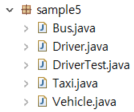


Vehicle.java

```java
package sample5;

public class Vehicle {
	public void run() {
		System.out.println("차량이 움직인다.");
	}
}
```


Bus.java

```java
package sample5;

public class Bus extends Vehicle {
	public void run() {
		System.out.println("버스가 움직인다.");
	}
}
```


Taxi.java

```java
package sample5;

public class Taxi extends Vehicle {
	public void run() {
		System.out.println("택시가 움직인다.");
	}
}
```


Driver.java

```java
package sample5;

public class Driver {
//	public void drive(Bus bus) {
//		bus.run();
//	}
//	public void drive(Taxi taxi) {
//		taxi.run();
//	}

	//	매개변수 다형성을 이용하면, 
	//	메소드 오버로딩을 하지 않아도 다양한 자식 클래스에 대해
	//	동일한 처리를 제공할 수 있다. 
	public void drive(Vehicle v) {  // 매개변수의 타입을 부모 클래스로 정의
		v.run();
	}
}
```


DriverTest.java

```java
package sample5;

public class DriverTest {
	
	public static void main(String[] args) {
		Driver d = new Driver();
		
		d.drive(new Taxi());   // 자식 클래스의 인스턴스를 매개변수의 값으로 전달
		d.drive(new Bus());
	}
}
```


```
택시가 움직인다.
버스가 움직인다.
```


### 강제 타입 변환 (casting)

프로모션 이후 자식 객체가 가지고 있는 멤버에 접근하기 위해 사용

⇒ 자식 타입이 부모 타입으로 자동 타입 변환된 이후


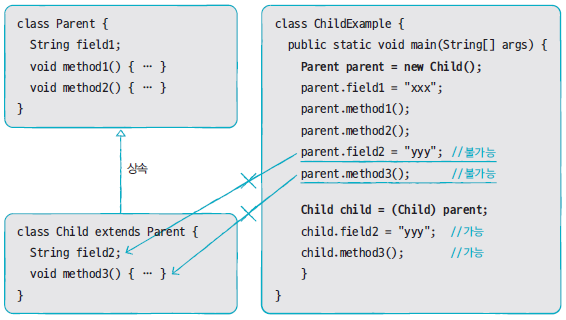


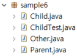


Parent.java

```java
package sample6;

public class Parent {
	public String strParent;
	
	public void method1() {
		System.out.println("Parent Method1()");
	}
	
	public void method2() {
		System.out.println("Parent Method2()");
	}
}
```


Child.java

```java
package sample6;

public class Child extends Parent {
	public String strChild;
	
	public void method3() {
		System.out.println("Child Method3()");
	}
}
```


ChildTest.java

```java
package sample6;

public class ChildTest {
	public static void main(String[] args) {
		// promotion 발생
		// -> p 변수는 부모 클래스 맴버만 사용
		// 단, 자식 클래스에서 재정의된 메소드는 제외
		Parent p = new Child();
		p.strParent = "parent";
		p.method1();
		p.method2();
		// 자식 클래스 맴버로는 접근이 불가
		/*
		p.strChild = "child";
		p.method3();
		*/
		
		// 부모 클래스의 인스턴스 변수를 자식 클래스로 casting
		// Child c = new Child();
		Child c = (Child) p;
		c.strChild = "child";
		c.method3();
		
		c.strParent = "child -> parent";
		c.method1();
		c.method2();
		
		// Cannot cast from Other to Child
		/*
		Other o = new Other();
		Child c2 = (Child)o;
		*/
	}
}
```


Other.java

```java
package sample6;

public class Other {

}
```


```
Parent Method1()
Parent Method2()
Child Method3()
Parent Method1()
Parent Method2()
```


### instanceof 연산자

객체가 어느 클래스의 인스턴스인지를 확인

메소드 내에서 casting 할 때, 타입을 확인하지 않고 casting 하면 ClassCastException이 발생


```java
boolean result = 객체 instanceof 타입;
```

⇒ 타입에 해당하는 객체이면 true를 아니면 false를 반환


```java
Parent p = new Parent();
Child c = (Child) p;
```

프로모션되지 않은 인스턴스 변수를 캐스팅하므로 java.lang.ClassCastException 발생


```java
if (p instanceof Child) {
    Child c = (Child) p;
}
```


ChildTest.java

```java
package sample6;

public class ChildTest {
	public static void main(String[] args) {
		// promotion 발생
		// -> p 변수는 부모 클래스 맴버만 사용
		// 단, 자식 클래스에서 재정의된 메소드는 제외
		Parent p = new Child();
		p.strParent = "parent";
		p.method1();
		p.method2();
		// 자식 클래스 맴버로는 접근이 불가
		/*
		p.strChild = "child";
		p.method3();
		*/
		
		// 부모 클래스의 인스턴스 변수를 자식 클래스로 casting
		// Child c = new Child();
		Child c = (Child) p;
		c.strChild = "child";
		c.method3();
		
		c.strParent = "child -> parent";
		c.method1();
		c.method2();
		
		// Cannot cast from Other to Child
		/*
		Other o = new Other();
		Child c2 = (Child)o;
		*/
		
		// 문법적으로 문제가 없음
		// 캐스팅이 되기 위해서는 프로모션이 전제되어야 함
		Parent p2 = new Parent();
		if (p2 instanceof Child) {
			Child c2 = (Child) p2;			
		} else {
			System.out.println("p2는 Child의 인스턴스가 아님");
		}
		
		Parent p3 = new Child();
		Child c3 = (Child) p3;
	}
}
```


```
Parent Method1()
Parent Method2()
Child Method3()
Parent Method1()
Parent Method2()
p2는 Child의 인스턴스가 아님
```


## 추상 클래스

실제 클래스(= 객체 생성 용도의 클래스)들의 공통적인 특성(필드, 메소드 등)을 추출하여 선언한 것

추상 클래스와 실제 클래스는 부모와 자식 클래스로서 상속 관계를 가진다.


실제 클래스에 반드시 존재해야 하는 필드와 메소드를 선언

= 실제 클래스의 설계(규격)

= 실제 클래스는 추상 클래스를 상속받아서 다른 부분만 선언, 구현하면 빠르게 개발이 가능


### 추상 클래스 선언

abstract 키워드를 사용해서 정의

필드, 생성자, 메소드를 정의

상속은 가능하나 객체를 생성할 수는 없다. ⇒ 자식 클래스가 생성될 때 객체화 됨 = 자식 클래스의 생성자에서 super() 메소드로 추상 클래스의 생성자를 호출


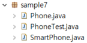


Phone.java

```java
package sample7;

public abstract class Phone {
	public String owner;
	
	public Phone(String owner) {
		this.owner = owner;
	}
	
	public void turnOn() {
		System.out.println("폰을 켭니다.");
	}
	
	public void turnOff() {
		System.out.println("폰을 끕니다.");
	}
}
```


SmartPhone.java

```java
package sample7;

public class SmartPhone extends Phone {
	public SmartPhone(String owner) {
		super(owner);
	}
	public void internetSearch() {
		System.out.println("인터넷 검색");
	}
}
```


PhoneTest.java

```java
package sample7;

public class PhoneTest {
	public static void main(String[] args) {
		
		/*
		Phone p = new Phone("홍길동");
		p.turnOn();
		p.turnOff();
		*/
		
		SmartPhone sp = new SmartPhone("홍길동");
		sp.turnOn();
		sp.internetSearch();
		sp.turnOff();
	}
}
```


```
폰을 켭니다.
폰을 끕니다.
폰을 켭니다.
인터넷 검색
폰을 끕니다.
```


추상 클래스의 생성자가 있으면 반드시 그 생성자가 호출될 수 있도록 해야한다.

추상 클래스는 객체 생성 용도가 아니라 스팩을 정리하는 용도이다.


### 추상 메소드


메소드 선언만 통일하고 실행 내용은 실제 클래스 마다 달라야 하는 경우에 정의

abstract 키워드로 선언되고 중괄호가 없는 메소드

하위 클래스는 반드시 해당 메소드를 재정의해서 구현해야 함


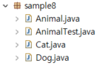


Animal.java

```java
package sample8;

public abstract class Animal {
	/*
	public void sound() {
		System.out.println("동물 소리");
	}
	*/
	
	public abstract void sound();
}
```


Cat.java

```java
package sample8;

public class Cat extends Animal {
	public void sound() {
		System.out.println("고양이 소리");
	}
}
```


Dog.java

```java
package sample8;

public class Dog extends Animal {
	public void sound() {
		System.out.println("개 소리");
	}
}
```


AnimalTest.java

```java
package sample8;

public class AnimalTest {
	public static void main(String[] args) {
		Dog d = new Dog();
		d.sound();
		
		Cat c = new Cat();
		c.sound();
		
		Animal a1 = new Dog();
		a1.sound();
		
		Animal a2 = new Cat();
		a2.sound();
	}
}
```


```
개 소리
고양이 소리
개 소리
고양이 소리
```


## 인터페이스


인터페이스는 객체로 생성할 수 없다. = 생성자가 없다.


```java
interface 인터페이스이름 {
	// 상수 필드 ← 인스턴스 필드 또는 정적 필드는 선언 불가
	데이터타입 상수이름 = 상수값;

	// 추상 메소드
	데이터타입 메소드이름 (매개변수, … );
}
```


상수필드 선언

```java
[public static final] 데이터타입 상수이름 = 값;
```

상수이름은 대문자로 작성하는 것이 관례

여러 문자로 구성되는 경우, _ (언더바)로 연결해서 표기


추상 메소드 선언

```java
public interface RemoteControl {
	public static final MAX_VOLUME = 10;
	public static final MIN_VOLUME = 0;

	public void turnOn();
	public void turnOff();
	public void setVolume(int volume);
}
```


### 구현 클래스

인터페이스에서 정의된 추상 메소드를 재정의해서 실행 내용을 가지고 있는 클래스 


```java
public class 구현클래스이름 implements 인터페이스이름 {
	// 인터페이스에서 선언한 추상 메소드를 재정의한다.
}
```


```java
public class TvRemoteControl implements RemoteControl {
	public void turnOn() {
		:
	}
	public void turnOff() {
		:
	}
		:
}
```


---


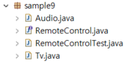


RemoteControl.java

```java
package sample9;

public interface RemoteControl {
	int MAX_VOLUME = 10;
	int MIN_VOLUME = 0;
	
	void turnOn();
	void turnOff();
	void setVolume(int volume);	
}
```


Audio.java

```java
package sample9;

public class Audio implements RemoteControl {
    int volume;
}
```


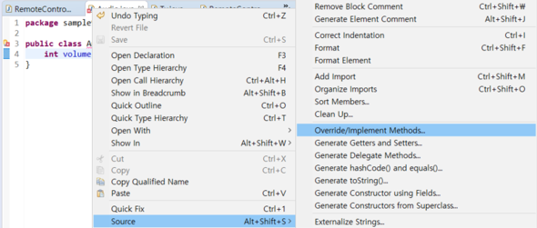


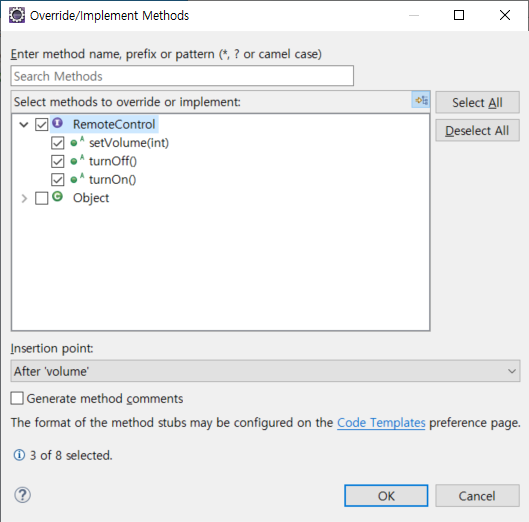


Audio.java

```java
package sample9;

public class Audio implements RemoteControl {
	int volume;

	@Override
	public void turnOn() {
		// TODO Auto-generated method stub
		
	}

	@Override
	public void turnOff() {
		// TODO Auto-generated method stub
		
	}

	@Override
	public void setVolume(int volume) {
		// TODO Auto-generated method stub
		
	}
}
```


Audio.java

```java
package sample9;

public class Audio implements RemoteControl {
	int volume;
	
	@Override
	public void turnOn() {
		System.out.println("Audio를 켭니다.");		
	}

	@Override
	public void turnOff() {
		System.out.println("Audio를 끕니다.");		
	}

	@Override
	public void setVolume(int volume) {
		if (volume < RemoteControl.MIN_VOLUME) {
			this.volume = RemoteControl.MIN_VOLUME;
		} else if (volume > RemoteControl.MAX_VOLUME) {			
			this.volume = RemoteControl.MAX_VOLUME;
		} else {
			this.volume = volume;
		}
		System.out.println("현재 Audio 볼륨은 " + this.volume + "입니다.");
	}
}
```


Tv.java

```java
package sample9;

public class Tv implements RemoteControl {
	int volume;
	
	@Override
	public void turnOn() {
		System.out.println("Tv를 켭니다.");		
	}

	@Override
	public void turnOff() {
		System.out.println("Tv를 끕니다.");		
	}

	@Override
	public void setVolume(int volume) {
		if (volume < RemoteControl.MIN_VOLUME) {
			this.volume = RemoteControl.MIN_VOLUME;
		} else if (volume > RemoteControl.MAX_VOLUME) {			
			this.volume = RemoteControl.MAX_VOLUME;
		} else {
			this.volume = volume;
		}
		System.out.println("현재 Tv 볼륨은 " + this.volume + "입니다.");
	}
}
```


RemoteControlTest.java

```java
package sample9;

public class RemoteControlTest {
	public static void main (String[] args) {
		RemoteControl rc;
		
		rc = new Audio();
		rc.turnOn();
		rc.setVolume(15);
		rc.turnOff();
		
		rc = new Tv();
		rc.turnOn();
		rc.setVolume(15);
		rc.turnOff();
	}
}
```


```
Audio를 켭니다.
현재 Audio 볼륨은 10입니다.
Audio를 끕니다.
Tv를 켭니다.
현재 Tv 볼륨은 10입니다.
Tv를 끕니다.
```


@Override : 이 메서드가 재정의되었다는 것을 알려준다.

인터페이스는 명세(규격)이다. 그것을 상속받은 것은 그 명세를 지켜서 코딩을 해야한다.


---


인터페이스는 다중 상속이 가능하다.

```java
public class 구현클래스이름 implements 인터페이스1, 인터페이스2 {
	//	인터페이스1에 정의된 메소드를 재정의
	// 	인터페이스2에 정의된 메소드를 재정의
}
```


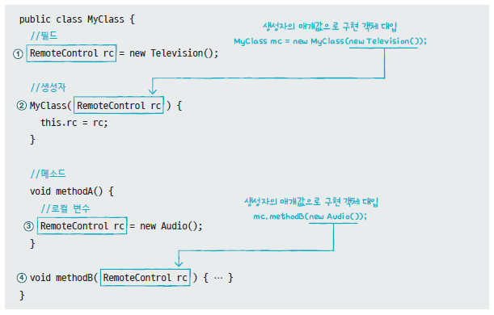


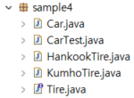


Tire.java

```java
package sample4;

public interface Tire {
	public void roll();
}
```


HankookTire.java

```java
package sample4;

public class HankookTire implements Tire {
	// 	메소드 재정의 
	public void roll() {
		System.out.println("한국 타이어가 굴러갑니다.");
	}
}
```


KumhoTire.java

```java
package sample4;

public class KumhoTire implements Tire {
	public void roll() {
		System.out.println("금호 타이어가 굴러갑니다.");
	}
}
```


Car.java

```java
package sample4;

public class Car {
	Tire frontLeftTire  = new HankookTire();
	Tire frontRightTire = new HankookTire();
	Tire backLeftTire   = new HankookTire();
	Tire backRightTire  = new HankookTire();
	
	void stop() {
		System.out.println("자동차가 멈춥니다.");
	}
	
	void run() {
		frontLeftTire.roll();
		frontRightTire.roll();
		backLeftTire.roll();
		backRightTire.roll();
	}
}
```


CarTest.java

```java
package sample4;

public class CarTest {
	public static void main(String[] args) {
		Car car = new Car();		
		for (int i = 1; i < 5; i ++) {
			car.run();
			System.out.println("-------------------------------");
		}
	}
}
```


```
한국 타이어가 굴러갑니다.
한국 타이어가 굴러갑니다.
한국 타이어가 굴러갑니다.
한국 타이어가 굴러갑니다.
-------------------------------
한국 타이어가 굴러갑니다.
한국 타이어가 굴러갑니다.
한국 타이어가 굴러갑니다.
한국 타이어가 굴러갑니다.
-------------------------------
한국 타이어가 굴러갑니다.
한국 타이어가 굴러갑니다.
한국 타이어가 굴러갑니다.
한국 타이어가 굴러갑니다.
-------------------------------
한국 타이어가 굴러갑니다.
한국 타이어가 굴러갑니다.
한국 타이어가 굴러갑니다.
한국 타이어가 굴러갑니다.
-------------------------------
```


---


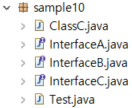


InterfaceA.java

```java
package sample10;

public interface InterfaceA {
	public void methodA();
}
```


InterfaceB.java

```java
package sample10;

public interface InterfaceB {
	public void methodB();
}
```


InterfaceC.java

```java
package sample10;

// 인터페이스는 다중 상속이 가능하다.
public interface InterfaceC extends InterfaceA, InterfaceB {
	public void methodC();
}
```


ClassC.java

```java
package sample10;

public class ClassC implements InterfaceC {
	public void methodC() {
		System.out.println("methodC() 호출");
	}
	
	// 상속 받은 인터페이스의 메소드도 함께 재정의, 구현해야 함
	public void methodA() {
		System.out.println("methodA() 호출");
	}
	public void methodB() {
		System.out.println("methodB() 호출");
	}
}
```


Test.java

```java
package sample10;

public class Test {
	public static void main(String[] args) {
		ClassC c = new ClassC();
		c.methodA();
		c.methodB();
		c.methodC();
		
		InterfaceA a = c;
		a.methodA();
		// a.methodB();
		
		InterfaceB b = c;
		b.methodB();
		
		InterfaceC cc = c;
		cc.methodA();
		cc.methodB();
		cc.methodC();		
	}
}
```


```
methodA() 호출
methodB() 호출
methodC() 호출
methodA() 호출
methodB() 호출
methodA() 호출
methodB() 호출
methodC() 호출
```


## 예외처리


Error(오류) - 개발자가 해결할 수 없는 치명적인 오류

Exception(예외) - 개발자가 해결할 수 있는 오류


### 실행예외

실행 시점에 결정되는 값으로 인해서 발생하는 예외

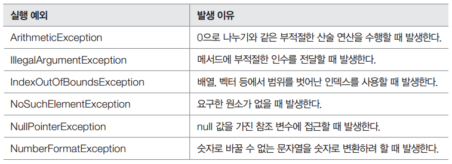


### 일반예외

컴파일 시점(IDE 도구에서는 코드를 작성하는 시점)에 알 수 있음 ⇒ 개발자가 예외 처리 코드를 반드시 추가해야 한다.

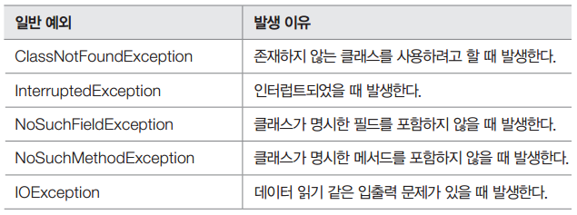


---

Sample.java

```java
import java.util.StringTokenizer;
// Ctrl+Shift+O => 사용 클래스의 패키지 정보를 import 	

public class Sample {
	public static void main(String[] args) {
		String s = "Java Programming Language";
		StringTokenizer st = new StringTokenizer(s); 
		while(st.hasMoreTokens()) {
			System.out.println(st.nextToken());
		}
		// java.util.NoSuchElementException
		System.out.println(st.nextToken());
	}
}
```


```
Java
Programming
Language
Exception in thread "main" java.util.NoSuchElementException
	at java.util.StringTokenizer.nextToken(Unknown Source)
	at Sample.main(Sample.java:12)
```


---

Sample.java

```java
public class Sample {
	public static void main(String[] args) {
		int[] numbers = { 0, 1, 2 };
		
		// java.lang.ArrayIndexOutOfBoundsException
		// 0 <= 배열의 인덱스 <= 배열 길이 - 1
		System.out.println(numbers[3]);
	}
}
```


```
Exception in thread "main" java.lang.ArrayIndexOutOfBoundsException: 3
	at Sample.main(Sample.java:7)
```


---

Sample.java

```java
public class Sample {
	public static void main(String[] args) {
		// 1초 동안 실행을 중지하려고 할 때, ...
		// Unhandled exception type InterruptedException
		Thread.sleep(1000);	
		
		// MyClass cannot be resolved to a type
		MyClass my = new MyClass();
	}
}
```


```
Exception in thread "main" java.lang.Error: Unresolved compilation problems: 
	MyClass cannot be resolved to a type
	MyClass cannot be resolved to a type

	at Sample.main(Sample.java:8)
```


---

### 예외 처리 방법1. 예외를 잡아서 처리하는 방법


```java
try {
   // 예외 발생 예상 구문
} catch (예외) {
   // 예외 처리
} finally {
   // 예외 발생 여부와 관계 없이 수행해야 할 코드
}
```


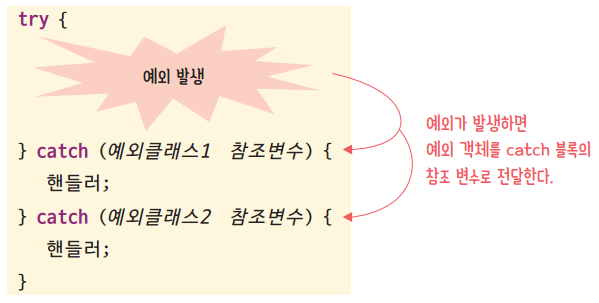


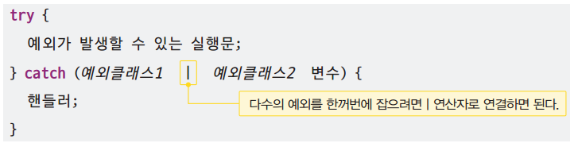


Throwable 클래스의 주요 메소드

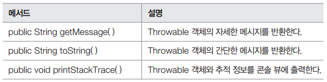


Sample.java

```java
public class Sample {
	public static void main(String[] args) {
		int[] numbers = { 7, 8, 9 };
		
		System.out.println("첫번째 숫자 : " + numbers[0]);
		try {
			System.out.println("마지막 숫자 : " + numbers[3]);
		} catch (ArrayIndexOutOfBoundsException e) {
			System.out.println("배열 인덱스를 초과했습니다.");
		}		
		System.out.println("숫자의 개수 : " + numbers.length);
	}
}
```


```
첫번째 숫자 : 7
배열 인덱스를 초과했습니다.
숫자의 개수 : 3
```


---


Sample.java

```java
public class Sample {
	public static void main(String[] args) {
		System.out.println("시작");
		try {
			int x = Integer.parseInt(args[0]);
			System.out.println( 100 / x );
		} catch (ArrayIndexOutOfBoundsException e) {
			System.out.println("파라미터가 입력되지 않았습니다. " + e.getMessage());
		} catch (NumberFormatException e) {
			System.out.println("숫자형식이 아닙니다. " + e.toString());
		} catch (ArithmeticException e) {
			System.out.println("0으로 나눌 수 없습니다. ");
			e.printStackTrace();
		} finally {				// 정상 실행 여부와 관계 없이 항상 마지막에 호출되는 구문
			System.out.println("항상 호출됩니다.");
		}
		System.out.println("끝");		
	}
}
```


cmd 에서 확인


파라미터가 누락

```bash
C:\eclipse-workspace\JavaProjects\bin>java Sample
시작
파라미터가 입력되지 않았습니다. 0
항상 호출됩니다.
끝
```


숫자 형식이 아닌 문자가 입력

```bash
C:\eclipse-workspace\JavaProjects\bin>java Sample one
시작
숫자형식이 아닙니다. java.lang.NumberFormatException: For input string: "one"
항상 호출됩니다.
끝
```


숫자로 변환되었으나 연산과정에서 오류

```bash
C:\eclipse-workspace\JavaProjects\bin>java Sample 0
시작
0으로 나눌 수 없습니다.
java.lang.ArithmeticException: / by zero
        at Sample.main(Sample.java:6)
항상 호출됩니다.
끝
```


정상적인 처리가 완료

```bash
C:\eclipse-workspace\JavaProjects\bin>java Sample 10
시작
10
항상 호출됩니다.
끝
```


---


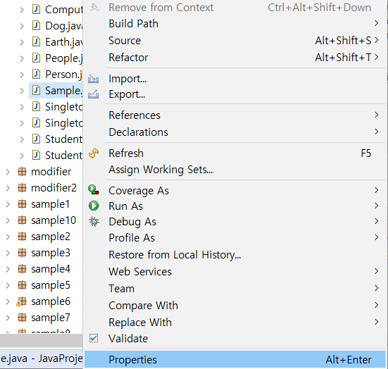


해당 파일의 위치(Location)을 확인할 수 있다.


---


Sample.java

```java
public class Sample {
	public static void main(String[] args) {
		System.out.println("시작");
		try {
			int x = Integer.parseInt(args[0]);
			System.out.println( 100 / x );
		} catch (ArrayIndexOutOfBoundsException e) {
			System.out.println("파라미터가 입력되지 않았습니다.");
		} 
		//	Exception은 마지막 catch 구문에서 처리한다.
		catch (Exception e) {
			System.out.println("예외가 발생!!!");	
		} finally {
			System.out.println("항상 호출됩니다.");
		}
		System.out.println("끝");		
	}
}
```


cmd 에서 확인

```bash
C:\eclipse-workspace\JavaProjects\bin>java Sample 0
시작
예외가 발생!!!
항상 호출됩니다.
끝
```


---


#### try - catch - finally 구문

```java
try { 
	자원 생성 및 사용
} catch(예외 e) {
	예외처리
} finally {
	자원 해제
}
```


#### try - with - resource 문 (JDK 7)

```java
try (자원 생성) {
	자원 사용
} catch(예외 e) {
	예외처리
} 
```


### 예외 처리 방법2. 예외를 떠넘기는 방법

메소드에서 발행한 예외를 메소드 내부에서 처리하기 부담스러울 경우, **throws 키워드**를 사용해서 상위 코드로 예외를 전달하는 방법


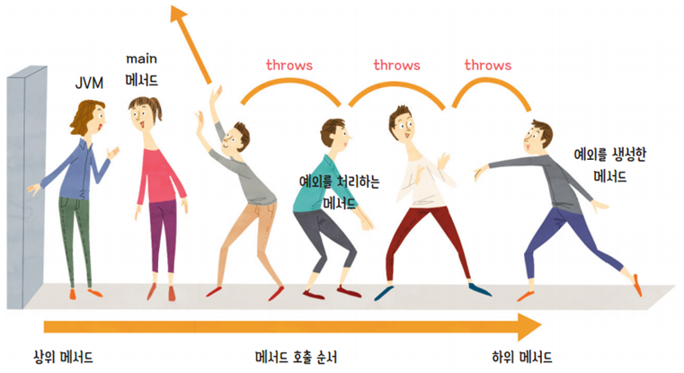


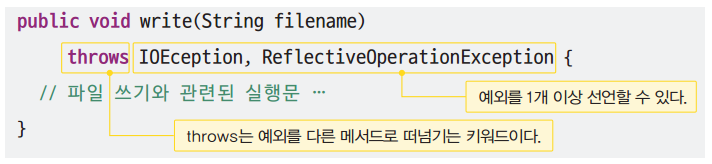


Sample.java

```java
import java.util.Scanner;

public class Sample {
	
	private static void square(String s) throws NumberFormatException {
		int n = Integer.parseInt(s);
		System.out.println( n * n );
	}
	
	public static void main(String[] args) {
		Scanner in = new Scanner(System.in);
		try {
			square(in.nextLine());
		} catch (NumberFormatException e) {
			System.out.println("숫자 타입이 아닙니다.");
		}
	}
}
```


Console

```
5
25
```


Console

```
one
숫자 타입이 아닙니다.
```


## 제네릭

하나의 코드를 다양한 타입의 객체에 재사용하는 객체 지향 기법

클래스, 인터페이스, 메소드를 정의할 때 타입을 변수로 사용


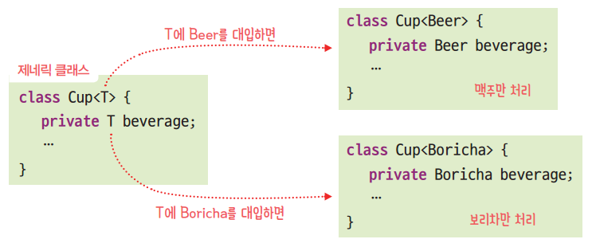


Entry.java

```java
public class Entry<K, V> {
	private K key;
	private V value;
	
	public Entry(K key, V value) {
		this.key = key;
		this.value = value;
	}
	
	public K getKey() {
		return this.key;
	}
	
	public V getValue() {
		return this.value;
	}
}
```


Sample.java

```java
public class Sample {
	public static void main(String[] args) {
		String key = "홍길동";
		int value = 789;
		Entry<String, Integer> e = new Entry<>(key, value);
		
		String key2 = e.getKey();
		int value2 = e.getValue();
		System.out.println(key2 + ", " + value2);
	}
}
```


Console

```
홍길동, 789
```


343~389, 446~497 페이지 숙독 예제 코드는 반드시 실행해 볼 것


