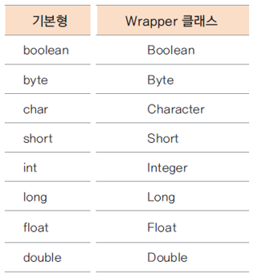

# 10.  JDK 기본 클래스

## Object 클래스

### Object 클래스

* 모든 클래스의 최상위 클래스
* java.lang.Object 클래스
* 모든 클래스는 Object 클래스에서 상속 받음
* 모든 클래스는 Object 클래스의 메서드를 사용할 수 있음
* 모든 클래스는 Object 클래스의 일부 메서드를 재정의하여 사용할 수 있음

직접 코딩을 안해도 나중에 컴파일러가 extends Object 키워드를 넣어주게 된다.

final로 정의된 메서드들은 하위 클래스에서 재정의할 수 없다.

OpenJDK\jdk-12.0.1\lib\src => JDK와 Java 관련 소스를 볼 수 있다.

src.zip 파일 압축 풀기

OpenJDK\jdk-12.0.1\lib\src\java.base\java\lang

java.lang 패키지는 import 하지 않아도 나중에 컴파일러가 자동으로 import를 해준다.


https://docs.oracle.com/javase/8/docs/api/java/lang/Object.html

메서드 중에 final로 선언된 메서드가 있다. getClass, notify, notifyAll, wait

notify, notifyAll, wait은 thread 프로그램 하는데 쓰인다.

getClass는 Class 클래스를 가져오는데 쓴다.

그 외의 것들은 overriding 해서 많이 사용한다.


### toString() 메서드

toString() 메서드의 원형

```java
getClass().getName() + '@' + Integer.toHexString(hashCode())
```

객체의 정보를 String으로 바꾸어 사용할 때 유용함

자바 클래스중에는 이미 정의된 클래스가 많음

예: String, Integer, Calendar 등

많은 클래스에서 재정의하여 사용


Chapter10 자바프로젝트 src 하위에 object 패키지 생성

object 패키지에 ToStringTest 클래스 생성


ToStringTest.java

```java
package object;

class Book {
	String title;
	String author;
	
	public Book(String title, String author) {
		this.title = title;
		this.author = author;
	}
}

public class ToStringTest {
	public static void main(String[] args) {
		Book book = new Book("토지", "박경리");
		System.out.println(book);
		
		String str = new String("토지");
		System.out.println(str);
	}
}
```


```
object.Book@15db9742
토지
```

String 클래스 안에 toString이라는 메서드가 이미 정의가 되어있다. str.toStrint()이 불린다.

toString은 Object의 메서드이다. Object의 메서드를 재정의해서 String 클래스 안에 가지고 있는 character의 배열을 출력하도록 되어있다.

toString 메서드는 어떤 객체의 정보를 String 형태로 표현해야할 때 호출되는 메서드이다.

toString 메서드의 원형은 class의 fullname + @ + 메모리 주소

Book 클래스에 대해서 저자, 책이름 같은 식으로 출력하고 싶다 => toString 재정의

마우스 오른쪽 버튼 클릭 => Source => Override... => toString => OK


ToStringTest.java

```java
package object;

class Book {
	String title;
	String author;
	
	public Book(String title, String author) {
		this.title = title;
		this.author = author;
	}

	@Override
	public String toString() {
		return author + "," + title;
	}
}

public class ToStringTest {
	public static void main(String[] args) {
		Book book = new Book("토지", "박경리");
		System.out.println(book);
		
		String str = new String("토지");
		System.out.println(str);
	}
}
```


```
박경리,토지
토지
```


Object 클래스가 모든 클래스의 최상위 클래스이다.

Object에서 다시 다운캐스팅 해야할 때도 있다. 모든 클래스는 Object 클래스로 자동형변환이 된다.


### equals() 메서드

* 두 객체의 동일함을 논리적으로 재정의 할 수 있음
  * 물리적 동일함 : 같은 주소를 가지는 객체
  * 논리적 동일함 : 같은 학번의 학생, 같은 주문 번호의 주문
* 물리적으로 다른 메모리에 위치한 객체라도 논리적으로 동일함을 구현하기 위해 사용하는 메서드

두 개의 인스턴스가 동일한지 여부를 보여주는 메서드이다.


물리적으로 다른 위치에 있지만, 논리적으로는 같은 학생임을 구현해야 함

두 학생이 같은 학생이라고 처리를 해야한다. => equals 메서드를 재정의해서 두 학생이 같은 학생인가 여부를 학번으로 체크한다. 학번이 동일하면 논리적으로 같은 학생이라는 것을 구현.


EqualsTest.java

```java
package object;

public class EqualsTest {
	public static void main(String[] args) {
		String str1 = new String("abc");
		String str2 = new String("abc");
		
		System.out.println(str1 == str2);
		System.out.println(str1.equals(str2));
	}
}
```


```
false
true
```


등호 기호를 두 개 쓰는 것은 메모리 주소가 같은지를 묻는 것이다.

메모리 주소가 다른 위치이기 때문에 false가 나온다.

equals를 사용하면 두 개의 문자열이 같은가를 비교한다. String 안에 equals를 재정의해두었다.

equals의 원형은 == 와 똑같다. 두 개의 메모리 주소가 같은지 비교한다. Object에 정의된 원형

클래스가 equals를 overriding 해서 재정의를 하게되면 각각의 클래스에 맞게 재정의를 하게 되는 것이다.

String의 경우에는 문자열이 같으면 같은 것이라고 true를 반환한다.


EqualsTest.java

```java
package object;

class Student {
	int studentNum;
	String studentName;
	
	public Student(int studentNum, String studentName) {
		this.studentNum = studentNum;
		this.studentName = studentName;
	}

	@Override
	public boolean equals(Object obj) {
		if(obj instanceof Student) {
			Student std = (Student)obj;
			return (this.studentNum == std.studentNum);
		}
		return false;
	}
}

public class EqualsTest {
	public static void main(String[] args) {
		Student Hong = new Student(100, "홍길동");
		Student Hong2 = Hong;
		Student Dong = new Student(100, "홍길동");
		
		System.out.println(Hong == Hong2);
		System.out.println(Hong == Dong);
		System.out.println(Hong.equals(Dong));
	}
}
```


```
true
false
true
```

두 학생의 학번이 같으면 같은 학생


### hashCode() 메서드

* hashCode() 메서드의 반환 값 : 인스턴스가 저장된 가상머신의 주소를 10진수로 반환
* 두 개의 서로 다른 메모리에 위치한 인스턴스가 동일하다는 것은?
  * 논리적으로 동일 : equals()의 반환값이 true
  * 동일한 hashCode 값을 가짐 : hashCode()의 반환 값이 동일


Java에서 JVM이 있다. 인스턴스가 생성이 되었을 때 메모리 주소를 준다. 그 주소 값을 hashCode라고 한다.

실제 메모리 값이 아니라 hashCode 값이 동일해야 한다.

실제 메모리 값은 그대로 있다. 단지 overriding만 하는 것이다. equals가 true 일 때 hashCode도 같은 값이 반환될 수 있도록 같다 라는 동일성을 나타내는 구현을 하면 된다.

일반적으로 equals를 overriding 하면 hashCode도 같이 overriding을 한다.


EqualsTest.java

```java
package object;

class Student {
	int studentNum;
	String studentName;
	
	public Student(int studentNum, String studentName) {
		this.studentNum = studentNum;
		this.studentName = studentName;
	}

	@Override
	public boolean equals(Object obj) {
		if(obj instanceof Student) {
			Student std = (Student)obj;
			return (this.studentNum == std.studentNum);
		}
		return false;
	}
}

public class EqualsTest {
	public static void main(String[] args) {
		Student Hong = new Student(100, "홍길동");
		Student Hong2 = Hong;
		Student Dong = new Student(100, "홍길동");
		
		System.out.println(Hong == Hong2);
		System.out.println(Hong == Dong);
		System.out.println(Hong.equals(Dong));
		
		System.out.println(Hong);
		System.out.println(Hong.hashCode());
		System.out.println(Dong.hashCode());
	}
}
```


```
true
false
true
object.Student@15db9742
366712642
1829164700
```

hashCode 값이 다르다.


EqualsTest.java

```java
package object;

class Student {
	int studentNum;
	String studentName;
	
	public Student(int studentNum, String studentName) {
		this.studentNum = studentNum;
		this.studentName = studentName;
	}

	@Override
	public boolean equals(Object obj) {
		if(obj instanceof Student) {
			Student std = (Student)obj;
			return (this.studentNum == std.studentNum);
		}
		return false;
	}

	@Override
	public int hashCode() {
		return studentNum;
	}
}

public class EqualsTest {
	public static void main(String[] args) {
		Student Hong = new Student(100, "홍길동");
		Student Hong2 = Hong;
		Student Dong = new Student(100, "홍길동");
		
		System.out.println(Hong == Hong2);
		System.out.println(Hong == Dong);
		System.out.println(Hong.equals(Dong));
		
		System.out.println(Hong);
		System.out.println(Hong.hashCode());
		System.out.println(Dong.hashCode());
	}
}
```

hashCode를 overriding 한다. 여러가지 객체의 equals와 hashCode를 구현할 일이 있는데 그 때 equals에 쓴 멤버를 사용하면 된다. 그냥 studentNum을 return 하면 된다.


```
true
false
true
object.Student@64
100
100
```

같은 값이 나온다.


EqualsTest.java

```java
package object;

public class EqualsTest {
	public static void main(String[] args) {
		Integer i1 = new Integer(100);
		Integer i2 = new Integer(100);
		
		System.out.println(i1.equals(i2));
		System.out.println(i1.hashCode());
		System.out.println(i2.hashCode());
		
		System.out.println(System.identityHashCode(i1));
		System.out.println(System.identityHashCode(i2));
	}
}
```


```
true
100
100
366712642
1829164700
```

equals, 두 개의 객체가 같다고 했을 때 두 개의 객체가 반환하는 hashCode 값도 동일하도록 overriding을 한다.

진짜 메모리 주소는 System.identityHashCode 를 이용한다. 객체가 가지고 있는 hashCode 값을 찍어볼 수 있다.

두 개의 실제 메모리 값은 다르더라도 반환하는 hashCode 값을 동일하게 return 해주면 된다.

멤버가 여러개가 같을 때 같다고 재정의할 경우 멤버들을 더하거나 빼거나 해서 hashCode를 generate 해서 많이 사용한다.


### clone() 메서드

* 객체의 복사본을 만듦
* 기본 틀(prototype)으로 부터 같은 속성 값을 가진 객체의 복사본을 생성할 수 있음
* 객체지향 프로그래밍의 정보은닉에 위배되는 가능성이 있으므로 복제할 객체는 cloneable 인터페이스를 명시해야 함

이미 만들어진 객체의 생성 과정이 굉장히 오래 걸리는 경우 그것을 그대로 복사해 올 수 있다. prototype을 하나 두고 그것을 복사해 오는 경우에도 사용할 수 있다. 같은 객체를 동일하게, 인스턴스 값을 동일하게 해서 만드는 것이다. 생성자와는 다르다. 생성자같은 경우 처음 초기화를 하면서 만드는 것인데, clone은 지금 인스턴스 상태를 그대로 복제해 오는 것이다.


ToStringTest.java

```java
package object;

class Book {
	String title;
	String author;
	
	public Book(String title, String author) {
		this.title = title;
		this.author = author;
	}

	@Override
	public String toString() {
		return author + "," + title;
	}

	@Override
	protected Object clone() throws CloneNotSupportedException {
		return super.clone();
	}
}

public class ToStringTest {
	public static void main(String[] args) throws CloneNotSupportedException {
		Book book = new Book("토지", "박경리");
		System.out.println(book);
		Book book2 = (Book)book.clone();
		System.out.println(book2);
	}
}
```

마우스 오른쪽 클릭 => Source => Override... => clone()


clone() 앞에 N이라고 써있다. => native code가 들어간다는 의미

그대로 쓰면 된다. 인스턴스의 값을 그대로 복제하게끔 구현을 해준다.

clone() 메서드의 원형이 Object로 반환이 된다. => (Book) 이라고 명시적으로 캐스팅을 해줘야 한다.

메모리가 복제되면서 예외가 발생할 수 있다. => throws

```
Exception in thread "main" 박경리,토지
java.lang.CloneNotSupportedException: object.Book
	at java.lang.Object.clone(Native Method)
	at object.Book.clone(ToStringTest.java:19)
	at object.ToStringTest.main(ToStringTest.java:27)
```

예외 발생. Book이라는 클래스는 cloneable 하지 않는데, clone이 support 되지 않았는데 사용했다는 것이다.

클래스가 clone()이라는 메서드를 사용하려면 implements Cloneable을 명시해줘야 한다. Book 클래스가 복제 가능하다는 것을 명시해줘야 한다.


ToStringTest.java

```java
package object;

class Book implements Cloneable {
	String title;
	String author;
	
	public Book(String title, String author) {
		this.title = title;
		this.author = author;
	}

	@Override
	public String toString() {
		return author + "," + title;
	}

	@Override
	protected Object clone() throws CloneNotSupportedException {
		return super.clone();
	}
}

public class ToStringTest {
	public static void main(String[] args) throws CloneNotSupportedException {
		Book book = new Book("토지", "박경리");
		System.out.println(book);
		Book book2 = (Book)book.clone();
		System.out.println(book2);
	}
}
```


```
박경리,토지
박경리,토지
```


### finalize() 메서드

finalize() 메서드는 직접 호출하는 메서드가 아니다. 이 메서드는 객체가 heap 메모리에서 해제될 때 가비지컬렉터에서 호출되는 메서드이다. 이게 정의되어 있으면 가비지컬렉터가 이 메서드 부분을 수행한다.

여기서 주로 하는 것은 리소스의 해제나 닫히지 않은 소켓을 닫는 일들을 수행한다.

예외 코드들도 많이 들어간다.

직접 부르는 메서드가 아니고 인스턴스가 heap 메모리에서 해제될 때 가비지컬렉터에 의해서 수행되는 코드 부분이다.


## String, Wrapper 클래스

### String 클래스

* String 클래스 선언하기

```java
String str1 = new String("abe");	// 인스턴스로 생성됨
String str2 = "abc";				// 상수풀에 있는 문자열을 가리킴
```


new 키워드가 쓰인다는 것은 heap 메모리에 allocation을 받겠다는 것이다.

literal. 프로그램에서 굉장히 많은 숫자나 문자열들이 쓰이게 되는데 숫자나 문자열들이 매번 쓸 때마다 다른 값들이 들어오는 것이 아니고 상수풀이라는 곳에 있어서 거기에 동일한 값을 가져다 쓴다.

두 개가 다른 의미이다. 메모리 주소를 비교했을 때 다른 경우, 오해의 소지가 있다.

스트링을 사용할 때 상수풀에 있는 것을 공유한다는 것을 이해하기


Chapter10 자바프로젝트 src 하위에 string 패키지 생성

StringTest 클래스 생성


StringTest.java

```java
package string;

public class StringTest {
	public static void main(String[] args) {
		String str1 = new String("abc");
		String str2 = new String("abc");
		
		System.out.println(str1 == str2);
		
		String str3 = "abc";
		String str4 = "abc";
		
		System.out.println(str3 == str4);
		
		System.out.println(str1.equals(str2));
		System.out.println(str3.equals(str4));
	}
}
```


```
false
true
true
true
```

메모리 위치가 달라서 false

상수풀에서 가져온 경우 true

equals를 사용하는 경우 둘 다 true


### String은 immutable

* 한번 선언되거나 생성된 문자열을 변경할 수 없음
* String 클래스의 concat() 메서드 혹은 "+"를 이용하여 String을 연결하는 경우 문자열은 새로 생성 됨


String은 불변한다.

Ctrl 누른 상태에서 String 클릭 => Attach Source => External location => External Folder => 압축 해제한 src 폴더 선택 => Java 소스를 볼 수 있다.

내부에 final 이라고 선언한 배열이 있다.

```java
    @Stable
    private final byte[] value;
```

이 배열 안에 값들을 넣고 빼로 하는 오퍼레이션들이 진행된다.

중요한 것은 가지고 있는 값은 final이기 때문에 변하지 않는다는 것이다.

java와 android라는 String을 연결하고 싶다. => concat 메서드를 이용하면 연결이 된다. 간단하게 "+" 오퍼레이터를 써도 연결이 된다.

연결했다고 했을 때 생각하기에는 java 뒤에 android가 붙는 것으로 생각할 수 있지만, 실제로는 그게 아니라 새로운 메모리가 생성이 된다.

String 값을 계속 연결을 해서 그 결과를 만든다고 하면 메모리 낭비가 된다.

한번 생성된 String은 불변이다. 계속 새로운 메모리가 만들어진다.


StringTest2.java

```java
package string;

public class StringTest2 {
	public static void main(String[] args) {
		String java = new String("java");
		String android = new String("android");
		System.out.println(System.identityHashCode(java));
		
		java = java.concat(android);
		
		System.out.println(java);
		System.out.println(System.identityHashCode(java));
	}
}
```

실제로 메모리 주소가 어떻게 되는지 확인해 볼 때 hashCode 값으로는 확인할 수 없다.

java라는 것에 android가 붙었을 것 같은데, 메모리 값이 다르다.


```
366712642
javaandroid
1829164700
```

연결이 되면 새로운 메모리를 가리킨다.


### StringBuilder와 StringBuffer

만약 String을 계속 연결해서 쓸 일이 있다면 StringBuilder나 StringBuffer를 쓰면 된다.

* 가변적인 char[] 배열을 멤버변수로 가지고 있는 클래스
* 문자열을 변경하거나 연결하는 경우 사용하면 편리한 클래스
* StringBuffer는 멀티 스레드 프로그래밍에서 동기화(Synchronization)이 보장됨
* 단일 스레드 프로그래밍에서는 StringBuilder를 사용하는 것이 더 좋음
* toString() 메서드로 String 반환


StringBuilderTest.java

```java
package string;

public class StringBuilderTest {
	public static void main(String[] args) {
		String java = new String("java");
		String android = new String("android");
		
		StringBuilder buffer = new StringBuilder(java);
		System.out.println(System.identityHashCode(buffer));
		buffer.append(android);
		System.out.println(System.identityHashCode(buffer));
		
		java = buffer.toString();
	}
}
```


```
366712642
366712642
```

연결하기 전과 연결한 후의 메모리 주소 같다.

불변이 아니고, 그 안에 value 값이 다 바뀐 다음에 나중에 필요하면 toString을 해서 String 값을 받으면 된다.


### Wrapper 클래스

* 기본 자료형에 대한 클래스



primitive data type은 C와 C++에서 넘어온 자료형이라고 보면 된다.

primitive data type들을 기반으로 한 클래스들을 감쌌다는 의미로 Wrapper 클래스라고 한다.

toString, hashCode, equals 등이 overriding 되어있다.

new 했을 경우와 constant area에서 값을 가져올 때랑 메모리 사용하는 것이 다르다.


## Class 클래스

### Class 클래스

* 자바의 모든 클래스와 인터페이스는 컴파일 후 class 파일로 생성됨
* class 파일에는 객체의 정보(멤버변수, 메서드, 생성자 등)가 포함되어 있음
* Class 클래스는 컴파일된 class 파일에서 객체의 정보를 가져올 수 있음


### Class 클래스 가져오기

```java
// 1
String s = new String();
Class c = s.getClass();

// 2
Class c = String.Class;

// 3
Class c = Class.forName("java.lang.String");  // 동적 로딩
```


### reflection 프로그래밍

* Class 클래스로부터 객체의 정보를 가져와 프로그래밍 하는 방식
* 로컬에 객체가 없고 자료형을 알 수 없는 경우 유용한 프로그래밍
* java.lang.reflection 패키지에 있는 클래스 활용


### newInstance() 메서드

* Class 클래스 메서드
* new 키워드를 사용하지 않고 인스턴스를 생성


### forName() 메서드와 동적 로딩

* Class 클래스 static 메서드
* 동적 로딩이란?
  * 컴파일 시에 데이터 타입이 모두 binding 되어 자료형이 로딩되는 것(static loading)이 아니라 실행 중에 데이터 타입을 알고 binding 되는 방식
* 실행 시에 로딩되므로 경우에 따라 다른 클래스가 사용될 수 있어 유용함
* 컴파일 타임에 체크 할 수 없으므로 해당 문자열에 대한 클래스가 없는 경우 예외(ClassNotFoundException)이 발생할 수 있음

