# 11. 컬렉션 프레임워크

컬렉션 프레임워크는 Java에서 여러가지 자료구조와 알고리즘을 구현해놓은 라이브러리라고 할 수 있다.

제네릭 프로그래밍이 컬렉션 프레임워크에 다 적용이 되어있다.

C++의 템플릿과 굉장히 유사하다.


## 제네릭(Generic) 프로그래밍

### 제네릭 프로그래밍이란

* 변수의 선언이나 메서드의 매개변수를 하나의 참조 자료형이 아닌 여러 자료형으로 변환 될 수 있도록 프로그래밍 하는 방식
* 실제 사용되는 참조 자료형으로의 변환은 컴파일러가 검증하므로 안정적인 프로그래밍 방식


변수를 선언할 때 데이터 타입을 명시하고 선언한다. 그러면 그 데이터 타입에 해당되는 경우만 쓸 수 있다.

어떤 변수가 여러 개의 타입으로 변경되서 쓰일 수 있다고 하면 이 때 제네릭 프로그래밍 방식을 사용한다.


### 자료형 매개 변수 T

* 여러 참조 자료형으로 대체 될 수 있는 부분을 하나의 문자로 표현

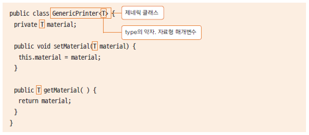

type의 의미로 T 사용

T라는 것이 제네릭 타입이 된다. 여기에 어떤 것이 들어갈 수 있는지는 실제 클래스를 쓸 때 결정하면 된다.


3D 프린터의 재료의 type을 자료형 매개 변수로 두고 플라스틱인지 파우더인지 type이 결정될 수 있도록 한다.


generic 패키지 생성

Plastic.java

```java
package generic;

public class Plastic {
	public String toString() {
		return "재료는 Plastic 입니다.";
	}
}
```


Powder.java

```java
package generic;

public class Powder {
	public String toString() {
		return "재료는 Powder 입니다.";
	}
}
```


GenericPrinter.java

```java
package generic;

public class GenericPrinter<T> {
	private T material;

	public T getMaterial() {
		return material;
	}

	public void setMaterial(T material) {
		this.material = material;
	}
	
	public String toString() {
		return material.toString();
	}
}
```

printer를 쓸 때 재료를 정하자. T 타입이 적용되어서 클래스가 실제로 생성될 때 T 타입에 어떤 재료가 되는지 모두 대입이 될 것이다.

getter, setter 추가


GenericPrinterTest.java

```java
package generic;

public class GenericPrinterTest {
	public static void main(String[] args) {
		//GenericPrinter<Powder> powderPrinter = new GenericPrinter<>();
		GenericPrinter<Powder> powderPrinter = new GenericPrinter<Powder>();
		Powder powder = new Powder();
		powderPrinter.setMaterial(powder);
		System.out.println(powderPrinter);
		
		GenericPrinter<Plastic> plasticPrinter = new GenericPrinter<Plastic>();
		Plastic plastic = new Plastic();
		plasticPrinter.setMaterial(plastic);
		System.out.println(plasticPrinter);
	}
}
```

<> 연산자를 쓸 때 자료형을 안 쓸 수도 있다. 유추를 한다. 앞에 있는 값을 가져다가 넣게 된다.

생성을 해서 set을 통해 넣어준다.


```
재료는 Powder 입니다.
재료는 Plastic 입니다.
```


### <T extends 클래스>

* T 대신에 사용될 자료형을 제한하기 위해 사용

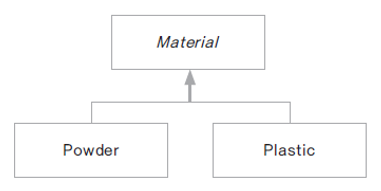

* Material에 정의 된 메서드를 공유할 수 있음


Water는 3D 프린터의 재료가 될 수 없다. 만약 아무런 제약 조건이 없다면 waterPrinter가 만들어 질 수도 있다. 문제가 된다. => 상위 클래스를 선언한다.


Material 클래스 생성

Material.java

```java
package generic;

public class Material {

}
```


GenericPrinter.java

```java
package generic;

public class GenericPrinter<T extends Material> {
	private T material;

	public T getMaterial() {
		return material;
	}

	public void setMaterial(T material) {
		this.material = material;
	}
	
	public String toString() {
		return material.toString();
	}
}
```

GenericPrinter에서 사용하는 T는 extends Material 해야한다. 여기서 상속받은 것들만  GenericPrinter의 재료로 쓸 수 있다.


Plastic.java

```java
package generic;

public class Plastic extends Material {
	public String toString() {
		return "재료는 Plastic 입니다.";
	}
}
```

Material을 상속받는다.


Powder.java

```java
package generic;

public class Powder extends Material {
	public String toString() {
		return "재료는 Powder 입니다.";
	}
}
```

Material을 상속받는다.


이제 Water는 쓸 수 없다. 쓸 수 있는 것에 대해 제한을 가할 때 상위 클래스를 쓰는 것이 하나의 방법이다.

---

Metarial.java

```java
package generic;

public abstract class Material {
	public abstract void doPrinting();
}
```


Plastic.java

```java
package generic;

public class Plastic extends Material {
	public String toString() {
		return "재료는 Plastic 입니다.";
	}

	@Override
	public void doPrinting() {
		System.out.println("Plastic으로 프린팅 합니다.");
	}
}
```

doPrinting을 구현해야 한다.


Powder.java

```java
package generic;

public class Powder extends Material {
	public String toString() {
		return "재료는 Powder 입니다.";
	}

	@Override
	public void doPrinting() {
		System.out.println("Powder로 프린팅 합니다.");
	}
}
```

doPrinting을 구현해야 한다.


GenericPrinter.java

```java
package generic;

public class GenericPrinter<T extends Material> {
	private T material;

	public T getMaterial() {
		return material;
	}

	public void setMaterial(T material) {
		this.material = material;
	}
	
	public String toString() {
		return material.toString();
	}
	
	public void printing() {
		material.doPrinting();
	}
}
```

doPrinting 메서드 사용 가능


GenericPrinterTest.java

```java
package generic;

public class GenericPrinterTest {
	public static void main(String[] args) {
		//GenericPrinter<Powder> powderPrinter = new GenericPrinter<>();
		GenericPrinter<Powder> powderPrinter = new GenericPrinter<Powder>();
		Powder powder = new Powder();
		powderPrinter.setMaterial(powder);
		System.out.println(powderPrinter);
		
		GenericPrinter<Plastic> plasticPrinter = new GenericPrinter<Plastic>();
		Plastic plastic = new Plastic();
		plasticPrinter.setMaterial(plastic);
		System.out.println(plasticPrinter);
		
		powderPrinter.printing();
		plasticPrinter.printing();
	}
}
```


```
재료는 Powder 입니다.
재료는 Plastic 입니다.
Powder로 프린팅 합니다.
Plastic으로 프린팅 합니다.
```


자료형 매개 변수 T에 extends라는 제약을 둬서 정의된 메서드도 사용할 수 있고, 사용할 수 있는 타입에 대한 제한을 둘 수도 있다. 상속을 통해서 구현할 수 있다.


### 자료형 매개 변수가 두 개 이상일 때

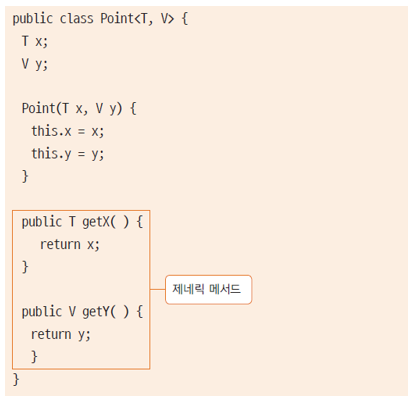

서로 다른 타입일 수 있다.

제네릭 타입으로 써있는 메서드를 제네릭 메서드라고 한다.


### 제너릭 메서드

* 메서드의 매개 변수를 자료형 매개 변수로 사용하는 메서드

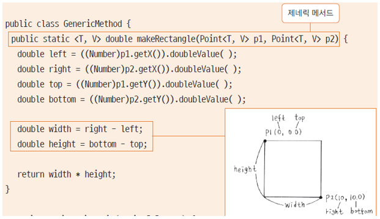

제네릭 메서드를 일반 클래스에서도 쓸 수 있다.

제네릭 클래스가 아니라 일반 클래스라고 해도 제네릭 메서드를 쓸 수 있는데, 이 때 사용하는 T와 V는 지역 변수와 똑같다. 그 안에서만 의미가 있다.


* 메서드 내에서의 자료형 매개 변수는 메서드 내에서만 유효함(지역 변수와 같은 개념)

```java
class Shape<T> {
    public static <T,V> double makeRectangle(Point<T,V> p1, Point<T,V> p2) {
        // ......
    }
}
```

Shape의 T와 makeRectangle의 T는 전혀 다른 의미

Shape의 T는 안에서 맴버 변수나 반환값으로 쓰일 수가 있고, makeRectangle의 T는 Point<T,V>를 위한 값이다. 그 메서드 내에서만 유효하다.


```java
GenericPrinter printer = new GenericPrinter();
```

프로그래밍 할 때 아예 안 쓸 수도 있다. T 타입을 선언해주는 것이 좋겠다고 경고한다. 안에서 Object로 취급을 한다.


## 컬렉션 프레임워크

### 컬렉션 프레임워크란?

* 프로그램 구현에 필요한 자료구조와 알고리즘을 구현해 놓은 라이브러리
* java.util 패키지에 구현되어 있음
* 개발에 소요되는 시간을 절약하고 최적화된 라이브러리를 사용할 수 있음
* Collection 인터페이스와 Map 인터페이스로 구성됨

메모리 위에 데이터들이 있는데 그 데이터들을 어떤 구조로 관리를 할 것인지. 어떤 구조로 관리를 했을 때 가장 효율적인 알고리즘을 적용을 해서 시스템이 효율적으로 수행될 수 있도록 하는지가 자료구조와 알고리즘이다.


### Collection 인터페이스

* 하나의 객체의 관리를 위해 선언된 인터페이스로 필요한 기본 메서드가 선언되어 있음
* 하위에 List, Set 인터페이스가 있음

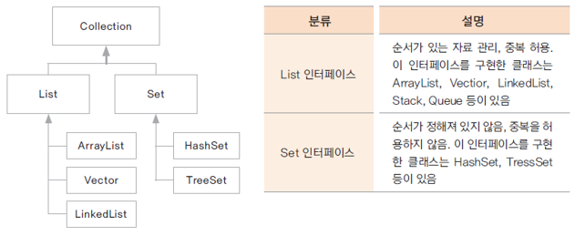

클래스 들이 굉장히 많이 있다. 많은 클래스들을 다 외우려고 할 필요는 없지만 이 클래스가 어떻게 구별이 되고 어떤 것 밑에 있는지 알아둬야 나중에 쓸 때에도 잘 가져다 쓸 수 있다.

Collection은 하나의 객체에 대한 자료구조이다.


### Map 인터페이스

* 쌍으로 이루어진 객체를 관리하는데 필요한 여러 메서드가 선언되어 있음
* Map을 사용하는 객체는 key-value 쌍으로 되어 있고 key는 중복될 수 없음

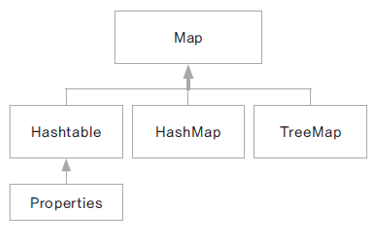


## List 인터페이스

### List 인터페이스

* Collection 하위 인터페이스
* 객체를 순서에 따라 저장하고 관리하는데 필요한 메서드가 선언된 인터페이스
* 배열의 기능을 구현하기 위한 메서드가 선언됨
* ArrayList, Vector, LinkedList

하나의 자료를 위한 인터페이스


### ArrayList와 Vector

* 객체 배열 클래스
* Vector는 자바2 부터 제공된 클래스
* 일반적으로 ArrayList를 더 많이 사용
* Vector는 멀티 스레드 프로그램에서 동기화를 지원
* 동기화(Synchronization) : 두 개의 스레드가 동시에 하나의 리소스에 접근할 때 순서를 맞추어서 데이터의 오류가 발생하지 않도록 함
* capacity와 size는 다른 의미임

처음에 ArrayList를 만들면 10개 짜리 배열이 만들어진다. 10개 짜리를 만들었는데 11번 째의 element를 넣는다면 모자른다. ArrayList 같은 경우 배열을 다른 memory allocation을 받아서 더 큰 배열을 만들고 거기에 배열의 요소를 다 copy 한다.

capacity는 배열의 용량을 얘기한다.

size는 우리가 10개 짜리 배열을 만들었다고 해도 element는 3개만 들어갈 수도 있다. 그 안에 몇 개의 요소가 들어가 있는지가 size이다.

capacity가 부족하면 배열의 용량을 키운다.


### ArrayList와 LinkedList

* 둘다 자료의 순차적 구조를 구현한 클래스
* ArrayList는 배열을 구현한 클래스로 논리적 순서와 물리적 순서가 동일함
* LinkedList는 논리적으로 순차적인 구조지만, 물리적으로는 순차적이지 않을 수 있음


* LinkedList 구조

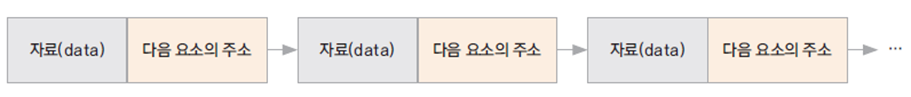

next element에 대한 reference를 가지고 있다.


* LinkedList에서 자료의 추가와 삭제

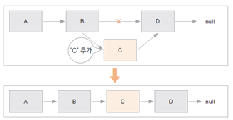

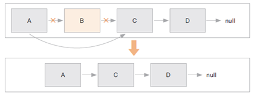

---

ArrayList의 정의로 이동. AbstractList 클래스에서 상속받음. List 인터페이스를 구성했다.

```java
    private static final int DEFAULT_CAPACITY = 10;
```

10개 짜리를 만든다.

우리가 ArrayList를 쓸 때 element를 지정해서 쓴다. 제너릭 프로그래밍

---

Vector의 정의로 이동. synchronized라는 키워드가 메서드에 다 들어있다.

이 키워드의 역할은 여러 개의 스레드가 한꺼번에 리소스에 접근할 때 순서를 맞춰주는 기능이다.

단일 스레드에서는 동기화가 오버헤드가 된다.

---

collection 패키지 생성, Member 클래스 생성


Member.java

```java
package collection;

public class Member {
	private int memberId;
	private String memberName;
	
	public Member() {}
	public Member(int memberId, String memberName) {
		this.memberId = memberId;
		this.memberName = memberName;
	}
	public int getMemberId() {
		return memberId;
	}
	public void setMemberId(int memberId) {
		this.memberId = memberId;
	}
	public String getMemberName() {
		return memberName;
	}
	public void setMemberName(String memberName) {
		this.memberName = memberName;
	}
	
	public String toString() {
		return memberName + "회원님의 아이디는 " + memberId + "입니다.";
	}
}
```

생성자 선언

getter, setter 생성


LinkedListTest.java

```java
package collection;

import java.util.LinkedList;

public class LinkedListTest {
	public static void main(String[] args) {
		LinkedList<String> myList = new LinkedList<String>();
		
		myList.add("A");
		myList.add("B");
		myList.add("C");
		
		System.out.println(myList);
		myList.add(1, "D");
		System.out.println(myList);
		myList.removeLast();
		System.out.println(myList);
		
		for(int i = 0; i < myList.size(); i++) {
			String s = myList.get(i);
			System.out.println(s);
		}
	}
}
```

대부분의 Collection은 toString이 제공된다. 요소를 보여준다.


```
[A, B, C]
[A, D, B, C]
[A, D, B]
A
D
B
```


Set은 Collection 인터페이스인데 중복을 허용하지 않고 데이터를 관리한다. 순서에 기반하지 않는다. List는 순서에 따라 객체를 저장한다. get 메서드는 List 쪽에만 있는 메서드이다. => Set 같은 경우는 다른 방법으로 순회


## Stack과 Queue 구현하기

### Stack 구현하기

* Last In First Out(LIFO) : 맨 마지막에 추가된 요소가 가장 먼저 꺼내지는 자료구조
* 이미 구현된 클래스가 제공 됨
* ArrayList나 LinkedList로 구현할 수 있음
* 게임에서 무르기, 최근 자료 가져오기 등에 구현

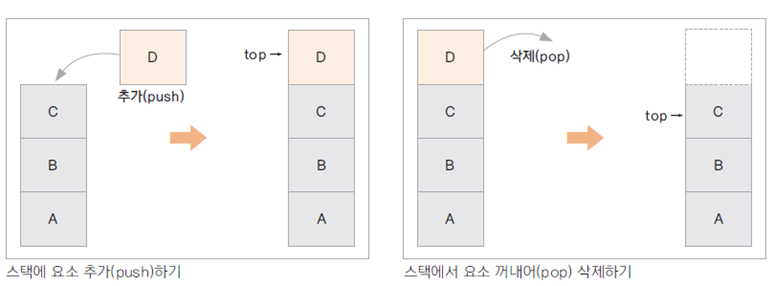


StackTest.java

```java
package collection;

import java.util.ArrayList;

class MyStack {
	private ArrayList<String> arrayStack = new ArrayList<String>();
	
	public void push(String data) {
		arrayStack.add(data);
	}
	
	public String pop() {
		int len = arrayStack.size();
		if(len == 0) {
			System.out.println("스택이 비었습니다.");
			return null;
		}
		return arrayStack.remove(len - 1);
	}
}

public class StackTest {
	public static void main(String[] args) {
		MyStack stack = new MyStack();
		stack.push("A");
		stack.push("B");
		stack.push("C");
		
		System.out.println(stack.pop());
		System.out.println(stack.pop());
		System.out.println(stack.pop());
		System.out.println(stack.pop());
	}
}
```


```
C
B
A
스택이 비었습니다.
null
```

---

Java에 이미 Stack이 구현되어 있다.

https://docs.oracle.com/javase/8/docs/api/java/util/Stack.html

peek는 그 element가 뭔지만 확인한다. Stack에서 꺼내지는 않는다.


### Queue 구현하기

* First In First Out(FIFO) : 먼저 저장된 자료가 먼저 꺼내지는 자료구조
* 선착순, 대기열 등을 구현할 때 가장 많이 사용되는 자료구조
* ArrayList나 LinkedList로 구현할 수 있음

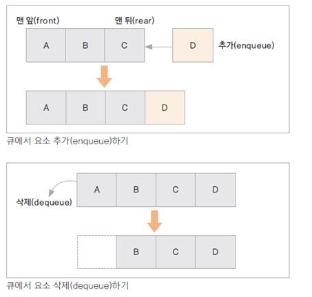

---

https://docs.oracle.com/javase/8/docs/api/java/util/Queue.html

Queue 인터페이스가 구현된 클래스들이 있다. LinkedList도 Queue를 구현했다.

PriorityQueue는 우선순위를 가진 Queue이다.

일반적으로 ArrayList를 이용해서 Queue를 많이 쓴다.


## Set 인터페이스

### Iterator로 순회하기

* Collection의 개체를 순회하는 인터페이스

* iterator() 메서드 호출

  ```java
  Iterator ir = memberArrayList.iterator();
  ```

* Iterator에 선언된 메서드

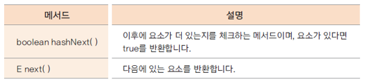

모든 Collection 객체에 iterator 메서드를 호출하면 iterator가 반환된다. 이것을 가지고 순회할 수 있다.


collection 패키지 밑에 set 패키지 생성

HashSetTest 클래스 생성


HashSetTest.java

```java
package collection.set;

import java.util.HashSet;
import java.util.Iterator;

public class HashSetTest {
	public static void main(String[] args) {
		HashSet<String> set = new HashSet<String>();
		set.add("이순신");
		set.add("김유신");
		set.add("강감찬");
		set.add("이순신");
		
		System.out.println(set);
		
		Iterator<String> ir = set.iterator();
		
		while(ir.hasNext()) {
			String str = ir.next();
			System.out.println(str);
		}
	}
}
```

HashSet 클래스는 Set 인터페이스를 구현한 클래스이다.

```
[김유신, 강감찬, 이순신]
김유신
강감찬
이순신
```

순서대로 출력되지 않는다. hash 방식으로 관리된다.

이순신이 한번 밖에 안들어갔다. 중복을 허용하지 않는다.

hasNext는 다음 element가 있는지 물어본다. 있으면 가져오는 것이 next


---

Member 클래스를 복사해서 set 패키지에 붙여넣는다.

Member를 HashSet으로 관리


MemberHashSet.java

```java
package collection.set;

import java.util.HashSet;
import java.util.Iterator;

public class MemberHashSet {
	private HashSet<Member> hashSet;
	
	public MemberHashSet() {
		hashSet = new HashSet<Member>();
	}
	
	public void addMember(Member member) {
		hashSet.add(member);
	}
	
	public boolean removeMember(int memberId) {
		Iterator<Member> ir = hashSet.iterator();
		while(ir.hasNext()) {
			Member member = ir.next();
			if(member.getMemberId() == memberId) {
				hashSet.remove(member);
				return true;
			}
		}
		System.out.println(memberId + "번호가 존재하지 않습니다.");
		return false;
	}
	
	public void showAllMember() {
		for(Member member : hashSet) {
			System.out.println(member);
		}
		System.out.println();
	}
}
```


MemberHashSetTest.java

```java
package collection.set;

public class MemberHashSetTest {
	public static void main(String[] args) {
		MemberHashSet manager = new MemberHashSet();
		
		Member memberLee = new Member(100, "Lee");
		Member memberKim = new Member(200, "Kim");
		Member memberPark = new Member(300, "Park");
		
		manager.addMember(memberLee);
		manager.addMember(memberKim);
		manager.addMember(memberPark);
		
		manager.showAllMember();
		
		manager.removeMember(100);
		manager.showAllMember();
	}
}
```


```
Park회원님의 아이디는 300입니다.
Lee회원님의 아이디는 100입니다.
Kim회원님의 아이디는 200입니다.

Park회원님의 아이디는 300입니다.
Kim회원님의 아이디는 200입니다.
```


---

MemberHashSetTest.java

```java
package collection.set;

public class MemberHashSetTest {
	public static void main(String[] args) {
		MemberHashSet manager = new MemberHashSet();
		
		Member memberLee = new Member(100, "Lee");
		Member memberKim = new Member(200, "Kim");
		Member memberPark = new Member(300, "Park");
		Member memberPark2 = new Member(300, "Park2");
		
		manager.addMember(memberLee);
		manager.addMember(memberKim);
		manager.addMember(memberPark);
		manager.addMember(memberPark2);
		
		manager.showAllMember();
	}
}
```


```
Park회원님의 아이디는 300입니다.
Lee회원님의 아이디는 100입니다.
Kim회원님의 아이디는 200입니다.
Park2회원님의 아이디는 300입니다.
```

300번이 두 명이다. memberId는 유일한 값이어야 한다. 그런데 300번이 두 개가 동시에 들어갔다.

String 같은 경우는 한 번 밖에 안들어갔다. 여기서는 여러 번 들어간 이유는 memberPark와 memberPark2가 같다는 것이 정의되지 않았기 때문이다. 

Member에 대해서 Id가 같으면 같은 멤버라는 것이 논리적인 구현이 되어있지 않다. 이것을 구현해야 한다. Member 클래스에서 구현한다.


Member.java

```java
package collection.set;

public class Member {
	private int memberId;
	private String memberName;
	
	public Member() {}
	public Member(int memberId, String memberName) {
		this.memberId = memberId;
		this.memberName = memberName;
	}
	public int getMemberId() {
		return memberId;
	}
	public void setMemberId(int memberId) {
		this.memberId = memberId;
	}
	public String getMemberName() {
		return memberName;
	}
	public void setMemberName(String memberName) {
		this.memberName = memberName;
	}
	
	public String toString() {
		return memberName + "회원님의 아이디는 " + memberId + "입니다.";
	}
	@Override
	public int hashCode() {
		return memberId;
	}
	@Override
	public boolean equals(Object obj) {
		if(obj instanceof Member) {
			Member member = (Member)obj;
			return (this.memberId == member.memberId);
		}
		return false;
	}
}
```

equals와 hashCode 재정의


MemberHashSetTest 클래스의 main 메서드 실행

```
Lee회원님의 아이디는 100입니다.
Kim회원님의 아이디는 200입니다.
Park회원님의 아이디는 300입니다.
```

중복된 값이 들어가지 않는 것을 확인할 수 있다.


Set으로 되어있는 것을 쓸 때 해야할 일 중 하나는 관리할 객체가 논리적으로 같다는 것에 대한 정의가 되어있는지이다. 되어있지 않다면 재정의를 해야한다.

기존에 있는 클래스들은 이미 정의가 되어 있기 때문에 잘 돌아간다.


### Set 인터페이스

* Collection 하위의 인터페이스
* 중복을 허용하지 않음
* List는 순서 기반의 인터페이스지만, Set은 순서가 없음
* get(i) 메서드가 제공되지 않음 (iterator로 순회)
* 저장된 순서와 출력순서는 다를 수 있음
* 아이디, 주민번호, 사번 등 유일한 값이나 객체를 관리할 때 사용
* HashSet, TreeSet 클래스


### HashSet 클래스

* Set 인터페이스를 구현한 클래스
* 중복을 허용하지 않으므로 저장되는 객체의 동일함 여부를 알기 위해 equals()와 hashCode() 메서드를 재정의 해야 함


### TreeSet 클래스

* 객체의 정렬에 사용되는 클래스
* 중복을 허용하지 않으면서 오름차순이나 내림차순으로 객체를 정렬함
* 내부적으로 이진 검색 트리(binary search tree)로 구현되어 있음
* 이진 검색 트리에 자료가 저장 될 때 비교하여 저장될 위치를 정함
* 객체 비교를 위해 Comparable 이나 Comparator 인터페이스를 구현해야 함

앞에 Tree가 붙게되면 정렬을 위해서 쓰고 내부적으로 binary search tree가 사용된다.


collection 패키지 밑에 treeset 패키지 생성

TreeSetTest 클래스 생성


TreeSetTest.java

```java
package collection.treeset;

import java.util.TreeSet;

public class TreeSetTest {
	public static void main(String[] args) {
		TreeSet<String> treeSet = new TreeSet<String>();
		treeSet.add("홍길동");
		treeSet.add("강감찬");
		treeSet.add("이순신");
		
		for(String str : treeSet) {
			System.out.println(str);
		}
	}
}
```


```
강감찬
이순신
홍길동
```

정렬이 되어있다. 정렬이 되는 이유는 String의 정의로 이동해서 보면 Comparable\<String>이 이미 구현이 되어있다. Comparable 인터페이스를 String이 구현. 오름차순으로 기본적으로 구현을 하게끔 만들어져 있다.

---

set 패키지의 Member.java, MemberHashSet.java, MemberHashSetTest.java 파일 복사 => treeset 패키지에 붙여넣기 => Hash 대신 Tree로 이름 변경


MemberTreeSet.java

```java
package collection.treeset;

import java.util.TreeSet;
import java.util.Iterator;

public class MemberTreeSet {
	private TreeSet<Member> treeSet;
	
	public MemberTreeSet() {
		treeSet = new TreeSet<Member>();
	}
	
	public void addMember(Member member) {
		treeSet.add(member);
	}
	
	public boolean removeMember(int memberId) {
		Iterator<Member> ir = treeSet.iterator();
		while(ir.hasNext()) {
			Member member = ir.next();
			if(member.getMemberId() == memberId) {
				treeSet.remove(member);
				return true;
			}
		}
		System.out.println(memberId + "번호가 존재하지 않습니다.");
		return false;
	}
	
	public void showAllMember() {
		for(Member member : treeSet) {
			System.out.println(member);
		}
		System.out.println();
	}
}
```

HashSet을 TreeSet으로 변경

TreeSet에 Member를 add 하고 remove, show도 한다.


MemberTreeSetTest.java

```java
package collection.treeset;

public class MemberTreeSetTest {
	public static void main(String[] args) {
		MemberTreeSet manager = new MemberTreeSet();
		
		Member memberLee = new Member(300, "Lee");
		Member memberKim = new Member(100, "Kim");
		Member memberPark = new Member(200, "Park");
		
		manager.addMember(memberLee);
		manager.addMember(memberKim);
		manager.addMember(memberPark);

		manager.showAllMember();
	}
}
```

회원의 ID 순서대로 정렬을 하고싶다.


```
Exception in thread "main" java.lang.ClassCastException: collection.treeset.Member cannot be cast to java.lang.Comparable
	at java.util.TreeMap.compare(Unknown Source)
	at java.util.TreeMap.put(Unknown Source)
	at java.util.TreeSet.add(Unknown Source)
	at collection.treeset.MemberTreeSet.addMember(MemberTreeSet.java:14)
	at collection.treeset.MemberTreeSetTest.main(MemberTreeSetTest.java:11)
```

오류가 난다. Comparable 하지 않다. addMember에서 오류가 난다. add 할 때 TreeSet에 Member를 집어넣으려 하는데 Member가 어떻게 비교해야 될지가 모르겠다는 것이다.

숫자의 비교는 숫자로 비교하니까 비교가 되는데 다른 객체인 경우는 비교하는 방법을 구현해야 한다. Member 같은 경우는 어떻게 비교할지가 전혀 구현이 안되어있다.

---

#### Comparable 인터페이스 사용

Member.java

```java
package collection.treeset;

public class Member implements Comparable<Member> {
	private int memberId;
	private String memberName;
	
	public Member() {}
	public Member(int memberId, String memberName) {
		this.memberId = memberId;
		this.memberName = memberName;
	}
	public int getMemberId() {
		return memberId;
	}
	public void setMemberId(int memberId) {
		this.memberId = memberId;
	}
	public String getMemberName() {
		return memberName;
	}
	public void setMemberName(String memberName) {
		this.memberName = memberName;
	}
	
	public String toString() {
		return memberName + "회원님의 아이디는 " + memberId + "입니다.";
	}
	@Override
	public int hashCode() {
		return memberId;
	}
	@Override
	public boolean equals(Object obj) {
		if(obj instanceof Member) {
			Member member = (Member)obj;
			return (this.memberId == member.memberId);
		}
		return false;
	}
	@Override
	public int compareTo(Member member) {
		return (this.memberId - member.memberId);
	}
}
```

implements Comparable\<Member>

compareTo라는 메서드를 구현해야 한다. this와 넘어온 매개변수를 비교하면 된다.

반환이 내 것이 더 컸을 때 양수를 반환하게 되면 오름차순으로 정렬이 된다.


```
Kim회원님의 아이디는 100입니다.
Park회원님의 아이디는 200입니다.
Lee회원님의 아이디는 300입니다.
```

memberId로 정렬된다.

---

Member.java

```java
...
	@Override
	public int compareTo(Member member) {
		return (this.memberId - member.memberId) * (-1);
	}
...
```


```
Lee회원님의 아이디는 300입니다.
Park회원님의 아이디는 200입니다.
Kim회원님의 아이디는 100입니다.
```

내림차순으로 정렬된다.

---

이름으로 정렬하고 싶은 경우 => String으로 정렬

Member.java

```java
...
	@Override
	public int compareTo(Member member) {
		return this.memberName.compareTo(member.getMemberName());
	}
...
```

compareTo가 이미 구현되어 있으므로 활용


```
Kim회원님의 아이디는 100입니다.
Lee회원님의 아이디는 300입니다.
Park회원님의 아이디는 200입니다.
```

이름으로 정렬이 된다.

---

#### Comparator 인터페이스 사용

Member.java

```java
package collection.treeset;

import java.util.Comparator;

public class Member implements Comparator<Member> {
	private int memberId;
	private String memberName;
	
	public Member() {}
	public Member(int memberId, String memberName) {
		this.memberId = memberId;
		this.memberName = memberName;
	}
	public int getMemberId() {
		return memberId;
	}
	public void setMemberId(int memberId) {
		this.memberId = memberId;
	}
	public String getMemberName() {
		return memberName;
	}
	public void setMemberName(String memberName) {
		this.memberName = memberName;
	}
	
	public String toString() {
		return memberName + "회원님의 아이디는 " + memberId + "입니다.";
	}
	@Override
	public int hashCode() {
		return memberId;
	}
	@Override
	public boolean equals(Object obj) {
		if(obj instanceof Member) {
			Member member = (Member)obj;
			return (this.memberId == member.memberId);
		}
		return false;
	}
	@Override
	public int compare(Member member1, Member member2) {
		return (member1.memberId - member2.memberId);
	}
}
```

implements Comparator\<Member>

compare 메서드를 구현해야 한다. Member 2개가 넘어온다. 첫 번째 Member가 this라고 보면 된다.

오름차순으로 정렬


MemberTreeSet.java

```java
package collection.treeset;

import java.util.TreeSet;
import java.util.Iterator;

public class MemberTreeSet {
	private TreeSet<Member> treeSet;
	
	public MemberTreeSet() {
		treeSet = new TreeSet<Member>(new Member());
	}
	
	public void addMember(Member member) {
		treeSet.add(member);
	}
	
	public boolean removeMember(int memberId) {
		Iterator<Member> ir = treeSet.iterator();
		while(ir.hasNext()) {
			Member member = ir.next();
			if(member.getMemberId() == memberId) {
				treeSet.remove(member);
				return true;
			}
		}
		System.out.println(memberId + "번호가 존재하지 않습니다.");
		return false;
	}
	
	public void showAllMember() {
		for(Member member : treeSet) {
			System.out.println(member);
		}
		System.out.println();
	}
}
```

Comparator는 TreeSet의 생성자에 new Member()를 적어줘야 한다.


```
Kim회원님의 아이디는 100입니다.
Park회원님의 아이디는 200입니다.
Lee회원님의 아이디는 300입니다.
```

ID로 정렬된 것을 확인할 수 있다.


### Comparable 인터페이스와 Comparator 인터페이스

* 정렬 대상이 되는 클래스가 구현해야 하는 인터페이스

* Comparable은 compareTo() 메서드를 구현

  * 매개 변수와 객체 자신(this)를 비교

* Comparator는 compare() 메서드를 구현

  * 두 개의 매개 변수를 비교

  * TreeSet 생성자에 Comparator가 구현된 객체를 매개변수로 전달

    ```java
    TreeSet<Member> treeSet = new TreeSet<Member>(new Member());
    ```

* 일반적으로 Comparable을 더 많이 사용

* 이미 Comparable이 구현된 경우 Comparator를 이용하여 다른 정렬 방식을 정의할 수 있음


treeset 패키지에 ComparatorTest 클래스 생성

ComparatorTest.java

```java
package collection.treeset;

import java.util.TreeSet;

public class ComparatorTest {
	public static void main(String[] args) {
		TreeSet<String> treeSet = new TreeSet<String>();
		treeSet.add("홍길동");
		treeSet.add("강감찬");
		treeSet.add("이순신");
		
		for(String str : treeSet) {
			System.out.println(str);
		}
	}
}
```


```
강감찬
이순신
홍길동
```

오름차순으로 정렬된다. 내림차순으로 하고 싶은데 String에 이미 Comparable이 구현되어 있다.

---

ComparatorTest.java

```java
package collection.treeset;

import java.util.Comparator;
import java.util.TreeSet;

class MyCompare implements Comparator<String> {
	@Override
	public int compare(String s1, String s2) {
		return s1.compareTo(s2) * (-1);
	}
}

public class ComparatorTest {
	public static void main(String[] args) {
		TreeSet<String> treeSet = new TreeSet<String>(new MyCompare());
		treeSet.add("홍길동");
		treeSet.add("강감찬");
		treeSet.add("이순신");
		
		for(String str : treeSet) {
			System.out.println(str);
		}
	}
}
```

TreeSet이 String을 가지고 정렬을 할 때 원래 String의 compareTo 메서드를 호출하는 것이 아니라 MyCompare 방식으로 호출을 한다.

내림차순으로 정렬된다.


```
홍길동
이순신
강감찬
```

Comparator는 이미 Comparable이 구현되어 있는 경우에 그것에 대해 다른 방식의 정렬을 제공을 하기 위해 사용한다. 직접 만들어서 생성자에 이 방식으로 정렬하라고 알려줄 수 있다.


## Map 인터페이스

### Map 인터페이스

* key-value pair의 객체를 관리하는데 필요한 메서드가 정의 됨
* key는 중복될 수 없음
* 검색을 위한 자료구조
* key를 이용하여 값을 저장하거나 검색, 삭제할 때 사용하면 편리함
* 내부적으로 hash 방식으로 구현됨

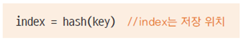

* key가 되는 객체는 객체의 유일성함의 여부를 알기 위해 equals()와 hashCode() 메서드를 재정의함


### HashMap 클래스

* Map 인터페이스를 구현한 클래스 중 가장 일반적으로 사용하는 클래스
* HashTable 클래스는 자바2 부터 제공된 클래스로 Vector 처럼 동기화를 제공함
* pair 자료를 쉽고 빠르게 관리할 수 있음

HashMap 클래스를 가장 많이 사용한다.

집어넣을 때에는 put, 가져올 때는 get


collection 패키지 밑에 hashmap 패키지 생성

collection 패키지에 있는 Member.java 파일 복사 => hashmap 패키지에 붙여넣기


Member.java

```java
package collection.hashmap;

public class Member {
	private int memberId;
	private String memberName;
	
	public Member() {}
	public Member(int memberId, String memberName) {
		this.memberId = memberId;
		this.memberName = memberName;
	}
	public int getMemberId() {
		return memberId;
	}
	public void setMemberId(int memberId) {
		this.memberId = memberId;
	}
	public String getMemberName() {
		return memberName;
	}
	public void setMemberName(String memberName) {
		this.memberName = memberName;
	}
	
	public String toString() {
		return memberName + "회원님의 아이디는 " + memberId + "입니다.";
	}
}
```


MemberHashMap 클래스 생성

MemberHashMap.java

```java
package collection.hashmap;

import java.util.HashMap;
import java.util.Iterator;

public class MemberHashMap {
	private HashMap<Integer, Member> hashMap;
	
	public MemberHashMap() {
		hashMap = new HashMap<Integer, Member>();
	}
	
	public void addMember(Member member) {
		hashMap.put(member.getMemberId(), member);
	}
	
	public boolean removeMember(int memberId) {
		if(hashMap.containsKey(memberId)) {
			hashMap.remove(memberId);
			return true;
		}
		System.out.println("회원 번호가 없습니다.");
		return false;
	}
	
	public void showAllMember() {
		Iterator<Integer> ir = hashMap.keySet().iterator();
		while(ir.hasNext()) {
			int key = ir.next();
			Member member = hashMap.get(key);
			System.out.println(member);
		}
		System.out.println();
	}
}
```

HashMap 사용. key는 회원 번호를 사용하고 value는 Member로 쓴다.

집어넣을 때에는 key-value pair로 넣는다.

key 값이 HashMap 안에 있는지 여부를 보는 것이 containsKey 라는 메서드가 있다.

remove 메서드를 통해 key 값으로 Member를 지울 수 있다.

하나씩 순회를 하려 하는데, 가지고 있는 key와 value를 동시에 순회할 수는 없다.

key base로 순회하던가 value base로 순회하던가 두 가지 방법이 있다.

keySet 메서드는 모든 key 객체를 반환해주는데 Set 타입으로 반환이 된다. keySet 을 하고 iterator 를 호출하면 iterator 객체가 key로 순회를 한다. hashMap.keySet().iterator()

values 라는 메서드가 있다. 모든 value를 반환해주는데 이 값은 중복될 수도 있다. 그래서 Collection으로 반환이 된다. 이 것이 가지고 있는 모든 멤버의 iterator 를 순회하면 value로 반환이 된다. hashMap.values().iterator()

key로 가져와서 순회

get 메서드에 key를 주면 Member가 반환된다.


set 패키지에 있는 MemberHashSetTest.java 파일 복사 => hashmap 패키지에 붙여넣기 => Set을 Map으로 이름 변경

MemberHashMapTest.java

```java
package collection.hashmap;

public class MemberHashMapTest {
	public static void main(String[] args) {
		MemberHashMap manager = new MemberHashMap();
		
		Member memberLee = new Member(100, "Lee");
		Member memberKim = new Member(200, "Kim");
		Member memberPark = new Member(300, "Park");
		
		manager.addMember(memberLee);
		manager.addMember(memberKim);
		manager.addMember(memberPark);
		
		manager.showAllMember();
		
		manager.removeMember(200);
		manager.showAllMember();
	}
}
```


```
Lee회원님의 아이디는 100입니다.
Kim회원님의 아이디는 200입니다.
Park회원님의 아이디는 300입니다.

Lee회원님의 아이디는 100입니다.
Park회원님의 아이디는 300입니다.
```


---

같은 key 값을 가진 것을 넣기

MemberHashMapTest.java

```java
package collection.hashmap;

public class MemberHashMapTest {
	public static void main(String[] args) {
		MemberHashMap manager = new MemberHashMap();
		
		Member memberLee = new Member(100, "Lee");
		Member memberKim = new Member(200, "Kim");
		Member memberPark = new Member(300, "Park");
		Member memberPark2 = new Member(300, "Park2");
		
		manager.addMember(memberLee);
		manager.addMember(memberKim);
		manager.addMember(memberPark);
		manager.addMember(memberPark2);
		
		manager.showAllMember();
		
		manager.removeMember(200);
		manager.showAllMember();
	}
}
```


```
Lee회원님의 아이디는 100입니다.
Kim회원님의 아이디는 200입니다.
Park2회원님의 아이디는 300입니다.

Lee회원님의 아이디는 100입니다.
Park2회원님의 아이디는 300입니다.
```

Integer에 이미 equals와 hashCode가 구현되어 있다. int value가 같으면 같은 것이라고 반환한다.


https://docs.oracle.com/javase/8/docs/api/java/util/HashMap.html


### TreeMap 클래스

* key 객체를 정렬하여 key-value를 pair로 관리하는 클래스
* key에 사용되는 클래스에 Comparable, Comparator 인터페이스를 구현
* java에 많은 클래스들은 이미 Comparable이 구현되어 있음
* 구현된 클래스를 key로 사용하는 경우는 구현할 필요 없음

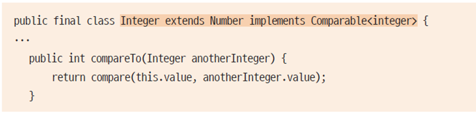

Integer 같은 경우 이미 Comparable이 구현되어 있다.


collection 패키지 밑에 treemap 패키지 생성

hashmap 패키지 밑에 있는 java 파일들을 복사 => treemap 패키지 안에 붙여넣기

Hash 대신 Tree로 이름 변경


MemberTreeMapTest.java

```java
package collection.treemap;

public class MemberTreeMapTest {
	public static void main(String[] args) {
		MemberTreeMap manager = new MemberTreeMap();
		
		Member memberLee = new Member(100, "Lee");
		Member memberKim = new Member(200, "Kim");
		Member memberPark = new Member(300, "Park");
		Member memberPark2 = new Member(400, "Park2");
		
		manager.addMember(memberPark);
		manager.addMember(memberKim);
		manager.addMember(memberLee);
		manager.addMember(memberPark2);
		
		manager.showAllMember();
		
		manager.removeMember(200);
		manager.showAllMember();
	}
}
```


MemberTreeMap.java

```java
package collection.treemap;

import java.util.TreeMap;
import java.util.Iterator;

public class MemberTreeMap {
	private TreeMap<Integer, Member> treeMap;
	
	public MemberTreeMap() {
		treeMap = new TreeMap<Integer, Member>();
	}
	
	public void addMember(Member member) {
		treeMap.put(member.getMemberId(), member);
	}
	
	public boolean removeMember(int memberId) {
		if(treeMap.containsKey(memberId)) {
			treeMap.remove(memberId);
			return true;
		}
		System.out.println("회원 번호가 없습니다.");
		return false;
	}
	
	public void showAllMember() {
		Iterator<Integer> ir = treeMap.keySet().iterator();
		while(ir.hasNext()) {
			int key = ir.next();
			Member member = treeMap.get(key);
			System.out.println(member);
		}
		System.out.println();
	}
}
```

HashMap을 TreeMap으로 변경


```
Lee회원님의 아이디는 100입니다.
Kim회원님의 아이디는 200입니다.
Park회원님의 아이디는 300입니다.
Park2회원님의 아이디는 400입니다.
```

정렬이 잘 된다. 정렬이 잘 되는 이유는 TreeMap의 key 값이 Integer이기 때문이다. 이미 Comparable이 구현되어 있다.

