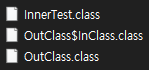
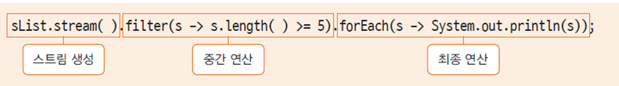
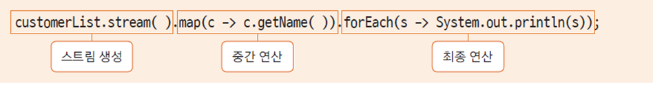
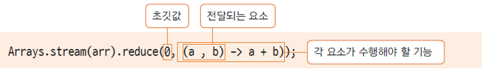

# 12. 내부 클래스, 람다식, 스트림

내부 클래스에 익명 내부 클래스가 있다.

람다식에서 익명 내부 클래스가 사용된다.

스트림에서 람다식을 쓴다.


## 내부 클래스

### 내부 클래스란?

* 클래스 내부에 구현한 클래스(중첩된 클래스)
* 클래스 내부에서 사용하기 위해 선언하고 구현하는 클래스
* 주로 외부 클래스 생성자에서 내부 클래스를 생성

내가 구현할 부분이 클래스의 내용을 가지고 있는데 외부에서 쓸 일은 없고 클래스 내부에서만 쓸 것이라면 클래스 내부에 선언할 수 있다.

외부에서 내부 클래스를 쓴다는 것은 사실 그 클래스를 외부로 빼는 것이 더 맞다.

어떤 클래스 내부에서만 사용하기 위한 클래스

익명 내부 클래스


### 내부 클래스 유형


변수와 똑같다고 보면 된다.

익명 내부 클래스를 많이 사용한다. 안드로이드 프로그래밍에서 많이 사용되는 방식


Chapter12 프로젝트 생성

src 패키지 밑에 innerclass 패키지 생성

InnerTest 클래스 생성


InnerTest.java

```java
package innerclass;

class OutClass {
	class InClass {
		
	}
}

public class InnerTest {
	public static void main(String[] args) {
		
	}
}
```

InClass는 인스턴스 내부 클래스


Chapter12\bin\innerclass



컴파일 된 상태


InnerTest.java

```java
package innerclass;

class OutClass {
	private int num = 10;
	private static int sNum = 20;
	private InClass inClass;
	
	public OutClass() {
		inClass = new InClass();		
	}
	
	class InClass {
		int iNum = 100;
		static int sInNum = 200;
	}
}

public class InnerTest {
	public static void main(String[] args) {
		
	}
}
```

InClass 타입의 변수 선언

Inner Class는 Out Class의 Constructor에서 주로 생성을 한다. Out Class가 생성이 되면서 Inner Class를 생성해서 자신이 선언한 맴버 변수에 assign을 해서 쓰는 경우가 많이 있다.

sInNum 에서 오류가 난다. Inner Class는 생성 이후에 안에 있는 것을 쓸 수 있는데 static 키워드 같은 경우는 생성과 상관 없이 쓸 수 있다. Inner Class가 static이라고 하면 문제가 되지 않는다. 이 클래스는 Out Class의 생성과 상관 없이 쓰게된다.

그냥 인스턴스 내부 클래스 같은 경우에는 Out Class 생성 이후에 생성이 되는 것이기 때문에 static 변수를 그 안에서 사용할 수 없다.


InnerTest.java

```java
package innerclass;

class OutClass {
	private int num = 10;
	private static int sNum = 20;
	private InClass inClass;
	
	public OutClass() {
		inClass = new InClass();		
	}
	
	class InClass {
		int iNum = 100;
		void inTest() {
			System.out.println(num);
			System.out.println(sNum);
		}
	}
	
	public void usingInner() {
		inClass.inTest();
	}
}

public class InnerTest {
	public static void main(String[] args) {
		OutClass outClass = new OutClass();
		outClass.usingInner();
		
		OutClass.InClass myInClass = outClass.new InClass();
		myInClass.inTest();
	}
}
```

Outer Class 안에 Inner Class가 생성되는 것이기 때문에 외부 클래스의 private 변수를 사용할 수 있다. 외부 클래스가 가지고 있는 static 변수라는 것은 이미 Outer Class의 생성과 상관없이 생성이 되어 있는 것이다. 그래서 Inner Class가 생성되고 나서 inTest 메서드가 호출 될 때에는 당연히 sNum 변수는 이미 있기 때문에 사용할 수 있다.

inClass 변수를 private로 선언했기 때문에 외부에서는 보이지 않는다.

OutClass.InClass 라고 하면 InClass를 바로 access 할 수 있다. InClass를 밖에서 직접 생성할 수도 있는데 생성하는 방법은 일단 outClass가 먼저 만들어지고, 만들어진 참조 변수를 이용해서 만들 수 있다. 많이 쓰지는 않는다. Outer Class 내부에서 쓰려고 Inner Class를 만든 것이지 밖에서 사용하기 위해 만들었다고 하면 InClass를 밖에 선언하는 것이 맞다. 문법적으로는 가능. InClass가 private라면 이런 방법은 불가능하다. Inner Class를 만들었는데 내부에서만 쓰겠다고 하면 private로 만드는 것이 맞다.


```
10
20
10
20
```


---

InnerTest.java

```java
package innerclass;

class OutClass {
	private int num = 10;
	private static int sNum = 20;
	private InClass inClass;
	
	public OutClass() {
		inClass = new InClass();		
	}
	
	class InClass {
		int iNum = 100;
		void inTest() {
			System.out.println(num);
			System.out.println(sNum);
		}
	}
	
	public void usingInner() {
		inClass.inTest();
	}
	
	static class InStaticClass {
		int inNum = 100;
		static int sInNum = 200;
		
		void inTest() {
			System.out.println(inNum);
			System.out.println(sInNum);
			System.out.println(sNum);
		}
		
		static void sTest() {
			//System.out.println(inNum);
			System.out.println(sInNum);
			System.out.println(sNum);
		}
	}
}

public class InnerTest {
	public static void main(String[] args) {
		OutClass outClass = new OutClass();
		outClass.usingInner();
		
		OutClass.InClass myInClass = outClass.new InClass();
		myInClass.inTest();
		
		System.out.println();
		
		OutClass.InStaticClass sInClass = new OutClass.InStaticClass();
		sInClass.inTest();
		OutClass.InStaticClass.sTest();
	}
}
```

static Inner Class의 특징은 Outer Class 내부에 만들기는 하지만 Outer Class가 생성 되고나서 쓰는 것이 아니다. instance Inner Class 같은 경우에는 Outer Class가 먼저 생성이 되어야 그 다음에 쓸 수 있는데 static Inner Class는 Outer Class의 생성 여부와 상관 없이 쓸 수 있다.

inTest는 static 클래스 내부의 일반 메서드이다.

static 클래스 내부에 static 메서드를 만들 수 있다.

인스턴스 내부 클래스 안에는 static 변수도, static 메서드도 만들 수 없다.

static 클래스 인 경우에는 static 변수, static 메서드 선언 가능

static 메서드에서 inNum을 쓸 수 없다. inNum은 클래스가 생성된 이후에 만들어지는 변수이기 때문에 일반 메서드에서는 쓸 수 있지만 static 메서드 에서는 쓸 수 없다.


```
10
20
10
20

100
200
20
200
20
```


---

innerclass 패키지에 LocalInnerClassTest 클래스 생성


LocalInnerClassTest.java

```java
package innerclass;

class Outer {
	
	int outNum = 100;
	static int sNum = 200;
	
	Runnable getRunnable(int i) {
		
		int num = 100;
		class MyRunnable implements Runnable {
			@Override
			public void run() {
				
				//num += 10;
				//i = 200;
				System.out.println(num);
				System.out.println(i);
				System.out.println(outNum);
				System.out.println(Outer.sNum);
			}
		}
		return new MyRunnable();
	}
}

public class LocalInnerClassTest {
	public static void main(String[] args) {
		Outer outer = new Outer();
		Runnable runnable = outer.getRunnable(50);
		
		runnable.run();
	}
}
```

Runnable 한 객체를 반환해주는 getRunnable 메서드

Runnable 인터페이스 => run 메서드를 구현해야 한다.

메서드 안에 class를 만들었다. => 지역 내부 클래스가 된다.

run 메서드가 불려질 때 밖에 있는 외부 클래스의 변수와 정적 변수를 찍을 수 있다.

매개변수가 하나 넘어왔고, 안에 지역 변수가 있다.

MyRunnable 클래스 안에서 num 값을 바꾼다. i의 값도 바꾼다.

i와 num은 지역변수이다. 지역 변수들은 메서드가 호출되서 끝날때까지만 유효하다.

MyRunnable이 반환되고 나면 run이라는 메서드는 언제든지 불릴 수 있다. getRunnable 메서드가 호출이 되서 MyRunnable 클래스가 반환되고 나면 getRunnable 메서드가 끝나고 난 다음에도 run은 언제든지 불릴 수 있다. 불렸을 때 지역 변수이기 때문에 유효하지 않다. 지역 내부 클래스가 쓰이는 메서드에서 지역 변수는 전부 상수가 되어버린다. 그 값이 안에서 바뀔 수 없다. 참조는 할 수 있지만 변경은 할 수 없다. 상수이기 때문이다. final로 만들어버린다.

메서드 안에서 inner class가 사용될 때에는 지역 변수들을 변경시킬 수 없다.


```
100
50
100
200
```


---

LocalInnerClassTest.java 파일 복사 => innerclass 패키지에 붙여넣기

AnonymousInnerClass로 이름 변경


AnonymousInnerClass.java

```java
package innerclass;

class Outer2 {
	
	int outNum = 100;
	static int sNum = 200;
	
	Runnable getRunnable(int i) {
		
		int num = 100;
		return new Runnable() {
			@Override
			public void run() {
				
				System.out.println(num);
				System.out.println(i);
				System.out.println(outNum);
				System.out.println(Outer2.sNum);
			}
		};
	}
}

public class AnonymousInnerClass {
	public static void main(String[] args) {
		Outer2 outer = new Outer2();
		Runnable runnable = outer.getRunnable(50);
		
		runnable.run();
	}
}
```

MyRunnable 이라는 이름이 필요 없다.

Runnable한 인터페이스를 바로 구현해서 run이 구현되었고, 그것을 반환했다는 의미이다.

클래스 이름이 없어졌다. 구현의 끝이라는 의미로 세미콜론을 해줘야 한다.


```
100
50
100
200
```


---

AnonymousInnerClass.java

```java
package innerclass;

class Outer2 {
	
	int outNum = 100;
	static int sNum = 200;
	
	Runnable getRunnable(int i) {
		
		int num = 100;
		return new Runnable() {
			@Override
			public void run() {
				
				System.out.println(num);
				System.out.println(i);
				System.out.println(outNum);
				System.out.println(Outer2.sNum);
			}
		};
	}
	
	Runnable runner = new Runnable() {
		
		@Override
		public void run() {
			System.out.println("test");
		}
	};
}

public class AnonymousInnerClass {
	public static void main(String[] args) {
		Outer2 outer = new Outer2();
		outer.runner.run();
		
		Runnable runnable = outer.getRunnable(50);
		
		runnable.run();
	}
}
```

Runnable runner = new 를 입력하고 Ctrl + Space 를 누르면 Anonymous Inner Type으로 생성할 것인지 물어본다. => Enter를 누르면 바로 생성된다.


```
test
100
50
100
200
```


익명 내부 클래스는 인터페이스나 추상 클래스에 대한 생성을 바로 할 수 있다.

원래 인터페이스나 추상 클래스를 생성하려고 하면 그것을 상속을 받은 클래스를 만들고 그 클래스를 생성해서 썼었다. 그렇게 안하고 단 하나의 인터페이스나 단 하나의 추상 클래스인 경우에는 클래스 이름 없이 바로 new 키워드를 이용해서 생성을 할 수 있다. 추상 클래스나 인터페이스 타입으로 생성을 한다. 익명 내부 클래스

변수에 대한 부분도 마찬가지이다. 이렇게 만들었을 때 매개변수로 넘어온 값들은 상수화된다. num += 10; 을 하면 오류가 난다.


## 람다식(Lambda Expression)

### 람다식이란?

* 자바에서 함수형 프로그래밍(functional programming)을 구현하는 방식
* 클래스를 생성하지 않고 함수의 호출만으로 기능을 수행
* 함수형 인터페이스를 선언함
* 자바8 부터 지원되는 기능

함수형 프로그래밍의 특징은 함수 기반의 프로그래밍을 하는데, 매개 변수를 받아서 매개 변수를 이용해서 프로그래밍을 하게 되면 외부 변수들을 사용하지 않는다. 순수 함수형 프로그래밍이라고 한다. 순수 함수들은 외부 변수를 사용하지 않기 때문에 외부에 부수적인 영향을 주지 않는다. 이 함수가 돌아감으로써 다른 변수값이 변한다거나 하는 일이 일어나지 않기 때문에 병렬 처리가 가능해진다.

자바8 부터 람다식을 이용해서 함수형 프로그래밍 방식을 제공하고 있다.

자바는 객체지향 프로그래밍이다. 객체가 없이 메서드를 호출하거나 기능을 수행하는 것은 쉽지 않다.

클래스를 생성하지 않고 함수 호출 만으로 수행할 수 있도록, 매개 변수와 함수의 구현만으로 수행할 수 있는 기능을 제공한다.

내부적으로는 익명 객체가 생성이 된다.


### 함수형 프로그래밍이란?

* 순수 함수(pure function)을 구현하고 호출
* 매개 변수만을 사용하도록 만든 함수로 외부 자료에 부수적인 영향(side effect)이 발생하지 않도록 함
* 입력 받은 자료를 기반으로 수행되고 외부에 영향을 미치지 않으므로 병렬처리 등에 가능 안정적인 확장성이 있는 프로그래밍 방식

순수 함수는 외부 변수를 사용하지 않고 매개 변수만을 이용해서 구현하는 기능이다.

똑같은 자료를 입력하면 항상 수행 결과가 똑같다.


### 람다식 문법

* 매개 변수 하나인 경우 괄호 생략 가능 (두 개인 경우는 괄호를 생략할 수 없음)

  ```java
  str -> {System.out.println(str);}
  ```

* 중괄호 안의 구현부가 한 문장인 경우 중괄호 생략

  ```java
  str -> System.out.println(str);
  ```

* 중괄호 안의 구현부가 한 문장이라도 return 문은 중괄호를 생략할 수 없음

  ```java
  str -> return str.length();  // Error
  ```

* 중괄호 안의 구현부가 반환문 하나라면 return과 중괄호를 모두 생략할 수 있음

  ```java
  (x, y) -> x + y		// 두 값을 더하여 반환
  str -> str.length()	// 문자열 길이를 반환
  ```

  

메서드 이름이 없다. 익명 함수

화살표 operator


lambda 패키지 생성

MyMaxNumber 인터페이스 생성

MyMaxNumber.java

```java
package lambda;

@FunctionalInterface
public interface MyMaxNumber {
	int getMaxNumber(int x, int y);
}
```

메서드를 선언하기 위해서 인터페이스를 사용한다.

@FunctionalInterface 애노테이션을 쓰면 이 인터페이스가 함수형 인터페이스, 람다식을 위한 인터페이스라는 의미이다.

함수형 인터페이스를 선언하고 메서드를 선언했다. 함수형 인터페이스 같은 경우에는 메서드를 두 개 이상 선언할 수 없다. 어느 함수가 호출되는지 알 수 없다.

함수형 인터페이스라고 선언이 되면(@FunctionalInterface 애노테이션을 쓰면) 메서드 하나만 선언해야 한다.


TestMyNumber 클래스 생성

TestMyNumber.java

```java
package lambda;

public class TestMyNumber {
	public static void main(String[] args) {
		MyMaxNumber max = (x, y) -> (x >= y) ? x : y;
		System.out.println(max.getMaxNumber(10, 20));
	}
}
```

x, y 두 개의 매개 변수가 넘어온다.

MyMaxNumber 인터페이스에 있는 메서드가 호출

MyMaxNumber에 max라는 이름으로 구현된 것은 두 개의 매개 변수가 넘어 왔을 때 그 중에서 더 큰 것을 반환해 주라는 것이다.


```
20
```

함수형 인터페이스를 통해서 구현할 메서드를 선언하고, 그 메서드를 구현해서 바로 호출. 람다식 이용


---

두 개의 String이 넘어오면 두 String을 연결

전통적인 방식으로 클래스를 생성하고 거기서 메서드를 호출하는 방식과 람다식 이용 방식 비교


StringConcat 인터페이스 생성

StringConcat.java

```java
package lambda;

@FunctionalInterface
public interface StringConcat {
	public void makeString(String s1, String s2);
}

```


StringConImpl 클래스 생성

StringConImpl.java

```java
package lambda;

public class StringConImpl implements StringConcat {
	@Override
	public void makeString(String s1, String s2) {
		System.out.println(s1 + "," + s2);
	}
}
```


TestStringConcat 클래스 생성

TestStringConcat.java

```java
package lambda;

public class TestStringConcat {
	public static void main(String[] args) {
		StringConImpl imp1 = new StringConImpl();
		imp1.makeString("hello", "world");
		
		StringConcat concat = (s, v) -> System.out.println(s + "," + v);
		concat.makeString("hello", "world");
		
		StringConcat concat2 = new StringConcat() {
			
			@Override
			public void makeString(String s1, String s2) {
				System.out.println(s1 + "," + s2);
			}
		};
		
		concat2.makeString("hello", "world");
	}
}
```


```
hello,world
hello,world
hello,world
```


자바는 객체지향 프로그래밍이고 객체 base가 아니면 돌아갈 수 없는데 어떻게 돌아가는가?

StringConcat concat2 = new 를 입력하고 Ctrl + Space를 누르면 Anonymous Inner Class를 만들 수 있다.

람다식으로 구현하지만 나중에 내부에 익명 객체가 생성이 된다.

익명 내부 클래스가 람다식에서 내부적으로 사용이 된다.

기존에 인터페이스를 구현하는 과정을 생략하고 조금 더 함수 base로 돌아가는 프로그래밍을 할 수 있다는 것이 람다식의 특징이다.

자바스크립트에서는 함수가 마치 변수처럼 쓰인다. first class. 함수가 변수랑 다른 점이 별로 없다. 함수가 변수에 대입도 된다.


### 함수형 인터페이스

* 람다식을 선언하기 위한 인터페이스
* 익명 함수와 매개 변수만으로 구현되므로 단 하나의 메서드만을 선언해야 함 (두 개 이상의 메서드가 선언되면 어느 메서드의 호출인지 모호해 짐)
* @FunctionalInterface 애노테이션 사용


### 함수를 변수처럼 사용하는 람다식

* 프로그램에서 변수는...

  ```java
  int a;					// 자료형에 기반하여 선언하고
  int add(int x, int y);	// 매개변수로 전달하고
  return num;				// 매서드의 반환 값으로 사용
  ```

* 람다식은 프로그램 내에서 변수처럼 사용할 수 있음

프로그램 내에서 변수가 사용되는 경우는 크게 세 가지 경우로 볼 수 있다.

함수의 구현 부분인데 변수에 대입이 되었다. 변수에 대입되어서 사용되는 부분들이 있을 수 있다.

매개 변수로 넘어갈 수도 있고 반환값으로도 쓰일 수 있다.


TestLambda 클래스 생성

TestLambda.java

```java
package lambda;

interface PrintString {
	void showString(String str);
}

public class TestLambda {
	public static void main(String[] args) {
		PrintString lambdaStr = s -> System.out.println(s);
		lambdaStr.showString("Test1");
		
		showMyString(lambdaStr);
		
		PrintString test = returnString();
		test.showString("Test3");
	}
	
	public static void showMyString(PrintString p) {
		p.showString("Test2");
	}
	
	public static PrintString returnString() {
		return s -> System.out.println(s + "!!!");
	}
}
```

함수의 구현부가 변수 타입으로 바로 대입이 되었다. 어떤 변수가 다른 변수에 대입되는 것처럼 함수의 구현부가 바로 변수에 대입된다.

매개변수로 전달

PrintString 타입의 데이터 반환해주는 returnString 메서드. 람다식 자체가 반환된다.

함수의 구현부가 마치 변수처럼 반환이 되어서 변수값에 대입이 되고 메서드가 호출될 수 있다.


```
Test1
Test2
Test3!!!
```


함수형 프로그래밍은 객체지향 프로그래밍과는 많이 다른점이 있다. 자바에서 이 기술을 도입한 것은 그만큼 앞으로 트렌드가 함수형 프로그래밍 방식으로 많이 돌아가고 있고 자바도 이 기술을 도입해야 하는 부분이 있어서 추가되었다.


## 스트림(Stream)

### 스트림

* 자료의 대상과 관계없이 동일한 연산을 수행할 수 있는 기능 (자료의 추상화)
* 배열, 컬렉션에 동일한 연산이 수행되어 일관성 있는 처리 가능
* 한번 생성하고 사용한 스트림은 재사용할 수 없음
* 스트림 연산은 기존 자료를 변경하지 않음
* 중간 연산과 최종 연산으로 구분됨
* 최종 연산이 수행되어야 모든 연산이 적용되는 지연 연산

여기서 말하는 스트림과 나중에 자바 IO에서 말하는 스트림은 전혀 다르다.

여기서 얘기하는 스트림은 자료의 연산을 위해서 사용하는 객체를 얘기한다.

자바 IO에 대해서 얘기할 때 스트림이라는 용어가 쓰인다. 입출력을 위한 스트림

자료들에 대해서 어떤 연산을 수행한다고 했을 때 연산의 방식이 자료마다 매번 바뀌면 그 자료에 해당되는 연산의 방식을 또 배워야하고 그에 따라 코딩을 해야하는 번거로움이 있다.

그게 아니고 자료가 있고 그 자료의 연산을 추상화했다고 얘기하는데 동일한 연산을 수행할 수 있도록 하는 기능이 스트림이다.

주로 배열과 컬랙션에 많이 사용된다. 똑같은 연산을 수행하면 원하는 결과를 얻을 수 있는 방법을 스트림이라는 객체가 제공한다.

스트림을 사용하려면 배열이나 컬랙션에 대해서 스트림 객체를 생성해야 한다.

배열이 있고 배열에 대해서 스트림 객체를 생성해서 연산을 한다고 할때는 그 배열을 직접 건드리지는 않는다. 다른 메모리에서 연산이 이루어진다. 원래 자료를 건드리지 않는다.

연산이 중간 연산과 최종 연산으로 구분된다.

중간 연산은 어떤 조건에 맞는 요소를 추출하거나 변환하는 것

최종 연산은 그것의 결과를 출력하거나 합, 평균을 구해 결과를 딱 볼 수 있는 것

스트림의 연산을 계속 이어할 수 있다. 최종 연산은 마지막에 한 번만 한다. 결과는 최종 연산이 수행되어야 볼 수 있다. 지연 연산


### 스트림 연산 - 중간 연산

* 중간 연산 - filter(), map()
* 조건에 맞는 요소를 추출 (filter()) 하거나 요소를 변환함 (map())
* 문자열의 길이가 5 이상인 요소만 출력하기



* 고객 클래스에서 고객 이름만 가져오기



람다식이 사용된다.

forEach는 최종 연산이다.

연산이 쭉 이어져서 코딩을 하게 된다.

스트림에서 연산에 대한 구현부는 람다식이 쓰인다.


### 스트림 연산 - 최종 연산

* 스트림의 자료를 소모하면서 연산을 수행
* 최종 연산 후에 스트림은 더 이상 다른 연산을 적용할 수 없음
  * forEach() : 요소를 하나씩 꺼내옴
  * count() : 요소의 개수
  * sum() : 요소의 합
* 이 외에도 여러가지 최종연산이 있음

하나씩 자료를 꺼내서 연산이 적용된다.

한번 생성해서 소모한 스트림은 또 사용할수는 없다.

새로운 연산을 하고 싶으면 스트림을 다시 생성해야 한다.


stream 패키지 생성

IntArrayTest 클래스 생성


IntArrayTest.java

```java
package stream;

import java.util.Arrays;

public class IntArrayTest {
	public static void main(String[] args) {
		int[] arr = {1,2,3,4,5};
		
		int sum = Arrays.stream(arr).sum();
		int count = (int)Arrays.stream(arr).count();
		
		System.out.println(sum);
		System.out.println(count);
	}
}
```

Array에서 stream을 만드는 방법은 Arrays.stream을 하면 Array를 활용해서 스트림 객체를 만드는 함수가 static으로 많이 있다.


```
15
5
```


---

ArrayListStreamTest 클래스 생성


ArrayListStreamTest.java

```java
package stream;

import java.util.ArrayList;
import java.util.List;
import java.util.stream.Stream;

public class ArrayListStreamTest {
	public static void main(String[] args) {
		List<String> sList = new ArrayList<String>();
		sList.add("Tomas");
		sList.add("Edward");
		sList.add("Jack");
		
		Stream<String> stream = sList.stream();
		stream.forEach(s -> System.out.print(s + " "));
		System.out.println();
		
		sList.stream().sorted().forEach(s -> System.out.print(s + " "));
		System.out.println();
		sList.stream().map(s -> s.length()).forEach(n -> System.out.println(n));
	}
}
```

스트림을 컬랙션으로부터 만들 때에는 stream 이라는 메서드를 가지고 스트림 객체를 만들 수 있다.

배열인 경우에는 Arrays.stream() 해서 괄호 안에 배열의 종류를 넣을 수 있다.

컬랙션 같은 경우에는 stream이라는 메서드를 바로 사용하면 된다.

어떤 일을 할 것인지는 람다식으로 표현. 고객의 이름을 하나씩 출력

출력을 하는데 sorting 해서 하고싶은 경우 스트림을 새로 만든다. 중간 연산 추가

정렬한 다음 하나씩 출력하는 최종 연산 수행

String은 Comparable이 구현되었기 때문에 그것에 의해 sorting이 된다.

만약 해당 자료가 Comparable이 구현되어 있지 않다면 직접 구현해줘야 한다.

각 이름에 대한 길이를 알고 싶은 경우


```
Tomas Edward Jack 
Edward Jack Tomas 
5
6
4
```


### reduce() 연산

* 정의된 연산이 아닌 프로그래머가 직접 지정하는 연산을 적용
* 최종 연산으로 스트림의 요소를 소모하여 연산 수행
* 배열의 모든 요소의 합을 구하는 reduce() 연산



* 두 번째 요소로 전달되는 람다식에 따라 다양한 기능을 수행


중간 연산이나 최종 연산은 이미 정의된 연산이다.

우리가 프로그래밍 하면서 직접 지정해야 하는 연산들이 있다. 그것을 적용하고 싶으면 reduce라는 연산을 이용해서 초기값을 주고 어떤 매개 변수가 전달되어서 어떤 수행을 할 것인지 직접 구현하면 된다.

원래 구현되어있는 연산을 가져다 쓰는 것이 아니라 연산을 직접 구현을 하는 것이다.

간단하면 직접 구현하면 되고, 복잡하면 binary operator를 구현한 클래스를 넣으면 된다.

여기서는 두 개의 배열 요소가 전달되면 그것을 계속 더한다. 전체 배열의 요소를 더하는 것이다.


IntArrayTest.java

```java
package stream;

import java.util.Arrays;

public class IntArrayTest {
	public static void main(String[] args) {
		int[] arr = {1,2,3,4,5};
		
		int sum = Arrays.stream(arr).sum();
		int count = (int)Arrays.stream(arr).count();
		
		System.out.println(sum);
		System.out.println(count);
		
		System.out.println(Arrays.stream(arr).reduce(0, (a, b) -> a + b));
	}
}
```

처음 초기값은 0

1부터 5까지 전체를 다 더한다.


```
15
5
15
```

직접 연산을 정의할 수 있다.


---

ReduceTest 클래스 생성


ReduceTest.java

```java
package stream;

import java.util.Arrays;
import java.util.function.BinaryOperator;

class CompareString implements BinaryOperator<String> {
	@Override
	public String apply(String s1, String s2) {
		if(s1.getBytes().length >= s2.getBytes().length)
			return s1;
		else return s2;
	}
}

public class ReduceTest {
	public static void main(String[] args) {
		String[] greetings = {"안녕하세요~~~", "hello", "Good morning", "반갑습니다"};
		
		System.out.println(Arrays.stream(greetings).reduce("", (s1, s2) -> {
			if(s1.getBytes().length >= s2.getBytes().length)
				return s1;
			else return s2;
		}));
		
		System.out.println(Arrays.stream(greetings).reduce(new CompareString()).get());
	}
}
```

length가 가장 긴 것을 출력

s1과 s2를 비교해서 가장 긴 것을 선택

BinaryOperator\<String> 인터페이스를 구현한 CompareString 객체를 생성하고, 람다식이 들어갈 자리에 이 객체를 넣는다.


```
안녕하세요~~~
안녕하세요~~~
```

