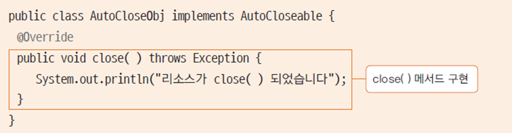
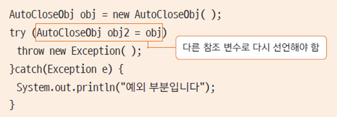

# 13. 예외 처리

## 예외와 예외 처리

### 오류란 무엇인가?

* 컴파일 오류 : 프로그램 코드 작성 중 발생하는 문법적 오류
* 실행 오류 : 실행 중인 프로그램이 의도 하지 않은 동작을 하거나(bug) 프로그램이 중지되는 오류(runtime error)
* 자바는 예외 처리를 통하여 프로그램의 비정상 종료를 막고 log를 남길 수 있음

자바는 굉장히 안정적인 언어 중 하나이다.

예외 처리를 하면서 가장 중요한 것 중에 하나는 log를 굉장히 상세하게 남겨야 한다. 그 log를 보고 추후에 버그를 잡을 수 있어야 한다.


### 오류와 예외 클래스

* 시스템 오류(Error)
  * 가상 머신에서 발생
  * 프로그래머가 처리 할 수 없음
  * 동적 메모리를 다 사용한 경우, stack overflow 등
* 예외(Exception)
  * 프로그램에서 제어 할 수 있는 오류
  * 읽으려는 파일이 없는 경우, 네트워크나 소켓 연결 오류 등
  * 자바 프로그램에서는 예외에 대한 처리를 수행함


### 예외 클래스

* 모든 예외 클래스의 최상위 클래스는 Exception 클래스


Exception 클래스 하위에 클래스들이 있다. 굉장히 클래스가 많다.

IO 부분이 예외 처리를 무조건 해야하는 부분이다.


### try-catch 문으로 예외 처리하기

```java
try {
    // 예외가 발생할 수 있는 코드 부분
} catch(처리할 예외 타입 e) {
    // try블록 안에서 예외가 발생했을 때 수행되는 부분
}
```

try 부분이 실제적으로 구현하는 문장이다.

예외가 발생하면 아래 문장을 수행하지 않고 바로 catch로 간다.

try에서 발생한 예외가 type에 match가 되면 그 블럭 안으로 들어간다.


### try-catch-finally 문으로 예외 처리하기

```java
try {
    // 예외가 발생할 수 있는 코드 부분
} catch(처리할 예외 타입 e) {
    // try블록 안에서 예외가 발생했을 때 수행되는 부분
} finally {
    // 예외 발생 여부와 상관 없이 항상 수행되는 부분
    // 리소스를 정리하는 코드를 주로 씀
}
```

리소스를 열었을 경우 그 리소스를 해제해야하는데 대부분 finally 블럭에서 한다.


Chapter13 프로젝트 생성, src 패키지 밑에 exception 패키지 생성

ArrayExceptionTest 클래스 생성

ArrayExceptionTest.java

```java
package exception;

public class ArrayExceptionTest {
	public static void main(String[] args) {
		int[] arr = new int[5];
		for(int i = 0; i <= 5; i++) {
			System.out.println(arr[i]);
		}
	}
}
```


```
0
0
0
0
0
Exception in thread "main" java.lang.ArrayIndexOutOfBoundsException: 5
	at exception.ArrayExceptionTest.main(ArrayExceptionTest.java:7)
```

프로그램이 다운되었다. ArrayIndexOutOfBoundsException이 발생했다.


---

ArrayExceptionTest.java

```java
package exception;

public class ArrayExceptionTest {
	public static void main(String[] args) {
		int[] arr = new int[5];
		
		try {
			for(int i = 0; i <= 5; i++) {
				System.out.println(arr[i]);
			}			
		} catch(ArrayIndexOutOfBoundsException e) {
			System.out.println(e);
			System.out.println("예외처리");
		}
		System.out.println("프로그램 종료");
	}
}
```


```
0
0
0
0
0
java.lang.ArrayIndexOutOfBoundsException: 5
예외처리
프로그램 종료
```

프로그램이 다운된 것이 아니다. 수행되다가 5번째 예외가 발생해서 catch 블럭으로 들어가서 처리되고 끝났다.

이 때는 서버가 죽지 않고 예외만 남기고 계속 돌게된다.

https://docs.oracle.com/javase/8/docs/api/java/lang/Exception.html

Throwable 밑에 Exception 부분만 handling 한다.

Exception 클래스 아래에 보면 하위에 많은 Exception 이 있다.

RuntimeException은 실행중에 발생하는 예외들이다.

Exception 에 IOException 이 있다.

Exception 이 굉장히 많은데 외울 필요는 없다.

NullPointerException이나 ArrayIndexOutOfBoundsException 같은 경우는 eclipse가 잡아주지 않는다. 이런 것들은 컴파일러에서 detection이 안되는 부분이므로 직접 써야한다. 주로 RuntimeException에 많다.


---

FileInputStream을 예로 Test

ExceptionTest 클래스 생성

ExceptionTest.java

```java
package exception;

import java.io.FileInputStream;
import java.io.FileNotFoundException;

public class ExceptionTest {
	public static void main(String[] args) {
		FileInputStream fis = null;
		
		try {
			fis = new FileInputStream("a.txt");
		} catch (FileNotFoundException e) {
			System.out.println(e);
			return;
		} finally {
			try {
				fis.close();
				System.out.println("finally");
			} catch (Exception e) {
				System.out.println(e);
			}
		}
		System.out.println("end");
	}
}
```

a.txt를 open하려는데 파일이 없을수도 있다. 그 때 FileNotFoundException이 발생한다.

```
java.io.FileNotFoundException: a.txt (지정된 파일을 찾을 수 없습니다)
java.lang.NullPointerException
```

a.txt 파일이 없으므로 FileNotFoundException이 떨어진다.

Stream을 열었으면 반드시 닫아줘야한다. close를 해야한다.

finally 블럭에서 close 한다. close 하는데에도 Exception이 발생할 수 있기 때문에 try/catch문으로 감싼다.

finally는 try가 일단 되면 무조건 수행이 된다.

open 하고 close 할 때 null인 상태에서 open이 안 되고 close 하면 NullPointerException이 떨어진다. 일단 Exception으로 처리

return과 상관없이 finally는 항상 수행된다.

catch 블럭 안에서 return을 했기 때문에 end가 출력되지 않았다. catch 블럭 안에 return을 주석 처리 하면 end까지 나온다.


---

Chapter13 프로젝트에 a.txt 파일 생성

```
finally
end
```


try-catch-finally 문이 가장 많이 쓰이기는 하는데 close를 하려고 하니 finally를 써야하고 리소스를 해체할 때 지저분해진다.


### try-with-resources 문

* 리소스를 자동으로 해제하도록 제공해주는 구문
* 해당 리소스가 AutoCloseable을 구현한 경우 close()를 명시적으로 호출하지 않아도 try{} 블록에서 오픈된 리소스를 정상적인 경우나 예외가 발생한 경우 모두 자동으로 close()가 호출됨
* 자바7 부터 제공됨
* FileInputStream 의 경우 AutoCloseable을 구현하고 있음


AutoCloseable 인터페이스


ExceptionTest.java

```java
package exception;

import java.io.FileInputStream;
import java.io.FileNotFoundException;
import java.io.IOException;

public class ExceptionTest {
	public static void main(String[] args) {

		try(FileInputStream fis = new FileInputStream("a.txt")) {
			
		} catch (FileNotFoundException e) {
			System.out.println(e);
		} catch (IOException e) {
			System.out.println(e);
		}
	}
}
```

try 안에 직접 선언한다.

Exception 2개 처리. FileNotFoundException과 IOException

자동으로 close가 되기 때문에 IOException 을 처리해야 한다.


### AutoCloseable 인터페이스 사용하기

* AutoCloseable 인터페이스를 구현한 클래스를 만들고 close()가 잘 호출되는지 확인해본다.




AutoCloseObj 클래스 생성

AutoCloseObj.java

```java
package exception;

public class AutoCloseObj implements AutoCloseable {
	
	@Override
	public void close() throws Exception {
		System.out.println("close()가 호출되었습니다.");
	}
}
```

implements AutoCloseable => close 메서드 구현


AutoCloseTest 클래스 생성

AutoCloseTest.java

```java
package exception;

public class AutoCloseTest {
	public static void main(String[] args) {
		try(AutoCloseObj obj = new AutoCloseObj()) {
			
		} catch(Exception e) {
			
		}
	}
}
```


```
close()가 호출되었습니다.
```

close()가 자동으로 호출된다.


---

강제로 예외를 발생시킨다.

AutoCloseTest.java

```java
package exception;

public class AutoCloseTest {
	public static void main(String[] args) {
		try(AutoCloseObj obj = new AutoCloseObj()) {
			throw new Exception();
		} catch(Exception e) {
			System.out.println(e);
		}
	}
}
```


```
close()가 호출되었습니다.
java.lang.Exception
```


### 향상된 try-with-resources 문

* 자바9에서 제공되는 구문
* 자바9 이전



* 자바9 이후


## 다양한 예외 처리

### 예외 처리 미루기

* throws를 사용하여 예외처리 미루기
* try{} 블록으로 예외를 처리하지 않고, 메서드 선언부에 throws를 추가
* 예외가 발생한 메서드에서 예외 처리를 하지 않고 이 메서드를 호출한 곳에서 예외 처리를 한다는 의미
* main()에서 throws를 사용하면 가상머신에서 처리됨

throws를 하게되면 여기서 예외처리를 하지 않고 미루겠다는 것이다.


### 다중 예외 처리하기

* 하나의 try{} 블록에서 여러 예외가 발생하는 경우 catch{} 블록 한곳에서 처리하거나 여러 catch{} 블록으로 나누어 처리할 수 있음
* 가장 최상위 클래스인 Exception 클래스는 가장 마지막 블록에 위치해야 함


ThrowsException.java

```java
package exception;

import java.io.FileInputStream;
import java.io.FileNotFoundException;

public class ThrowsException {
	
	public Class loadClass(String fileName, String className) throws FileNotFoundException, ClassNotFoundException {
		FileInputStream fis = new FileInputStream(fileName);
		Class c = Class.forName(className);
		return c;
	}
	
	public static void main(String[] args) {
		ThrowsException test = new ThrowsException();
		try {
			test.loadClass("b.txt", "java.lang.string");
		} catch (FileNotFoundException e) {
			System.out.println(e);
		} catch (ClassNotFoundException e) {
			System.out.println(e);
		}
	}
}
```

FileNotFoundException과 ClassNotFoundException이 발생할 수 있다. => throws

loadClass에서 handle이 안됐으니 어떻게 처리할 것인가 => main에서 throws를 하면 JVM으로 넘어간다. try-catch를 걸어야 한다.

Exception의 개수만큼 try-catch 구문이 걸린다.

b.txt가 없으므로 FileNotFoundException이 떨어진다.

throws를 통해 미루는 예외는 그것을 사용하는 쪽에서 처리를 해줘야 한다.

어디서 하는것이 더 좋은지는 상황에 맞춰서 하면 된다.


```
java.io.FileNotFoundException: b.txt (지정된 파일을 찾을 수 없습니다)
```


b.txt 대신 a.txt로 변경

```
java.lang.ClassNotFoundException: java.lang.string
```


---

ThrowsException.java

```java
package exception;

import java.io.FileInputStream;
import java.io.FileNotFoundException;

public class ThrowsException {
	
	public Class loadClass(String fileName, String className) throws FileNotFoundException, ClassNotFoundException {
		FileInputStream fis = new FileInputStream(fileName);
		Class c = Class.forName(className);
		return c;
	}
	
	public static void main(String[] args) {
		ThrowsException test = new ThrowsException();
		try {
			test.loadClass("a.txt", "java.lang.String");
		} catch (FileNotFoundException e) {
			System.out.println(e);
		} catch (ClassNotFoundException e) {
			System.out.println(e);
		}
		System.out.println("end");
	}
}
```


```
end
```


---
ThrowsException.java

```java
...
		try {
			test.loadClass("b.txt", "java.lang.string");
		} catch (FileNotFoundException | ClassNotFoundException e) {
			System.out.println(e);
		}
...
```

try-multi-catch


---
ThrowsException.java

```java
...
		try {
			test.loadClass("a.txt", "java.lang.String");
		} catch (FileNotFoundException e) {
			System.out.println(e);
		} catch (ClassNotFoundException e) {
			System.out.println(e);
		} catch (Exception e) {
			System.out.println(e);
		}
...
```

default exception

그 외에 다른 Exception을 처리한다. Exception은 최상위 Exception이기 때문에 모든 Exception은 이쪽으로 upcasting이 된다. 절대 앞에 걸면 안된다.


### 사용자 정의 예외

* JDK에서 제공되는 예외 클래스 외에 사용자가 필요에 의해 예외 클래스를 정의하여 사용
* 기존 JDK 클래스에서 상속받아 예외 클래스 생성


* throw 키워드로 예외를 발생시킴


### 코딩해보기

* 매개변수로 전달된 아이디가 null 이거나 8이하 20자 이상인 경우 예외를 발생 시키는 예외 클래스를 직접 만들고 예외를 발생해보세요

이런 예외는 JDK에서 제공하지 않는다. 직접 예외를 만들어야 한다.


IDFormatException.java

```java
package exception;

public class IDFormatException extends Exception {
	public IDFormatException(String message) {
		super(message);
	}
}
```

Exception을 상속받는다. 조금 세부적으로 더 근접한 Exception을 받으면 좋다. 잘 모르겠다면 Exception에서 받으면 된다.

Exception에 대한 message를 받을 것이다. 상위 Exception에 보면 있다.

생성자에 message를 넣는다.


IDFormatTest.java

```java
package exception;

public class IDFormatTest {
	
	private String userID;
	
	public String getUserID() {
		return userID;
	}

	public void setUserID(String userID) throws IDFormatException {
		if(userID == null) {
			throw new IDFormatException("아이디는 null일 수 없습니다.");
		}
		else if(userID.length() < 8 || userID.length() > 20) {
			throw new IDFormatException("아이디는 8자 이상 20자 이하로 쓰세요.");
		}
		this.userID = userID;
	}

	public static void main(String[] args) {
		IDFormatTest idTest = new IDFormatTest();
		
		String myId = null;	
		try {
			idTest.setUserID(myId);
		} catch (IDFormatException e) {
			System.out.println(e);
		}
		
		myId = "123456";
		try {
			idTest.setUserID(myId);
		} catch (IDFormatException e) {
			System.out.println(e);
		}
	}
}
```

String 타입 userID 필드 생성

getter, setter

setUserID를 할 때 예외를 처리해야한다.

throws는 미루는 것이고 throw는 실제로 Exception을 발생시키는 것이다.

throws로 사용하는 쪽에서 처리하라고 설정한다.


```
exception.IDFormatException: 아이디는 null일 수 없습니다.
exception.IDFormatException: 아이디는 8자 이상 20자 이하로 쓰세요.
```

Exception의 이름은 `패키지_이름.Exception_이름`이다.

사용자 정의 Exception

