# 14. 자바 입출력

입력과 출력을 하는데에는 스트림이라는 것을 사용한다.

이전에 얘기했던 스트림과 입출력 스트림은 다르다.

입출력에 사용되는 스트림은 장치와 상관없이 자바의 입출력을 추상화 해 놓은 스트림이다.


## 자바 입출력 스트림

### 입출력 스트림이란?

* 네트워크에서 자료의 흐름이 물과 같다는 의미에서 유래
* 다양한 입출력 장치에 독립적으로 일관성있는 입출력 방식 제공

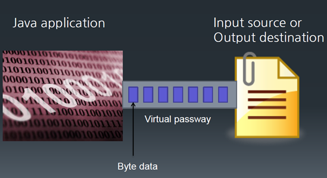

* 입출력이 구현되는 곳에서는 모두 I/O 스트림을 사용
  * 키보드, 파일 디스크, 메모리 등

입출력이라는 것은 장치가 뭔지에 따라 해당되는 기능들이 여러가지로 구현될 수 있는데, 그것들을 추상화해서 가상 경로가 있다고 생각을 하고 입력과 출력이 이루어진다.

I/O 스트림을 사용하지 않고 읽어들이거나 쓸 수는 없다.


### 입출력 스트림 구분

* I/O 대상 기준
  * 입력 스트림
  * 출력 스트림
* 자료의 종류
  * 바이트 스트림
  * 문자 스트림
* 스트림의 기능
  * 기반 스트림
  * 보조 스트림

입출력 스트림을 봤을 때 크게 3가지로 구별해서 생각할 수 있다.

하나의 스트림은 입력 아니면 출력이다. 입출력을 동시에 할 수 있는 스트림은 없다.

어떤 스트림이 하나 있으면 그 스트림은 입력 스트림 아니면 출력 스트림이다.

자료의 종류 기반에서 보면 문자를 워낙 많이 쓰기 때문에 문자 기반 스트림은 따로 만들어두었다. 동영상이나 음악 파일 같은 것들은 한 바이트씩 쓰인다. 문자 같은 경우는 multi-byte로 쓰인다.

기능적으로 구분을 할 수 있다. base가 되는 기반 스트림과 기능을 보조해주는 보조 스트림으로 나눌 수 있다. 자바의 I/O는 디자인 패턴 중에 데코레이터 패턴으로 구현이 되어있다. 보조 스트림들은 읽거나 쓰는 기능은 없다. 읽거나 쓰는 기능은 기반 스트림만 가지고 있다. 보조 스트림이 가지게 되는 것은 기반 스트림을 서포트해주는 기능을 추가한다. 바이트로 읽은 것을 문자로 변경하거나 버퍼링 기능을 제공, 직렬화 등을 보조 스트림이 제공.


### 입력 스트림과 출력 스트림

* 입력 스트림 : 대상으로부터 자료를 읽어 들이는 스트림
* 출력 스트림 : 대상으로 자료를 출력하는 스트림

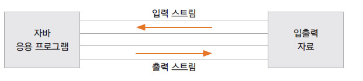

* 스트림의 예

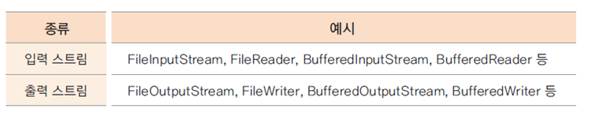

InputStream, OutputStream 이 붙은 것은 바이트 단위

Reader, Writer로 붙은 것은 문자

Buffered는 버퍼링 기능을 제공하는 보조 스트림


### 바이트 단위 스트림과 문자 단위 스트림

* 바이트 단위 스트림 : 바이트 단위로 자료를 읽고 씀 (동영상, 음악 파일 등)
* 문자 단위 스트림 : 문자는 2바이트씩 처리해야 함

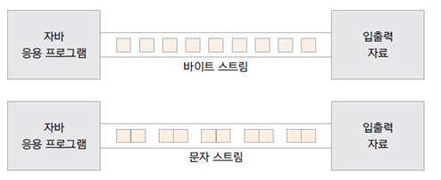

* 스트림의 예

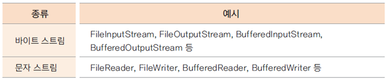

바이트 스트림은 Stream이 붙고, 문자 스트림은 Reader, Writer가 붙는다.


### 기반 스트림과 보조 스트림

* 기반 스트림
  * 대상에 직접 자료를 읽고 쓰는 기능의 스트림
* 보조 스트림
  * 직접 읽고 쓰는 기능은 없고 추가적인 기능을 제공해 주는 스트림
  * 기반 스트림이나 또 다른 보조 스트림을 생성자의 매개변수로 포함함

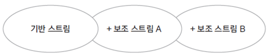

* 스트림의 예

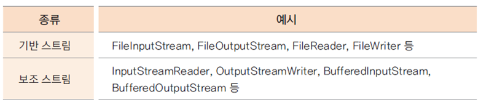

read나 write 기능은 기반 스트림이 가지고 있다.

보조 스트림은 기반 스트림이 있으면 거기에 추가적인 기능을 제공해주는 스트림이다.

데코레이터 패턴 기반

읽고 쓰는 기능이 있는 것이 기본 컴포넌트라고 하고 보조 스트림들을 데코레이터라고 한다.

어떤 클래스의 기능이 확장되면 상속을 쓰는 경우가 많이 있다. 원래 기본적인 기능이 있고 거기에 속성이 추가되면 상속을 한다.

데코레이터 패턴은 상속보다 더 유연하게 기능을 확장할 수 있는 디자인 패턴이다.

데코레이터들이 여러개 붙어서 많은 기능들이 확장되거나 필요없는 데코레이터들은 제거하면 기능이 축소될 수도 있다.

File로 되어있는 것이 기반 스트림


## 표준 입출력

### 표준 입출력

* System 클래스의 표준 입출력 멤버

```java
public class System{
    public static PrintStream out;		// 표준 출력 스트림
    public static InputStream in;		// 표준 입력 스트림
    public static PrintStream err;		// 표준 에러 스트림
} 
```

콘솔에 빨간줄로 error 표시가 되어 있는 것이 System.err 이다.

모두 static 멤버이다. => new System 하지 않고 System.~ 해서 사용


### System.in을 사용하여 입력 받기

* 한 바이트씩 읽어들임
* 한글과 같은 여러 바이트로 된 문자를 읽기 위해서는 InputStreamReader와 같은 보조 스트림을 사용해야 함


Chapter14 프로젝트 생성

src 패키지 밑에 stream 패키지 생성

stream 패키지 밑에 inputstream 패키지 생성

inputstream 패키지에 SystemInTest 클래스 생성


SystemInTest.java

```java
package stream.inputstream;

import java.io.IOException;

public class SystemInTest {
	public static void main(String[] args) {
		System.out.println("입력:");
		try {
			int i = System.in.read();
			System.out.println(i);
			System.out.println((char)i);
		} catch (IOException e) {
			System.out.println(e);
		}
	}
}
```

모든 I/O는 Exception 처리를 해야한다.

읽는 것은 System.in.read 로 읽으면 된다.

https://docs.oracle.com/javase/8/docs/api/java/lang/System.html

바이트 단위로 읽어들이는 스트림이 System.in 이다.

https://docs.oracle.com/javase/8/docs/api/java/io/InputStream.html

InputStream에 read라는 메서드가 있다. 이 메서드를 이용해 읽어들이면 된다.

표준 I/O는 close 하지 않는다. 계속 열려있는 것이기 때문에 close 할 필요 없다.

read 하는 방법이 여러 가지 있다.

read의 반환값이 int이다. 한 바이트만 읽는 건데 왜 int인가? => end of the stream, 더 이상 읽을 것이 없는 경우나 file의 끝에 도달했을 때 -1이 반환된다. -1을 처리하기 위해 반환값이 int이다.

read를 이용해 한 바이트를 읽는다. try-catch 문을 건다. 읽어들인 것을 출력. char로 출력

```
입력:
a
97
a
```

a 입력 후 Enter를 누른다.


---

SystemInTest.java 복사 => 붙여넣기


SystemInTest2.java

```java
package stream.inputstream;

import java.io.IOException;

public class SystemInTest2 {
	public static void main(String[] args) {
		System.out.println("입력:");
		try {
			int i;
			while ((i = System.in.read()) != '\n') {
				System.out.print((char)i);
			}
		} catch (IOException e) {
			System.out.println(e);
		}
	}
}
```

Enter를 누를 때까지 계속 읽기 위해서 while을 사용

```
입력:
abcdefg
abcdefg
```


---

SystemInTest2.java

```java
package stream.inputstream;

import java.io.IOException;

public class SystemInTest2 {
	public static void main(String[] args) {
		System.out.println("입력 후 '끝'이라고 쓰세요:");
		try {
			int i;
			while ((i = System.in.read()) != '끝') {
				System.out.print((char)i);
			}
		} catch (IOException e) {
			System.out.println(e);
		}
	}
}
```

'끝'을 인식 못한다. i 가 int 타입이기는 하지만 읽을 때에는 한 바이트씩 읽는다.

i 가 읽은 한 바이트는 '끝'과 같아질 수 없다.


SystemInTest2.java

```java
package stream.inputstream;

import java.io.IOException;
import java.io.InputStreamReader;

public class SystemInTest2 {
	public static void main(String[] args) {
		System.out.println("입력 후 '끝'이라고 쓰세요:");
		try {
			int i;
			InputStreamReader isr = new InputStreamReader(System.in);
			while ((i = isr.read()) != '끝') {
				System.out.print((char)i);
			}
		} catch (IOException e) {
			System.out.println(e);
		}
	}
}
```

System.in 이라는 것이 입력 스트림이기 때문에 한 바이트씩밖에 읽지 못한다. multi-byte를 읽을 수 있도록, 문자를 읽을 수 있도록 바꿔줘야 하는 것이 보조 스트림이다.

InputStreamReader 를 이용하면 읽어들인 것을 문자로 반환해준다. 항상 다른 스트림을 생성자의 매개 변수로 받는다. 보조 스트림. 혼자 돌아갈 수는 없고 다른 스트림에 기능을 부가해준다. InputStreamReader 부가해주는 기능은 바이트로 읽어들인 것을 문자로 바꿔주는 스트림이다.

읽을 때 System.in으로 읽는 것이 아니라 보조 스트림으로 읽으면 된다.

```
입력 후 '끝'이라고 쓰세요:
hello 안녕하세요 끝
hello 안녕하세요 
```


### Scanner 클래스

* java.util 패키지에 있는 입력 클래스
* 문자뿐 아니라 정수, 실수 등 다양한 자료형을 읽을 수 있음
* 생성자가 다양하여 여러 소스로 부터 자료를 읽을 수 있음

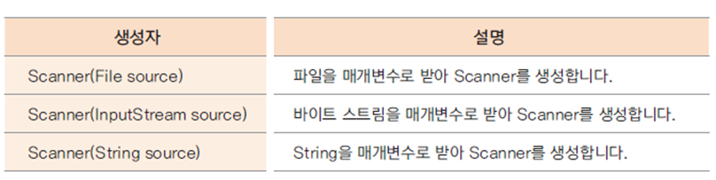

콘솔 뿐만 아니라 파일이나 다른 스트림을 매개 변수로 넣어서 읽어들일 수 있다.


### Console 클래스

* System.in을 사용하지 않고 콘솔에서 표준 입출력이 가능
* 이클립스와는 연동되지 않음
* Console 클래스의 메서드

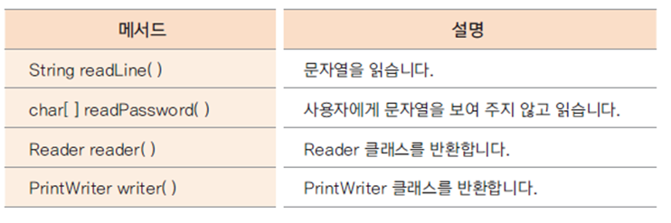


ConsoleTest.java

```java
package stream.inputstream;

import java.io.Console;

public class ConsoleTest {
	public static void main(String[] args) {
		Console console = System.console();
		System.out.println("이름:");
		String name = console.readLine();
		System.out.println("비밀번호:");
		char[] password = console.readPassword();
		
		System.out.println(name);
		System.out.println(password);
	}
}
```

이클립스에서 run은 안된다.

cmd

```
C:\eclipse-workspace\Chapter14\bin>java stream.inputstream.ConsoleTest
이름:
홍길동
비밀번호:

홍길동
12345
```

패키지가 있는 클래스는 패키지 fullname으로 실행해야 한다.


## 바이트 단위 입출력 스트림

### 바이트 단위 스트림

* InputStream
  * 바이트 단위 입력 스트림 최상위 클래스
* OutputStream
  * 바이트 단위 출력 스트림 최상위 클래스
* 추상 메서드를 포함한 추상 클래스로 하위 클래스가 구현하여 사용
* 주요 하위 클래스

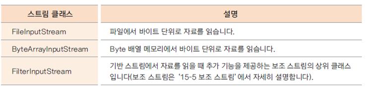

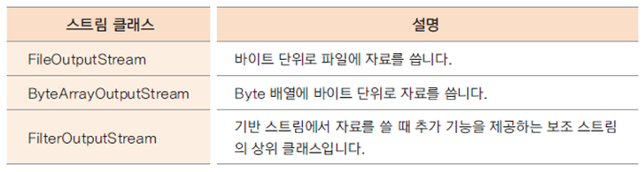

InputStream 이나 OutputStream 이 붙으면 바이트 단위 스트림이다.


### FileInputStream과 FileOutputStream 사용하기

* 파일에 한 바이트씩 자료를 읽고 쓰는데 사용
* 입력 스트림은 파일이 없는 경우 예외 발생
* 출력 스트림은 파일이 없는 경우 파일을 생성하여 출력

한 바이트씩 읽기 때문에 한글같이 multi-byte인 경우에는 FileReader와 FileWriter를 쓰면 된다.


FileInputTest1.java

```java
package stream.inputstream;

import java.io.FileInputStream;
import java.io.FileNotFoundException;

public class FileInputTest1 {
	public static void main(String[] args) {
		FileInputStream fis = null;
		try {
			fis = new FileInputStream("input.txt");
		} catch (FileNotFoundException e) {
			e.printStackTrace();
		} finally {
			try {
				fis.close();
			} catch (Exception e) {
				e.printStackTrace();
			}
		}
		System.out.println("end");
	}
}
```

다 하고 나서는 close를 해야한다.

```
java.io.FileNotFoundException: input.txt (지정된 파일을 찾을 수 없습니다)
	at java.io.FileInputStream.open0(Native Method)
	at java.io.FileInputStream.open(Unknown Source)
	at java.io.FileInputStream.<init>(Unknown Source)
	at java.io.FileInputStream.<init>(Unknown Source)
	at stream.inputstream.FileInputTest1.main(FileInputTest1.java:10)
java.lang.NullPointerException
	at stream.inputstream.FileInputTest1.main(FileInputTest1.java:16)
end
```


---

Chapter14 프로젝트에 input.txt 파일 생성, abc 입력

FileInputTest1.java

```java
package stream.inputstream;

import java.io.FileInputStream;
import java.io.FileNotFoundException;
import java.io.IOException;

public class FileInputTest1 {
	public static void main(String[] args) {
		FileInputStream fis = null;
		try {
			fis = new FileInputStream("input.txt");
			
			int i = fis.read();
			System.out.println((char)i);
			i = fis.read();
			System.out.println((char)i);
			i = fis.read();
			System.out.println((char)i);
			
		} catch (IOException e) {
			e.printStackTrace();
		} finally {
			try {
				fis.close();
			} catch (Exception e) {
				e.printStackTrace();
			}
		}
		System.out.println("end");
	}
}
```

read 할 때 IOException이 발생한다. => IOException 하위에 FileNotFoundException이 있다. => catch 블럭에서 IOException 으로 변경

3번 읽는다.

```
a
b
c
end
```


---

파일의 끝까지 읽어보기

input.txt

```
abcdefghijklmnop안녕하세요
```


FileInputTest1.java

```java
package stream.inputstream;

import java.io.FileInputStream;
import java.io.IOException;

public class FileInputTest1 {
	public static void main(String[] args) {
		FileInputStream fis = null;
		try {
			fis = new FileInputStream("input.txt");
			
			int i;
			while((i = fis.read()) != -1)
				System.out.print((char)i);
			
		} catch (IOException e) {
			e.printStackTrace();
		} finally {
			try {
				fis.close();
			} catch (Exception e) {
				e.printStackTrace();
			}
		}
		System.out.println("end");
	}
}
```

while을 쓰면 된다. 파일의 끝에 도달하면 -1이 반환된다. -1이 아닐 때까지 계속 읽는다.

한 바이트씩 읽기 때문에 한글은 깨진다.

```
abcdefghijklmnop¾?³???¼¼¿?end
```


---

FileInputTest1.java 파일 복사 => 붙여넣기

FileInputTest2.java

```java
package stream.inputstream;

import java.io.FileInputStream;
import java.io.IOException;

public class FileInputTest2 {
	public static void main(String[] args) {
		try(FileInputStream fis = new FileInputStream("input.txt")) {
			int i;
			while((i = fis.read()) != -1)
				System.out.print((char)i);
			
		} catch (IOException e) {
			e.printStackTrace();
		}
		System.out.println("end");
	}
}
```

try 안에서 리소스를 오픈한다.

AutoCloseable 하면 close가 바로 호출된다.


---

FileInputStream

https://docs.oracle.com/javase/8/docs/api/java/io/FileInputStream.html

read 메서드에 한 바이트를 읽는 것이 있고, byte array를 이용해 읽는 것이 있고, byte array에 특정 offset을 적용해서 length만큼 읽는 것이 있다. off 만큼 띄어서 len 만큼 읽기

byte[] 를 이용하면 조금 더 빨리 읽을 수 있다.


Chapter14 프로젝트에 input2.txt 파일 생성

input2.txt

```
ABCDEFGHIJKLMNOPQRSTUVWXYZ
```


FileInputTest2.java 파일 복사 => 붙여넣기

FileInputTest3.java

```java
package stream.inputstream;

import java.io.FileInputStream;
import java.io.IOException;

public class FileInputTest3 {
	public static void main(String[] args) {
		try(FileInputStream fis = new FileInputStream("input2.txt")) {
			int i;
			byte[] bs = new byte[10];
			while((i = fis.read(bs)) != -1) {
				for(byte b : bs) {
					System.out.print((char)b);
				}
				System.out.println();
			}
		} catch (IOException e) {
			e.printStackTrace();
		}
		//System.out.println("end");
	}
}
```

10개씩 읽어서 10개를 출력. 한 번 읽고나면 한 줄 개행

```
ABCDEFGHIJ
KLMNOPQRST
UVWXYZQRST
```

마지막 4 글자는 전에 읽었던 것이 그대로 남아있다. 버퍼에 남은 가비지

버퍼를 읽어서 쓸 때에는 가비지가 남을 수 있다.

이런 경우에는 얼만큼 읽었는지 개수만큼 출력해야 한다.

앞에서는 읽은 char가 i에 반환되었는데, 지금은 버퍼를 읽으면 i에 개수가 반환된다.


FileInputTest3.java

```java
package stream.inputstream;

import java.io.FileInputStream;
import java.io.IOException;

public class FileInputTest3 {
	public static void main(String[] args) {
		try(FileInputStream fis = new FileInputStream("input2.txt")) {
			int i;
			byte[] bs = new byte[10];
			while((i = fis.read(bs)) != -1) {
				/*for(byte b : bs) {
					System.out.print((char)b);
				}*/
				for(int k = 0; k < i; k++) {
					System.out.print((char)bs[k]);
				}
				System.out.println();
			}
		} catch (IOException e) {
			e.printStackTrace();
		}
		//System.out.println("end");
	}
}
```


```
ABCDEFGHIJ
KLMNOPQRST
UVWXYZ
```


---

stream 패키지 밑에 outputstream 패키지 생성

FileOutputTest1.java

```java
package stream.outputstream;

import java.io.FileOutputStream;
import java.io.IOException;

public class FileOutputTest1 {
	public static void main(String[] args) {
		try(FileOutputStream fos = new FileOutputStream("output.txt")) {
			fos.write(65);
			fos.write(66);
			fos.write(67);
		} catch(IOException e) {
			System.out.println(e);
		}
	}
}
```


main 메서드 실행 => Chapter14 프로젝트 클릭 => F5

output.txt

```
ABC
```

숫자로 썼는데 해당되는 문자가 작성된 것을 확인할 수 있다.


---

FileOutputTest1.java

```java
...
		try(FileOutputStream fos = new FileOutputStream("output.txt", true)) {
...
```

true를 붙이면 계속 append가 된다.

```
ABCABC
```

계속 이어저셔 쓰인다.


---

FileOutputTest1.java 복사 => 붙여넣기

FileOutputTest2.java

```java
package stream.outputstream;

import java.io.FileInputStream;
import java.io.FileOutputStream;
import java.io.IOException;

public class FileOutputTest2 {
	public static void main(String[] args) {
		
		byte[] bs = new byte[26];
		byte data = 65;
		for(int i = 0; i < bs.length; i++) {
			bs[i] = data;
			data++;
		}
		
		try(FileOutputStream fos = new FileOutputStream("alpha.txt", true);
			FileInputStream fis = new FileInputStream("alpha.txt")) {
			
			fos.write(bs);
			int ch;
			while((ch = fis.read()) != -1) {
				System.out.print((char)ch);
			}
		} catch(IOException e) {
			System.out.println(e);
		}
	}
}
```

InputStream과 OutputStream을 다 open해서 OutputStream으로 쓰고 InputStream으로 쓴 것을 읽는다.

alpha.txt

```
ABCDEFGHIJKLMNOPQRSTUVWXYZ
```

버퍼로 쓴 것을 하나씩 읽어온다. 파일에 쓸 때 뒤에 true를 붙이면 계속 append가 된다.


### flush()와 close() 메서드

* 출력용 버퍼를 비울 때 flush() 메서드 호출
* 파일 스트림을 닫기 위한 close() 메서드가 호출되면 내부에서 flush()를 호출하며 출력 버퍼를 비움


## 문자 단위 입출력 스트림

### 문자 단위 스트림

* Reader
  * 문자 단위로 읽는 최상위 스트림
* Writer
  * 문자 단위로 쓰는 최상위 스트림
* 추상 메서드를 포함한 추상 클래스로 하위 클래스가 상속받아 구현
* 하위 클래스

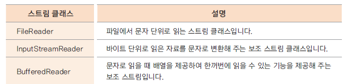

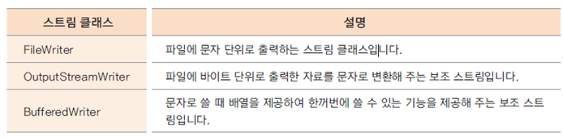

뒤에 Reader나 Writer가 붙으면 문자 단위로 handling이 된다.

InputStreamReader, BufferedReader는 보조 스트림


### FileReader와 FileWriter

* 파일에 문자를 읽고 쓸 때 가장 많이 사용하는 클래스
* 문자의 인코딩 방식을 지정할 수 있음


Chapter14 프로젝트에 reader.txt 파일 생성

reader.txt

```
안녕하세요 반갑습니다 abc
```


stream 패키지 밑에 reader 패키지 생성

FileReaderTest.java

```java
package stream.reader;

import java.io.FileInputStream;
import java.io.IOException;

public class FileReaderTest {
	public static void main(String[] args) throws IOException {
		FileInputStream fis = new FileInputStream("reader.txt");
		int i;
		while((i = fis.read()) != -1) {
			System.out.print((char)i);
		}
		fis.close();
	}
}
```


```
¾?³???¼¼¿? ¹?°?½?´?´? abc
```

한글이 다 깨지고 abc만 나온다. 바이트 단위로 읽기 때문이다.


---

FileReaderTest.java

```java
package stream.reader;

import java.io.FileReader;
import java.io.IOException;

public class FileReaderTest {
	public static void main(String[] args) throws IOException {
		FileReader fis = new FileReader("reader.txt");
		int i;
		while((i = fis.read()) != -1) {
			System.out.print((char)i);
		}
		fis.close();
	}
}
```


```
안녕하세요 반갑습니다 abc
```

문자를 읽을 때에는 FileReader로 읽으면 된다.


---

FileReaderTest.java

```java
package stream.reader;

import java.io.FileInputStream;
import java.io.IOException;
import java.io.InputStreamReader;

public class FileReaderTest {
	public static void main(String[] args) throws IOException {
		FileInputStream fis = new FileInputStream("reader.txt");
		InputStreamReader isr = new InputStreamReader(fis);
		int i;
		while((i = isr.read()) != -1) {
			System.out.print((char)i);
		}
		isr.close();
	}
}
```

보조 스트림으로 감싼다. 이미 바이트로 읽었거나 다른 사정에 의해서 바이트로 읽고 있는데 문자로 변환해야 할 경우

보조 스트림을 close 하면 원래 스트림까지 다 close 된다.

```
안녕하세요 반갑습니다 abc
```

---

FileReader

https://docs.oracle.com/javase/8/docs/api/java/io/FileReader.html

Constructor에 읽어들이는 source에 대한 부분을 지정할 수 있다.

---

stream 패키지 밑에 writer 패키지 생성

FileWriterTest.java

```java
package stream.writer;

import java.io.FileWriter;
import java.io.IOException;

public class FileWriterTest {
	public static void main(String[] args) throws IOException {
		FileWriter fw = new FileWriter("writer.txt");
		fw.write('A');
		char[] buf = {'B','C','D','E','F'};
		fw.write(buf);
		fw.write("안녕하세요");
		fw.write(buf, 2, 2);
		fw.close();
		
		System.out.println("end");
	}
}
```


writer.txt

```
ABCDEF안녕하세요DE
```


## 보조 스트림

### 보조 스트림

* 실제 읽고 쓰는 스트림이 아닌 보조적인 기능을 추가하는 스트림
* FilterInputStream과 FilterOutputStream이 보조 스트림의 상위 클래스
* 생성자의 매개 변수로 또 다른 스트림을 가짐

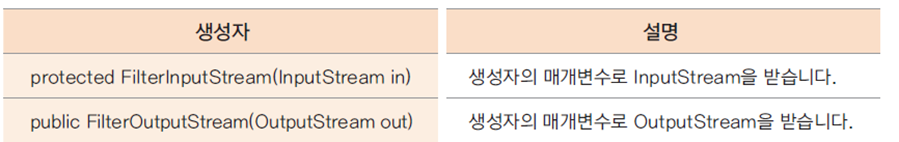

* 데코레이터 패턴(Decorator Pattern)

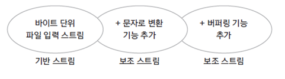

보조 스트림의 역할은 기능을 추가해주는 역할이다. 실제 읽고 쓰는 기능은 없다.

이 스트림들은 입력 스트림 용도라면 어느 입력 스트림에나 붙을 수 있다.

또 다른 스트림을 받는다. 받아서 원래 입력하는 스트림이 있다고 하면 그거에 보조해서 기능을 추가하는데 그것을 데코레이터라고 얘기한다. 디자인 패턴 용어


### 여러가지 보조 스트림 사용하기

* Buffered 스트림
  * 내부에 8192 바이트 배열을 가지고 있음
  * 읽거나 쓸 때 속도가 빠름
* DataInputStream / DataOutputStream
  * 자료가 저장된 상태 그대로 자료형을 유지하며 읽거나 쓰는 기능을 제공하는 스트림


stream 패키지 밑에 decorator 패키지 생성

5MB 정도 사이즈의 파일을 Chapter14 디렉터리 밑에 가져다두기

FileCopy.java

```java
package stream.decorator;

import java.io.FileInputStream;
import java.io.FileOutputStream;
import java.io.IOException;

public class FileCopy {
	public static void main(String[] args) {
		long milliseconds = 0;
		
		try(FileInputStream fis = new FileInputStream("a.zip");
			FileOutputStream fos = new FileOutputStream("copy.zip")) {
			milliseconds = System.currentTimeMillis();
			
			int i;
			while((i = fis.read()) != -1) {
				fos.write(i);
			}
			
			milliseconds = System.currentTimeMillis() - milliseconds;
		} catch(IOException e) {
			System.out.println(e);
		}
		
		System.out.println("시간: " + milliseconds);
	}
}
```


```
시간: 65783
```


---

FileCopy.java

```java
package stream.decorator;

import java.io.BufferedInputStream;
import java.io.BufferedOutputStream;
import java.io.FileInputStream;
import java.io.FileOutputStream;
import java.io.IOException;

public class FileCopy {
	public static void main(String[] args) {
		long milliseconds = 0;
		
		try(FileInputStream fis = new FileInputStream("a.zip");
			FileOutputStream fos = new FileOutputStream("copy.zip");
			BufferedInputStream bis = new BufferedInputStream(fis);
			BufferedOutputStream bos = new BufferedOutputStream(fos)) {
			milliseconds = System.currentTimeMillis();
			
			int i;
			while((i = bis.read()) != -1) {
				bos.write(i);
			}
			
			milliseconds = System.currentTimeMillis() - milliseconds;
		} catch(IOException e) {
			System.out.println(e);
		}
		
		System.out.println("시간: " + milliseconds);
	}
}
```


```
시간: 352
```

훨씬 빠르다. 읽어들이거나 쓸 때 버퍼링하는데 BufferedStream이 많이 쓰인다.


BufferedInputStream의 정의로 이동해서 보면 버퍼 사이즈가 8K(8192) 정도 들어가있다. 8K 만큼 한번에 읽고 쓴다.


---

보조 스트림은 기반 스트림만 감싸는 것이 아니라 또다른 보조 스트림도 감싼다.

FileCopy.java

```java
package stream.decorator;

import java.io.BufferedInputStream;
import java.io.BufferedOutputStream;
import java.io.BufferedReader;
import java.io.FileInputStream;
import java.io.FileOutputStream;
import java.io.IOException;
import java.io.InputStreamReader;
import java.net.Socket;

public class FileCopy {
	public static void main(String[] args) throws IOException {
		long milliseconds = 0;
		
		try(FileInputStream fis = new FileInputStream("a.zip");
			FileOutputStream fos = new FileOutputStream("copy.zip");
			BufferedInputStream bis = new BufferedInputStream(fis);
			BufferedOutputStream bos = new BufferedOutputStream(fos)) {
			milliseconds = System.currentTimeMillis();
			
			int i;
			while((i = bis.read()) != -1) {
				bos.write(i);
			}
			
			milliseconds = System.currentTimeMillis() - milliseconds;
		} catch(IOException e) {
			System.out.println(e);
		}
		System.out.println("시간: " + milliseconds);
		
		Socket socket = new Socket();
		
		BufferedReader isr = new BufferedReader(new InputStreamReader(socket.getInputStream()));
		
		isr.readLine();
		
		socket.close();
	}
}
```

Socket을 사용하는데 Socket에서 읽어들일 때 getInputStream을 가져와서 여기서부터 read를 한다. 쓸 때에는 getOutputStream 해서 OutputStream을 가져와서 쓴다.

socket.getInputStream().read() 를 하면 영문만 읽을 수 있다.

한글 채팅 프로그램 

InputStreamReader 로 감싸게 되면 Socket에서 바이트 단위로 읽는 것을 문자 단위로 읽을 수 있다.

InputStreamReader로 감싼 것을 BufferedReader 로 감싸면 읽을 때 버퍼링 기능까지 가져올 수 있다.

InputStream 상태에서 InputStreamReader로 감싸서 문자로 읽도록 하고, 다시 BufferedReader 으로 감싸서 조금 더 빠르게 읽게 했다.

BufferedReader 에는 readLine 메서드가 있다. 한 줄씩 읽는다.

보조 스트림 여러개가 계속 감싸면서 기능이 계속 추가되고 있다. 이런 것이 데코레이터 패턴이다.

이것을 상속으로 구현한다면 굉장히 복잡해진다.

부가적인 기능을 제공하는데 이런 식의 구조가 굉장히 유용하다.

---

DataInputStream / DataOutputStream

직접 자료형을 그대로 쓰고 읽을 수 있는 스트림이다.

서버에 데이터를 던졌을 때 데이터가 넘어온 상태를 그대로 읽을 수 있는 데 유용하게 쓰인다.


DataStreamTest.java

```java
package stream.decorator;

import java.io.DataInputStream;
import java.io.DataOutputStream;
import java.io.FileInputStream;
import java.io.FileOutputStream;
import java.io.IOException;

public class DataStreamTest {
	public static void main(String[] args) {
		
		try(FileOutputStream fos = new FileOutputStream("data.txt");
			DataOutputStream dos = new DataOutputStream(fos);
			FileInputStream fis = new FileInputStream("data.txt");
			DataInputStream dis = new DataInputStream(fis)) {
			
			dos.writeByte(100);
			dos.write(100);
			dos.writeChar('A');
			dos.writeUTF("안녕하세요");
			
			System.out.println(dis.readByte());
			System.out.println(dis.read());
			System.out.println(dis.readChar());
			System.out.println(dis.readUTF());
			
		} catch(IOException e) {
			System.out.println(e);
		}
	}
}
```

FileOutputStream을 DataOutputStream으로 감싼다.

try-catch 문

writeByte는 한 바이트로 쓰는 것이고 write는 4 바이트로 쓰이는 것이다.

읽을 때에는 쓴 그대로 읽어야한다. write와 mapping되는 api를 그대로 사용해야 한다. 


```
100
100
A
안녕하세요
```

쓰인게 그대로 읽혀진다.

만약 writeByte 로 썼는데 readByte가 아니라 read로 읽었다면 데이터가 깨질 수 있다.

DataInputStream과 DataOutputStream은 실제로 데이터를 그대로 읽고 쓰는데 사용하는 보조 스트림이다.


## 직렬화(Serialization)

### 직렬화

* 인스턴스의 상태를 그대로 저장하거나 네트워크로 전송하고 이를 다시 복원(Deserialization) 하는 방식
* ObjectInputStream 과 ObjectOutputStream 사용
* 보조 스트림

직렬화는 다른 언어에서도 제공하는 기술이다.


### Serializable 인터페이스

* 직렬화는 인스턴스의 내용이 외부(파일, 네트워크)로 유출되는 것이므로 프로그래머가 객체의 직렬화 가능 여부를 명시함
* 구현  코드가 없는 make interface

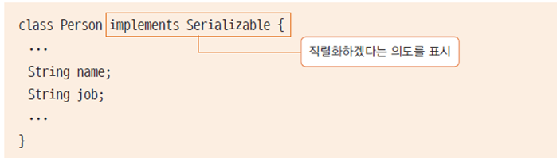

Serializable 인터페이스를 선언해줌으로써 이 객체가 직렬화 가능하다 하고 해서 직렬화를 구현한다.


stream 패키지 밑에 serialization 패키지 생성

SerializationTest.java

```java
package stream.serialization;

import java.io.FileInputStream;
import java.io.FileOutputStream;
import java.io.IOException;
import java.io.ObjectInputStream;
import java.io.ObjectOutputStream;
import java.io.Serializable;

class Person implements Serializable {
	String name;
	String job;
	
	public Person(String name, String job) {
		this.name = name;
		this.job = job;
	}
	
	public String toString() {
		return name + "," + job;
	}
}

public class SerializationTest {
	public static void main(String[] args) {
		Person personLee = new Person("이순신", "엔지니어");
		Person personKim = new Person("김유신", "선생님");
		
		try(FileOutputStream fos = new FileOutputStream("serial.dat");
			ObjectOutputStream oos = new ObjectOutputStream(fos)) {
			
			oos.writeObject(personLee);
			oos.writeObject(personKim);
			
		} catch(IOException e) {
			System.out.println(e);
		}
		
		try(FileInputStream fis = new FileInputStream("serial.dat");
			ObjectInputStream ois = new ObjectInputStream(fis)) {
			
			Person p1 = (Person)ois.readObject();
			Person p2 = (Person)ois.readObject();
			
			System.out.println(p1);
			System.out.println(p2);
			
		} catch(IOException e) {
			System.out.println(e);
		} catch(ClassNotFoundException e) {
			System.out.println(e);
		}
	}
}
```

Object를 읽고 쓰는 기능이 ObjectInputStream 과 ObjectOutputStream 에서 제공이 된다.

Person 객체를 파일에 저장

쓸 때 파일에 직접 쓸 수는 없다. 어떤 데이터를 파일에 쓰고 읽는다면 어떤 프로토콜을 만들어서 쓰고 읽을수는 있다. 바이너리 상태를 그대로 파일에 쓰고 읽는 것은 이 클래스가 어떤 정보를 가지고 있는지, 클래스의 이름이 뭔지 등도 같이 들어가게 된다. 그렇게 한다고 했을 때 파일에 일반 텍스트로 쓸 수는 없고 ObjectOutputStream 이라는 보조 스트림을 이용해 쓰면 된다.

클래스가 직렬화 가능하다고 선언을 해줘야 한다. Serializable

serial.dat에 데이터가 들어간다.

읽을 때에는 readObject로 읽으면 된다. Object로 반환이 된다.

ClassNotFoundException도 처리

안전하게 하기 위해서는 instanceof를 사용하는 것이 좋다.


```
이순신,엔지니어
김유신,선생님
```

파일에 썼다가 파일에서 그대로 Object를 읽어들였다. 이렇게 사용할 수 있는 것이 Serialization이다.


---

transient 키워드는 이 변수는 직렬화하지 말라는 의미이다.

SerializationTest.java

```java
package stream.serialization;

import java.io.FileInputStream;
import java.io.FileOutputStream;
import java.io.IOException;
import java.io.ObjectInputStream;
import java.io.ObjectOutputStream;
import java.io.Serializable;

class Person implements Serializable {
	String name;
	transient String job;
	
	public Person(String name, String job) {
		this.name = name;
		this.job = job;
	}
	
	public String toString() {
		return name + "," + job;
	}
}

public class SerializationTest {
	public static void main(String[] args) {
		Person personLee = new Person("이순신", "엔지니어");
		Person personKim = new Person("김유신", "선생님");
		
		try(FileOutputStream fos = new FileOutputStream("serial.dat");
			ObjectOutputStream oos = new ObjectOutputStream(fos)) {
			
			oos.writeObject(personLee);
			oos.writeObject(personKim);
			
		} catch(IOException e) {
			System.out.println(e);
		}
		
		try(FileInputStream fis = new FileInputStream("serial.dat");
			ObjectInputStream ois = new ObjectInputStream(fis)) {
			
			Person p1 = (Person)ois.readObject();
			Person p2 = (Person)ois.readObject();
			
			System.out.println(p1);
			System.out.println(p2);
			
		} catch(IOException e) {
			System.out.println(e);
		} catch(ClassNotFoundException e) {
			System.out.println(e);
		}
	}
}
```


```
이순신,null
김유신,null
```

Socket 같은 직렬화 할 수 없는 것은 transient 키워드를 쓰면 된다.


### Externalizable 인터페이스

* 구현할 메서드가 있는 인터페이스
* 프로그래머가 자료를 읽고 쓰는 방식을 직접 구현함


Externalizable 인터페이스

Serializable 같은 경우에는 구현해야 하는 메서드가 없다. mark interface

Externalizable 인터페이스는 구현할 수 있는 메서드가 있다.

writeExternal 메서드와 readExternal 메서드

이 메서드들에서 직접 읽고 쓰는 것을 구현할 수 있다.

writeObject, readObject 메서드가 호출되면 writeExternal, readExternal 이 호출된다.


직렬화는 시스템 내부적으로도 많이 쓰고있는 기술이다.


## 그 외 입출력 클래스와 데코레이터 패턴

### 그 외 입출력 클래스

* File 클래스
  * 파일 개념을 추상화한 클래스
  * 입출력 기능은 없고 파일의 속성, 경로, 이름 등을 알 수 있음
* RandomAccessFile 클래스
  * 입출력 클래스 중 유일하게 파일 입출력을 동시에 할 수 있는 클래스
  * 파일 포인터가 있어서 읽고 쓰는 위치의 이동이 가능함
  * 다양한 자료형에 대한 메서드가 제공됨

C언어에는 FILE 이라는 것이 있고, FILE 로부터 Open을 해서 읽고 쓸 수 있다.

자바에서 File 클래스는 읽고 쓰는 기능이 없다.

RandomAccessFile 클래스는 파일 입출력을 동시에 할 수 있는, C언어에서의 FILE같은 기능을 제공하는 클래스이다.

seek 메서드를 이용해서 파일 포인터가 이동할 수 있다.

잠깐 파일을 열어서 데이터를 쓰고 다시 읽는 작업을 할 때 유용하게 쓸 수 있다.


stream 패키지 밑에 others 패키지 생성

RandomAccessFileTest.java

```java
package stream.others;

import java.io.IOException;
import java.io.RandomAccessFile;

public class RandomAccessFileTest {
	public static void main(String[] args) throws IOException {
		RandomAccessFile rf = new RandomAccessFile("random.txt", "rw");
		rf.writeInt(100);
		System.out.println(rf.getFilePointer());
		rf.writeDouble(3.14);
		rf.writeUTF("안녕하세요");
		
		rf.seek(0);
		int i = rf.readInt();
		double d = rf.readDouble();
		String str = rf.readUTF();
		
		System.out.println(i);
		System.out.println(d);
		System.out.println(str);
		rf.close();
	}
}
```

RandomAccessFile 사용. 파일 이름과 모드 정하기

https://docs.oracle.com/javase/8/docs/api/java/io/RandomAccessFile.html

DataInput, DataOutput이 구현되어 있다. DataInputStream, DataOutputStream 기반한 인터페이스이다. 이 안에 메서드들이 다 선언되어 있다. 이 메서드들을 똑같이 쓸 수 있다.

getFilePointer를 하면 위치를 알 수 있다.

```
4
100
3.14
안녕하세요
```

int가 4byte 이므로 4가 나온다.

write를 하게되면 파일 포인터가 이동한다. 지금은 "안녕하세요" 자리에 가 있다.

읽으려면 처음으로 가야한다. 파일 포인터 위치를 바꿔야 한다. 처음 위치로 돌아가기

다 사용하고 나면 close를 해준다.


### 데코레이터 패턴 (Decorator Pattern)

* 자바의 입출력 스트림은 데코레이터 패턴을 사용
* 실제 입출력 기능을 가진 객체(컴포넌트)와 그 외 다양한 기능을 제공하는 데코레이터(보조 스트림)를 사용하여 다양한 입출력 기능을 구현
* 상속보다 유연한 확장성을 가짐
* 지속적인 서비스의 증가와 제거가 용이함

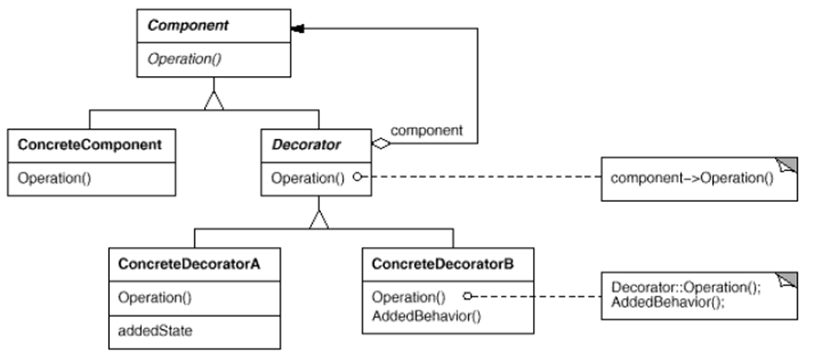

ConcreteComponent가 기반 클래스라고 보면 된다. 기반이 되는 클래스들이 여러개가 있을 수도 있고 하나가 있을 수도 있다.

여러 기능을 제공해주는 Decorator들이 있을 수 있다.

이 두 개의 클래스는 같은 클래스로부터 상속을 받는다.

기반 스트림을 코딩하던 보조 스트림을 코딩하던 똑같이 스트림이라고 생각하고 코딩하는 것은 같은 상위 클래스에서 상속을 받는 구조로 되어있다.

읽고 쓰는 기능들은 기반 스트림에 있기 때문에 Decorator들은 혼자 돌아갈 수 없다. 항상 다른 Component를 가지고 있다. 이 컴포넌트는 또 다른 데코레이터일수도 있고 아니면 기반 클래스일 수도 있다.

데코레이터의 종류는 여러가지가 있을 수 있다.

Decorator들의 Operation을 보면 본인이 해야하는 AddedBehavior이 있다. 본인이 보조적으로 하는 기능이 있고, 그 전에 원래 기능을 한 번 호출한다. 원래 기능이라는 것은 자기가 포함한 컴포넌트의 기능이다.

파일에서 읽고 쓰는 기능이 있다면 그것을 먼저 호출한 다음에 그것을 문자로 바꿔주는 기능을 수행한다거나 한다.


### 코딩해보기

* 데코레이터 패턴을 활용하여 커피를 만들어 봅시다.

```
아메리카노
라떼 = 아메리카노 + 우유
모카커피 = 아메리카노 + 우유 + 모카시럽
Whipping cream 모카커피 = 아메리카노 + 우유 + 모카시럽 + whipping cream
```

아메리카노가 커피라고 하면 우유, 모카시럽, whipping cream은 데코레이터이다.

데코레이터가 어떻게 붙는지에 따라 다양한 커피가 만들어진다.

중요한 것은 데코레이터들은 커피가 아니라는 것이다.


stream 패키지 밑에 coffee 패키지 생성

Coffee.java

```java
package stream.coffee;

public abstract class Coffee {
	public abstract void brewing();
}
```

Coffee라는 최상위 클래스를 생성

Coffee라는 클래스는 실제적으로 사용할 클래스는 아니라서 추상 클래스로 만든다. abstract

brewing 메서드


KenyaAmericano.java

```java
package stream.coffee;

public class KenyaAmericano extends Coffee {

	@Override
	public void brewing() {
		System.out.print("KenyaAmericano ");
	}
}
```

Coffee를 상속받는다.


Decorator.java

```java
package stream.coffee;

public abstract class Decorator extends Coffee{
	Coffee coffee;
	public Decorator(Coffee coffee) {
		this.coffee = coffee;
	}
	@Override
	public void brewing() {
		coffee.brewing();
	}
}
```

Coffee를 상속받는다.

추상 클래스. abstract. 상속하는데만 사용한다.

Decorator는 혼자 돌아갈 수 없다. Decorator의 생성자에는 항상 또다른 Coffee를 가지고 온다.

가지고 있는 Coffee라는 상위 클래스의 객체 변수에 넣는다.

brewing 메서드 구현. 원래 생성자에서 받은 기능을 한 번 호출해준다. 


Latte.java

```java
package stream.coffee;

public class Latte extends Decorator {
	public Latte(Coffee coffee) {
		super(coffee);
	}
	
	public void brewing() {
		super.brewing();
		System.out.print("Adding Milk ");
	}
}
```

extends Decorator 를 하게되면 하나의 커피를 반드시 가져오게 된다.

커피를 뽑을 때에는 overriding을 한다.

상위 클래스의 제조 방법을 한 번 호출한 다음에 우유를 추가한다.


Decorator와 Component가 모두 하나의 클래스에서 상속을 받아서 같은 Operation이 제공된다.


CoffeeTest.java

```java
package stream.coffee;

public class CoffeeTest {
	public static void main(String[] args) {
		Coffee americano = new KenyaAmericano();
		americano.brewing();
		System.out.println();
		
		Coffee kenyaLatte = new Latte(new KenyaAmericano());
		kenyaLatte.brewing();
	}
}
```


```
KenyaAmericano 
KenyaAmericano Adding Milk 
```


---

Mocha.java

```java
package stream.coffee;

public class Mocha extends Decorator{

	public Mocha(Coffee coffee) {
		super(coffee);
	}
	
	public void brewing() {
		super.brewing();
		System.out.print("Adding Mocha Syrup ");
	}
}
```


CoffeeTest.java

```java
package stream.coffee;

public class CoffeeTest {
	public static void main(String[] args) {
		Coffee americano = new KenyaAmericano();
		americano.brewing();
		System.out.println();
		
		Coffee kenyaLatte = new Latte(new KenyaAmericano());
		kenyaLatte.brewing();
		System.out.println();
		
		Coffee kenyaMocha = new Mocha(new Latte(new KenyaAmericano()));
		kenyaMocha.brewing();
	}
}
```


```
KenyaAmericano 
KenyaAmericano Adding Milk 
KenyaAmericano Adding Milk Adding Mocha Syrup 
```


장식자가 생성자의 또 다른 데코레이터를 받을 수도 있고, 일반 컴포넌트를 받을 수도 있는데 가장 안에 있는 것은 일반 컴포넌트여야 한다. 그래야 읽고 쓸 수 있다.


---

EthiopiaAmericano.java

```java
package stream.coffee;

public class EthiopiaAmericano extends Coffee {
	@Override
	public void brewing() {
		System.out.print("EthiopiaAmericano ");
	}
}
```

Original Component


CoffeeTest.java

```java
package stream.coffee;

public class CoffeeTest {
	public static void main(String[] args) {
		Coffee americano = new KenyaAmericano();
		americano.brewing();
		System.out.println();
		
		Coffee kenyaLatte = new Latte(new KenyaAmericano());
		kenyaLatte.brewing();
		System.out.println();
		
		Coffee kenyaMocha = new Mocha(new Latte(new KenyaAmericano()));
		kenyaMocha.brewing();
		System.out.println();
		
		Coffee ethiopiaMocha = new Mocha(new Latte(new EthiopiaAmericano()));
		ethiopiaMocha.brewing();
	}
}
```


```
KenyaAmericano 
KenyaAmericano Adding Milk 
KenyaAmericano Adding Milk Adding Mocha Syrup 
EthiopiaAmericano Adding Milk Adding Mocha Syrup 
```


이런식의 구조로 되어있는 것이 데코레이터 패턴이다.

자바의 입출력 스트림이 부가적인 기능을 추가하거나 제거하는 것을 쉽게 하기 위해서 데코레이터 패턴으로 되어있다.

