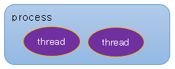
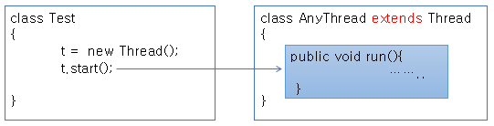
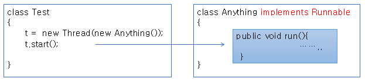
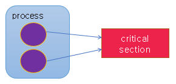
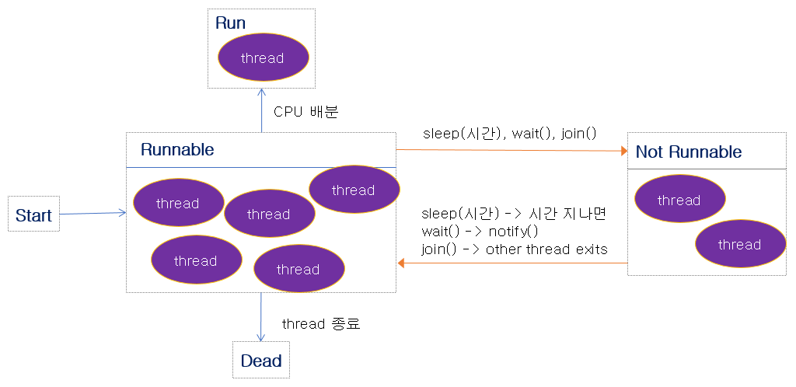
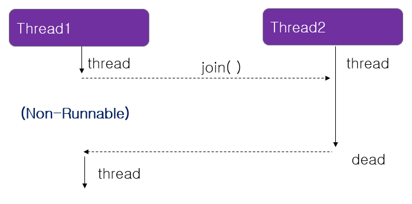
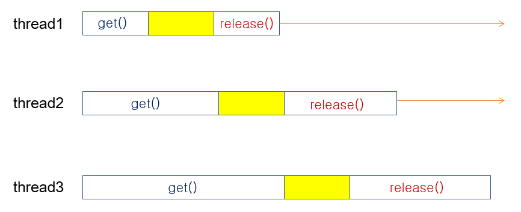
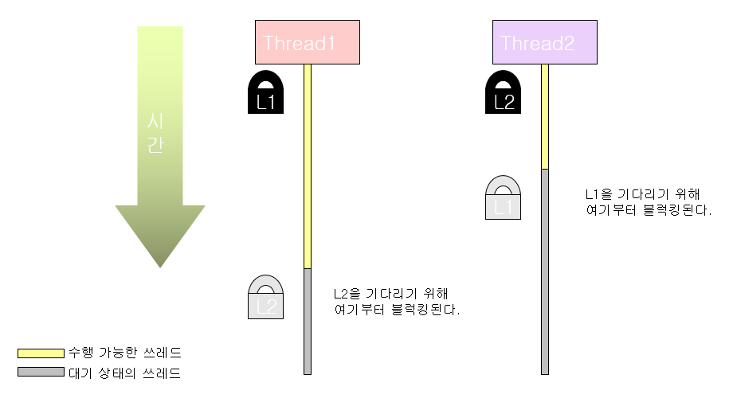

# 15. 자바 Thread 프로그래밍

자바가 주로 웹 서버에서 돌아간다. 웹 서버 프로그래밍을 많이 하게 되는데 웹 서버 자체가 multi-thread가 support가 된다. thread를 구현할 일이 그렇게 많지 않을수도 있는데 안드로이드에서 서비스를 개발하거나 내부적으로 thread 들을 만든다.

thread 프로그래밍에서 중요한 것은 shared resource가 발생할 수 있다. 공유 자원을 동시에 쓰면 문제가 생길 수 있다. 한쪽에서는 값을 더하고 한쪽에서는 값을 빼고, 업데이트되지 않은 상태에서 연산이 동시에 일어나면 문제가 될 수 있다.

동기화(synchronization)라고 해서 순서를 맞춰줘야 한다.


## Thread 구현하기

### Thread란?

* Process
  * 실행중인 프로그램
  * OS로부터 메모리를 할당받음
* Thread
  * 실제 프로그램이 수행되는 작업의 최소 단위
  * 하나의 프로세스는 하나 이상의 Thread를 가지게 됨



프로그램이 메모리에 올라간 상태를 Process라고 한다. 하나의 프로그램은 Process가 되어 메모리에 올라간다. Process가 실행되는 것은 아니고 실행이 되는 단위는 thread 라고 한다. 하나의 프로그램은 하나 이상의 thread의 상태가 되어서 CPU를 점유하게 된다.

하나의 프로세스 안에 두 개의 thread가 동시에 돌아가는 것처럼 작업의 단위라고 보면 된다. 두 개가 동시에 돌아가는 것처럼 보이는 것이 multi-thread

thread는 CPU를 점유해서 돌아가게 되는데, Scheduler가 thread에 CPU를 할당해서 thread가 수행되도록 한다.


### Thread 구현하기

* 자바 Thread 클래스로부터 상속받아 구현




* Runnable 인터페이스 구현



자바는 다중 상속이 허용되지 않으므로 이미 다른 클래스를 상속한 경우 thread를 만들려면 Runnable interface를 implements 하도록 한다.


자바에서 Thread를 구현하는 방법은 크게 두 가지이다.


Chapter15 프로젝트 생성

src 폴더 밑에 thread 패키지 생성


ThreadTest.java

```java
package thread;

class MyThread extends Thread {
	public void run() {
		int i;
		
		for(i = 0; i <= 200; i++) {
			System.out.print(i + "\t");
			
			try {
				sleep(100);
			} catch (InterruptedException e) {
				System.out.println(e);
			}
		}
	}
}

public class ThreadTest {
	public static void main(String[] args) {
		System.out.println("start");
		MyThread th1 = new MyThread();
		MyThread th2 = new MyThread();
		
		th1.start();
		th2.start();
		System.out.println("end");
	}
}
```

MyThread 클래스 생성, run 메서드 구현

Thread가 start 되면 run 메서드가 수행된다.

sleep 메서드. millisecond 단위

sleep 메서드는 InterruptedException이 발생해서 깨어날 수 있는 가능성이 있다.

thread를 수행하기 위해서는 start를 호출하면 된다.

0.1초씩 자다 일어나다 하면서 0부터 200까지 출력. 두 개의 thread를 만들어서 start 시킴


```
start
end
0	0	1	1	2	2	3	3	4	4 ...
```

두 개의 thread가 번갈아가면서 숫자를 출력한다.

start와 end가 먼저 찍혔다. main 안에서 돌아가는 thread는 총 3개이다.

main thread와 main 안에서 만든 2개의 thread

가장 먼저 종료된 thread는 main thread이다. main thread가 하는 일은 start 출력하고 thread 2개 만들어서 띄워두고 end를 출력하는 것이 끝이다.

main thread 먼저 끝난다. th1, th2가 수행된다.

sleep은 Thread 클래스의 static 메서드이다.

---

ThreadTest.java

```java
package thread;

class MyThread implements Runnable {
	public void run() {
		int i;
		
		for(i = 0; i <= 200; i++) {
			System.out.print(i + "\t");
			
			try {
				Thread.sleep(100);
			} catch (InterruptedException e) {
				System.out.println(e);
			}
		}
	}
}

public class ThreadTest {
	public static void main(String[] args) {
		System.out.println("start");
		
		MyThread runner1 = new MyThread();
		Thread th1 = new Thread(runner1);
		th1.start();
		
		MyThread runner2 = new MyThread();
		Thread th2 = new Thread(runner2);
		th2.start();
		
		System.out.println("end");
	}
}
```

implements Runnable => run 메서드를 구현하라고 한다.

sleep을 바로 쓸 수는 없고 Thread.sleep 과 같이 써야한다.

Thread 클래스 생성자에 Runnable한 객체를 받는 것이 있다. 그 안에 넣어준다.

Thread 객체를 만들고 Thread 인스턴스에 Runnable 객체를 넣어서 돌리면 된다.

start 하면 run 부분이 수행된다.

```
start
end
0	0	1	1	2	2	3	3	4	4 ...
```


### Multi-thread 프로그래밍

* 동시에 여러 개의 Thread가 수행되는 프로그래밍
* Thread는 각각의 작업공간(context)를 가짐
* 공유 자원이 있는 경우 race condition이 발생
* critical section에 대한 동기화(synchronization)의 구현이 필요



Thread가 switch 되면 context도 switch 된다고 얘기를 한다.

프로세스 안에 여러 개의 Thread가 있다고 했을 때 Thread들이 공유하는 자원이 있을 수 있다. Shared Resource. 이런 자원의 영역을 critical section이라고 한다. 임계 영역.

critical section을 두 개의 Thread가 동시에 접근하게 되면 문제가 발생할 수 있다.

이런 영역에 대해 순서를 지켜주자는 것이 동기화이다.

critical section에 들어갈 수 있는 Thread는 한 번에 하나만 있어야한다. 두 개가 동시에 들어가면 안 된다. semaphore.

critical section에 lock을 건다. critical section에 lock을 건 상태에는 다른 Thread는 접근할 수 없다.

자바에서는 synchronized 라는 키워드가 제공되고 있다. 메서드가 block 방식으로 공유 자원에 대한 보호를 하고 동기화를 지원한다.


## Thread의 여러가지 메서드 활용

### Thread status



thread가 start가 되면 runnable한 상태가 된다. runnable한 상태에서 CPU를 점유할 수 있다. runnable한 상태가 아니면 CPU를 점유할 수 없다.

scheduler가 CPU를 배분해주게 된다.

thread가 돌다가 끝이 나면 dead 상태가 된다.

thread가 CPU를 점유할 수 없는 not runnable 상태로 빠지는 경우가 있다. 자바에서는 3가지 메서드에 의해 not runnable 상태로 빠지게 된다.

sleep(시간)은 그 시간동안 not runnable 상태로 빠진다. 천분의 1초

thread는 not runnable 상태에서는 CPU를 점유할 수 없다. 실행될 수 없다. 다시 runnable 상태로 와야 CPU에서 실행될 수 있다.

wait() 은 동기화 할 때 사용. shared resource를 기다리기 위해서 쓰는 메서드 중 하나

join() 은 두 개의 thread가 동시에 돌아간다고 했을 때 한 thread가 다른 thread에 join을 걸면 다른 thread가 끝날 때까지 join을 건 thread가 not runnable 상태로 빠진다.

sleep 같은 경우 시간이 지나면 돌아온다.

wait()은 notify()나 notifyAll() 이라는 메서드가 호출이 되면 돌아오게 된다.

join()은 다른 thread 한테 join을 거는데 그 thread가 끝나고 나면 다시 runnable 상태로 오게 된다.

이런 thread 들이 다시 runnable 상태로 못 오게 되면 일종의 좀비같이 되는 것이다. not runnable에 계속 머물 때 interrupt exception을 날리면 interrupt에 의해서 exception으로 나올 수 있다.


### Thread 우선순위

* Thread.MIN_PRIORITY(=1) ~ Thread.MAX_PRIORITY(=10)
* 디폴트 우선 순위 : Thread.NORM_PRIORITY (=5)

```java
setPriority(int newPriority)
int getPriority()
```

* 우선 순위가 높은 thread는 CPU를 배분 받을 확률이 높음


ThreadTest.java

```java
package thread;

class MyThread implements Runnable {
	public void run() {
		int i;
		
		for(i = 0; i <= 200; i++) {
			System.out.print(i + "\t");
			
			try {
				Thread.sleep(100);
			} catch (InterruptedException e) {
				System.out.println(e);
			}
		}
	}
}

public class ThreadTest {
	public static void main(String[] args) {
		System.out.println("start");
		
		/*
		MyThread runner1 = new MyThread();
		Thread th1 = new Thread(runner1);
		th1.start();
		
		MyThread runner2 = new MyThread();
		Thread th2 = new Thread(runner2);
		th2.start();
		*/
		
		Thread t = Thread.currentThread();
		System.out.println(t);
		
		System.out.println("end");
	}
}
```


```
start
Thread[main,5,main]
end
```

Thread.currentThread 메서드 호출. static 메서드. 현재 돌고 있는 thread를 가져올 수 있다. main thread

첫 번째는 thread 이름

두 번째 보이는 것이 우선순위이다.

세 번째 보이는 것이 해당 thread가 어느 그룹에 속해 있는지에 대한 정보이다.


### join() 메서드

* 다른 thread의 결과를 보고 진행해야 하는 일이 있는 경우 join() 메서드를 활용
* join() 메서드를 호출한 thread가 non-runnable 상태가 됨



multi-thread 프로그램은 두 개의 thread가 마치 동시에 돌아가는 것처럼 보여야 하는 건데, 하나의 thread가 다른 thread의 결과가 필요한 경우에 thread1이 thread2에 join을 걸게 되면 join을 건 thread1이 non-runnable 상태로 빠지게 되고 thread2의 수행이 끝나면 다시 resume이 돼서 runnable 상태로 돌아가서 수행이 되게된다.


JoinTest.java

```java
package thread;

public class JoinTest extends Thread {
	
	int start;
	int end;
	int total;
	
	public JoinTest(int start, int end) {
		this.start = start;
		this.end = end;
	}
	
	public void run() {
		int i;
		for(i = start; i <= end; i++) {
			total += i;
		}
	}
	
	public static void main(String[] args) {
		JoinTest jt1 = new JoinTest(1, 50);
		JoinTest jt2 = new JoinTest(51,  100);
		
		jt1.start();
		jt2.start();
		
		int total = jt1.total + jt2.total;
		
		System.out.println("jt1.total = " + jt1.total);
		System.out.println("jt2.total = " + jt2.total);
		
		System.out.println(total);
	}
}
```

어디서부터 어디까지 값을 더할 것인지 값을 받아온다.

start부터 end까지 쭉 더하는 run 메서드

두 개의 thread를 동시에 돌린다.

5050이 나오지 않을 확률이 크다.


JoinTest.java

```java
package thread;

public class JoinTest extends Thread {
	
	int start;
	int end;
	int total;
	
	public JoinTest(int start, int end) {
		this.start = start;
		this.end = end;
	}
	
	public void run() {
		int i;
		for(i = start; i <= end; i++) {
			total += i;
		}
	}
	
	public static void main(String[] args) {
		JoinTest jt1 = new JoinTest(1, 50);
		JoinTest jt2 = new JoinTest(51,  100);
		
		jt1.start();
		jt2.start();
		
		try {
			jt1.join();
			jt2.join();
		} catch (InterruptedException e) {
			System.out.println(e);
		}
		
		int total = jt1.total + jt2.total;
		
		System.out.println("jt1.total = " + jt1.total);
		System.out.println("jt2.total = " + jt2.total);
		
		System.out.println(total);
	}
}
```

join을 건다. join을 main thread가 걸었다.

InterruptedException 처리를 해준다.

이렇게 하면 total이 계산되는 시점은 jt1과 jt2가 다 끝나고 나서이다.

```
jt1.total = 1275
jt2.total = 3775
5050
```

정확히 5050이 나온다. jt1과 jt2에 join을 걸게 되면 jt1과 jt2는 수행이 되고 main thread는 기다린다.

다 끝난 다음에 total이 계산된다.

외부에서 해당 thread에 InterruptedException 을 날리게 되면 catch 블럭으로 빠지게 된다.


### interrupt() 메서드

* 다른 thread에 예외를 발생시키는 interrupt를 보냄
* thread가 join(), sleep(), wait() 메서드에 의해 blocking 되었다면 interrupt에 의해 다시 runnable 상태가 될 수 있음

interrupt 메서드를 호출하면 InterruptedException 이 발생된다.

Exception으로 빠지고 나서 다시 runnable 상태로 돌아올 수 있다.


InterruptTest.java

```java
package thread;

public class InterruptTest extends Thread {
	
	public void run() {
		int i;
		for(i = 0; i < 100; i++) {
			System.out.println(i);
		}
		
		try {
			sleep(5000);
		} catch (InterruptedException e) {
			System.out.println(e);
			System.out.println("Wake!!!");
		}
	}
	
	public static void main(String[] args) {
		InterruptTest test = new InterruptTest();
		test.start();
		
		System.out.println("end");
	}
}
```

0 ~ 99까지 출력

5초 동안 잠을 재운다.

interrupt가 날라오면 InterruptedException 쪽으로 빠진다.

```
end
0
1
2
3
...
99
```

0부터 99까지 출력하고 5초 기다렸다가 종료된다.


InterruptTest.java

```java
package thread;

public class InterruptTest extends Thread {
	
	public void run() {
		int i;
		for(i = 0; i < 100; i++) {
			System.out.println(i);
		}
		
		try {
			sleep(5000);
		} catch (InterruptedException e) {
			System.out.println(e);
			System.out.println("Wake!!!");
		}
	}
	
	public static void main(String[] args) {
		InterruptTest test = new InterruptTest();
		test.start();
		test.interrupt();
		
		System.out.println("end");
	}
}
```

interrupt 메서드를 호출하게 되면 5초를 다 기다리는 것이 아니라 Exception 쪽으로 빠진다.

```
end
0
1
2
3
...
99
java.lang.InterruptedException: sleep interrupted
Wake!!!
```

어떤 thread가 sleep, join, wait 상태에서 interrupt 메서드를 호출하게 되면 Exception이 발생하면서 돌아오게 된다.


### Thread 종료하기

* 데몬 등 무한 반복하는 thread가 종료될 수 있도록 run() 메서드 내의 while 문을 활용
* Thread.stop()은 사용하지 않음

thread가 서비스로 돌면 무한 반복으로 돈다. run을 while(true) 해서 계속 돌게 된다.

thread를 멈추는 방법 중 하나가 대부분 while문 안에 flag를 쓴다. flag가 true인지 false 인지에 따라 돌게끔 한다.


TerminateThread.java

```java
package thread;

import java.io.IOException;

public class TerminateThread extends Thread {
	
	private boolean flag = false;
	int i;
	
	public TerminateThread(String name) {
		super(name);
	}
	
	public void run() {
		while(!flag) {
			try {
				sleep(100);
			} catch (InterruptedException e) {
				System.out.println(e);
			}
		}
		System.out.println(getName() + " end");
	}

	public void setFlag(boolean flag) {
		this.flag = flag;
	}
	
	public static void main(String[] args) throws IOException {
		TerminateThread threadA = new TerminateThread("A");
		TerminateThread threadB = new TerminateThread("B");
		
		threadA.start();
		threadB.start();
		
		int in;
		while(true) {
			in = System.in.read();
			if(in == 'A') {
				threadA.setFlag(true);
			} else if(in == 'B') {
				threadB.setFlag(true);
			} else if (in == 'M') {
				threadA.setFlag(true);
				threadB.setFlag(true);
				break;
			} else {
				System.out.println("try again");
			}
		}
		System.out.println("main end");
	}
}
```

thread가 while(true) 해서 계속 돌게 된다.

0.1초마다 잠들었다 깨어났다 반복

thread에 이름을 줄 수 있다. Thread 생성자 중에 thread 이름을 받을 수 있는 생성자가 있다.

flag가 true가 되면 멈춘다.

입력을 받아서 멈추도록 한다.


```
A
try again
try again
A end
M
main end
B end
```

Enter를 치면 new line과 carriage return이 같이 들어간다. => try again이 두 번 나온다.


TerminateThread.java

```java
package thread;

import java.io.IOException;

public class TerminateThread extends Thread {
	
	private boolean flag = false;
	int i;
	
	public TerminateThread(String name) {
		super(name);
	}
	
	public void run() {
		while(!flag) {
			try {
				sleep(100);
			} catch (InterruptedException e) {
				System.out.println(e);
			}
		}
		System.out.println(getName() + " end");
	}

	public void setFlag(boolean flag) {
		this.flag = flag;
	}
	
	public static void main(String[] args) throws IOException {
		TerminateThread threadA = new TerminateThread("A");
		TerminateThread threadB = new TerminateThread("B");
		
		threadA.start();
		threadB.start();
		
		int in;
		while(true) {
			in = System.in.read();
			if(in == 'A') {
				threadA.setFlag(true);
			} else if(in == 'B') {
				threadB.setFlag(true);
			} else if (in == 'M') {
				threadA.setFlag(true);
				threadB.setFlag(true);
				break;
			} /*else {
				System.out.println("try again");
			}*/
		}
		System.out.println("main end");
	}
}
```


```
A
A end
B
B end
M
main end
```


```
M
main end
B end
A end
```

flag를 이용해 무한 루프를 도는 thread 종료시키기


## multi-thread 프로그래밍

### 임계 영역(critical section)

* 두 개 이상의 thread가 동시에 접근하게 되는 리소스
* critical section에 동시에 thread 가 접근하게 되면 실행 결과를 보장할 수 없음
* thread간의 순서를 맞추는 동기화(synchronization)가 필요


### 동기화(synchronization)

* 임계 영역에 여러 thread가 접근 하는 경우 한 thread가 수행하는 동안 공유 자원을 lock 하여 다른 thread의 접근을 막음
* 동기화를 잘못 구현하면 deadlock에 빠질 수 있음


### critical section과 동기화



semaphore

열쇠가 있다. 열쇠를 가지고 있는 thread가 critical section에 진입을 하고 열쇠를 놓게 되면 그 다음 thread가 기다리다가 다시 그 열쇠를 가지고 lock을 걸고 다 하고 나면 release를 한다.

순차적으로 임계 영역에 thread들이 접근할 수 있다.


### 자바에서 동기화 구현

* synchronized 수행문과 synchronized 메서드를 이용

* synchronized 수행문

  ```java
  synchronized(참조형 수식) {
      
  }
  ```

  * 참조형 수식에 해당되는 객체에 lock을 건다.

* synchronized 메서드

  * 현재 이 메서드가 속해 있는 객체에 lock을 건다.
  * synchronized 메서드 내에서 다른 synchronized 메서드를 호출하지 않는다. (deadlock 방지 목적)


자바에서 주로 공유 자원이 되는 것은 static 키워드를 가진 객체이다.

멤버 변수들은 다 따로 만들어지는데 static은 공유를 하게된다.

static 키워드를 가진 객체를 thread 간에 공유하면서 문제가 발생할 수 있다.


전통적으로 thread에서 동기화, shared resource, critical section 얘기할 때 어떤 리소스를 어떤 thread는 소비하고 어떤 thread는 생산하고, producer consumer 이런 것들을 쓴다.


SyncTest.java

```java
package thread;

class Bank {
	private int money = 10000;
	
	public void saveMoney(int save) {
		int m = this.getMoney();
		
		try {
			Thread.sleep(3000);
		} catch (InterruptedException e) {
			System.out.println(e);
		}
		setMoney(m + save);
	}

	public void minusMoney(int minus) {
		int m = this.getMoney();
		
		try {
			Thread.sleep(200);
		} catch (InterruptedException e) {
			System.out.println(e);
		}
		setMoney(m - minus);
	}
	
	public int getMoney() {
		return money;
	}

	public void setMoney(int money) {
		this.money = money;
	}
}

class Park extends Thread {
	public void run() {
		System.out.println("start save");
		SyncTest.myBank.saveMoney(3000);
		System.out.println("save money:" + SyncTest.myBank.getMoney());
	}
}

class ParkWife extends Thread {
	public void run() {
		System.out.println("start minus");
		SyncTest.myBank.minusMoney(1000);
		System.out.println("minus money:" + SyncTest.myBank.getMoney());
	}
}

public class SyncTest {
	
	public static Bank myBank = new Bank();
	
	public static void main(String[] args) throws InterruptedException {
		Park p = new Park();
		p.start();
		
		Thread.sleep(200);
		ParkWife pw = new ParkWife();
		pw.start();
	}
}
```

Bank 클래스. 은행에 돈이 있다.

getter, setter 추가

돈을 저금하는 메서드 추가. 저축이 되는데 3초의 시간이 걸린다고 가정

돈을 인출하는 메서드

두 개의 thread가 은행을 동시에 접근

Park는 저축을 하고 ParkWife는 돈을 쓴다.

결과적으로 남는 돈은 12000이 되어야 한다.

```
start save
start minus
minus money:9000
save money:13000
```

결과는 13000이 된다.

Park이 start를 하고 나서 0.2초 후에 ParkWife가 start 되었다.

Park은 saveMoney를 하게 되는데 3초 동안 쉰다. 쉬는 동안 ParkWife가 minusMoney를 시작했다. 시작하고 나서 돈을 가져왔는데 save된 돈을 가져온 것이 아니라 만원을 가져왔다.

Park도 만원을 가져왔고 ParkWife도 처음에 만원을 가져왔다. 0.2초 후에 ParkWife는 1000원을 minus 해서 9000원이라고 update를 했을 것이다. update를 했지만 Park은 가져온 돈 m이 만원이다. 3초 후에 m에 save를 했다.

save를 한 다음 save의 결과가 적용되기 전에 minus가 먼저 수행되고 save가 그 다음에 되었다. 동기화가 안 되었다.

critical section이 Bank가 되는데, Bank에 대한 resource가 Park과 ParkWife에게 share되었다. share된 상태에서 서로간에 동기화, 순서가 안맞았기 때문에 중간에 minus한 데이터가 무시가 되고 처음에 가져왔던 만원에 3000원만 더해서 13000원이 되었다.


---

동기화 구현 방법 두 가지

synchronized 수행문 방식과 synchronized 메서드 방식


synchronized 메서드 방식

메서드에 synchronized 키워드를 쓰면 현재 이 메서드가 속해 있는 객체에 lock을 건다.


SyncTest.java

```java
package thread;

class Bank {
	private int money = 10000;
	
	public synchronized void saveMoney(int save) {
		int m = this.getMoney();
		
		try {
			Thread.sleep(3000);
		} catch (InterruptedException e) {
			System.out.println(e);
		}
		setMoney(m + save);
	}

	public synchronized void minusMoney(int minus) {
		int m = this.getMoney();
		
		try {
			Thread.sleep(200);
		} catch (InterruptedException e) {
			System.out.println(e);
		}
		setMoney(m - minus);
	}
	
	public int getMoney() {
		return money;
	}

	public void setMoney(int money) {
		this.money = money;
	}
}

class Park extends Thread {
	public void run() {
		System.out.println("start save");
		SyncTest.myBank.saveMoney(3000);
		System.out.println("save money:" + SyncTest.myBank.getMoney());
	}
}

class ParkWife extends Thread {
	public void run() {
		System.out.println("start minus");
		SyncTest.myBank.minusMoney(1000);
		System.out.println("minus money:" + SyncTest.myBank.getMoney());
	}
}

public class SyncTest {
	
	public static Bank myBank = new Bank();
	
	public static void main(String[] args) throws InterruptedException {
		Park p = new Park();
		p.start();
		
		Thread.sleep(200);
		ParkWife pw = new ParkWife();
		pw.start();
	}
}
```

메서드가 속해있는 Bank에 lock이 걸린다. saveMoney가 수행되게 되면 다른 thread가 Bank에 접근을 못한다. 먼저 시작한 사람은 Park이기 때문에 Park의 수행이 다 끝날때까지 ParkWife는 Bank에 접근할 수 없다.


```
start save
start minus
save money:13000
minus money:12000
```

saveMoney가 수행되고, 끝나고 나서 minusMoney가 수행된다.

minusMoney를 start 하지만, start minus는 먼저 찍히지만 minusMoney 자체는 수행되지 않는다.


---

synchronized 수행문 방식


SyncTest.java

```java
package thread;

class Bank {
	private int money = 10000;
	
	public void saveMoney(int save) {
		synchronized(this) {
			int m = this.getMoney();
			
			try {
				Thread.sleep(3000);
			} catch (InterruptedException e) {
				System.out.println(e);
			}
			setMoney(m + save);			
		}
	}

	public synchronized void minusMoney(int minus) {
		int m = this.getMoney();
		
		try {
			Thread.sleep(200);
		} catch (InterruptedException e) {
			System.out.println(e);
		}
		setMoney(m - minus);
	}
	
	public int getMoney() {
		return money;
	}

	public void setMoney(int money) {
		this.money = money;
	}
}

class Park extends Thread {
	public void run() {
		System.out.println("start save");
		SyncTest.myBank.saveMoney(3000);
		System.out.println("save money:" + SyncTest.myBank.getMoney());
	}
}

class ParkWife extends Thread {
	public void run() {
		System.out.println("start minus");
		SyncTest.myBank.minusMoney(1000);
		System.out.println("minus money:" + SyncTest.myBank.getMoney());
	}
}

public class SyncTest {
	
	public static Bank myBank = new Bank();
	
	public static void main(String[] args) throws InterruptedException {
		Park p = new Park();
		p.start();
		
		Thread.sleep(200);
		ParkWife pw = new ParkWife();
		pw.start();
	}
}
```

synchronized 하고 어느 객체에 lock을 걸 것인지 그 객체를 써주면 된다. Bank가 shared resource이므로 this라고 하면 된다.

```
start save
start minus
save money:13000
minus money:12000
```

결과는 똑같이 나온다. synchronized 메서드 방식보다 synchronized 수행문 방식이 더 섬세하다.


---

run 메서드에는 synchronized 메서드 방식을 걸어도 소용없다. thread에 lock을 걸어봤자 의미가 없다. shared resource는 Bank이다. 만약 여기서 lock을 걸고 싶다면 synchronized block 방식으로 해야한다.


SyncTest.java

```java
package thread;

class Bank {
	private int money = 10000;
	
	public void saveMoney(int save) {
		int m = this.getMoney();
		
		try {
			Thread.sleep(3000);
		} catch (InterruptedException e) {
			System.out.println(e);
		}
		setMoney(m + save);
	}

	public void minusMoney(int minus) {
		int m = this.getMoney();
		
		try {
			Thread.sleep(200);
		} catch (InterruptedException e) {
			System.out.println(e);
		}
		setMoney(m - minus);
	}
	
	public int getMoney() {
		return money;
	}

	public void setMoney(int money) {
		this.money = money;
	}
}

class Park extends Thread {
		public void run() {
			synchronized(SyncTest.myBank) {
			System.out.println("start save");
			SyncTest.myBank.saveMoney(3000);
			System.out.println("save money:" + SyncTest.myBank.getMoney());
		}		
	}
}

class ParkWife extends Thread {
	public void run() {
		synchronized(SyncTest.myBank) {
			System.out.println("start minus");
			SyncTest.myBank.minusMoney(1000);
			System.out.println("minus money:" + SyncTest.myBank.getMoney());			
		}
	}
}

public class SyncTest {
	
	public static Bank myBank = new Bank();
	
	public static void main(String[] args) throws InterruptedException {
		Park p = new Park();
		p.start();
		
		Thread.sleep(200);
		ParkWife pw = new ParkWife();
		pw.start();
	}
}
```


```
start save
save money:13000
start minus
minus money:12000
```

이번에는 전체 block을 걸었기 때문에 start minus도 찍히지 않고 기다렸다가 들어간다.


### deadlock



deadlock은 두 개 이상의 thread가 서로 기다리는 것이다. Thread1이 L1을 잠그고 시작을 했는데 그것을 끝내려면 L2가 필요하고, Thread2가 L2를 잠그고 시작을 해서 L1을 기다리는, 서로 기다리는 상태가 된다.

이것을 방지하기 위해서 synchronized 메서드 내에서 다른 synchronized 메서드를 호출하지 않는다


### wait() / notify()

* wait()
  * 리소스가 더 이상 유효하지 않은 경우 리소스가 사용 가능할 때 까지 기다리기 위해 thread를 non-runnable 상태로 전환
  * wait() 상태가 된 thread은 notify() 가 호출 될 때까지 기다린다.
* notify()
  * wait() 하고 있는 thread 중 한 thread를 runnable 한 상태로 깨움
* notifyAll()
  * wait() 하고 있는 모든 thread가 runnable 한 상태가 되도록 함
  * notify() 보다 notifyAll()을 사용하기를 권장
  * 특정 thread가 통지를 받도록 제어 할 수 없으므로 모두 깨운 후 scheduler에 CPU를 점유하는 것이 좀 더 공평하다고 함


리소스는 항상 한정적이다. 충분하지 않을 수 있다. DB를 쓰는데 Connection이 100개가 열려있는데 동시 접속이 500이라고 하면 100개가 다 Connection을 맺어도 나머지 400개의 thread는 기다려야 한다. 어딘가가 끊어지면 그 Connection을 가져와서 쓸 것이다.

wait()은 리소스는 한정적이고 그 공유 리소스를 쓰려고 하는 thread가 굉장히 많다고 했을 때 available 할 때까지 기다리라고 하는 것이다.

리소스를 쓸 수 있을 때까지 기다렸다가 쓸 수 있으면 일어나라고 알려주는 것이 notify()이다.

Object의 메서드이다.

notify()는 오래 기다린 thread를 깨우는 것이 아니라 기다리고 있는 thread 중 아무거나 하나 깨운다. 그러다보면 계속 깨어나지 못하는 thread가 있을 수 있다.

조금 더 공평하게 하기 위해서는 notifyAll()을 해서 기다리고 있는 thread를 모두 깨우고 그 thread가 서로 경쟁을 해서 어떤 thread가 CPU를 점유하면 나머지는 다시 wait() 상태로 가는 것이 좋다.


도서관에 있는 책을 학생들이 빌려서 본다. 책은 한정적이고 학생들이 많은 경우


LibraryMain.java

```java
package thread;

import java.util.ArrayList;

class CentralLibrary {
	public ArrayList<String> books = new ArrayList<String>();
	
	public CentralLibrary() {
		books.add("태백산맥 1");
		books.add("태백산맥 2");
		books.add("태백산맥 3");
		books.add("태백산맥 4");
		books.add("태백산맥 5");
		books.add("태백산맥 6");
	}
	
	public String lendBook() {
		
		Thread t = Thread.currentThread();
		
		String title = books.remove(0);
		System.out.println(t.getName() + ":" + title + " lend");
		return title;
	}
	
	public void returnBook(String title) {
		Thread t = Thread.currentThread();
		books.add(title);
		
		System.out.println(t.getName() + ":" + title + " return");
	}
}

class Student extends Thread {
	public void run() {
		
		try {
			String title = LibraryMain.library.lendBook();
			sleep(5000);
			LibraryMain.library.returnBook(title);
		} catch (InterruptedException e) {
			System.out.println(e);
		}
	}
}

public class LibraryMain {
	public static CentralLibrary library = new CentralLibrary();
	
	public static void main(String[] args) {
		Student std1 = new Student();
		Student std2 = new Student();
		Student std3 = new Student();
		
		std1.start();
		std2.start();
		std3.start();
	}
}
```

책을 ArrayList\<String>에 넣어둔다.

CentralLibrary 생성자에서 책을 넣는다.

책을 빌리는 lendBook 메서드. 가장 앞에 있는 것을 빌려준다.

책을 반납하는 returnBook 메서드.

어떤 thread가 어떤 책을 빌리고 반납하는지 정보 출력

책은 학생이 읽는다. Student 클래스를 thread로 만든다.

학생이 하는 일은 책을 하나 빌리고 5초 동안 책을 읽는다. 책을 다 읽으면 반납한다.

shared resource가 CentralLibrary가 된다.


```
Thread-0:태백산맥 1 lend
Thread-2:태백산맥 3 lend
Thread-1:태백산맥 2 lend
Thread-0:태백산맥 1 return
Thread-2:태백산맥 3 return
Thread-1:태백산맥 2 return
```

한 권씩 빌려서 잘 반납한 것을 볼 수 있다.


---

LibraryMain.java

```java
package thread;

import java.util.ArrayList;

class CentralLibrary {
	public ArrayList<String> books = new ArrayList<String>();
	
	public CentralLibrary() {
		books.add("태백산맥 1");
		books.add("태백산맥 2");
		books.add("태백산맥 3");
	}
	
	public synchronized String lendBook() {
		
		Thread t = Thread.currentThread();
		
		String title = books.remove(0);
		System.out.println(t.getName() + ":" + title + " lend");
		return title;
	}
	
	public synchronized void returnBook(String title) {
		Thread t = Thread.currentThread();
		books.add(title);
		
		System.out.println(t.getName() + ":" + title + " return");
	}
}

class Student extends Thread {
	public void run() {
		
		try {
			String title = LibraryMain.library.lendBook();
			sleep(5000);
			LibraryMain.library.returnBook(title);
		} catch (InterruptedException e) {
			System.out.println(e);
		}
	}
}

public class LibraryMain {
	public static CentralLibrary library = new CentralLibrary();
	
	public static void main(String[] args) {
		Student std1 = new Student();
		Student std2 = new Student();
		Student std3 = new Student();
		Student std4 = new Student();
		Student std5 = new Student();
		Student std6 = new Student();
		
		std1.start();
		std2.start();
		std3.start();
		std4.start();
		std5.start();
		std6.start();
	}
}
```

여기서 shared resource는 library이다.

책을 빌릴 때, 반납할 때 문제가 되지 않도록 synchronized를 걸어준다. 책을 빌리고 반납할 때 shared resource에 대한 critical section operation이 잘 진행될 것이다.

학생이 6명, 책이 3권. 리소스는 한정적이고 그 리소스를 사용하려는 thread는 여러개인 경우이다.

```
Thread-0:태백산맥 1 lend
Thread-4:태백산맥 2 lend
Thread-5:태백산맥 3 lend
Exception in thread "Thread-3" Exception in thread "Thread-1" Exception in thread "Thread-2" java.lang.IndexOutOfBoundsException: Index: 0, Size: 0
	at java.util.ArrayList.rangeCheck(Unknown Source)
	at java.util.ArrayList.remove(Unknown Source)
	at thread.CentralLibrary.lendBook(LibraryMain.java:18)
	at thread.Student.run(LibraryMain.java:35)
java.lang.IndexOutOfBoundsException: Index: 0, Size: 0
	at java.util.ArrayList.rangeCheck(Unknown Source)
	at java.util.ArrayList.remove(Unknown Source)
	at thread.CentralLibrary.lendBook(LibraryMain.java:18)
	at thread.Student.run(LibraryMain.java:35)
java.lang.IndexOutOfBoundsException: Index: 0, Size: 0
	at java.util.ArrayList.rangeCheck(Unknown Source)
	at java.util.ArrayList.remove(Unknown Source)
	at thread.CentralLibrary.lendBook(LibraryMain.java:18)
	at thread.Student.run(LibraryMain.java:35)
Thread-0:태백산맥 1 return
Thread-4:태백산맥 2 return
Thread-5:태백산맥 3 return
```

먼저 빌리려는 학생들은 빌렸는데 나머지 학생들은 빌리지 못했다. 없는 데에서 빌리려고 하니까 IndexOutOfBoundsException이 떨어지면서 오류가 난다.


---

LibraryMain.java

```java
package thread;

import java.util.ArrayList;

class CentralLibrary {
	public ArrayList<String> books = new ArrayList<String>();
	
	public CentralLibrary() {
		books.add("태백산맥 1");
		books.add("태백산맥 2");
		books.add("태백산맥 3");
	}
	
	public synchronized String lendBook() {
		
		Thread t = Thread.currentThread();
		if(books.size() == 0) return null;
		String title = books.remove(0);
		System.out.println(t.getName() + ":" + title + " lend");
		return title;
	}
	
	public synchronized void returnBook(String title) {
		Thread t = Thread.currentThread();
		books.add(title);
		
		System.out.println(t.getName() + ":" + title + " return");
	}
}

class Student extends Thread {
	public void run() {
		
		try {
			String title = LibraryMain.library.lendBook();
			if(title == null) return;
			sleep(5000);
			LibraryMain.library.returnBook(title);
		} catch (InterruptedException e) {
			System.out.println(e);
		}
	}
}

public class LibraryMain {
	public static CentralLibrary library = new CentralLibrary();
	
	public static void main(String[] args) {
		Student std1 = new Student();
		Student std2 = new Student();
		Student std3 = new Student();
		Student std4 = new Student();
		Student std5 = new Student();
		Student std6 = new Student();
		
		std1.start();
		std2.start();
		std3.start();
		std4.start();
		std5.start();
		std6.start();
	}
}
```

리소스가 사용 가능하지 않으면 빌리지 못하도록 한다.

만약 books의 size가 0이라면 null을 return한다.

title이 null인 경우 return

책을 못 빌리는것으로 끝난다.

```
Thread-0:태백산맥 1 lend
Thread-4:태백산맥 2 lend
Thread-5:태백산맥 3 lend
Thread-0:태백산맥 1 return
Thread-4:태백산맥 2 return
Thread-5:태백산맥 3 return
```

Thread 0, 4, 5는 빌렸고, 나머지 Thread들은 책을 못 빌리는 것으로 끝난다.


---

LibraryMain.java

```java
package thread;

import java.util.ArrayList;

class CentralLibrary {
	public ArrayList<String> books = new ArrayList<String>();
	
	public CentralLibrary() {
		books.add("태백산맥 1");
		books.add("태백산맥 2");
		books.add("태백산맥 3");
	}
	
	public synchronized String lendBook() throws InterruptedException {
		
		Thread t = Thread.currentThread();
		if(books.size() == 0) {
			System.out.println(t.getName() + " waiting start");
			wait();
			System.out.println(t.getName() + " waiting end");
		}
		String title = books.remove(0);
		System.out.println(t.getName() + ":" + title + " lend");
		return title;
	}
	
	public synchronized void returnBook(String title) {
		Thread t = Thread.currentThread();
		books.add(title);
		notify();
		System.out.println(t.getName() + ":" + title + " return");
	}
}

class Student extends Thread {
	public void run() {
		
		try {
			String title = LibraryMain.library.lendBook();
			sleep(5000);
			LibraryMain.library.returnBook(title);
		} catch (InterruptedException e) {
			System.out.println(e);
		}
	}
}

public class LibraryMain {
	public static CentralLibrary library = new CentralLibrary();
	
	public static void main(String[] args) {
		Student std1 = new Student();
		Student std2 = new Student();
		Student std3 = new Student();
		Student std4 = new Student();
		Student std5 = new Student();
		Student std6 = new Student();
		
		std1.start();
		std2.start();
		std3.start();
		std4.start();
		std5.start();
		std6.start();
	}
}
```

꼭 그 책을 빌리고 싶다면 책이 오면 연락해달라고 하면 된다.

책이 오면 연락하게끔 기다리는 것이 wait()이다.

책이 왔다고 알려주는 것이 notify()이다.

만약 books의 size가 0이라면 wait() 메서드 호출. wait() 메서드에서 current thread를 기다리게 한다. 어떤 thread가 기다렸다가 끝나게 되는지 확인

throws 하면 사용한 곳에서 처리하면 된다.

책이 왔다면 notify() 를 호출한다.

```
Thread-0:태백산맥 1 lend
Thread-5:태백산맥 2 lend
Thread-1:태백산맥 3 lend
Thread-2 waiting start
Thread-4 waiting start
Thread-3 waiting start
Thread-0:태백산맥 1 return
Thread-2 waiting end
Thread-2:태백산맥 1 lend
Thread-1:태백산맥 3 return
Thread-4 waiting end
Thread-4:태백산맥 3 lend
Thread-5:태백산맥 2 return
Thread-3 waiting end
Thread-3:태백산맥 2 lend
Thread-2:태백산맥 1 return
Thread-4:태백산맥 3 return
Thread-3:태백산맥 2 return
```

하나가 반납돼서 waiting end가 되는 thread는 하나이다.

return을 하고 하나씩 end가 된다. 이게 notify()이다.

---

LibraryMain.java

```java
package thread;

import java.util.ArrayList;

class CentralLibrary {
	public ArrayList<String> books = new ArrayList<String>();
	
	public CentralLibrary() {
		books.add("태백산맥 1");
		books.add("태백산맥 2");
		books.add("태백산맥 3");
	}
	
	public synchronized String lendBook() throws InterruptedException {
		
		Thread t = Thread.currentThread();
		while (books.size() == 0) {
			System.out.println(t.getName() + " waiting start");
			wait();
			System.out.println(t.getName() + " waiting end");
		}
		String title = books.remove(0);
		System.out.println(t.getName() + ":" + title + " lend");
		return title;
	}
	
	public synchronized void returnBook(String title) {
		Thread t = Thread.currentThread();
		books.add(title);
		notifyAll();
		System.out.println(t.getName() + ":" + title + " return");
	}
}

class Student extends Thread {
	public void run() {
		
		try {
			String title = LibraryMain.library.lendBook();
			sleep(5000);
			LibraryMain.library.returnBook(title);
		} catch (InterruptedException e) {
			System.out.println(e);
		}
	}
}

public class LibraryMain {
	public static CentralLibrary library = new CentralLibrary();
	
	public static void main(String[] args) {
		Student std1 = new Student();
		Student std2 = new Student();
		Student std3 = new Student();
		Student std4 = new Student();
		Student std5 = new Student();
		Student std6 = new Student();
		
		std1.start();
		std2.start();
		std3.start();
		std4.start();
		std5.start();
		std6.start();
	}
}
```

하나씩 깨어나게 되면 공평하지 않을 수 있다. => notifyAll() 사용

notifyAll()을 사용하게 되면 모든 thread가 깨어난다. 하나만 반환을 했는데 모든 thread가 깨어나면 문제가 될 수 있다. => while로 변경

못 빌린 학생들은 다시 waiting 상태로 빠뜨린다.

```
Thread-0:태백산맥 1 lend
Thread-5:태백산맥 2 lend
Thread-4:태백산맥 3 lend
Thread-3 waiting start
Thread-2 waiting start
Thread-1 waiting start
Thread-5:태백산맥 2 return
Thread-4:태백산맥 3 return
Thread-0:태백산맥 1 return
Thread-1 waiting end
Thread-1:태백산맥 2 lend
Thread-2 waiting end
Thread-2:태백산맥 3 lend
Thread-3 waiting end
Thread-3:태백산맥 1 lend
Thread-1:태백산맥 2 return
Thread-2:태백산맥 3 return
Thread-3:태백산맥 1 return
```

이런 경우에는 다 깨어나고 하나만 불리게 되면 다시 waiting에 빠지게 된다.

notifyAll()을 했을 때 if를 하면 다 깨어난 상태에서 다시 잠들지 않는다. while로 해서 잠들도록 구현하면 된다.

