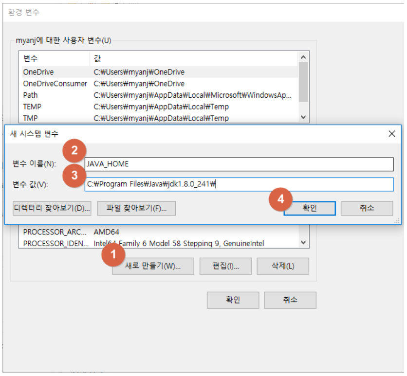

# Java


### JDK 설치

https://myanjini.tistory.com/122


### Eclipse 설치

https://myanjini.tistory.com/123


* JDK : Java Development Kit
  * JDK는 JRE를 포함하고 있다.
* JRE : Java Runtime Environment
  * 자바 기반의 프로그램이 동작하기 위한 최소 환경. 기본적인 API와 그걸 실행시켜주는 환경


* IDE : 통합 개발 환경
  * 에디터(편집기), 컴파일러, 링커, 디버깅... 등을 묶어놓은 것
  * ex) Visual Studio


* 퍼스펙티브(Perspective) : 작업을 하기위해 필요한 도구들을 모아놓은 환경


* Java
  * EE : JAVA EE (Java Platform EnterPrise Edition)
  * SE : JAVA SE (Java Platform Standard Edition)
  * ME : JAVA ME (Java Platform Micro Edition)


### What is Java?

https://www.youtube.com/watch?time_continue=6&v=2Xa3Y4xz8_s&feature=emb_logo


**플랫폼에 맞는 컴파일러를 이용해서 플랫폼에 맞는 각각의 실행 파일을 생성해야 함**

플랫폼 별로 컴파일러를 다르게 운영해야 한다 => 불편하다


이진수. 0과 1로 구성된 데이터

Punched Card


사람이 조금 더 쉽게 알 수 있는 형태로 바꾸자 => 어셈블리어

사람이 어느정도 이해할 수 있는 어셈블리어를 기계가 이해할 수 있는 언어(이진수)로 바꿔주는 것을 어셈블러라고 한다. => 기계 자체를 이해해야만 쓸 수 있다.


자연어 : 사람이 가장 쉽게 이해할 수 있는 언어

기계어 : 기계가 이해할 수 있는 언어

어셈블리어 : 자연어와 기계어 중간에 있는 언어


컴파일러 : 자연어를 어셈블리어로 바꿔주는 역할

어셈블러 : 어셈블리어를 기계어로 바꿔주는 역할


**Java VM이 설치되면 플랫폼에 관계없이 동일한 코드가 실행될 수 있음**


기존에는 해당하는 플랫폼에 맞는 컴파일러를 통해 실행 파일을 만들어야 했다.

java file(Source)을 컴파일 하면 Byte Code가 생성되고, Java Virtual Machine만 설치되어 있으면 플랫폼에 상관 없이 동작할 수 있다.


Java VM이 설치되면 플랫폼에 관계없이 동일한 코드가 실행될 수 있음

.java file  ------>  javac  ------>  .class file  ----->  java  ----->  실행

(Source)                                  (Byte Code)


Java Virtual Machine = Java VM = JVM


### JVM 동작


### JVM 구조(아키텍처)


Heap : 공유되는 자원이 들어간다.

Stack : 지역변수같은 것이 들어간다.


### 소스 코드를 만들어서 실행하는 절차

작성(편집) ---> 컴파일 ---> 링크 ---> 로더 ---> 실행


#### 예) C


object 파일을 묶어서 하나의 exe 파일을 만든다.


#### 예) Java


개별적으로 만들어져 있는 class file들이 실행 시점에 JVM에 의해 묶여서 실행된다.


### JAVA_HOME 및 PATHE 환경변수 등록


시작 => "시스템 환경 변수"검색 => 시스템 환경 변수 편집


환경 변수 => 시스템 변수 => 새로 만들기





변수 이름 : JAVA_HOME

변수 값 : C:\Program Files\Java\jdk1.8.0_241


C:\Program Files\Java\jdk1.8.0_241\bin


명령 프롬프트를 새로 실행 후 확인

```bash
C:\Users\TTak>set JAVA_HOME
JAVA_HOME=C:\Program Files\Java\jdk1.8.0_241
```


```bash
C:\Users\TTak>set PATH
Path=C:\Program Files (x86)\Common Files\Oracle\Java\javapath;C:\ProgramData\DockerDesktop\version-bin;C:\Program Files\Docker\Docker\Resources\bin;C:\WINDOWS\system32;C:\WINDOWS;C:\WINDOWS\System32\Wbem;C:\WINDOWS\System32\WindowsPowerShell\v1.0\;C:\WINDOWS\System32\OpenSSH\;C:\Users\TTak\.dnx\bin;C:\Program Files\Microsoft DNX\Dnvm\;C:\Program Files (x86)\Windows Kits\8.1\Windows Performance Toolkit\;C:\Program Files\Microsoft SQL Server\130\Tools\Binn\;C:\Program Files (x86)\Microchip\xc8\v2.05\bin;C:\Program Files (x86)\Microchip\xc16\v1.36\bin;C:\Program Files (x86)\Microchip\xc32\v2.15\bin;C:\Program Files (x86)\Microchip\xc16\v1.21\bin;C:\Program Files\Git\cmd;C:\Program Files\nodejs\;C:\Program Files\Java\jdk1.8.0_241\bin;C:\Program Files\MySQL\MySQL Shell 8.0\bin\;C:\Users\TTak\AppData\Local\Microsoft\WindowsApps;C:\Program Files\Intel\WiFi\bin\;C:\Program Files\Common Files\Intel\WirelessCommon\;C:\Program Files\MySQL\MySQL Server 8.0\bin;C:\Users\TTak\AppData\Local\Programs\Microsoft VS Code\bin;C:\Users\TTak\AppData\Roaming\npm
PATHEXT=.COM;.EXE;.BAT;.CMD;.VBS;.VBE;.JS;.JSE;.WSF;.WSH;.MSC
```


```bash
C:\Users\TTak>javac
Usage: javac <options> <source files>
where possible options include:
  -g                         Generate all debugging info
  -g:none                    Generate no debugging info
  -g:{lines,vars,source}     Generate only some debugging info
  ...
```


* 환경변수
  * 운영체제에서 제공해주는 기본적인 정보 중 JAVA_HOME이라는 정보를 설정해 준 것
  * 내가 설치해둔 Java가 어느 경로에 설치되어 있는지 알려준다.
  * 이 PC에서 프로그램이 돌아가려고 하면 기본적으로 Java가 어디에 설치되어 있는지 알아야 한다.
  * 어디서든지 Java 명령어를 쓸 수 있도록 설정해준다.


### HelloJava.java 파일 생성


#### 명령 프롬프트 이용

메모장에 해당 내용 입력

```java
class HelloJava {
    public static void main (String args[]) {
        System.out.println("Hello Java!!!");
    }
}
```


명령 프롬프트 실행

```bash
C:\eclipse-workspace>javac HelloJava.java

C:\eclipse-workspace>dir
 C 드라이브의 볼륨: Local Disk
 볼륨 일련 번호: DA3B-749D

 C:\eclipse-workspace 디렉터리

2020-02-17  오전 10:43    <DIR>          .
2020-02-17  오전 10:43    <DIR>          ..
2020-02-17  오전 09:41    <DIR>          .metadata
2020-02-17  오전 10:43               425 HelloJava.class ⇐ Java ByteCode File
2020-02-17  오전 10:43               120 HelloJava.java  ⇐ Java Source File
               2개 파일                 545 바이트
               3개 디렉터리  103,582,502,912 바이트 남음
               
C:\eclipse-workspace>java HelloJava
Hello Java!!!  ⇐ HelloJava 실행 결과
```


#### Eclipse 이용


```java
public class HelloJava {

	public static void main(String[] args) {
		System.out.println("HelloJava!!!");
	}

}
```


콘솔 창에서 실행 결과를 확인


src 디렉터리에 코드가 들어가고 bin 디렉터리에 컴파일 된 파일이 들어간다.


HelloJava 프로젝트 오른쪽 클릭 => Build Path => Configure Build Path...


개발을 여러가지 버전에서 해야하는 경우 실행 환경을 바꿔줘야 한다.

오류가 생길 경우 해당 라이브러리가 잘 포함되어 있는지 확인


내가 사용하는 라이브러리가 중복되어 설치되어 있는 경우 어떤 것을 우선적으로 사용할지 설정


* Java는 이름을 맞춰줘야 한다. 파일 이름과 프로젝트 이름이 동일해야 한다.
* public은 접근제한자이다.
  * 접근 허용 범위를 나타내는 기호.
  * 내가 만든 이 class를 public 하겠다. 외부에서, 다른 프로그램에서 호출, 접근, 사용할 수 있도록 허용
  * 반대 개념이 private. 그 안에서만 실행되도록 제한을 둔다.

* 메서드에서의 public : 해당하는 메서드를 쓸 수 있도록 하겠다.
* static : 인스턴스가 하나만 생성된다.


* Java에서 class는 일반적으로 대문자로 시작한다.
* VM이 제공하는 기능들을 사용할 때 System을 쓴다.

* out : 출력

* println : 기본 출력문


---

### Package


* Package
  * Package java.lang
  * https://docs.oracle.com/javase/7/docs/api/java/lang/package-summary.html


* 패키지명은 클래스를 구분하는 용도로도 사용된다. => 유니크한 이름을 사용


프로젝트(HelloJava) 오른쪽 클릭 => New => Package

mulcam.msa.samples 패키지 생성


mulcam.msa.samples 패키지 오른쪽 클릭 => New => Class

HelloJava class 생성


mulcam.msa.samples => HelloJava.java

```java
package mulcam.msa.samples;

public class HelloJava {
	public void print() {
		System.out.println("Hello Java!");
	}
}
```

sysout + Ctrl + spacebar


(default package) => HelloJava.java

```java
public class HelloJava {

	public static void main(String[] args) {
		mulcam.msa.samples.HelloJava hj = new mulcam.msa.samples.HelloJava();
		hj.print();
	}

}
```


Console

```bash
Hello Java!
```


---

mulcam.msa.samples 패키지 오른쪽 클릭 => New => Class

HelloWorld class 생성


mulcam.msa.samples => HelloWorld.java

```java
package mulcam.msa.samples;

public class HelloWorld {
	public void print() {
		System.out.println("Hello World!!!");
	}
}
```


(default package) => HelloJava.java

```java
public class HelloJava {

	public static void main(String[] args) {
		mulcam.msa.samples.HelloJava hj = new mulcam.msa.samples.HelloJava();
		hj.print();
		mulcam.msa.samples.HelloWorld hw = new mulcam.msa.samples.HelloWorld();
		hw.print();
	}

}
```


Console

```java
Hello Java!
Hello World!!!
```


---

(default package) => HelloJava.java

```java
import mulcam.msa.samples.HelloWorld;

public class HelloJava {

	public static void main(String[] args) {
		mulcam.msa.samples.HelloJava hj = new mulcam.msa.samples.HelloJava();
		hj.print();
		HelloWorld hw = new HelloWorld();
		hw.print();
	}

}
```


import를 이용해 내가 사용할 패키지를 미리 적어둔다 => class명을 안쓰고 사용 가능

아래쪽에서 사용하는 class들의 출처를 나타내준다.


동일한 이름을 가지고 있는 하위 패키지의 calss를 사용할 경우 명시적으로 나타내줘야 한다.


* 패키지
  * 만드는 사람 입장에서는 관련있는 것 끼리 묶어준다.
  * 사용자 입장에서는 해당하는 class를 구분하는 용도이다.


---

### OOP


* OOP
  * 추상화, 캡슐화, 상속, 다형성 등의 장점이 생긴다.


* 추상화
  * 일반화되어있는 요소들의 공통 요소를 뽑아내는 작업
  * 개별 요소들의 공통 요소를 뽑아서 만드는 작업
  * ex) 개, 고양이, 뱀 => 공통요소 : 움직인다, 먹는다, 잔다...
    * 가지고 있는 속성과 동작들을 공통된 요소들을 뽑으면 동물이라는 객체를 나타내는 요소가 된다.


* 캡슐화
  * 구성되어 있는 것을 다른 사람이 직접 값을 변동할 수 있으면 내가 원하지 않는 형태대로 값이 바뀔 수 있다. => data에 대해서는 직접 access 할 수 없도록 만든다.
  * data에 대해서 access 하기 위해서는 내가 제공해주는 함수를 이용해서 data를 handling하도록 만든다.
  * 함수를 만들어놓으면 그 함수를 가지고 access 하기 때문에 데이터에 대한 보호를 할 수 있다.


getter : 외부로 제공해 주는 것

해당하는 data를 외부로 전달해준다.

```java
public String getName() {
    return this.name;
}
```


setter : 외부에서 값을 설정해주는 것

반환하는 것이 없기 때문에 void

```java
public void setName(String name) {
    this.name = name;
}
```


---

### 변수 (variable)

값을 저장할 수 있는 메모리의 특정 주소에 붙여진 이름


#### 변수 선언


```java
int    age;     ⇐ 정수(int)값을 저장할 수 있는 age 변수를 선언
double value;   
====== =====
타입   이름
```


동일 타입의 변수는 콤마로 구분해서 동시에 정의

```java
int x; ⇒ int x, y, z;
int y;
int z;
```


#### 변수 이름 규칙

* 첫번째 글자는 문자, "$", "_"이어야 하고, 숫자로 시작할 수 없다.
  * price, $price, _companyName ⇐ 가능
  * 1v, @speed, $#value ⇐ 불가능
* 영어 대소문자를 구분한다.
  * firstName과 firstname은 다른 변수이다.
* 첫번째 글자는 소문자로 시작하고, 다른 단어가 붙을 경우 첫문자를 대문자로 한다. (관례)
  * maxSpeed, firstName, carBodyColor, …
* 변수 이름의 길이는 제한이 없다.
* 자바 예약어는 변수 이름으로 사용할 수 없다.


#### 자바 예약어

* 자바 언어에서 의미를 가지고 사용되는 단어
  * 기본 타입 ⇒ boolean, byte, char, short, int, long, float, double
  * 접근 제한자 ⇒ private, public, protected
  * 클래스와 관련된 것 ⇒ class, abstract, interface, extends, implements, enum
  * 객체와 관련된 것 ⇒ new, instanceof, this, super, null
  * 메소드와 관련된 것 ⇒ void, return
  * 제어문과 관련된 것 ⇒ if, else, switch, case, default, for, do, while, break, continue
  * 논리값 ⇒ true, false
  * 예외 처리와 관련된 것 ⇒ try, catch, finally, throw, throws
  * 기타 ⇒ package, import, synchronized, final, static


변수에 값을 저장할 때 대입 연산자를 사용

```java
int score; 		// ⇐ 변수를 선언
score = 90;		// ⇐ 변수에 값을 대입
```


변수 초기화 = 변수에 최초로 값을 대입하는 것

```java
int score = 90; 	// ⇐ 변수 선언과 동시에 값을 할당(초기화)
```


변수를 초기화하지 않고 변수를 사용할 수 있을까?

→ 초기화하지 않으면 사용할 수 없다.


변수 사용 = 변수 값을 이용해서, 출력문이나 연산식을 수행하는 것

```java
public class HelloJava {
	public static void main(String[] args) {
		int hour = 3;
		int minute = 5;

		//	출력문에 사용
		System.out.print(hour + "시간 " + minute + "분은 ");
		
		//	계산식에서 사용 
		int totalMinute = hour * 60 + minute;
		System.out.println(totalMinute + "분입니다.");		
	}
}
```

Console

```bash
3시간 5분은 185분입니다.
```

문자열 타입 더하기 => 문자열로 묶인다.

ln : new line


변수 값 복사 = 변수의 값을 다른 변수에 저장

```java
int x = 10;
int y = x;
x = 20;
System.out.println("x = " + x + ", y = " + y);  // x = 20, y = 10
```


```java
int[] x = new int[ 10 ];
int[] y = x;
x[0] = 20;
System.out.println("x = " + x[0] + ", y = " + y[0]);  // x = 20, y = 20
```


로컬 변수 = 메소드 블록 내에서 선언된 변수

→ 메소드 블록 내에서만 사용이 가능

→ 메소드 실행이 끝나면 자동으로 삭제

```java
public class HelloJava {
	public static void main(String[] args) {
		int value = 10;
		int sum = value + 20;
		System.out.println(sum);  // 30
		
		sum = HelloJava.add(3, 4);
		System.out.println(sum);  // 7
	}
	
	public static int add(int x, int y) {
		return x + y;
	}
}
```

변수의 scope가 괄호로 묶인다. local 변수


```java
public class HelloJava {     
    public static void main(String[] args) {   ------------+
        int value1 = 10;                                   |
        if (value1 > 0) {           ----------------+      |
            int value2 = 20;                        |      |
            System.out.print(value1);               |      |
            System.out.print(value2);               |      |
        }                           ----------------+      |
        for (int i = 0; i < 1; i ++) {      --------+      |
            int value3 = 30;                        |      |
            System.out.print(value1);               |      |
            //System.out.print(value2);             |      |
            System.out.print(value3);               |      |
        }                           ----------------+      |
        System.out.print(value1);                          |
        //System.out.print(value2);                        |
        //System.out.print(value3);                        |
    }       -----------------------------------------------+
}

```

메서드 블럭, if 블럭, for 블럭


해당하는 class의 인스턴스를 만들거나 static으로 선언해서 사용하는 방법이 있다.

```java
static final int value = 100;
```


### Java Data Type

정수 타입 ⇒ byte, char, short, int, long

실수 타입 ⇒ float, double

논리 타입 ⇒ boolean


```markdown
Java Data Type
ㄴ Primitive Type
	ㄴ Boolean Type (boolean)
	ㄴ Numeric Type
		ㄴ Integral Type
			ㄴ Integer Type (short, int, long)
			ㄴ Floating Point Type (float, double)
		ㄴ Character Type (char)
ㄴ Reference Type
	ㄴ Class Type
	ㄴ Interface Type
	ㄴ Array Type
	ㄴ Enum Type
	ㄴ etc.
```


```
Type        Bits      Range of Values
----------------------------------------------------------------------------------------
byte         8bits    -2^7  ~ 2^7-1  (-128 ~ 127)
short       16bits    -2^15 ~ 2^15-1 (-32768 ~ 32767)
int         32bits    -2^31 ~ 2^31-1 (-2147483648 ~ 2147483647)
long        64bits    -2^63 ~ 2^63-1 (-9223372036854775808 ~ 9223372036854775807)
float       32bits    0x0.000002P-126f ~ 0x1.fffffeP+127f
double      64bits    0x0.0000000000001P-1022 ~ 0x1.fffffffffffffP+1023  
char        16bits    \u0000 ~ \uffff (0 ~ 2^15-1) * 자바에서 unsgined로 동작하는 자료형
boolean      1bit     true, false
```


리터럴(literal) = 소스 코드에서 프로그래머가 직접 입력한 값

```
String name = "hong-gildong";
int    age  = 23;
------ ----   --------------
타입   이름   리터럴 
```


### 정수 리터럴

* 2진수 : 0b 또는 0B로 시작하고 0과 1로만 구성
  * 0b1011  	⇒ 11
  * 0B10100  	⇒ 20
* 8진수 : 0으로 시작하고 0~7 사이의 숫자로 구성
  * 013		⇒ 11
  * 0206		⇒ 134
* 10진수 : 소수점 없이 0~9 사이의 숫자로 구성
* 16진수 : 0x 또는 0X로 시작하고 0~9, a~f(A~F) 사이의 문자로 구성


### char 타입 - 하나의 문자를 저장

작은 따움표로 감싼 문자 리터럴

```java
char var1 = 'A';		⇒ 유니코드 65
char var2 = '';
char var3 = '홍';
char var4 = 65;   	⇒ 'A'
char var5 = 0x0041; 	⇒ 'A'
```


### 문자열(String)

큰 따움표로 감싼 문자들

```java
char var1 = "A"; 	⇒ X
String var2 = 'A';	⇒ X
String var3 = "A";	⇒ O
```


### 이스케이프 문자(escape)

문자열 내부에서 \는 이스케이프 문자를 뜻 함

```java
// 나는 "자바"를 좋아합니다. 
String str = "나는 \"자바\"를 좋아합니다.";

// 번호 	이름 		나이   (항목들을 일정 간격을 띄워쓰기)
String str = "번호\t이름\t나이";
```


```java
\t		⇒ 일정 간격(탭) 만큼 띄움
\n		⇒ 줄바꿈(라이피드)
\r		⇒ 캐리지 리턴
\"		⇒ " 출력
\'		⇒ ' 출력
\\		⇒ \ 출력
\u16진수	⇒ 16진수에 해당하는 문자를 출력
```


```java
public class HelloJava {
	public static void main(String[] args) {
		System.out.println("1\t2\t3\t4");
		System.out.println("a\tb\tc\td");
		
		System.out.println("1\n2\n3");
		System.out.println("a\rb\rc");
		
		System.out.println("1\"2\"3");
		System.out.println("1\'2\'3");
		System.out.println("1\\2\\3");
		
		System.out.println("1\u00413");	// u0041 = A
	}
}
```

Console

```
1	2	3	4
a	b	c	d
1
2
3
a
b
c
1"2"3
1'2'3
1\2\3
1A3
```


### 자동 타입 변환 (promotion)

값의 허용 범위가 작은 타입이 큰 타입으로 저장될 때 ⇒ 큰타입 = 작은타입;

```
byte < short < int < long < float < double
```


```java
byte byteValue = 10;
int intValue = byteValue;
```


char 타입을 int 타입으로 자동 타입 변환하면 유니코드 값이 int 타입에 저장

```java
public class HelloJava {
	public static void main(String[] args) {
		char charValue = 'A';
		int intValue = charValue;
		
		System.out.println(charValue);	// A
		System.out.println(intValue);	// 65
	}
}
```


### 강제 타입 변환 (casting)

큰 허용 범위 타입을 작은 허용 범위 타입으로 강제로 나누어 한 조각만 저장

⇒ **캐스팅 연산자**를 사용


작은허용범위타입 = (작은허용범위타입) 큰허용범위타입;


```java
    public static void main(String[] args) {
        int intValue = 256;
        byte byteValue = (byte)intValue;

        System.out.println(intValue);	// 256
        System.out.println(byteValue);	// 0

        // 실수 타입을 정수 타입으로 캐스팅하면 소수점 이하를 버림
        double doubleValue = 3.14;
        int intValue2 = (int)doubleValue;
        System.out.println(doubleValue);	// 3.14
        System.out.println(intValue2);		// 3
    }
```

Console

```
256
0
3.14
3
```


자동 타입 변환이 발생하는 경우 (예)


피 연산자 중 하나가 long 타입이면 다른 피연자는 long 타입으로 자동 변환

피 연산자 중 하나가 double 타입이면 다른 피연자는 double 타입으로 자동 변환


```java
	public static void main(String[] args) {
		// 정수 연산의 결과를 실수로 저장할 때
		{
			int x = 1;
			int y = 2;
			double result = x / y;
			System.out.println(result); // 0.0
		}		
		{ 
			int x = 1;
			int y = 2;
			double result = (double)x / y;
			System.out.println(result); // 0.5
		}
		{ 
			int x = 1;
			int y = 2;
			double result = x / (double)y;
			System.out.println(result); // 0.5
		}
		{ 
			int x = 1;
			int y = 2;
			double result = (double)x / (double)y;
			System.out.println(result); // 0.5
		}
	}
```


### + 연산자

* 문자열 결합 ⇐ 피연산자 중 하나라도 문자열인 경우 (나머지 피연산자는 모두 문자열로 자동 변환)
* 덧셈 연산 ⇐ 피연산자가 모두 숫자


```java
	public static void main(String[] args) {
		int value = 3 + 7;
		System.out.println(value);	// 10
		
		String s1 = "3" + 7;
		System.out.println(s1);		// "3" + 7 = "3" + "7" = "37"
		
		int value2 = 3 + 7 + 5;
		System.out.println(value2);	// 15
		
		String s2 = 1 + 2 + "3";
		System.out.println(s2);		// (1+2)+"3" = 3+"3" = "3"+"3" = "33"
		
		String s3 = 1 + "3" + 7;
		System.out.println(s3);		// "1"+"3"+7 = "13"+7 = "13"+"7" = "137"
	}
```


### 문자열을 기본 타입으로 강제 타입 변환

숫자 외 요소를 포함한 문자열을 숫자 타입 변환하면 NumberFormatException이 발생

```java
	public static void main(String[] args) {
		String stringValue = "";

		stringValue = "10";
		byte byteValue = Byte.parseByte(stringValue);

		stringValue = "200";
		short shortValue = Short.parseShort(stringValue);

		stringValue = "300000";
		int intValue = Integer.parseInt(stringValue);

		stringValue = "400000000";
		long longValue = Long.parseLong(stringValue);

		stringValue = "12.345";
		float floatValue = Float.parseFloat(stringValue);

		stringValue = "12.345";
		double doubleValue = Double.parseDouble(stringValue);

		stringValue = "true"; // or "false"					
		boolean booleanValue = Boolean.parseBoolean(stringValue);

		System.out.println(byteValue);		// 10
		System.out.println(shortValue);		// 200	
		System.out.println(intValue);		// 300000
		System.out.println(longValue);		// 400000000
		System.out.println(floatValue);		// 12.345
		System.out.println(doubleValue);	// 12.345
		System.out.println(booleanValue);	// true
	}
```


#### 기본 타입을 문자열로 변환

```java
String stringValue = String.valueOf(data);
```


### 시스템 입출력

```java
System.out.println("Hello Java!!!"); 
```

⇒ https://docs.oracle.com/javase/8/docs/api/java/lang/System.html


```java
println(내용) 	⇒ 내용을 출력하고 행을 변경
print(내용)		⇒ 내용만 출력
printf("형식문자열", 값1, 값2, …) ⇒ 첫번째 문자열 형식대로 내용을 출력
```


```java
	public static void main(String[] args) {
		String name = "홍길동";
		int age = 23;
		
		// 	이름: 홍길동, 나이: 23
		System.out.print("이름: " + name + ", ");
		System.out.println("나이: " + age);
		
		System.out.printf("이름: %s, ", name);
		System.out.printf("나이: %d\n", age);
		
		System.out.printf("이름: %s, 나이: %d\n", name, age);
	}
```


```
이름: 홍길동, 나이: 23
이름: 홍길동, 나이: 23
이름: 홍길동, 나이: 23
```


```java
%d			⇒ 정수						⇒ 123
%6d			⇒ 6자리 정수. 왼쪽 빈 자리 공백	⇒ ___123
%-6d		⇒ 6자리 정수. 오른쪽 빈 자리 공백	⇒ 123___
%06d		⇒ 6자리 정수. 외쪽 빈 자리 0 채움	⇒ 000123
```


예)

```java
	public static void main(String[] args) {
		System.out.printf("이름: %s, 나이: %3d\n", "홍길동", 3);
		System.out.printf("이름: %1$s, 나이: %2$3d\n", "이순신", 323);
	}
```


```
이름: 홍길동, 나이:   3
이름: 이순신, 나이: 323
```


```java
%10.2f	⇒ 소수점 이상 7자리, 소수점 이하 2자리. 왼쪽 빈자리 공백  	⇒ ____123.45
%-10.2f	⇒ 소수점 이상 7자리, 소수점 이하 2자리. 오른쪽 빈자리 공백 ⇒ 123.45____
%010.2f	⇒ 소수점 이상 7자리, 소수점 이하 2자리. 왼쪽 빈자리 0 채움 ⇒ 0000123.45
```


예)

```java
	public static void main(String[] args) {
		System.out.printf("%10.2f\n", 123.45);
		System.out.printf("%-10.2f\n", 123.45);
		System.out.printf("%010.2f\n", 123.45);
	}
```


```
    123.45
123.45    
0000123.45
```


```
\t		⇒ 탭
\n		⇒ 줄바꿈
%%		⇒ %
```


(문제)

System.out.printf 메소드를 이용해서 아래 문장(파란색)을 콘솔에 출력하시오. System.out.printf("%10.2f\n", 123.45); 함수의 실행 결과는?


(정답)

```java
public static void main(String[] args) {
    System.out.printf("%s", "System.out.printf(\"%10.2f\\n\", 123.45); 함수의 실행 결과는?");

    System.out.println(); // 한줄 띄우기 위한 용도
    System.out.printf("System.out.printf(\"%%10.2f\\n\", 123.45); 함수의 실행 결과는?");
}
```


### System.in.read()

키보드로 입력한 키코드를 읽어서 반환하는 메소드


* 한계
  * 2개 이상 키가 조합된 한글은 읽을 수 없음
  * 키보드로 입력된 내용을 통문자열로 읽을 수 없음


### Scanner 클래스

통문자열을 읽어 사용 가능

https://docs.oracle.com/javase/8/docs/api/index.html


Ctrl + Shift + O => 패키지가 선언되지 않았을 경우 사용. 적절한 패키지를 import 시켜준다.


```java
import java.io.IOException;
import java.util.Scanner;  // Ctrl + Shift + O

public class HelloJava {
	public static void main(String[] args) throws IOException {
		Scanner sc = new Scanner(System.in);
		
		String input = sc.nextLine();
		System.out.println(input);
	}
}
```


```java
import java.io.IOException;
import java.util.Scanner;

public class HelloJava {
	public static void main(String[] args) throws IOException {
		Scanner sc = new Scanner(System.in);
		
		String input = sc.nextLine();
		while (!input.contentEquals("X")) {
			System.out.println(input);
			input = sc.nextLine();
		}
	}
}
```


기본 타입 값 비교 ⇒ == 사용

문자열 타입 값 비교 ⇒ equals() 메소드 사용


```java
	public static void main(String[] args) throws IOException {
		int x = 5;
		System.out.println( x == 5 );	// true
		System.out.println( x == 6 );	// false
		
		//	s1과 s2는 동일한 메모리 공간을 참조
		//	s3와 s4는 각각의 메모리 공간을 참조
		String s1 = "Java";						
		String s2 = "Java";
		String s3 = new String("Java");
		String s4 = new String("Java");

		System.out.println( s1 == s2 );			// true  ⇐ 값 비교, 동일 주소이므로 true
		System.out.println( s1.equals(s2) );	// true  ⇐ 내용 비교
		System.out.println( s3 == s4 );			// false ⇐ 값 비교, 주소가 다르므로 false
		System.out.println( s3.equals(s4) );	// true
		System.out.println( s1 == s3 );			// false
		System.out.println( s1.equals(s3) );	// true		
	}
```

== 는 값을 비교한다. equals()는 내용을 비교한다.

== 를 사용하면 문자열이 저장된 주소를 비교 => 혼돈을 막기 위해 equals() 메소드 사용

