# Java

## 연산자와 연산식

* 연산자(operator) : 연산에 사용되는 표시나 기호
* 피연산자(operand) : 연산자와 함께 연산되는 데이터
* 연산식(expression) : 연산자와 피연산자를 사용하여 연산 과정을 기술한 것


### 연산자 종류

산출되는 값의 타입이 연산별로 다름

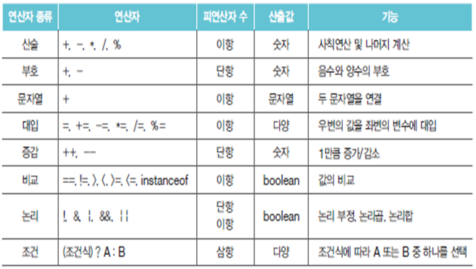


### 연산자의 우선순위

여러 연산식으로 구성된 연산은 다음 우선순위에 따라 수행

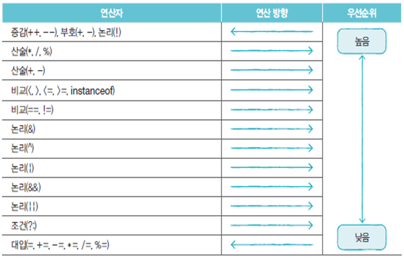


* 단항 → 이항 → 삼항

* 산술 → 비교 → 논리 → 대입 순
  
  ```java
  System.out.println( x > 0 && y < 0 );
  ```
  
* 우선순위가 같은 연산자는 왼쪽에서 오른쪽 방향으로 수행 (대입 연산자는 예외)
  
  ```java
  System.out.println( 100 * 2 / 3 % 5 );
  a = b = c = 5;
  ```
  
  

#### 괄호를 이용해서 연산자의 우선순위를 변경


File => New => Project... => Java Project => Next

Project name : Sample => Finish


Package Explorer 에서 Sample => src 오른쪽 클릭

New => Class


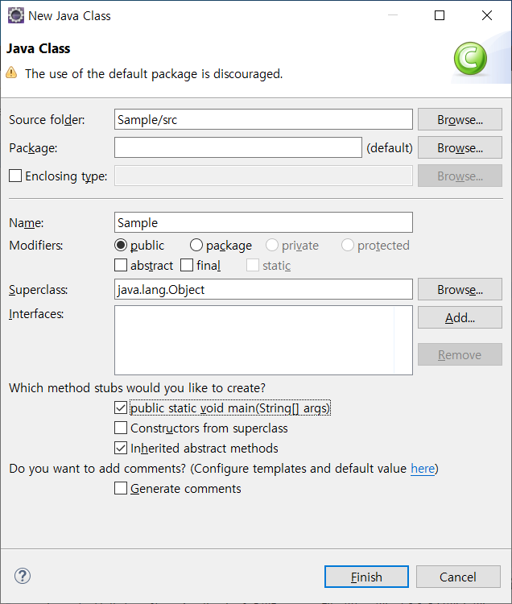


```java
public class Sample {
	public static void main(String[] args) {
		int var1 = 1;
		int var2 = 3;
		int var3 = 2;
		
		System.out.println( var1 + var2 * var3 );
		System.out.println( (var1 + var2) * var3 );
	}
}
```


```
7
8
```


### 단항, 이항, 삼항 연산자

피연산자의 수에 따라 구분

* 단항 연산자 : 부호, 증감 연산자
  
  ```java
  ++x;
  ```
  
* 이항 연산자 : 산술, 비교, 논리 연산자
  
  ```java
  x + y;
  ```
  
* 삼항 연산자 : 조건 연산자
  
  ```java
  (sum > 90) ? "A" : "B";
  ```
  
  

### 부호 연산자

boolean 타입과 char 타입을 제외한 기본 타입에 사용

**부호 연산자의 연산 결과는 int**

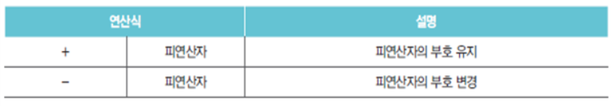


```java
public class Sample {
	public static void main(String[] args) {
		int x = -100;
		int result1 = +x;
		int result2 = -x;
		
		System.out.println(result1);
		System.out.println(result2);
		
		byte b = 100;
		//byte result3 = -b;  // Error
		int result3 = -b;
		System.out.println(result3);
	}
}
```

byte result3 = (byte)-b; 또는 int result3 = -b; 형식으로 처리해야 함 (후자를 권장)


```
-100
100
-100
```


### 증감 연산자

boolean 타입 외 모든 기본 타입 피연산자에 사용

다른 연산자와 함께 사용될 경우 증감 연산자 위치에 따라 결과가 달라질 수 있음


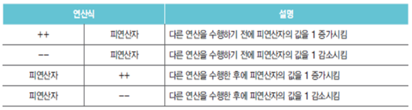


```java
public class Sample {
	public static void main(String[] args) {
		int x = 10;
		int y = 10;
		
		int result1 = ++x + 100;
		int result2 = y++ + 100;
		
		System.out.println(x);
		System.out.println(y);
		System.out.println(result1);
		System.out.println(result2);
	}
}
```


```
11
11
111
110
```


### 논리 부정 연산자

boolean 타입에만 사용 가능

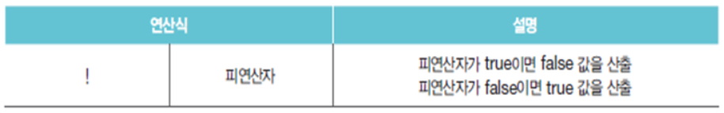


### 산술 연산자

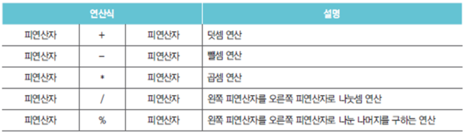

* 피연산자 타입이 동일하지 않을 경우 다음 규칙에 따라 일치시킨 후 연산을 수행
  * 피연산자가 byte, short, char 타입일 경우 모두 int 타입으로 변환
  * 피연산자가 모두 정수 타입이고 long 타입이 포함된 경우 모두 long 타입으로 변환
  * 피연산자 중 실수 타입이 있을 경우 허용 범위 큰 실수 타입으로 변환


### 문자열 결합 연산자

\+ 연산자의 피연산자 중 한 쪽이 문자열인 경우


### 비교 연산자

피연산자의 크기를 비교하여 true/false를 산출

동등 비교 연산자는 모든 타입에 사용 가능

크기 비교 연산자는 boolean 외 모든 기본 타입에 사용 가능

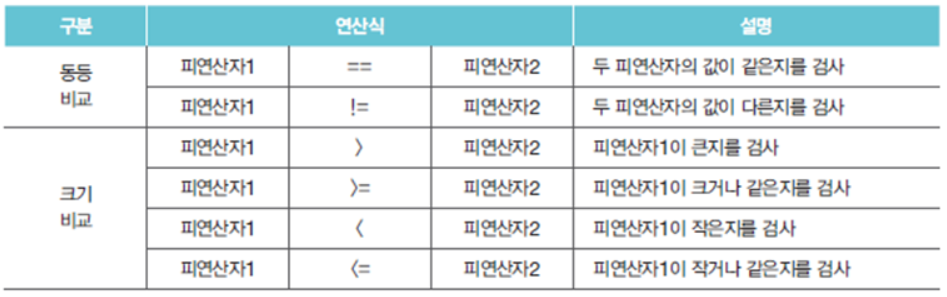


### LAB

입력한 글자의 알파벳 여부를 확인하시오.

```java
public static void main(String[] args) throws IOException {
    int input = System.in.read();
    if ((input >= 'a' && input <= 'z') || (input >= 'A' && input <= 'Z')) {
        System.out.println("입력한 '" + (char)input + "'은 알파벳입니다.");
    } else {
        System.out.println("입력한 '" + (char)input + "'은 알파벳이 아닙니다.");
    }
}
```


### 논리 연산자

boolean 타입만 사용 가능

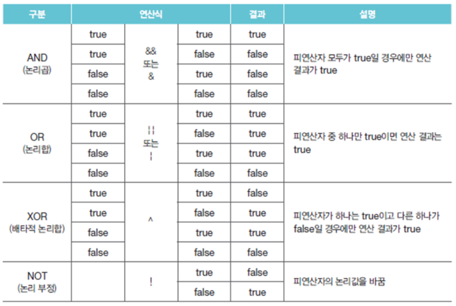


### 대입 연산자

오른쪽 피연산자의 값을 왼쪽 피연산자인 변수에 저장

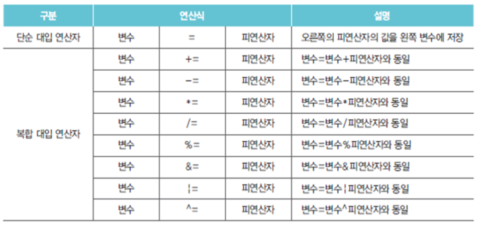


### 삼항 연산자

3개의 피연산자를 필요로 하는 연산자

? 앞의 조건식에 따라 콜론 앞뒤의 피연산자 선택

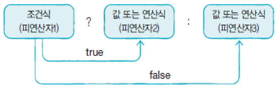


```java
public class Sample {
	public static void main(String[] args) {
		int score = 95;
		char grade;
		if (score > 90) {
			grade = 'A';
		} else {
			grade = 'B';
		}
		System.out.println(grade);
		
		score = 95;
		grade = score > 90 ? 'A' : 'B';
		System.out.println(grade);
	}
}
```


```
A
A
```


### LAB

사용자가 입력한 숫자가 홀수인지 짝수인지를 판단하시오.

java.util.Scanner 클래스 이용

```java
import java.io.IOException;
import java.util.Scanner;

public class Sample {
	public static void main(String[] args) throws IOException {
		String result = "";
		Scanner sc = new Scanner(System.in);
		int input = sc.nextInt();
		
		//	if-else 구문 이용
		if (input % 2 == 0) {
			result = "짝수";
		} else {
			result = "홀수";
		}
		System.out.printf("입력한 숫자는 %d는 %s입니다.\n", input, result);
		
		//	삼항 연산자 이용
		result = input % 2 == 0 ? "짝수" : "홀수";
		System.out.printf("입력한 숫자는 %d는 %s입니다.\n", input, result);
		
		sc.close();
	}
}
```


```
2
입력한 숫자는 2는 짝수입니다.
입력한 숫자는 2는 짝수입니다.
```


## 조건문

### if 문

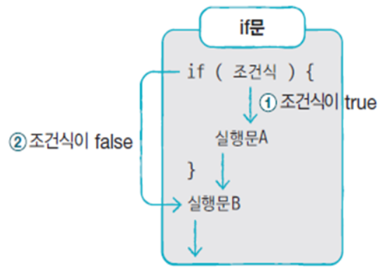


### if-else 문

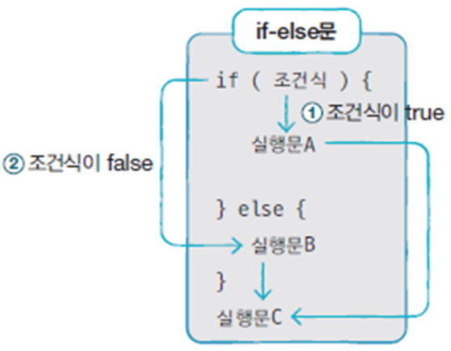


### if-else if-else 문

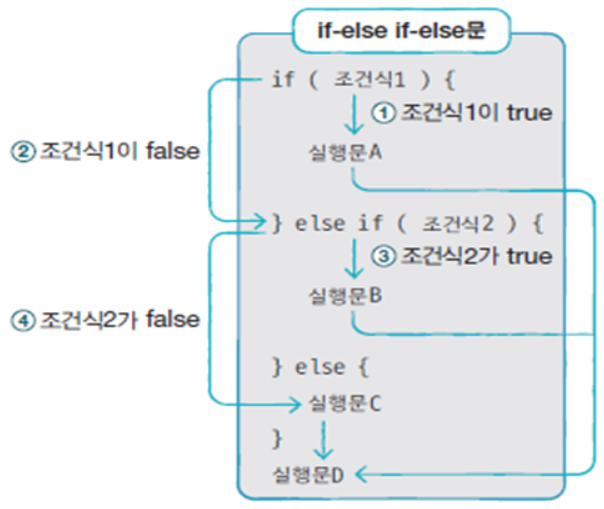


### switch 문

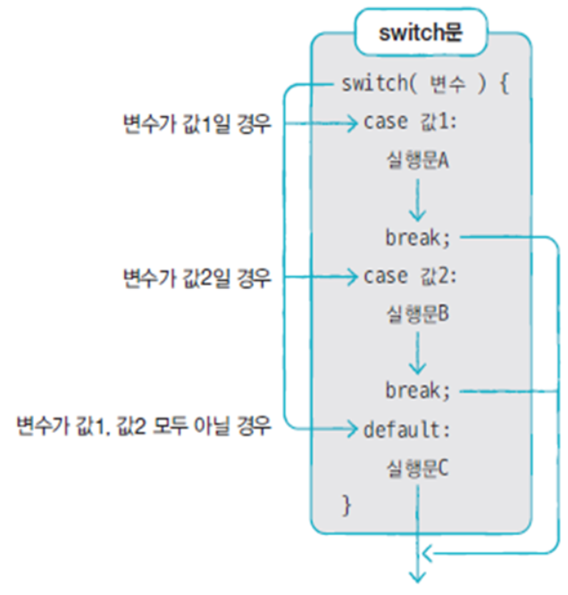


### LAB

사용자가 입력한 알파벳이 모음인지 자음인지를 판단하시오.

* System.in.read() 이용

* a, e, i, o, u ⇒ 모음


```java
import java.io.IOException;

public class Sample {
	public static void main(String[] args) throws IOException {
		int input = System.in.read();
		
		//	if-else 구문으로 구현
		if (input == 'a' || input == 'e' || input == 'i' || input == 'o' || input == 'u') {
			System.out.println("모음입니다.");			
		} else {
			System.out.println("자음입니다.");
		}
		
		//	switch-case 구문으로 구현
		switch(input) {
			case 'a' :
			case 'e' :
			case 'i' :
			case 'o' :
			case 'u' :
				System.out.println("모음입니다.");
				break;
			default : 
				System.out.println("자음입니다.");
				break;
		}
	}
}
```


```
b
자음입니다.
자음입니다.
```


## 반복문

### for 문


### while 문

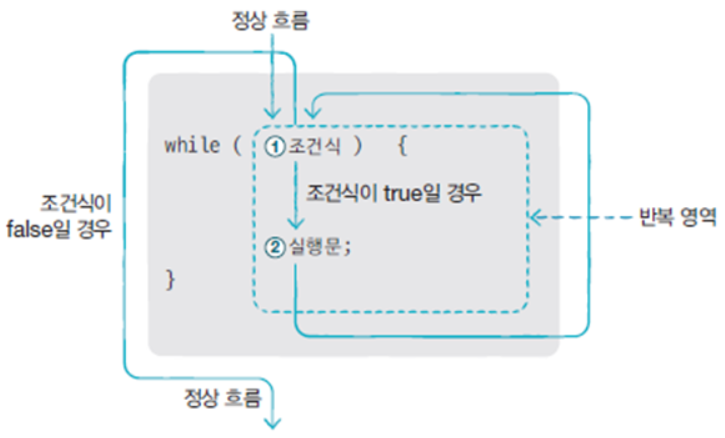


### do-while 문

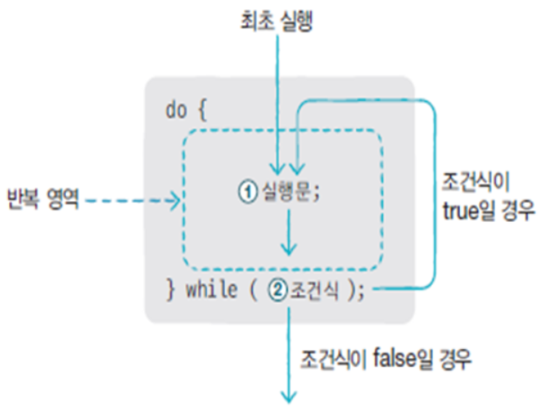


### break 문

for, while, do-while, switch 문의 실행을 중지할 때 사용

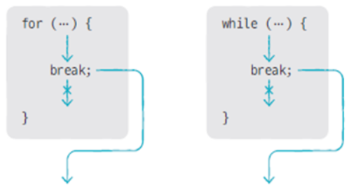


반복문이 중첩되어 있는 경우, Label을 이용해서 바깥 반복문을 빠져나갈 수 있음

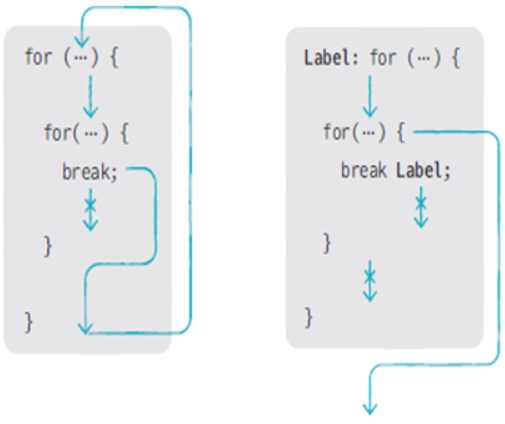


```java
	public static void main(String[] args) throws IOException {
		for (int i = 0; i < 3; i ++) {
			for (int j = 0; j < 3; j ++) {
				if (i == 1 && j == 1) break;
				System.out.printf("i = %d, j = %d\n", i, j);
			}
		}
		
		X: for (int i = 0; i < 3; i ++) {
			for (int j = 0; j < 3; j ++) {
				if (i == 1 && j == 1) break X;
				System.out.printf("i = %d, j = %d\n", i, j);
			}
		}
	}
```


```
i = 0, j = 0
i = 0, j = 1
i = 0, j = 2
i = 1, j = 0
i = 2, j = 0
i = 2, j = 1
i = 2, j = 2
i = 0, j = 0
i = 0, j = 1
i = 0, j = 2
i = 1, j = 0
```


### continue 문

for, while, do-while 문에서만 사용

for 문의 증감식, while, do-while 문의 조건식으로 이동

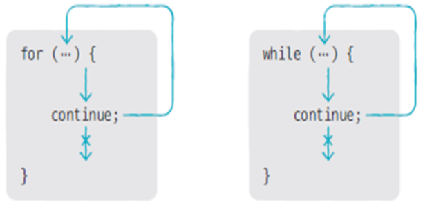


## 참조 타입(reference type)

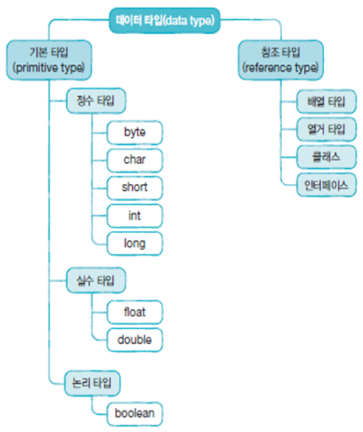

### 기본 타입 변수와 참조 타입 변수의 차이

* 기본 타입 변수

  ```java
  int age = 25;
  double price = 100.5;
  ```

* 참조 타입 변수

  ```java
  String name = "신용권";
  String hobby = "독서";
  ```

  

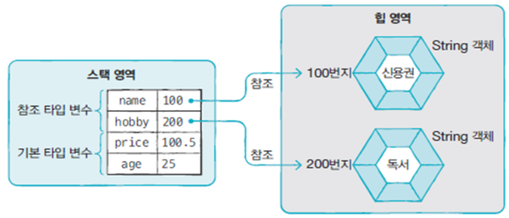


### 메모리 사용 영역 (Runtime Data Area)

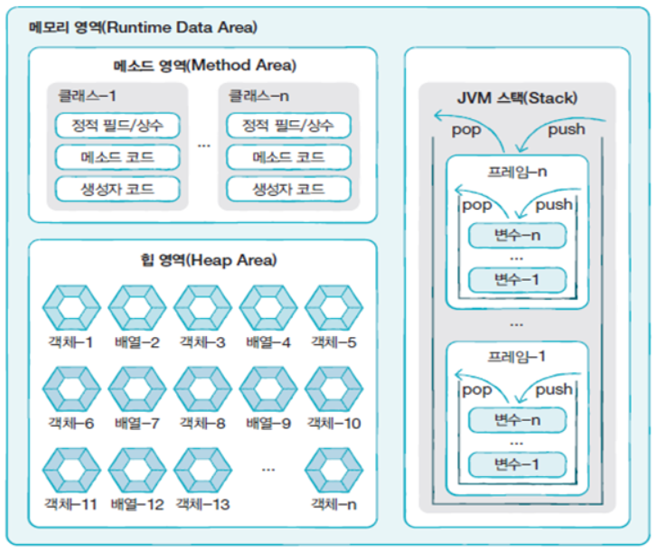

* 메소드 영역(method area) - 클래스별 정적 필드(static filed), 상수(constant), 생성자(constructor), 메서드(method) 코드 등을 분류해서 저장
* 힙 영역(heap area) - 객체와 배열이 생성되는 영역
* JVM 스택 영역(stack area) - 메소드가 호출되면 프레임이 추가되고, 메소드 종료되면 프레임이 제거됨


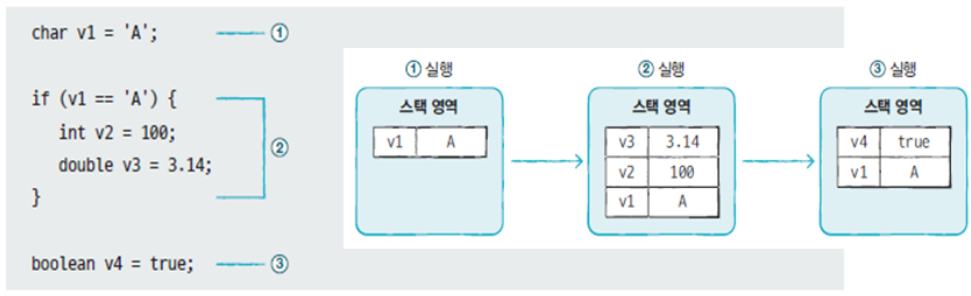


참조 타입 변수는 스택 영역에 힙 영역에 생성된 객체의 주소를 가짐

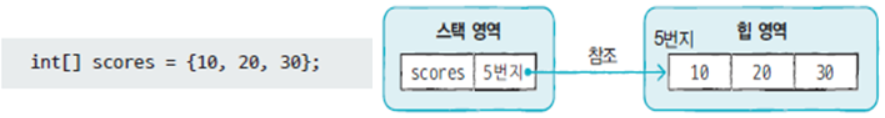


### 참조 타입 변수 간 ==, != 연산

동일 객체(= 같은 주소) 참조 여부를 판단할 때 사용 

```java
import java.io.IOException;

public class Sample {
	public static void main(String[] args) throws IOException {
		String s1 = "Java String";
		String s2 = "Java String";
		String s3 = new String("Java String");
		String s4 = new String("Java String");
		
		System.out.println( s1 == s2 );
		System.out.println( s1 == s3 );
		System.out.println( s1 == s4 );
		System.out.println( s3 == s4 );
		
		String s5 = null;
		String s6 = null;
		System.out.println( s5 == s6 );	// true
	}
}
```


```
true
false
false
false
true
```


### null

참조 타입 변수는 객체를 참조하지 않는다는 뜻으로 null 값을 가질 수 있음

null로 초기화된 참조 변수도 스택 영역에 생성

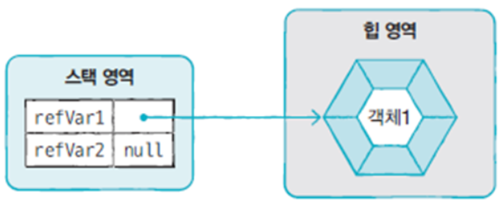


### NullPointerException

참조 타입 변수가 null 상태에서 존재하지 않는 객체의 데이터나 메소드를 사용하는 경우 발생

```java
	public static void main(String[] args) throws IOException {
		int[] intArray2;
		intArray2[0] = 100;
		
		int[] intArray = null;
		intArray[0] = 100;
		
		String str = null;
		System.out.println("총 문자수: " + str.length());
	}
```


### String 타입 변수에 문자열 리터럴을 대입하는 경우

문자열 리터럴을 힙 영역에 String 객체로 생성하고, 변수가 String 객체를 참조

```java
String name = "신용권";
String hobby = "자바";
```


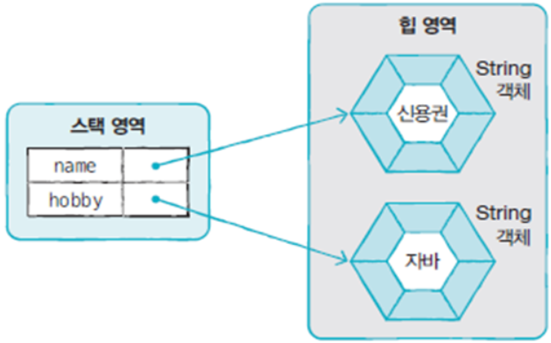


### 문자열 리터럴이 같은 경우에는 같은 String 객체를 공유

```java
String name1 = "신용권";
String name2 = "신용권";
```


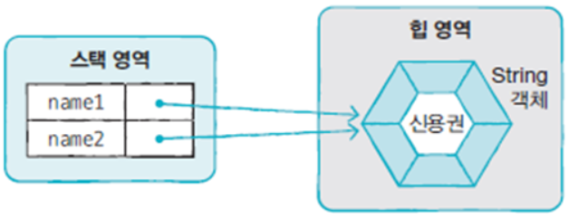


### new 연산자를 이용한 String 객체 생성

힙 영역에 새로운 String 객체를 생성

```java
String name1 = new String("신용권");
String name2 = new String("신용권");
```


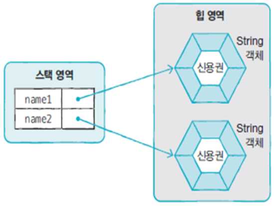


### 문자열 리터럴과 new 연산자로 생성된 객체를 비교

`==` ⇒ 주소를 비교

`equals()` ⇒ 값(문자열)을 비교


String 변수에 null 대입 → String 변수가 참조하는 객체가 없음 ⇒ 참조를 읽은 String 객체는 Garbage Collector를 통해 메모리에서 자동으로 제거


```java
String hobby = "여행";
hobby = null;
```


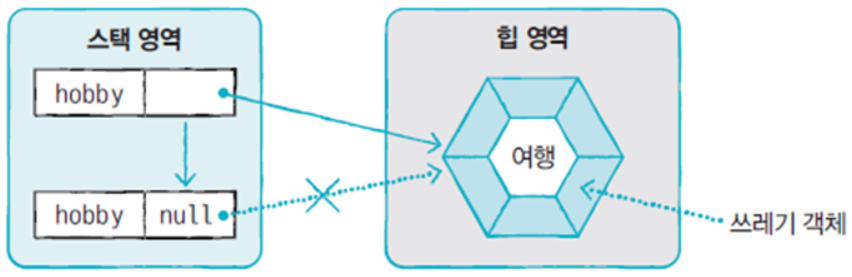


### 배열(array)

#### 배열 변수 선언

```java
int[] intArray;  
int intArray[];
```


#### 배열 생성 방법 1. 값 목록으로 배열 생성

```java
타입[] 변수 = { 값0, 값1, 값2, … };
```


배열 변수 선언 후 다른 실행문으로 값 목록으로 배열 생성하는 것은 불가능

```java
타입[] 변수;
변수 = { 값0, 값1, 값2, … }; 	// ⇐ 컴파일 오류가 발생
```


배열 변수 선언 후 값 목록이 나중에 결정되는 경우 → new 연산자를 사용

```java
타입[] 변수;
변수 = new 타입[] { 값0, 값1, 값2, … };
```


```java
	public static void main(String[] args) throws IOException {
		String[] names;
		//	names = { "홍길동", "이순신" };
		
		names = new String[] { "홍길동", "이순신" };
		for (int i = 0; i < names.length; i ++) {
			System.out.println(names[i]);
		}
	}
```


```
홍길동
이순신
```


#### 배열 생성 방법 2. new 연산자를 이용한 배열 생성

→ 타입별 기본값으로 배열 요소가 초기화

```java
타입[] 변수 = new 타입[배열크기];
```


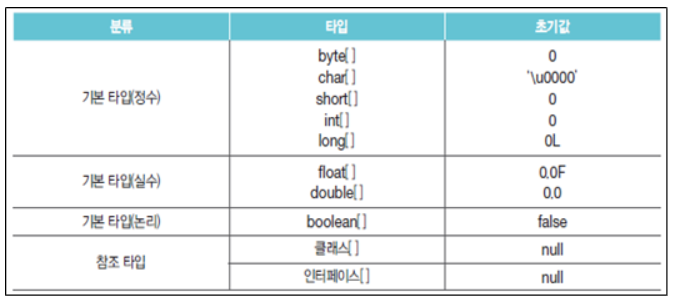


```java
	public static void main(String[] args) throws IOException {
		String[] names;
		names = new String[10];
		for (int i = 0; i < names.length; i ++) {
			System.out.printf("names[%d] = %d\n", i, names[i]);
		}
		
		int[] numbers = new int[10];
		for (int i = 0; i < numbers.length; i ++) {
			System.out.printf("numbers[%d] = %d\n", i, numbers[i]);
		}
	}
```


```
names[0] = null
names[1] = null
names[2] = null
names[3] = null
names[4] = null
names[5] = null
names[6] = null
names[7] = null
names[8] = null
names[9] = null
numbers[0] = 0
numbers[1] = 0
numbers[2] = 0
numbers[3] = 0
numbers[4] = 0
numbers[5] = 0
numbers[6] = 0
numbers[7] = 0
numbers[8] = 0
numbers[9] = 0
```


### main() 메소드의 String[] args 매개변수

HelloJava.java

```java
public class HelloJava
{
	public static void main(String[] args) {
		for (int i = 0; i < args.length; i ++) {
			System.out.printf("args[%d] = %s\n", i, args[i]);
		}
	}
}
```


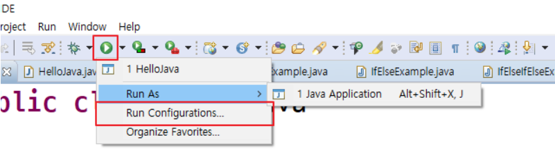


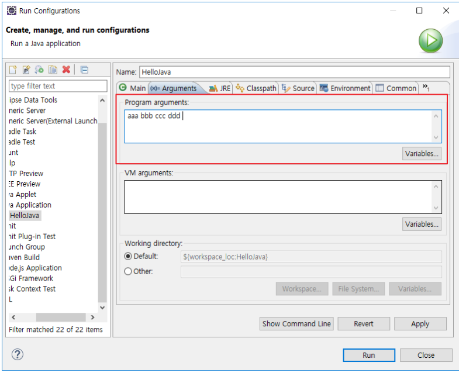


```
args[0] = aaa
args[1] = bbb
args[2] = ccc
args[3] = ddd
```


cmd

```bash
C:\eclipse-workspace\HelloJava\bin>java HelloJava aaa bbb ccc ddd eee
args[0] = aaa
args[1] = bbb
args[2] = ccc
args[3] = ddd
args[4] = eee
```


---

Gugudan.java 파일을 생성

파라미터로 전달한 단을 출력 (여러 단을 입력하면 낮은 단에서 높은 단으로 순차적으로 출력)

예) java Gugudan 5 7 9 4 ⇒ 4단, 5단, 7단, 9단을 출력


```java
import java.util.Arrays;

public class Gugudan {
	public static void main(String[] args) {
		Arrays.sort(args);
		for (String arg : args) {
			for (int i = 1; i < 10; i++) {
				int dan = Integer.parseInt(arg);
				System.out.printf("%2d x %d = %2d\n", dan, i, dan * i);
			}
			System.out.println();
		}
	}
}
```


```bash
C:\eclipse-workspace\Gugudan\bin>java Gugudan 5 7 9 4
 4 x 1 =  4
 ...
 4 x 9 = 36

 5 x 1 =  5
 ...
 5 x 9 = 45

 7 x 1 =  7
 ...
 7 x 9 = 63

 9 x 1 =  9
 ...
 9 x 9 = 81
```


---

다음과 같은 출력의 프로그램을 작성하시오.

```
java SortName
인원수는? 4
이름은? 홍길동
이순신
장보고
대조영
정렬결과 >>> 대조영, 이순신, 장보고, 홍길동
```


```java
import java.util.Arrays;
import java.util.Scanner;

public class SortName {
	public static void main(String[] args) {
		Scanner sc1 = new Scanner(System.in);
		Scanner sc2 = new Scanner(System.in);
		
		System.out.print("인원수는? ");
		int count = sc1.nextInt();
		
		System.out.print("이름은? ");
		String[] names = new String[count];
		for (int i = 0; i < count; i++) {
			names[i] = sc2.nextLine();
		}
		sc1.close();
		sc2.close();
		
		Arrays.sort(names);
		for (int i = 0; i < names.length; i++) {
			if (i == 0) {
				System.out.print("정렬결과 >>> ");
			}
			System.out.print(names[i]);
			if (i != names.length-1) {
				System.out.print(", ");
			}
		}
	}
}
```


---

프로그램 실행 시 전달된 문장에 포함된 단어를 역순으로 출력하시오.

```java
java ReverseWord "Welcome to Java World"
>>> emocleW ot avaJ dlroW
```

[참고] String.split() 메소드, String.charAt() 메소드


```java
public class ReverseWord {
	private static final String DELIMITER=" ";
	public static void main(String[] args) {
		String[] words = args[0].split(DELIMITER);
		System.out.print(">>> ");
		for (String word : words) {
			for (int i = word.length()-1; i >= 0; i--) {
				System.out.print(word.charAt(i));
			}
			System.out.print(" ");			
		}
	}
}
```


### 2차원 배열

#### 행렬 구조

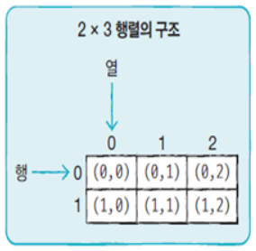


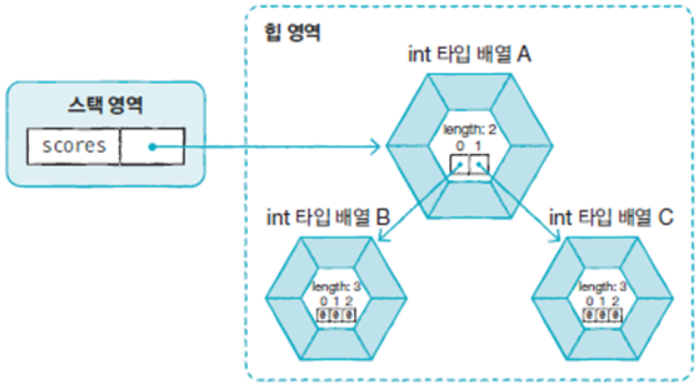


```java
int[][] scores = new int[2][3];
scores.length 		⇒ 2 // A
scores[0].length 	⇒ 3 // B
scores[1].length 	⇒ 3 // C
```


#### 계단식 구조

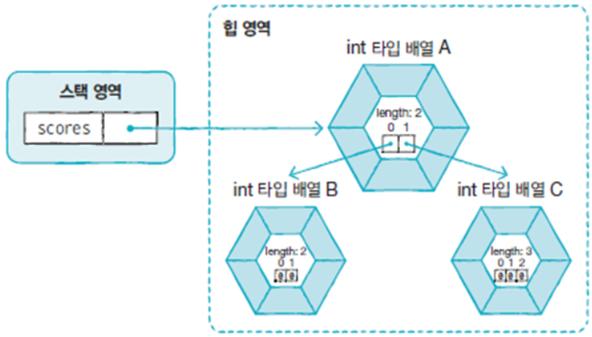


```java
int[][] scores = new int[2][];
scores[0] = new int[2];
scores[1] = new int[3];
scores.length 		⇒ 2 // A
scores[0].length 	⇒ 2 // B
scores[1].length 	⇒ 3 // C
```


#### 값 목록을 이용한 2차원 배열 생성

```java
타입[][] 변수 = { { 값1, 값2, … }, { 값1, 값2, … }, … };
```


```java
public class Sample {
	public static void main(String[] args) {
		int[][] scores = { { 95, 80 },
						   { 92, 75 },
						   { 20, 90 } };
		
		System.out.printf("scores[0][0] = %d\n", scores[0][0]);
		System.out.printf("scores[1][1] = %d\n", scores[1][1]);
		System.out.printf("scores.length = %d\n", scores.length);
		System.out.printf("scores[0].length = %d\n", scores[0].length);
		System.out.printf("scores[1].length = %d\n", scores[1].length);
	}
}
```


```
scores[0][0] = 95
scores[1][1] = 75
scores.length = 3
scores[0].length = 2
scores[1].length = 2
```


### 참조 타입 배열

```java
public class Sample {
	public static void main(String[] args) {
		String[] strArray = new String[3];
		strArray[0] = "Java";
		strArray[1] = "Java";
		strArray[2] = new String("Java");
		
		System.out.println( strArray[0] == strArray[1] );
		System.out.println( strArray[0] == strArray[2] );
		System.out.println( strArray[0].equals(strArray[1]) );
		System.out.println( strArray[0].equals(strArray[2]) );
	}
}
```


```
true
false
true
true
```


### 배열 복사

for 문을 이용해서 요소 하나 하나를 복사

System.arraycopy()를 이용


```java
import java.util.Arrays;

public class Sample
{
	public static void main(String[] args) {
		{
			String[] sources = { "Java", "Array", "Copy" };
			String[] targets = sources;
			
			System.out.println(Arrays.toString(sources));	// [Java, Array, Copy]
			System.out.println(Arrays.toString(targets));	// [Java, Array, Copy]
			
			sources[2] = "Delete";
			targets[0] = "Python";
			
			System.out.println(Arrays.toString(sources));	// [Python, Array, Delete]
			System.out.println(Arrays.toString(targets));	// [Python, Array, Delete]
		}
		{
			//	for 루프를 이용한 배열 값 복사
			String[] sources = { "Java", "Array", "Copy" };
			String[] targets = null;
			if (sources != null) {
				targets = new String[sources.length];
				for (int i = 0; i < sources.length; i ++) {
					targets[i] = sources[i];
				}
			}
			System.out.println(Arrays.toString(sources));	// [Java, Array, Copy]
			System.out.println(Arrays.toString(targets));	// [Java, Array, Copy]
			
			sources[2] = "Delete";
			targets[0] = "Python";
			
			System.out.println(Arrays.toString(sources));	// [Java, Array, Delete]
			System.out.println(Arrays.toString(targets));	// [Python, Array, Copy]
		}
		{
			//	System.arraycopy() 이용한 배열 값 복사
			String[] sources = { "Java", "Array", "Copy" };
			String[] targets = null;
			if (sources != null) {
				targets = new String[sources.length];
				System.arraycopy(sources, 0, targets, 0, sources.length);
			}
			System.out.println(Arrays.toString(sources));	// [Java, Array, Copy]
			System.out.println(Arrays.toString(targets));	// [Java, Array, Copy]
			
			sources[2] = "Delete";
			targets[0] = "Python";
			
			System.out.println(Arrays.toString(sources));	// [Java, Array, Delete]
			System.out.println(Arrays.toString(targets));	// [Python, Array, Copy]
		}
	}
}
```


```
[Java, Array, Copy]
[Java, Array, Copy]
[Python, Array, Delete]
[Python, Array, Delete]
[Java, Array, Copy]
[Java, Array, Copy]
[Java, Array, Delete]
[Python, Array, Copy]
[Java, Array, Copy]
[Java, Array, Copy]
[Java, Array, Delete]
[Python, Array, Copy]
```


System.arraycopy 메소드를 이용해서 배열을 복사할 때 원본 배열과 타켓 배열의 크기가 다르면 어떻게 될까?

원본 > 타켓 ⇒ java.lang.ArrayIndexOutOfBoundsException

원본 < 타켓 ⇒ 남는 부분은 초기값으로 채워짐


### 향상된 for 문

배열이나 컬렉션 등을 쉽게 다룰 수 있는 방법

반복 실행을 위한 루프 카운터 변수나 증감식을 필요로 하지 않을 때 사용


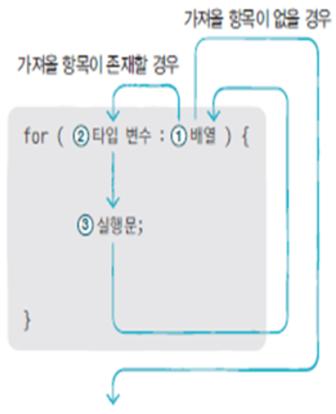


### 열거형

열거 상수(한정된 값)를 저장하는 타입


#### 열거형 선언

```java
public enum 열거형이름 { … }
```


```java
public enum Week { MONDAY, TUESDAY, WEDNESDAY, THURSDAY, FRIDAY, SATURDAY, SUNDAY }
```


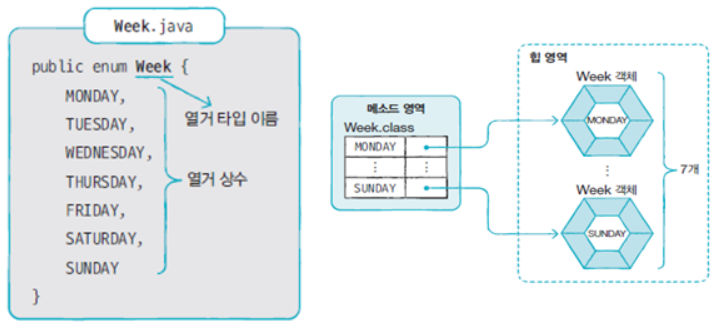


#### 열거형 변수 선언

```java
열거형 변수이름;
```


```java
Week today;
Week reservationDay;
```


#### 열거 상수 저장

```java
열거형변수 = 열거타입.열거상수;
```


```java
Week today = Week.SUNDAY;
today = Week.SUNDAY;
```


---

로봇의 기능을 숫자로 정의/제어

Robot.java

```java
public class Robot {
	private String name;
	
	// 생성자(constructor) - 해당 객체가 생성될 때 호출되는 메소드
	public Robot(String name) {
		this.name = name;
	}
	
	// 동작을 수행하는 메소드를 정의
	public void order(int command) {
		if (command == 0) {
			System.out.println(this.name + " walks.");
		} else if (command == 1) {
			System.out.println(this.name + " stops.");
		} else if (command == 2) {
			System.out.println(this.name + " jumps.");
		} else {
			System.out.println("Command Error");
		}
	}
}
```


Main.java

```java
public class Main {
	public static void main(String[] args) {
		Robot robot = new Robot("Andrew");
		robot.order(0);  // walk
		robot.order(1);  // stop
		robot.order(2);  // jump
	}
}
```

⇒ 숫자로 되어 있는 코드의 혼선으로 인한 오용이 발생할 수 있음


```
Andrew walks.
Andrew stops.
Andrew jumps.
```


---


Robot.java

```java
public class Robot {
	private String name;
	
	// 동작을 제어하는 코드를 열거형으로 정의
	public enum Command {
		WALK, STOP, JUMP
	};
	
	// 생성자(constructor) - 해당 객체가 생성될 때 호출되는 메소드
	public Robot(String name) {
		this.name = name;
	}
	
	// 동작을 수행하는 메소드를 정의
	// 인자값으로 Command 타입을 받도록 제한
	public void order(Robot.Command command) {
		if (command == Command.WALK) {
			System.out.println(this.name + " walks.");
		} else if (command == Command.STOP) {
			System.out.println(this.name + " stops.");
		} else if (command == Command.JUMP) {
			System.out.println(this.name + " jumps.");
		} else {
			System.out.println("Command Error");
		}
	}
}
```


Main.java

```java
public class Main {
	public static void main(String[] args) {
		Robot robot = new Robot("Andrew");
		robot.order(Robot.Command.WALK);  // walk
		robot.order(Robot.Command.STOP);  // stop
		robot.order(Robot.Command.JUMP);  // jump
	}
}
```


```
Andrew walks.
Andrew stops.
Andrew jumps.
```


