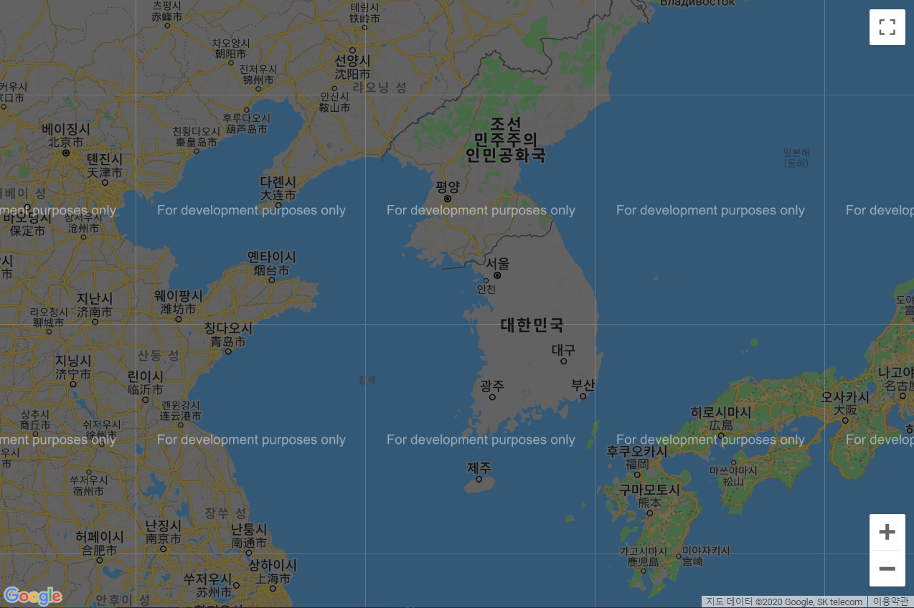
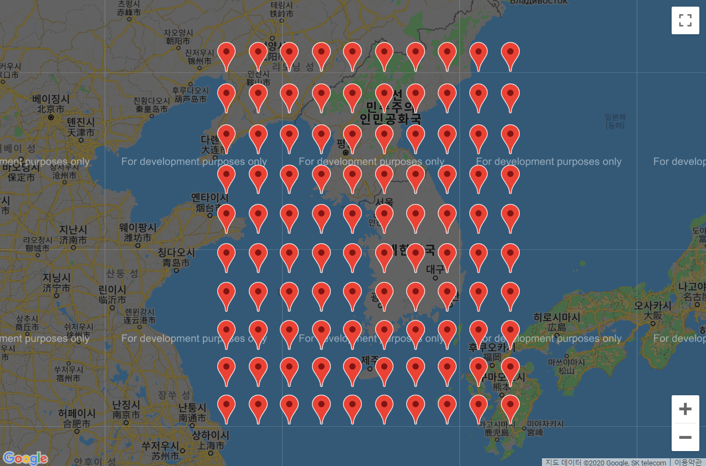
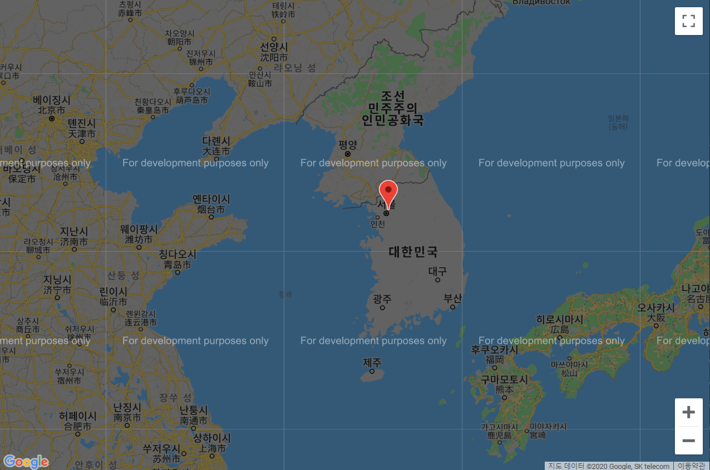

# JavaScript

## 지오로케이션

지오로케이션은 현재 위치를 찾는 기능이다.

데스크톱의 웹 브라우저를 사용하면 사용자의 IP 주소로 현재 위치를 찾으며, GPS가 포함된 스마트폰과 태블릿 PC에서는 GPS로 현재 위치를 찾을 수 있다.


### 구글 지도

구글 지도는 구글에서 제공하는 지도 서비스이다.

https://developers.google.com/maps/documentation/javascript/tutorial


#### 구글 지도 생성

GoogleMapsBasic.html

```html
<!DOCTYPE html>
<html>
<head>
    <title>Google Maps Basic</title>
    <style>
        * { margin: 0; padding: 0; }
        html, body { height: 100%; }
        #map {
            height: 100%;
        }
    </style>
    <script src="http://maps.google.com/maps/api/js?sensor=false"></script>
</head>
<body>
    <div id="map"></div>
    <script>
        // 지도를 생성합니다.
        const element = document.getElementById('map');
        const map = new google.maps.Map(element, {
            zoom: 6,
            center: new google.maps.LatLng(37, 126),
            mapTypeId: google.maps.MapTypeId.ROADMAP
        });
    </script>
</body>
</html>
```





#### mapTypeId 객체

| 객체                            | 값          | 설명                         |
| ------------------------------- | ----------- | ---------------------------- |
| google.maps.MapTypeId.HYBRID    | "hybird"    | 로드맵 지도와 위성 지도 혼합 |
| google.maps.MapTypeId.ROADMAP   | "roadmap"   | 로드맵 지도                  |
| google.maps.MapTypeId.SATELLITE | "satellite" | 위성 이미지                  |
| google.maps.MapTypeId.TERRAIN   | "terrain"   | 지형 정보 기반의 실제 지도   |


#### 구글 지도와 마커

GoogleMapsBasic.html

```html
<!DOCTYPE html>
<html>
<head>
    <title>Google Maps Basic</title>
    <style>
        * { margin: 0; padding: 0; }
        html, body { height: 100%; }
        #map {
            height: 100%;
        }
    </style>
    <script src="http://maps.google.com/maps/api/js?sensor=false"></script>
</head>
<body>
    <div id="map"></div>
    <script>
        // 지도를 생성합니다.
        const element = document.getElementById('map');
        const map = new google.maps.Map(element, {
            zoom: 6,
            center: new google.maps.LatLng(37, 126),
            mapTypeId: google.maps.MapTypeId.ROADMAP
        });

        // 마커를 생성합니다.
        for (let i = 0; i < 10; i++) {
            for (let j = 0; j < 10; j++) {
                const latitude = 32 + i;
                const longitude = 122 + j;
                new google.maps.Marker({
                    position: new google.maps.LatLng(latitude, longitude),
                    map: map
                });
            }
        }
    </script>
</body>
</html>
```





### 현재 위치 확인

현재 위치를 확인할 때는 navigator 객체의 geolocation 객체를 사용한다.


#### 현재 위치 확인 메서드

| 메서드 이름          | 설명                  |
| -------------------- | --------------------- |
| getCurrentPosition() | 현재 위치를 출력한다. |
| watchPosition()      | 위치를 출력한다.      |


#### Position 객체의 속성

GoogleMapsBasic.html

```html
<!DOCTYPE html>
<html>
<head>
    <title>Google Maps Basic</title>
    <style>
        * { margin: 0; padding: 0; }
        html, body { height: 100%; }
        #map {
            height: 100%;
        }
    </style>
    <script src="http://maps.google.com/maps/api/js?sensor=false"></script>
</head>
<body>
    <div id="map"></div>
    <script>
        // 지도를 생성합니다.
        const element = document.getElementById('map');
        const map = new google.maps.Map(element, {
            zoom: 6,
            center: new google.maps.LatLng(37, 126),
            mapTypeId: google.maps.MapTypeId.ROADMAP
        });

        // 위치 탐색을 시작합니다.
        navigator.geolocation.getCurrentPosition((position) => {
            // 위치를 가져오는 데 성공할 경우
            let output = '';
            for (let i in position.coords) {
                output += i + ': ' + position.coords[i] + '\n';
            }
            alert(output);
        }, (error) => {
            // 위치를 가져오는 데 실패할 경우
            alert(error);
        });
    </script>
</body>
</html>
```


#### 지오로케이션과 구글 지도

GoogleMapsBasic.html

```html
<!DOCTYPE html>
<html>
<head>
    <title>Google Maps Basic</title>
    <style>
        * { margin: 0; padding: 0; }
        html, body { height: 100%; }
        #map {
            height: 100%;
        }
    </style>
    <script src="http://maps.google.com/maps/api/js?sensor=false"></script>
</head>
<body>
    <div id="map"></div>
    <script>
        // 지도를 생성합니다.
        const element = document.getElementById('map');
        const map = new google.maps.Map(element, {
            zoom: 6,
            center: new google.maps.LatLng(37, 126),
            mapTypeId: google.maps.MapTypeId.ROADMAP
        });

        // 위치 탐색을 시작합니다.
        navigator.geolocation.getCurrentPosition((position) => {
            // 위치를 가져오는 데 성공할 경우
            const latitude = position.coords.latitude;
            const longitude = position.coords.longitude;

            new google.maps.Marker({
                position: new google.maps.LatLng(latitude, longitude),
                map: map
            });
        }, (error) => {
            // 위치를 가져오는 데 실패할 경우
            alert(error);
        });
    </script>
</body>
</html>
```





### 위치 추적

watchPosition() 메서드 사용


GoogleMapsBasic.html

```html
<!DOCTYPE html>
<html>
<head>
    <title>Google Maps Basic</title>
    <style>
        * { margin: 0; padding: 0; }
        html, body { height: 100%; }
        #map {
            height: 100%;
        }
    </style>
    <script src="http://maps.google.com/maps/api/js?sensor=false"></script>
</head>
<body>
    <div id="map"></div>
    <script>
        // 지도를 생성합니다.
        const element = document.getElementById('map');
        const map = new google.maps.Map(element, {
            zoom: 6,
            center: new google.maps.LatLng(37, 126),
            mapTypeId: google.maps.MapTypeId.ROADMAP
        });

        // 위치 탐색을 시작합니다.
        navigator.geolocation.watchPosition((position) => {
            // 위치를 가져오는 데 성공할 경우
            const latitude = position.coords.latitude;
            const longitude = position.coords.longitude;

            new google.maps.Marker({
                position: new google.maps.LatLng(latitude, longitude),
                map: map
            });
        }, (error) => {
            // 위치를 가져오는 데 실패할 경우
            alert(error);
        });
    </script>
</body>
</html>
```


