# JavaScript

## 쿠키와 저장소


### 쿠키 개요

* 쿠키는 키와 값이 들어 있는 작은 데이터 조각으로 이름, 값, 파기 날짜와 경로 정보가 있다.
* 쿠키는 서버와 클라이언트에서 모두 저장하고 사용할 수 있다.
* 쿠키는 일정 기간 동안 로그인을 유지하는 페이스북 같은 웹 사이트에서 사용한다.


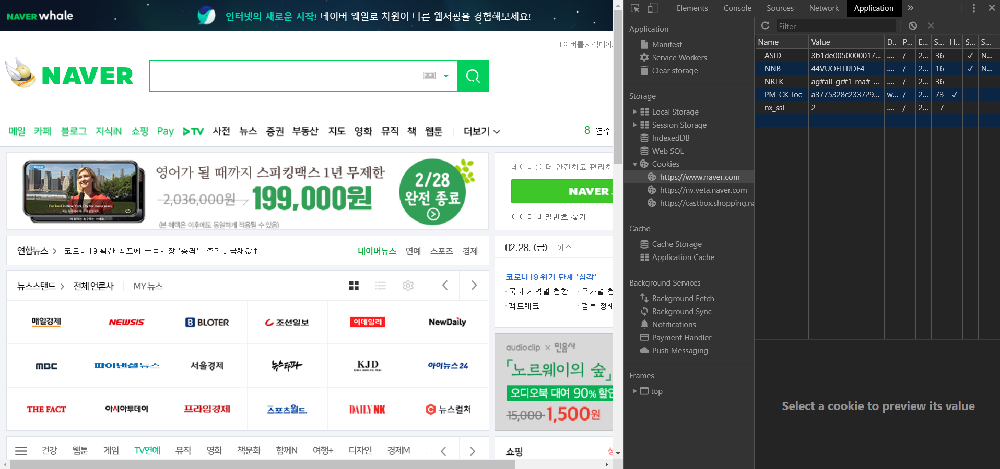


* 쿠키에는 여러 가지 속성이 있다.

* 쿠키의 속성 중 우리가 지정할 수 있는 속성은 Name, Value, Domain, Path, Expires, Secure 이다.

* 쿠키는 각각의 속성을 다음과 같은 문자열에 넣어 생성한다.

  ```js
  document.cookie = 'Name=Value;Expires=날짜;Domain=도메인;Path=경로;Secure';
  ```

  * Name & Value : 데이터를 저장하고 읽는 데 사용하는 속성. 쿠키를 사용할 때는 해당 속성을 반드시 지정해야 한다.
  * Expires : 쿠키의 파기 날짜를 지정하는 속성. GMT 형식이나 UTC 형식으로 날짜를 입력해야 한다. 파기 날짜를 입력하지 않으면 브라우저가 종료될 때 쿠키가 삭제된다.
  * Secure : 쿠키가 보안 연결을 사용해 전송돼야 하는지를 결정하는 속성. Secure 속성을 지정하면 해당 쿠키는 SSL로만 요청할 수 있다.
  * Domain & Path : 입력하지 않으면 현재 도메인의 경로로 자동 입력된다.


public 폴더에 CookieTest.html 파일 생성


CookieTest.html

```html
<!DOCTYPE html>
<html>
<head>
    <script>
        // 변수를 선언합니다.
        let date = new Date();
        date.setDate(date.getDate() + 7);

        let willCookie = '';
        willCookie += 'CookieName=Value;';
        willCookie += 'expires=' + date.toUTCString();

        // 쿠키에 넣습니다.
        document.cookie = willCookie;
        alert(document.cookie);
    </script>
</head>
<body>

</body>
</html>
```


```powershell
PS C:\node> npx http-server
```


http://127.0.0.1:8080/CookieTest.html

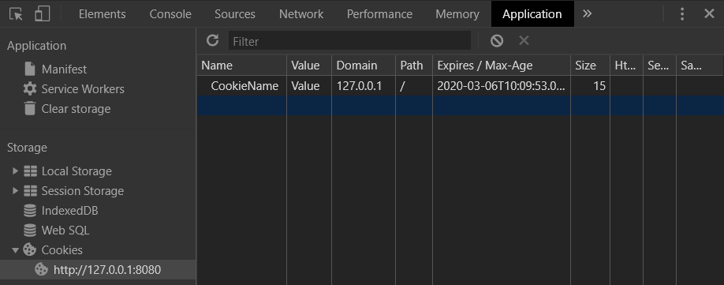


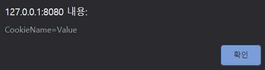


쿠키 삭제

CookieTest.html

```html
<!DOCTYPE html>
<html>
<head>
    <script>
        // 변수를 선언합니다.
        let date = new Date();
        date.setDate(date.getDate() - 1);

        let willCookie = '';
        willCookie += 'CookieName=Value;';
        willCookie += 'expires=' + date.toUTCString();

        // 쿠키에 넣습니다.
        document.cookie = willCookie;
        alert(document.cookie);
    </script>
</head>
<body>

</body>
</html>
```

쿠키를 제거하고 싶을 때는 Expires 속성을 현재 이전의 날짜로 설정한다.


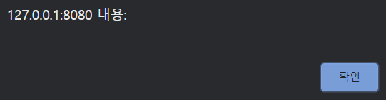


### 쿠키 읽기

CookieTest.html

```html
<!DOCTYPE html>
<html>
<head>
    <script>
        // 변수를 선언합니다.
        let date = new Date();
        date.setDate(date.getDate() + 7);

        // 5번 반복합니다.
        for (let i = 0; i < 5; i++) {
            let willCookie = '';
            willCookie += 'Name' + i + '=Value;';
            willCookie += 'expires=' + date.toUTCString();

            // 쿠키에 집어넣습니다.
            document.cookie = willCookie;
        }

        // 출력합니다.
        console.log(document.cookie);

        const name = 'Name0';
        const cookies = document.cookie.split(';');
        console.log(cookies);

        // 쿠키를 추출합니다.
        for (let i in cookies) {
            if (cookies[i].search(name) != -1) {
                console.log(cookies[i].replace(name + '=', ''));
            }
        }
    </script>
</head>
<body>

</body>
</html>
```


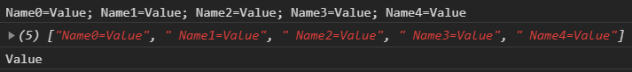


### 쿠키 함수

CookieTest.html

```html
<!DOCTYPE html>
<html>
<head>
    <script>
        function setCookie(name, value, day) {
            // 변수를 선언합니다.
            let date = new Date();
            date.setDate(date.getDate() + day);

            let willCookie = '';
            willCookie += name + '=' + encodeURIComponent(value) + ';';
            willCookie += 'expires=' + date.toUTCString() + '';

            // 쿠키에 집어넣습니다.
            document.cookie = willCookie;
        }

        function getCookie(name) {
            // 변수를 선언합니다.
            const cookies = document.cookie.split(';');

            // 쿠키를 추출합니다.
            for (let i in cookies) {
                if (cookies[i].search(name) != -1) {
                    return decodeURIComponent(cookies[i].replace(name + '=', ''));
                }
            }
        }

        function removeCookie(name) {
            // 변수를 선언합니다.
            let date = new Date();
            date.setDate(date.getDate() - 1);

            let willCookie = '';
            willCookie += name + '=remove;';
            willCookie += 'expires=' + date.toUTCString();

            // 쿠키에 집어넣습니다.
            document.cookie = willCookie;
        }
    </script>
    <script>
        console.log(getCookie('Cookie'));
        setCookie('Cookie', 'Cheese', 7);
        console.log(getCookie('Cookie'));
    </script>
</head>
<body>

</body>
</html>
```

처음 코드를 실행 한 경우

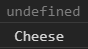

한 번 더 코드를 실행 한 경우

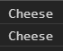


### jQuery Cookie 플러그인

jQuery Cookie 플러그인은 굉장히 사용하기 편리한 쿠키 관련 메서드를 제공한다.

jQuery Cookie 플러그인 : https://github.com/carhartl/jquery-cookie

압축파일 내려받기


src 폴더에 HTMLPage.html 파일 생성


#### 쿠키 저장과 삭제

HTMLPage.html

```html
<!DOCTYPE html>
<html>
<head>
    <script src="https://ajax.googleapis.com/ajax/libs/jquery/3.4.1/jquery.min.js"></script>
    <script src="jquery.cookie.js"></script>
    <script>
        $(document).ready(() => {
            // 쿠키를 저장합니다.
            $.cookie('MyKey', 'Hello');

            // 쿠키를 읽습니다.
            console.log($.cookie('MyKey'));

            // 쿠키를 삭제합니다.
            $.cookie('MyKey', null);

            // 출력합니다.
            console.log(document.cookie);
        });
    </script>
</head>
<body>

</body>
</html>
```

$.cookie() 메서드

같은 메서드인데 매개변수에 따라 기능이 다르다.


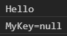


#### jQuery Cookie 플러그인의 옵션

| 옵션 속성 이름 | 설명                                                         |
| -------------- | ------------------------------------------------------------ |
| expires        | 쿠키를 유지하고자 하는 일수를 지정한다.                      |
| path           | 쿠키의 대상 경로를 지정한다.                                 |
| domain         | 쿠키의 대상 도메인을 지정한다.                               |
| secure         | 쿠키의 보안 유무를 지정한다.                                 |
| raw            | 인코딩과 관련된 속성이다. true로 설정하면 인코딩하지 않는다. |

쿠키를 저장하는 형태의 메서드에는 옵션 객체를 세 번째 매개변수로 넣을 수 있다.


#### cookie() 메서드의 옵션

HTMLPage.html

```html
<!DOCTYPE html>
<html>
<head>
    <script src="https://ajax.googleapis.com/ajax/libs/jquery/3.4.1/jquery.min.js"></script>
    <script src="jquery.cookie.js"></script>
    <script>
        $(document).ready(() => {
            // 쿠키를 저장합니다.
            $.cookie('MyKey', '안녕', {
                expires: 7,
                path: '/',
                raw: true
            });

            // 출력합니다.
            console.log($.cookie('MyKey'));
        });
    </script>
</head>
<body>

</body>
</html>
```


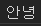

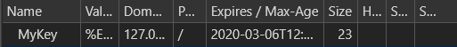


### 저장소

데이터를 오래 지속하는 것은 애플리케이션을 만들 때 꼭 필요한 기능이므로 HTML5부터는 저장소 기능을 제공한다.

저장소는 로컬 저장소와 세션 저장소 두 가지로 나뉜다.


* 로컬 저장소 : 웹 브라우저를 삭제하지 않는 이상 데이터를 영구적으로 저장한다.
* 세션 저장소 : 웹 브라우저가 종료될 때까지 데이터를 저장한다.


두 저장소 모두 window 객체 안에 들어있다.


#### LocalStorage 객체의 메서드

| 메서드 이름         | 설명                                       |
| ------------------- | ------------------------------------------ |
| setItem(key, value) | 로컬 저장소에 데이터를 생성한다.           |
| getItem(key)        | 로컬 저장소의 데이터를 읽는다.             |
| removeItem(key)     | 로컬 저장소의 데이터를 삭제한다.           |
| clear()             | 로컬 저장소의 모든 데이터를 삭제한다.      |
| key(number)         | 로컬 저장소의 특정 위치의 데이터를 읽는다. |

로컬 저장소는 일반 객체라고 생각하면 편하다. 객체처럼 내부에서 쉽게 데이터를 뽑아낼 수 있고 쉽게 데이터를 추가할 수 있다.


#### 로컬 저장소

StorageTest.html

```html
<!DOCTYPE html>
<html>
<head>
    <script src="https://ajax.googleapis.com/ajax/libs/jquery/3.4.1/jquery.min.js"></script>
    <script>
        $(document).ready(() => {
            // 로컬 저장소의 내용을 출력합니다.
            function printLocalStorage() {
                // div 태그를 비웁니다.
                $('div').empty();
                
                // div 태그에 로컬 저장소의 내용을 출력합니다.
                for (let key in localStorage) {
                    $('<h1></h1>').html(key + ': ' + localStorage[key]).appendTo('div');
                }
            }
            // 로컬 저장소를 사용합니다.
            if (window.localStorage) {
                printLocalStorage();
                $('input:button').click(() => {
                    // 변수를 선언합니다.
                    const key = $('#key').val();
                    const value = $('#value').val();

                    // 데이터를 추가합니다.
                    localStorage.setItem(key, value);

                    // 데이터를 출력합니다.
                    printLocalStorage();
                });
            } else {
                alert('로컬 저장소를 사용할 수 없는 브라우저입니다.');
            }
        });
    </script>
</head>
<body>
    <input type="text" id="key" />
    <input type="text" id="value" />
    <input type="button" value="저장" />
    <div id="output">

    </div>
</body>
</html>
```


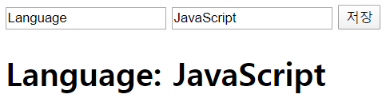


브라우저를 종료하고 다시 실행해도 로컬 저장소에 데이터를 저장했으므로 데이터가 영구적으로 저장된다.


#### 세션 저장소

StorageTest.html

```html
<!DOCTYPE html>
<html>
<head>
    <script src="https://ajax.googleapis.com/ajax/libs/jquery/3.4.1/jquery.min.js"></script>
    <script>
        $(document).ready(() => {
            // 세션 저장소의 내용을 출력합니다.
            function printsessionStorage() {
                // div 태그를 비웁니다.
                $('div').empty();
                
                // div 태그에 세션 저장소의 내용을 출력합니다.
                for (let key in sessionStorage) {
                    $('<h1></h1>').html(key + ': ' + sessionStorage[key]).appendTo('div');
                }
            }
            // 세션 저장소를 사용합니다.
            if (window.sessionStorage) {
                printsessionStorage();
                $('input:button').click(() => {
                    // 변수를 선언합니다.
                    const key = $('#key').val();
                    const value = $('#value').val();

                    // 데이터를 추가합니다.
                    sessionStorage.setItem(key, value);

                    // 데이터를 출력합니다.
                    printsessionStorage();
                });
            } else {
                alert('세션 저장소를 사용할 수 없는 브라우저입니다.');
            }
        });
    </script>
</head>
<body>
    <input type="text" id="key" />
    <input type="text" id="value" />
    <input type="button" value="저장" />
    <div id="output">

    </div>
</body>
</html>
```

세션 저장소는 로컬 저장소와 반대로 영구적으로 저장되는 곳이 아니다.

브라우저를 종료했다 다시 실행하면 데이터가 모두 사라진다.


