# JavaScript


## 개요

#### 자바스크립트의 역사

* Javascript란?
  * 웹 브라우저에서 많이 사용하는 프로그래밍 언어
  * 넷스케이프 사의 브랜든 아이크(Brendan Eich)에 의해 모카라는 이름으로 시작(모카 -> 라이브 스크립트로 이름 변경)
  * 넷스케이프 사가 썬 마이크로시스템과 함께 자바스크립트라는 이름을 붙이고 본격적 발전


일반적으로 CS 모델 

Server : 뭔가를 주는 것

Client : 뭔가를 요청하는 것

웹은 http라는 프로토콜을 기반으로 하고 있다. 

* Web : HTTP 프로토콜 기반의 서비스
  * 요청, 응답의 구조
  * Stateless -> 상태 관리(유지)를 하지 않는다.

클라이언트가 요청을 하면 거기에 응답을 한다.


정적 : 바꾸기 전 까지는 동일하게 보이는 것. 서버에 있는 컨텐츠(자원)이 있다. 일반적으로 파일이다. 이미지(gif, jpg, png), 구조화 된 문서(html), 텍스트 파일 -> 정적 자원


abc.gif

xyz.html

처음에 웹이라고 하는 것은 정적인 자원의 공유을 위해서 만들어진 것이다.

네트워크에 서버들이 곳곳에 있다. 곳곳에 있는 서버들은 자기가 제공하고자 하는 문서들을 다 저장하고 있다. http 해서 이거 주세요 하면 그걸 주는 것이 웹의 시작이다.

정적인 자원을 서비스 하는 모델 : 사용자 입장에서 뭐가 어디에 있는지 모른다.


홈페이지는 문장으로 만들어진다. 정적인 자원을 서비스하는 데에서는 자원들이 어디에 어떤 형태로 저장되었는지 모른다.


디렉토리 서비스

문제점이 있으면 문제점을 해결하기 위해 나온 것들이 기술의 발전

URL을 계속 바꿔서 

전화번호부 처럼 되어있으니 카테고리처럼 되어있는 곳에 가서 

서비스를 제공해주는 사이트에서는 사용자가 기존에는 해당하는 서버에 가면 a.com 아래에는 123, 456, 789라는 디렉토리가 있다.

어디가면 뭐가 있다는 것은 야후를 통해서 해결

어느 디렉토리에 뭐가 있는지 알 수 있는 방법 -> 검색

어디에 어떤 파일이 있고 어떤 내용이 어느 파일에 있는지를 문서를 다 열어서 보는 것이 아니라 입력한 값을 가지고 문서를 다 찾아서

search.jsp ? 어떤 단어를 넣는지에 따라 보여지는 것이 다르다

정적인 문서의 반대 개념

사용자가 입력한 결과에 따라 다른 결과를 내놓는다.

동적인 페이지

데이터의 양이 많아지다보니 동적인 서비스 형태의 것이 나오게 된다.

처음에는 CGI라는 기술을 이용했다. 동적인 서비스의 초기 모델

기술별로 다양한 동적 페이지 생성 기술들을 만들어낸다.


요청하면 파일이 Client에 내려와서 떠 있는 상태

결과를 보고 있으니 심심하니까 activity하게 마우스 올리면 색이 바뀐다든지 애니메이션을 넣는다든지 하는 기술 등장


RFC

초기 웹을 통해 주고받았던 문서 -> 텍스트

server에서 바꾸지 않으면 항상 똑같은 내용이 나온다.

수십만개가 되면 그걸 다 볼 수 없다 -> 검색이라는 기능 필요. 필요한 자원 찾기

Client에 내려온 문서는 메모리에 올라와서 보여지는 것이다.

필요에 따라 움직이거나 색을 바꾸는 동적인 제스쳐를 넣으면 좋겠다 -> 이렇게 해서 시작된 것이 JavaScript


웹 브라우저에서 쓸 수 있는 동적인 처리를 위한 언어 -> JavaScript


* 웹에서 웹 애플리케이션으로
  * 초기의 웹
    * 변화 없는 정적 글자들의 나열
    * 웹은 하이퍼링크라는 매개체를 사용해 웹 문서가 연결된 거대한 책에 불과
  * 자바스크립트의 등장
    * 웹 문서의 내용을 동적으로 바꾸거나 마우스 클릭 같은 이벤트 처리
  * 웹은 애플리케이션의 모습에 점점 가까워짐
    * 대표적인 예는 아래 그림과 같은 웹 문서 작성 도구
    * 구글, 마이크로소프트에서는 웹 브라우저만으로 워드, 엑셀, 파워포인트 같은 애플리케이션 사용 가능
    * 웹 애플리케이션은 웹 브라우저만 있으면 언제 어디서나 사용 가능


* 인터넷 연결 없이 웹 브라우저에서 실행 가능한 웹 애플리케이션
  * 스마트 폰이나 스마트패드 내의 애플리케이션을 만들 때에도 자바스크립트 사용


jQuery : 문서를 쉽게 주무를 수 있도록 만들어준다.

Node : 자바 스크립트의 실행 환경. 플랫폼에 관계 없이 동작할 수 있게 되었다.


자바 스크립트를 해석하고 실행할 수 있는 것을 밖으로 빼낸 것 -> 브라우저에 의존하지 않고 자바 스크립트를 실행

PC에 깔리면 PC side에서 실행 가능

자바스크립트는 쉽기 때문에 자신이 알고 있는 전공 지식을 프로그래밍할 수 있다.


브라우저에서 있었던 것들이 번창하게 된다.

framework 나 라이브러리가 많이 나왔다.


Java와 전혀 관계 없다.


* 자바스크립트의 종류
  * 유럽 컴퓨터 제조 협회(ECMA)는 자바 스크립트를 ECMAScript라는 이름으로 표준화
  * 웹 브라우저나 애플리케이션에 내장된 자바스크립트의 종류
  * ECMAScript와 Jscript는 모두 자바스크립트를 의미


표준 명칭은 ECMAScript

ES5 : 2016

ES6 : 2017

ECMA Script

-> 통합해서 부를 경우 JavaScript


#### HTML 파일 만들기

* HTML 파일을 만들고 실행하는 방법
  * [파일] -> [새 파일]을 선택해 새 파일 대화상자 열기
  * HTML 페이지 선택해 파일 생성 -> 코드 생성
  * HTML5 표준(XHTML5 표준) 형식의 코드


MarkUp Language : Mark를 가지고 둘러 쌌다는 의미

```html
<div> data </div>
```

tag, mark로 둘러쌌다.


xml, html


markup language는 왜 만들었을까? -> 이기종 간에, 다른 환경의 머신 간에 정보를 교환하기 위해서 만든 것이다.


한쪽에서는 정보를 제공하고 다른 쪽에서는 정보를 받는다.

정보가 서로 교환을 해야 될 필요성이 있다. 네트워크 환경이 활성화되니까 주고받고 하면 좋겠다는 생각

정보를 상호 교환. 정보의 공유가 기본 철학


일정한 format을 맞춰서 저장

정보를 일반화해서 표현하기 위해서는 굉장히 복잡한 체계가 있었다.

어떤 정보든지 일반적으로 표현하기 위한 방법 SGML -> 방대하다

이것들을 조금씩 줄여서 내려온 것. html

서버가 가지고 있는 정보를 사용자에게 보여주기 위해서 구분지어준 것

```html
<h1>
    ~
</h1>
```

h1에 들어가 있는 정보는 h2에 들어가있는 정보보다 높은 등급의 정보

시각화해서 보여준다. h1은 크고 굵게, h2는 작게

데이터의 가치, 의미를 나타낼 때에는 markup을 사용

시각화해서 보여주는 것이 브라우저

오용된다.

개발자가 사용자에게 예쁘게 보이고 싶다. 색도 입히고 모양도 다르게

원래 mark의 목적이 정보의 가치와 의미를 표현하기 위한 것이였는데, 스타일로 바꼈다.

브라우저별로 경쟁적으로 이상한 기능을 많이 넣었다. -> 호환이 떨어진다.

개발하는 사람들이 어려워진다. 사용자들의 이용성이 떨어진다. -> 표준으로 만들자

그래서 나온 표준이 HTML5


HTML의 기본 철학은 데이터의 표현

semantic web : 의미 기반의 웹

데이터의 의미와 가치를 가지고 구분. 이기종간의 데이터 교환을 하기 위한 것

어떤 내용이 들어가있다는 것을 알려주기 위한 것

구역에 들어가는 것이 어떤 정보라는 것을 알려줘야 한다.

의미를 가지고 있는 tag를 쓰도록 한다. 머리말, 메뉴 구조, 본문, 꼬리말

문서에 자동차라는 단어가 여기저기 들어가있는데 본문에 있는 자동차가 가치가 있다. 그런 식으로 자동화 처리가 가능하다. google과 같은 검색 엔진


* HTML5의 철학
  * html이라는 원래의 기능 요소로 돌아가겠다
  * 개발 편의성. 개발자가 편해야한다.


날짜 입력

2020-01-20

2020/01/20

20201020

동일한 의미가 다른 형태로 들어가면 서버가 처리할 때 일정한 형식으로 바꿔야한다. -> 정규화(normalization)

정규화 과정을 입력단에서 부터 하면 편하다.

달력 버튼을 누르면 달력이 나오고 날짜를 선택하면 정해진 format으로 저장이 된다.

이런 것들을 왜 해야할까? 브라우저에서 알아듣기만 하면 된다.

```html
<input type="text">
<input type="number">
<input type="date">
```


html doctype

https://www.w3schools.com/tags/tag_doctype.asp

이 문서를 해석하는 것에게 문서가 어떤 구조를 가지고 있는지를 알려주는 것이다.

그래야 브라우저가 문서 구조에 맞도록 사용자에게 보여준다.

이렇게 길게 이름을 주는 것은 사용자 편의가 아니라 브라우저의 편의를 위한 것 -> 너무 형식 지향적


html 5

```html
<!DOCTYPE html>
```


* 자바 스크립트 코드 위치
  * 기본 페이지의 head 태그 사이에 script 태그 삽입
    * script 태그 사이에 자바스크립트 코드 입력
  * HTML5에서는 script 태그에 type 속성을 적지 않는 게 원칙


\#1 기본 설정 상태로 설치 진행

Visual Studio Code 설치 ⇒ https://code.visualstudio.com/docs/?dv=win

node.js 설치 ⇒ https://nodejs.org/ko/

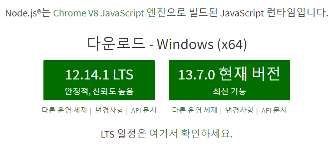

\#2 명령 프롬프트 실행 (시작 > cmd.exe)


\#3 작업 디렉터리(폴더) 생성

```bash
C:\Users\myanj>cd \
C:\>mkdir javascript
C:\>cd javascript
C:\javascript>
```


\#4 node 설치 여부를 확인

```bash
C:\javascript>node
--versionv12.14.1
```


\#5 Visual Studio Code 실행 > File > Open Folder 메뉴 선택

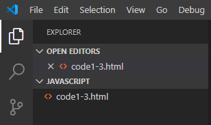

p19

```javascript
<!DOCTYPE html>
<html>
    <head>
        <script>
            alert("#1");
        </script>
    </head>
    <body>
        <script>
            alert("#2");
        </script>
    </body>
</html>
```


문서를 해석하는 쪽에서 문서가 어떤 type으로 되어있는지 알려준다.

마크업 언어는 트리 구조를 가진다.

요소는 일정한 구조로 둘러싸여있다.

요소는 시작과 끝이 있다.

이 문서는 서버쪽에 있다.

Client로 내려오면 브라우저가 쭉 해석해서 tag 요소의 의미에 따라 tag가 가지고 있는 값들을 사용자에게 보여준다. -> rendering 한다고 한다.

html 문서는 소스 코드에 있는 내용은 항상 순서대로 해석된다.

우리가 시도하는 것은 file을 가지고 시도한다.

서버 기능을 하는 것이 필요하다. -> http-server 설치


web은 URL(URI)

URI는 URL과 URN으로 나눠진다.

URI : 네트워크에 흩어져있는 파일들을 유니크하게 식별할 수 있다.

URL : 첫 번째는 location을 가지고 한다. 해당하는 서버의 주소를 가지고 할 수 있다.

같은 서버 안에서 어떤 파일을 유일하게 식별할 수 있는 방법은 파일의 경로를 가지고 할 수 있다.

주소와 경로를 이용해 파일을 유니크하게 식별


npm : node package manager


```bash
C:\javascript>npm init -y
```

내가 노드 기반의 프로젝트를 만들 때 그에 대한 설정 정보를 초기화해준다.

이후에 사용하는 작업들의 설치 정보들을 관리할 수 있다.


```bash
C:\javascript>npm install http-server -g
```


C:\Users\HPE\AppData\Roaming\npm\node_modules

-g 옵션을 주면 위의 경로에 설치된다. 붙이지 않으면 현재 디렉터리에 설치된다.


모든 프로그램이 프로그램 실행에 필요한 정보를 가지고 올라간다.

가지고 올라오는 정보 중 시스템에서 가져오는 것이 있다. 그 중 환경변수가 있다.

node 설치 시 파일 path에 추가할까요?

환경정보 path에 추가 default로 설정되어있다.


```bash
C:\javascript>npx http-server
Starting up http-server, serving ./
Available on:
  http://10.0.75.1:8080
  http://59.29.224.59:8080
  http://192.168.56.1:8080
  http://192.168.133.1:8080
  http://10.0.0.1:8080
  http://127.0.0.1:8080
  http://172.17.60.145:8080
```

npx : 이 모듈을 실행한다는 뜻

이 주소의 8080으로 접속할 수 있다. 구동된 웹 서버에 접속 가능

http://localhost:8080/

탐색기에서 더블클릭 -> 내 pc에 있는 파일을 브라우저를 통해서 보는 것

http-server를 이용하는 것은 웹 서버에 요청하면 웹 서버가 가지고 있는 경로에 있는 파일을 읽어서 브라우저에 보여준다.


크롬 브라우저에서 F12 -> 개발자 도구


Console : 입력과 출력을 처리해준다.

alert 창이 아니라 원하는 정보를 Console에서 확인할 수 있도록 한다.

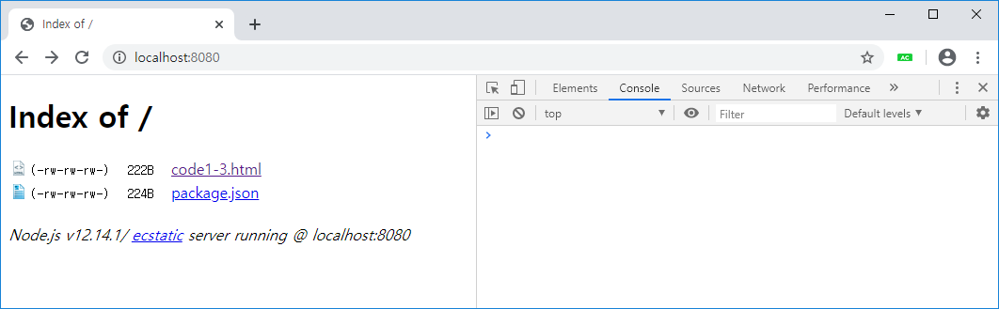

책에 나오는 alert를 사용하는 것들은 console.log()를 사용해 확인한다.

메시지와 메시지를 찍어주는 코드의 위치가 나온다.

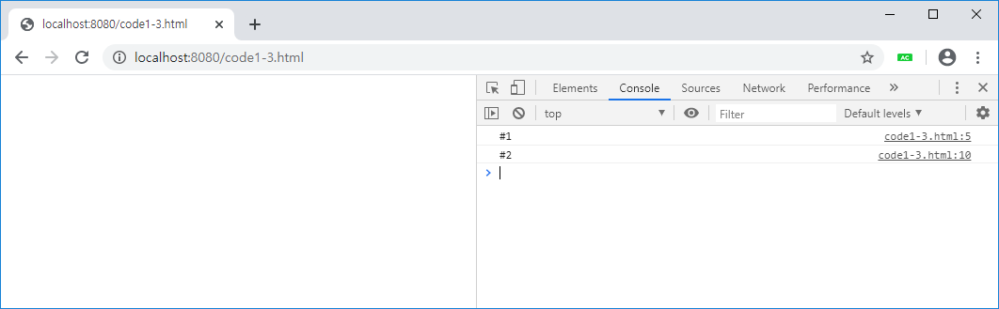


code1-3.html:5 클릭

소스 코드 볼 수 있다.

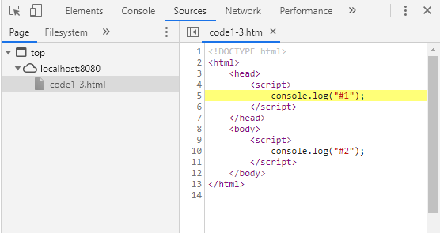

브라우저에 내려와 있는 것을 본다. 같은 pc에 있는 것은 건드릴 수 있지만 해당하는 서버에 있는 것을 건드릴 수 없다. 


```javascript
<!DOCTYPE html>
<html>
    <head>
        <script>
            console.log("#1");
        </script>
    </head>
    <body>
        <div id="up">up</div>
        <script>
            console.log("#2");
        </script>
        <div id="down">down</div>
    </body>
</html>
```


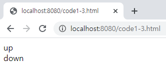


```javascript
<!DOCTYPE html>
<html>
    <head>
        <script>
            console.log("#1");
        </script>
    </head>
    <body>
        <div id="up">up</div>
        <script>
            console.log("#2");
            document.getElementById("up").innerText = "UP";
        </script>
        <div id="down">down</div>
    </body>
</html>
```

Element : 요소. 우리가 그냥 얘기할 때에는 tag

ID가 up인 태그를 찾는다.

tag 안에 있는 값을 조작하겠다.

소문자 up를 대문자 UP로 바꾸라는 코드


```javascript
<!DOCTYPE html>
<html>
    <head>
        <script>
            console.log("#1");
        </script>
    </head>
    <body>
        <div id="up">up</div>
        <script>
            console.log("#2");
            document.getElementById("up").innerText = "UP";
            document.getElementById("down").innerText = "DOWN";
        </script>
        <div id="down">down</div>
    </body>
</html>
```


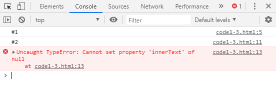


순서대로 실행한다. 명령어가 실행 될 때에는 해당 값이 없어서 오류가 생긴다.


```bash
<!DOCTYPE html>
<html>
    <head>
        <script>
            console.log("#1");
        </script>
    </head>
    <body>
        <div id="up">up</div>
        <div id="down">down</div>
        <script>
            console.log("#2");
            document.getElementById("up").innerText = "UP";
            document.getElementById("down").innerText = "DOWN";
        </script>
    </body>
</html>
```


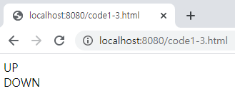


p20

script 태그를 head 태그 안에 넣는 것이 표준이며, 코드를 살펴보기 편하므로 특별한 경우가 아니면 대부분 script 태그를 head 태그 안에 위치시킵니다.


```javascript
<!DOCTYPE html>
<html>
    <head>
        <script>
            console.log("#1");
            console.log("#2");
            document.getElementById("up").innerText = "UP";
            document.getElementById("down").innerText = "DOWN";
        </script>
    </head>
    <body>
        <div id="up">up</div>
        <div id="down">down</div>
    </body>
</html>
```


이렇게 하면 문제가 생긴다. -> event를 이용한다.


http-server는 굉장히 단순해서 그것이 실행된 환경에서 파일이 제공된다.

지정해놓은 기준 디렉토리 안에 있는 것만 보여준다. 기준 디렉터리를 web root라고 한다.

설정하기 나름

일반적인 웹 서버들은 web root를 설정하도록 해 주는데 http-server는 그것을 실행하는 위치가 web root가 된다.

클라이언트에서 접근할 때 http로 접근한다. http 하고 처음 나오는 것이 호스트. 네이버 서버 위치

네이버 서버 아래에 경로를 적는데 외부에서 몰라도 서비스가 가능하도록 해주는 것이 네이버의 웹 서버가 한다.

D drive 아래 어디 밑에...

이것이 웹 서버가 하는 일 중 가장 기본이 되는 일


웹 서버가 하는 역할은 외부에서도 내가 허용하고 있는 자원들을 access 할 수 있다.


event를 이용. 해당되는 문서가 다 읽히고 나면 실행되도록 한다.

```javascript
<!DOCTYPE html>
<html>
    <head>
        <script>
            window.onload = function(){
                console.log("#1");
                console.log("#2");
                document.getElementById("up").innerText = "UP";
                document.getElementById("down").innerText = "DOWN";
            }
        </script>
    </head>
    <body>
        <div id="up">up</div>
        <div id="down">down</div>
    </body>
</html>
```

일반적으로 어떤 기능을 구현하면 script는 head 태그 안에 script 태그를 이용

문서가 다 loading이 되고 나면 실행되도록 한다.

window라는 것은 브라우저를 나타낸다.

on으로 시작하는 것은 대부분 이벤트이다.


console에서 오류가 나는 것을 보고 계속 수정해야 한다.

log를 잘 보고 그 원인을 계속 분석

가급적이면 chrome이나 firefox를 쓰는 것이 도움이 된다.


## 기본 문법

#### 기본 용어

* 표현식과 문장
  * 표현식이란?
    * 값을 만들어내는 간단한 코드
  * 문장이란?
    * 하나 이상의 표현식이 모인 것
    * 문장이 모여 프로그램 구성
    * 문장의 끝에는 세미콜론을 찍어 문장의 종결을 알려줌
    * 하나의 표현식에도 세미콜론만 찍히면 문장


자바스크립트는 세미콜론을 찍지 않아도 문장을 자동으로 찍어주는 기능이 있다. 자동화 기능은 의도하지 않은 결과가 발생할 수 있기 때문에 사용하지 않는 것이 좋다. 세미콜론을 잘 찍어주는 것이 중요하다.


* 키워드
  * 키워드란?
    * 자바스크립트가 처음 만들어질 때 정해진 특별한 의미가 있는 단어
    * 모든 브라우저에서 28개의 키워드 지원(p28 표2-1)
    * 이런 단어들은 그 용도 이외에 사용하는 것을 금지한다.
  * 미래에 사용될 가능성이 있는 자바스크립트 키워드
    * W3C에서는 자바스크립트 프로그램 작성 시 p28 표2-2의 키워드들을 사용하지 않기를 권고


프로그래밍 언어를 할 때 첫 번째로 하는 것이 예약어들의 기능들을 익힌다.

두 번째는 예약어를 이용해 목표한 것을 처리할 수 있도록 한다.


* 식별자
  * 자바스크립트에서 이름을 붙일 때 사용
  * 식별자의 예
    * 변수명과 함수명
  * 식별자 생성 시 규칙
    * 키워드를 사용 불가
    * 숫자로 시작하면 불가
    * 특수 문자는 _과 $만 허용
    * 공백 문자 포함 불가


* 식별자의 생성 규칙
  * 모든 언어가 사용 가능하나 알파벳 사용이 개발자들 사이 관례
  * input, output 같은 의미 있는 단어 사용
  * 자바 스크립트 개발자가 식별자를 만들 때 지키는 관례
    * 생성자 함수의 이름은 대문자로 시작
    * 변수와 인스턴스, 함수, 메서드의 이름은 항상 소문자로 시작
    * 식별자가 여러 단어로 이루어지면 각 단어의 첫 글자는 대문자


클린코드

Agile

분석&설계, 구축


요즘은 오픈소스 기반의 협업을 많이 한다. 공유하면서 프로젝트를 키워나간다.

협업하면서 문제점이 다른 사람이 짠 코드를 이해 못하는 현상이 발생한다. -> 규칙을 정하고 규칙에 맞게 코드를 짠다.

클린코드 : 읽기 좋고 효율적인 코드를 만드는 비법. 첫 번째는 규칙을 준수하는 것이다.


* Camel Expression
  * ex) willOut
* Snake Expression
  * ex) will_out


* 자바스크립트의 식별자 종류

  * 크게 네 종류

    * 더 많은 종류로 나누기도 하나 이 책에서는 네 가지로 구분 (p30 표2-3)

      | 구분                  | 단독으로 사용 | 다른 식별자와 사용 |
      | --------------------- | ------------- | ------------------ |
      | 식별자 뒤에 괄호 없음 | 변수          | 속성               |
      | 식별자 뒤에 괄호 있음 | 함수          | 메서드             |

      

* 주석
  * 프로그램 진행에 영향을 끼치지 않음
  * 코드의 특정 부분을 설명
  * HTML 태그 주석
    * <!-- -->로 문자열을 감싸 생성
  * 자바스크립트 주석
    * //를 사용해 한 줄 주석 표현
      * // 뒤의 문장은 실행되지 않음
      * ex) // 주석문
    * /*와 */을 사용해 여러 줄 주석 표현


주석이니까 랜더링 하는 과정에서 빠진다.

Javascript는 html 안에서 동작한다.

```javascript
<!DOCTYPE html>
<html>
    <head>
        <script>
            window.onload = function(){
                console.log("#1");
                console.log("#2");
                document.getElementById("up").innerText = "UP";
                document.getElementById("down").innerText = "DOWN";
            }
        </script>
    </head>
    <body>
        <!--
        <div id="up">up</div>
        <div id="down">down</div>
        -->
    </body>
</html>
```

NULL이라는 객체에 innerText를 

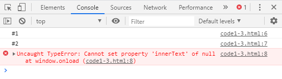

CR + LF = 개행 문자

CR -> Carriage Return. 캐리지를 원래 위치로 돌린다. 현재 라인에서 커서의 위치를 가장 앞으로 옮기는 동작 (ex - 옛날 타자기 생각. 처음 위치로 돌아간다.)

LF -> Line Feed. 커서의 위치는 그대로 두고 종이를 한 라인 위로 올리는 동작 (다음줄로 넘기는 과정)


* 자바스크립트 출력
  * 기본 출력 방법 : alert() 함수를 사용
  * alert() 함수
    * 가장 기본적인 출력 방법
    * 브라우저에 경고창을 띄울 수 있음
    * alert() 함수의 사용 예:
      * 함수의 괄호 안에는 문자열 입력
  * 매개 변수
    * 함수의 괄호 안에 들어가는 것
    * 매개변수 = 파라미터 = 인자값


http://___________/abc.jsp?name=value&n2=v2...

URL에서는 파라미터를 전달할 때 이런 방식을 이용한다.

alert는 문자열을 필요로 하고, 괄호 안에 따옴표를 이용해 내용 입력


* 문자열이란?
  * 문자를 표현할 때 사용하는 자료의 형태
  * alert() 함수의 매개 변수로 쓰인 'Hello JavaScript..!'와 같은 자료
  * 문자열을 만드는 방법
    * 큰 따옴표
    * 작은 따옴표
    * 두 가지 방법 중 어떤 문자열로도 사용 가능하지만 일관되게 사용해야 함


```javascript
<!DOCTYPE html>
<html>
    <head>
        <script>
            console.log('작은 " 따옴표')
            console.log("큰 ' 따옴표")

            // 이스케이프 문자를 활용
            console.log('작은 \' 따옴표')
            console.log("큰 \" 따옴표")

            // 백틱(` : 숫자 1 왼쪽 옆에 있는 글자)을 활용
            console.log(`'작은 따옴표', "큰 따옴표"`)

            /*
                <div>
                    <h1>Hello</h1>
                </div>
             */
             console.log('<div>\n\t<h1>Hello</h1>\n</div>');
            console.log(`
                <div>
                    <h1>Hello</h1>
                </div>
            `);
        </script>
    </head>
    <body>
    </body>
</html>
```


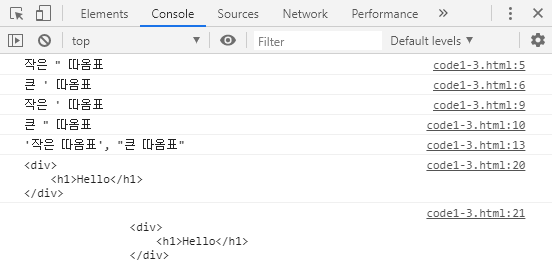


이스케이프(역슬래시 `\` ) 문자를 활용

의미문자(meta-char)

의미문자는 어떤 기능에서 특별한 용도와 의미를 가지고 있는 문자이다.

의미 문자에서 의미를 제거한다. 이스케이프 시킨다. 의미가 제거되면 그냥 문자만 남는다.

어떤 기능에서 의미를 가지고 있는 문자에 의미를 지우고 문자 그 자체로 인식되도록 한다.

1. 이스케이프 문자 활용 `\`
2. 약속(규칙)에 따라서 변형한다. -> 인코딩 이용. 인코딩이라는 방식을 통해 바꾼다.
3. 백틱(` : 숫자 1 왼쪽 옆에 있는 글자)을 이용한다.


속성의 값을 줄 때 큰 따옴표를 많이 사용한다. -> 이것을 출력하려면 작은 따옴표 이용

```javascript
'<div id="abc">'
```


```javascript
<!DOCTYPE html>
<html>
    <head>
        <script>
            console.log('작은 " 따옴표')
            console.log("큰 ' 따옴표")

            // 이스케이프 문자를 활용
            console.log('작은 \' 따옴표')
            console.log("큰 \" 따옴표")

            // 백틱(` : 숫자 1 왼쪽 옆에 있는 글자)을 활용
            console.log(`'작은 따옴표', "큰 따옴표"`)

            /*
                <div>
                    <h1>Hello</h1>
                </div>
             */
             console.log('<div>\n\t<h1>Hello</h1>\n</div>');
            console.log(`
                <div>
                    <h1>Hello</h1>
                </div>
            `);

            /*
                a = "철수";
                b = "사과";

                "철수"는 "사과"를 좋아해
            */
            const a = "철수";
            const b = "사과";
            console.log('"' + a + '"는 "' + b + '"를 좋아해"');
            console.log(`"${a}"는 "${b}"를 좋아해`)
        </script>
    </head>
    <body>
    </body>
</html>
```


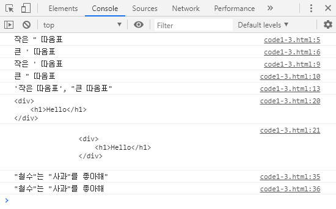


* 예외적인 문자열 사용법
  * 이스케이프 문자의 사용
    * 한 가지 따옴표로만 사용하고 싶을 때
  * 이스케이프 문자란?
    * 특수한 기능을 수행하는 문자
    * 따옴표를 사용하고 싶을 때 이스케이프 문자를 사용
  * 이스케이프 문자의 특수 기능
    * \n : 문자열을 줄 바꿈 할 때 사용
  * 자주 사용하는 이스케이프 문자
    * \t : 일부 웹 브라우저에서는 경고창이 보이지 않음
  * 자바스크립트의 문자열 연결
    * 연결 연산자(덧셈 기호 : +)로 연결 가능


* 숫자 자료형
  * 정수와 유리수의 구분 없이 숫자는 모두 숫자
  * 덧셈 뺄셈이 가능한 것이 숫자. 문자는 덧셈 뺄셈이 불가능하다.
  * 문자열 자료형과 마찬가지로 alert() 함수의 괄호 안에 입력해서 출력합니다.


* 숫자를 사용한 기본적인 사칙 연산
  * 나머지 연산자 : %


ASCII : 7bit로 구성되어 있다. -> 128개

95개는 가시문자. 눈으로 볼 수 있다. 영어, 숫자, 특수문자

나머지 33개는 비가시문자. 제어문자. 눈에는 보이지 않지만 컴퓨터에 명령을 한다. 일정한 간격으로 띄워라. 줄을 바꿔라 등


```javascript
<!DOCTYPE html>
<html>
    <head>
        <script>
            console.log(273, typeof(273));
            console.log("273", typeof("273"));
        </script>
    </head>
    <body>
    </body>
</html>
```


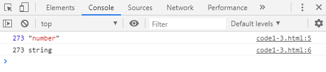


console에 직접 입력해서 확인해볼 수 있다.

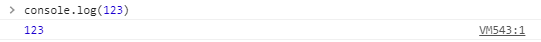


* 불 자료형(boolean)
  * 자바스크립트에서는 참과 거짓이라는 값을 표현할 때 사용


조건문 : 조건분기문. 조건에 따라서 나눠진다. 조건을 판단할 때 boolean 데이터를 쓴다.

반복문 : 조건에 따라 여러번 동일한 작업을 수행할 수 있도록 한다.


* 비교 연산자
  * 비교 연산자란?
    * 두 대상을 비교할 수 있는 연산자
  * 비교 연산자의 종류
    * p40 표2-7
  * 문자열 비교
    * 국어사전의 앞 쪽에 있을수록 값이 작음
  * 유니코드 문자로 비교
    * 모든 언어 비교 가능
    * https://home.unicode.org/
  * 불끼리의 크기 비교
    * 자바스크립트는 true를 1 / false를 0으로 변환 후 비교 연산
    * alert(1 > 0)로 변환 -> true 출력


* 불 사용 예
  * 조건문에서 불의 사용
    * 조건문 괄호 안의 불 표현식이 참이면 중괄호 속 문장 실행
    * 거짓이면 중괄호 속 문장 무시


* 자바 스크립트 논리연산자의 종류

  | 연산자 | 설명             |
  | ------ | ---------------- |
  | !      | 논리 부정 연산자 |
  | &&     | 논리곱 연산자    |
  | \|\|   | 논리합 연산자    |

  

논리곱 : 좌변이 true여야 우변을 수행한다.

논리합 : 좌변이 false여야 우변을 수행한다.


p42

논리곱 연산자는 좌변과 우변이 모두 참일 때만 참이 됩니다.

논리합 연산자는 좌변과 우변 모두 거짓일 때만 거짓이 됩니다.


* 변수
  * 값을 저장할 때 사용하는 식별자
    * 숫자뿐 아니라 모든 자료형 저장 가능
    * 변수를 사용하려면?
      * 변수 선언 : 변수를 만듦
      * 변수에 값 할당
    * 변수 선언 방법
      * var 식별자;


실제 값을 가지고 있는 유형과 reference를 가지고 있는 유형으로 나눠진다.

var 대신 let나 const를 사용하는 것이 좋다.

let은 변수. 값을 수시로 바꿀 수 있다.

const에는 처음에 설정한 값 말고는 쓸 수 없다. 상수형 변수

let abc;

const abcd="1234";


```javascript
<!DOCTYPE html>
<html>
    <head>
        <script>
            /*
                prompt(메시지, 초기값) 함수를 이용해서 반지름을 입력받아서 원의 둘레를 계산 후 출력
            */
            let radius = prompt("반지름을 입력하세요");
            const PI =3.14159;
            console.log(`원의 둘레는 ${radius * 2 * PI}입니다.`);
        </script>
    </head>
    <body>
    </body>
</html>
```


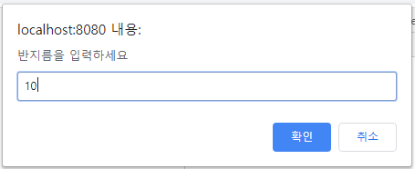


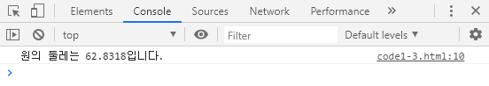


const는 선언하면서 값을 할당해줘야 한다.


* 자료형
  * 문자열, 숫자, 불리언, 함수, 객체와 같은 것
  * JavaScript에는 총 여섯 가지 자료형이 있음
    * cf. undefined 자료형
      * 선언되지 않거나 할당되지 않은 변수
      * 변수에 저장해도 의미가 없음


Javascript에서 데이터 타입이 무엇인지는 할당될 때 결정된다.

변수에 넣은 값에 따라서 자료형이 동적으로 바뀐다.


