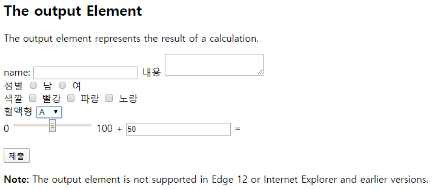
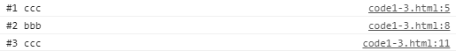

# JavaScript


**가상화, 추상화**
추상 계층 일반적으로 드라이버라고 한다.
하드웨어 전체에 구현 -> 가상화
소프트웨어적으로 하드웨어처럼 할 수 있다.

가상화의 가장 큰 문제는 내 하드웨어 자원을 끌어다 쓰는데 불필요한 부분들이 많다.
우분투 용량만큼을 다 차지한다. 내가 가상화 SW를 통해 mysql, apache 등을 올리고 싶다.
mysql, apache는 용량이 크지 않은데 우분투는 용량이 크다.

**도커**
가상화 SW가 돌고있는 SW의 리소스를 공유해서 쓴다. 우분투가 깔려있으면 우분투를 깔지 않아도 된다.
호스트에 있는 우분투 코어를 공유해서 쓰기 때문에.
올라가는 것들이 공통적으로 깔아야 하는 운영체제 부분을 공유해서 쓴다.

모듈화
옛날에는 전체를 만든 것이 깨지지 않도록 견고하게 운영되는 것이 중요했다.
도커 이미지는 파일. 파일을 실행하면 컨테이너가 된다.
nginx에 내가 만든 파일을 심어 놓은 이미지를 만들어 서비스를 하고 있는데 문제가 있다면 내렸다가 올리면 된다.
파일만 있으면

한 개만 돌렸을 때 부족하면 여러개 띄울 수 있다. 컨테이너 기술 자체가 부하가 크지 않기 때문에
파일 형태로 가지고 있기 때문에 문제가 생겼을 경우 빠르게 대처 가능
쉽게 올리고 내리고 확장 가능

서비스를 따로 쪼갠 것이 마이크로서비스
가급적으로 의존성이 없도록

내가 만들고 싶은 서비스가 뭔지
이 서비스를 어떻게 쪼개서 만들 것인지를 마이크로 서비스를 배우면서 붙인다.

유사사례의 장점을 받아들이고 단점을 개선

내가 만들고자 하는 것이 왜 MSA에 적합한지
컨테이너를 여러개 사용하는 방식을 통해 서비스의 안정성이나 가용성을 보장하는 쪽으로 설계


---

### HTML


https://www.w3schools.com/

HTML Tutorial

HTML Basic ~ HTML id 까지는 혼자서 꼭 보기


h1은 가장 중요도가 높은 정보

브라우저는 중요도를 크기로 나타낸다. 중요한 것은 크게 중요하지 않은 것은 작게

Try it Yourself를 통해 직접 확인할 수 있다.


p : 하나의 문단이라는 것을 의미. 시각적으로는 간격이 있게 보인다. 단락을 나눌 때 사용하는 태그

a : a 태그를 눌렀을 때 이동하는 주소

```html
<a href="https://www.w3schools.com">This is a link</a>
```

태그 이름, 속성 이름 = 속성 값, 속성 이름 = 속성 값...

가운데에 있는 것은 해당하는 태그의 값


태그(요소) : 요소는 태그 이름이다.

속성 : 엘리먼트의 부가적인 정보


태그 중에 닫는 태그가 없는 것들이 있다. 대표적인 것이 img 태그

```html

```


```html
<p/> = <p></p>
```


```html


```


원래 html은 열고 닫고 하는 구조가 맞아야 한다. 이것이 맞지 않으면 자기들의 logic에 맞춰 임의로 해석. 구조에 맞춰서 해주는 것이 좋다.


HTML Button

누를 수 있는 버튼이 제공된다.

```html
<button>Click me</button>
```


HTML List

동일한 level의 정보들이 쭉 나열되는 것

Coffee, Tea, Milk

li는 리스트 아이템, 항목

ul은 unordered. 순서에 관계 없이 나열된다. 이 음료는 나열만 되면 되는것이지 순서는 관계 없다. 동그라미나 네모로 표시

ol은 ordered list. 1,2,3,4로 표시된다.

```html
<ul>
  <li>Coffee</li>
  <li>Tea</li>
  <li>Milk</li>
</ul>

<ol>
  <li>Coffee</li>
  <li>Tea</li>
  <li>Milk</li>
</ol>
```


HTML Element


태그별로 반드시 가져가야 하는 속성이 있고, 옵션으로 줄 수 있는 속성이 있다.

```html

```

alt : 이미지가 로드되지 않았을 경우 파일의 정보를 보여주는 것. 시각 장애인들을 위한 정보 제공에 alt를 이용. 소리로 읽어줄 경우


HTML Style

글자 색, 글자 크기, 밑줄 등

```html
<!DOCTYPE html>
<html>
<body>

<p>I am normal</p>
<p style="color:red;">I am red</p>
<p style="color:blue;">I am blue</p>
<p style="font-size:50px;">I am big</p>

</body>
</html>
```

property : 해당하는 태그 별로 가지고 있는 속성 목록


Text Alignment : 정렬 방식


HTML Tables


테이블 형태의 출력. 목록.

동일한 의미의 데이터를 담고 있는 것들이 쭉 나열된 것을 목록이라고 한다.

학생 목록이라고 하면 학번, 이름, 나이, 전공 등이 쭉 나열된다.

테이블을 많이 사용한다.

가로 축은 해당하는 정보가 가지고 있는 속성

세로 줄은 동일한 속성을 가지고 있는 데이터의 나열

```html
<!DOCTYPE html>
<html>
<body>

<h2>Basic HTML Table</h2>

<table style="width:100%"; border="1">
  <tr>
    <th>Firstname</th>
    <th>Lastname</th> 
    <th>Age</th>
  </tr>
  <tr>
    <td>Jill</td>
    <td>Smith</td>
    <td>50</td>
  </tr>
  <tr>
    <td>Eve</td>
    <td>Jackson</td>
    <td>94</td>
  </tr>
  <tr>
    <td>John</td>
    <td>Doe</td>
    <td>80</td>
  </tr>
</table>

</body>
</html>
```


tr : table row. 행. 한 줄에 들어갈 데이터의 구성을 나타낸다.

tr 안에는, 한 줄 안에는 각각의 column이 있다. 그것을 td, th로 나눈다.

제목들이 th에, 테이블 데이터가 td에 들어간다.

border는 테이블의 테두리를 만드는 부분


```html
<!DOCTYPE html>
<html>
<body>

<h2>Basic HTML Table</h2>

<table style="width:100%"; border="1">
  <tr>
    <th colspan="2">Name</th> 
    <th>Age</th>
  </tr>
  <tr>
    <td>Jill</td>
    <td>Smith</td>
    <td rowspan="3">70</td>
  </tr>
  <tr>
    <td>Eve</td>
    <td>Jackson</td>
  </tr>
  <tr>
    <td>John</td>
    <td>Doe</td>
  </tr>
</table>

</body>
</html>
```


colspan : column을 합친다.

rowspan : row를 합친다.


대부분 다루는 데이터들은 matrix(table) 형태이다.

table shell들을 merge할 수 있는 colspan, rowspan을 잘 사용할 줄 알아야 한다.


HTML Classes

ID : 유일한 값. 문서 안에서 그 ID는 하나만 있어야 한다.

Class : 집합. 분류하다. 비슷한 것들 끼리 묶어놓은 것을 말한다. 똑같은 그룹들이 있다.

이 문서에서 유일하게 식별해 제어할 것은 ID라는 속성 부여

묶어서 제어한다면 Class 속성을 부여

짝수 번째 줄 검은 배경 -> Class 부여

첫 번째 줄 빨간 색 -> ID 부여


sytle이라는 tag를 쓰면 css

.cities

. 으로 시작하는 것은 class

배경을 black, 글자 색 흰 색, margin은 띄어쓰기(여백)


```html
<!DOCTYPE html>
<html>
<head>
<style>
#first{
  color: yellow;
}
.cities {
  background-color: black;
  color: white;
  margin: 20px;
  padding: 20px;
}
</style>
</head>
<body>

<div class="cities" id="first">
<h2>London</h2>
<p>London is the capital of England.</p>
</div> 

<div class="cities">
<h2>Paris</h2>
<p>Paris is the capital of France.</p>
</div>

<div class="cities">
<h2>Tokyo</h2>
<p>Tokyo is the capital of Japan.</p>
</div>

</body>
</html>
```


전부 cities라는 class를 부여

ID는 #을 사용.

selector

jQuery를 잘 쓰려면 select를 이용해 문서에서 원하는 내용을 잘 찾아야 한다.

#으로 시작 : ID selector

. 으로 시작 : Class selector


```html
<!DOCTYPE html>
<html>
<head>
<style>
h2 {				// h2인 부분에만 적용
  color: blue;
}
#first {			// ID가 first에 해당하는 부분에만 적용
  color: yellow;
}
.cities {			// cities라는 클래스에 해당하는 부분에만 적용
  background-color: black;
  color: white;
  margin: 20px;
  padding: 20px;
}
</style>
</head>
<body>

<div class="cities" id="first">
<h2>London</h2>
<p>London is the capital of England.</p>
</div> 

<div class="cities">
<h2>Paris</h2>
<p>Paris is the capital of France.</p>
</div>

<div class="cities">
<h2>Tokyo</h2>
<p>Tokyo is the capital of Japan.</p>
</div>

</body>
</html>
```


HTML Form

Form 태그 : 브라우저에서 입력된 정보를 서버쪽으로 전달하는 용도로 사용한다.

input : 입력한다. 자유 입력 방식. 사용자가 자유롭게 입력. input은 한 줄로 쭉 나온다. 개시판 글 쓰기 할 경우에는 input으로 받기 힘들다. -> text area 사용

name 속성을 줘야 배타적으로 된다.

값이 서버로 전달된다.


```html
<!DOCTYPE html>
<html>
<body>

<h2>The output Element</h2>
<p>The output element represents the result of a calculation.</p>

<form action="/action_page.php"
oninput="x.value=parseInt(a.value)+parseInt(b.value)">
  name: <input type="text">
  내용 <textarea></textarea>
  <br>
  성별
  <input type="radio" name="sex"> 남
  <input type="radio" name="sex"> 여
  <br>
  색깔
  <input type="checkbox" name="color"> 빨강
  <input type="checkbox" name="color"> 파랑
  <input type="checkbox" name="color"> 노랑
  <br>
  혈액형
  <select>
    <option>A</option>
    <option>B</option>
    <option>AB</option>
    <option>O</option>
  </select>
  <br>
  0
  <input type="range" id="a" name="a" value="50">
  100 +
  <input type="number" id="b" name="b" value="50">
  =
  <output name="x" for="a b"></output>
  <br><br>
  <input type="submit">
</form>

<p><strong>Note:</strong> The output element is not supported in Edge 12 or Internet Explorer and earlier versions.</p>

</body>
</html>
```





---

### JavaScript


* 문자열을 입력하는 방법
  * 숫자를 입력 받는 방법
    * 문자열을 입력 받은 후 숫자로 변환
    * prompt는 사용자에게 입력 창을 보여준다.


```javascript
<script>
	let inputNumber = prompt('숫자를 입력하세요');	// 사용자 입력을 받는 코드
    console.log(inputNumber);				// 입력받은 값을 콘솔에 출력
    alert(inputNumber)					// 입력받은 값을 사용자에게 알림

    let yn = confirm('1 + 2 = 3 이 맞습니까?');
    console.log(yn);				// 확인을 클릭하면 true, 취소를 클릭하면 false를 반환
</script>
```

confirm : 사용자에게 물어보는 것


confirm은 잘 사용하지 않는다. toast 사용

Toast.js

https://www.w3schools.com/bootstrap4/bootstrap_toast.asp


* 문자열과 숫자를 더하는 


```javascript
> "52 + 123"
< "52 + 123"
> typeof('52 + 123')
< "string"
> 52 + 123
< 175
> typeof(52 + 123)
< "number"
> '52' + 123
< "52123"
> '52' + '123'
< "52123"
```

문자열 + 숫자를 했을 경우 숫자가 문자로 바뀐다.


숫자와 문자열 덧셈 연산은 문자열이 우선

문자열 + 숫자 -> 문자열 + 문자열 -> 문자열문자열


숫자와 문자열 덧셈을 제외한 사칙 연산은 숫자가 우선

```javascript
> '52 * 100'
< "52 * 100"
> 52 * 100
< 5200
> '52' * 100
< 5200
> '52' * '100'
> 5200
```

javascript가 묵시적으로 형 변환을 한다. 안 보이게 알아서 바꾼다.

반대되는 개념이 명시적으로 강제적으로 형 변환


명시적 형변환 = 강제적으로 형변환 (반대: 암시적 형변환)

다른 데이터 타입을 숫자형으로 변환 -> Number() 함수를 사용

다른 데이터 타입을 문자열로 변환 -> String() 함수를 사용


```javascript
> typeof("52")
< "string"
> typeof(Number("52"))
< "number"
> typeof(1234)
< "number"
> typeof(String(1234))
< "string"
> Number("abcd")
< NaN
```

NaN : Not a Number. 자료형은 숫자이나 자바스크립트로 나타낼 수 없는 숫자를 의미한다.

예) 자바스크립트에서는  복소수 표현이 불가능


```javascript
> let number = Math.sqrt(-3);
< undefined
> console.log(number)
< NaN
```


* Boolean() 함수 : 다른 자료형을 불(bool) 자료형으로 변환 -> 명시적인 형변환
  * 0, NaN, '', null, undefined -> false로 변환
  * 나머지 -> true로 변환


```javascript
> Boolean(0)
< false
> Boolean(NaN)
< false
> Boolean('')
< false
> Boolean(null)
< false
> Boolean(undefined)
< false
> Boolean(1)
< true
> Boolean(' ')
< true
> Boolean(-1)
< true
> Boolean(false)
< false
> Boolean(true)
< true
```


0, NaN, '', null, undefined 데이터에 대한 암시적인 형변환 -> Boolean() 함수의 결과와 동일

```javascript
> 0 == true
< false
> !!0
< false
> !!NaN
< false
> !!''
< false
> !!null
< false
> !!undefined
< false
```


자동 형변환(= 암시적 형변환)의 문제점

```javascript
console.log('' == false);
console.log('' == 0);
console.log(0 == false);
console.log('273' == 273);
```

모두 true를 반환한다.

자동적인 형변환이 이루어지면 비논리적인 비교가 이루어진다. 이런 것들을 코드로 만들어뒀을 경우 혼란을 야기한다. 의도하지 않은 코드가 실행될 수 있다.

이런 것들을 명시적으로 비교하기 위해서 나온 것이 일치 연산자이다. (p65)

일치 연산자 : 양변의 자료형과 값의 일치 여부를 확인

=== : 양번의 자료형과 값이 모두 일치함

!== : 양변의 자료형과 값이 일치하지 않음


```javascript
console.log('' === false);
console.log('' === 0);
console.log(0 === false);
console.log('273' === 273);
```

모두 false를 반환한다.


탬플릿 문자열

```javascript
const a = "철수";
const b = "사과";
console.log('"' + a + '"는 "' + b + '"를 좋아해');
console.log(`"${a}"는 "${b}"를 좋아해 ... ${a+b} ... `); 
```

탬플릿 문자열은 백틱 기호로 감싸 만들며, 문자열 내부에 ${} 기호를 사용하고 내부에 표현식을 넣으면 일반 수식과 똑같이 동작


스코프 : 선언된 변수가 가질 수 있는 유효 범위. 대부분 중괄호로 구분한다.

스코프(유효 범위)에 문제가 있기 때문에 var를 사용하지 않는 것이 좋다. var 키워드는 전역 스코프 위치에 변수를 선언하는 키워드이다.


```javascript
<script>
	{
        var variable = 273;
    }
    {
        console.log(variable);
    }
    console.log(variable);
</script>
```

스코프가 달라도 다른 영역에 있는 변수를 참조할 수 있다.

윈도우 브라우저에 variable을 지정해놓기 때문에 어디서든 참조 가능하다. 프로그램 규모가 작을 때에는 어디서 선언되고 값이 어디서 변경되는지 확인할 수 있지만, 프로그램이 커지면 의도하지 않게 값이 변경될 수 있다.


let을 사용하면 스코프 규칙을 명시적으로 적용할 수 있기 때문에 좋다.

```javascript
<script>
	{
        let variable = 273;
    }
    {
        let variable = 100;
        console.log(variable);
    }
    let variable = 200;
    console.log(variable);
</script>
```


익명 함수 (anonymous function)

```javascript
function (){
    
}
```

한번 만들어놓고 계속 호출하려면 이름이 있어야한다.

일회성으로 실행될 경우 익명 함수를 사용한다.


* 화살표 함수 (arrow function)
  * 어떤 값이 들어가면 화살표가 가리키는 값을 수행하는 함수.
  * 현재 i값을 찍어준다.

* 동기는 하나씩 처리하는 것이다. abcd가 있으면 a가 다 끝나야 b로 넘어가는 것이다. 동기화 방식
  * 일이 명확하게 끝나고 단계적으로 진행해야 한다면 동기

* 비동기는 일이 끝나지 않은 상태에서 다른 일을 하는 것이다. 비동기에는 시켜놓은 일의 결과가 나타난다. call back. 비동기 방식.
  * 비동기는 사이드로 진행되는 일이 많은 시간이 걸리는 경우. main이 되는 컨텐츠를 먼저 뿌려주고 하나씩 나머지 컨텐츠 뿌려주기. 호출 다하면 알려줘. call back
  * 최신 트랜드는 전부 비동기이기 때문에 비동기에 대한 처리들이 굉장히 복잡해진다.

setTimeout()은 대표적인 비동기 함수. setTimeout()을 호출한 다음 루프를 돈다. 3번 연속 호출된다. setTimeout은 일정 시간 지나면 log가 남는다. 


```javascript
<script>
	for (var i = 0; i < 3; i++) {
        setTimeout(() => {
            console.log(i);
        }, 1000 * i);
    }
</script>
```


```javascript
<script>
	for (var i = 0; i < 3; i++) {
        ((i) => {
            setTimeout(() => {
                console.log(i);
            }, 1000 * i)
        })(i);
    }
</script>
```


```javascript
<script>
	for (let i = 0; i < 3; i++) {
        setTimeout(() => {
            console.log(i);
        }, 1000 * i)
    }
</script>
```


```javascript
<script>
	for (var i = 0; i < 3; i++) {
        console.log("#1", i);
        setTimeout(() => {
            console.log("#2", i);
        }, 1000 * i)
    }
</script>
```


var는 재정의 해도 문제가 발생하지 않는다.


```javascript
<script>
	var name = "aaa";
    console.log("#1", name);
    {
        var name = "bbb";
        console.log("#2", name);
    }
    console.log("#3", name);
</script>
```


```javascript
<script>
	console.log("#1", name);
    {
        var name = "bbb";
        console.log("#2", name);
    }
    var name = "ccc";
    console.log("#3", name);
</script>
```





```javascript
<script>
	//console.log("#1", name);
    {
        let name = "bbb";
        console.log("#2", name);
    }
    let name = "ccc";
    console.log("#3", name);
</script>
```


결론 : let을 사용해라


식별자 : 변수명, 함수명, 속성명, 메서드명. 이름. unique하게 구분할 수 있어야 하기 때문에 식별자라고 한다.

주석 : 설명

문자열 : 문자, 단어들의 나열

변수 : 변하는 수. 변하는 값을 저장하는 메모리 공간.


typeof()는 연산자에 속한다. 괄호를 열고 사용할 수도 있어서 함수로 착각할 수 있다. (p56)


호이스팅 : 선언되어있는 변수나 함수가 자신이 갈 수 있는 스코프 중 최상위로 가는 것이다.

함수도 호이스팅이 된다.


```javascript
<script>
	console.log("2 + 3 = ", add(2, 3));
    function add(x, y) {
        return x + y;
    }
    console.log("4 + 5 = ", add(4, 5));
</script>
```


파란색으로 된 9가 add 함수의 호출 결과이다.

함수가 정의되기 전에 호출해도 호이스팅 되었기 때문에 쓸 수 있다.

위치에 관계 없이 쓸 수 있다.


## 조건문

* if 조건문
  * 불리언 표현식이 true면 문장 실행
  * false면 문장 무시
    * 조건문에 의해 여러 문장을 실행하는 경우 중괄호로 감싼다.


```javascript
<script>
	const date = new Date();
    const hour = date.getHours();
    const week = date.getDay();
    console.log(week);

    console.log('현재는 ' + hour + '시 입니다.');
    console.log(`현재는 ${hour}시 입니다.`);
    // 현재 시간이 오전, 오후 여부를 판정
    if (hour < 12) {
        console.log('오전입니다.');
    }
    if (hour >= 12) {
        console.log('오후입니다.');
    }
    if (week == 0) console.log('일요일입니다.');
    if (week == 1) console.log('월요일입니다.');
    if (week == 2) console.log('화요일입니다.');
    if (week == 3) console.log('수요일입니다.');
    if (week == 4) console.log('목요일입니다.');
    if (week == 5) console.log('금요일입니다.');
    if (week == 6) console.log('토요일입니다.');
</script>
```

week는 요일을 숫자로 반환한다. 숫자 4가 나온다. 오늘은 목요일

월요일은 1, 화요일은2 ...


```javascript
<script>
	const date = new Date();
    const hour = date.getHours();
    const week = date.getDay();

    console.log('현재는 ' + hour + '시 입니다.');
    console.log(`현재는 ${hour}시 입니다.`);
    // 현재 시간이 오전, 오후 여부를 판정
    // p80 if 구문을 이용한 표현
    /*
    if (hour < 12) {
        console.log('오전입니다.');
    }
    if (hour >= 12) {
        console.log('오후입니다.');
    }
    */
    // p81 if - else 구문을 이용한 표현
    if (hour < 12) {
        console.log('오전입니다.');
    } else {
        console.log('오후입니다.');
    }
    // p85 if - else if 구문을 이용해서 표현
    /*
    if (week == 0) console.log('일요일입니다.');
    else if (week == 1) console.log('월요일입니다.');
    else if (week == 2) console.log('화요일입니다.');
    else if (week == 3) console.log('수요일입니다.');
    else if (week == 4) console.log('목요일입니다.');
    else if (week == 5) console.log('금요일입니다.');
    else console.log('토요일입니다.');
    */
    // p87 switch 구문을 이용해서 표현
    switch (week) {
        case 0: console.log('일요일입니다.');
            break;
        case 1: console.log('월요일입니다.');
            break;
        case 2: console.log('화요일입니다.');
            break;
        case 3: console.log('수요일입니다.');
            break;
        case 4: console.log('목요일입니다.');
            break;
        case 5: console.log('금요일입니다.');
            break;
        default: console.log('잘못된 요일입니다.');
    }
</script>
```


**삼항연산자**


```javascript
<script>
	// 사용자로부터 숫자를 입력받습니다.
    // 숫자가 아닌 경우 콘솔에 오류 메시지를 출력하고,
    // 숫자인 경우 짝수, 홀수 여부를 판정해서 콘솔에 메시지를 출력

    let num = prompt("숫자를 입력하세요.");
    num = Number(num);
    if (isNaN(num)) {
        console.log("숫자가 아닙니다.");
    } else {
        if (num % 2 === 0) {
            console.log("짝수입니다.");
        } else {
            console.log("홀수입니다.");
        }
    }
</script>
```

isNaN() 함수 : 들어가있는 변수가 NaN인지 확인해준다. 비교연산자를 가지고 비교(num == NaN)하는 것은 불가능하다.


* 단항 연산자
  * typeof, -
* 이항 연산자 : 항이 2개
  * 일반적인 사칙연산
* 삼항 연산자
  * 조건식 ? 참인경우 : 거짓인경우;


```javascript
<script>
	let num = prompt("숫자를 입력하세요.");
    num = Number(num);
    if (isNaN(num)) {
        console.log("숫자가 아닙니다.");
    }
    // 삼항 연산자를 이용해서 구현
    // 조건식 ? 참인경우 : 거짓인경우;
    num % 2 === 0 ? console.log("짝수입니다.") : console.log("홀수입니다.");
</script>
```


* p89 짧은 조건식(short-circuit)
  * A || B  <=  A 또는 B, 둘 중 하나가 참이면 참 = A와 B, 둘 모두 거짓이여야 거짓
    * B라는 기능이 A가 거짓일 경우에만 실행하도록 할 수 있다.
  * A&&B  <= A와 B, 둘 모두 참이여야 참 = A 또는 B 둘 중 하나가 거짓이면 거짓


```javascript
<script>
	let breaktime = false;
    breaktime || console.log("공부를 합니다.");
</script>
```

|| 는 선행 조건이 false인 경우에만 뒤에있는 구문을 실행한다.

&& 는 선행 조건이 true인 경우에만 뒤에 있는 구문을 실행한다.


```javascript
<script>
	// 입력한 숫자의 홀짝 여부를 판정하는 코드

    let input = prompt("숫자를 입력하세요");

    // 방법1. if - else 구문을 이용한 구현
    if (input % 2 === 0) {
        console.log("짝수");
    } else {
        console.log("홀수");
    }

    // 방법2. 삼항 연산자를 이용한 구현
    input % 2 === 0 ? console.log("짝수") : console.log("홀수");

    // 방법3. 짧은 조건문을 이용한 구현
    input % 2 === 0 || console.log("홀수");
    input % 2 === 0 && console.log("짝수");
</script>
```


---

### 반복문


```javascript
for([1]변수=초기값; [2][5]조건문; [4][7]증가분) {
	[3][6]조건문을 만족하는 경우 수행할 구문
}
```


* 배열 (p98)
  * 여러 개의 변수를 한꺼번에 선언해 다룰 수 있는 자료형


```javascript
<script>
	// p98 배열
    // 배열 선언
    let arr = [ 273, 'String', true, function() {}, {}, [100, 200]];
    //            숫자   문자열    불      함수        객체     배열
    console.log(arr);
    console.log(arr.length);
    console.log(arr[0]);
</script>
```


배열은 length라는 속성을 반드시 가지고 있다. 배열 요소의 개수를 나타내주는 속성

배열의 length는 마지막 배열의 index보다 하나 크다.


```javascript
<script>
	let arr = [ 273, 'String', true, function() {}, {}, [100, 200]];
    for (let i = 0; i < arr.length; i++) {
        console.log(arr[i]);
    }
</script>
```


```javascript
arr.forEach(ii => console.log(ii));
```

forEach와 같은 iterator 형식을 많이 사용. 방을 순차적으로 돈다. 현 시점에서의 그 값을 사용해야 한다. 그것을 받아오는 것이 ii

각각의 배열(방)에 들어가 거기에 있는 값을 실행에 사용해라.


```javascript
<script>
	let arr = [ 273, 'String', true, function() {}, {}, [100, 200]];

    console.log("방법1");
    console.log(arr[0]);
    console.log(arr[1]);
    console.log(arr[2]);
    console.log(arr[3]);
    console.log(arr[4]);
    console.log(arr[5]);

    console.log("방법2");
    for (let i = 0; i < arr.length; i++) {
        console.log(arr[i]);
    }

    console.log("방법3");
    arr.forEach(function(item) {
        console.log(item);
    });

    console.log("방법4");
    arr.forEach(ii => console.log(ii));
</script>
```


```javascript
<script>
	let arr = [ 273, 'String', true, function() {}, {}, [100, 200]];

    console.log(arr);
    console.log(arr.length);

    // 배열 항목 추가
    arr.push("xyz");
    console.log("push()이후 배열의 길이", arr.length);
</script>
```


```javascript
<script>
    // p102
    let value = 0;

    // 현재 시간을 밀리세컨드(1/1000초) 단위로 가져오는 것
    let startTime = new Date().getTime();

    while (new Date().getTime() < startTime + 1000) {
        value++;
    }

    console.log("1초 동안 while 루프를 수행한 횟수 : " + value);
</script>
```


```javascript
<script>
    // 사용자 입력이
    // 숫자이면 짝수, 홀수 여부를 콘솔에 출력 후 다시 입력을 요구
    // 숫자가 아니면 메시지를 콘솔에 출력 후 종료

    let input = prompt("숫자를 입력하세요");
    while (!isNaN(input)) {
        input % 2 === 0 ? console.log("짝수") : console.log("홀수");
        input = prompt("숫자를 입력하세요");
    }
    console.log("종료");
</script>
```


```javascript
<script>
    // 숫자 맞추기 게임
    // 1~20 사이의 임의의 숫자를 맞추는 게임

    const MIN = 1;
    const MAX = 20;

    let answer = Math.floor(Math.random() * (MAX - MIN + 1)) + MIN;
    let guesses = 0;  // 사용자가 입력한 횟수
    let input;

    do {
        input = prompt(`${MIN} ~ ${MAX} 사이의 숫자를 입력하세요.`);
        input = Number(input);
        guesses++;
        if (input > answer) {
            console.log("입력한 값 보다 작은 값을 입력하세요");
        } else if (input < answer) {
            console.log("입력한 값 보다 큰 값을 입력하세요.");
        } else {
            console.log(`정답입니다. (시도횟수 : ${guesses})`);
        }
    } while (input !== answer);
</script>
```


do while은 일반적으로 사용하지 않도록 한다.


```javascript
<script>
    const fruits = [ "사과", "오렌지", "딸기", "바나나" ];

    console.log("방법1. for loop");
    for (let i = 0; i < fruits.length; i ++) {
        console.log(fruits[i]);
    }

    console.log("방법2. for in");
    for (let i in fruits) {
        console.log(fruits[i]);
    }

    console.log("방법3. forEach");
    fruits.forEach(function(fruit) { 
        console.log(fruit);
    });

    console.log("방법4. forEach + arrow function");
    fruits.forEach(fruit => console.log(fruit));
</script>
```


