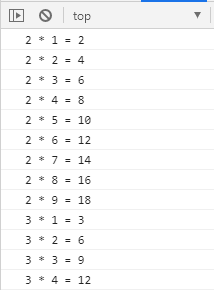

# JavaScript


### HTML, JavaScript, jQuery 연습

https://www.w3schools.com/html/default.asp

https://www.w3schools.com/js/default.asp

https://www.w3schools.com/jquery/default.asp


## 반복문

* for 반복문

  * 조건(while 반복문)보다 횟수에 비중을 둘 때 사용하는 반복문

    ```javascript
    for (초기식; 조건식; 종결식) {
        문장
    }
    ```

    

Visual Studio Code 실행 > File > Open Folder 메뉴 선택 > C:\JavaScript 폴더 선택

New File 아이콘 클릭 > test.html 파일 생성


Terminal > New Terminal 메뉴 클릭 (콘솔 창이 뜬다.)

```bash
PS C:\javascript> npx http-server
```


```javascript
<html>
    <head>
        <script>
            for (let i = 0; i < 10; i++) {
                console.log(i);
            }
        </script>
    </head>
    <body>

    </body>
</html>
```


브라우저(크롬)에서 http://localhost:8080/test.html 로 접속 > 개발자도구(F12) 실행


```javascript
<script>
    for (let i = 10; i >= 0; i--) {
        console.log(i);
    }
</script>
```


#### 구구단

```javascript
        <script>
            /*
                2 * 1 = 2
                2 * 2 = 4
                    :
                2 * 9 = 18
                3 * 1 = 3
                    :
                9 * 9 = 81
            */
            for (let dan = 2; dan <= 9; dan++) {
                for (let num = 1; num <= 9; num++) {
                    console.log(`${dan} * ${num} = ${dan * num}`);
                }
            }
        </script>
```





**사용자 화면에 구구단 출력**

콘솔 창이 아니라 화면에 보이게 하고싶다 -> body

문서 전체에서 어디에 있는 div인지 알아야만 거기에 값을 넣을 수 있다. 그것을 쉽게 하기 위해 id라는 속성을 부여한다.

script에서 계산한 것을 display라는 id를 가지고 있는 div에 넣고싶다.

```javascript
<html>
    <head>
        <script>
            window.onload = function() {
                let div = document.getElementById("display");
                for (let dan = 2; dan <= 9; dan++) {
                    for (let num = 1; num <= 9; num++) {
                        //div.innerText = div.innerText + `${dan} * ${num} = ${dan*num}\n`;
                        div.innerText += `${dan} * ${num} = ${dan * num}\n`;
                    }
                }               
            }
        </script>
    </head>
    <body>
        <div id="display"></div>
    </body>
</html>
```

html 문서는 위에서부터 쭉 해석하면서 내려온다. 랜더링 하는 과정에서 "display"가 생성이 안 되어 있으므로 오류가 난다.

첫 번째 방법은 `<script>`를 `<div>` 밑에 가져다 놓는다. 하지만 `<script>`는 가급적 `<head>`라는 태그 안에 두는 것이 좋다.

두 번째 방법은 모든 문서가 로딩 되고 나면 하면 된다. 그것을 해 주는 것이 `window.onload`이다.

덮어쓰는 것을 막기 위해서는 기존에 있던 내용에 더하면 된다. -> `+=` 사용

Element : 요소 -> 태그

Attribute : 속성

```html
<div id=~>
```

div : element

id : 속성 이름

~ : 속성 값


태그와 태그 사이에 문서를 넣고 싶은데 태그를 찾아야 한다. 유니크하게 식별될 수 있으면 id를 이용하는 것이 좋다.

`innerText`는 태그 사이에 값을 넣어주는데 일반적인 text로 인식한다.

`innerHTML`은 HTML 코드처럼 해석한다. `\n`는 공백 문자로 해석해서 다음 줄로 넘어가지 않고 뒤에 계속 붙는다. 내가 입력한 코드가 HTML의 태그 요소일 경우 해당 역할을 반영하여 출력한다.


```javascript
<html>
    <head>
        <script>
            window.onload = function() {
                let div = document.getElementById("display");
                for (let dan = 2; dan <= 9; dan++) {
                    for (let num = 1; num <= 9; num++) {
                        div.innerText += `<b>${dan}</b> * ${num} = ${dan * num}\n`;
                    }
                }
                for (let dan = 2; dan <= 9; dan++) {
                    for (let num = 1; num <= 9; num++) {
                        div.innerHTML += `<b>${dan}</b> * ${num} = ${dan * num}\n`;
                    }
                }
            }
        </script>
    </head>
    <body>
        <div id="display"></div>
    </body>
</html>
```


#### 구구단 출력


```
2 * 1 = 2	3 * 1 = 3	4 * 1 = 4	5 * 1 = 5	6 * 1 = 6	7 * 1 = 7	8 * 1 = 8	9 * 1 = 9

2 * 2 = 4	3 * 2 = 6	4 * 2 = 8	5 * 2 = 10	6 * 2 = 12	7 * 2 = 14	8 * 2 = 16	9 * 2 = 18

2 * 3 = 6	3 * 3 = 9	4 * 3 = 12	5 * 3 = 15	6 * 3 = 18	7 * 3 = 21	8 * 3 = 24	9 * 3 = 27

2 * 4 = 8	3 * 4 = 12	4 * 4 = 16	5 * 4 = 20	6 * 4 = 24	7 * 4 = 28	8 * 4 = 32	9 * 4 = 36

2 * 5 = 10	3 * 5 = 15	4 * 5 = 20	5 * 5 = 25	6 * 5 = 30	7 * 5 = 35	8 * 5 = 40	9 * 5 = 45

2 * 6 = 12	3 * 6 = 18	4 * 6 = 24	5 * 6 = 30	6 * 6 = 36	7 * 6 = 42	8 * 6 = 48	9 * 6 = 54

2 * 7 = 14	3 * 7 = 21	4 * 7 = 28	5 * 7 = 35	6 * 7 = 42	7 * 7 = 49	8 * 7 = 56	9 * 7 = 63

2 * 8 = 16	3 * 8 = 24	4 * 8 = 32	5 * 8 = 40	6 * 8 = 48	7 * 8 = 56	8 * 8 = 64	9 * 8 = 72

2 * 9 = 18	3 * 9 = 27	4 * 9 = 36	5 * 9 = 45	6 * 9 = 54	7 * 9 = 63	8 * 9 = 72	9 * 9 = 81
```


```javascript
<html>
    <head>
        <script>
            window.onload = function() {
                let div = document.getElementById("display");
                for (let num = 1; num <= 9; num++) {
                    for (let dan = 2; dan <= 9; dan++) {
                        div.innerText += `${dan} * ${num} = ${dan * num}\t`;
                    }
                    div.innerText += '\n';
                }
            }
        </script>
    </head>
    <body>
        <pre id="display"></pre>
    </body>
</html>
```

`tab` 문자가 그대로 적용되도록 하는 태그가 `<pre>` 태그이다.


#### 사용자가 입력한 숫자에 해당하는 구구단 출력

```javascript
<html>
    <head>
        <script>
            window.onload = function() {
                let div = document.getElementById("display");
                let dan = prompt("몇 단을 출력할까요?", "2");
                for (let num = 1; num <= 9; num ++) {
                    // div.innerText = div.innerText + `${dan} * ${num} = ${dan*num} \n`;
                    div.innerText += `${dan} * ${num} = ${dan*num} \n`;
                }
            }
        </script>
    </head>
    <body>
        <div id="display"></div>
    </body>
</html>
```


#### 1초 동안 for 문이 실행된 횟수를 출력

```javascript
<html>
    <head>
        <script>
            window.onload = function() {
                // P107 코드 4-13
                // 1초 동안 for 문이 실행된 횟수를 출력

                // 현재 시간을 밀리세컨드(1/1000초) 단위로 반환
                const startTime = new Date().getTime();
                let cps = 0;
                for (cps = 0; new Date().getTime() < startTime + 1000; cps++) {
                    // do nothing ...
                }
                document.getElementById("display").innerText = `1초 동안 수행된 for 문 횟수 : ${cps}`;
            }
        </script>
    </head>
    <body>
        <div id="display"></div>
    </body>
</html>
```


#### 배열 요소 접근 방법

```javascript
<html>
    <head>
        <script>
            window.onload = function() {
                let fruits = [ '사과', '딸기', '바나나', '배' ];

                console.log('for 문을 이용한 출력');
                for (let i = 0; i < fruits.length; i ++) {
                    console.log(fruits[i]);
                }

                console.log('for in 문을 이용한 출력');
                for (let i in fruits) {
                    console.log(fruits[i]);
                }

                console.log('forEach 문을 이용한 출력 1');
                fruits.forEach(function(i) {
                    console.log(i);
                });

                console.log('forEach 문을 이용한 출력 2');
                fruits.forEach(i => {
                    console.log(i);
                });
            }
        </script>
    </head>
    <body>
        <div id="display"></div>
    </body>
</html>
```


#### 아래와 같은 형식으로 콘솔에 출력

```
1
12
123
1234
12345
123456
1234567
12345678
123456789
```


```javascript
<html>
    <head>
        <script>
            window.onload = function() {
                let output = '';
                for (let y = 1; y <= 9; y ++) {
                    output = '';
                    for (let x = 1; x <= y; x ++) {
                        output += x;
                    }
                    console.log(output);
                    document.getElementById("display").innerHTML += output+'<br>';
                }
            }
        </script>
    </head>
    <body>
        <div id="display"></div>
    </body>
</html>
```

줄을 바꾸려고 하면 `<br>`을 넣어줘야 한다.


```
*
**
***
****
*****
******
*******
********
*********
```

output += x; 를 output += '*';로 변경


### break, continue 문


for문 가운데를 true로 했다 -> 무한 루프

`confirm`은 사용자에게 예(true), 아니요(false)를 물어보는 것이다.

`break`는 반복문의 조건에 관계 없이 반복문 수행을 종료할 때 사용. 반복문을 빠져나온다.

```javascript
<html>
    <head>
        <script>
            window.onload = function() {
                //  코드 4-18 
                for (let i = 0; true; i ++) {
                    console.log(`${i}번째 반복입니다.`);
                    //  취소 클릭 -> false 반환 -> !false => true -> break 수행
                    if (!confirm("계속할까요?")) {
                        //  반복문을 빠져나올 때 사용하는 구문
                        break;
                    } 
                }
                console.log(`프로그램을 종료합니다.`);
            }
        </script>
    </head>
    <body>
        <div id="display"></div>
    </body>
</html>
```


`continue` : 반복문에서 아래 쪽에 있는 것을 무시하고 다음 루프로 넘어가는 것이다. 


```javascript
<html>
    <head>
        <script>
            window.onload = function() {
                for (let i = 0; i < 10; i++) {
                    console.log("이전", i);
                    if (i % 2 === 0) {
                        continue;
                    }
                    console.log("이후", i);
                }
            }
        </script>
    </head>
    <body>
        <div id="display"></div>
    </body>
</html>
```


#### 배열에 포함된 숫자의 합

**for in 구문 vs for of 구문**

```javascript
<html>
    <head>
        <script>
            window.onload = function() {
                //  배열에 포함된 숫자의 합을 구하시오.
                const values = [ 100, '백', 200, '이백', 300, '삼백' ];
                let sum = 0;
                // //  for in 구문은 배열의 인덱스를 반환
                // for (let i in values) {
                //     let v = Number(values[i]);
                //     if (!isNaN(v)) {
                //         sum += v;
                //     }
                // }
                //  for of 구문은 배열의 값을 반환
                for (let i of values) {
                    let v = Number(i);
                    if (!isNaN(v)) {
                        sum += v;
                    }
                }
                console.log(`배열에 포함된 숫자의 합은 ${sum}입니다.`);
                document.getElementById("result").innerText = `배열에 포함된 숫자의 합은 ${sum}입니다.`;
            }
        </script>
    </head>
    <body>
        <div id="result"></div>
    </body>
</html>
```


```
배열에 포함된 숫자의 합은 600입니다.
```


## 함수

* 입력 -> 매개변수 = 파라미터 = 인자(값)
* 함수(규칙)
* 출력 -> 반환값 = 리턴값


* 함수 리터럴

  ```javascript
  function add (x, y) { return x + y; }
  ```

  function : function 키워드

  add : 함수명(식별자)

  (x, y) : 매개변수 목록 = 파라미터

  { return x + y; } : 함수 본문(body)


* 함수 정의 방식
  * 함수 선언문 (function statement)
  * 함수 표현식 (function expression)
  * Function() 생성자 함수


#### 함수 선언문을 이용한 함수 정의 방식

* 함수 리터럴과 동일
* 반드시 함수 이름을 정의해야 함


```javascript
// 함수 선언
function add (x, y) {
    return x + y;
}

// 함수 호출
add(3, 4);
```


#### 함수 표현식을 이용한 함수 정의 방식

* 자바스크립트에서 함수는 하나의 값으로 취급된다. 문자열이나 숫자 처럼 변수에 할당할 수 있다.
* let str = "hong gil dong"; -> 문자열을 str이라는 변수에 할당
* let add = function (x, y) { return x + y; };


익명 함수 : 이름이 없는 함수

기명 함수 : 이름이 있는 함수 -> 함수 표현식에 사용된 함수 이름은 외부 코드에서 접근할 수 없다.


```javascript
> let str = "hong gil dong";
undefined
> console.log(str);
hong gil dong
undefined
> let add = function(x, y) { return x + y; };
undefined
> console.log(add(3, 4));
7
undefined
> let sum = add;
undefined
> let name = str;
undefined
> console.log(name);
hong gil dong
undefined
> console.log(sum(4, 5));
9
undefined
```


기명 함수 ⇒ 함수 표현식에 사용된 함수 이름은 외부 코드에서 접근할 수 없다.

```javascript
> let sum = function add(x, y) { return x + y; };
undefined
> console.log(sum(3,4));
7
undefined
> console.log(add(3,4));
Uncaught ReferenceError: add is not defined
    at <anonymous>:1:9
```


함수 선언문 형식으로 정의한 함수는 자바스크립트 내부에서 함수 이름과 함수 변수 이름이 동일한 함수 표현식으로 변경


```javascript
function add(x, y) {
	return x + y;
}

let add = function add(x, y) {
	return x + y;
};
```


#### Function() 생성자 함수를 이용한 함수 생성

new Function ([arg1[, arg2[, ...argN]],] functionBody)

https://developer.mozilla.org/ko/docs/Web/JavaScript/Reference/Global_Objects/Function


```javascript
let add = new Function('x', 'y', 'return x + y');
add(3, 4);
```

내부적으로는 다 이렇게 바뀐다.


#### 익명함수 => 익명함수 표현식

p121

```javascript
// 선언
let 함수이름변수 = function(매개변수) { 함수 본문 };
// 호출
함수이름변수(매개변수);
```


#### 1부터 사용자가 입력한 숫자 만큼의 합을 반환하는 함수를 정의

```javascript
<html>
    <head>
        <script>
            // 1부터 사용자가 입력한 숫자 만큼의 합을 반환하는 함수를 정의
            // 선언문 형태 함수 정의
            function sigma1(n) {
                let sum = 0;
                for (let i = 1; i <= n; i++) {
                    sum += i;
                }
                return sum;
            };
            // 표현식 형태 함수 정의
            let sigma2 = function(n) {
                let sum = 0;
                for (let i = 1; i <= n; i++) {
                    sum += i;
                }
                return sum;
            };

            let s = "abcd";
            let f = function() { return 'abc'; };

            // 화살표 함수 형태로 정의
            let sigma3 = (n) => {
                let sum = 0;
                for (let i = 1; i <= n; i++) {
                    sum += i;
                }
                return sum;
            };
            let num = prompt("숫자를 입력하세요.");
            console.log(`1~${num} 합은 ${sigma1(num)}입니다.`);
            console.log(`1~${num} 합은 ${sigma2(num)}입니다.`);
            console.log(`1~${num} 합은 ${sigma3(num)}입니다.`);
        </script>
    </head>
    <body>
    </body>
</html>
```

10을 입력

함수 표현식 형태나 화살표 함수 형태로 정의한 경우에는 문제가 발생할 수도 있으므로 세미콜론을 찍어주는 것을 권장한다.

```
1~10 합은 55입니다.
1~10 합은 55입니다.
1~10 합은 55입니다.
```


#### 선언적 함수

p123

선언적 함수 -> 함수 선언문 방식으로 생성한 함수

```javascript
// 선언
function 함수이름 (매개변수) { 함수본문 }

// 호출
함수이름(매개변수);
```


#### 함수 재정의

p124

동일한 이름의 함수가 중복해서 정의되는 것

함수가 재정의되면 가장 마지막에 정의한 함수가 호출된다.

```javascript
<html>
    <head>
        <script>
            // 같은 이름의 함수를 정의하고 호출
            function doSomething(x, y) { return x + y; }
            function doSomething(x, y) { return x * y; }
            console.log(doSomething(3, 4));  // 12

            var doSomething2 = function(x, y) { return x + y; }
            var doSomething2 = function(x, y) { return x * y; }
            console.log(doSomething2(4, 5));  //20
        </script>
    </head>
    <body>
    </body>
</html>
```


```
12
20
```


#### 함수 선언 이전에 호출

```javascript
        <script>
            // 같은 이름의 함수를 정의하고 호출
            console.log(doSomething(3, 4));  // 12
            function doSomething(x, y) { return x + y; }
            function doSomething(x, y) { return x * y; }

            console.log(doSomething2);              // undefined
            console.log(doSomething2(4, 5));        // doSomething2 is not a function
            var doSomething2 = function(x, y) { return x + y; }
            var doSomething2 = function(x, y) { return x * y; }
        </script>
```


```
12
undefined
Uncaught TypeError: doSomething2 is not a function
    at test.html:9
```


function 키워드를 사용하여 함수를 정의하면 위치와 상관없이 호출할 수 있다. -> 함수가 호이스팅 된다.

위의 코드는 마지막에 정의되어 있는 doSomething이 호출된다.


표현식 형태로 쓰면 그 구문이 동작하고 나서 호출되어야 한다.

함수가 되기 위해서는 뒤의 구문이 동작해야 하는데 아직 동작이 안 되었기 때문에 함수가 아니라고 판단한다.


* 자바스크립트 책 추천
  * 인사이드 자바스크립트
  * 코어 자바스크립트
  * 러닝 자바스크립트
  * JavaScript Good Parts (PDF)


```javascript
<html>
    <head>
        <script>
            //  P125
            //  선언문 형식으로 정의된 함수와 
            //  표현식 형식으로 정의된 익명 함수가 공존하는 경우
            //  --> 선언문 형식이 먼저 생성된 후 익명 함수가 마지막에 생성
            var f = function() { console.log("#1 f is called."); };
            function f() { console.log("#2 f is called."); }

            f();    
        </script>
    </head>
    <body></body>
</html>
```


```
#1 f is called.
```


#### JavaScript Array 전역 객체

https://developer.mozilla.org/ko/docs/Web/JavaScript/Reference/Global_Objects/Array

```javascript
<html>
    <head>
        <script>
            // P129
            // 다양한 형식의 매개변수를 전달할 수 있다.
            let arr1 = new Array();
            let arr2 = new Array(10);
            let arr3 = new Array(1, 2, 3, 4);

            console.log(arr1);  // []
            console.log(arr2);  // [empty x 10]
            console.log(arr3);  // [1, 2, 3, 4]
            
            console.dir(Array);
        </script>
    </head>
    <body></body>
</html>
```


함수라는 것은 arguments라는 독특한 값을 가지고 있다.

Array는 자바스크립트가 미리 가지고 있는 객체이다. 내장 객체. 배열 구조를 관리하는 객체

`console.dir` : 구조를 보여준다.


#### 가변 인자 함수

p130

파라미터(매개변수)의 개수가 변할 수 있는(= 고정되어 있지 않은) 함수

-> 함수 객체의 arguments 속성을 이용해서 매개변수를 이용(처리)


new Function()

함수를 어떤 형태로 정의하더라도 내부적으로는 위와같이 정의된다. -> argument를 사용할 수 있다.

```javascript
<html>
    <head>
        <script>
            // 매개변수로 전달된 숫자값의 합을 구하는 함수를 정의
            function sumAll() {
                console.log(typeof arguments);
                console.log(arguments);
                let sum = 0;
                for (i of arguments) {
                    if (!isNaN(Number(i))) {
                        console.log(i);
                        sum += i;
                    }
                }
                return sum;
            }
            console.log("모든 숫자의 합: " + sumAll(1, "하나", 2, "둘", 3, "셋"));  // 6
        </script>
    </head>
    <body></body>
</html>
```

배열 비슷한 객체. argument는 배열과 비슷하다.

가변 길이의 파라미터를 전달했을 때 argument를 이용해 내가 원하는 형태의 처리를 할 수 있다.


#### 리턴 값

```javascript
<html>
    <head>
        <script>
            // 함수 (실행) 중간에 반환하는 경우
            console.log("f() 호출 전");
            function f() {
                console.log("return 전");
                return;
                console.log("return 후");
            }
            f();
            console.log("f() 호출 후");
        </script>
    </head>
    <body></body>
</html>
```

함수 실행 중간에 return이 있으면 아래쪽 코드는 실행하지 않는다.

```
f() 호출 전
return 전
f() 호출 후
```


**파라미터로 전달된 숫자 중 첫번째 3의 배수를 반환하는 함수를 작성**

```javascript
<html>
    <head>
        <script>
            // 파라미터로 전달된 숫자 중 첫번째 3의 배수를 반환하는 함수를 작성하시오.
            function f() {
                for (i of arguments) {
                    if(i % 3 === 0) return i;
                }
            }
            console.log(f(3));                      // 3
            console.log(f(3, 7, 11));               // 3
            console.log(f(1, 7, 11, 15, 20, 12));   // 15
            console.log(f(1, 7, 11, 15));           // 15
        </script>
    </head>
    <body></body>
</html>
```


```
3
3
15
15
```


```javascript
<html>
    <head>
        <script>
            //  파라미터로 전달된 숫자 중 첫번째 3의 배수를 반환하는 함수를 작성하시오.
            function f1() {
                for (let i of arguments) {
                    if (i % 3 === 0) return i;
                }
            }
            function f2() {
                return Array.from(arguments).find(i => i % 3 === 0);  
            }
            function f3() {
                return [...arguments].find(i => i % 3 === 0); 
            }

            let f = f1;
            console.log(f(3));                      // 3
            console.log(f(3, 7, 11));               // 3
            console.log(f(1, 7, 11, 15, 20, 12));   // 15
            console.log(f(1, 7, 11, 15));           // 15
        </script>
    </head>
    <body></body>
</html>
```

`find` : 조건을 만족하면 그 요소를 반환한다.


```javascript
            //  예외를 던지지 않고는 forEach()를 중간에 멈출 수 없음
            //  중간에 멈춰야 한다면 forEach()는 적절하지 않음
			/*
            function f2() {
                let value;
                Array.from(arguments).forEach(i => {
                    if (i % 3 === 0) {
                        value = i;
                        return false;
                    }
                });  
                return value; 
            }
            function f3() {
                let value;
                [...arguments].forEach(i => {
                    if (i % 3 === 0) {
                        value = i;
                        return false;
                    }
                });  
                return value; 
            }
            */
```

https://developer.mozilla.org/ko/docs/Web/JavaScript/Reference/Global_Objects/Array/find

forEach를 이용하면 length 없이 배열을 순차적으로 처리할 수 있다.


#### 내부 함수

p135

함수 내부에서 함수를 정의

```javascript
function 외부함수() {
    function 내부함수1 () { ... }
    function 내부함수2 () { ... }
}
```


```javascript
<html>
    <head>
        <script>
            //  P135 내부 함수
            //  함수 내부에서 함수를 정의
            /*
            function 외부함수() {
                function 내부함수1 () { ... }
                function 내부함수2 () { ... }
            } 
            */
            //  피타고라스 정리를 이용한 빗변의 길이를 구하는 pythagoras 함수를 정의       
            function pythagoras (width, height) {
                function square(x) {
                    return x * x;
                }   
                return Math.sqrt(square(width) + square(height));
            }
            //  같은 이름의 다른 기능을 함수로 구현
            function square(width, height, hypotenuse) {
                if (width * width + height * height === hypotenuse * hypotenuse) 
                    return true;
                else 
                    return false;
            }            
            console.log(pythagoras(3, 4));      //  5
        </script>
    </head>
    <body></body>
</html>
```

같은 이름의 다른 기능 구현 -> scope 문제, 함수 재정의 문제 때문에 함수 실행 결과가 의도되지 않게 나올 수 있다.

이것을 막기 위해서 square 함수를 pythagoras 안으로 가져가 해당 함수 안에서만 사용할 수 있도록 한다.

함수의 이름 중복을 막기 위한 것이다. 동일한 이름의 내부 함수와 외부 함수가 있다면 내부 함수를 우선적으로 사용한다.


#### 자기 호출 함수

p139

```javascript
<html>
    <head>
        <script>
            let f = function () {
                console.log("#1");
            };
            f();

            // P139 자기 호출 함수
            // 생성하자마자 한번 호출되는 함수
            (function () {
                console.log("#2");
            })();
        </script>
    </head>
    <body></body>
</html>
```

한 번만 호출되고, 함수의 기능이 정의됨과 동시에 호출되었으면 좋겠다. -> 이 함수의 정의를 괄호로 한 번 묶어 주고 뒤에 괄호를 붙인다.


#### 콜백 함수

p139

* 동기 방식 : 호출해서 결과를 확인하고 다음으로 넘어간다. 어떤 하나의 처리 결과가 끝나야 다음으로 넘어가는 것
* 비동기 방식 : main 흐름이 가다가 f() 라는 함수를 호출했는데 결과가 오지 않아도 다음 처리로 넘어가는 것이다. 이 때 호출한 f()의 결과가 올 수 있다. 뒤에 오는 처리의 결과를 main 흐름에서 처리하기 위해서는 f()에서 return 할 때 처리할 함수를 같이 알려준다. main 흐름은 빠르게 처리할 수 있다.
* 비동기 처리에서 서브 함수가 처리가 끝났을 때에 호출하는 함수를 콜백 함수라고 한다.
* main 흐름이 있고, side 흐름이 있다. 시스템 자원을 효율적으로 사용하기 위해서 사용
* 끝났다는 메시지(이벤트)가 발생하고, 그것을 처리하기 위해서 이벤트 핸들러를 사용


함수는 변수에 담을 수 있고, 그 변수를 가지고 함수를 호출 할수도 있다.

변수로 넘어온 함수를 호출한다.

```javascript
<html>
    <head>
        <script>
            //  P139
            let f1 = function(x, y) { return x + y; };
            f1(2,3);

            function callTenTimes(paramc) {
                for (var i = 0; i < 10; i ++) {
                    paramc();
                }
            }
            var fc = function() {
                console.log('함수 호출');
            };
            callTenTimes(fc);
        </script>
    </head>
    <body></body>
</html>
```

함수 호출이 10번 찍힌다.

파라미터로 함수 이름을 전달. 함수 내에서 해당 함수 실행

비동기 방식에서 callback 함수 많이 사용


#### 함수를 리턴하는 함수

p141

```javascript
<html>
    <head>
        <script>
            // 함수를 반환하는 함수
            function returnFunction() {
                return function() {
                    console.log("^^"); 
                };
            }

            let f = returnFunction();
            console.log(f);
            f();
            
            returnFunction()();
        </script>
    </head>
    <body></body>
</html>
```


이러한 내용의 함수가 f에 저장된다.

* 함수를 리턴하는 함수를 사용하는 가장 큰 이유는 클로저(closure) 떄문이다.


#### 클로저

p142

```javascript
<html>
    <head>
        <script>
            // 클로저
            function f(name) {
                var output = `Hello ${name}!!!`;
                console.log("f() 안", output);
            }

            f(`홍길동`);
            console.log("f() 밖", output);
        </script>
    </head>
    <body></body>
</html>
```


```
f() 안 Hello 홍길동!!!
Uncaught ReferenceError: output is not defined
    at test.html:11
```

output은 함수 안에 정의되어있다. 함수 안에 정의되어 있는 변수는 해당하는 함수 안에서만 유효 범위를 가진다.

밖에 있는 output은 정의되어있지 않다고 나온다. 함수 외부에서는 함수 내부에 정의되어 있는 변수를 직접 참조해서 사용할 수 없다.


함수 안에 정의되어 있는 output을 남겨둬 호출 이후에 반환값을 쓸 수 있다.

* 클로저 (정의가 다양)
  * 지역 변수를 남겨두는 현상
  * 함수 내부의 변수들이 살아있는 것. 함수로 생성된 공간
  * 리턴된 함수 자체
  * 살아남은 지역 변수

클로저 : 함수 내부에 정의되어 있는 변수가 함수가 반환된 이후에도 쓸 수 있는 것. 함수 내부에서 함수를 반환해야 한다. 반환된 것을 가지고 호출하면 정의되어 있는 output을 사용할 수 있다. 함수 내부에 생성되어 있는 변수의 소멸을 지연시킨다.


```javascript
<html>
    <head>
        <script>
            // 클로저
            function f(name) {
                var output = `Hello ${name}!!!`;
                console.log("f() 안", output);
                return function() { console.log(output); };
            }

            let ff = f(`홍길동`);
            ff();
            console.log("f() 밖", output);
        </script>
    </head>
    <body></body>
</html>
```


```javascript
<html>
    <head>
        <script>
            // 클로저
            function f(name) {
                var output = `Hello ${name}!!!`;
                console.log("f() 안", output);
                return function() { console.log(output); };
            }

            let f1 = f('홍길동');
            f1();

            let f2 = f('리차드');
            f2();
            
        </script>
    </head>
    <body></body>
</html>
```


```
f() 안 Hello 홍길동!!!
Hello 홍길동!!!
f() 안 Hello 리차드!!!
Hello 리차드!!!
```


