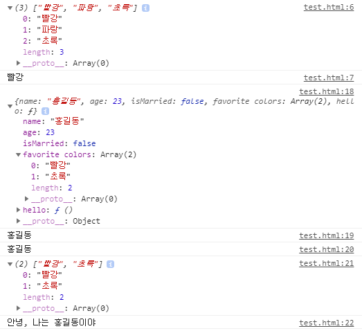
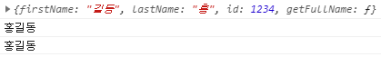

# JavaScript

## 함수

#### 기본 매개변수

p162

호출할 때에는 앞에서부터 채워가기 때문에 기본값을 정의할 때에는 뒤에서부터 채워야 한다.

```javascript
<html>
    <head>
        <script>
            function add (a, b = 0, c = 0) {
                return a + b + c;
            }
            console.log(add(1));
            console.log(add(1, 2));
            console.log(add(1, 2, 3));
        </script>
    </head>
    <body></body>
</html>
```


```
1
3
6
```


```javascript
<html>
    <head>
        <script>
            let sum = function (a, b = 0, c = 0) {
                return a + b + c;
            };
            console.log(sum(1));
            console.log(sum(1, 2));
            console.log(sum(1, 2, 3));
        </script>
    </head>
    <body></body>
</html>
```

익명 함수 표현식


```javascript
<html>
    <head>
        <script>
            let sum = (a, b = 0, c = 0) => {
                return a + b + c;
            };
            console.log(sum(1));
            console.log(sum(1, 2));
            console.log(sum(1, 2, 3));
        </script>
    </head>
    <body></body>
</html>
```

화살표 함수


#### 함수에서의 전개 연산자

p164

마침표 3개(...)를 찍어 표기하는 연산자이다.

함수 또는 배열에 적용할 수 있다.

```javascript
<html>
    <head>
        <script>
            function test(...values) {
                console.log(arguments[0]);  // 1
                console.log(arguments[1]);  // 2
                console.log(arguments[2]);  // 3

                console.log(values[0]);  // 1
                console.log(values[1]);  // 2
                console.log(values[2]);  // 3
            }
            test(1, 2, 3);
        </script>
    </head>
    <body></body>
</html>
```

데이터가 연속적으로 저장되어 있는 객체의 값들이 values에 들어간다. 전개 연산자.


```javascript
<html>
    <head>
        <script>
            function test(a, b, ...values) {
                console.log('a', a);
                console.log('b', b);
                values.forEach(i => console.log('values', i));
            }
            test(1, 2, 3);
            test(1, 2, 3, 4);
            test(1, 2, 3, 4, 5);
        </script>
    </head>
    <body></body>
</html>
```


```
a 1
b 2
values 3
a 1
b 2
values 3
values 4
a 1
b 2
values 3
values 4
values 5
```

고정된 값과 가변 길의의 매개변수를 분리해서 받을 수 있다.

반드시 입력해야 하는 것들은 a, b와 같이 사용. 들어와도 되고 안들어와도 되는 것은 values와 같이 사용


```javascript
<html>
    <head>
        <script>
            function test(a, b, ...values) {
                console.log('a', a);
                console.log('b', b);
                values.forEach(i => console.log('values', i));
            }
            let value = [ 1, 2, 3, 4, 5 ];
            test(value);
        </script>
    </head>
    <body></body>
</html>
```


test라는 함수를 호출하는데 가지고 있는 값이 배열 형태의 데이터를 가지고 있다.

내가 원하는 것은 a에 1, b에 2가 들어가고 3, 4, 5는 values에 넣고싶다.

배열 형태의 파라미터 한 개만 a 매개변수에게 전달된다. a 값으로 배열 전체가 들어간다. b는 파라미터가 undefined


```javascript
<html>
    <head>
        <script>
            function test(a, b, ...values) {
                console.log('a', a);
                console.log('b', b);
                values.forEach(i => console.log('values', i));
            }
            let value = [ 1, 2, 3, 4, 5 ];
            console.log(...value, ...value);
            test(...value, ...value);
            //test(value);
        </script>
    </head>
    <body></body>
</html>
```


배열 형태의 데이터를 풀어서 전달한다.


## 객체

p171

프로그램은 데이터(정보)를 가공하는 것이 대부분이다.

정보를 표현할 때에는 테이블 형태를 자주 사용. 배열. 객체

field, column, 요소

레코드


* 중괄호로 시작해 해당하는 객체의 속성 이름, 속성 값 ...

* 속성 이름에 공백이 들어가면 따옴표(`''`)를 써야한다. 공백이 들어가지 않는 경우에는 따옴표를 쓰지 않아도 된다.
* 객체 내부의 값에 접근하기 위해서는 속성명을 이용하여 접근
* 공백을 포함하는 속성은 `.`으로는 접근할 수 없다. -> 대괄호로 묶어줘야 한다.
* 배열은 index를 이용하고, 객체는 객체 요소에 접근하기 위해서는 속성의 이름을 이용한다.


#### 배열 vs 객체

p171

```javascript
<html>
    <head>
        <script>
            // 배열 요소에 접근하기 위해서는 배열의 인덱스를 이용
            let colors = [ '빨강', '파랑', '초록' ];
            console.log(colors);
            console.log(colors[0]);

            // 객체 요소에 접근하기 위해서는 속성의 이름을 이용
            // 객체에 정의되어 있는 함수를 메소드라고 한다.
            let person = {
                name: '홍길동',
                age: 23,
                'isMarried': false,
                'favorite colors': [ '빨강', '초록' ],
                hello: function () { return "안녕, 나는 홍길동이야"; },
            };
            console.log(person);
            console.log(person.name);
            console.log(person['name']);
            console.log(person['favorite colors']);
            console.log(person.hello());
        </script>
    </head>
    <body></body>
</html>
```





#### 속성과 메서드

```javascript
<html>
    <head>
        <script>
            // 객체 요소에 접근하기 위해서는 속성의 이름을 이용
            // 객체에 정의되어 있는 함수를 메소드라고 한다.
            let person = {
                firstName : "길동",
                lastName : "홍",
                id : 1234,
                getFullName : function() {
                    return this.lastName + this.firstName;
                }
            };
            console.log(person);
            console.log(person.lastName + person.firstName);
            console.log(person.getFullName());
        </script>
    </head>
    <body></body>
</html>
```





* 메소드는 객체 안에 함수로 정의되어 있는 속성이다. 객체 내부의 값들을 이용하는 경우가 많다.

* 객체 내부에서 가지고 있는 값을 참조할 때에는 앞에 해당하는 정보의 위치를 나타내주는 this를 넣어준다.
* this는 person 객체를 나타낸다.
* getFullName 함수에서 this를 사용하지 않으면 오류가 난다.
* this : 객체가 가지고 있는 속성


```javascript
<html>
    <head>
        <script>
            let firstName = "익명";
            let person = {
                firstName : "길동",
                lastName : "홍",
                id : 1234,
                getFullName : function(lastName) {
                    return lastName + firstName;
                }
            };
            console.log(person);
            console.log(person.lastName + person.firstName);
            console.log(person.getFullName("박"));
        </script>
    </head>
    <body></body>
</html>
```


* 만약 해당 함수 내에서 찾고자 하는 변수가 없을 경우 가장 최상위 객체(전역변수)에서 값이 있는지 찾는다.


* 객체가 가질 수 있는 여러가지 성격(데이터)를 정의하고 데이터를 핸들링하는 함수를 제한한다.

* 객체 데이터는 해당 함수를 통해서만 참조, 변경된다.


#### 객체와 반복문

* for in 과 같은 구문을 이용해 객체 내부의 요소들에 접근 가능하다.

* for문과 같이 index를 이용해 접근하는 것은 불가능

* key : 객체가 가지고 있는 속성의 이름

* value : 속성 값

```javascript
<html>
    <head>
        <script>
            let person = {
                firstName : "길동",
                lastName : "홍",
                id : 1234,
                getFullName : function(lastName) {
                    return this.lastName + this.firstName;
                }
            };
            // for in 구문을 이용해서 객체 내부를 출력
            for (let key in person) {
                console.log(`${key} : ${person[key]}`);
            }
        </script>
    </head>
    <body></body>
</html>
```


```javascript
<html>
    <head>
        <script>
            let person = {
                firstName : "길동",
                lastName : "홍",
                id : 1234,
                'favorite color' : [ 'blue', 'yellow' ],
                getFullName : function(lastName) {
                    console.log(this);
                    return this.lastName + this.firstName + this['favorite color'][1];
                }
            };
            console.log(person);
            console.log(person.getFullName());
        </script>
    </head>
    <body></body>
</html>
```


#### 객체 관련 키워드 : in, with

p177

```javascript
<html>
    <head>
        <script>
            let score = {
                C: 80,
                Java: 90,
                Python: 100,
            };
            console.log(`score 객체에 Java 점수 항목이 포함되어 있나요? ${'Java' in score}`);
            console.log(`score 객체에 JavaScript 점수 항목이 포함되어 있나요? ${'JavaScript' in score}`);

            console.log(`C : ${score.C}`);
            console.log(`Java : ${score.Java}`);
            console.log(`Python : ${score.Python}`);

            with(score) {
                console.log(`C : ${C}`);
                console.log(`Java : ${Java}`);
                console.log(`Python : ${Python}`);
            }
        </script>
    </head>
    <body></body>
</html>
```


```
score 객체에 Java 점수 항목이 포함되어 있나요? true
score 객체에 JavaScript 점수 항목이 포함되어 있나요? false
C : 80
Java : 90
Python : 100
C : 80
Java : 90
Python : 100
```

* in : 객체에 해당 요소가 있는지 없는지 확인

* 동일 객체에 대해 참조가 반복해서 일어나는 경우 객체를 지정하지 않도록 해주는 것이 with라는 구문이다.


#### 객체의 속성 추가와 제거

p182

* 객체의 속성들을 마음대로 집어넣을 수 있다.

* 속성이 해당 객체에 있으면 그 속성의 값이 바뀌고, 없으면 해당 객체에 새로운 속성이 추가된다.

```javascript
<html>
    <head>
        <script>
            let score = {
                C: 80,
                Java: 90,
                Python: 100,
            };
            console.log("#1", 'JavaScript' in score);
            console.log(score);
            score.JavaScript = 100;
            score.C = 100;
            console.log("#2", 'JavaScript' in score);
            console.log(score);
        </script>
    </head>
    <body></body>
</html>
```


```javascript
<html>
    <head>
        <script>
            let person = {};

            person.name = '홍길동';
            person.age = 23;
            person.isMarried = false;
            // person 객체가 가지고 있는 모든 속성과 속성값을 반환하는 메소드
            person.toString = function() {
                let output = '';
                for (let key in person) {
                    if(key != 'toString') {
                        output += `${key} : ${person[key]}\n`;                        
                    }
                }
                return output;
            };
            console.log(person.toString());
            delete person.name;
            console.log(person.toString());
            delete(person.isMarried);
            console.log(person.toString());
        </script>
    </head>
    <body></body>
</html>
```


* 아무것도 가지고 있지 않은 빈 객체를 생성하고 속성을 추가할 수 있다.

* delete는 연산자이다. 함수처럼 사용할 수도 있다.

* delete를 이용해 객체가 가지고 있는 속성을 제거할 수 있다.


#### 객체와 배열을 사용한 데이터 관리

```
let students = [];
students.push({ name: 'aaa', korean: 46, math: 65, english: 25, science: 64 });
students.push({ name: 'bbb', korean: 56, math: 63, english: 85, science: 62 });
students.push({ name: 'ccc', korean: 56, math: 63, english: 22, science: 43 });
students.push({ name: 'ddd', korean: 12, math: 25, english: 26, science: 23 });
students.push({ name: 'eee', korean: 18, math: 85, english: 25, science: 25 });
students.push({ name: 'fff', korean: 32, math: 22, english: 79, science: 25 });
students.push({ name: 'ggg', korean: 52, math: 26, english: 42, science: 42 });
students.push({ name: 'hhh', korean: 22, math: 25, english: 41, science: 56 });
students.push({ name: 'iii', korean: 87, math: 79, english: 25, science: 86 });
students.push({ name: 'jjj', korean: 24, math: 42, english: 71, science: 88 });
```

* 해당하는 학생이 가지고 있는 속성과 속성에 해당하는 값들이 배열로 쌓여있다. 배열 이름이 students이다.

* students.push를 하면 객체가 하나씩 쌓인다.(저장된다.)

* 학생별 총점, 평균점을 구하는 메소드 추가

* 학생별 총점, 평균점을 출력

배열 데이터를 하나씩 읽어와서 과목별 점수들의 총점 구하기

객체 안에 총점과 평균을 구하는 함수를 추가하고 추가한 메소드를 이용해 출력. 재사용 측면에서는 함수를 추가하는 것이 좋다.


```javascript
<html>
    <head>
        <script>
            let students = [];
            students.push({ name: 'aaa', korean: 46, math: 65, english: 25, science: 64 });
            students.push({ name: 'bbb', korean: 56, math: 63, english: 85, science: 62 });
            students.push({ name: 'ccc', korean: 56, math: 63, english: 22, science: 43 });
            students.push({ name: 'ddd', korean: 12, math: 25, english: 26, science: 23 });
            students.push({ name: 'eee', korean: 18, math: 85, english: 25, science: 25 });
            students.push({ name: 'fff', korean: 32, math: 22, english: 79, science: 25 });
            students.push({ name: 'ggg', korean: 52, math: 26, english: 42, science: 42 });
            students.push({ name: 'hhh', korean: 22, math: 25, english: 41, science: 56 });
            students.push({ name: 'iii', korean: 87, math: 79, english: 25, science: 86 });
            students.push({ name: 'jjj', korean: 24, math: 42, english: 71, science: 88 });

            // 학생별 총점, 평균점을 구하는 메소드를 추가
            students.forEach(students => {
                console.log(typeof students);
                console.log(students);
                // 총점을 구하는 메소드를 추가
                students.getSum = function() {
                    return this.korean + this.math + this.english + this.science;
                };
                // 평균점을 구하는 메소드를 추가
                students.getAverage = function() {
                    this.getSum() / 4;
                };
            });
            // 학생별 총점, 평균점을 출력
            students.forEach(students => {
                //console.log(`이름 : ${student.name}, 총점 : ${student.getSum()}, 평균 : ${student.getAverage()}`);
                with(students){
                    console.log(`이름 : ${name}, 총점 : ${getSum()}, 평균 : ${getAverage()}`);
                }
            });
        </script>
    </head>
    <body></body>
</html>
```


#### 함수를 사용한 객체 생성

p189

```javascript
<html>
    <head>
        <script>
            function makeStudent(name, korean, math, english, science) {
                let result = {
                    name : name,
                    korean : korean,
                    math : math,
                    english : english,
                    science : science,
                    getSum : function() {
                        return this.korean + this.math + this.english + this.science;
                    },
                    getAverage : function() {
                        return this.getSum() / 4;
                    }
                };
                return result;
            }
            let students = [];
            students.push(makeStudent('aaa', 46, 65, 25, 64));
            students.push(makeStudent('bbb', 56, 63, 85, 62));
            students.push(makeStudent('ccc', 56, 63, 22, 43));
            students.push(makeStudent('ddd', 12, 25, 26, 23));
            students.push(makeStudent('eee', 18, 85, 25, 25));
            students.push(makeStudent('fff', 32, 22, 79, 25));
            students.push(makeStudent('ggg', 52, 26, 42, 42));
            students.push(makeStudent('hhh', 22, 25, 41, 56));
            students.push(makeStudent('iii', 87, 79, 25, 86));
            students.push(makeStudent('jjj', 24, 42, 71, 88));
            students.forEach(student => {
                with(student) {
                    console.log(`이름 : ${name}, 총점 : ${getSum()}, 평균 : ${getAverage()}\n`);
                }
            });
        </script>
    </head>
    <body></body>
</html>
```


#### 옵션 객체 초기화

p192

* 함수의 매개변수로 전달하는 객체를 일반적으로 `옵션 객체`라고 한다.

* 옵션이라는 말은 입력해도 되고, 입력하지 않아도 된다는 의미이다.

* 기본 매개변수처럼 값을 입력하지 않으면 초기화해주는 과정이 필요하다.


```javascript
<html>
    <head>
        <script>
            // test 함수는 obj 객체를 매개변수로 받아들인다.
            function test(obj) {
                with(obj) {
                    console.log(`${valueA} : ${valueB} : ${valueC}`);
                }
            }
            test({ valueA: 52, valueB: 273, valueC: 100 });
        </script>
    </head>
    <body></body>
</html>
```


```
52 : 273 : 100
```


```javascript
<html>
    <head>
        <script>
            // test 함수는 obj 객체를 매개변수로 받아들인다.
            function test(obj) {
                with(obj) {
                    console.log(`${valueA} : ${valueB} : ${valueC}`);
                }
            }
            test({ valueA: 52, valueB: 273 });
        </script>
    </head>
    <body></body>
</html>
```


```
Uncaught ReferenceError: valueC is not defined
    at test (test.html:7)
    at test.html:10
```

만약 초기화해주는 과정이 없을 경우 오류가 발생


```javascript
<html>
    <head>
        <script>
            // test 함수는 obj 객체를 매개변수로 받아들인다.
            function test(obj) {
                obj.valueA = obj.valueA || 0;
                obj.valueB = obj.valueB || 0;
                obj.valueC = obj.valueC || 0;
                with(obj) {
                    console.log(`${valueA} : ${valueB} : ${valueC}`);
                }
            }
            test({ valueA: 52, valueB: 273 });
        </script>
    </head>
    <body></body>
</html>
```


```
52 : 273 : 0
```

일반적으로 짧은 조건문을 사용해 초기화한다.


#### 참조복사와 값복사

p194

* 자바스크립트는 변수에 값이 할당될 때 타입이 결정된다.

* value 타입 : 값 그 자체가 들어가있는 타입

* reference 타입 : 실제 값이 저장되어있는 주소를 가지고 있는 타입


* 배열은 실제 데이터 크기가 어떻게 될지 알 수 없다. 가변적이다. 실제 데이터가 저장되어있는 주소를 가지고 있는 경우가 많다.

* 실제 데이터는 다른 곳에 저장하고 그 데이터의 주소만 저장


* 깊은 복사 : 실제 값이 복사되는 것

* 얕은 복사 : 값이 저장되어 있는 주소 영역을 복사

* 필요에 따라 얕은 복사는 성능에 영향을 준다. 성능이 향상되는 이점이 있다.


* 객체도 얕은 복사가 된다. reference를 넘긴다.

* 배열이나 객체는 일반적인 대입 연산자를 이용해 복사를 하면 값을 넘기는 것이 아니라 주소를 넘긴다.

* new = old; 라고 했을 때 주소가 넘어가는 것이 아니라 새로운 객체를 만들어 독립적이게 복사. (깊은 복사)


p198

```javascript
<html>
    <head>
        <script>
            let oldValue = 10;
            let newValue = oldValue;
            console.log(oldValue, newValue);  // 10, 10

            oldValue = 100;
            console.log(oldValue, newValue);  // 100, 10

            let oldArray = [ 10, 20 ];
            let newArray = oldArray;
            console.log(oldArray, newArray);  // [10, 20] [10, 20]

            oldArray[0] = 100;
            newArray[1] = 999;
            console.log(oldArray, newArray);  // [100, 999] [100, 999]

            let oldObject = { name: 'aaa', age: 50 };
            let newObject = oldObject;
            console.log(oldObject, newObject);

            oldObject.name = 'bbb';
            newObject.age = 30;
            console.log(oldObject, newObject);

            function cloneObject(obj) {
                let output = {};
                for (let key in obj) {
                    output[key] = obj[key];
                }
                return output;
            }
            let oldObject2 = { name: 'xyz', age: 123 };
            let newObject2 = cloneObject(oldObject2);
            //let newObject3 = JSON.parse(JSON.stringify(oldObject2));
            console.log(oldObject2, newObject2);

            oldObject2.name = 'zzz';
            newObject2.age = 999;
            console.log(oldObject2, newObject2);

            function cloneArray(arr) {
                let output = [];
                for (let i of arr){
                    output.push(i);
                }
                return output;
            }
            let oldArray2 = [ 10, 20 ];
            let newArray2 = cloneArray(oldArray2);
            console.log(oldArray2, newArray2);

            oldArray2[0] = 100;
            newArray2[1] = 200;
            console.log(oldArray2, newArray2);
        </script>
    </head>
    <body></body>
</html>
```


#### 전개 연산자를 이용한 배열 테크닉

```javascript
<html>
    <head>
        <script>
            let oldArray = [ 1, 2, 3, 4 ];
            let newArray = [...oldArray];
            console.log(oldArray, newArray);  // [ 1, 2, 3, 4] [1, 2, 3, 4]

            oldArray[0] = 100;
            newArray[1] = 200;
            console.log(oldArray, newArray);  // [ 100, 2, 3, 4 ] [ 1, 200, 3, 4 ]
        </script>
    </head>
    <body></body>
</html>
```


* 전개 연산자를 이용해 배열을 할당하면 깊은 복사가 일어난다. 배열의 값을 복사할 때 for 루프를 돌리지 않아도 된다.


```javascript
<html>
    <head>
        <script>
            // 전개 연산자를 이용한 배열 합병
            let arrayA = [ 1, 2, 3 ];
            let arrayB = [ 'a', 'b', 'c' ];
            let newArray = [ ...arrayA, ...arrayB ];
            console.log(newArray);  // [1, 2, 3, "a", "b", "c"]
        </script>
    </head>
    <body></body>
</html>
```


```javascript
<html>
    <head>
        <script>
            //  전개 연산자를 이용한 객체 깊은 복사
            let objA = { name: 'aaa', age: 10 };
            let objB = { ...objA };
            console.log(objA, objB);    // {name: "aaa", age: 10} {name: "aaa", age: 10}
    
            objA.name = 'bbb';
            objB.age = 100;
            console.log(objA, objB);    // {name: "bbb", age: 10} {name: "aaa", age: 100}
        </script>    
    </head>
    <body></body>
</html>
```


