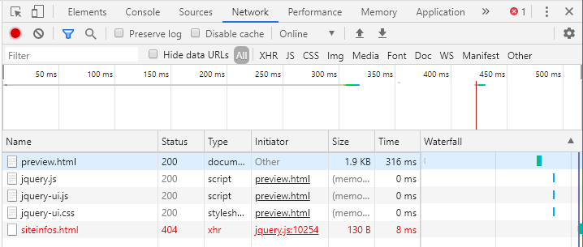

# JavaScript LAB

## 사이트 미리 보기 제작

* jQuery UI에서 제공하는 TAB 위젯을 이용
* 미리 보기 사이트 명과 주소(URL)은 ajax 통신으로 가져오기
* /preview.html => 미리 보기 사이트
* /siteinfo.html ⇒ 미리 보기 사이트 명과 주소를 포함한 JSON 형식의 파일


https://jqueryui.com/tabs/


https://chrome.google.com/webstore/category/extensions?hl=ko

Allow CORS: Access-Control-Allow-Origin 확장 프로그램 설치


### CORS

* Cross-Origin Resource Sharing
* 추가 HTTP 헤더를 사용하여 브라우저에게 한 출처에서 실행중인 웹 응용 프로그램의 다른 출처의 선택된 자원에 대한 접근 권한을 알려주는 메커니즘이다.
* 웹 어플리케이션을 만들다 보면 CORS 문제를 직면할 때가 많다.
* 웹 교차 자원 요청 가능
* SOP 정책을 완화해주는 역할을 한다.


* 브라우저를 통해 보는 웹 페이지가 있다.

* 기본적으로 다 짜집기해서 쓸 수 있지만 보안 때문에 자바스크립트를 이용해 다른 곳에서 가져온 자원은 쓸 수 없도록 만들어두었다.

* 소스코드를 주는 서버와 소스코드에서 다른 사이트에서 가져오는 것과 협약이 되어있어야 쓸 수 있다.

* 자바스크립트 태그 안에서 다른 사이트 자원 가져오기

* 자바스크립트를 이용하여 뭔가를 가져오는 것 ajax 통신으로 한다.

* origin : 스킴 + 호스트 + 포트


XHR(XMLHttpRequest)


SOP : 자바 스크립트 내에서 XHR 객체를 이용하여 다른 기원(origin)의 자원의 사용을 막는 것. 브라우저에 적용되어있는 보안 기술이다.


Access-Control-Allow-Origin 헤더에 어떠한 값을 준다. (대표적으로 *)

이 기원에 대해서 접근을 허용한다. => 브라우저는 가져온 자원을 볼 수 있는지 없는지 판단한 이후에 사용자에게 보여주거나 실행할 수 있다.


### siteinfo.html

```html
{
    "siteinfos" : [
        { name : "jQuery", "URL" : "https://jquery.com/" }, 
        { "name" : "w3school", "URL" : "https://www.w3schools.com/" }, 
        { "name" : "야후", "URL" : "https://www.yahoo.com" }, 
    ]
}
```

* 자바에서는 위와 같이 이름에 따옴표가 없어도 되고, 끝에 쉼표가 있어도 오류가 발생하지 않는다.


* JSON 형식으로 객체를 표현할 때 이름에 따옴표를 하지 않거나, 맨 마지막에  콤마를 찍을 경우 오류 발생


JSON Validator 검색 ⇒ https://jsonformatter.curiousconcept.com/


JSON 포맷에 맞는지 확인 가능하다.


```html
{
    "siteinfos" : [
        { "name" : "jQuery", "URL" : "https://jquery.com/" }, 
        { "name" : "w3school", "URL" : "https://www.w3schools.com/" }, 
        { "name" : "야후", "URL" : "https://www.yahoo.com" }
    ]
}
```

JSON 형식으로 객체를 표현 시 따옴표를 


`dataType: "json"` 서버가 준 데이터를 처리할 때 해당 dataType으로 인식하겠다는 뜻이다.


Status

200 -> 서버는 요청을 잘 처리했다는 것을 확인할 수 있다.

400번대 ->  브라우저에서 잘못 요청한 것. 404는 서버가 가지고 있지 않은 것을 달라고 하는 것이다. URL 틀린 경우 대부분

```javascript
                $.ajax({
                    url: "http://localhost:8080/siteinfos.html",
                    // type: "get",
                    datatype: "json"
                }).done(data => {
                    console.log(data);
                })
```





500번대 -> 만들어서 제공해주는 서버쪽 모듈을 봐야한다. 서버 문제


```javascript
<!DOCTYPE html>
<html>
<head>
    <!-- 필요한 JS 파일과 CSS 파일을 임포트 -->
    <script src="jquery-ui-1.12.1/external/jquery/jquery.js"></script>
    <script src="jquery-ui-1.12.1/jquery-ui.js"></script>
    <link rel="stylesheet" href="jquery-ui-1.12.1/jquery-ui.css">

    <!-- 처리 기능 -->
    <script>
        $(function () {
            /*
            $('#tabs a').click(function() {
                let divid = $(this).attr('href');
                $('#tabs div').hide();
                $('#tabs div'+divid).show();
            });
            */

            //   서버로부터 미리보기(이름, 주소) 정보를 가져와서 출력
            //   참조 => https://api.jquery.com/jquery.ajax/
            $.ajax({
                url: "http://localhost:8080/siteinfo.html",
                /* type: "get", */
                dataType: "json",
            })
            /* 정상적인 경우 */
            .done(data => {
                //console.log(data);
                data.siteinfos.forEach(site => {
                    let name = site.name;
                    let url = site.URL;
                    /* 서버로부터 전달받은 데이터를 이용해서 화면을 구성 */
                    let id=$('li').length + 1;
                    let li = `<li><a href="#tab${id}">${name}</a></li>`;
                    let div = `<div id="tab${id}">탭 내용 ${id}</div>`;

                    $('#tabs > ul').append(li);
                    $('#tabs').append(div);
                });
                //   탭 위젯을 생성
                $('#tabs').tabs();
            })
            /* 예외가 발생한 경우 */
            .fail(function (jqXHR, textStatus, errorThrown) {
                console.log(errorThrown);
            });

            $('a').click(function() {
                let href = $(this).attr("href");
                console.log(href);
            })
        });
    </script>
</head>
<body>
    <!-- 탭 UI를 적용할 태그 -->
    <div id="tabs">
        <!-- 탭 제목 -->
        <ul>
            <li><a href="#tab1">탭제목1</a></li>
            <li><a href="#tab2">탭제목2</a></li>
        </ul>
        <!-- 탭 본문 -->
        <div id="tab1">탭 내용 1</div>
        <div id="tab2">탭 내용 2</div>
    </div>
</body>
</html>
```

탭제목1, 탭제목2 탭을 클릭하면 콘솔에 해당 탭 이름이 출력되는는데, 다른 탭을 클릭하면 출력되지 않는다. 

코드를 읽을 때 생성된 것들이 아닌 ajax를 통해 가져온 정보를 이용하여 자바 스크립트를 이용해 동적으로 만든 것들은 이벤트 핸들링이 불가능하다.

새롭게 추가되는 것에도 동일한 이벤트 핸들링이 적용되기 하기 위해서는 `on`이라는 메소드를 이용해야한다.

동적으로 생성되는 컨텐츠에 대해서 이벤트를 붙인다.


```javascript
<!DOCTYPE html>
<html>
<head>
    <!-- 필요한 JS 파일과 CSS 파일을 임포트 -->
    <script src="jquery-ui-1.12.1/external/jquery/jquery.js"></script>
    <script src="jquery-ui-1.12.1/jquery-ui.js"></script>
    <link rel="stylesheet" href="jquery-ui-1.12.1/jquery-ui.css">

    <!-- 처리 기능 -->
    <script>
        $(function () {
            /*
            $('#tabs a').click(function() {
                let divid = $(this).attr('href');
                $('#tabs div').hide();
                $('#tabs div'+divid).show();
            });
            */

            //   서버로부터 미리보기(이름, 주소) 정보를 가져와서 출력
            //   참조 => https://api.jquery.com/jquery.ajax/
            $.ajax({
                url: "http://localhost:8080/siteinfo.html",
                /* type: "get", */
                dataType: "json",
            })
            /* 정상적인 경우 */
            .done(data => {
                //console.log(data);
                data.siteinfos.forEach(site => {
                    let name = site.name;
                    let url = site.URL;
                    /* 서버로부터 전달받은 데이터를 이용해서 화면을 구성 */
                    let id=$('li').length + 1;
                    let li = `<li><a href="#tab${id}">${name}</a></li>`;
                    let div = `<div id="tab${id}">탭 내용 ${id}</div>`;

                    $('#tabs > ul').append(li);
                    $('#tabs').append(div);
                });
                //   탭 위젯을 생성
                $('#tabs').tabs();
            })
            /* 예외가 발생한 경우 */
            .fail(function (jqXHR, textStatus, errorThrown) {
                console.log(errorThrown);
            });
            /*
            $('a').click(function() {
                let href = $(this).attr("href");
                console.log(href);
            });
            */
            $('#tabs').on('click', 'a', function() {
                let href = $(this).attr("href");
                console.log(href);
            });
        });
    </script>
</head>
<body>
    <!-- 탭 UI를 적용할 태그 -->
    <div id="tabs">
        <!-- 탭 제목 -->
        <ul>
            <li><a href="#tab1">탭제목1</a></li>
            <li><a href="#tab2">탭제목2</a></li>
        </ul>
        <!-- 탭 본문 -->
        <div id="tab1">탭 내용 1</div>
        <div id="tab2">탭 내용 2</div>
    </div>
</body>
</html>
```


```javascript
<!DOCTYPE html>
<html>
<head>
    <!-- 필요한 JS 파일과 CSS 파일을 임포트 -->
    <script src="jquery-ui-1.12.1/external/jquery/jquery.js"></script>
    <script src="jquery-ui-1.12.1/jquery-ui.js"></script>
    <link rel="stylesheet" href="jquery-ui-1.12.1/jquery-ui.css">

    <!-- 처리 기능 -->
    <script>
        $(function () {
            /*
            $('#tabs a').click(function() {
                let divid = $(this).attr('href');
                $('#tabs div').hide();
                $('#tabs div'+divid).show();
            });
            */

            //   서버로부터 미리보기(이름, 주소) 정보를 가져와서 출력
            //   참조 => https://api.jquery.com/jquery.ajax/
            $.ajax({
                url: "http://localhost:8080/siteinfo.html",
                /* type: "get", */
                dataType: "json",
            })
            /* 정상적인 경우 */
            .done(data => {
                //console.log(data);
                data.siteinfos.forEach(site => {
                    let name = site.name;
                    let url = site.URL;
                    /* 서버로부터 전달받은 데이터를 이용해서 화면을 구성 */
                    let id=$('li').length + 1;
                    let li = `<li><a href="#tab${id}" url="${url}">${name}</a></li>`;
                    let div = `<div id="tab${id}">탭 내용 ${id}</div>`;

                    $('#tabs > ul').append(li);
                    $('#tabs').append(div);
                });
                //   탭 위젯을 생성
                $('#tabs').tabs();
            })
            /* 예외가 발생한 경우 */
            .fail(function (jqXHR, textStatus, errorThrown) {
                console.log(errorThrown);
            });
            /*
            $('a').click(function() {
                let href = $(this).attr("href");
                console.log(href);
            });
            */
            $('#tabs').on('click', 'a', function() {
                let href = $(this).attr("href");
                let url = $(this).attr("url");
                //console.log(href);
                //console.log(url);
                $(href).load(url);
            });
            $('a:first').trigger('click');
        });
    </script>
</head>
<body>
    <!-- 탭 UI를 적용할 태그 -->
    <div id="tabs">
        <!-- 탭 제목 -->
        <ul>
        </ul>
        <!-- 탭 본문 -->
    </div>
</body>
</html>
```


