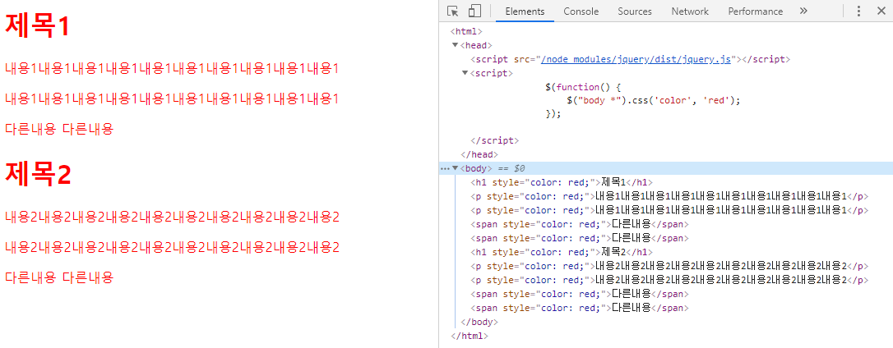

# jQuery

## 기본

#### 개요

* jQuery
  * 모든 브라우저에서 동작하는 클라이언트 자바스크립트 라이브러리
  * 2006년 1월, 존 레식(John Resig)이 BarCamp NYC에서 발표
  * 무료로 사용 가능한 오픈 소스 라이브러리
  * jQuery는 다음 기능을 위해 제작됨
    * 문서 객체 모델과 관련된 처리를 쉽게 구현
    * 일관된 이벤트 연결을 쉽게 구현
    * 시각적 효과를 쉽게 구현
    * ajax 애플리케이션을 쉽게 개발
  * 다운로드 => https://jquery.com/download/


* 어떤 행위가 발생하면 알려주는 것을 이벤트라고 한다.

* 이벤트가 브라우저마다 약간씩 다른데 시각적 효과를 구현하기 위해서는 스타일이라는 것을 다뤄야 한다.

* 스타일을 쉽게 구현할 수 있도록 하고 싶었다.

* ajax는 화면이 움직이는 것이 아니라 클라이언트에 내려가 있는 화면에서 자바스크립트를 이용해 서버쪽으로 요청한다. 서버 쪽에서는 요청에 대한 응답을 자바스크립트 쪽에 주는데 데이터만 간다.

* 화면에 출력될 데이터만 서버에서 만들어서 준다. 그것을 가능하게 하는 것이 ajax 이다.

* 사용자와 서버간 양방향 인터렉션 -> web 2.0 기술 (ajax라는 통신 기술과 DOM을 이용한 랜더링 기술)


#### CDN 사용

* CDN : 사용자에게 간편하게 콘텐츠를 제공하는 방식

Google CDN 클릭

https://developers.google.com/speed/libraries#jquery


3.x snippet 아래쪽 복사 -> html 파일에 붙여넣기

```html
<script src="https://ajax.googleapis.com/ajax/libs/jquery/3.4.1/jquery.min.js"></script>
```


#### 설치해서 사용

cmd

```bash
C:\Users\HPE>cd /
C:\>cd javascript
C:\javascript>npm install jquery
npm notice created a lockfile as package-lock.json. You should commit this file.
npm WARN javascript@1.0.0 No description
npm WARN javascript@1.0.0 No repository field.

+ jquery@3.4.1
added 1 package from 1 contributor and audited 1 package in 0.548s
found 0 vulnerabilities
```


소스코드에 추가

```html
<script src="/node_modules/jquery/dist/jquery.js"></script>
```


```javascript
<html>
    <head>
        <script src="/node_modules/jquery/dist/jquery.js"></script>
        <script>
            // 문서가 준비되면 매개변수로 전달한 콜백 함수를 실행하라는 의미
            $(document).ready(function() {
                console.log("Hello jQuery");
                $("body").text("Hello jQuery");
            });
        </script>
    </head>
    <body></body>
</html>
```


```javascript
<html>
    <head>
        <script src="/node_modules/jquery/dist/jquery.js"></script>
        <script>
            // 문서가 준비되면 매개변수로 전달한 콜백 함수를 실행하라는 의미
            window.onload = () => {
                console.log("loaded");
            };
            jQuery(document).ready(function() {
                console.log("jQuery(document).ready(...) 사용");
            });
            $(document).ready(function() {
                console.log("$(document).ready(...) 사용");
            });
            jQuery(function() {
                console.log("jQuery(...) 사용");
            });
            $(function() {
                console.log("$(...) 사용");
            });
        </script>
    </head>
    <body></body>
</html>
```


p417

window.jQuery = window.$ = jQuery;


#### 선택자(Selector)

selector(선택자) : 액션을 수행하려 할 때 그 위치를 찾는 것. DOM에서 특정 위치를 지정(선택)하기 위한 것

CSS의 selector와 거의 유사하다.


* **$("*")** => 전체 선택자, all selector
* **$(".class")** => 클래스 선택자
* **$("#id")** => 아이디 선택자
* **$("element")** => 요소(태그, element) 선택자
* **$("selector1, selector2, ... , selectorN")** => 다중 선택자(multiple selector)


`<h1>`은 block 요소이다.

block 요소 : 특별하게 지정하지 않으면 이 내용이 화면 전체에 다 안차더라도 다른 내용이 못들어오도록 한다.(한 줄을 다 차지한다.)

`<p></p>` 태그는 뒤에 공간이 남아도 다음 줄로 넘어가지만,

`<span></span>` 태그는 뒤에 공간이 남으면 계속 이어서 쓴다.


```javascript
<html>
    <head>
        <script src="/node_modules/jquery/dist/jquery.js"></script>
        <script>
            $(function() {
            });
        </script>
    </head>
    <body>
        <h1>제목1</h1>
        <p>내용1내용1내용1내용1내용1내용1내용1내용1내용1내용1</p>
        <p>내용1내용1내용1내용1내용1내용1내용1내용1내용1내용1</p>
        <span>다른내용</span>
        <span>다른내용</span>
        <h1>제목2</h1>
        <p>내용2내용2내용2내용2내용2내용2내용2내용2내용2내용2</p>
        <p>내용2내용2내용2내용2내용2내용2내용2내용2내용2내용2</p>
        <span>다른내용</span>
        <span>다른내용</span>
    </body>
</html>
```


```javascript
<html>
    <head>
        <script src="/node_modules/jquery/dist/jquery.js"></script>
        <script>
            $(function() {
                $("*").css('color', 'red');
            });
        </script>
    </head>
    <body>
        <h1>제목1</h1>
        <p>내용1내용1내용1내용1내용1내용1내용1내용1내용1내용1</p>
        <p>내용1내용1내용1내용1내용1내용1내용1내용1내용1내용1</p>
        <span>다른내용</span>
        <span>다른내용</span>
        <h1>제목2</h1>
        <p>내용2내용2내용2내용2내용2내용2내용2내용2내용2내용2</p>
        <p>내용2내용2내용2내용2내용2내용2내용2내용2내용2내용2</p>
        <span>다른내용</span>
        <span>다른내용</span>
    </body>
</html>
```

문서 전체 모든 태그


`Select an element~` 버튼 클릭 -> 브라우저 화면 클릭


```javascript
<html>
    <head>
        <script src="/node_modules/jquery/dist/jquery.js"></script>
        <script>
            $(function() {
            	// 후손 선택자
                $("body *").css('color', 'red');
            });
        </script>
    </head>
    <body>
        <h1>제목1</h1>
        <p>내용1내용1내용1내용1내용1내용1내용1내용1내용1내용1</p>
        <p>내용1내용1내용1내용1내용1내용1내용1내용1내용1내용1</p>
        <span>다른내용</span>
        <span>다른내용</span>
        <h1>제목2</h1>
        <p>내용2내용2내용2내용2내용2내용2내용2내용2내용2내용2</p>
        <p>내용2내용2내용2내용2내용2내용2내용2내용2내용2내용2</p>
        <span>다른내용</span>
        <span>다른내용</span>
    </body>
</html>
```

body 아래에 있는 모든 태그





```javascript
        <script>
            $(function() {
                // H1 태그에 대해서 배경색을 부여
                // 요소 선택자(element selector)
                $("H1").css('background', 'yellow');
            });
        </script>
```


```javascript
<html>
    <head>
        <script src="/node_modules/jquery/dist/jquery.js"></script>
        <script>
            $(function() {
                // H1 태그에 대해서 배경색을 부여
                // 요소 선택자(element selector)
                $("H1").css('background', 'yellow');

                // ID 선택자 => 해당 문서에서 유일해야 함
                $("#title").css('border', '1px solid red');
            });
        </script>
    </head>
    <body>
        <h1>제목1</h1>
        <p>내용1내용1내용1내용1내용1내용1내용1내용1내용1내용1</p>
        <p>내용1내용1내용1내용1내용1내용1내용1내용1내용1내용1</p>
        <span>다른내용</span>
        <span>다른내용</span>
        <h1 id="title">제목2</h1>
        <p>내용2내용2내용2내용2내용2내용2내용2내용2내용2내용2</p>
        <p>내용2내용2내용2내용2내용2내용2내용2내용2내용2내용2</p>
        <span>다른내용</span>
        <span>다른내용</span>
    </body>
</html>
```


```javascript
<html>
    <head>
        <script src="/node_modules/jquery/dist/jquery.js"></script>
        <script>
            $(function() {
                // H1 태그에 대해서 배경색을 부여
                // 요소 선택자(element selector)
                $("H1").css('background', 'yellow');

                // ID 선택자 => 해당 문서에서 유일해야 함
                $("#title").css('border', '1px solid red');

                // 클래스 선택자
                $(".right").css('textAlign', 'right');

                // 다중 선택자
                $("span, #title, .right").css('text-decoration', 'underline');
            });
        </script>
    </head>
    <body>
        <h1 class="right">제목1</h1>
        <p>내용1내용1내용1내용1내용1내용1내용1내용1내용1내용1</p>
        <p>내용1내용1내용1내용1내용1내용1내용1내용1내용1내용1</p>
        <span>다른내용</span>
        <span>다른내용</span>
        <h1 id="title">제목2</h1>
        <p class="right">내용2내용2내용2내용2내용2내용2내용2내용2내용2내용2</p>
        <span>다른내용</span>
        <span>다른내용</span>
    </body>
</html>
```


```javascript
<html>
    <head>
        <script src="/node_modules/jquery/dist/jquery.js"></script>
        <script>
            window.onload = () => {
                let ptags = document.getElementsByTagName("p");
                for (let p of ptags) {
                    p.innerText = 'ptags';
                }
                
                let title = document.getElementById("title");
                title.style.borderWidth = '3px';
                title.style.borderStyle = 'dotted';
                title.style.borderColor = 'blue';
                
                let rights = document.getElementsByClassName("right");
                for (r of rights) {
                    r.style.textAlign = "center";
                }
            }; 
        </script>
    </head>
    <body>
        <h1 class="right">제목1</h1>
        <p>내용1내용1내용1내용1내용1내용1내용1내용1내용1내용1내용1</p>
        <p>내용1내용1내용1내용1내용1내용1내용1내용1내용1내용1내용1</p>
        <span>다른내용</span>
        <span>다른내용</span>
        <h1 id="title">제목2</h1>
        <p class="right">내용2내용2내용2내용2내용2내용2내용2내용2내용2</p>
        <span>다른내용</span>
        <span>다른내용</span>
    </body>
</html>
```

jQuery를 사용하지 않고 태그 스타일 변경


#### 자식 선택자, 후손 선택자

p423

구글에서 jquery selector 검색

https://api.jquery.com/category/selectors/

=> Child Selector


* 자식 선택자 ⇒ $("parent > child")
* 후손 선택자 ⇒ $("parent child")


* body 밑에 있는 모든 태그들은 후손
* body 바로 밑에 있는 태그는 자식


* DOM (Document Object Model)
  * 트리의 자료구조로 구성
  * 객체 지향 모델로서 구조화된 문서를 표현하는 방식


```javascript
<html>
    <head>
        <script src="/node_modules/jquery/dist/jquery.js"></script>
        <script>
            $(function() {
                $("div *").css('color', 'blue');  // div 아래에 있는 모든 것을 가져온다.
                $("div ul").css('background', 'yellow');
                $("div > ul").css('border', '1px solid red');
            })
        </script>
    </head>
    <body>
        <div>
            <ul>
                <li>삼각형</li>
                <li>사각형</li>
                <li>오각형</li>
                <ul>
                    <li>333</li>
                    <li>444</li>
                    <li>555</li>
                </ul>
            </ul>
            <ol>
                <li>첫번째</li>
                <li>두번째</li>
                <li>세번째</li>
            </ol>
        </div>
    </body>
</html>
```


text-decoration 속성은 상위 태그 속성에서 상속받아 내려온다.

`>`를 주면 바로 밑에 있는 것에 적용


```javascript
<html>
<head>
    <script src="/node_modules/jquery/dist/jquery.js"></script>
    <script>
        $(function() {
            //  ID가 menu인 ul 태그 아래 있는 모든 li 태그의 값 색깔을 파란색으로 설정
            $("ul#menu li").css('color', 'blue');
            
            //  ID가 menu인 ul 태그 바로 아래 있는 li 태그의 값에 대해 밑줄을 출력
            $("ul#menu > li").css('border', '1px solid red');
        });
    </script>
</head>
<body>
    <div>
        <ul id="menu">
            <li>첫번째</li>
            <li>두번째</li>
            <li>세번째
                <ul>
                    <li>3-1</li>
                    <li>3-2</li>
                    <li>3-3</li>
                </ul>
            </li>
            <li>네번째</li>
        </ul>
    </div>
</body>
</html>
```


#### 속성 선택자

p425

```javascript
<html>
<head>
    <script src="/node_modules/jquery/dist/jquery.js"></script>
    <script>
        $(function() {
            // 속성 선택자
            // ${"엘리먼트이름[속성이름='속성값']")
            // <form> 아래에서 사용하는 사용자 입력을 처리하는 태그를 제어할 때 사용
            // <input type="text"> <input type="number"> <input type="radio"> ...
            $('ul[id="submenu"] li').css('color', 'red');
            $('ul#submenu li').css('background', 'yellow');
        });
    </script>
</head>
<body>
    <div>
        <!--
            <태그명 속성명="속성값" 속성명="속성값">태그값</태그명>
            태그 => element
            속성 => attribute
        -->
        <ul id="menu">
            <li>첫번째</li>
            <li>두번째</li>
            <li>세번째
                <ul id="submenu">
                    <li>3-1</li>
                    <li>3-2</li>
                    <li>3-3</li>
                </ul>
            </li>
            <li>네번째</li>
        </ul>
    </div>
</body>
</html>
```

submenu에 있는 항목들만 색이 바뀐다.


